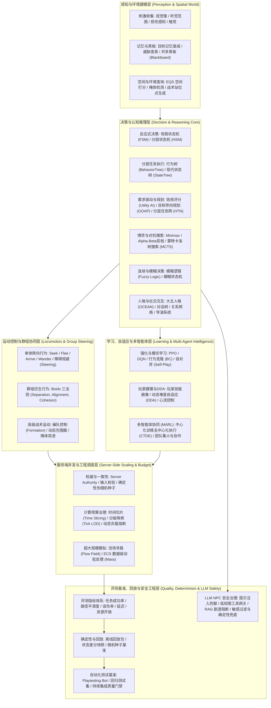
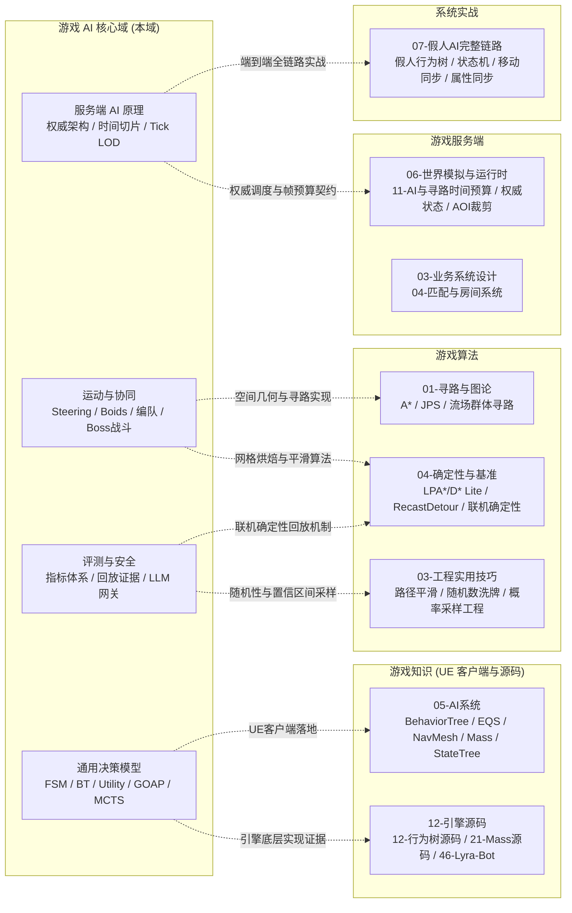

# 游戏 AI Domain MOC

> 知识成熟度：L2（导航关系已按实际目录、16 篇核心专题与跨域工程依赖核对）。

> 本域主责：通用游戏人工智能的**认知决策模型**（FSM/BT/Utility/GOAP/MCTS/Fuzzy）、**移动与群组行为**（Steering/Boids/编队）、**学习与自适应**（RL/MARL/DDA）、**服务端大规模 AI 调度与时间预算**、以及**评测体系、确定性回放与 LLM NPC 安全治理**。
>
> 引擎实现、底层数值/寻路算法与端到端战局实战由相邻领域承接，严格遵循单一事实源原则：
> - 虚幻引擎客户端 AI 组件（AIPerception、EQS、NavMesh、MassEntity、StateTree、SmartObjects、VisualLogger）由 [游戏知识 (05-AI系统)](游戏知识.md) 承接；
> - 底层图搜索、A* / JPS、Recast/Detour 导航网格烘焙、流场算法与随机采样由 [游戏算法](游戏算法.md) 承接；
> - 权威服务器世界模拟、AOI 裁剪、主循环分帧与时间切片由 [游戏服务端](游戏服务端.md) 承接；
> - 工业级假人 Bot 完整业务闭环由 [系统实战](../../系统实战/README.md)（假人 AI 链路）承接。

---

## 游戏 AI 技术全景分层

---

## 推荐学习路径（按工程角色）

### 1. Gameplay / 客户端 AI 工程师（战斗与单体行为表现）
- **核心目标**：实现反应敏捷、表现生动、走位合理且具备良好玩家对抗体验的怪兽、NPC 与 Boss。
- **推荐路径**：
  1. [01-01 AI总体架构与感知](../../游戏AI/01-决策与架构/01-AI总体架构与感知.md)：理解“感知-决策-行动”三层闭环与黑板契约。
  2. [01-02 状态机与层次状态机](../../游戏AI/01-决策与架构/02-状态机与层次状态机.md) 与 [01-03 行为树通用原理](../../游戏AI/01-决策与架构/03-行为树通用原理.md)：掌握经典分层决策模型。
  3. [02-01 移动与群组行为](../../游戏AI/02-移动学习与服务端/01-移动与群组行为.md)：实现基础转向、到达、避障与编队移动。
  4. [02-02 战斗与Boss设计](../../游戏AI/02-移动学习与服务端/02-战斗与Boss设计.md)：深入仇恨算法、技能选择、阶段转换与战斗节奏调控。
  5. 落地 UE 引擎层：结合 [UE 行为树详解](../../游戏知识/05-AI系统/01-行为树详解.md)、[感知与EQS](../../游戏知识/05-AI系统/02-感知系统与EQS.md)、[NavMesh寻路](../../游戏知识/05-AI系统/03-NavMesh寻路.md) 与 [StateTree与GAS协同](../../游戏知识/05-AI系统/07-GameplayTasks-StateTree-GAS-AI协同.md)。

### 2. 服务端 / MMO 大规模 AI 工程师（权威执行与海量高吞吐）
- **核心目标**：在有限的 CPU 帧预算（如单帧 5ms）内支撑上万同屏怪物的权威决策、寻路与战斗判定。
- **推荐路径**：
  1. [02-04 服务端AI与性能](../../游戏AI/02-移动学习与服务端/04-服务端AI与性能.md)：掌握权威架构、分帧时间片、Tick 预算与 LOD 降频。
  2. [02-01 移动与群组行为](../../游戏AI/02-移动学习与服务端/01-移动与群组行为.md)：万人军团下的流场（Flow Field）与空间网格优化。
  3. [02-02 战斗与Boss设计](../../游戏AI/02-移动学习与服务端/02-战斗与Boss设计.md)：服务端仇恨衰减表、视线检查缓存与无损技能校验。
  4. 跨域联动：深入 [游戏服务端 06-11 AI与寻路时间预算](../../游戏服务端/06-世界模拟与运行时/11-AI与寻路时间预算.md)、[游戏算法 01-03 流场与群体寻路](../../游戏算法/01-寻路与图论/03-流场与群体寻路.md) 与 [系统实战 07 假人AI完整链路](../../系统实战/07-假人AI完整链路.md)。

### 3. 智能体算法 / 强化学习工程专家（博弈对战与自适应）
- **核心目标**：研发具备高度自适应、战略推演、战术协同或高水平对战能力的智能体系统。
- **推荐路径**：
  1. [01-05 博弈搜索与对战AI](../../游戏AI/01-决策与架构/05-博弈搜索与对战AI.md)：精通 Minimax、Alpha-Beta 剪枝与 MCTS 评估函数设计。
  2. [02-03 学习型AI](../../游戏AI/02-移动学习与服务端/03-学习型AI.md)：掌握 RL（PPO/DQN）与模仿学习在游戏中的工程集成界限。
  3. [02-05 玩家建模与自适应难度](../../游戏AI/02-移动学习与服务端/05-玩家建模与自适应难度.md)：构建玩家特征提取、心流区间维持与 DDA 控制器。
  4. [02-06 多智能体协作与强化学习](../../游戏AI/02-移动学习与服务端/06-多智能体协作与强化学习.md)：攻克团队协作、CTDE 范式与多智能体通信瓶颈。

### 4. AI 质量保障与自动化测试工程师（指标、基准与压测）
- **核心目标**：建立 AI 系统发布质量门禁，利用自动化 Bot 替代人工完成回归、压测与平衡性评估。
- **推荐路径**：
  1. [03-01 AI评测回放](../../游戏AI/03-评测与安全/01-AI评测回放.md)：掌握万字级核心规范，建立 10 大评测指标矩阵、回放证据链与门禁阈值。
  2. [03-02 自动测试玩家与AI回归基准](../../游戏AI/03-评测与安全/02-自动测试玩家与AI回归基准.md)：构建 Playtesting Bot、场景样本集与回归测试 Harness。
  3. 跨域联动：结合 [游戏测试与质量 03-服务端测试与机器人压测](../../游戏测试与质量/03-服务端测试与机器人压测.md) 与 [游戏算法 04-05 联机确定性](../../游戏算法/04-确定性与基准工程/05-联机确定性与基准工程.md)。

### 5. LLM NPC 与生成式 AI 研发工程师（叙事交互与安全护栏）
- **核心目标**：将大模型接入开放世界 NPC 对话与行为，兼顾生动的角色人设、强叙事约束与绝对安全合规。
- **推荐路径**：
  1. [01-07 NPC人格对话与社交AI](../../游戏AI/01-决策与架构/07-NPC人格对话与社交AI.md)：大五人格建模、情绪状态机、好感度系统与传统对话树架构。
  2. [03-03 LLM-NPC安全](../../游戏AI/03-评测与安全/03-LLM-NPC安全.md)：攻克提示注入防御、低权限工具网关、RAG 知识与剧透边界、敏感内容与人工兜底。
  3. 联动回放门禁：利用 [03-01 AI评测回放](../../游戏AI/03-评测与安全/01-AI评测回放.md) 对大模型输出进行自动化安全对抗样本评测。

---

## 核心决策模型横向选型指南

游戏 AI 不存在“万能模型”，核心在于根据**项目类型、决策复杂度、维护成本、策划协作要求与计算预算**进行技术组合：

| 决策技术 | 核心原理 | 适用场景 | 优势 | 劣势与挑战 | 经典工业案例 | 关联专题 |
| :--- | :--- | :--- | :--- | :--- | :--- | :--- |
| **FSM / HSM** | 状态 + 转移条件 | 状态少、逻辑线性的单体（门/陷阱/Boss阶段） | 直观简单、性能极高、确定性强 | 状态组合爆炸（$O(N^2)$）、难以并行复用 | 经典格斗游戏、Boss 阶段机 | [01-02](../../游戏AI/01-决策与架构/02-状态机与层次状态机.md) |
| **行为树 (BT)** | 树状任务遍历（选择/顺序/并行/装饰） | 绝大多数现代 3D 动作与开放世界 NPC | 模块化强、策划友好、易于可视化与调试 | 状态保存在黑板（易混乱）、高频遍历开销 | 虚幻引擎原生 AI、Halo 系列 | [01-03](../../游戏AI/01-决策与架构/03-行为树通用原理.md) |
| **效用 AI (Utility)** | 连续曲线数学评分，动态择优 | 开放世界生活化市民、模拟经营、多需求冲突决策 | 决策极平滑、避免二值震荡、自然产生意图涌现 | 曲线参数调校难度大、行为预测性较差 | 模拟人生 (The Sims)、无限狂暴 (Killzone) | [01-04](../../游戏AI/01-决策与架构/04-Utility与GOAP.md) |
| **GOAP / HTN** | A* 逆向搜索目标规划 / 分层任务分解 | 策略复杂、多手段完成同一目标的战术 NPC | 解耦行为与意图、智能体自主生成方案 | 规划搜索开销不确定、调试困难、策划不易控制 | 极度恐慌 (F.E.A.R.)、地平线系列 | [01-04](../../游戏AI/01-决策与架构/04-Utility与GOAP.md) |
| **StateTree** | 分层状态机与状态树融合（UE5 现代规范） | 移动端轻量 AI、Mass 海量群集、状态明确的伴随 NPC | 内存占用极小、Tick 效率极高、与 ECS/GAS 原生打通 | 生态相对较新、复杂行为层级设计要求高 | UE5 Matrix 城市模拟、Lyra 示例 | [UE 05-05](../../游戏知识/05-AI系统/05-StateTree状态树.md) |
| **博弈搜索 (MCTS/Minimax)** | 树搜索 + 估值函数 + 剪枝 | 棋牌回合制、网格战棋、完全信息对弈 | 战略前瞻性强、数学收敛性好、可调难度 | 依赖确定性与离散步长、实时动作游戏不可用 | 国际象棋引擎、AlphaGo、策略战棋 | [01-05](../../游戏AI/01-决策与架构/05-博弈搜索与对战AI.md) |
| **模糊逻辑 (Fuzzy)** | 隶属度函数 + 模糊推理规则 | 动态战场威胁评估、连续油门/转向控制 | 容忍测量误差、输出平滑连续、契合人类模糊判断 | 规则库多时推理变慢、非线性调试繁琐 | 赛车游戏驾驶 AI、FPS 战局态势评估 | [01-06](../../游戏AI/01-决策与架构/06-模糊逻辑与连续决策.md) |
| **强化学习 (RL)** | 环境交互 + 奖励信号驱动策略优化 | 复杂微操、自动对战陪练、黑盒平衡性探索 | 可超越人类策略上限、发现非常规打法 | 训练成本极高、不可解释、黑盒不可控、线上易失控 | OpenAI Five (Dota 2)、星际争霸 AlphaStar | [02-03](../../游戏AI/02-移动学习与服务端/03-学习型AI.md) |
| **LLM 生成式决策** | 语言模型推理 + 外部工具调用 (Agent) | 开放世界沉浸式叙事 NPC、自由度文本探案 | 自由表达力极强、即兴对话生动逼真 | 幻觉、不可控、推理延迟高（数秒）、注入安全风险 | 斯坦福虚拟小镇 (Generative Agents) | [01-07](../../游戏AI/01-决策与架构/07-NPC人格对话与社交AI.md) / [03-03](../../游戏AI/03-评测与安全/03-LLM-NPC安全.md) |

---

## 游戏 AI 全域 16 篇核心专题矩阵

### 子域 01：决策与架构（7 篇）

| 专题文件（Canonical 路径） | 知识类型 | 成熟度 | 核心工程关注点与落地场景 |
| :--- | :---: | :---: | :--- |
| [01-AI总体架构与感知.md](../../游戏AI/01-决策与架构/01-AI总体架构与感知.md) | Architecture | L2 | 感知-决策-行动分层模型、视觉锥/听觉衰减实现、黑板契约与主循环更新频率 |
| [02-状态机与层次状态机.md](../../游戏AI/01-决策与架构/02-状态机与层次状态机.md) | Mechanism | L2 | 经典 FSM 状态转换表、HSM 状态继承与复用、历史状态恢复、Boss 三阶段转换实战 |
| [03-行为树通用原理.md](../../游戏AI/01-决策与架构/03-行为树通用原理.md) | Mechanism | L2 | Composite（选择/顺序/并行）、Decorator 条件打断（Lower Priority/Both）、Task 契约与反模式 |
| [04-Utility与GOAP.md](../../游戏AI/01-决策与架构/04-Utility与GOAP.md) | Comparison | L2 | 效用响应曲线拟合、GOAP 状态空间与 A* 逆向规划、HTN 分层任务网络分解与工业选型 |
| [05-博弈搜索与对战AI.md](../../游戏AI/01-决策与架构/05-博弈搜索与对战AI.md) | Mechanism | L2 | Minimax 极大极小搜索、Alpha-Beta 剪枝优化、MCTS 蒙特卡洛树选择/展开/模拟/反向传播 |
| [06-模糊逻辑与连续决策.md](../../游戏AI/01-决策与架构/06-模糊逻辑与连续决策.md) | Mechanism | L2 | 隶属度函数（三角形/梯形）、模糊规则库推理（Mamdani）、去模糊化（重心法）与威胁评估 |
| [07-NPC人格对话与社交AI.md](../../游戏AI/01-决策与架构/07-NPC人格对话与社交AI.md) | Architecture | L2 | 大五人格 OCEAN 映射、情绪模型与衰减、好感度/声望网络、对话树打断恢复与导演系统 |

### 子域 02：移动学习与服务端（6 篇）

| 专题文件（Canonical 路径） | 知识类型 | 成熟度 | 核心工程关注点与落地场景 |
| :--- | :---: | :---: | :--- |
| [01-移动与群组行为.md](../../游戏AI/02-移动学习与服务端/01-移动与群组行为.md) | Mechanism | L2 | Reynolds 转向行为（Seek/Flee/Arrive/Wander）、Boids 群聚三法则、编队控制与防挤堆避障 |
| [02-战斗与Boss设计.md](../../游戏AI/02-移动学习与服务端/02-战斗与Boss设计.md) | BestPractice | L2 | 仇恨列表（Damage/Heal/Distance 加权与衰减）、动态包围圈槽位、Boss 技能发号施令与战斗节奏 |
| [03-学习型AI.md](../../游戏AI/02-移动学习与服务端/03-学习型AI.md) | Tutorial | L2 | 游戏强化学习（RL）工程落地框架、状态/动作空间设计、奖励函数陷阱、模仿学习与商业化边界 |
| [04-服务端AI与性能.md](../../游戏AI/02-移动学习与服务端/04-服务端AI与性能.md) | Architecture | L2 | 服务端权威判定、单帧时间切片分帧（Time Slicing）、距离与可见性 LOD 降频、海量流场寻路 |
| [05-玩家建模与自适应难度.md](../../游戏AI/02-移动学习与服务端/05-玩家建模与自适应难度.md) | Mechanism | L2 | 玩家操作水平特征提取、心流区间维持、动态难度自适应（DDA）控制器、隐式帮扶与防作弊 |
| [06-多智能体协作与强化学习.md](../../游戏AI/02-移动学习与服务端/06-多智能体协作与强化学习.md) | Research | L2 | 多智能体强化学习（MARL）、中心化训练去中心化执行（CTDE）、团队集火换坦策略与通信瓶颈 |

### 子域 03：评测与安全（3 篇）

| 专题文件（Canonical 路径） | 知识类型 | 成熟度 | 核心工程关注点与落地场景 |
| :--- | :---: | :---: | :--- |
| [01-AI评测回放.md](../../游戏AI/03-评测与安全/01-AI评测回放.md) | BestPractice | L2 | 10 大核心指标体系、回放包证据链、伪随机种子基准、状态差分哈希、多智能体服务端预算与上线门禁 |
| [02-自动测试玩家与AI回归基准.md](../../游戏AI/03-评测与安全/02-自动测试玩家与AI回归基准.md) | BestPractice | L2 | Playtesting Bot 自动化测试框架、探索与战斗基线、回归测试场景集合构建与 CI/CD 质量门禁 |
| [03-LLM-NPC安全.md](../../游戏AI/03-评测与安全/03-LLM-NPC安全.md) | BestPractice | L2 | 提示注入攻防、低权限工具网关（Least-Privilege Schema）、RAG 知识/剧透阻断、敏感内容与人工兜底 |

---

## 跨域技术映射与单一事实源

---

## 领域成熟度与文档资产清单

- **覆盖范围**：3 大子域，16 篇核心正文，3 篇子域标准化 README，1 篇领域总 README。
- **成熟度状态**：
  - 16 篇核心正文：100% 达到 **L2 稳定成熟度**（具备核心概念、原理推导、代码/伪代码实现、选型对比、最佳实践与完备关联互链）。
  - 3 篇子域工程手册：**L2 统一标准化**。
  - 领域级入口与 MOC：**L2 权威导航**。
- **质量门禁保证**：
  - 内部 Markdown 链接相对寻址 100% 正确（零断链）。
  - OKF frontmatter 元数据 100% 完备。

---

## 返回与相关导航

- [游戏 AI 领域总 README](../../游戏AI/README.md)
- [00_Index Global MOC](../MOC.md)
- [跨域主题索引](../axes/跨域主题.md)
- [游戏知识 Domain MOC](游戏知识.md)
- [游戏服务端 Domain MOC](游戏服务端.md)
- [游戏算法 Domain MOC](游戏算法.md)
- [游戏测试与质量 Domain MOC](游戏测试与质量.md)
