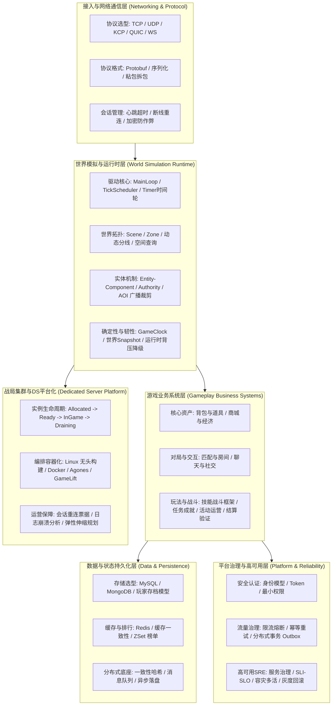

# 游戏服务端 Domain MOC

> 知识成熟度：L2（导航关系已按实际目录、47 篇核心文档与跨域领域依赖核对）。

> 本域主责：权威状态（Server Authority）、高吞吐低延迟通信、世界模拟与 Tick 驱动运行时、玩法业务状态机、分布式数据持久化、平台工程治理以及 Dedicated Server 容器化集群。
> 客户端引擎实现、通用数学/寻路算法与端到端测试证据通过跨域链接映射，遵循单一事实源原则。

---

## 游戏服务端技术全景分层



---

## 推荐学习路径与分层导读

1. **基础起步：架构模式与网络底座（01）**：
   先明确权威服务器与同步模型，搞定字节流通信、粘包拆包、心跳与并发模型。
2. **世界心脏：世界模拟与实时运行时（06）**：
   深入游戏服务器最核心的世界驱动机制——从主循环 Tick、时间轮、AOI 广播到跨 Zone 迁移与过载背压。
3. **玩法业务：业务系统设计（03）**：
   将通用玩法抽象为确定性状态机，掌握背包事务、商城对账、技能管线与战斗防作弊。
4. **数据生命周期：数据与业务存储（02）**：
   构建内存权威+异步落盘的存档模式，解决 Redis 缓存三态问题与分布式数据一致性。
5. **企业级底座：平台可靠性与服务治理（04）**：
   引入微服务网关治理、幂等去重表、分布式事务、SLO 告警与灰度发布闭环。
6. **战局工业化：UE Dedicated Server 平台化（05）**：
   掌握大型 3D 战局实例生命周期契约、Linux 容器化、会话接引与多区弹性调度。

---

## 全子域知识目录导航

### 01 架构与网络（Architecture & Networking）
> 骨架与通信底座：网络协议、消息路由、同步选型与高性能并发。

- [01-架构与网络 分类概览](../../游戏服务端/01-架构与网络/README.md)
- [01-服务器架构模式](../../知识/07-网络与游戏服务端/服务架构与消息通信/01-服务器架构模式.md) —— 单服、分区分服、无缝大世界、微服务与容器化选型
- [02-网络通信与协议设计](../../知识/07-网络与游戏服务端/服务架构与消息通信/02-网络通信与协议设计.md) —— TCP/UDP/KCP/QUIC 对比、粘包拆包、Protobuf 与断线重连
- [03-帧同步与状态同步](../../知识/07-网络与游戏服务端/同步预测与回放/03-帧同步与状态同步.md) —— 权威服务器、定点数确定性、快照插值与回放系统
- [04-消息系统与事件驱动](../../知识/07-网络与游戏服务端/服务架构与消息通信/04-消息系统与事件驱动.md) —— 消息路由、事件驱动、Actor 模型与轻量 RPC
- [05-并发与高性能](../../知识/07-网络与游戏服务端/运行调度与过载保护/05-并发与高性能.md) —— 多线程模型、协程、无锁队列、内存池与压测方法论

### 02 数据与业务（Data & Storage）
> 数据生命周期与持久化：玩家存档、高速缓存、高可用集群与安全风控。

- [02-数据与业务 分类概览](../../游戏服务端/02-数据与业务/README.md)
- [01-数据库选型与存储设计](../../知识/07-网络与游戏服务端/持久化与分布式一致性/01-数据库选型与存储设计.md) —— 关系型 vs 文档型、存档设计、读写分离与分库分表
- [02-缓存与排行榜系统](../../知识/07-网络与游戏服务端/持久化与分布式一致性/02-缓存与排行榜系统.md) —— Redis 缓存三态治理、延迟双删、ZSet 亿级排行榜
- [03-分布式与高可用](../../知识/07-网络与游戏服务端/持久化与分布式一致性/03-分布式与高可用.md) —— 一致性哈希、消息队列、CAP/BASE 原则与分布式锁
- [04-安全与反作弊](../../知识/07-网络与游戏服务端/会话身份与在线服务/04-安全与反作弊.md) —— 服务端权威校验、外挂攻防、风控合规与协议签名
- [05-部署运维与监控](../../知识/08-工程实践与质量/部署运维与可观测性/05-部署运维与监控.md) —— 容器编排、CI/CD、日志链路监控与热更新方案

### 03 业务系统设计（Gameplay Business Systems）
> 经典业务玩法与状态机：资产交易、社交编排、实时战斗与长期运营。

- [03-业务系统设计 分类概览](../../游戏服务端/03-业务系统设计/README.md)
- [01-背包与道具系统](../../知识/05-Gameplay与交互系统/背包装备与存档/01-背包与道具系统.md) —— 槽位/堆叠模型、事务一致性、幂等流水与增量同步
- [02-任务与成就系统](../../知识/05-Gameplay与交互系统/任务活动与经济规则/02-任务与成就系统.md) —— 数据驱动任务条件树、进度事件监听与防作弊
- [03-商城与经济系统](../../知识/05-Gameplay与交互系统/任务活动与经济规则/03-商城与经济系统.md) —— 虚拟货币、订单状态机、充值回调防重与财务对账
- [04-匹配与房间系统](../../知识/07-网络与游戏服务端/会话身份与在线服务/04-匹配与房间系统.md) —— ELO/MMR 算法、匹配池拓宽、房间生命周期与断线重连
- [05-聊天与社交系统](../../知识/07-网络与游戏服务端/会话身份与在线服务/05-聊天与社交系统.md) —— 频道广播树、敏感词过滤、好友与离线邮件
- [06-战斗结算与验证](../../知识/05-Gameplay与交互系统/技能战斗与属性结算/06-战斗结算与验证.md) —— 权威战斗校验、随机数种子复算与结算防刷
- [07-活动与运营系统](../../知识/05-Gameplay与交互系统/任务活动与经济规则/07-活动与运营系统.md) —— 运营活动状态机、条件领取幂等、动态热更与配置灰度
- [08-技能与战斗框架](../../知识/05-Gameplay与交互系统/技能战斗与属性结算/08-技能与战斗框架.md) —— 技能管线、Buff 堆叠驱散、范围伤害计算与权威校验

### 04 平台与可靠性（Platform & Reliability）
> 平台工程与韧性治理：身份安全、流量整形、状态一致性与容灾发布。

- [04-平台与可靠性 分类概览](../../游戏服务端/04-平台与可靠性/README.md)
- [00-平台可靠性总览与迁移说明](../../知识/07-网络与游戏服务端/服务架构与消息通信/00-平台可靠性总览与迁移说明.md) —— 平台责任矩阵与工程标准
- [01-身份认证与权限模型](../../知识/07-网络与游戏服务端/会话身份与在线服务/01-身份认证与权限模型.md) —— OAuth/JWT 边界、会话轮转与设备风控
- [02-限流熔断背压与过载保护](../../知识/07-网络与游戏服务端/运行调度与过载保护/02-限流熔断背压与过载保护.md) —— 令牌桶/漏桶算法、熔断分级与防雪崩
- [03-幂等重试与消息语义](../../知识/07-网络与游戏服务端/持久化与分布式一致性/03-幂等重试与消息语义.md) —— Exactly-once 边界、幂等键设计与去重流水表
- [04-分布式事务与最终一致性](../../知识/07-网络与游戏服务端/持久化与分布式一致性/04-分布式事务与最终一致性.md) —— 本地消息表、Transactional Outbox 与 Saga
- [05-服务发现配置中心与治理](../../知识/07-网络与游戏服务端/服务架构与消息通信/05-服务发现配置中心与治理.md) —— 动态寻址、配置热推送、连接池与优雅下线
- [06-SLI-SLO与可观测性](../../知识/08-工程实践与质量/部署运维与可观测性/06-SLI-SLO与可观测性.md) —— RED/USE 指标模型、Trace 链路追踪与容量模型
- [07-故障恢复容灾与多活](../../知识/08-工程实践与质量/部署运维与可观测性/07-故障恢复容灾与多活.md) —— RPO/RTO、冷热备切换、跨区多活与数据演练
- [08-灰度发布回滚与事故复盘](../../知识/08-工程实践与质量/持续交付与发布治理/08-灰度发布回滚与事故复盘.md) —— 金丝雀发布、跨版本协议兼容与无责复盘

### 05 UE Dedicated Server 平台化（DS Platform）
> 3D 实时战局工业化：实例编排、容器化交付、健康检查与弹性调度。

- [05-UE Dedicated Server平台化 分类概览](<../../游戏服务端/05-UE Dedicated Server平台化/README.md>)
- [01-UE Dedicated Server实例生命周期与平台化](<../../知识/07-网络与游戏服务端/专用服务器实例与容量/01-UE%20Dedicated%20Server实例生命周期与平台化.md>) —— 实例生命周期状态机、调度契约与跨云适配
- [02-Linux DS部署与容器实战](<../../知识/08-工程实践与质量/部署运维与可观测性/02-Linux%20DS部署与容器实战.md>) —— Linux 交叉构建、无头运行、Docker 镜像与优雅关停
- [03-DS会话注册与重连实现](<../../知识/07-网络与游戏服务端/会话身份与在线服务/03-DS会话注册与重连实现.md>) —— 平台会话衔接、心跳保活与 JIP (Join-In-Progress) 票据重连
- [04-DS日志崩溃与可观测性实战](<../../知识/08-工程实践与质量/部署运维与可观测性/04-DS日志崩溃与可观测性实战.md>) —— 崩溃捕获转储、符号化还原与 DS 性能指标采集
- [05-DS自动扩缩容与容量规划](<../../知识/07-网络与游戏服务端/专用服务器实例与容量/05-DS自动扩缩容与容量规划.md>) —— 缓冲池策略、高峰预测扩容、缩容保护与服务器算力配比
- [06-DS多区部署与容灾](<../../知识/07-网络与游戏服务端/专用服务器实例与容量/06-DS多区部署与容灾.md>) —— 全球多机房延迟调度、跨区调度容灾与网络专线优化

### 06 世界模拟与运行时（World Simulation Runtime）
> MMO与大世界引擎心脏：时钟驱动、空间感知、实体迁移与过载降级。

- [06-世界模拟与运行时 分类概览](../../游戏服务端/06-世界模拟与运行时/README.md)
- [01-ServerMainLoop与TickScheduler](../../知识/07-网络与游戏服务端/运行调度与过载保护/01-ServerMainLoop与TickScheduler.md) —— 恒定帧率循环、动态时间片与优先级调度
- [02-Timer时间轮与延迟任务](../../知识/07-网络与游戏服务端/运行调度与过载保护/02-Timer时间轮与延迟任务.md) —— 单层/多层时间轮、海量定时器增删与关服优雅 Drain
- [03-Entity生命周期与组件模型](../../知识/07-网络与游戏服务端/世界权威与故障恢复/03-Entity生命周期与组件模型.md) —— 实体创建销毁、组件装配、Ghost Entity 与对象池
- [04-Scene-Map-Zone与实例管理](../../知识/07-网络与游戏服务端/世界权威与故障恢复/04-Scene-Map-Zone与实例管理.md) —— 场景切分、连续大世界 Zone 划分与副本生命周期
- [05-AOI与InterestManagement](../../知识/07-网络与游戏服务端/状态复制与兴趣管理/05-AOI与InterestManagement.md) —— 九宫格/十字链表实战、Enter/Leave 视域裁剪与批量合并
- [06-SpatialQuery与兴趣点查询](../../知识/07-网络与游戏服务端/状态复制与兴趣管理/06-SpatialQuery与兴趣点查询.md) —— 空间分区索引、半径范围拾取与视锥体相交查询
- [07-EntityOwnership与Authority](../../知识/07-网络与游戏服务端/世界权威与故障恢复/07-EntityOwnership与Authority.md) —— 实体归属权划分、Fencing 租约与所有权无缝切换
- [08-跨Zone与跨服迁移](../../知识/07-网络与游戏服务端/世界权威与故障恢复/08-跨Zone与跨服迁移.md) —— 跨边界数据序列化迁出、两阶段接管与断线容错
- [09-动态分线与负载均衡](../../知识/07-网络与游戏服务端/世界权威与故障恢复/09-动态分线与负载均衡.md) —— 动态分线扩容、平滑切线策略与人群热点分散
- [10-大规模战斗与降级](../../知识/07-网络与游戏服务端/世界权威与故障恢复/10-大规模战斗与降级.md) —— 千人同屏视野梯级衰减、技能结算批处理与降频
- [11-AI与寻路时间预算](../../知识/07-网络与游戏服务端/运行调度与过载保护/11-AI与寻路时间预算.md) —— AI Tick 分片预算、异步寻路队列与超时熔断
- [12-世界时间确定性与GameClock](../../知识/07-网络与游戏服务端/运行调度与过载保护/12-世界时间确定性与GameClock.md) —— 单调时间、逻辑帧号、时间回溯与世界时钟同步
- [13-世界Snapshot与故障恢复](../../知识/07-网络与游戏服务端/世界权威与故障恢复/13-世界Snapshot与故障恢复.md) —— 内存全量快照+增量日志、宕机拉起与客户端状态重置
- [14-运行时背压与过载保护](../../知识/07-网络与游戏服务端/运行调度与过载保护/14-运行时背压与过载保护.md) —— 消息队列高低水位、动态抛帧与滞回恢复机制

---

## 游戏品类架构选型指南

| 游戏品类 | 典型代表 | 核心架构模式 | 重点关注分类 | 关键挑战与解决方案 |
| :--- | :--- | :--- | :--- | :--- |
| **MMORPG / 无缝开放世界** | 魔兽世界、原神、逆水寒 | 分布式无缝 Zone / 动态分线集群 | `01`架构、`06`世界运行时、`03`业务 | 跨 Zone 迁移、千人同屏 AOI、视野降级、长连接状态常驻 |
| **战局竞技 / FPS / 动作** | CS:GO、PUBG、Valorant | 专用战局服务器（Dedicated Server） | `01`网络通信、`05`DS平台化、`03`战斗结算 | 毫秒级极低延迟、状态同步/客户端预测、Agones 集群弹性伸缩、反外挂 |
| **战术竞技 / MOBA** | 王者荣耀、DOTA2、英雄联盟 | 状态同步 / 确定性帧同步战局服 | `01`同步机制、`03`匹配房间、`05`DS平台化 | 定点数数学库、输入指令广播、断线快速重连追帧、天梯匹配平衡度 |
| **SLG / 大地图策略** | 万国觉醒、三国志·战略版 | 网关集群 + 大地图计算服 + 业务微服务 | `02`数据存储、`03`经济/活动、`04`平台可靠性 | 复杂行动路线图计算、定时事件海量并发、强事务与道具对账 |
| **回合制 / 卡牌 / 弱联机** | 阴阳师、崩坏：星穹铁道 | Stateless 微服务 + 异步对战结算 | `02`数据缓存、`03`背包商城、`04`平台可靠性 | 峰值弹性扩容、防刷防篡改、本地战斗录像服务端复算校验 |

---

## 跨域知识关系与协同边界

游戏服务端是整套知识库中连接"底层系统基础"与"客户端呈现表现"的枢纽。各领域分工边界如下：

```text
[00-计算机与工程基础] ──(提供 OS、网络栈、C++ 并发、数据库原理底座)──>
                                  │
                                  ▼
                          [游戏服务端 知识库]
                                  │
      ┌───────────────────────────┼───────────────────────────┐
      ▼                           ▼                           ▼
[游戏算法 知识库]             [游戏AI 知识库]            [游戏知识 (UE客户端)]
(AOI/A* 数学实现)           (行为树/决策模型)          (网络复制/RPC/DS构建)
      │                           │                           │
      └───────────────────────────┼───────────────────────────┘
                                  ▼
                         [系统实战 / 质量测试]
                     (端到端玩法落地 / 机器人压测)
```

1. **与 [计算机与工程基础](../../00-计算机与工程基础/README.md) 的边界**：
   - 基础域负责标准网络编程原理（[Linux系统编程](../../00-计算机与工程基础/07-Linux系统编程/README.md) 中的 Epoll、Reactor）与底层系统（[C++并发](../../00-计算机与工程基础/04-C++并发与内存模型/README.md)）；
   - 服务端域负责将这些底座装配为游戏专用的通信框架与主循环调度器。
2. **与 [游戏知识 (UE客户端)](../../游戏知识/README.md) 的边界**：
   - 客户端域负责引擎组件、UMG、动画表现与 Iris 复制图配置（[网络同步](../../游戏知识/06-网络同步/README.md)）；
   - 服务端域主责权威逻辑判断、业务数据持久化与 Dedicated Server 集群生命周期（[DS平台化](<../../游戏服务端/05-UE Dedicated Server平台化/README.md>)）。
3. **与 [游戏算法](../../游戏算法/README.md) 和 [游戏AI](../../游戏AI/README.md) 的边界**：
   - 算法域提供 A*、Detour、RVO 纯算法定义；AI 域提供行为树决策原理；
   - 服务端域重点解决这些算法在多线程 Tick、时间预算（[AI与寻路时间预算](../../知识/07-网络与游戏服务端/运行调度与过载保护/11-AI与寻路时间预算.md)）和服务器内存约束下的落地。
4. **与 [游戏测试与质量](../../游戏测试与质量/README.md) 的边界**：
   - 服务端定义 SLI/SLO 与服务架构；测试域负责编写 Headless 压测机器人（[服务端测试与机器人压测](../../知识/08-工程实践与质量/测试策略与自动化/03-服务端测试与机器人压测.md)）、模拟网络丢包抖动并产出容量证据。

---

## 核心研发角色学习指引

- **逻辑与玩法开发工程师**：
  - 核心掌握：`03-业务系统设计`（全篇） → `01-04 消息系统与事件驱动` → `02-01 数据库与存档` → `06-03 实体生命周期`
  - 重点目标：熟练设计背包、任务、活动等状态机，写出事务严谨、防刷幂等的业务代码。
- **底层架构与世界运行时工程师**：
  - 核心掌握：`01-架构与网络`（全篇） → `06-世界模拟与运行时`（全篇） → `02-02 缓存与排行榜`
  - 重点目标：精通 MainLoop 调度、高并发无锁队列、AOI 广播裁剪、跨服迁移与过载背压降级。
- **战局服务与平台运维 (SRE) 工程师**：
  - 核心掌握：`05-UE Dedicated Server平台化`（全篇） → `04-平台与可靠性`（全篇） → `02-05 部署运维`
  - 重点目标：精通 Agones/K8s 集群编排、全球就近调度、崩溃分析定位、灰度发布与容灾演练。

---

## 导航链接

- [游戏服务端 物理主页](../../游戏服务端/README.md)
- [全局 MOC](../MOC.md)
- [跨域主题地图](../axes/跨域主题.md)
- [知识边界与生命周期](../axes/知识边界与生命周期.md)
- [Obsidian Knowledge Base](../Knowledge.base)
