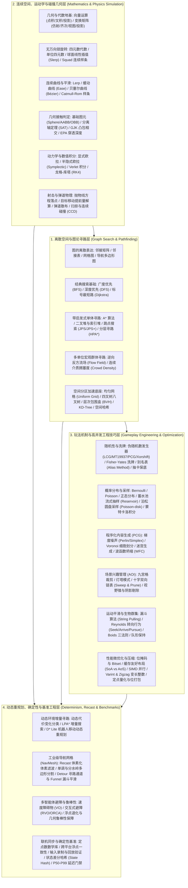
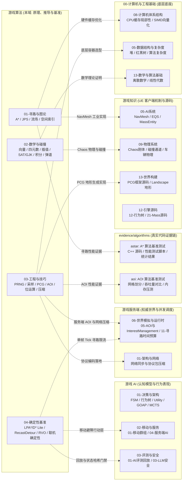

# 游戏算法 Domain MOC

> 知识成熟度：L2（导航关系已按实际目录、22 篇核心专题、4 大子域及跨域工程依赖全面核对）。

> 本域主责：**可跨引擎复用的游戏核心算法原理、离散与几何数学推导、空间索引、确定性模拟与工业级性能基准**。
>
> 引擎具体 API、业务认知决策、服务端业务调度与全链路实战由相邻领域承接，严格遵循单一事实源原则：
> - 虚幻引擎客户端 API、Chaos 物理封装、NavMesh 渲染与 Mass 运行组件由 [游戏知识 (UE 客户端与源码)](游戏知识.md) 承接；
> - 状态机、行为树、Utility/GOAP 认知决策模型由 [游戏 AI](游戏AI.md) 承接；
> - 权威世界模拟架构、网络同步复制、场景分线与时间预算由 [游戏服务端](游戏服务端.md) 承接；
> - C++ 内存布局、SIMD 硬件向量化与缓存局部性由 [00-计算机与工程基础](计算机与工程基础.md) 承接；
> - 技能、Buff、假人战斗端到端业务闭环由 [系统实战](../../系统实战/README.md) 承接；
> - 算法底层性能测试代码、可复现脚本与测量结果由 [本地实验证据库](../../evidence/algorithms/) 承接。

---

## 游戏算法技术全景分层

---

## 推荐学习与工程实战路径（按工程角色）

### 1. Gameplay / 战斗表现算法工程师
- **核心目标**：实现行云流水的角色位移、毫发毕现的弹道命中、平滑自如的镜头运镜与拳拳到肉的打击判定。
- **推荐路径**：
  1. [02-01 向量与矩阵基础](../../游戏算法/02-数学与碰撞/01-向量与矩阵基础.md)：掌握点积判朝向/视野、叉积判左右/法线、正交投影与局部/世界坐标变换。
  2. [02-02 四元数与旋转](../../游戏算法/02-数学与碰撞/02-四元数与旋转.md)：彻底解决万向锁、掌握角位移乘法与 Slerp 角色转向平滑。
  3. [02-03 插值与曲线](../../游戏算法/02-数学与碰撞/03-插值与曲线.md)：使用 Ease 曲线打造技能前摇/后摇节奏，使用 Catmull-Rom 样条构建技能位移与相机轨迹。
  4. [02-04 碰撞检测](../../游戏算法/02-数学与碰撞/04-碰撞检测.md)：掌握 AABB/OBB 包围盒碰撞、SAT 分离轴测试与武器挥砍扫掠检测。
  5. [02-06 弹道与射击算法](../../游戏算法/02-数学与碰撞/06-弹道与射击算法.md)：解算抛物线落点、预判移动目标提前量（Lead Aiming）、弹道散布采样与 CCD 扫掠。
  6. [03-04 路径平滑与转向行为](../../游戏算法/03-工程与实用技巧/04-路径平滑与转向行为.md)：利用漏斗算法拉直折线，配合 Arrive/Pursue 转向实现拟人化走位。

### 2. 大规模 MMO / RTS 服务端算法工程师
- **核心目标**：在有限的主频与 Tick 时间预算（如 20ms）内，支撑数万同屏玩家/单位的高性能空间感知、视野广播与群体移动。
- **推荐路径**：
  1. [01-01 图论基础与搜索算法](../../游戏算法/01-寻路与图论/01-图论基础与搜索算法.md)：建立图模型，掌握基础拓扑结构与标号算法。
  2. [01-03 流场与群体寻路](../../游戏算法/01-寻路与图论/03-流场与群体寻路.md)：学习“计算一次全场复用”的反向 Dijkstra 距离场与向量梯度，攻克 RTS 千人行军瓶颈。
  3. [01-04 空间分区与索引](../../游戏算法/01-寻路与图论/04-空间分区与索引.md)：深入均匀网格、四叉树与空间哈希的构建与近邻查询复杂度。
  4. [03-03 AOI 与视野计算](../../游戏算法/03-工程与实用技巧/03-AOI与视野计算.md)：精通九宫格、十字链表（Sweep & Prune）的 Enter/Leave 事件触发与广播带宽压缩。
  5. [03-06 数据压缩与序列化](../../游戏算法/03-工程与实用技巧/06-数据压缩与序列化.md)：采用 Varint、Zigzag、定点数位打包和增量差分编码大幅压减网络同步包大小。
  6. 实战证据联动：参考 [evidence/algorithms/aoi](../../evidence/algorithms/aoi/README.md) 了解不同网格尺寸下 AOI 吞吐量的微基准测试数据。

### 3. 游戏物理、载具与运动学算法工程师
- **核心目标**：实现真实且数值稳定的刚体动力学、车辆悬挂仿真、布娃娃模拟与高速穿透预防。
- **推荐路径**：
  1. [02-05 数值积分与运动学模拟](../../游戏算法/02-数学与碰撞/05-数值积分与运动学模拟.md)：深入分析显式欧拉的能量发散缺陷，掌握半隐式欧拉（Symplectic Euler）的保相体积特性、Verlet 约束积分与高精度 RK4。
  2. [02-04 碰撞检测](../../游戏算法/02-数学与碰撞/04-碰撞检测.md)：攻克凸多面体 GJK 闵可夫斯基差相交判定与 EPA 接触法线/穿透深度解算。
  3. [04-04 RVO 与数值鲁棒](../../游戏算法/04-确定性与基准工程/04-RVO与数值鲁棒.md)：掌握多物体速度障碍区（ORCA）的线性规划求解，规避浮点退化与除以零奇点。
  4. 引擎源码联动：结合 [游戏知识 09-01 Chaos物理引擎概览](../../游戏知识/09-物理系统/01-Chaos物理引擎概览.md) 与 [09-06 Chaos车辆系统](../../游戏知识/09-物理系统/06-Chaos车辆系统.md)。

### 4. 联机帧同步与确定性引擎工程师
- **核心目标**：构建跨平台（Windows/Android/iOS/Linux）、多客户端与服务器之间比特级一致的可回放模拟环境。
- **推荐路径**：
  1. [04-01 确定性与基准工程总览](../../游戏算法/04-确定性与基准工程/01-确定性与基准工程总览.md)：掌握确定性工程的三层解耦架构（全局层、局部层、在线层）与不可妥协的事实边界。
  2. [04-05 联机确定性与基准工程](../../游戏算法/04-确定性与基准工程/05-联机确定性与基准工程.md)：攻克定点数数学（Fixed-Point Math）、跨编译器浮点模式（`/fp:strict` vs `-ffast-math` 禁用）、确定性 PRNG 种子隔离与差分状态快照哈希。
  3. [04-02 动态寻路 LPA* 与 D* Lite](../../游戏算法/04-确定性与基准工程/02-动态寻路LPA与DStarLite.md)：在动态破坏场景下仅重算失效子图，保证增量寻路步步可复现。
  4. [04-03 NavMesh 工程 Recast 与 Detour](../../游戏算法/04-确定性与基准工程/03-NavMesh工程Recast与Detour.md)：深入理解体素烘焙流程、TileCache 动态障碍剔除与 Detour 漏斗通道一致性。
  5. 落地评测结合：结合 [游戏 AI 03-01 AI 评测回放](../../游戏AI/03-评测与安全/01-AI评测回放.md) 与 [游戏测试与质量 03 服务端机器人压测](../../游戏测试与质量/03-服务端测试与机器人压测.md)。

### 5. 程序化生成 (PCG) 与抽卡数值算法工程师
- **核心目标**：基于可控随机性构建无限广袤的游戏世界、平衡且引人入胜的抽卡掉落与地牢关卡。
- **推荐路径**：
  1. [03-01 随机数与洗牌算法](../../游戏算法/03-工程与实用技巧/01-随机数与洗牌算法.md)：掌握 PCG/Xorshift 种子复现、Fisher-Yates 洗牌的无偏证明、Alias Method $O(1)$ 加权抽样与抽卡保底状态机。
  2. [03-07 概率分布与采样工程](../../游戏算法/03-工程与实用技巧/07-概率分布与采样工程.md)：掌握流式蓄水池采样（Reservoir）、泊松圆盘（Poisson-disk）均匀植被分布与蒙特卡洛置信区间估计。
  3. [03-02 程序化生成](../../游戏算法/03-工程与实用技巧/02-程序化生成.md)：掌握 Perlin/Simplex 多倍频噪声地形管线、Voronoi 群系划分、迷宫生成与波函数坍缩（WFC）规则瓦片推导。
  4. 引擎落地结合：结合 [游戏知识 13-04 PCG程序化内容生成](../../游戏知识/13-世界构建与过场/04-PCG程序化内容生成.md)。

---

## 核心算法横向选型与权衡矩阵

### 1. 全局与单体寻路算法横向选型矩阵

| 寻路算法 | 核心原理与数据结构 | 空间适用表示 | 时间复杂度 | 内存开销 | 适用场景 | 局限性与避坑点 | 关联专题 |
| :--- | :--- | :--- | :---: | :---: | :--- | :--- | :--- |
| **BFS** | 无权图、FIFO 先进先出队列 | 网格图、小规模图 | $O(V + E)$ | $O(V)$ | 棋盘战棋步数统计、无权连通域探测 | 无法处理边权重差异，搜索呈盲目圆环状扩散 | [01-01](../../游戏算法/01-寻路与图论/01-图论基础与搜索算法.md) |
| **Dijkstra** | 贪心松弛、小顶堆（优先队列） | 带权任意图 | $O((V+E)\log V)$ | $O(V)$ | 单源多目标最短路、塔防刷怪影响力场 | 无启发式导向，全方位膨胀，大规模地图耗时极高 | [01-01](../../游戏算法/01-寻路与图论/01-图论基础与搜索算法.md) |
| **A\*** | $f=g+h$ 启发式估值、优先队列 | 网格图、NavMesh 凸多边形图 | $O(E \log V)$（最坏） | $O(V)$ | 经典游戏点对点单体寻路的事实工业标准 | 开放列表堆维护开销大；平坦地图遍历冗余对称节点 | [01-02](../../游戏算法/01-寻路与图论/02-A星算法与优化.md) |
| **JPS / JPS+** | 跳点剪枝、水平垂直强制邻居 | 纯均匀正交网格地图 | 远低于 A\*（降幅达 10~50x） | 与 A\* 相当或预计算查表 | 2D 网格类 RTS、SLG 大地图、像素游戏 | **仅适用于规则网格**，无法直接应用在 3D NavMesh 上 | [01-02](../../游戏算法/01-寻路与图论/02-A星算法与优化.md) |
| **HPA\*** | 分层抽象图、局部块网格与出入口边 | 大规模网格大地图 | 层次搜索，近乎实时 | 需维护分层拓扑与边界缓存 | 超大世界地图寻路、长距离战略行军规划 | 跨块边界可能产生次优路径，动态更新维护复杂 | [01-02](../../游戏算法/01-寻路与图论/02-A星算法与优化.md) |
| **流场 (Flow Field)** | 反向 Dijkstra 距离场 + 梯度向量 | 均匀网格图 | $O(V\log V)$ 计算一次，$O(1)$ 单位查询 | $O(V)$ 网格场 | RTS 千人军团冲锋、丧尸狂潮、塔防集中进攻 | 目标点发生改变时整场需重算；目标分散时开销陡增 | [01-03](../../游戏算法/01-寻路与图论/03-流场与群体寻路.md) |
| **LPA\* / D\* Lite** | 记录 $g$ 与 $rhs$ 增量值、重用旧搜索树 | 动态网格、雷达探索图 | 动态障碍变动时远优于全图 A\* | $O(V)$ | 局部动态开门/坍塌、移动雷达视野探索 | 若全图障碍大面积洗牌，增量树维护开销反超 A\* | [04-02](../../游戏算法/04-确定性与基准工程/02-动态寻路LPA与DStarLite.md) |

---

### 2. 空间分区与近邻索引加速结构选型矩阵

| 空间结构 | 核心划分思想 | 构建与更新成本 | 邻域查询复杂度 | 内存分布与连续性 | 最佳应用场景 | 局限性与退化条件 | 关联专题 |
| :--- | :--- | :---: | :---: | :--- | :--- | :--- | :--- |
| **均匀网格 (Grid)** | 全空间固定步长等距切分 | 构建 $O(N)$，移动 $O(1)$ | $O(1)$ 单元格寻址 | 连续数组，缓存极度友好 | 密度分布均匀的 2D MMO AOI、流场网格 | 物体高度聚集时退化为 $O(N)$；大空旷地图浪费内存 | [01-04](../../游戏算法/01-寻路与图论/04-空间分区与索引.md) / [03-03](../../游戏算法/03-工程与实用技巧/03-AOI与视野计算.md) |
| **空间哈希 (Spatial Hash)** | 网格坐标做离散 Hash 映射 | 构建 $O(N)$，移动 $O(1)$ | 期望 $O(1)$ | 稀疏存储，哈希桶指针跳转 | 无限大开放世界稀疏物体管理、粒子碰撞 | 哈希冲突增多时性能波动，哈希桶内存分散 | [01-04](../../游戏算法/01-寻路与图论/04-空间分区与索引.md) |
| **四叉树 / 八叉树** | 空间递归正交 4/8 等分 | 构建 $O(N \log N)$，移动代价高 | 范围查询 $O(\log N)$ | 树状离散节点，指针开销大 | 静态场景视锥剔除、地形 LOD、大场景稀疏管理 | 动态物体跨越分割轴频繁增删引发树抖动重平衡 | [01-04](../../游戏算法/01-寻路与图论/04-空间分区与索引.md) |
| **层次包围盒 (BVH)** | 自底向上或自顶向下聚类包围体 | 构建较重 $O(N \log N)$ | 射线相交 $O(\log N)$ | 扁平数组线性化 BVH（SIMD 友好） | 物理引擎宽相碰撞、光线追踪、NavMesh 块查询 | 动态物体剧烈变形时导致包围盒重叠增大、需 Refit | [01-04](../../游戏算法/01-寻路与图论/04-空间分区与索引.md) / [02-04](../../游戏算法/02-数学与碰撞/04-碰撞检测.md) |
| **KD-Tree** | 沿方差最大的维度交替正交超平面切分 | 构建静态排序 $O(N \log N)$ | K 近邻 (KNN) 极快 | 紧凑数组存储 | 静态点云检索、光子映射最近邻查询 | 高度依赖静态数据，动态插入/删除导致树严重失衡 | [01-04](../../游戏算法/01-寻路与图论/04-空间分区与索引.md) |
| **十字链表 (Sweep & Prune)** | 坐标轴投影区间排序（AABB） | 连续移动时近乎 $O(N)$ | 轴相交重叠判定高效 | 双向链表，指针频繁修改 | 移动平缓的 2D/3D MMO 服务端 AOI 判定 | 物体瞬间远距离传送引发大范围链表重插，产生抖动 | [03-03](../../游戏算法/03-工程与实用技巧/03-AOI与视野计算.md) |

---

### 3. 动力学模拟与数值积分器选型矩阵

| 积分算法 | 计算公式简述 | 每步导数估值次数 | 稳定性与能量表现 | 精度阶数 | 游戏工业应用场景 | 禁忌场景 | 关联专题 |
| :--- | :--- | :---: | :--- | :---: | :--- | :--- | :--- |
| **显式欧拉 (Explicit Euler)** | $x_{n+1}=x_n+v_n\Delta t$ $v_{n+1}=v_n+a_n\Delta t$ | 1 次 | **无条件不稳定**，弹簧振子能量剧烈发散爆炸 | 1 阶 | 最简教学、对物理精度无要求的粗糙粒子位移 | **严禁用于弹簧、刚体动力学与布娃娃模拟** | [02-05](../../游戏算法/02-数学与碰撞/05-数值积分与运动学模拟.md) |
| **半隐式欧拉 (Symplectic Euler)** | $v_{n+1}=v_n+a_n\Delta t$ $x_{n+1}=x_n+v_{n+1}\Delta t$ | 1 次 | **保相空间结构 (Symplectic)**，振荡系统能量有界守恒 | 1 阶 | **商业游戏物理引擎默认主力**（Box2D/PhysX/Chaos） | 刚度极大的刚性约束系统仍需小步长 | [02-05](../../游戏算法/02-数学与碰撞/05-数值积分与运动学模拟.md) |
| **Verlet 积分** | $x_{n+1}=2x_n-x_{n-1}+a_n\Delta t^2$ | 1 次 | 隐式包含速度，天然契合位置硬约束投影 | 2 阶 | 布料系统、头发模拟、绳索物理、XPBD | 不直接显式保留速度，施加瞬时冲量不如欧拉直观 | [02-05](../../游戏算法/02-数学与碰撞/05-数值积分与运动学模拟.md) |
| **速度 Verlet (Velocity Verlet)** | 结合半步速度与当前/未来加速度更新 | 1 次计算 $a$ | 能量长期守恒，精度优于半隐式 | 2 阶 | 分子动力学、高精度轨道天体引力模拟 | 计算开销略高于半隐式欧拉，游戏常选半隐式 | [02-05](../../游戏算法/02-数学与碰撞/05-数值积分与运动学模拟.md) |
| **经典四阶龙格-库塔 (RK4)** | 四个子采样加权平均导数 | 4 次评估 | 精度极高，平滑且截断误差小 | 4 阶 | 复杂高精度载具空气动力学、精确航天器弹道解算 | 每步 4 次受力评估，开销过重，无法处理非连续碰撞 | [02-05](../../游戏算法/02-数学与碰撞/05-数值积分与运动学模拟.md) |

---

### 4. 多智能体局部避障与群聚算法选型矩阵

| 避障算法 | 核心计算模型 | 碰撞规避前瞻性 | 震荡性与死锁风险 | 规模化算力开销 | 典型工业应用 | 缺陷与局限 | 关联专题 |
| :--- | :--- | :---: | :---: | :---: | :--- | :--- | :--- |
| **Steering Behaviors** | 瞬时斥力合力（Raycast / 投影推力） | 反应式（无预判） | 狭窄通道易震荡、死锁 | 极低（单体独立） | 单人/少量怪基础巡逻、简易追逐避障 | 单位数量增多时极易相互推挤挤成一团 | [03-04](../../游戏算法/03-工程与实用技巧/04-路径平滑与转向行为.md) |
| **Boids 群聚** | 距离加权三法则（分离、对齐、凝聚） | 邻居平均力 | 缺乏对静态复杂几何障碍的先验认知 | 低到中（依赖近邻查询） | 鸟群掠空、鱼群游动、环境氛围生物 | 无法执行严格的战术编队与精准走位 | [03-04](../../游戏算法/03-工程与实用技巧/04-路径平滑与转向行为.md) |
| **人工势场法 (APF)** | 引力场指向目标，斥力场背离障碍 | 局部梯度下降 | 极易陷入局部极小值（U 型障碍死锁） | 低 | 简易机器人移动、空旷场地避障 | 障碍物对称或通道狭长时智能体原地晃动卡死 | [01-03](../../游戏算法/01-寻路与图论/03-流场与群体寻路.md) |
| **RVO / ORCA** | 相对速度障碍区，半平面交集二维线性规划 | **交互式互惠前瞻**（双方各让一半） | **完全杜绝震荡**，无死锁 | 中等（单体 LP 二维半平面交） | RTS/MOBA 拥挤行军、万人同屏走位避障 | 浮点退化与除零需严密防护；狭窄死胡同需配合全局寻路 | [04-04](../../游戏算法/04-确定性与基准工程/04-RVO与数值鲁棒.md) |

---

## 游戏算法全域 22 篇核心专题全景矩阵

### 子域 01：寻路与图论（4 篇）

| 专题文件（Canonical 路径） | 知识类型 | 成熟度 | 核心工程关注点与落地场景 |
| :--- | :---: | :---: | :--- |
| [01-图论基础与搜索算法.md](../../游戏算法/01-寻路与图论/01-图论基础与搜索算法.md) | Concept | L2 | 图的内存表示（邻接矩阵/邻接表/紧凑数组）、BFS 洪水填充与无权连通域、Dijkstra 标号法与堆优化实现 |
| [02-A星算法与优化.md](../../游戏算法/01-寻路与图论/02-A星算法与优化.md) | Mechanism | L2 | $f=g+h$ 启发式一致性证明、二叉堆/索引堆开放列表、JPS 跳点规则剪枝、HPA* 分层拓扑与漏斗拐点平滑 |
| [03-流场与群体寻路.md](../../游戏算法/01-寻路与图论/03-流场与群体寻路.md) | Mechanism | L2 | 目标反向 Dijkstra 生成标量距离场、Sobel/中心差分计算梯度向量场、千人行军单次计算全场复用、拥塞度力场集成 |
| [04-空间分区与索引.md](../../游戏算法/01-寻路与图论/04-空间分区与索引.md) | Mechanism | L2 | 均匀网格、四叉树/八叉树、层次包围盒（BVH）、KD 树、空间哈希的构建/增删/范围与射线查询性能对比 |

### 子域 02：数学与碰撞（6 篇）

| 专题文件（Canonical 路径） | 知识类型 | 成熟度 | 核心工程关注点与落地场景 |
| :--- | :---: | :---: | :--- |
| [01-向量与矩阵基础.md](../../游戏算法/02-数学与碰撞/01-向量与矩阵基础.md) | Concept | L2 | 向量点积（视锥/法向投影）、叉积（旋转轴/左右判断）、仿射变换矩阵构造、局部→世界→观察→裁剪坐标流水线 |
| [02-四元数与旋转.md](../../游戏算法/02-数学与碰撞/02-四元数与旋转.md) | Concept | L2 | 欧拉角万向锁推导、四元数代数（复数扩展/乘法旋转）、Slerp 球面插值防退化、与旋转矩阵互转及骨骼姿态插值 |
| [03-插值与曲线.md](../../游戏算法/02-数学与碰撞/03-插值与曲线.md) | Concept | L2 | Lerp/Slerp 线性与球面插值、二次/三次贝塞尔曲线、Catmull-Rom 样条平滑通过控制点、网络预测外推补偿 |
| [04-碰撞检测.md](../../游戏算法/02-数学与碰撞/04-碰撞检测.md) | Mechanism | L2 | 常见几何体相交、分离轴定理（SAT）、GJK 凸体闵可夫斯基差、EPA 穿透向量求解、Broad-phase 宽相与射线检测 |
| [05-数值积分与运动学模拟.md](../../游戏算法/02-数学与碰撞/05-数值积分与运动学模拟.md) | Mechanism | L2 | 显式欧拉能量发散本质、半隐式欧拉保相结构证明、Verlet 位置约束积分、RK4 高精度仿真与固定时间步长确定性 |
| [06-弹道与射击算法.md](../../游戏算法/02-数学与碰撞/06-弹道与射击算法.md) | Mechanism | L2 | 考虑重力与阻力的抛物线解析解、移动目标提前量方程解算、高斯/均匀弹道散布采样、高速子弹连续碰撞 CCD 扫掠 |

### 子域 03：工程与实用技巧（7 篇）

| 专题文件（Canonical 路径） | 知识类型 | 成熟度 | 核心工程关注点与落地场景 |
| :--- | :---: | :---: | :--- |
| [01-随机数与洗牌算法.md](../../游戏算法/03-工程与实用技巧/01-随机数与洗牌算法.md) | BestPractice | L2 | 伪随机数算法（LCG/MT19937/PCG/Xorshift）、Fisher-Yates 洗牌算法无偏保证、Alias 别名表 $O(1)$ 抽样、保底掉落机制 |
| [02-程序化生成.md](../../游戏算法/03-工程与实用技巧/02-程序化生成.md) | Mechanism | L2 | Perlin/Simplex 梯度噪声分形叠加、Voronoi 细胞空间多边形划分、迷宫生成算法、波函数坍缩（WFC）规则与熵最小优先 |
| [03-AOI与视野计算.md](../../游戏算法/03-工程与实用技巧/03-AOI与视野计算.md) | Mechanism | L2 | 九宫格网格裁剪、灯塔模式、十字双向链表排序（Sweep & Prune）、进入/离开/移动事件发布、阴影迷雾与视野锥裁剪 |
| [04-路径平滑与转向行为.md](../../游戏算法/03-工程与实用技巧/04-路径平滑与转向行为.md) | Mechanism | L2 | 漏斗算法（String Pulling）折线拉直、路径关键拐点提取、Reynolds 转向行为（Seek/Arrive/Pursue/Wander）、Boids 群集 |
| [05-位运算与性能优化技巧.md](../../游戏算法/03-工程与实用技巧/05-位运算与性能优化技巧.md) | BestPractice | L2 | 位掩码与位标志工程、Bitset 与布隆过滤器、Morton 码与 Z 序曲线空间加速、SoA 内存布局与 SIMD 并行向量化 |
| [06-数据压缩与序列化.md](../../游戏算法/03-工程与实用技巧/06-数据压缩与序列化.md) | Mechanism | L2 | Varint/Zigzag 变长整数编码、浮点定点量化与位打包、增量差分压缩、Huffman/LZ4 工业选型与带宽极限压减 |
| [07-概率分布与采样工程.md](../../游戏算法/03-工程与实用技巧/07-概率分布与采样工程.md) | Mechanism | L2 | Bernoulli/Poisson/Normal 分布契约、蓄水池抽样（Reservoir）、泊松圆盘采样（Poisson-disk）、蒙特卡洛与重要性采样 |

### 子域 04：确定性与基准工程（5 篇）

| 专题文件（Canonical 路径） | 知识类型 | 成熟度 | 核心工程关注点与落地场景 |
| :--- | :---: | :---: | :--- |
| [01-确定性与基准工程总览.md](../../游戏算法/04-确定性与基准工程/01-确定性与基准工程总览.md) | Architecture | L2 | 动态世界三层解耦（全局拓扑、局部速度、在线工程）、事实边界契约、失败路径兜底、选型对比与回归门禁指引 |
| [02-动态寻路LPA与DStarLite.md](../../游戏算法/04-确定性与基准工程/02-动态寻路LPA与DStarLite.md) | Mechanism | L2 | 动态拓扑变化分类、LPA* 增量搜索原理（$g$ 与 $rhs$ 不一致处理）、D* Lite 启发式增量移动规划与失效退化回退 |
| [03-NavMesh工程Recast与Detour.md](../../游戏算法/04-确定性与基准工程/03-NavMesh工程Recast与Detour.md) | Architecture | L2 | Recast 体素化（Voxelization）与多边形网格提取、TileCache 动态障碍剔除、Detour 多边形图通道搜索与 Crowd 避障边界 |
| [04-RVO与数值鲁棒.md](../../游戏算法/04-确定性与基准工程/04-RVO与数值鲁棒.md) | Mechanism | L2 | 速度障碍区（VO）几何构造、ORCA 互惠速度障碍二维半平面交线性规划求解、浮点退化与除零奇异点防御 |
| [05-联机确定性与基准工程.md](../../游戏算法/04-确定性与基准工程/05-联机确定性与基准工程.md) | BestPractice | L2 | 跨平台定点数运算、浮点编译参数隔离、状态差分哈希（State Hash）比对、输入录制回放基准、P50/P95/P99 延迟门禁 |

---

## 跨域技术映射网格与单一事实源

---

## 本地实验证据与 Benchmark 索引

本域不是空泛的理论推导，而是在工程中通过真实代码、压测脚本与数据构建的证据体系：

| 实验代号 | 关联核心算法 | 物理存放路径 | 核心验证指标与证据产出 | 跨域联动 |
| :--- | :--- | :--- | :--- | :--- |
| **`aoi`** | 空间网格划分、九宫格兴趣管理 | `../../evidence/algorithms/aoi/` | - 1000~10000 动态实体进入/离开/移动事件吞吐量（ops/ms） - 网格尺寸（Cell Size）与内存占用、CPU 命中率权衡数据 - 包含 C++ 源码、CMake 构建脚本与自动化测量报告 | [03-03 AOI与视野计算](../../游戏算法/03-工程与实用技巧/03-AOI与视野计算.md) [01-04 空间分区](../../游戏算法/01-寻路与图论/04-空间分区与索引.md) [服务端 06-05 AOI与兴趣管理](../../游戏服务端/06-世界模拟与运行时/05-AOI与InterestManagement.md) |
| **`astar`** | 启发式 A* 搜索、二叉堆优先队列 | `../../evidence/algorithms/astar/` | - 规则网格地图不同障碍密度下的寻路耗时（μs/次） - 开放列表（Open List）入堆/出堆在原生堆与 Flat 数组上的缓存命中测量 - 曼哈顿 vs 欧氏启发函数的节点扩展总数对比证据 | [01-02 A星算法与优化](../../游戏算法/01-寻路与图论/02-A星算法与优化.md) [04-02 动态寻路](../../游戏算法/04-确定性与基准工程/02-动态寻路LPA与DStarLite.md) [服务端 06-11 AI与寻路预算](../../游戏服务端/06-世界模拟与运行时/11-AI与寻路时间预算.md) |

---

## 领域成熟度与文档资产清单

- **覆盖范围**：4 大子域，22 篇核心正文，4 篇子域标准化工程手册，1 篇领域总 README。
- **成熟度状态**：
  - 22 篇核心正文：100% 达到 **L2 稳定成熟度**（具备核心概念、数学/原理推导、代码/伪代码实现、复杂度分析、最佳实践与完备关联互链）。
  - 4 篇子域工程手册：**L2 统一标准化**。
  - 领域级入口与 MOC：**L2 权威导航**。
- **质量门禁保证**：
  - 内部 Markdown 链接相对寻址 100% 正确（零断链）。
  - OKF frontmatter 元数据 100% 完备。
  - 领域质量基线行、日期、外部来源 URL 与验证建议 100% 达标。

---

## 返回与相关导航

- [游戏算法领域总 README](../../游戏算法/README.md)
- [00_Index Global MOC](../MOC.md)
- [跨域主题索引](../axes/跨域主题.md)
- [游戏知识 Domain MOC](游戏知识.md)
- [游戏 AI Domain MOC](游戏AI.md)
- [游戏服务端 Domain MOC](游戏服务端.md)
- [游戏测试与质量 Domain MOC](游戏测试与质量.md)
- [00-计算机与工程基础 Domain MOC](计算机与工程基础.md)
