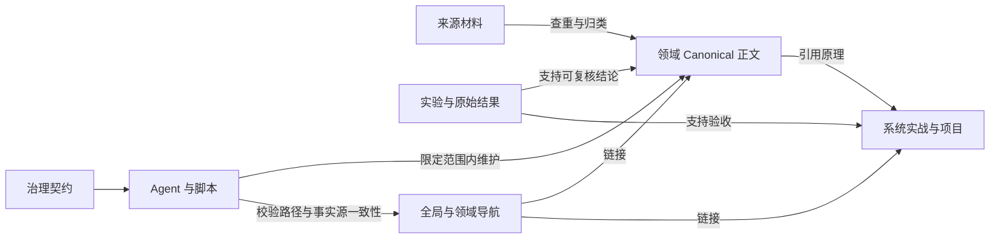

# 知识库架构与事实源

> 知识成熟度：L2（基于当前仓库结构核对；内容正确性与运行证据另行验收）。

本库以现有领域正文为知识事实源，路径保持稳定。架构优化集中在清晰的归属、可组合的导航、按需读取的 Agent 规则和可重复检查，而不是再建一套正文。

## 从哪里开始

| 要做的事 | 入口 | 产物 |
| --- | --- | --- |
| 找主题与前置知识 | [Global MOC](../00_Index/MOC.md) → 领域 MOC → 目录 README | 找到唯一主文与相关应用 |
| 新增或修订知识 | [知识组织规则](知识组织规则.md)与目标目录 README | 正文、真实来源、相对链接 |
| 处理书籍、短笔记、日志 | [知识边界与生命周期](../00_Index/axes/知识边界与生命周期.md) | 保留来源上下文，关联领域主文 |
| 调整结构或 Agent | [AGENTS](../AGENTS.md) → [协作规则](agent协作与发布规则.md) | 有范围、证据、写者和验收结果的修改 |
| 验收当前状态 | [架构检查](../scripts/check_architecture.ps1)、[内容检查](../scripts/check_repo.ps1) | 分开报告结构问题、内容问题和历史失败 |

## 架构层

[architecture.json](../.kb/architecture.json) 是“顶层目录属于哪一层”的唯一机器清单。本页只解释层的责任；不再维护第二份完整目录表。

| 层 | 责任 | 边界 |
| --- | --- | --- |
| content | 可复用概念、机制、设计和实现 | 现有六个领域优先；Knowledge 只扩展已确认的新领域 |
| practice | 端到端系统链路与明确项目约束 | 系统实战是跨域叙事；Projects 必须有明确项目身份 |
| sources | 书籍阅读、短笔记、过程日志、原始材料与归档 | 按来源保留上下文，不建立第二份主题权威正文；不参与知识成熟度门禁 |
| evidence | 可运行实验、测试、原始结果和复现说明 | 证据支持结论；静态代码与运行结果要区分 |
| navigation | 全局、领域、跨域主题和属性视图 | 链接到事实源，不复制正文；统计是快照 |
| governance | 分类、决策、计划、格式契约和维护经验 | 声明现行规则并保存历史依据 |
| automation | Skills、Agent 配置与检查脚本 | 执行并验证规则，不自行改变知识结论 |

排除根目录用于 Git、个人 Obsidian 状态和本地工具工作区。排除架构登记不等于授权清理，也不改变其他检查脚本的扫描范围。

## 知识流与依赖

这些箭头描述主责任，不禁止正文互链。举例：通用 AOI 原理由算法领域主文承载；服务端文章描述调度、广播和容量约束；引擎文章描述对应 API；实战链路组合它们，测试结果留在 evidence。导航把它们连接起来，不复制四份 AOI 原理。

## 每种信息只维护一次

| 信息 | 权威文件 | 消费方与更新方式 |
| --- | --- | --- |
| 目录的责任层 | [architecture.json](../.kb/architecture.json) | 架构检查；新增顶层目录必须登记或显式排除 |
| 领域内部分类 | [taxonomy.yaml](../.kb/taxonomy.yaml) | 归类与领域导航；不从架构层推导成熟度 |
| 概念词归一化 | [aliases.yaml](../.kb/aliases.yaml) | 查重；归一化必须终止 |
| 概念的主文位置 | [跨域主题地图](../00_Index/axes/跨域主题.md)、正文 canonical 字段 | 标准 Markdown 链接；别名不是路径重定向 |
| 文档元数据 | 每篇 Markdown frontmatter | OKF lint、Obsidian Properties、manifest |
| 当前文件清单 | [manifest.yaml](../.kb/manifest.yaml) | 由 rebuild_manifest 生成；禁止手改统计掩盖漂移 |
| Agent 最小契约 | [AGENTS.md](../AGENTS.md) | 每个任务；细则按任务加载 |
| 角色权限与执行闸门 | [协作规则](agent协作与发布规则.md) | 配置与 Skill 引用；授权来自用户任务 |
| 当前计划与历史决定 | [current.md](../.kb/plans/current.md)、[decisions.md](../.kb/decisions.md) | 更换任务时保存旧计划；决定只追加 |

taxonomy 的 domains 键历史上同时登记领域与辅助目录，为兼容已有消费者保留。它不是所有条目都属于知识主题域的声明；顶层责任统一由 architecture.json 决定。

根 README 与结构说明中可能保存旧的角色描述；现行执行合同以 AGENTS 与协作规则为准。历史 lessons、决策和执行日志的当时结论，不覆盖后续已经接受的架构决策。2026-09-07 重构保留了任务开始时用户正在编辑的 README、仓库结构说明和读书笔记，不接管并行工作。

## Canonical 与来源边界

- 先搜索既有领域与别名，再决定 Extend、Merge 或 Create；不能把“不好分类”直接当作新建 Knowledge 子树的理由。
- Knowledge 是受控扩展口。真正独立的新领域需要分类决定、入口与边界说明；范围还不清楚时保留在 Inbox。
- 来源层可以按书目或日期组织。书籍笔记的章节结构保留读者上下文，不能自动视为临时垃圾，也不成为第七个主题域。
- `读书笔记/`、`笔记/`、`工作日志/`、`方案/` 不适用知识成熟度门禁：它们不是 Canonical 正文，只受结构门禁约束（代码围栏闭合、相对链接有效、README 清单完整）。来源材料的内容质量按来源完整性与可追溯性衡量，而不是按 L0~L5 证据深度标注。
- 从来源中提炼的可复用知识归入主文并保留来源链接；工作日志默认原地沉淀，不因提炼而自动搬迁。
- mixed 内容按叙事是否独立选择保留加互链或有完整性证据的拆分；不机械拆散端到端链路。
- maturity 是证据深度，verified 是验证事件；建立导航、生成代码或通过格式检查都不自动提升它们。

## Agent 架构

入口按“核心契约 → 当前任务所需规则 → 文件范围 → 子任务结果”逐步加载。普通正文修订只需目标 README、写作/元数据要求和必要引用；结构重构才加载分类、历史决策与迁移计划；发布时才加载 Git 发布细则。

独立分析可并行，独立正文可按不重叠文件并行；共享导航、分类、manifest 和同一文件保持单写者。验证者报告缺陷，由原写者修复后复验。分析、执行、整合、验证是工作角色，不代表每次都必须启动全部角色。

配置位置与当前支持边界见 [.codex/README](../.codex/README.md)。默认模型与推理强度继承任务运行时；仓库中的角色文件不是当前宿主已经启用角色或工具权限的证明。

## 验收与演进

所有 Markdown 清单使用 [get_kb_markdown.ps1](../scripts/get_kb_markdown.ps1)：已跟踪且仍存在的文件，加上未被 Git 忽略的新文件，按 ordinal 顺序返回。已跟踪文件不会因为后来匹配 ignore 就消失。Git 读取失败直接报错，不回退到全磁盘递归；原有引擎参考快照与图像工作区排除仍保留。

check_repo、check_okf、manifest 生成与架构检查共用这个集合；OKF 另保留 profile 规定的 Skill/log 操作性排除。[范围回归测试](../scripts/test_kb_scope.ps1) 证明被忽略缓存不污染知识清单，真实新知识与已跟踪正文继续受检。

1. 保存 dirty 路径、diff 与 hash。检查前后对照原始文件，不以最终 status 替代保护证据。
2. 完成正文与导航后重建 manifest；修改 PowerShell 脚本需同时在 Windows PowerShell 5.1 与 pwsh 验证。
3. 执行 [test_architecture](../scripts/test_architecture.ps1)，验证健康样例通过以及目录缺失、越界、别名环、清单漂移会被拒绝。
4. 执行 check_architecture（目录、入口、别名、manifest）、check_okf 的 Changed/Audit/Strict，以及 check_repo 与 git diff --check。
5. 分别记录本次引入失败、基线已有失败和 WARN；不得更改旧门禁或提高成熟度来让报告变绿。

架构检查只识别仓库约定的 JSON 与 YAML 子集，不验证知识语义、第三方工具完整配置或宿主实际加载行为。出现未登记目录时先判断责任，再改清单；迁移正文时必须额外准备旧→新映射、入链更新和逐段完整性证据。
