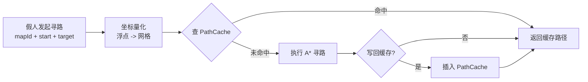

# 工作日志：2026-08-05

## 任务：假人 AI 寻路优化 —— 路径缓存与预计算方案设计

### 背景
- 承接 08-03 的 A* 算法优化与耗时测试（插桩 + perf），见 `2026-08-03-假人AI-A星优化与耗时测试.md`。
- A* 单次寻路耗时已优化，但服务器假人数量多、寻路调用频繁，**重复寻路的累计 CPU 开销**仍是主要矛盾。
- 观察结论：假人的起终点经常落在少量固定热点上（出生点、刷新点、任务点、传送点、兴趣点），大量寻路请求的（起点, 终点）组合是重复的。
- 结论：与其每次重新跑完整 A*，不如把重复的搜索结果缓存起来。

### 方案概述
整体思路：
1. **启动预计算**：服务器启动时，预处理地图里所有假人可能的寻路路径；
2. **挂在假人管理器下**：预计算结果挂到假人管理器（BotManager）下的路径缓存（PathCache），按地图分桶；
3. **先查缓存**：假人寻路时按「地图 ID + 起始坐标 + 目标坐标」查缓存，命中直接返回缓存路径；
4. **未命中才寻路**：缓存未命中时才自己执行 A*，可选把结果写回缓存。



图：寻路请求统一走缓存入口，未命中才回退 A*；缓存只是加速层，不影响正确性。

### 关键设计决策

| 决策点 | 方案 | 理由 |
| --- | --- | --- |
| 缓存键 | mapId + startCell + targetCell（坐标先量化成网格） | 浮点坐标直接做键会键爆炸；量化后同一格子多次查询键一致 |
| 预计算范围 | 起点候选集 × 终点候选集（出生点/刷新点/任务点/兴趣点等） | 全图格子对数量级不可行，必须用候选集裁剪 |
| 存储位置 | BotManager 下按地图分桶的 PathCache | 与假人/地图生命周期一致，卸载地图时一并释放 |
| 存储格式 | 格子序列，增量编码压缩（2~4 字节/格） | 控制内存占用 |
| 容量上限 | LRU 淘汰 + 内存预算上限 | 防止缓存无界增长 |
| 失效 | 地图障碍物变化时按区域失效或整体重建 | 避免假人走旧路径撞墙 |
| 降级 | 未命中/失效 → 回退 A*，行为与原来一致 | 缓存是优化不是功能 |

### 知识点整理（本次沉淀）

#### 1. 缓存键设计要点
- 量化规则必须稳定：浮点 → 网格统一用 floor/round 固定规则，否则同一位置多次查询键不一致；
- 键打包：uint64（mapId + x + y + 目标 x/y 位段）或稳定哈希，避免用大字符串做键；
- 方向性：默认有向（A→B 与 B→A 不同键）；若地图代价对称可合并为无向键，省一半内存；
- 参数化：若不同假人移动代价不同（地形权重、单位尺寸），键需带参数或按参数分桶。

#### 2. 所有可能的路径如何裁剪
- 理论全集 = 全图格子对：500×500 地图约 25 万格，全对数量级为亿级，不可行；
- 工程做法：起点候选集 S × 终点候选集 T，|S| × |T| 通常几千到几万条；
- 候选来源：出生点、刷新点、传送点、任务点、兴趣点（POI）、玩家常聚点；
- 补充：热点分布要用线上埋点统计确认，不能拍脑袋。

#### 3. 内存估算公式
- 总内存 ≈ 路径条数 × 平均路径长度 × 每格字节 + 哈希表开销；
- 示例：|S| = 200 起点 × |T| = 200 终点 = 4 万条；平均 60 格 × 2 字节 ≈ 4.8 MB + 表开销，可接受；
- 经验值：每格 2~4 字节（增量编码 + 变长整数）；路径长度用平均值统计，别用最大路径估；
- 超预算时的对策：缩小候选集、设 LRU 上限、只缓存长度 ≤ N 格的路径。

#### 4. 预计算执行时机（启动时）
- 启动时全量预计算需要注意三点：
  - 分批/后台线程执行，避免阻塞服务器启动与首个 Tick；
  - 预计算线程与主线程的数据交接（写满一批再发布，或双缓冲）；
  - 启动耗时 ≈ 条数 × 单次 A* 耗时，先小规模验证再放大；
- 演进选项：离线工具预生成二进制路径资源、随地图加载（启动更快，但要处理地图版本一致性）。

#### 5. 查找与回写
伪代码（节选）：
```
func GetPath(mapId, start, target):
    key = BuildKey(mapId, Quantize(start), Quantize(target))
    if path = cache.Lookup(key):        # 命中
        return path
    path = AStar(mapId, start, target)  # 未命中：回退 A*
    if ShouldCache(key, path):          # 可选写回
        cache.Insert(key, path)
    return path
```
- 写回策略：只缓存长度合理、且在候选集范围内的结果，防止缓存被一次性长路径撑爆；
- 返回策略：只读共享路径（引用计数/不可变）vs 拷贝，高频读取时拷贝也可能成为新热点。

#### 6. 失效与地图动态变化
- 失效触发：障碍物增删、地形修改、寻路参数调整；
- 两种粒度：整图清空（简单，但命中率骤降） vs 区域分桶失效（精确，实现复杂）；
- 使用前轻量校验：终点是否仍可达、关键格子是否可通行；
- 版本号机制：缓存带地图版本，地图版本变化时整体失效。

#### 7. 指标与验证
- 命中率 = 命中次数 / 查询次数；热点集中时目标 90% 以上，低于 50% 要重新评估方案；
- 压测对比：同场景同假人数量，优化前后 CPU 占比与 P99 单次寻路耗时；
- 结合插桩与 perf 验证（见 `../笔记/插桩测试.md`、`../笔记/perf性能分析.md`）。

### 风险与待确认
- 假人起终点分布是否真的集中？（需埋点统计确认候选集）
- 预计算启动耗时是否可接受？（与地图大小、候选集大小相关）
- 地图是否经常动态变化？（变化频繁则缓存收益下降）
- 不同假人参数（移动速度/体型）是否需要不同路径？（影响键设计与收益）

### 下一步
1. 埋点统计线上假人起终点分布，确定候选集与内存预算；
2. 实现 BotManager 下的 PathCache + 启动预计算任务；
3. 压测：命中率、CPU 下降、启动耗时，记录数据回填本日志。