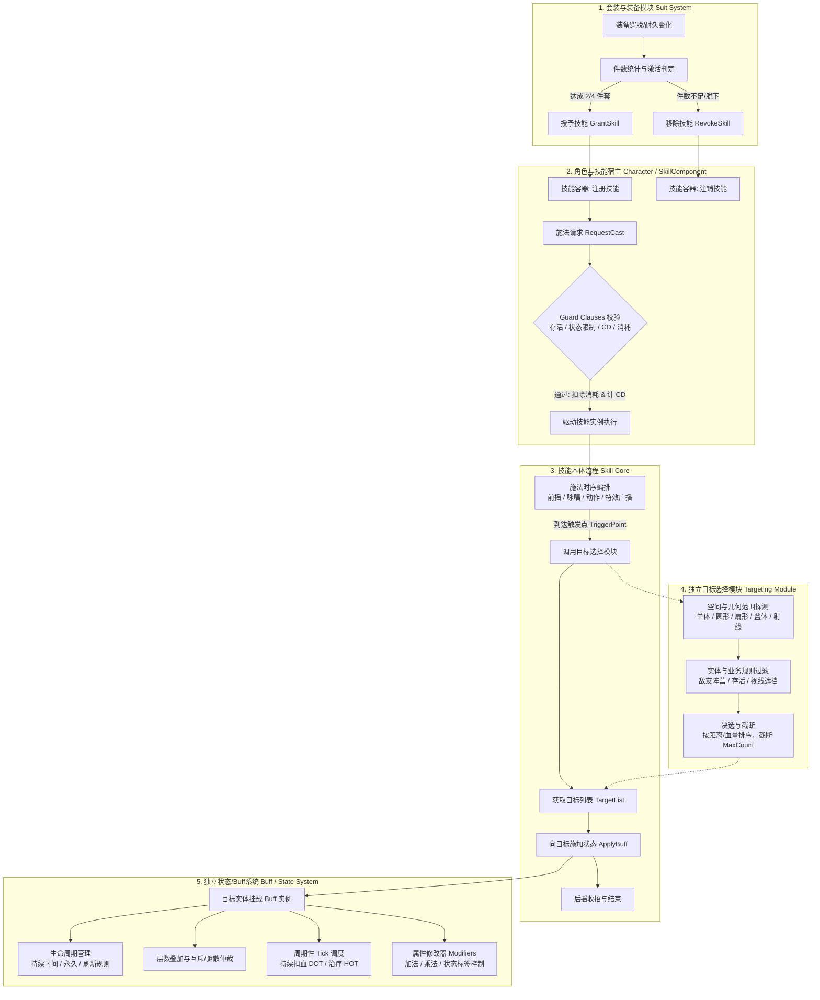
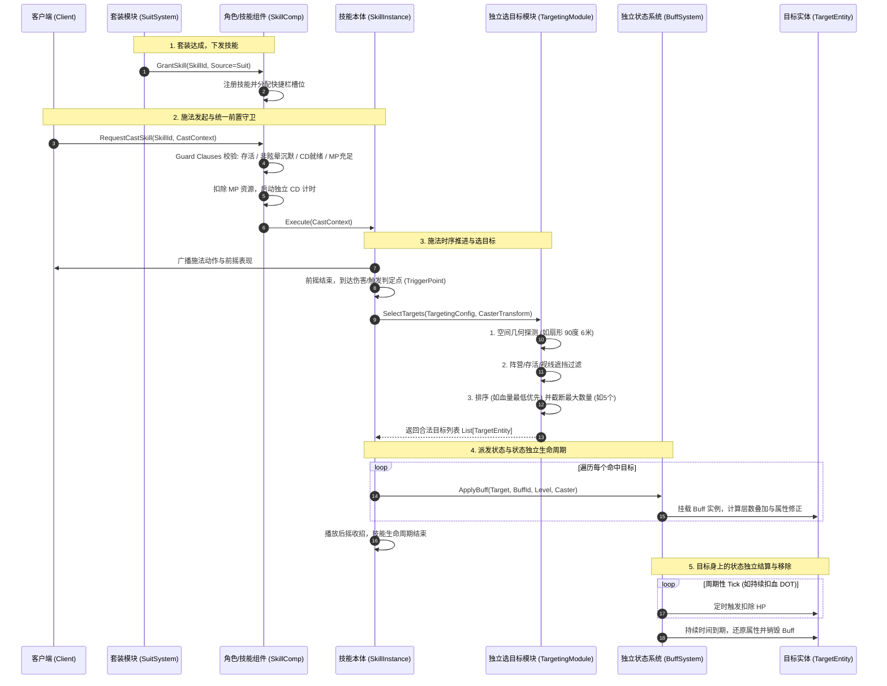

# 工作日志：2026-08-26

## 任务：套装绑定技能开发与技能系统解耦落地（已完成）

### 1. 任务背景与核心目标

本次工作完成了**套装绑定技能**（穿戴特定件数激活专属被动/主动技能）的完整业务开发，并以此为契机全面梳理并确立了**技能系统的架构解耦规范**。

在以往较为原始或早期的实现中，技能模块经常出现职责边界不清的“大包大揽”反模式：
1. **套装与技能强行耦合**：装备系统直接干预技能逻辑，甚至在换装时直接修改技能底层参数或强行触发技能逻辑，导致换装并发与技能生命周期互相干扰；
2. **技能本体与状态（Buff/Debuff）混杂**：技能类内部直接包含流血持续扣血、减速、属性增益的计时器与数值修改，导致状态无法跨技能复用，且驱散、免疫、层数叠加和互斥逻辑全部散落在各个技能实现中；
3. **目标搜索硬编码在技能中**：技能代码内部直接调用物理引擎或空间碰撞 API（如球形检测、扇形检测、射线检测）并揉入阵营判定，导致目标搜索算法无法独立优化（如对接空间索引或 AOI），新技能也无法复用现成的选标逻辑；
4. **角色与技能职责倒置**：冷却与消耗校验分散在各个技能内部，缺少角色的统一施法状态机管控，容易产生状态漏洞（如眩晕状态仍能施法、换装刷新技能 CD）。

本次开发彻底明确了技能系统各层级的正交解耦规范，确立了**“套装触发件数 -> 角色学习/释放技能 -> 技能编排时序 -> 独立模块选目标 -> 独立状态系统接管目标效果”**的单向数据流与清晰职责边界。

---

### 2. 核心架构：五大解耦分层



---

### 3. 各层级解耦与职责边界详解

#### 3.1 套装绑定与技能解耦（Grant & Revoke）
- **职责边界**：
  - 套装模块只关注装备业务：装备穿脱、部位替换、耐久度变化、套装件数计数（如 2 件套、4 件套阈值）；
  - 套装**不关心**技能的具体实现，只在件数满足时调用角色的 `GrantSkill(SkillId, Source=Suit)`，件数不满足时调用 `RevokeSkill(SkillId, Source=Suit)`；
  - 技能被撤销时，如果该技能正处于咏唱阶段，触发施法中断（InterruptCast），清理施法上下文，防止脏数据残留。
- **换装防刷 CD 机制**：
  - 技能冷却（Cooldown）挂载在角色实体的全局冷却管理器（CooldownComponent）中，以 `SkillId` 为键进行计时，**不保存在技能对象上**；
  - 玩家释放套装技能后立即脱下装备，再快速穿上，角色身上的该技能依然处于未完成的冷却倒计时中，从根本上杜绝“脱装再穿装重置大招 CD”的漏洞。

#### 3.2 角色学习/释放与技能本体解耦
- **角色技能组件（SkillComponent）定位**：
  - 作为技能的宿主与容器，管理角色的技能库（已学技能、装备槽位映射）；
  - 负责施法前的统一安全守卫（Guard Clauses），只有全部条件满足时才进入执行阶段：
    1. 角色存活且有效；
    2. 控制状态互斥检查（眩晕、沉默、冻结、石化等状态下禁止主动施法）；
    3. 技能冷却状态检查；
    4. 资源充足性检查（MP、怒气、体力或技能消耗道具）；
  - 校验通过后，原子性地扣除消耗并记录冷却，然后调用技能实例的执行入口。
- **技能本体（Skill Core）定位**：
  - 作为施法时序的编排器，负责施法阶段管理：前摇（Wind-up）、咏唱时间（Casting）、触发判定点（Trigger Point / Impact Frame）、后摇（Recovery）；
  - 负责向客户端下发动画播放事件、音效与特效表现驱动；
  - 技能自身不修改目标角色的基础数值，也不维护长期的持续状态。

#### 3.3 技能本体与状态（Buff/Debuff）解耦
- **分离依据**：
  - **生命周期不对称**：技能是一个瞬时或短时过程（几十毫秒到几秒），而状态是与目标生命周期或独立时间线绑定的（如中毒 15 秒、护盾持续 30 秒、光环永久存在）；
  - **复用与正交性**：同一个减速 30% 的状态，可以被冰霜箭技能、冰霜陷阱道具、环境冰面机关同时施加；如果状态耦合在技能里，所有这些系统都要重写一遍减速逻辑。
- **解耦后交互**：
  - 技能在命中触发点，仅向状态系统发起请求：`BuffSystem::ApplyBuff(Target, BuffId, Level, Caster)`；
  - 状态系统全面接管该状态后续的所有逻辑：
    - **持续时间管理**：定时器到期自动注销；
    - **叠加与刷新规则**：同类型 Buff 再次施加时，根据配置决定是刷新剩余时间、叠加层数（Stacking）、独立计时还是拒绝施加；
    - **周期性 Tick**：统一的 Tick 调度器负责处理每秒扣血（DOT）、每秒回血（HOT）或周期性范围脉冲；
    - **属性修改管线**：通过属性修改器（Attribute Modifiers）修改攻击力、移速、防御等属性，并在 Buff 结束时精准还原；
    - **标签与状态机阻断**：Buff 赋予目标特定 GameplayTag（如 `State.Debuff.Stun`），目标角色的状态机自动据此禁止后续移动与施法，驱散（Dispel）只需按标签或驱散等级批量移除对应 Buff。

#### 3.4 独立目标选择模块（Targeting Module）
- **为什么从技能中完全剥离**：
  - 目标选择包含大量的**几何运算**（距离、张角、点到线段距离、盒体 OBB 投影）和**场景查询**（物理碰撞检测、视线遮挡 Line-of-Sight 检测、AOI 网格遍历）；
  - 如果把这些写在每个技能里，代码冗余且无法独立进行算法调优（例如从全场景暴力遍历优化为四叉树/空间哈希查询时，只需改动目标选择模块，无需触碰任何技能代码）。
- **三段式目标选择管线**：
  1. **空间几何探测（Spatial Query）**：
     - 单体锁定（Target Actor）；
     - 自身周围圆形/球体（Sphere / Circle: 半径）；
     - 前方扇形（Sector: 半径、张角、施法者前向朝向）；
     - 定向矩形/盒体（Box / OBB: 长度、宽度、高度）；
     - 穿透射线（Raycast: 长度、碰撞通道）。
  2. **业务规则过滤（Target Filter）**：
     - 阵营关系判定：敌方（Enemy）、友方（Ally）、中立（Neutral）、是否包含施法者自身；
     - 存活状态：仅存活目标（默认）、仅死亡目标（如复活技能）；
     - 视线遮挡（Raycast Visibility）：检验施法者与目标之间是否存在不可穿透的地形或掩体，阻止“隔墙透视施法”；
     - 免疫与无敌过滤。
  3. **决选与截断（Ranking & Selection）**：
     - 排序策略：距离由近及远、当前生命值绝对值最低、当前生命值百分比最低、仇恨值最高；
     - 目标数上限截断（MaxTargets）：如扇形内检测到 10 个敌人，但配置上限为 5 个，则按排序规则精准截取前 5 个。
- **配置化驱动**：
  技能数据中仅声明目标选择器的类型与参数配置，技能运行时只需向目标选择模块传入 `TargetingConfig` 与施法者当前变换（Transform），直接获得最终合法的目标实体集合 `std::vector<EntityID>`。

---

### 4. 施法全流程时序图



---

### 5. 关键伪代码实现示例

#### 5.1 角色施法守卫（Guard Clauses 扁平化结构）
```cpp
int32_t SkillComponent::CastSkill(int32_t SkillId, const CastContext& Context) {
    // 1. 宿主有效性与存活校验
    if (!OwnerCharacter || !OwnerCharacter->IsAlive()) {
        return ERR_CHARACTER_DEAD;
    }
    // 2. 技能持有与有效性校验
    SkillInstance* Skill = FindSkill(SkillId);
    if (!Skill) {
        return ERR_SKILL_NOT_LEARNED;
    }
    // 3. 状态机互斥校验（硬控状态禁止施法）
    if (OwnerCharacter->HasStateTag(TAG_STATE_STUN) ||
        OwnerCharacter->HasStateTag(TAG_STATE_SILENCE)) {
        return ERR_STATE_RESTRICTED;
    }
    // 4. 冷却就绪校验（由角色的 CooldownComponent 统一裁决）
    if (CooldownComp->IsOnCooldown(SkillId)) {
        return ERR_SKILL_IN_COOLDOWN;
    }
    // 5. 消耗校验
    int32_t CostMP = Skill->GetConfig().CostMP;
    if (OwnerCharacter->GetMP() < CostMP) {
        return ERR_MP_INSUFFICIENT;
    }

    // 6. 前置校验全部通过后，执行原子性扣除并启动 CD
    OwnerCharacter->ConsumeMP(CostMP);
    CooldownComp->StartCooldown(SkillId, Skill->GetConfig().CooldownDuration);

    // 7. 启动技能时序
    Skill->StartExecution(Context);
    return ERR_SUCCESS;
}
```

#### 5.2 技能本体触发点：调用选目标与状态应用
```cpp
void SkillInstance::OnTriggerPoint() {
    // 1. 调用独立的目标选择模块，获取符合几何与业务规则的目标列表
    TargetingContext QueryContext;
    QueryContext.Caster = OwnerCharacter;
    QueryContext.Origin = OwnerCharacter->GetPosition();
    QueryContext.Forward = OwnerCharacter->GetForwardVector();

    std::vector<EntityID> Targets = TargetingModule::Get().SelectTargets(
        Config.TargetingConfig,
        QueryContext
    );

    // 2. 空目标保护：无目标时正常收招，不崩溃、不报虚假错误
    if (Targets.empty()) {
        return;
    }

    // 3. 对每个目标施加配置的状态（Buff）
    for (EntityID TargetId : Targets) {
        Actor* TargetActor = ActorManager::Get().FindActor(TargetId);
        if (!TargetActor || !TargetActor->IsAlive()) {
            continue;
        }

        // 向独立状态系统下发 Buff
        for (int32_t BuffId : Config.AppliedBuffIds) {
            BuffSystem::Get().ApplyBuff(
                TargetActor,
                BuffId,
                Config.SkillLevel,
                OwnerCharacter
            );
        }
    }
}
```

---

### 6. 服务器安全与防刷机制落地

承接 2026-08-18 确定的服务器总原则（**功能正确性 > 可读性 > 速度**）：

1. **消耗扣除先于效果产生**：
   - 消耗（MP、道具、符文等）必须在施法前置守卫中校验并扣除，确认扣减成功后才触发技能流程；
   - 严禁“先施加 Buff 再扣蓝，扣蓝失败再回滚 Buff”，杜绝网络抖动或异常并发导致的刷 Buff 漏洞。
2. **套装频繁穿脱防刷保护**：
   - 套装技能激活属于角色的动态衍生状态（Derived State），不进持久化数据库；玩家下线重登时由穿戴的装备重新计算并授予；
   - 技能 CD 由角色的 `CooldownComponent` 统一以 `SkillId` 索引维护，脱下套装仅注销技能槽位，不清除该技能在角色身上正在计时的 CD 数据。
3. **选目标视线与边界安全**：
   - 空间探测后强制进行视线（Line-of-Sight）物理光线投射测试，防止目标在厚墙背后被异常命中；
   - 严格限制 `MaxTargets` 上限，防止恶意构造密集怪物聚集引发空间遍历与广播风暴。

---

### 7. 自测与验收结果

| 验证项 | 预期标准 | 实际表现 |
| --- | --- | --- |
| 套装件数激活技能 | 穿齐 2 件套 / 4 件套时，角色技能列表立即增加对应技能 | PASS |
| 套装件数不足注销 | 脱下一件或耐久耗尽导致件数不足，技能立即从已学列表卸载 | PASS |
| 换装刷新 CD 防护 | 施法后进入 CD，脱装后立即穿装，技能依然处于 CD 倒计时中 | PASS |
| 异常控制状态拦截 | 角色处于眩晕/沉默状态时施法，被 Guard Clause 拦截并报错，不扣 MP | PASS |
| 技能与状态解耦验证 | 技能仅负责派发 BuffId；目标减速、流血 Tick 和到期还原均由 Buff 系统独立完成 | PASS |
| 选目标模块独立验证 | 扇形与圆形范围检索均独立运行，视线遮挡的目标被正常剔除，按血量最低正确定向排序 | PASS |
| 空目标鲁棒性验证 | 技能在未命中任何目标（空挥）时平稳收招，无空指针异常与状态悬挂 | PASS |

---

### 8. 总结与后续演进

本次开发明确并确立了技能系统三项关键解耦：
1. **技能与状态解耦**：彻底剥离瞬时动作与长效状态，实现 Buff 的高复用性与全生命周期统一治理；
2. **角色与技能解耦**：确立角色作为技能宿主与状态守卫的边界，统一管理技能学习、遗忘、CD 与消耗；
3. **选目标与技能解耦**：将空间几何检索与实体筛选独立为可重用、可单独优化的策略模块。

**后续规划**：
- **目标选择器空间哈希（Spatial Hash）优化**：在大规模同屏场景下，空间查询由遍历场景升级为网格空间索引，提高选标吞吐量；
- **套装进阶词缀动态参数化**：支持不同品质套装通过 GameplayEffect Execution 计算公式，动态微调所施加 Buff 的数值与层数。
