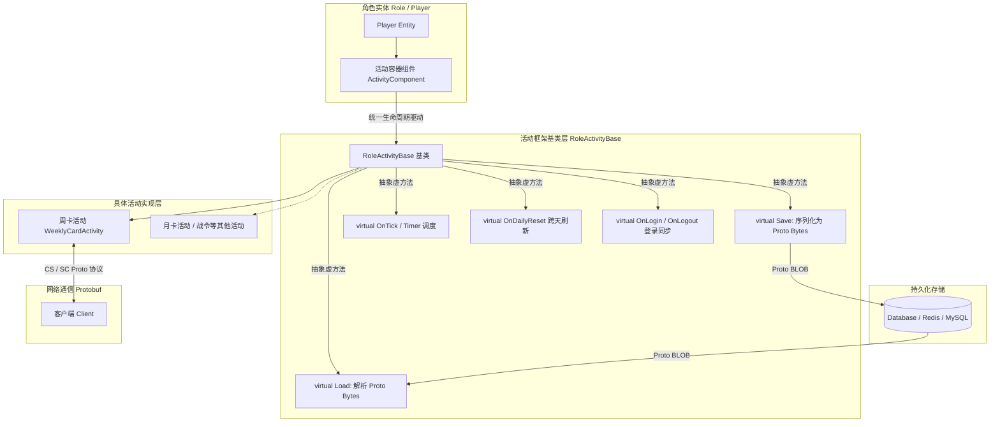

# 工作日志：2026-09-08

## 任务：周卡活动开发与活动基类抽取解耦（已完成）

### 1. 任务背景与核心目标

本次工作完成了**周卡活动（Weekly Card Activity）**的完整业务开发。在具体实现周卡业务之前，为了避免新老活动逻辑与角色主体强耦合、各活动重复实现数据存取与时钟管理的痛点，首先对游戏内所有活动进行了重构抽象，**抽取了统一的角色活动基类（RoleActivityBase）**。

周卡活动作为该基类重构后的首个落地实现，不仅验证了活动组件化解耦架构的可行性，同时深入实践了以下核心技术点：
1. **统一角色活动基类（RoleActivityBase）**：提炼并固化通用的数据序列化（Save/Load）、定时器心跳与跨天驱动（Timer / OnDailyReset）、生命周期钩子（OnInit / OnLogin / OnLogout）等基础能力；
2. **极简状态推导设计**：周卡活动彻底抛弃冗余的布尔状态标志位，**仅以“到期时间戳（expire_time）”和“每日领奖时间戳（last_daily_reward_time）”**两个数值完整标识周卡的全部业务状态（未开通、生效中、今日可领、今日已领、已过期）；
3. **Protobuf 客户端-服务端通信**：规范化设计 CS/SC 交互协议，掌握 Proto 编解码与前后端消息路由；
4. **Protobuf 二进制存档持久化**：将活动运行时数据结构化为 Proto 消息并序列化为 BLOB/二进制落盘存储，建立向前/向后兼容的存档演进机制；
5. **角色实体与活动组件解耦**：活动系统作为独立的组件（ActivityComponent）挂载在角色实体身上，各具体活动以插件化方式注册管理，实现角色主类彻底瘦身。

---

### 2. 核心架构：组件化解耦与数据流



---

### 3. 角色活动基类设计（RoleActivityBase）

以往各个运营活动各写一套数据存盘和定时机制，容易导致代码重复、时区刷新不同步及内存泄漏。基类抽象确立了统一的职责契约：

#### 3.1 核心职责与能力抽象
- **生命周期生命线管理**：
  - `OnInit(Player* owner, uint32_t activity_id)`：绑定所属角色实体与活动配置 ID；
  - `OnLogin()`：玩家上线时初始化运行时缓存，必要时补发跨天重置与协议全量同步；
  - `OnLogout()`：玩家离线时清理活动中的临时句柄、停止短周期定时器并触发持久化；
  - `OnDailyReset(uint32_t now)`：统一由角色或全局定时器在自然日零点（或配置的刷新时点）广播触发，处理跨天重置逻辑。
- **持久化契约（Save & Load）**：
  - `virtual bool Save(std::string* out_bytes) = 0`：活动将自身状态序列化进专用的 Protobuf Message，并转换为二进制字节流供外层存储；
  - `virtual bool Load(const std::string& in_bytes) = 0`：外层从数据库读出 BLOB 字节流后，调用活动自身反序列化并校验恢复数据。
- **统一定时器与时间驱动（Timer / OnTick）**：
  - 基类封装安全的定时注册接口，依托角色的 Tick/TimerWheel 管理到期回调，避免具体活动各自在全局或静态模块中挂定时器导致玩家析构后的野指针崩溃；
  - 提供到期自动回调机制，在到期瞬间触发结算并通知客户端状态变更。

#### 3.2 角色组件化挂载
- 角色主类（`Player`）中不再包含任何特定活动的具体成员变量（例如不再有 `weekly_card_expire_time_` 等具体字段）；
- 角色身上仅持有统一的 `ActivityComponent`：
  ```cpp
  class ActivityComponent : public IPlayerComponent {
  public:
      void RegisterActivity(uint32_t activity_id, std::shared_ptr<RoleActivityBase> activity);
      RoleActivityBase* GetActivity(uint32_t activity_id);
      
      // 统一转发给所有已注册活动
      void OnPlayerLogin();
      void OnPlayerLogout();
      void OnDailyReset(uint32_t now);
      void OnTick(uint32_t now);
      
      bool SaveAll(PlayerActivitiesRecordProto& record);
      bool LoadAll(const PlayerActivitiesRecordProto& record);
  private:
      std::unordered_map<uint32_t, std::shared_ptr<RoleActivityBase>> activities_;
  };
  ```

---

### 4. 周卡活动的极简状态推导设计

#### 4.1 核心设计：无多余标志位的状态推导
在周卡活动（`WeeklyCardActivity`）中，避免使用诸如 `is_active`、`is_claimed_today`、`is_expired` 等繁杂易冲突的布尔字段，**仅使用两个核心时间戳记录全部状态**：
1. **`expire_time`（到期时间戳，秒级）**：周卡权益失效的绝对 UNIX 时间戳；
2. **`last_daily_reward_time`（上次领取每日奖励时间戳，秒级）**：记录最后一次点击领取奖励时的绝对 UNIX 时间戳。

#### 4.2 状态判定矩阵
根据当前服务器时间戳 `now`，所有业务状态皆为纯函数推导：

| 业务状态 | 判定条件 | 客户端交互与逻辑行为 |
| :--- | :--- | :--- |
| **未开通 / 已过期** | `now >= expire_time` | 开放购买入口；禁止领取每日奖励；特权属性失效 |
| **生效中 · 今日可领** | `now < expire_time` 且 `!IsSameDay(now, last_daily_reward_time)` | 开放续期购买；点亮“领取今日奖励”按钮 |
| **生效中 · 今日已领** | `now < expire_time` 且 `IsSameDay(now, last_daily_reward_time)` | 开放续期购买；“领取”按钮置灰为“今日已领” |

> **同一自然日判定工具函数**：
> ```cpp
> bool IsSameDay(uint32_t ts1, uint32_t ts2, int32_t timezone_offset = 0) {
>     return ((ts1 + timezone_offset) / 86400) == ((ts2 + timezone_offset) / 86400);
> }
> ```

#### 4.3 核心业务时序
1. **周卡购买 / 续期**：
   - 校验付费凭证或消耗货币；
   - 续期时间计算：
     ```cpp
     uint32_t duration = 7 * 86400; // 7 天
     if (now >= expire_time_) {
         // 未激活或已完全过期：从当前时间开始计算 7 天
         expire_time_ = now + duration;
     } else {
         // 仍在生效期内续期：在原有到期时间上顺延 7 天
         expire_time_ += duration;
     }
     ```
   - 触发即时下发特权生效、保存存档并全量广播更新后的协议给客户端。
2. **每日奖励领取**：
   - **Guard Clauses 严格防御**：
     1. 校验 `now < expire_time_`，未生效或已过期直接拒绝并返回错误码；
     2. 校验 `!IsSameDay(now, last_daily_reward_time_)`，今日已领过直接拒绝，防重发与并发刷奖；
   - 校验通过后，更新 `last_daily_reward_time_ = now`；
   - 发放道具配置奖励，记录运营审计日志，向客户端回复成功协议。

---

### 5. Protobuf 客户端-服务端通信实践

周卡活动全面使用 Google Protocol Buffers（Proto3）进行 CS/SC 契约定义：

```protobuf
syntax = "proto3";
package activity;

// 周卡基础信息下发
message WeeklyCardInfo {
    uint32 activity_id = 1;
    uint32 expire_time = 2;              // 到期时间戳(0表示未激活)
    uint32 last_daily_reward_time = 3;   // 上次领奖时间戳
    bool can_claim_today = 4;           // 服务端便捷推导下发供客户端展示
}

// 登录同步或信息主动查询
message CSWeeklyCardInfoReq {}
message SCWeeklyCardInfoRsp {
    int32 ret_code = 1;
    WeeklyCardInfo card_info = 2;
}

// 领取周卡每日奖励
message CSWeeklyCardClaimDailyRewardReq {
    uint32 activity_id = 1;
}
message SCWeeklyCardClaimDailyRewardRsp {
    int32 ret_code = 1;
    uint32 last_daily_reward_time = 2;
    // 发放的奖励列表供客户端弹窗展示
    repeated ItemReward rewards = 3;
}
```

#### 通信规范与实践收获：
1. **轻量与明确**：协议字段职责分明，服务端保留推导出的 `can_claim_today` 辅助字段直接告知客户端 UI 状态，降低客户端跨时区与本地时间篡改带来的展示偏差；
2. **安全性**：客户端任何操作请求均以服务端的绝对时间戳和逻辑校验为准，所有修改必须有且仅有服务端驱动；
3. **错误码收敛**：通过统一枚举（如 `ACTIVITY_NOT_ACTIVE`、`REWARD_ALREADY_CLAIMED_TODAY`）返回失败原因，便于客户端精准展示错误提示。

---

### 6. Protobuf 存档持久化实践

#### 6.1 持久化结构设计
数据落盘结构与网络传输协议分离，专注于持久化最小数据集：

```protobuf
syntax = "proto3";
package storage;

// 周卡单条持久化记录
message WeeklyCardRecordProto {
    uint32 expire_time = 1;
    uint32 last_daily_reward_time = 2;
    // 预留后续拓展字段
    reserved 3 to 10;
}

// 角色所有活动汇总存档（挂在角色大存档的一个字段）
message PlayerActivitiesRecordProto {
    map<uint32, bytes> activity_blobs = 1; // activity_id -> 各活动序列化后的二进制字节流
}
```

#### 6.2 存档生命周期流程
- **Save 流程**：
  1. `WeeklyCardActivity` 将自身内存数据填入 `WeeklyCardRecordProto`；
  2. 调用 `record.SerializeToString(&bytes)` 得到二进制字符串；
  3. `ActivityComponent` 将其放入全局 `activity_blobs[activity_id]`，跟随角色存档机制原子性地写入持久化介质。
- **Load 流程**：
  1. 角色上线加载持久化数据，按 `activity_id` 提取出对应的 `bytes`；
  2. 传入 `WeeklyCardActivity::Load(const std::string& bytes)`；
  3. 调用 `record.ParseFromString(bytes)`，若成功解析则恢复 `expire_time_` 和 `last_daily_reward_time_`；若数据为空或首次开通，则初始化为 0。

#### 6.3 版本演进与向后兼容保障
- **字段编号唯一性**：Protobuf 严格依赖 Tag 编号识别字段，一旦发布绝不修改已有的 Tag 含义；
- **废弃字段使用 `reserved`**：避免未来新增字段无意复用了老版本的 Tag 造成脏数据；
- **默认值与容错**：Proto3 字段缺失时自动赋予默认零值，业务层在 Load 时能够优雅识别并兼容老号初次加载新活动的场景。

---

### 7. 总结与架构收益

1. **职责单一与高内聚**：
   - 角色类只管角色自身基础数据，无需关心具体活动逻辑；
   - 周卡活动只关心自身的时间推进与奖励发放，无需操心落盘基础设施与底层网络打包。
2. **状态极简，无同步隐患**：
   - 不存中间布尔状态，杜绝了“到了第二天但标志位未刷新导致领不了奖”或“反复重置导致重复领奖”等经典 Bug；所有状态在任意时间点都能从两个时间戳推导得到一致结论。
3. **扩展性极佳**：
   - 角色活动基类的确立为后续开发月卡活动、成长基金、七日签到等运营活动提供了标准范式；
   - 新活动只需继承 `RoleActivityBase`，编写对应的 Proto 契约与业务逻辑，即可一键挂载到角色组件中，完全契合开闭原则（OCP）。
