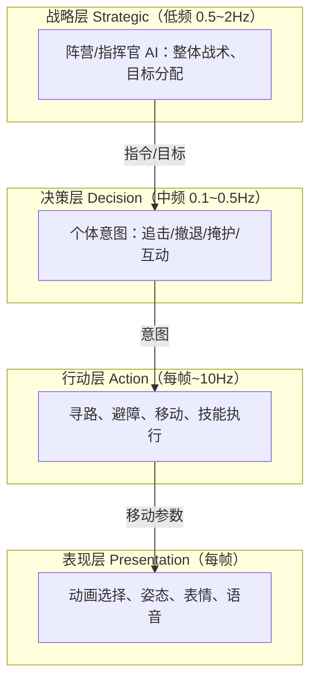
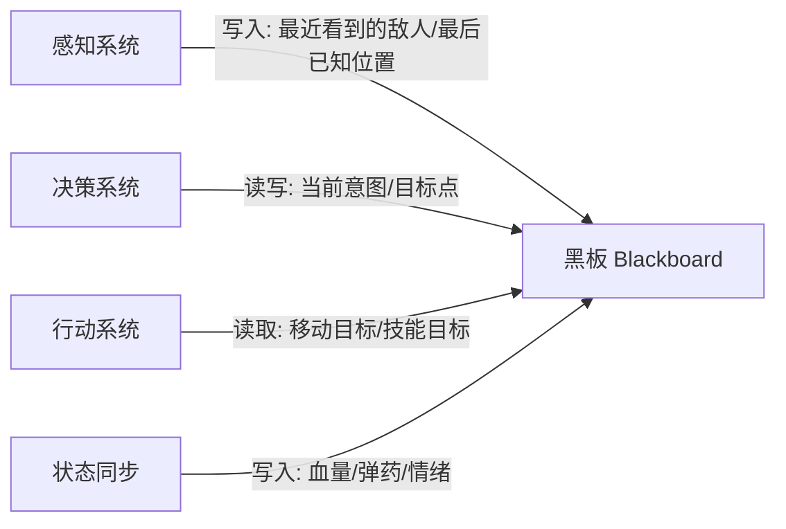
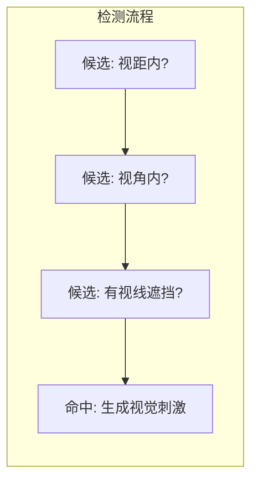

# AI 总体架构与感知

> 本文是「决策与架构」分类的第一篇，回答两个问题：**游戏 AI 系统整体如何组织**，以及**AI 如何获得世界的"信息"（感知）**。这是所有决策技术（状态机、行为树、效用 AI、GOAP）的共同地基——没有感知，决策就是无源之水。

---

## 一、概述

游戏 AI 的本质是：**在有限的 CPU 预算内，让非玩家角色（NPC）表现出"像人一样"的感知、判断与行动**。

一个完整 NPC 的运行可以概括为三条链路：

1. **感知（Perception）**：从游戏世界中收集信息（看到谁、听到什么、记得什么）；
2. **思考（Thinking / Decision）**：根据信息决定"下一步做什么"（决策技术见本目录 02~04 篇）；
3. **行动（Action）**：把决策翻译成实际的移动、动画、技能、交互请求。

三条链路构成一个循环，每帧（或按固定频率）执行一次。这个"感知-思考-行动"循环（Sense-Think-Act Cycle）是所有游戏 AI 的最小公倍数，也是本文的主线。

本文重点：

- 感知-思考-行动循环的拆解与工程实现；
- 分层 AI 架构（Layered AI Architecture）与各层职责；
- 黑板（Blackboard）—— AI 各模块共享知识的核心数据结构；
- 感知系统的四个常用组件：视觉锥、听觉、记忆、兴趣点；
- AI 更新频率与分帧（Time-Slicing / Interleaving）—— 性能与正确的平衡；
- 一张可复用的通用架构图（Mermaid）。

> 涉及 UE 的具体实现（AIPerception、EQS、AI Controller 等）请参阅 UE 客户端知识库：[游戏知识/05-AI系统](../../游戏知识/05-AI系统/README.md)，本文只讲通用原理。

---

## 二、核心概念

| 概念 | 英文 | 一句话定义 | 对应 UE 落地（指路） |
| --- | --- | --- | --- |
| 感知-思考-行动循环 | Sense-Think-Act Cycle | AI 每帧/每间隔重复"收集信息→决策→执行"的过程 | AI Controller 的 Tick 与 BT 的 Tick |
| 感知系统 | Perception System | 模拟 NPC 感官（视觉/听觉/触觉）并产出感知刺激的子系统 | [UE 感知系统与 EQS](../../游戏知识/05-AI系统/02-感知系统与EQS.md) |
| 黑板 | Blackboard | AI 各模块共享的键值知识库，是"记忆"的载体 | UE Blackboard 资产 |
| 视觉锥 | Vision Cone | 视野角度+距离+遮挡检测构成的可视范围 | AIPerception 的 Sight 感知 |
| 听觉 | Hearing | 由声音事件（位置、强度、类型）触发的感知 | AIPerception 的 Hearing 感知 |
| 记忆 | Memory | 对已感知实体的长期/短期记录（最后已知位置、可信度） | AIPerception 的 Stimuli 缓存 |
| 兴趣点 | Point of Interest (POI) | 世界中值得关注的静态/动态位置标记 | 目标点、EQS 查询 |
| 分帧 | Time-Slicing | 把 AI 计算分摊到多帧，避免单帧峰值 | 与 Tick 频率控制相关 |
| 感知刺激 | Stimulus | 一次具体的感知事件（有人进入视野、枪声响起） | AIPerception 的 Stimulus |
| 感知-思考-行动 | Layered AI | 将 AI 分为感知/决策/行动/动画多层的架构思想 | Behavior Tree + AIController + Movement |

---

## 三、原理详解

### 3.1 感知-思考-行动循环（Sense-Think-Act）

#### 3.1.1 循环模型

经典的游戏 AI 循环如下：


每一步的职责：

- **感知**：从"世界状态"中提取 NPC 自己"知道"的信息。关键点：NPC 只知道感知系统给它的信息，不知道"上帝视角"的真相。这是"有限信息 AI"（Limited Information AI）的核心——NPC 可以不知道玩家在哪、可以记错、可以受骗（比如被引开）。
- **思考**：基于感知结果 + 内部状态（血量、情绪、任务），通过决策技术输出一个"意图"（Intent），例如"追击玩家""回到巡逻点""逃跑"。
- **行动**：把意图翻译成引擎层指令：设置移动目标、播放动画、请求服务端技能。行动的结果会改变世界，从而影响下一轮的感知。

#### 3.1.2 循环的工程变体

实际项目中循环并不总是"每帧完整跑一遍"，常见变体：

| 变体 | 说明 | 适用场景 |
| --- | --- | --- |
| 同步循环 | 每帧感知→决策→行动完整执行 | 玩家附近的、对响应性要求高的 NPC |
| 分频循环 | 感知低频（如 0.2s 一次），决策中频（0.1s），行动每帧 | 远处/数量多的 NPC |
| 事件驱动循环 | 由"感知刺激"触发思考，平时休眠 | 潜行 AI、警报器、陷阱 |
| 预测-校正 | 决策层输出长期意图，行动层每帧做局部校正 | 追逐、寻路跟随 |

> 工程要点：**感知频率往往低于帧率**。人的视觉刷新大约在 15~30Hz 级别，游戏 NPC 通常 2~10Hz 感知即可，这既省 CPU 又更"拟人"（NPC 不会瞬间发现背后的人）。

#### 3.1.3 为什么要有循环思维

把 AI 写成"循环"而非"脚本"有三个好处：

1. **响应性可调**：通过调节各阶段频率，可以精确控制 NPC 的"反应速度"，营造"迟钝的守卫"或"机敏的 Boss"；
2. **可中断**：任何时刻玩家行动都可能打断 NPC 的当前行为，循环结构天然支持"重新感知→重新决策"；
3. **可调试**：每个阶段都可以独立打点、记录、回放（感知到了什么→决定做什么→实际做了什么）。

### 3.2 分层 AI 架构（Layered AI Architecture）

现代游戏 AI 普遍采用分层架构。分层的目的：**把"决定做什么"和"怎么做"分离，把高频的细节动作和低频的战略决策分离**。

#### 3.2.1 经典四层模型



各层职责与注意点：

| 层 | 典型频率 | 职责 | 反例（不要这样做） |
| --- | --- | --- | --- |
| 战略层 | 0.5~2 Hz | 全局战术、阵营目标、资源分配 | 每个小兵都跑全局寻路+战术规划 |
| 决策层 | 0.1~0.5 Hz | 选择意图：追/逃/打/聊 | 每帧都重算行为树根节点 |
| 行动层 | 每帧~10 Hz | 移动、寻路、技能、动画驱动 | 决策层直接发动画指令 |
| 表现层 | 每帧 | 动画、表情、语音、物理表现 | 把动画状态和 AI 状态强耦合 |

#### 3.2.2 分层的好处

1. **性能**：战略层低频、行动层高频，天然符合"重要的事慢慢想，琐碎的事快快做"；
2. **可替换性**：换决策技术（FSM→BT）不影响行动层；换移动方案（NavMesh→流场）不影响决策层；
3. **可测试性**：每层可以独立 mock 上下层做单元测试；
4. **多 AI 协同**：战略层把目标分发给多个 NPC，个体层只负责执行，避免"每个 NPC 都自己算全局最优"的重复计算。

#### 3.2.3 简化版：三层模型

中小项目常简化为三层：

```
感知 + 决策（AI 逻辑层）
    ↓ 意图
移动/动画（执行层）
    ↓
物理/渲染（引擎层）
```

三层模型已经能覆盖 90% 的玩法需求；四层模型主要服务于"有阵营/指挥官"的大型战术游戏（如《全面战争》系列、《中土世界》的战争系统）。

### 3.3 黑板（Blackboard）与知识表示

#### 3.3.1 什么是黑板

黑板是一个**全局可见的键值存储**，挂在 AI 实体（或 AI 控制器）上，供感知、决策、行动各模块读写：



典型黑板条目示例：

| 键 | 类型 | 写入者 | 读取者 | 说明 |
| --- | --- | --- | --- | --- |
| `LastKnownPlayerPos` | Vector3 | 感知系统 | 决策层、移动层 | 最后一次看到玩家的位置 |
| `CurrentTarget` | EntityRef | 决策层 | 行动层 | 当前攻击目标 |
| `SuspicionLevel` | Float 0~100 | 感知系统 | 决策层 | 怀疑度，潜行 AI 用 |
| `HomePosition` | Vector3 | 初始化 | 决策层 | 出生点/巡逻点 |
| `IsAlerted` | Bool | 决策层 | 表现层 | 是否进入警戒 |
| `PatrolIndex` | Int | 决策层 | 决策层 | 当前巡逻点序号 |

#### 3.3.2 黑板的设计要点

1. **类型安全**：每个条目声明类型，运行时检查，避免"魔法字符串"拼错；
2. **生命周期**：区分长期记忆（最后已知位置）和临时状态（本次巡逻序号），定期清理过期条目；
3. **可见性/作用域**：部分条目只允许特定系统写（如"玩家位置"只有感知系统可写），防止决策层意外覆盖；
4. **变更通知**：条目变化时广播事件（观察者模式），行动层可以"等待某条目变化"而无需轮询——这是行为树中 Wait 类节点的底层机制；
5. **可序列化**：用于存档、网络同步、调试器可视化。

#### 3.3.3 知识表示的高级形式

黑板是最简单的知识表示。更复杂的场景还有：

| 表示形式 | 说明 | 用途 |
| --- | --- | --- |
| 黑板键值 | 扁平键值表 | 90% 的场景足够 |
| 关系图/记忆图 | 实体之间的关系（谁和谁是友军、谁欠谁） | 阵营系统、社交模拟 |
| 目标/意图栈 | 当前目标 + 子目标栈 | GOAP、任务型 AI |
| 信念-欲望-意图（BDI） | 信念（Belief）+ 欲望（Desire）+ 意图（Intention） | 学术/社交模拟 AI |

> 工程建议：**先黑板，别过度设计**。一个结构良好的黑板 + 感知系统 + 行为树，可以支撑绝大多数商业项目。

### 3.4 感知系统

感知系统的任务是：把"世界真相"过滤成"NPC 所知"。它通常包含四个组件：视觉、听觉、记忆、兴趣点。

#### 3.4.1 视觉锥（Vision Cone）

视觉锥是最常见的视觉模型：以 NPC 为顶点、面朝方向为轴线、`视角半角`为张开角度、`视距`为长度，构成一个扇形（3D 中为锥体）。



判定条件（伪代码）：

```python
def can_see(npc, target, world):
    # 1. 距离检测
    dist = (target.pos - npc.pos).length()
    if dist > npc.vision_range:
        return False
    # 2. 角度检测
    to_target = (target.pos - npc.pos).normalized()
    forward = npc.forward
    angle = acos(dot(to_target, forward))
    if angle > npc.vision_half_angle:   # 半角
        return False
    # 3. 遮挡检测（射线/体素）
    if world.raycast(npc.eye_pos, target.body_pos).hit_obstacle:
        return False
    # 4. 可见性衰减：距离越远、越靠边缘，越难"认出来"
    visibility = 1.0 - (dist / npc.vision_range) * 0.6 - (angle / npc.vision_half_angle) * 0.4
    return visibility > npc.recognition_threshold
```

工程细节：

- **遮挡检测**：优先用射线（Raycast），必要时用球体扫掠（SphereCast）或"身体多点采样"（头、胸、腿各一条射线）防止"只看见一根手指"的怪象；
- **缓存**：每帧对所有实体做完整视觉检测代价高，通常以 `2~10 Hz` 的间隔调度，或对"上次可见实体"优先快速复检；
- **视线系统**（Line of Sight, LoS）：先查网格/遮挡物粗筛，再做精确射线，是常见的两级优化；
- **受干扰**：烟雾、草丛、隐身技能通过"降低可见性"参与计算；
- **视野外感知**：许多游戏允许"背后偷袭"，视觉锥天然支持（背后不在锥内）。

#### 3.4.2 听觉（Hearing）

听觉由**声音事件**驱动：任何实体发出声音（枪声、脚步声、开门）时，向世界广播一个声音刺激（位置、音量、类型、来源）。

```python
class SoundEvent:
    position: Vec3
    loudness: float      # 响度（分贝或 0~1）
    radius: float        # 传播半径
    type: SoundType      # 枪声/脚步/爆炸/喊叫
    source: EntityRef
    timestamp: float

def hear(npc, sound, world):
    dist = (sound.position - npc.pos).length()
    if dist > sound.radius:
        return None
    # 响度随距离衰减
    perceived = sound.loudness * (1.0 - dist / sound.radius)
    if perceived < npc.hearing_threshold:
        return None
    # 方向不确定性：听到的"位置"带误差
    error = npc.hearing_error_angle * (1.0 - perceived)
    heard_pos = sound.position + random_offset(error)
    return PerceivedEvent(type=sound.type, pos=heard_pos, confidence=perceived)
```

听觉设计要点：

- **位置误差**：听到的位置不精确，NPC 会"走向大致方向"，这带来拟真与可玩性（玩家可以甩掉追兵）；
- **响度分级**：脚步轻响 vs 枪声巨响，触发不同的怀疑度/警戒度增长；
- **事件广播**：声音事件应走"事件总线"而非逐 NPC 查询，复杂度 O(声音数 + 听到者数)；
- **环境衰减**：墙体隔音、雨声掩蔽等可通过修正半径实现。

#### 3.4.3 记忆（Memory）

记忆让 NPC 的感知"有持续性"：看到敌人一眼后，敌人消失在拐角，NPC 仍知道"他刚才在那"并会过去查看。

记忆条目示例：

| 字段 | 说明 |
| --- | --- |
| `entity` | 记忆对象 |
| `last_seen_position` | 最后已知位置 |
| `last_seen_time` | 最后看到的时间戳 |
| `confidence` | 可信度（随时间衰减） |
| `stimulus_type` | 何种刺激（视觉/听觉/触觉） |
| `times_seen` | 累计看到次数（影响"认得出"） |

记忆衰减（Decay）是潜行 AI 的灵魂：

```python
def update_memory(memory, dt):
    for entry in memory.entries:
        entry.confidence -= entry.decay_rate * dt
        if entry.confidence <= 0:
            memory.entries.remove(entry)

def on_stimulus(memory, stimulus):
    entry = memory.find(stimulus.entity)
    if entry:
        entry.last_seen_position = stimulus.position
        entry.last_seen_time = now
        entry.confidence = min(1.0, entry.confidence + stimulus.strength)
    else:
        memory.entries.append(new_entry(stimulus))
```

记忆驱动行为：`怀疑度(Suspicion) → 警戒(Alert) → 搜索(Search) → 放弃(Return)` 这条状态链完全建立在记忆之上。详见本分类 [02-状态机与层次状态机.md](02-状态机与层次状态机.md) 的潜行 AI 示例。

#### 3.4.4 兴趣点（Point of Interest）

兴趣点是**世界中预置或动态生成的位置标记**，NPC 可以直接感知/查询它们，无需完整视觉检测：

- 静态 POI：巡逻点、掩体、补给点、工作台；
- 动态 POI：尸体位置、爆炸点、警报器、玩家最后出现点；
- 区域 POI：安全区、危险区（炮火覆盖区）。

POI 通常与决策层配合：行为树中"检查最近的 POI"是一个高频节点。在 UE 中，POI 查询的泛化形式是 EQS（环境查询系统），详见 [游戏知识/05-AI系统/02-感知系统与EQS.md](../../游戏知识/05-AI系统/02-感知系统与EQS.md)。

#### 3.4.5 感知与"拟真"的平衡

**感知要"不完美"才有游戏性**：

- 完全无感知的 AI（透视）→ 玩家无法潜行，体验差；
- 完全拟真的 AI（微弱动静都能察觉）→ 潜行玩法无法成立；
- 正确做法：**用参数化缺陷制造可玩性**——反应时间、视觉死角、声音误差、记忆衰减、怀疑度增长曲线，全部可调。

经典案例：

- 《合金装备》系列：士兵的怀疑度（! 标记）、视角锥、听到脚步后的"调查状态"；
- 《最后生还者》：循声者的"仅听觉"设定，视觉锥消失、听觉增强，改变整个玩法；
- 《刺客信条》系列：兴趣点（鸟瞰点、守卫巡逻路线）与视觉锥结合的潜行体系。

### 3.5 AI 更新频率与分帧（Time-Slicing）

#### 3.5.1 问题：AI 是 CPU 大户

一个 1000 个 NPC 的场景，如果每个 NPC 每帧都做完整感知 + 决策 + 寻路，再好的机器也会卡。AI 的常见开销：

- 感知：射线检测（每帧几十~几百条射线）；
- 决策：行为树遍历（每帧每 NPC 数百次节点访问）；
- 寻路：A* 搜索（最贵，单次可达毫秒级）；
- 动画/IK：属于表现层，但由 AI 状态驱动。

#### 3.5.2 分帧/交错更新（Time-Slicing / Interleaving）

核心思想：**把 N 个 NPC 的更新分摊到 N 个帧**，每帧只更新一部分。

```python
class AISystem:
    def __init__(self, npcs, slices_per_second=5):
        self.npcs = npcs
        self.interval = 1.0 / slices_per_second   # 每个 NPC 的更新间隔
        self.acc = [random.uniform(0, self.interval) for _ in npcs]  # 错开相位

    def update(self, dt):
        for i, npc in enumerate(self.npcs):
            self.acc[i] -= dt
            if self.acc[i] <= 0:
                self.acc[i] += self.interval
                npc.ai_update(dt)   # 感知+决策+行动意图
```

变体与进阶：

| 技术 | 做法 | 收益 | 代价 |
| --- | --- | --- | --- |
| 均匀分帧 | 每帧更新 1/N | 峰值开销降为 1/N | NPC 间响应延迟不一致（可用随机相位缓解） |
| 距离分帧 | 近处 NPC 高频、远处低频 | 近处响应快，远处省钱 | 需要"远近"判定与平滑过渡 |
| 重要性分帧 | 战斗中/屏幕内 NPC 高频 | 性能投向玩家关注处 | 需要重要性评分 |
| 事件驱动 | 无事件则休眠 | 闲置 NPC 零开销 | 需要可靠的事件系统 |

#### 3.5.3 各子系统频率参考

| 子系统 | 推荐频率 | 说明 |
| --- | --- | --- |
| 视觉检测 | 2~10 Hz | 人眼刷新率级别即可 |
| 听觉事件 | 事件驱动 | 无声音则不计算 |
| 决策（FSM/BT） | 5~20 Hz | 响应性敏感场景（战斗）取高值 |
| 寻路 | 请求驱动 + 重算节流 | 目标移动时才重算，失败时指数退避 |
| 移动/避障 | 每帧 | 平滑性要求 |
| 动画 | 每帧 | 表现层不可省 |

#### 3.5.4 预算管理（Budget）

现代引擎普遍引入"AI 时间预算"：每帧给 AI 系统一个毫秒预算（如 2ms），执行到预算耗尽即停止本帧 AI 更新，剩余 NPC 顺延到下一帧。

```python
class AIBudget:
    def __init__(self, budget_ms=2.0):
        self.budget_ms = budget_ms

    def run_frame(self, tasks):
        deadline = time_ms() + self.budget_ms
        for task in tasks:
            if time_ms() > deadline:
                break                # 预算耗尽，剩余顺延
            task.run()
```

要点：

- 配合**任务优先级**：战斗 AI > 巡逻 AI > 闲聊 AI；
- 预算制与分帧制可叠加使用；
- 预算超支要"软降级"：跳过感知而非跳过移动，保证行动平滑。

#### 3.5.5 服务端 AI 的额外约束

全栈视角补充：如果 AI 跑在服务端（MMO 怪物、房间制游戏服务端 AI），还有额外问题：

- **确定性**：决策逻辑应尽量确定（避免依赖浮点误差、随机数要种子化），便于多人同步与回放；
- **反作弊**：感知信息只来自服务端权威数据，客户端 AI 只是表现；
- **水平扩展**：AI 按房间/区域分片，跨片 NPC 通过消息协作。

---

## 四、通用代码示例

### 4.1 一个完整的 NPC 主循环（伪代码，Python 风格）

```python
class NPC:
    def __init__(self, world, config):
        self.world = world
        self.blackboard = Blackboard(config.initial_blackboard)
        self.perception = PerceptionSystem(self, config.perception)
        self.decision = config.decision_factory(self.blackboard)   # FSM/BT/Utility...
        self.action = ActionSystem(self.blackboard, world)
        self.phase = random.uniform(0, config.update_interval)     # 分帧相位

    def ai_update(self, dt):
        # 1. 感知（低频）
        self.perception.update(dt)
        # 2. 决策（中频）
        self.decision.update(dt)
        # 3. 行动（由决策输出意图驱动，高频部分由移动层每帧执行）
        self.action.apply_intent(self.blackboard.get("current_intent"))

    def tick(self, dt):
        # 分帧调度：不是每帧都跑 ai_update
        self.phase -= dt
        if self.phase <= 0:
            self.phase += self.update_interval
            self.ai_update(dt)
        # 行动层的平滑执行每帧都跑
        self.action.smooth_step(dt)
```

### 4.2 感知刺激的事件总线（伪代码）

```python
class PerceptionEventBus:
    def __init__(self):
        self.listeners = []          # [(npc, radius_filter)]

    def emit_sound(self, sound):
        for npc, radius in self.listeners:
            if npc.alive and distance(npc.pos, sound.position) <= radius:
                npc.perception.on_sound(sound)

    def register(self, npc, radius):
        self.listeners.append((npc, radius))
```

### 4.3 黑板的最小实现（C++ 风格示意）

```cpp
struct Blackboard {
    std::unordered_map<std::string, Value> values;
    std::unordered_map<std::string, std::vector<Callback>> observers;

    template <typename T>
    bool Set(const std::string& key, const T& v) {
        auto& cell = values[key];
        if (cell == v) return false;           // 无变化不通知
        cell = v;
        for (auto& cb : observers[key]) cb(key);  // 变更通知
        return true;
    }

    template <typename T>
    bool Get(const std::string& key, T& out) const { /* ... */ }
};
```

### 4.4 分帧更新管理器（游戏主循环接入）

```cpp
// 每帧从主循环调用
void AISystem::Tick(float dt) {
    // 1) 高频行动层：所有 NPC 每帧
    for (auto& npc : allNpcs) npc->ActionLayerTick(dt);
    // 2) 中频决策层：按交错相位
    for (auto& npc : allNpcs) {
        npc->acc -= dt;
        if (npc->acc <= 0.0f) {
            npc->acc += npc->interval;
            npc->DecisionTick(dt);
        }
    }
    // 3) 低频感知层：独立低频循环 + 事件驱动
    perceptionTimer -= dt;
    if (perceptionTimer <= 0.0f) {
        perceptionTimer = 0.2f;          // 5Hz
        for (auto& npc : nearbyNpcs) npc->PerceptionTick();
    }
}
```

---

## 五、选型对比

### 5.1 架构模式对比

| 维度 | 单脚本式 | 分层式（推荐） | 事件驱动式 |
| --- | --- | --- | --- |
| 复杂度 | 低 | 中 | 中高 |
| 性能可控性 | 差（每帧全量） | 好（分频分层） | 最好（闲置零开销） |
| 扩展性 | 差 | 好 | 好 |
| 调试难度 | 中 | 好（分层打点） | 中（状态分散） |
| 典型项目 | 原型、小游戏 | 商业项目主流 | 潜行、大世界 |

### 5.2 感知方案对比

| 方案 | 精度 | 性能 | 实现难度 | 典型用途 |
| --- | --- | --- | --- | --- |
| 视觉锥 + 射线 | 高 | 中 | 中 | 人形 NPC 视觉 |
| 球体半径查询 | 低 | 高 | 低 | 听觉、范围感知 |
| 扇形+网格粗筛 | 中 | 高 | 中高 | 大量 NPC 的视觉 |
| EQS 式环境查询 | 高 | 中高 | 高 | 掩体/覆盖点/战术点 |
| 事件驱动广播 | 中 | 高 | 中 | 声音、警报 |
| 全知（不感知） | 最高精度 | 最高 | 最低 | 小游戏/简单 Boss |

> 实践原则：**混合使用**。视觉锥负责"谁在眼前"，事件广播负责"远处发生了什么"，记忆负责"刚才发生了什么"，POI 负责"哪里值得去"。

### 5.3 更新策略对比

| 策略 | 响应性 | CPU 峰值 | 实现成本 | 适用 |
| --- | --- | --- | --- | --- |
| 每帧全量 | 最好 | 最高 | 最低 | NPC < 50 |
| 均匀分帧 | 中 | 低 | 低 | 50~500 NPC |
| 距离/重要性分帧 | 好 | 低 | 中 | 500+ NPC 大世界 |
| 预算制 | 可控 | 封顶 | 中 | 各规模均可 |

---

## 六、最佳实践

1. **先定频率，再写逻辑**：在架构图上标出每个子系统的更新频率，再动手写代码；频率决定性能，也决定"手感"。
2. **感知与决策解耦**：感知产出"事实 + 置信度"，决策产出"意图"，行动产出"指令"。任何一层都不要越权。
3. **黑板键集中管理**：用常量/枚举定义黑板键，避免魔法字符串；提供调试器可视化。
4. **感知结果必须"可衰减"**：没有记忆衰减的感知系统会让 NPC 变成"全知者"，破坏潜行玩法。
5. **射线检测节流**：视觉检测间隔 + 候选集粗筛（距离/角度/网格）双管齐下。
6. **重要 NPC 单独策略**：玩家身边的 Boss、队友走"每帧高响应"路径；路人 NPC 走"低频 + 事件"路径。
7. **随机相位**：分帧更新的起始相位随机化，避免"波次化"的集体迟钝（所有 NPC 同时卡顿一帧）。
8. **服务端确定性**（全栈视角）：服务端 AI 的随机数种子、浮点运算保持确定性，便于校验与回放。
9. **为调试而设计**：感知、决策输入、输出意图三个环节都留日志/可视化接口；一个看不见"AI 在想什么"的项目，AI 会变成玄学。
10. **性能预算可视化**：线上抓取 AI 耗时分布（感知 vs 决策 vs 寻路），用数据决定频率配置。

---

## 七、常见问题 FAQ

### Q1：AI 每帧都跑，为什么还是"反应慢"？

大概率是**感知频率低**或**决策有延迟**（如动画过渡、转向等待）。先查频率配置：视觉 2~10Hz、决策 5~20Hz 是常见区间。也可能是"先转向再观察"的动画锁造成的，属于表现层问题。

### Q2：1000 个 NPC 怎么做到不卡？

组合拳：分帧（每帧更新 1/5）+ 距离分级（近处 20Hz、远处 2Hz）+ 事件驱动（闲置休眠）+ 寻路节流（目标不变不重算）+ 预算制封顶。单项都不够，组合才够。

### Q3：感知系统要不要用物理射线？

要，但要节流。射线是"世界真相"的最可靠来源，但成本高。策略：低频率 + 粗筛（距离/角度）+ 缓存（上次可见者优先复检）。也可以用体素/网格的可见性预计算做粗筛，射线做精筛。

### Q4：NPC 记不住玩家位置怎么办？

加记忆系统。常见错误是"看到 → 立刻丢失"：玩家一离开视野 NPC 就忘记。正确做法是记忆条目 + 衰减：最后已知位置保留数秒~数十秒，NPC 会"前往调查"。

### Q5：黑板的键太多了，怎么办？

按域分组（感知域/决策域/行动域），用命名空间前缀；为每个域单独建结构体而非扁平键；定期清理临时键（设置 TTL）。必要时引入"黑板视图"：不同系统只看到自己域的键。

### Q6：AI 在服务端跑，感知怎么做？

服务端权威：射线/距离查询都在服务端做，客户端只接收"感知结果摘要"用于表现。注意确定性（种子化随机、定点或严格浮点规范）与带宽（感知结果按需同步，如"可见敌人列表"）。

### Q7：什么时候该上 EQS 这种环境查询？

当 NPC 需要评估"环境质量"时：找掩体、找有利地形、找射击位。纯距离/角度查询满足不了"这个位置好不好"的问题。UE 实现见 [02-感知系统与EQS.md](../../游戏知识/05-AI系统/02-感知系统与EQS.md)。

### Q8：AI 更新频率和动画播放频率什么关系？

无直接关系，但要"桥接"：决策层以低频率输出意图（如"追击"），表现层每帧平滑处理（转向、步态）。切忌决策层直接每帧改动画状态，会造成抖动和性能浪费。

---

## 八、关联阅读

- 本分类下一篇：[02-状态机与层次状态机.md](02-状态机与层次状态机.md) —— 最经典的决策技术，感知结果如何驱动状态转换；
- 本分类：[03-行为树通用原理.md](03-行为树通用原理.md) —— 商业项目主流决策技术，黑板是其数据核心；
- 本分类：[04-Utility与GOAP.md](04-Utility与GOAP.md) —— 效用评分与目标规划，适合"择优"场景；
- UE 客户端：[游戏知识/05-AI系统/README.md](../../游戏知识/05-AI系统/README.md) —— UE 侧总导航；
- UE 客户端：[02-感知系统与EQS.md](../../游戏知识/05-AI系统/02-感知系统与EQS.md) —— AIPerception 与 EQS 的具体实现；
- UE 客户端：[03-NavMesh寻路.md](../../游戏知识/05-AI系统/03-NavMesh寻路.md) —— 感知到行动的"移动落地"。

---

> 本文为引擎无关的通用架构与感知原理；UE 具体节点、接口与工具链请以 UE 知识库为准。
