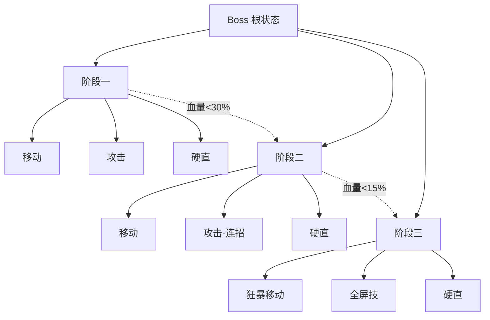
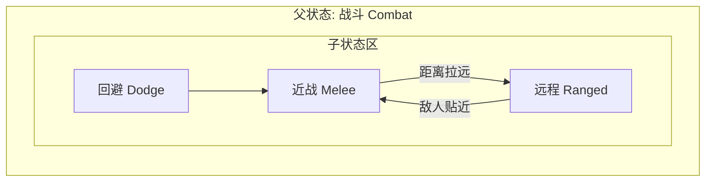
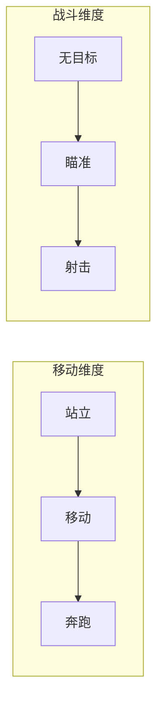

# 状态机与层次状态机（FSM / HSM）

> 知识基线：引擎无关的游戏 AI 通用原理；涉及 UE 的实现以[游戏知识/05-AI系统/05-StateTree状态树.md](../../游戏知识/05-AI系统/05-StateTree状态树.md)和[UE5.8 行为树与 AI 源码专题](../../游戏知识/12-引擎源码分析/12-行为树与AI源码.md)为交叉验证边界。
> 适用范围：适用于单机与多人客户端的 NPC 状态驱动、服务端权威状态切换、Boss/任务阶段编排、AI 策划状态图设计，以及跨引擎的 FSM/HSM 实现；动画状态机与 AI 状态机需分别验收。
> 事实边界：算法/架构结论与具体引擎、模型、平台版本分开；FSM/HSM 的状态、转换、层次和并发语义是通用概念，StateTree、动画蓝图或其他框架的 API/调度行为需以官方资料核对。
> 最后更新：2026-08-06（补齐来源、适用范围与事实边界）。
> 参考来源：[Unreal Engine 官方文档总页](https://dev.epicgames.com/documentation/en-us/unreal-engine)；交叉阅读：[游戏知识/05-AI系统/05-StateTree状态树.md](../../游戏知识/05-AI系统/05-StateTree状态树.md)、[游戏知识/12-引擎源码分析/12-行为树与AI源码.md](../../游戏知识/12-引擎源码分析/12-行为树与AI源码.md)。

> 状态机（Finite State Machine, FSM）是游戏 AI 最经典、最直观的决策模型：把 AI 的行为划分为有限个"状态"，通过"条件"在状态间切换。本文讲解 FSM 的原理、工程实现、状态设计模式，以及它的进阶形态——层次状态机（Hierarchical FSM, HSM）与并发状态（Parallel State），最后与行为树做系统对比。

---

## 一、概述

想象一个守卫 NPC 的行为：

- 平时在巡逻（Patrol）；
- 听到可疑声音，走过去查看（Investigate）；
- 看到玩家，进入警觉（Alert），短暂警告后攻击（Attack）；
- 玩家逃离视线一段时间，回到巡逻；
- 血量过低，逃跑（Flee）。

用自然语言描述很简单，但写成代码时，最容易变成"一团 if-else"：`if (看到玩家 && 距离 < 5) 攻击; else if (听到声音) 查看...`。条件一多，逻辑互相纠缠，改一处坏三处。

状态机的价值在于：**把"什么时候做什么"显式化**——每个状态只关心自己的行为，每个转换只关心自己的条件。它强迫你把 AI 行为建模成一张清晰的图，而不是一团面条。

本文结构：

- 核心概念：状态、转换、事件、动作、进入/退出回调；
- FSM 原理与两种实现（状态表 / 状态模式）；
- 层次状态机 HSM：解决状态爆炸；
- 并发状态：同一时刻多个正交状态；
- 与行为树的系统对比；
- 实用示例：敌人巡逻-警觉-攻击（含潜行 AI 与 Boss 三阶段）；
- 最佳实践与 FAQ。

> 涉及 UE 的 StateMachine 相关实现（Animation Blueprint 的状态机、AI 中的状态驱动）请参阅 UE 知识库：[游戏知识/05-AI系统](../../游戏知识/05-AI系统/README.md)，本文聚焦通用原理。

---

## 二、核心概念

| 概念 | 英文 | 定义 | 示例 |
| --- | --- | --- | --- |
| 状态 | State | AI 的一种可辨识的行为模式，具有持续性 | 巡逻、警觉、攻击、逃跑 |
| 转换 | Transition | 状态间的有向边，带触发条件 | 看到玩家 → 巡逻转警觉 |
| 事件 | Event | 触发转换的外部/内部信号 | 看到敌人、受伤、任务完成 |
| 条件 | Condition / Guard | 转换是否成立的布尔判断 | `距离 < 10 && 有视线` |
| 动作 | Action | 状态内持续执行的行为 | 沿路径移动、播放动画 |
| 进入动作 | Entry Action | 进入状态时执行一次 | 播放"发现敌人"音效 |
| 退出动作 | Exit Action | 离开状态时执行一次 | 停止当前技能 |
| 状态表 | State Table | 用表驱动描述状态与转换的数据结构 | `{from, to, condition}` 列表 |
| 状态模式 | State Pattern | 面向对象实现：每个状态一个类 | `class PatrolState : AIState` |
| 层次状态机 | HSM | 状态可嵌套，子状态继承父状态行为 | 攻击状态下的"近战/远程"子状态 |
| 并发状态 | Parallel State | 多个状态同时活跃（正交区域） | 移动状态 ∥ 战斗状态 |
| 历史状态 | History State | 记住离开时的子状态，回来时恢复 | 被打断的攻击恢复到远程 |

---

## 三、原理详解

### 3.1 FSM 的形式化定义

一个确定性有限状态机可以表示为五元组：

```
FSM = (S, E, T, s0, A)
  S  ：有限状态集合        {Patrol, Investigate, Alert, Attack, Flee}
  E  ：输入事件集合        {SeeEnemy, HearNoise, LoseEnemy, LowHP, ...}
  T  ：转换函数 S×E → S    (Patrol, HearNoise) → Investigate
  s0 ：初始状态            Patrol
  A  ：状态动作/输出       每个状态关联的行为
```

运行时循环（伪代码）：

```python
class FSM:
    def __init__(self, initial):
        self.current = initial
        self.current.on_enter()

    def update(self, dt):
        # 1. 检查所有从当前状态出发的转换
        for trans in self.current.transitions:
            if trans.condition():
                self.change_to(trans.to)
                return          # 每帧最多转换一次（可配置）
        # 2. 无转换则执行当前状态动作
        self.current.on_update(dt)

    def change_to(self, new_state):
        self.current.on_exit()
        self.current = new_state
        self.current.on_enter()
```

两个关键语义：

1. **每帧先查转换，后执行动作**：转换优先级高于状态动作，保证"紧急事件"（受伤、看到玩家）立即响应；
2. **进入/退出动作**：状态切换时执行一次性的清理与初始化，避免状态间遗留脏数据（如残留的移动目标）。

### 3.2 两种常见实现

#### 3.2.1 实现一：状态表（表驱动）

把状态与转换数据化，逻辑与数据分离：

```python
# 数据：一张表描述全部转换
transitions = [
    Transition(Patrol,      SeeEnemy,   lambda ctx: ctx.saw_enemy),
    Transition(Patrol,      HearNoise,  lambda ctx: ctx.heard_sound),
    Transition(Investigate, SeeEnemy,   lambda ctx: ctx.saw_enemy),
    Transition(Investigate, LoseInterest, lambda ctx: ctx.search_timeout),
    Transition(Alert,       SeeEnemy,   lambda ctx: ctx.enemy_in_range),
    Transition(Alert,       LoseEnemy,  lambda ctx: ctx.lost_enemy),
    Transition(Attack,      LoseEnemy,  lambda ctx: ctx.lost_enemy),
    Transition(Attack,      LowHP,      lambda ctx: ctx.hp < 0.2),
    Transition(Flee,        Safe,       lambda ctx: ctx.hp > 0.5 and ctx.far_from_enemy),
    Transition(Flee,        SeeEnemy,   lambda ctx: ctx.saw_enemy),   # 逃跑中被堵
]
```

优点：**一眼可见全貌**，适合状态数 < 15 的 AI；可用表格/JSON 配置化，策划可编辑。缺点：每个转换条件都是闭包/函数指针，逻辑复杂时表会很长；调试时"当前在哪"要靠断点。

#### 3.2.2 实现二：状态模式（State Pattern）

面向对象版本：每个状态一个类，转换逻辑分布在状态内部：

```cpp
class AIState {
public:
    virtual void OnEnter(AIContext& ctx) {}
    virtual void OnUpdate(AIContext& ctx, float dt) {}
    virtual void OnExit(AIContext& ctx) {}
    virtual AIState* CheckTransitions(AIContext& ctx) { return nullptr; }
};

class PatrolState : public AIState {
public:
    void OnEnter(AIContext& ctx) override {
        ctx.MoveTo(ctx.GetNextPatrolPoint());
    }
    void OnUpdate(AIContext& ctx, float dt) override {
        if (ctx.Arrived()) ctx.MoveTo(ctx.GetNextPatrolPoint());
    }
    AIState* CheckTransitions(AIContext& ctx) override {
        if (ctx.Perception().SawEnemy()) return new AlertState();
        if (ctx.Perception().HeardNoise()) return new InvestigateState();
        return nullptr;
    }
};
```

状态模式优点：**每个状态自包含**，加状态只加类，改动局部化；配合多态可做状态间参数传递。缺点：状态多了类爆炸；转换逻辑分散在各状态里，全局视图要靠工具生成。

#### 3.2.3 两种实现怎么选

| 维度 | 状态表 | 状态模式 |
| --- | --- | --- |
| 状态数量 | ≤ 15 清晰 | 多时靠继承/组合管理 |
| 逻辑集中度 | 转换集中一处 | 分散在各状态 |
| 配置化 | 易（表即数据） | 难 |
| 动态创建状态 | 少（表里复用实例） | 注意状态对象复用/池化 |
| 调试 | 打印"当前状态"即可 | 需要状态类断点 |
| 推荐场景 | 简单 AI、策划驱动 | 复杂行为、需要状态内大量逻辑 |

> 实务建议：**大多数游戏 AI 用状态表 + 少量状态类**即可；把"状态"当成数据建模，把"行为逻辑"放进独立的 Behavior/System，避免状态类过重。

### 3.3 层次状态机 HSM（Hierarchical FSM）

#### 3.3.1 为什么需要 HSM：状态爆炸

直接平铺状态容易爆炸。看一个例子：Boss 有三阶段（阶段1/2/3），每阶段都有 移动/攻击/硬直/狂暴 四种行为，平铺需要 3×4=12 个状态，且转换要写 12 种组合。如果再加"是否被控制"（击飞/冰冻），状态数翻倍成 24。

HSM 的解法：**状态嵌套**。把"阶段"做成父状态，把"行为"做成子状态；子状态继承父状态的转换规则。



#### 3.3.2 HSM 的语义



核心语义三条：

1. **继承（Inheritance）**：子状态没有处理的转换，交给父状态处理。父状态"血量过低→逃跑"的转换，对任意子状态生效；
2. **进入/退出链**：进入深层子状态时，父→子逐级执行 OnEnter；退出时子→父逐级 OnExit；
3. **历史状态（History）**：离开父状态时记录当前子状态，返回时恢复到离开前的子状态（如被控制打断的"远程攻击"，解除控制后继续远程）。

伪代码（简化）：

```python
class HSMState:
    def __init__(self):
        self.children = []
        self.current_child = None
        self.history = None

    def update(self, ctx, dt):
        # 先让子状态尝试处理
        if self.current_child:
            child_next = self.current_child.update(ctx, dt)
            if child_next:                       # 子状态内部转换
                self.change_child(ctx, child_next)
                return None
        # 子状态未处理，查本层转换
        return self.check_transitions(ctx)

    def change_child(self, ctx, new_child):
        if self.current_child:
            self.current_child.on_exit(ctx)
            self.history = self.current_child    # 记录历史
        self.current_child = new_child
        self.current_child.on_enter(ctx)
```

#### 3.3.3 HSM 的实际收益

- **状态数从 24 降到 8 左右**（3 父 + 5 子，去重后）；
- **公共转换只写一次**（"受伤打断"写在父状态）；
- **行为分层清晰**：父状态管"大节奏"（阶段切换），子状态管"小动作"（招式选择）；
- 经典案例：Boss 三阶段（阶段 = 父状态，招式 = 子状态）、NPC 日常（活动 = 父状态，具体动作 = 子状态）。

> 注意：HSM 不是银弹。层级过深（> 3 层）会让"当前到底在哪"难以判断，调试体验下降；行为树在"嵌套复用"上通常更顺手，见下文对比。

### 3.4 并发状态（Parallel State）

有时 AI 的多个维度是**正交**的：移动方式和战斗方式互不干扰。平铺成笛卡尔积会爆炸（3 种移动 × 3 种战斗 = 9 状态），并发状态则让两个状态同时活跃：



实现要点：

- 每个正交区域是一个独立的 FSM，共用同一个黑板/上下文；
- 各区域独立更新、独立转换；
- 冲突消解：两个区域的输出（如"移动"与"射击"的朝向）按优先级合成，由行动层仲裁；
- 典型应用：射击游戏中"移动/瞄准/开火"三轴并行；MMO 中"行走/表情/战斗状态"并行。

### 3.5 状态机的经典问题与对策

| 问题 | 现象 | 对策 |
| --- | --- | --- |
| 状态爆炸 | 平铺状态数量随维度乘积增长 | HSM / 并发状态 / 转行为树 |
| 转换遗漏 | 两个状态之间忘了加转换，AI 卡死 | 加"兜底转换"（超时回默认态）；状态图可视化审查 |
| 瞬移抖动 | 两个状态每帧互相转换 | 转换条件加"稳定窗口"（连续 N 帧满足才转换） |
| 转换风暴 | 多层 HSM 同时触发多个转换 | 每帧只执行一条转换链；转换优先级表 |
| 状态内逻辑膨胀 | OnUpdate 里塞满分支 | 状态内再用子状态/小型行为树 |
| 调试困难 | 不知道为何切换 | 状态转换日志：时间、from→to、触发条件 |

---

## 四、通用代码示例

### 4.1 守卫三状态完整示例（状态表 + 状态类混合，Python 风格）

```python
class GuardAI:
    def __init__(self, world):
        self.world = world
        self.memory = Memory()
        self.state = "patrol"          # patrol / investigate / alert / attack / search / return
        self.suspicion = 0.0           # 怀疑度 0~100
        self.search_timer = 0.0
        self.state_enter()

    # ---------- 状态进入 ----------
    def state_enter(self):
        s = self.state
        if s == "patrol":
            self.target = self.world.next_patrol_point(self)
        elif s == "investigate":
            self.target = self.memory.last_known_position
        elif s == "alert":
            self.suspicion = 60.0
            self.world.play_alert_sound(self)      # 呼叫同伴
        elif s == "search":
            self.search_timer = 5.0
            self.target = self.memory.last_known_position
        elif s == "return":
            self.target = self.home_position

    # ---------- 每帧更新 ----------
    def update(self, dt):
        # 1) 感知写入记忆（低频，由 AI 系统调度）
        # 2) 转换判定（优先级从高到低）
        if self.state != "attack" and self.memory.saw_enemy():
            if self.state != "alert":
                self.change_state("alert")
            return
        if self.state == "patrol" and self.memory.heard_sound():
            self.change_state("investigate")
            return
        if self.state == "investigate" and self.memory.saw_enemy():
            self.change_state("alert")
            return
        if self.state == "investigate" and self.arrived():
            self.change_state("search")
            return
        if self.state == "alert" and self.memory.enemy_in_attack_range():
            self.change_state("attack")
            return
        if self.state == "attack" and not self.memory.saw_enemy():
            self.change_state("search")
            return
        if self.state == "search":
            self.search_timer -= dt
            if self.search_timer <= 0:
                self.change_state("return")
                return
        if self.state == "return" and self.arrived():
            self.change_state("patrol")
            return
        # 3) 状态行为
        self.state_update(dt)

    def state_update(self, dt):
        if self.state in ("patrol", "investigate", "search", "return"):
            self.move_toward(self.target)
        elif self.state == "alert":
            self.face_enemy()
            self.suspicion = min(100, self.suspicion + 20 * dt)
        elif self.state == "attack":
            self.attack_enemy()

    def change_state(self, new_state):
        print(f"[FSM] {self.state} -> {new_state}")   # 转换日志 = 调试利器
        self.state = new_state
        self.state_enter()
```

### 4.2 HSM：Boss 三阶段（C++ 风格示意）

```cpp
// 父状态：阶段
class BossPhaseState : public HSMState {
    float hpThreshold;
    BossPhaseState* nextPhase;      // 指向下一阶段
public:
    BossPhaseState(float hpThreshold_, BossPhaseState* next = nullptr)
        : hpThreshold(hpThreshold_), nextPhase(next) {}
    HSMState* CheckTransitions(AIContext& ctx) override {
        if (nextPhase && ctx.GetHP() <= hpThreshold) return nextPhase;
        return nullptr;
    }
};

// 子状态：招式（挂在各阶段下）
class SkillState : public HSMState {
    SkillId skill;
public:
    void OnEnter(AIContext& ctx) override { ctx.CastSkill(skill); }
    HSMState* CheckTransitions(AIContext& ctx) override {
        if (ctx.SkillFinished()) return ctx.GetIdleSkill();   // 回到该阶段默认招式
        return nullptr;
    }
};

// 装配：阶段一 = {移动, 单发火球, 硬直}；阶段二 = {移动, 连招, 召唤, 硬直}...
void BuildBossHSM(BossAI& boss) {
    auto phase1 = new BossPhaseState(0.30f, phase2);   // 血量 30% 转阶段二
    phase1->AddChild(new MoveState);
    phase1->AddChild(new FireballState);
    phase1->AddChild(new StaggerState);
    boss.SetRoot(phase1);
}
```

关键点：**"硬直"等通用行为放父状态**（任何子状态被击中都进硬直，硬直结束回到历史子状态），各阶段只配置自己特有的招式子状态。

### 4.3 转换稳定性（防抖动）

```python
class TimedTransition:
    def __init__(self, condition, required_seconds=0.2):
        self.condition = condition
        self.required = required_seconds
        self.accumulated = 0.0

    def check(self, ctx, dt):
        if self.condition(ctx):
            self.accumulated += dt
            return self.accumulated >= self.required
        self.accumulated = 0.0
        return False
```

用于"追到攻击距离边缘来回横跳"的场景：距离条件必须在 0.2 秒内持续成立，才允许切换到攻击。

---

## 五、选型对比：FSM/HSM vs 行为树

### 5.1 全面对比表

| 维度 | FSM / HSM | 行为树（BT） |
| --- | --- | --- |
| 心智模型 | 状态 + 转换（图） | 任务 + 优先级（树） |
| 表现力 | 状态离散，适合"模式"型行为 | 节点组合，适合"流程+条件"型行为 |
| 复用性 | 中（状态可继承，但组合弱） | 高（子树可嵌套、可参数化） |
| 可扩展性 | 加状态=加转换，后期易乱 | 加分支=加节点，结构稳定 |
| 调试 | 打印状态转换日志 | 节点级高亮/挂起，可视化更强 |
| 与动画耦合 | 天然贴近（动画状态机同构） | 需桥接（用任务节点驱动动画状态） |
| 延迟/开销 | 极低（查表） | 低（树遍历） |
| 异步行为 | 不擅长（需要额外机制） | 天然支持（Wait/Success 等） |
| 配置化 | 表可配置 | 树可视化编辑（UE/Designer） |
| 典型场景 | 简单巡逻、动画状态、UI 流程 | 复杂 NPC、战斗 AI、任务流程 |

### 5.2 选择建议

- **状态数量 < 8、行为模式固定** → FSM，最省事；
- **有嵌套模式、阶段化结构**（Boss 三阶段、NPC 日常活动）→ HSM；
- **行为像"流程 + 条件分支"、需要大量复用** → 行为树（见 [03-行为树通用原理.md](03-行为树通用原理.md)）；
- **需要"同时做多件事"** → 并发状态或行为树并行节点；
- **大量 AI 且行为相似**（敌人群、市民）→ 行为树 + 黑板参数化，比 N 份 FSM 好维护；
- **混合使用是常态**：行为树作为主决策，内部或外部用 FSM 管理"阶段/大招状态"，FSM 也可以作为行为树的一个节点。

### 5.3 实际项目中的混合案例

- **潜行 AI**（如《合金装备》）：外层 FSM（巡逻→警觉→战斗→搜索→回位）管理"警戒等级"，内层用行为树/脚本管理具体动作（绕路、呼叫、搜身）；警戒等级本身就是"并发状态"般的存在；
- **Boss 战**：HSM 管阶段与招式切换；招式执行用行为树/动画状态机；
- **NPC 日常**（如《模拟人生》式需求系统）：需求驱动的意图选择用效用 AI（见 [04-Utility与GOAP.md](04-Utility与GOAP.md)），意图执行用 FSM（走到→坐下→用餐→离开）。

---

## 验证与基准建议

- 固定输入/场景：固定随机种子、`dt` 和初始黑板快照，使用记录好的事件序列回放 `Idle → Chase → Attack → HitStun → 恢复原子状态`，再单独覆盖 HSM 的阶段切换；每次运行只改变一个输入因素。
- 状态或行为正确性断言：同一输入序列的状态轨迹、父/子状态栈和转换原因应一致；每次 `OnEnter` 与 `OnExit` 成对，当前子状态必须属于活动父状态，转换完成后满足目标状态前置条件，且不存在无兜底的死状态。
- 指标：记录状态切换次数、转换评估次数、单次决策延迟 P50/P95/P99、转换链深度、超时兜底次数以及非法转换/状态卡死计数；不预设性能数字，以项目预算和历史基线对比为准。
- 边界用例：覆盖空事件帧、重复事件、同帧多个条件同时成立、无效目标、阈值两侧抖动、父状态退出时子状态未完成、阶段边界精确命中，以及被打断后历史状态已失效。
- 命令示意（仅示意，不表示仓库已有测试）：`python -m pytest tests/test_fsm_hsm.py -q`；C++ 可接入项目自有回放或 benchmark，对同一事件序列做状态轨迹 diff 和转换开销统计。

---

## 六、最佳实践

1. **先画状态图再写代码**：状态图是文档也是测试用例。评审状态图（有没有死状态、有没有漏转换）比评审代码便宜 10 倍。
2. **转换条件只读黑板/感知**：转换条件不要直接查询世界（射线、距离）——统一走感知系统写入的黑板，保证"AI 只能基于它知道的做决定"。
3. **进入/退出动作必须成对**：OnEnter 分配的资源（目标、计时器、动画）在 OnExit 释放，防止状态遗留。
4. **每帧只处理一条转换链**：避免同帧多层转换，必要时允许"转换队列"但限制深度。
5. **记录转换日志**：`时间 | from -> to | 触发条件值`，上线后是排查"AI 为什么发疯"的第一手资料。
6. **用稳定窗口防抖**：高频抖动转换（攻防切换、进退切换）加 0.1~0.3s 的条件持续窗口。
7. **状态对象池化**：状态模式实现时，状态实例复用，避免每帧 new/delete。
8. **兜底状态**：给每个状态配"超时兜底"（如搜索 5 秒后回巡逻），防止任何未预料情况下的永久卡死。
9. **与表现层解耦**：AI 状态 ≠ 动画状态。AI 状态输出"意图"，动画系统自己决定播放什么（愤怒→加速跑 vs 普通跑），否则 AI 改一个状态要动三处动画。
10. **考虑"历史状态"**：被打断（被控制、被击飞）后能恢复原行为，是 HSM 提供的最有价值的体验细节之一。

---

## 七、常见问题 FAQ

### Q1：FSM 和"用 if-else 写 AI"有什么区别？

区别在**结构化**：if-else 是"每帧从头判断所有条件"，状态机是"只有当前状态相关的转换被评估"。状态机天然避免"所有条件同时成立时的优先级纠缠"，并且状态进入/退出动作保证了资源生命周期。项目一复杂，if-else 必乱，状态机不乱。

### Q2：什么时候该从 FSM 迁移到行为树？

出现以下信号时考虑迁移：状态数 > 15；大量状态共享"子流程"（走路去某处、检查目标）导致复制粘贴；策划希望可视化编辑；需要频繁插入"临时行为"（被打断、被对话）。行为树详见 [03-行为树通用原理.md](03-行为树通用原理.md)。

### Q3：HSM 的"历史状态"怎么实现？

每个父状态保存 `last_child` 引用；当外部转换（如受击）离开父状态时记录，重新进入父状态时先恢复到 `last_child`（若仍有效），否则进入默认子状态。注意：历史状态可能是"过期的"（敌人已死），恢复时要校验其前置条件。

### Q4：并发状态会不会导致行为矛盾（一边逃跑一边攻击）？

会，需要**仲裁**。常见做法：给输出打优先级（移动层输出 A、战斗层输出 B，行动层按优先级/权重合成）；或定义"冲突规则表"（逃跑时禁用攻击）。并发状态只负责"各自决策"，仲裁在行动层。

### Q5：状态机适合服务端 AI 吗？

非常适合，且是服务端 AI 的常见选择之一：确定性强（无隐式随机）、开销极低、易同步（同步"当前状态 + 关键参数"即可）。配合事件驱动，空闲 NPC 零开销。注意：服务端状态机的随机分支要种子化，保证多人看到一致的"命运"。

### Q6：动画状态机和 AI 状态机是什么关系？

两者都叫状态机，但职责不同：AI 状态机输出"意图"（追击），动画状态机输出"表现"（跑步循环）。常见桥接：AI 状态 → 动画参数（速度、朝向、情绪）→ 动画状态机混合。把两者合并成一个状态机是常见反模式——AI 改状态时动画细节全丢，动画改细节时 AI 逻辑受影响。

### Q7：Boss 三阶段怎么设计才不无聊？

阶段切换要"有记忆"：转阶段时清空玩家造成的旧状态（召唤物、异常）并引入新机制（新招式、场地变化）；转阶段动作要醒目（无敌演出、全屏特效），给玩家"节奏变化"的感知；每个阶段的子状态（招式）要有差异化——不是换数值，而是换规则。结构上就是 HSM 的天然应用。

### Q8：怎么调试"AI 卡在某个状态"？

三步：① 看转换日志，确认最后一条转换是什么；② 检查该状态的"兜底转换"是否缺失（超时回默认态）；③ 检查 OnEnter 是否抛异常（异常吞掉后状态机停止推进是常见元凶）。再加一个"状态看板"（当前状态 + 关键黑板值 HUD 显示）会事半功倍。

---

## 八、关联阅读

- 上一篇：[01-AI总体架构与感知.md](01-AI总体架构与感知.md) —— 感知系统（视觉/听觉/记忆）为状态转换提供条件输入；
- 下一篇：[03-行为树通用原理.md](03-行为树通用原理.md) —— 行为树与 FSM 的对比、适用边界与混合使用；
- 本分类：[04-Utility与GOAP.md](04-Utility与GOAP.md) —— 需求驱动的意图选择，常与 FSM 的执行层组合；
- UE 客户端：[游戏知识/05-AI系统/README.md](../../游戏知识/05-AI系统/README.md) —— UE 侧 AI 系统总导航（AI Controller、Behavior Tree、EQS）；
- UE 客户端：[01-行为树详解.md](../../游戏知识/05-AI系统/01-行为树详解.md) —— UE 行为树与黑板的具体实现。

---

> 本文为引擎无关的 FSM/HSM 通用原理；UE 中状态机常用于动画蓝图（Animation Blueprint）与 AI 状态驱动，具体节点与接口请以 UE 知识库为准。
