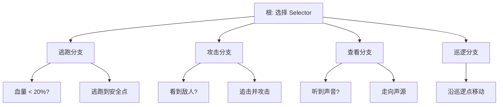
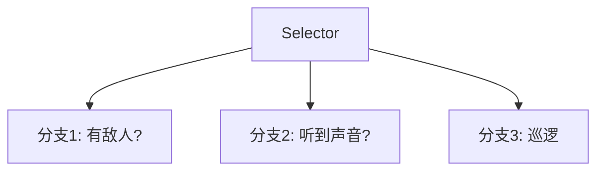
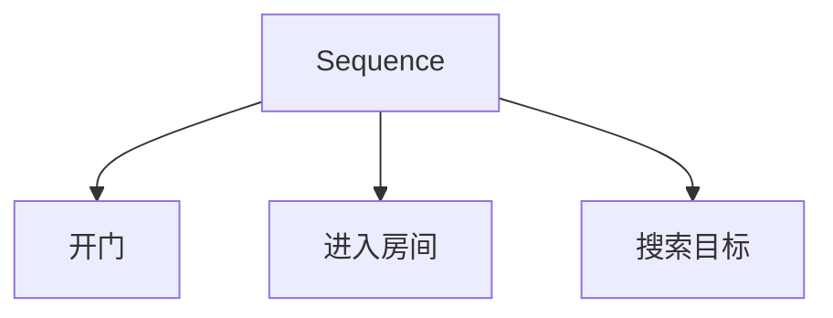
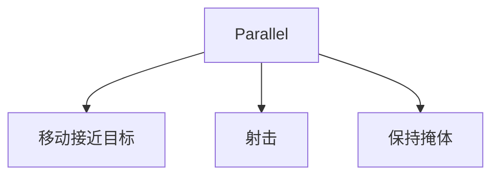
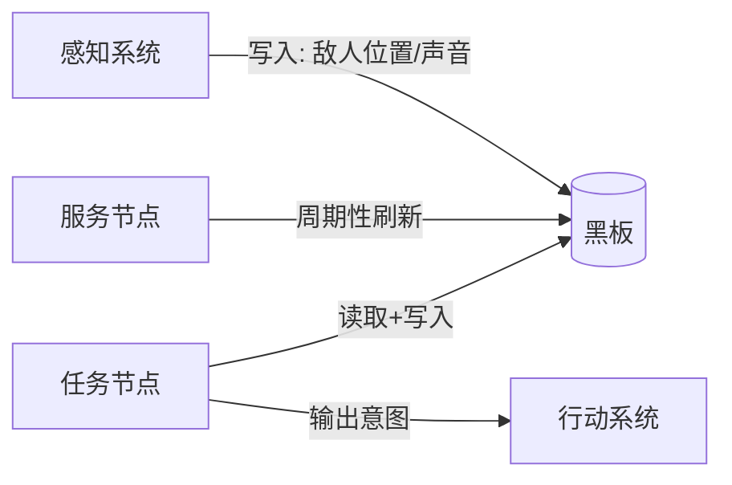
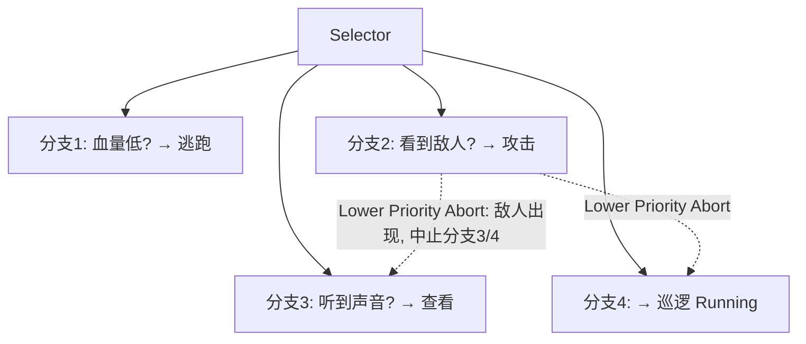

# 行为树通用原理（Behavior Tree）

> 知识基线：引擎无关的游戏 AI 通用原理；涉及 UE 的实现以[游戏知识/05-AI系统/01-行为树详解.md](../../游戏知识/05-AI系统/01-行为树详解.md)和[UE5.8 行为树与 AI 源码专题](../../游戏知识/12-引擎源码分析/12-行为树与AI源码.md)为交叉验证边界。
> 适用范围：适用于单机与多人客户端的 NPC 决策、服务端 AI 的可控执行、AI 策划树结构设计、跨引擎行为树运行时，以及与 FSM/Utility/GOAP 的混合架构；具体调度频率和调试工具需按实现验收。
> 事实边界：算法/架构结论与具体引擎、模型、平台版本分开；Selector/Sequence/Parallel、Running/Success/Failure 和中止语义为通用模型，UE 行为树的节点类、黑板和版本行为需以官方资料核对；示例代码与图均为示意。
> 最后更新：2026-08-06（补齐来源、适用范围与事实边界）。
> 参考来源：[Unreal Engine 官方文档总页](https://dev.epicgames.com/documentation/en-us/unreal-engine)；交叉阅读：[游戏知识/05-AI系统/01-行为树详解.md](../../游戏知识/05-AI系统/01-行为树详解.md)、[游戏知识/12-引擎源码分析/12-行为树与AI源码.md](../../游戏知识/12-引擎源码分析/12-行为树与AI源码.md)。

> 行为树（Behavior Tree, BT）是商业游戏中常见的 AI 决策技术：它把 AI 行为组织成"树"，从根节点出发，按"选择/序列/并行"等组合节点自上而下求值，得到一条要执行的行为路径。行为树以**模块化、可复用、可视化、可调试**著称，是《光环》《生化危机》《蝙蝠侠：阿卡姆》等系列采用过的技术。本文讲解引擎无关的行为树通用原理，UE 具体实现请见 UE 知识库。

---

## 一、概述

为什么行为树常被用于替代部分 FSM 流程？用一个例子说明：

守卫 AI 的需求："看到敌人就攻击，没看到就巡逻；如果血量低先逃跑；听到声音去查看。"用 FSM 写，状态与转换会随需求增长快速膨胀；用行为树写，它是这样一棵树：



行为树的运行规则非常朴素：

- **选择节点（Selector / 或）**：从左到右尝试子节点，**第一个成功**的胜出；
- **序列节点（Sequence / 与）**：从左到右执行子节点，**全部成功**才算成功，任一失败即失败；
- 叶子节点是**任务**（行动）或**条件**（判断）。

就凭这两条规则 + 一颗树，行为树实现了 FSM 需要大量转换才能表达的逻辑，并且：加需求 = 加分支；改行为 = 改子树；调试 = 看节点状态高亮。

本文结构：核心概念 → 节点类型详解 → 执行语义与 Tick → 黑板数据流 → 中止机制（Abort）→ 跨引擎对比 → 设计规范与反模式 → 最佳实践 → FAQ → 关联阅读。

---

## 二、核心概念

| 概念 | 英文 | 定义 | 示例 |
| --- | --- | --- | --- |
| 行为树 | Behavior Tree | 用树结构表达 AI 行为的决策模型 | 守卫 AI 的整棵树 |
| 节点 | Node | 树的基本单元，返回 Running/Success/Failure | 选择、序列、任务 |
| 根节点 | Root | 树入口，每 Tick 从这里开始求值 | — |
| 选择节点 | Selector / Fallback | 依次尝试子节点，首个成功即成功 | 逃跑→攻击→巡逻 |
| 序列节点 | Sequence | 依次执行子节点，全部成功才成功 | 开门→进入→搜索 |
| 并行节点 | Parallel | 同时执行多个子节点，按策略聚合结果 | 边移动边射击 |
| 装饰器 | Decorator | 包裹单个子节点，修改其执行条件/结果 | 冷却中禁止攻击、取反 |
| 服务节点 | Service | 挂载后周期性执行后台逻辑 | 每 0.2s 刷新目标位置 |
| 任务节点 | Task / Action | 叶子：执行具体行为或判断 | 移动到目标点 |
| Tick | Tick | 一次求值周期，返回三态结果 | 每帧/每 0.1s 一次 |
| 黑板 | Blackboard | 树内共享数据的键值存储 | 目标、位置、状态标志 |
| 中止 | Abort | 高优先级分支打断低优先级分支的机制 | 看到敌人立刻中止巡逻 |
| 条件中止 | Condition Abort | 条件变为真时中止低优先级节点 | 敌人进入视野即中止 |
| 低优先级中止 | Lower Priority Abort | 低优先级节点运行时被高优先级抢占 | 逃跑打断攻击 |
| 自身中止 | Self Abort | 条件变为假时中止自己 | 目标丢失时中止追击 |

---

## 三、原理详解

### 3.1 节点类型详解

#### 3.1.1 执行状态（三态）

每个节点的求值结果只有三个：

| 状态 | 含义 | 典型来源 |
| --- | --- | --- |
| `Success` | 成功 | 任务完成、条件为真 |
| `Failure` | 失败 | 任务无法完成、条件为假 |
| `Running` | 进行中 | 长时任务（移动中、等待中）未结束 |

`Running` 是行为树区别于"一次性脚本"的关键：**长时任务跨多个 Tick 持续执行**，而组合节点据此决定继续等待还是放弃。

#### 3.1.2 组合节点（Composite）

**选择节点 Selector（"或"）**：



语义：从左到右求值；子节点返回 `Success` → 整体 `Success`（短路）；子节点返回 `Failure` → 尝试下一个；全部 `Failure` → 整体 `Failure`；子节点返回 `Running` → 整体 `Running`（下 Tick 从该子节点继续）。

**序列节点 Sequence（"与"）**：



语义：从左到右执行；子节点返回 `Failure` → 整体 `Failure`（短路）；全部 `Success` → 整体 `Success`；任一 `Running` → 整体 `Running`（下 Tick 从该子节点继续）。

**并行节点 Parallel**：



语义：同时 Tick 所有子节点，聚合策略可配置：

| 聚合策略 | 规则 | 用途 |
| --- | --- | --- |
| AND | 全部成功才成功；任一失败即失败 | 严格协同 |
| OR | 任一成功即成功；全部失败才失败 | 宽松协同 |
| 计数 | N 个成功即成功 | 多数表决 |

并行节点注意：子节点间要避免写同一个黑板键（竞争写），或明确仲裁。

#### 3.1.3 装饰器（Decorator）

装饰器包裹单个子节点，**在执行前/后修改行为**：

| 装饰器 | 效果 | 示例 |
| --- | --- | --- |
| 条件检查 | 条件为真才执行子节点 | `冷却完毕?` 才允许放技能 |
| 取反 Inverter | 反转子节点结果 | 敌人不在附近 |
| 重复 Repeat | 子节点成功后重复 N 次/无限次 | 巡逻循环 |
| 重试 Retry | 子节点失败后重试 N 次 | 攻击失败重试 2 次 |
| 限时 TimeLimit | 子节点超时则失败 | 搜救 10 秒未果放弃 |
| 概率 Probability | 按概率决定是否执行 | 30% 概率说句台词 |
| 冷却 Cooldown | 执行后冷却期 | 大招 CD |
| 强制失败/成功 | 忽略子节点结果 | 错误容忍 |

伪代码（条件装饰器）：

```python
class ConditionDecorator:
    def __init__(self, condition, child):
        self.condition = condition
        self.child = child

    def tick(self, ctx, dt):
        if not self.condition(ctx):
            return Status.FAILURE     # 条件不满足，整枝失败
        return self.child.tick(ctx, dt)
```

#### 3.1.4 服务节点（Service）

服务节点挂载在组合节点上，**只要该组合节点处于激活（Running）状态，就周期性执行**，用于维护黑板数据：

```mermaid
flowchart TD
    S[Selector] -.服务: 每0.2s更新最近敌人位置.-> S
    S --> A1[攻击分支]
    S --> A2[巡逻分支]
```

典型服务：

- 刷新"最近敌人"到黑板；
- 刷新"目标点"（玩家预测位置）；
- 维护"弹药/血量"等状态缓存；
- 向表现层同步 AI 意图。

伪代码：

```python
class Service:
    def __init__(self, interval=0.2):
        self.interval = interval
        self.acc = 0.0

    def tick(self, ctx, dt):
        self.acc += dt
        if self.acc >= self.interval:
            self.acc = 0.0
            self.execute(ctx)          # 例如: ctx.blackboard["nearest_enemy"] = ...
```

### 3.2 执行语义与 Tick

#### 3.2.1 一次 Tick 的完整流程

```python
def tick_tree(root, ctx, dt):
    # 1. 根节点开始求值（深度优先，从左到右）
    status = root.tick(ctx, dt)
    # 2. 处理结果
    if status == Status.SUCCESS:
        # 整棵树完成：通常意味着"本轮行为结束"，下轮重新开始
        pass
    elif status == Status.FAILURE:
        # 整树失败：记录，等待下轮
        pass
    # 3. Running：下个 Tick 从"上次运行到哪"继续
    return status
```

关键机制：**记忆（Memory）**。行为树分两类：

| 类型 | 记忆 | 行为 | 典型实现 |
| --- | --- | --- | --- |
| 无记忆树 | 每 Tick 从根重新求值 | 简单、开销小、易抖动 | 早期行为树 |
| 有记忆树 | 记住上次 Running 的节点，下次从该节点继续 | 行为连续、不重复执行已成功步骤 | UE BT、常见实现 |

有记忆的实现：每个节点保存"上次状态"；组合节点记住"当前执行到哪个子节点"：

```python
class Sequence:
    def __init__(self, children):
        self.children = children
        self.running_index = 0

    def tick(self, ctx, dt):
        i = self.running_index
        while i < len(self.children):
            s = self.children[i].tick(ctx, dt)
            if s == Status.RUNNING:
                self.running_index = i        # 记住位置
                return Status.RUNNING
            if s == Status.FAILURE:
                self.reset()                  # 序列失败，清空记忆
                return Status.FAILURE
            i += 1
        self.reset()
        return Status.SUCCESS
```

#### 3.2.2 Running 节点的生命周期

长时任务（如"移动到目标点"）的生命周期：

```python
class MoveToTask:
    def tick(self, ctx, dt):
        if not ctx.has_path:                 # 首次进入：初始化
            if not ctx.compute_path(target): # 寻路失败
                return Status.FAILURE
            ctx.has_path = True
        ctx.move_along_path(dt)              # 持续执行
        if ctx.arrived():
            ctx.has_path = False             # 清理
            return Status.SUCCESS
        return Status.RUNNING
```

规范要求：

- 任务节点**必须能正确处理"被打断"**（被中止时清理自己创建的临时状态）；
- 任务节点**不要假设"上次 Tick 我还活着"**——中止可能发生在任何时刻；
- 任务节点失败时也要**清理**（如寻路失败后释放路径）。

#### 3.2.3 Tick 频率与分帧

行为树每 Tick 一次求值。Tick 频率是性能与响应性的权衡：

- 战斗 AI：10~30 Hz（甚至每帧）；
- 普通 NPC：2~10 Hz；
- 大世界海量 NPC：1~2 Hz + 分帧错开 + 距离分级（详见 [01-AI总体架构与感知.md](01-AI总体架构与感知.md) 的 3.5 节）。

> 注意：Tree Tick 与感知 Tick 解耦。感知系统低频写入黑板（2~10Hz），行为树中频读黑板求值，两者频率独立配置。

### 3.3 黑板数据流

行为树本身不持有数据，数据全部在**黑板**上流动：



典型数据流示例（追击 AI）：

```text
1. 感知系统（2Hz）→ 黑板["last_known_enemy_pos"]
2. 服务节点（0.2s）→ 黑板["nearest_enemy"] = 距离最近且可见的敌人
3. 装饰器条件 → 读黑板["nearest_enemy"] != null
4. 任务节点 MoveTo → 读黑板["last_known_enemy_pos"]，写黑板["moving"] = true
5. 任务节点 Attack → 读黑板["nearest_enemy"]，写黑板["attacking"] = true
```

黑板设计规范：

- **键集中定义**（常量/枚举），避免魔法字符串；
- **类型固定**，运行时校验；
- **写权限分级**：感知域键只允许感知系统写；
- **变更通知**：重要键（如"敌人进入视野"）变化时通知相关节点，是条件中止的底层实现；
- **生命周期管理**：临时键用后即清，防止"上一场战斗的残留数据"污染下一场。

### 3.4 中止机制（Abort）

中止是行为树最强大也最容易踩坑的机制：**让高优先级分支能打断正在执行的低优先级分支**。

#### 3.4.1 为什么需要中止

没有中止的行为树是"轮询制"：低优先级分支（巡逻）正在 Running，高优先级分支（发现敌人→攻击）必须等巡逻结束才能被评估。这不行——敌人出现必须立刻响应。

#### 3.4.2 三种中止类型

| 中止类型 | 含义 | 场景 |
| --- | --- | --- |
| 条件中止（Condition Abort） | 当条件变为真时，中止正在执行的低优先级分支 | "看到敌人"条件变真 → 中止巡逻 |
| 低优先级中止（Lower Priority Abort） | 中止当前分支，让位于右侧更高优先级分支 | 逃跑（更高优先级）打断攻击 |
| 自身中止（Self Abort） | 自己运行的条件变为假时，中止自己 | 追击中目标丢失 → 中止追击 |

用一张图理解（选择节点下的分支，越靠左优先级越高）：



#### 3.4.3 实现原理

条件中止的常见实现：

```python
class SelectorWithAbort:
    def __init__(self, children):
        self.children = children
        self.current = None

    def tick(self, ctx, dt):
        # 1. 中止检查：从左到右扫描所有未执行分支的条件装饰器
        for i, child in enumerate(self.children):
            cond = child.condition
            if cond and cond.is_true(ctx):
                if self.current is not None and self.current != child:
                    self.current.abort(ctx)      # 中止当前运行分支（调用清理）
                self.current = child
                return child.tick(ctx, dt)
        # 2. 无条件触发：继续当前分支
        if self.current:
            s = self.current.tick(ctx, dt)
            if s != Status.RUNNING:
                self.current = None
            return s
        return Status.FAILURE
```

关键实现细节：

- **中止必须调用被中止节点的清理**（Abort 回调），否则残留"正在移动"的脏状态；
- **每 Tick 都检查高优先级条件**（即使当前分支正在 Running）——这是中止的本质；
- 中止检查有开销，所以"条件中止"通常只挂在少数关键分支上，不要给每个分支都挂。

#### 3.4.4 中止的常见错误

| 错误 | 现象 | 修复 |
| --- | --- | --- |
| 中止风暴 | 两个分支互相中止，AI 抖动 | 中止条件加稳定窗口（见 02 篇防抖）；检查条件互斥性 |
| 忘记清理 | 中止后任务残留（还在寻路） | 任务节点实现 `OnAbort()` 清理 |
| 滥用条件中止 | 全树条件频繁求值，性能下降 | 只给"紧急响应"分支挂中止 |
| 优先级理解反 | 想"逃跑优先"却把逃跑放右边 | 记住：**左侧优先**，高优先级放左 |

### 3.5 跨引擎对比

| 维度 | UE 行为树 | Unity Behavior Designer | 自研行为树 |
| --- | --- | --- | --- |
| 资产形式 | 蓝图资产（可视化编辑） | 可视化编辑器（节点面板） | 代码/JSON/可视化自选 |
| 黑板 | 内置 Blackboard 资产（键值+类型） | Blackboard 变量 + 共享变量 | 自研（键值+通知） |
| 中止 | 三种中止（Lower/Self/Both）原生支持 | 支持条件中止（Abort Types） | 需自行实现 |
| 服务节点 | Service 原生 | 支持（服务/条件任务） | 需自行实现 |
| 并行节点 | 原生 Parallel | 原生 Parallel | 需自行实现 |
| 调试 | 运行时节点高亮 + 黑板观察 | 运行时可视化 | 自研调试器 |
| 与 EQS/感知集成 | AIPerception + EQS 深度集成 | 通过脚本集成 | 自研 |
| 扩展方式 | C++ 或蓝图自定义节点 | C# 继承 Task/Decorator | 完全自由 |
| 学习成本 | 中（编辑器强大但概念多） | 中（API 清晰） | 高（全自研） |

> UE 行为树的节点、黑板、中止机制的**具体使用**（含编辑器操作与 C++ 接口）请参阅：[游戏知识/05-AI系统/01-行为树详解.md](../../游戏知识/05-AI系统/01-行为树详解.md)。本文只讲通用原理，保证"换引擎不换脑"。

### 3.6 行为树 vs FSM 再讨论

行为树不是 FSM 的全面替代，而是互补（完整对比见 [02-状态机与层次状态机.md](02-状态机与层次状态机.md) 第五节）：

- 行为树擅长：**流程编排**（先 A 后 B 再 C）、**条件优先级**（紧急→重要→日常）、**模块复用**（子树参数化）；
- FSM 擅长：**模式化状态**（警戒等级）、**强约束转换**（必须从 A 经 B 到 C）、**与动画/UI 状态同构**；
- 常见组合：行为树做总决策，树内嵌 FSM 节点管理"阶段"，或用 FSM 管理"警戒等级"而行为树执行具体动作。

---

## 四、通用代码示例

### 4.1 最小行为树运行时（Python，约 100 行）

```python
from enum import Enum

class Status(Enum):
    SUCCESS = 0
    FAILURE = 1
    RUNNING = 2

class Node:
    def tick(self, ctx, dt): raise NotImplementedError
    def abort(self, ctx): pass                 # 被中止时的清理钩子

class Task(Node):
    def __init__(self, fn): self.fn = fn
    def tick(self, ctx, dt): return self.fn(ctx, dt)

class Condition(Task):                         # 条件任务：只返回 SUCCESS/FAILURE
    def tick(self, ctx, dt):
        return Status.SUCCESS if self.fn(ctx, dt) else Status.FAILURE

class Selector(Node):
    def __init__(self, children, abort_conditions=None):
        self.children = children
        self.abort_conditions = abort_conditions or [None]*len(children)
        self.current = None
    def tick(self, ctx, dt):
        for i, child in enumerate(self.children):
            cond = self.abort_conditions[i]
            if cond and cond(ctx, dt) and self.current is not child:
                if self.current: self.current.abort(ctx)
                self.current = child
                return child.tick(ctx, dt)
        if self.current:
            s = self.current.tick(ctx, dt)
            if s != Status.RUNNING: self.current = None
            return s
        for child in self.children:
            s = child.tick(ctx, dt)
            if s != Status.FAILURE:
                self.current = child if s == Status.RUNNING else None
                return s
        return Status.FAILURE

class Sequence(Node):
    def __init__(self, children):
        self.children = children
        self.idx = 0
    def tick(self, ctx, dt):
        while self.idx < len(self.children):
            s = self.children[self.idx].tick(ctx, dt)
            if s == Status.RUNNING: return Status.RUNNING
            if s == Status.FAILURE:
                self.idx = 0; return Status.FAILURE
            self.idx += 1
        self.idx = 0
        return Status.SUCCESS
```

### 4.2 用最小运行时搭建"潜行 AI 哨兵"

```python
def build_sentry_tree():
    return Selector(
        children=[
            Sequence([Condition(see_enemy), Task(attack_enemy)]),
            Sequence([Condition(heard_noise), Task(investigate_noise)]),
            Sequence([Condition(health_low), Task(flee_to_safety)]),
            Task(patrol_loop),
        ],
        abort_conditions=[None, see_enemy, see_enemy, see_enemy],
        # 解释：分支2/3/4 都挂"看到敌人"条件中止
    )
```

### 4.3 任务节点实现规范（C++ 风格）

```cpp
class MoveToTask : public BTTaskNode {
    FBlackboardKeySelector TargetKey;
public:
    EBTNodeResult ExecuteTask(UBehaviorTreeComponent& bt) override {
        // 首次执行：初始化
        if (!bt.GetBlackboard().GetValueAsVector(TargetKey, target)) {
            return EBTNodeResult::Failed;          // 无目标：失败
        }
        if (!ComputePath(target)) return EBTNodeResult::Failed;
        return EBTNodeResult::InProgress;          // 开始 Running
    }
    void TickTask(UBehaviorTreeComponent& bt, float dt) override {
        if (MoveAlongPath(dt)) {
            FinishLatentTask(bt, EBTNodeResult::Succeeded);
        }
    }
    void OnTaskFinished(UBehaviorTreeComponent& bt, EBTNodeResult result) override {
        ClearPath();                               // 无论成败都要清理
    }
    void OnTaskAborted(UBehaviorTreeComponent& bt) override {
        ClearPath();                               // 被中止同样清理
    }
};
```

规范要点：**ExecuteTask（初始化）→ TickTask（持续）→ 结束/中止（清理）** 三阶段完整实现，缺一不可。

---

## 五、选型对比：行为树 vs 其他决策技术

| 维度 | 行为树 | FSM/HSM | 效用 AI | GOAP |
| --- | --- | --- | --- | --- |
| 决策模型 | 优先级 + 流程 | 状态 + 转换 | 连续评分 | 目标 + 规划 |
| 行为多样性 | 高（组合爆炸可控） | 中 | 高（连续可调） | 极高（动态组合） |
| 可预测性 | 高 | 最高 | 中 | 低（规划结果不确定） |
| 策划友好度 | 高（可视化） | 中 | 中（曲线难调） | 低（需理解动作图） |
| 性能 | 低开销 | 最低 | 中（评分多） | 高（A* 规划） |
| 典型场景 | 战斗/日常/流程 | 模式/阶段/动画 | 需求选择/情绪 | 开放任务/生存 |
| 与行为树组合 | — | 树内嵌状态节点 | 树内"效用选择节点" | 树内"GOAP 节点" |

> 详细对比见 [04-Utility与GOAP.md](04-Utility与GOAP.md) 第五节的三类决策技术选型对比表。

---

## 六、设计规范与反模式

### 6.1 设计规范（Do）

1. **树要"浅而宽"**：深度 ≤ 5 层左右；过深说明组合逻辑复杂，应拆子树。
2. **条件与动作分离**：`Selector[ Condition?, Action ]` 是标准单元，条件节点只判断不执行，动作节点只执行不判断。
3. **子树参数化**：同一个"移动到目标"子树，通过黑板键参数区分目标，而不是复制粘贴。
4. **紧急响应靠中止**，常规选择靠顺序：把"必须立刻响应"的分支放左侧并挂条件中止；常规行为放右侧自然轮询。
5. **任务节点自包含**：初始化、执行、清理三段完整，能独立测试。
6. **服务节点做数据维护**：把"每帧刷数据"从任务节点里抽出来，任务只消费数据。
7. **树资产版本化**：行为树是策划资产，纳入版本管理与评审流程。
8. **运行时可观察**：节点状态、黑板值、Tick 频率都要能可视化/导出，出问题能回放。

### 6.2 反模式（Don't）

| 反模式 | 描述 | 后果 | 修正 |
| --- | --- | --- | --- |
| 面条树 | 所有逻辑塞进一棵大树，深 20 层 | 不可读、不可维护 | 拆子树、按模块分层 |
| 动作里写条件 | 任务节点内部 if 判断"要不要做" | 条件逻辑无法可视化、无法中止 | 用装饰器/条件节点表达 |
| 条件里做动作 | 条件节点产生副作用 | 条件求值≠执行，副作用失控 | 条件只读黑板 |
| 滥用 Running | 任务永不结束（返回 Running 到底） | 树卡死 | 任务必须有终态路径 |
| 全局条件中止 | 所有分支都挂中止 | 每 Tick 全树条件求值，性能差、抖动 | 只挂紧急分支 |
| 黑板魔法键 | 字符串满天飞 | 拼错键、类型错、找不到写者 | 常量表 + 调试器 |
| 共享子树带私货 | 子树内部写死黑板键 | 复用即冲突 | 子树参数化（输入/输出键） |
| 忽视 Abort 清理 | 任务 OnAbort 为空 | 残留下次 Tick 的脏状态 | 三阶段完整实现 |

### 6.3 真实项目案例

- **《光环》系列**：Boss/精英敌人用行为树编排"攻击节奏+撤退+召唤"；玩家可见的"AI 决策"（扔手雷时机）由装饰器条件 + 冷却控制；
- **《生化危机》系列**：敌人 AI 用行为树 + 感知；"攻击 vs 接近"的取舍靠中止与条件优先级；
- **《蝙蝠侠：阿卡姆》系列**：大量杂兵用共享行为树模板，黑板参数（巡逻路线、武器类型）实例化差异化行为；
- **潜行 AI（哨兵）**：见 4.2 示例——视觉/听觉条件 + 状态型任务（搜索、回位），是行为树最典型的教科书应用。

---

## 七、最佳实践

1. **以"行为单元"为单位思考**：把 AI 行为拆成可复用的单元（移动到点、搜索区域、攻击目标、呼叫增援），每个单元一棵子树，像搭积木一样组树。
2. **条件全部走黑板**：行为树不直接感知世界；感知系统写黑板，树读黑板。这让"AI 只知道它该知道的"成为架构事实而非纪律。
3. **中止机制是性能与体验的平衡点**：全树无中止 = 响应迟钝；全树中止 = 抖动 + 浪费。只给 2~3 个关键紧急分支挂条件中止。
4. **Tick 频率分级**：战斗 AI 高频、路人 AI 低频；树内"服务节点频率"独立于"树 Tick 频率"配置。
5. **失败也要优雅**：每个任务想清楚"失败后怎么办"（重试、降级、换分支），行为树里留"兜底分支"（如：所有分支都失败 → 发呆/回巡逻）。
6. **调试优先设计**：节点状态高亮、黑板监视、转换日志三件套必须有；上线后 AI 问题 80% 靠这三件套定位。
7. **性能预算**：大世界海量 NPC 时，树 Tick 分帧 + 感知低频 + 共享树模板（几百 NPC 共用一棵实例化树），可以显著降本。
8. **与 FSM/效用 AI 混合**：不要"纯 BT 主义"。阶段用 FSM、择优用效用节点、规划用 GOAP 节点，行为树是"总装线"。

---

## 八、常见问题 FAQ

### Q1：行为树和状态机到底选哪个？

看行为模式：行为像"流程 + 条件分支"（先做 A，能做 B 就 B，否则 C）→ 行为树；行为像"模式 + 阶段"（巡逻模式、战斗模式、狂暴阶段）→ FSM/HSM。绝大多数商业项目以行为树为主、FSM 为辅。对比详见 [02-状态机与层次状态机.md](02-状态机与层次状态机.md) 第五节。

### Q2：为什么我的行为树 AI"反应慢半拍"？

三个常见原因：① 树 Tick 频率太低（建议战斗 10Hz+）；② 条件中止没挂（低优先级分支 Running 时高优先级分支不被检查）；③ 感知系统频率低（视觉 2Hz，信息本来就慢）。逐个排查。

### Q3：行为树会"死循环"吗？

会。常见于：`Repeat` 装饰器无限重复 + 任务永远返回 Success 但世界状态不变；或两个条件互斥性不足导致分支互相抢占（中止风暴）。防御：任务必须有终态；中止条件加稳定窗口；树资产做"循环检测"工具检查。

### Q4：一棵树怎么服务几百个 NPC？

用**共享树模板 + 实例化黑板**：几百个 NPC 共用一棵树的逻辑（只读），每个 NPC 一个黑板（可写）保存自己的目标、状态、参数。树逻辑零拷贝，黑板按需分配。这是 UE 等引擎的标准做法（Behavior Tree 资产 + 实例化）。

### Q5：Running 任务被中止后，下次怎么恢复？

默认**不恢复**：中止 = 放弃该分支，下次从 Selector 左侧重新求值。需要"恢复现场"的场景（如被打断的搜索）用黑板键记录进度（已搜索的点列表），任务重新开始时读取进度继续。

### Q6：服务节点和"任务里的循环"有什么区别？

服务节点挂在组合节点上，**只要组合在 Running 就周期性执行**，与具体任务无关——适合"持续维护数据"（刷新目标、维护距离）。任务里的循环是任务自身逻辑——适合"任务内部的多步操作"。数据维护放服务，流程操作放任务。

### Q7：并行节点里多个子任务冲突怎么办？

仲裁在行动层（移动输出 vs 攻击输出按优先级合成），或通过黑板协议（如"攻击任务先写黑板 [want_facing]，移动任务读取转向"）。并行节点内部不要互相写同一黑板键。

### Q8：行为树怎么和动画状态机配合？

行为树任务节点输出"意图参数"（速度、朝向、攻击类型）到黑板，动画系统读取参数驱动动画状态机混合/切换；长动画（大招）用"动画通知 → 黑板事件 → 行为树节点"回传完成信号。切忌行为树直接控制动画播放。

### Q9：服务端能用行为树吗？

能，但注意：① 确定性（随机种子、浮点规范、无帧率依赖——用固定 Tick 步长）；② 与客户端表现解耦（服务端只跑决策+移动意图，客户端跑表现）；③ 树资产要随版本同步。大世界服务端 AI 常把行为树降频（1~5Hz）以摊薄成本。

---

## 九、关联阅读

- 上一篇：[02-状态机与层次状态机.md](02-状态机与层次状态机.md) —— FSM/HSM 原理与行为树对比、混合使用；
- 本分类：[01-AI总体架构与感知.md](01-AI总体架构与感知.md) —— 感知系统与黑板架构（行为树的数据源头）；
- 本分类：[04-Utility与GOAP.md](04-Utility与GOAP.md) —— 效用 AI 与 GOAP，可作为行为树的"择优/规划"扩展；
- UE 客户端：[游戏知识/05-AI系统/01-行为树详解.md](../../游戏知识/05-AI系统/01-行为树详解.md) —— UE Behavior Tree 节点、黑板、中止的具体实现；
- UE 客户端：[游戏知识/05-AI系统/02-感知系统与EQS.md](../../游戏知识/05-AI系统/02-感知系统与EQS.md) —— AIPerception 与 EQS 与行为树的集成；
- UE 客户端：[游戏知识/05-AI系统/README.md](../../游戏知识/05-AI系统/README.md) —— UE 侧 AI 系统总导航。

---

> 本文为引擎无关的行为树通用原理；UE 的节点类型、中止枚举、黑板资产等具体细节请以 UE 知识库为准。
