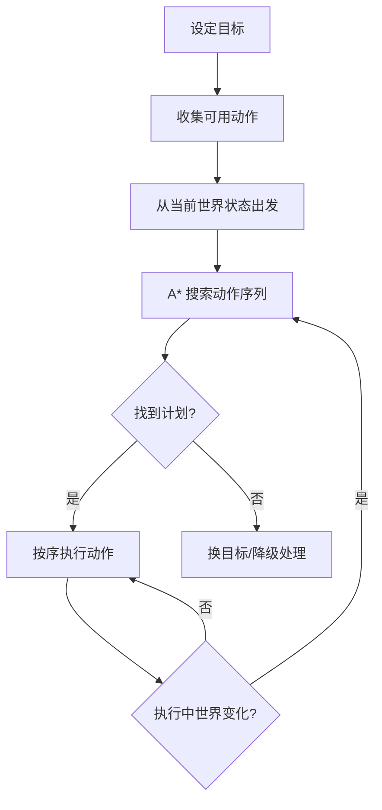
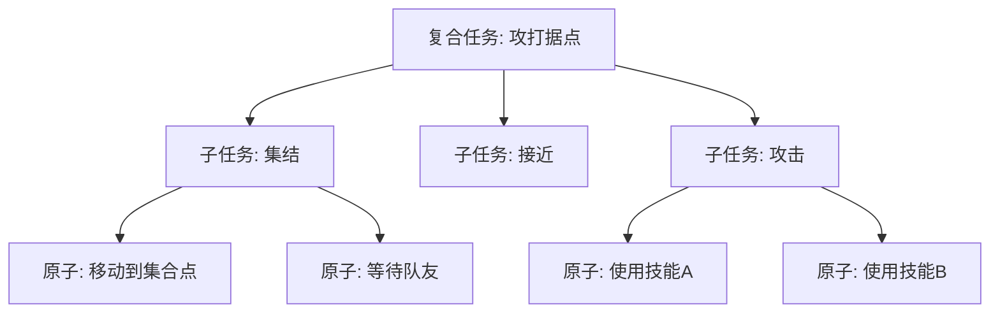
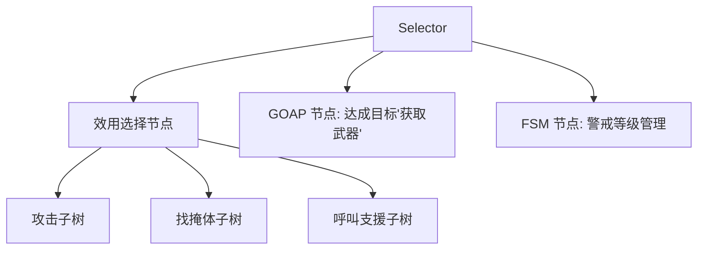

# 效用 AI 与 GOAP（Utility AI / GOAP / HTN）

> 知识基线：引擎无关的游戏 AI 通用原理；涉及 UE 的实现以[游戏知识/05-AI系统/01-行为树详解.md](../../游戏知识/05-AI系统/01-行为树详解.md)和[UE5.8 行为树与 AI 源码专题](../../游戏知识/12-引擎源码分析/12-行为树与AI源码.md)为交叉验证边界。
> 适用范围：适用于单机与多人客户端的 NPC 目标选择/规划、服务端关键 AI 的有限搜索、AI 策划权重与动作库设计，以及跨引擎的 Utility/GOAP/HTN 混合架构；搜索规模、调参成本和部署位置需按项目评估。
> 事实边界：算法/架构结论与具体引擎、模型、平台版本分开；Utility/GOAP/HTN、A* 和行为树组合是通用方法，具体插件、运行时调度和性能数字需以官方资料、实测与项目回放核对；案例与经验不等于通用方案，示例代码为示意。
> 最后更新：2026-08-06（补齐来源、适用范围与事实边界）。
> 参考来源：[Unreal Engine 官方文档总页](https://dev.epicgames.com/documentation/en-us/unreal-engine)；交叉阅读：[游戏知识/05-AI系统/01-行为树详解.md](../../游戏知识/05-AI系统/01-行为树详解.md)、[游戏知识/12-引擎源码分析/12-行为树与AI源码.md](../../游戏知识/12-引擎源码分析/12-行为树与AI源码.md)。

> 状态机与行为树回答"按什么规则做"，本文的两种技术回答更"聪明"的问题：**效用 AI（Utility AI）回答"同时有多个合理选择时选哪个"**（连续评分、择优），**GOAP 回答"目标明确但达成路径多变时怎么规划"**（目标导向、动态组合动作）。两者是"策略感 AI"的两大支柱，本文还简述 HTN（层次任务网络），并给出三类决策技术的系统选型对比。

---

## 一、概述

### 1.1 行为树/状态机的"天花板"

行为树把 AI 行为建模为"设计者预先写好的分支结构"。当需求变成这样时，行为树开始吃力：

- "敌人很多、自己血少、旁边有掩体、队友在呼叫支援——我到底该打、该跑、该找掩体、还是去支援？"（**多因素权衡**）
- "我需要一把武器，但仓库、敌人尸体、商店都有——怎么去、去哪条路线、顺路做什么？"（**目标达成路径动态多变**）

第一个问题：行为树要把每种组合写成分支，组合数爆炸，且"权衡"是定死的优先级；效用 AI 用**连续评分函数**让每个候选行为打一个分，取最高分——权衡是自然涌现的。

第二个问题：行为树要为每种情况手写流程；GOAP 让 AI 声明"目标"与"可用动作"，由**规划器**在运行时自动拼出动作序列。

### 1.2 两个经典案例

- **《模拟人生》**：需求系统（饥饿、社交、娱乐）驱动行为选择——这就是效用 AI 的经典形态：每个行为（做饭、聊天、看电视）对每个需求有"缓解效果"，综合评分后选择。玩家看到的"小人自己决定做什么"，本质是评分函数在跑。
- **《异星工厂》/生存类**：工人需要"获得铁板"，规划器搜索"采矿→冶炼→搬运"的动作链——GOAP 的经典形态：目标（铁板+1）+ 动作图 + A* 搜索。

> 涉及 UE 的具体实现（EQS、AI Controller 扩展、插件）请参阅 UE 知识库：[游戏知识/05-AI系统](../../游戏知识/05-AI系统/README.md)。UE 没有内置 Utility/GOAP 框架，本文给出引擎无关的实现与集成思路。

---

## 二、核心概念

### 2.1 效用 AI 概念表

| 概念 | 英文 | 定义 | 示例 |
| --- | --- | --- | --- |
| 效用 | Utility | 对"执行某行为价值"的连续评分，通常 0~1 | 攻击的效用 = 0.72 |
| 评分函数 | Scoring Function | 把世界状态映射为效用的函数 | `1 - 距离/最大射程` |
| 输入/考虑因素 | Consideration | 评分函数的一个输入维度 | 距离、血量、弹药、敌人数量 |
| 响应曲线 | Response Curve | 把输入值映射到 0~1 的曲线（线性/指数/S 型） | 距离越近曲线越陡 |
| 权重 | Weight | 各考虑因素的加权系数 | 血量权重 0.6、距离权重 0.4 |
| 决策器 | Decision / Arbiter | 汇总各行为得分并选择最高分的组件 | 最高分者胜出 |
| 行为 | Action / Option | 候选行为及其评分配置 | 攻击、逃跑、找掩体、呼叫 |
| 效用选择器 | Utility Selector | 行为树中嵌入的"按效用选子节点"节点 | BT 的 Selector 变体 |
| 分数归一 | Normalization | 把多因素得分合并为 0~1 | 加权平均/乘积 |

### 2.2 GOAP 概念表

| 概念 | 英文 | 定义 | 示例 |
| --- | --- | --- | --- |
| 目标 | Goal | 希望达成的世界状态（条件集合） | `HasWeapon == true` |
| 世界状态 | World State | AI 对世界的信念（键值集合） | `HasWeapon=false, Ammo=0` |
| 动作 | Action | 可执行的原语，含前置条件与效果 | 拾取武器：前置 `At(仓库)`，效果 `HasWeapon=true` |
| 前置条件 | Preconditions | 动作可执行前必须成立的状态 | `HasAmmo==true` 才能射击 |
| 效果 | Effects | 动作执行后改变的状态 | 射击 → `Ammo-1` |
| 规划器 | Planner | 从当前状态搜索到达目标状态的动作序列 | A* / BFS 搜索动作图 |
| 动作成本 | Cost | 搜索时动作的代价（用于 A*） | 走路 1.0、跑步 2.0 |
| 动作库 | Action Library | 所有可用动作的集合 | 移动/拾取/制作/攻击 |
| 重规划 | Replanning | 世界变化后重新规划 | 目标点被占、动作失败 |
| HTN | Hierarchical Task Network | 用"任务分解"做规划的层次方法 | 复合任务 → 原子任务 |

---

## 三、原理详解

## 3.1 效用 AI（Utility AI）

### 3.1.1 总体流程


每个候选行为 `B` 的效用计算：

```
utility(B) = Σ_i ( weight_i × curve_i(input_i) )  ÷ Σ_i weight_i
```

其中：

- `input_i`：第 i 个考虑因素的原始输入（距离、血量百分比、弹药数）；
- `curve_i`：把原始输入映射到 0~1 的响应曲线；
- `weight_i`：该因素的权重（可随时间/情境调整）。

### 3.1.2 评分函数与响应曲线

响应曲线是把"原始值"变成"0~1 效用"的关键。常见曲线：

| 曲线 | 公式（示意） | 语义 | 用例 |
| --- | --- | --- | --- |
| 线性 | `x` | 平滑正比 | 距离越近价值越高 |
| 反向线性 | `1 - x` | 平滑反比 | 血量越低越该吃药 |
| 指数 | `x^2` / `x^0.5` | 非线性偏好 | 极近/极远才有意义 |
| S 型（Sigmoid） | `1/(1+e^(-k(x-c)))` | 阈值附近陡变 | "生死线"判定 |
| 阶梯 | 分段常数 | 离散档位 | 弹药 3 档：充足/紧张/告罄 |
| 高斯 | 峰值在期望点 | 只有"刚刚好"才值 | 距离恰好可命中 |

曲线可视化（文字示意）：

```text
效用 1.0 ┤         ╭──╮
       │        ╭──╯  ╰──╮
       │      ╭─╯        ╰─╮
       │   ╭──╯            ╰──╮
       │ ╭─╯                  ╰─╮
效用 0.0 ┼╯──────────────────────╰──
        距离 0        中距离          远
        （S 型：只有中距离才"值得攻击"）
```

示例：攻击行为的评分函数（伪代码）：

```python
def attack_utility(ctx):
    dist = ctx.distance_to_enemy
    hp   = ctx.self_hp_ratio
    ammo = ctx.ammo_ratio
    # 每个考虑因素：输入 → 0~1
    d = curve_sigmoid(dist / ctx.weapon_range, center=0.6, steep=8)   # 中距离最佳
    h = curve_linear(hp)                                               # 血多才敢打
    a = curve_step(ammo, thresholds=[0.2, 0.5])                        # 弹药三档
    # 加权汇总（权重按情境可调，如狂暴时 h 权重降低）
    return (0.5*d + 0.3*h + 0.2*a) / 1.0
```

### 3.1.3 决策器（Arbiter）

决策器汇总所有候选行为的效用并选择。常见策略：

| 策略 | 规则 | 特点 | 用例 |
| --- | --- | --- | --- |
| 最高分 | 选效用最高者 | 确定性强、可预测 | 默认 |
| 加权随机 | 按效用比例随机 | 行为多样、不死板 | NPC 日常、情绪化 |
| 阈值优先 | 高于阈值才选，否则降级 | 稳定、防抖 | 紧急行为（逃跑） |
| 组合（推荐） | 最高分 + 加权随机混合 | 兼顾"合理"与"多样" | 商业项目常用 |

```python
def choose_action(candidates, mode="weighted"):
    if mode == "max":
        return max(candidates, key=lambda c: c.utility)
    if mode == "weighted":
        total = sum(c.utility for c in candidates)
        r = random.uniform(0, total)
        for c in candidates:
            r -= c.utility
            if r <= 0:
                return c
    return candidates[0]
```

### 3.1.4 效用 AI 的工程要点

1. **输入必须归一化**：距离、血量、弹药量纲不同，先各自曲线化到 0~1 再加权；
2. **权重是调参主战场**：数值策划通过权重表达"这个 AI 的性格"（怂的 AI 血量权重高）；
3. **冷却与记忆**：刚执行过的行为加短暂惩罚（效用 × 0.5），避免"反复横跳"；
4. **频率**：评分计算廉价（几十个行为 × 几次曲线求值），可 10~20Hz 高频运行；
5. **调试**：把"每个行为的每个因素得分"可视化——效用 AI 的调试 = 分数看板；
6. **与行为树集成**：行为树中放"效用选择节点"（Utility Selector），叶子是行为子树——这是一个常见的混合形态，但是否适合仍需按项目评估。

### 3.1.5 效用 AI 的优缺点

**优点**：

- 多因素权衡自然涌现，无需手写组合分支；
- 行为多样性（加权随机）与拟真感（连续响应）好；
- 参数化程度高，数值策划可调出"性格"；
- 决策开销低、无搜索，适合大量 NPC。

**缺点**：

- 无法表达"达成目标的步骤序列"（只选动作，不排流程）；
- 评分函数和曲线多时，调参与调试成本高（"为什么选了这个？"需要分数溯源）；
- 决策不可解释性比行为树差，QA 难写用例。

## 3.2 GOAP（Goal-Oriented Action Planning）

### 3.2.1 核心思想

GOAP 的发明者 Jeff Orkin（《F.E.A.R.》AI）用一句话概括：**"AI 不需要预先编好行动计划，给它目标和动作，让它自己规划。"**

三个组成部分：

1. **世界状态（World State）**：AI 当前信念的键值集合，如 `{HasWeapon: false, Ammo: 0, AtShelf: true}`；
2. **目标（Goal）**：希望世界状态满足的条件，如 `HasWeapon == true && Ammo >= 5`；
3. **动作（Action）**：带前置条件（Preconditions）与效果（Effects）的原语，如"移动到仓库"（前置 `Alive`，效果 `AtWarehouse=true`）。

### 3.2.2 规划流程



规划本质是**反向搜索**：从目标状态反向找"哪个动作能产生该效果"，直到回溯到当前状态。

动作定义示例：

```python
Action(
    name="pick_up_weapon",
    preconditions={"AtWarehouse": True},
    effects={"HasWeapon": True},
    cost=1.0,
    execute=lambda ctx: ctx.pick_up_weapon(),
)

Action(
    name="move_to",
    preconditions={},                      # 前置为空 = 总是可用
    effects={"AtPlace": "?place"},         # 参数化效果
    cost=lambda ctx, target: ctx.distance(target),   # 成本=距离
    execute=lambda ctx, target: ctx.move_to(target),
)
```

### 3.2.3 A* 规划器（简化实现）

```python
def plan(start_state, goal, actions, heuristic):
    open_set = PriorityQueue()
    open_set.push((0, start_state, []))        # (f, state, plan)
    visited = {}

    while not open_set.empty():
        f, state, plan = open_set.pop()
        if goal.is_satisfied(state):
            return plan                          # 找到计划
        if visited.get(state, inf) <= f:
            continue
        visited[state] = f
        for action in actions:
            if action.applicable(state):         # 前置条件满足
                new_state = action.apply(state)  # 应用效果
                g = len(plan) + action.cost(state)
                h = heuristic(new_state, goal)   # 剩余距离估计
                open_set.push((g + h, new_state, plan + [action]))
    return None                                  # 无解
```

要点：

- **状态空间剪枝**：世界状态只取与目标相关的键（"相关性过滤"），否则状态空间爆炸；
- **启发函数**：常用"目标条件未满足数"或自定义距离；
- **动作成本**：让规划器"择优"（近的仓库优先于远的）；
- **实时性**：动作数几十、状态键十几个时，单次规划在毫秒级，可接受；失败要降级（换目标或走"应急动作"）。

### 3.2.4 执行与重规划

计划是一串动作，但执行时**世界在变**：

- 目标位置被玩家占了 → 重规划；
- 动作执行失败（路径被堵）→ 重规划；
- 更紧急的目标出现（被攻击）→ 切换目标并重规划。

工程约定：

1. **计划队列**：执行当前动作，完成后 pop 下一个；
2. **重规划节流**：失败/世界变化时重规划，但限制频率（如最多每秒 1 次），避免"规划抖动"；
3. **动作执行失败回调**：执行失败必须反馈给规划层（失败原因），不能静默；
4. **目标管理**：GOAP 需要"目标选择器"（可用效用 AI 选目标！）——这是 GOAP 与效用 AI 的黄金组合。

### 3.2.5 GOAP 的优缺点

**优点**：

- 行为组合多样性极强：同一目标可规划出不同路径（每次世界状态不同，计划不同）；
- 玩法上"玩家可以干扰 AI 计划"（藏起武器、堵路），潜行/生存玩法深度好；
- 逻辑集中在"动作定义"，新增玩法 = 新增动作，扩展性好。

**缺点**：

- **不可预测**：规划结果设计者无法预知，测试困难（QA 需要大量场景用例）；
- 调试困难：需要可视化"状态-动作图"和计划查看器；
- 规划开销与状态爆炸风险；
- 不适合"精细动作编排"（连招、演出），那些仍要行为树/FSM。

### 3.2.6 经典案例

- **《F.E.A.R.》**：敌人 AI 用 GOAP——士兵会根据世界状态（弹药、掩体、队友）动态规划"包抄、压制、撤退"，是 GOAP 的成名作；
- **《异星工厂》式生产链**：工人目标"生产铁板"，规划出"采矿→冶炼→搬运"链；
- **生存游戏 NPC**：目标"恢复血量"，规划"找药→回营地→睡觉"。

## 3.3 HTN（层次任务网络）简述

HTN 是 GOAP 的"表亲"：同样面向目标，但用**任务分解**而非状态搜索：



核心概念：

| 概念 | 说明 |
| --- | --- |
| 复合任务（Compound Task） | 需要分解为子任务的任务 |
| 原子任务（Primitive Task） | 可直接执行的动作 |
| 方法（Method） | 复合任务的一种分解方式（带条件） |
| 任务网络（Task Network） | 当前待执行任务的集合 |

与 GOAP 的区别：

| 维度 | GOAP | HTN |
| --- | --- | --- |
| 搜索方式 | 状态空间反向搜索（A*） | 任务分解（前向，按方法递归） |
| 表达力 | 状态条件灵活 | 任务结构可带约束（顺序/并发） |
| 可控性 | 低（结果难预测） | 中（分解方法由设计者写死选项） |
| 性能 | 状态爆炸风险 | 分解树通常比状态搜索快 |
| 典型用途 | 开放式生存/战术 | 军事战术、RTS 单位协同 |

HTN 的工程实现要点：方法选择器（哪个分解方式在当前世界状态可用）常配合效用评分；分解时做"可行性剪枝"。若读者想深入，可参考学术界 HTN 规划器（SHOP2 等）的思想。

---

## 四、通用代码示例

### 4.1 完整效用 AI 框架（Python）

```python
class Consideration:
    def __init__(self, input_fn, curve, weight):
        self.input_fn = input_fn
        self.curve = curve
        self.weight = weight

    def score(self, ctx):
        raw = self.input_fn(ctx)                 # 原始输入
        return self.curve(raw) * self.weight     # 曲线化 × 权重

class Action:
    def __init__(self, name, considerations, cooldown=0.0):
        self.name = name
        self.considerations = considerations
        self.cooldown = cooldown
        self.last_used = -1e9

    def utility(self, ctx, now):
        total = sum(c.score(ctx) for c in self.considerations)
        norm = total / sum(c.weight for c in self.considerations)
        if now - self.last_used < self.cooldown:  # 冷却惩罚
            norm *= 0.3
        return norm

class UtilityBrain:
    def __init__(self, actions, mode="weighted"):
        self.actions = actions
        self.mode = mode

    def decide(self, ctx, now):
        scored = [(a.utility(ctx, now), a) for a in self.actions]
        scored.sort(key=lambda x: x[0], reverse=True)
        return choose(scored, self.mode)          # max / weighted / threshold
```

应用：NPC 日常行为（需求驱动）：

```python
brain = UtilityBrain([
    Action("eat",    [Consideration(get_hunger, curve_linear, 1.0)], cooldown=5),
    Action("chat",   [Consideration(get_loneliness, curve_sigmoid, 1.0)], cooldown=3),
    Action("rest",   [Consideration(get_energy_inverse, curve_linear, 0.8)], cooldown=5),
    Action("wander", [Consideration(always_0_2, curve_const, 0.2)]),   # 兜底行为
])
```

### 4.2 GOAP 完整小示例（带目标选择）

```python
class Goal:
    def __init__(self, conditions, priority_fn):
        self.conditions = conditions      # {"HasWeapon": True}
        self.priority_fn = priority_fn    # 目标优先级（可用效用 AI）

class GOAPAgent:
    def __init__(self, actions, goals):
        self.actions = actions
        self.goals = goals
        self.current_plan = []
        self.replan_cooldown = 0.0

    def update(self, ctx, dt):
        self.replan_cooldown -= dt
        # 1. 目标选择：效用 AI 选出当前最重要的目标
        goal = max(self.goals, key=lambda g: g.priority_fn(ctx))
        # 2. 计划缺失/失效 → 重规划
        if not self.current_plan or not self.plan_still_valid(ctx, goal):
            if self.replan_cooldown <= 0:
                self.current_plan = plan(ctx.world_state, goal.conditions, self.actions)
                self.replan_cooldown = 1.0        # 重规划节流
        # 3. 执行计划
        if self.current_plan:
            action = self.current_plan[0]
            if action.execute(ctx):               # 动作完成
                self.current_plan.pop(0)
            elif action.failed(ctx):              # 动作失败
                self.current_plan = []            # 强制重规划
```

### 4.3 与行为树集成（黄金组合）



实践中三种技术各司其职：

| 层 | 技术 | 职责 |
| --- | --- | --- |
| 目标/意图选择 | 效用 AI | 决定"当前要达成什么"（打/逃/支援） |
| 达成路径 | GOAP/HTN | 决定"怎么达成"（规划步骤） |
| 动作执行/细节 | 行为树/FSM | 决定"每一步怎么做"（移动/攻击/动画） |

---

## 五、选型对比：三类决策技术

### 5.1 主对比表

| 维度 | 行为树（BT） | 效用 AI（Utility） | GOAP/HTN |
| --- | --- | --- | --- |
| 决策问题 | "按什么优先级/流程做" | "多个选项中选哪个" | "怎么达成目标" |
| 输出 | 一棵执行路径 | 一个评分最高的行为 | 一串动作序列（计划） |
| 可预测性 | 高 | 中高 | 低 |
| 行为多样性 | 中（靠分支） | 高（连续评分+随机） | 最高（动态规划） |
| 设计成本 | 中（树结构） | 中高（曲线/权重调参） | 高（动作定义+规划器） |
| 运行时开销 | 低 | 低 | 中高（搜索） |
| 调试难度 | 低（节点高亮） | 中（分数溯源） | 高（计划可视化） |
| 策划参与度 | 高（可视化编辑） | 中高（曲线表） | 低（需程序员） |
| 抗干扰性（玩家破坏计划） | 弱（结构固定） | 弱（只选动作） | 强（重规划） |
| 典型应用 | 战斗/流程/日常 | 需求驱动/战术择优 | 生存/开放任务/战术 |
| 代表作品 | 《光环》《生化危机》 | 《模拟人生》 | 《F.E.A.R.》 |

### 5.2 场景速查表

| 你的需求 | 首选 | 说明 |
| --- | --- | --- |
| 固定流程 + 条件分支 | 行为树 | 最常见需求 |
| 阶段/模式化行为 | FSM/HSM | 见 02 篇 |
| 多个合理行为需权衡 | 效用 AI | 攻击 vs 撤退 vs 支援 |
| 目标明确、路径多变 | GOAP | 找武器、生产链、包抄 |
| 需求驱动的日常 | 效用 AI | 饥饿/社交/疲劳 |
| 战术层级分解 | HTN | RTS、军事模拟 |
| 大型商业项目综合 | BT + Utility + (GOAP) | 分层混合，见 4.3 |

### 5.3 混合使用的成熟模式

1. **效用选目标 + GOAP 规划 + 行为树执行**：最"聪明"的组合，适合策略感强的敌人（《F.E.A.R.》式）；
2. **行为树主干 + 效用选择节点**：行为树保持可读性，效用负责"择优"分支（商业项目最常见的升级路径）；
3. **FSM 管阶段 + GOAP 管阶段内任务**：Boss 战（阶段用 HSM，阶段内"找掩体/绕后"用 GOAP）；
4. **纯效用**：需求驱动的 NPC 日常、情绪系统，无需流程时最省事。

---

## 六、最佳实践

### 效用 AI

1. **输入归一化先行**：所有考虑因素先曲线化到 0~1，再谈权重——量纲不统一时权重毫无意义；
2. **权重即性格**：把权重/曲线做成策划可调的数据资产，一个 AI 性格 = 一组曲线参数；
3. **行为要有冷却**：防"横跳"（刚吃完又去吃）；
4. **保留兜底行为**：所有行为评分都低时（意外情况），有个"发呆/巡逻"兜底；
5. **分数可视化**：HUD 显示每个行为的每个因素得分，调试效率翻倍；
6. **加权随机做多样性**：最高分 + 小概率随机扰动，NPC 行为不机械。

### GOAP/HTN

7. **动作定义要原子化**：一个动作只做一件事，效果明确，便于规划与复用；
8. **世界状态相关性过滤**：规划只考虑与目标相关的键，防止状态爆炸；
9. **重规划节流 + 失败反馈**：每秒最多 1 次重规划；动作失败必须带原因回流；
10. **目标选择独立**：用效用 AI 选目标，GOAP 只管"如何达成"；
11. **计划可视化**：规划器输出"目标→计划→当前步骤"到调试面板，QA 可复现；
12. **降级预案**：无解时必须有"应急行为"（乱跑、呼叫、发呆），不能卡死。

### 通用

13. **决策频率分级**：效用 10~20Hz、GOAP 事件驱动（世界变化才重规划）、行为树按距离分级；
14. **先小规模试点**：Utility/GOAP 的调参成本高，先在 1~2 个 AI 上验证再推广；
15. **服务端注意确定性**：评分随机与规划搜索必须种子化/确定化，保证多人一致性。

---

## 七、常见问题 FAQ

### Q1：效用 AI 和行为树到底怎么分工？

行为树表达"流程与优先级"（结构固定、可预测），效用 AI 表达"权衡与择优"（连续、多样）。实践中把效用 AI 封装成行为树的一个"效用选择节点"，叶子挂行为子树：决策"选哪个"交给评分，执行"怎么做"交给树。

### Q2：GOAP 会不会太慢/状态爆炸？

控制三件事：① 世界状态只保留与目标相关的键（< 10 个）；② 动作库规模控制（< 30）；③ 规划失败立即降级。这样单次规划毫秒级。真正危险的用法是"全量世界状态 + 大动作库 + 高频重规划"。

### Q3：GOAP 的 AI 行为不可预测，怎么测试？

三层防线：① 规划器输出可视化（目标、计划、每一步状态）；② 自动化测试跑"固定世界状态 → 断言计划符合预期"的用例集；③ 线上行为日志 + 回放。GOAP 的测试成本高于行为树，这是它的固有代价，选型时要算进去。

### Q4：效用 AI 怎么调参不头大？

减少自由度：① 曲线用少量模板（线性/指数/S 型）而非任意曲线；② 权重初始值用"归一化直觉"（先等权再微调）；③ 用工具批量对比（同一场景跑 N 组参数看行为差异）；④ 上线后收集"行为分布"数据反推参数。别手调 30 个自由参数。

### Q5：HTN 和 GOAP 选哪个？

需要"设计者强控制 + 战术结构"（RTS 单位、军事小队）→ HTN；需要"开放式组合 + 世界状态驱动"（生存、潜行）→ GOAP。HTN 的可预测性与性能通常更好，GOAP 的组合灵活性更强。两者都能配效用 AI 做目标/方法选择。

### Q6：UE 里没有内置 Utility/GOAP，怎么集成？

常见路线：① 自研 C++ 框架 + 行为树节点桥接（Utility Selector 节点、GOAP 节点）；② 用现有插件（如 Utility AI 插件）评估后集成；③ 简化版：在行为树里用"多个条件分支 + 权重"模拟简单效用。UE 侧整体思路与 AI 系统集成的细节，参见 [游戏知识/05-AI系统/README.md](../../游戏知识/05-AI系统/README.md)。

### Q7：效用 AI 适合服务端吗？

很适合：无搜索、确定性强（随机种子化即可）、开销低、易同步（同步"当前行为 + 关键输入"）。GOAP 服务端要用更谨慎：规划搜索的 CPU 与确定性、状态同步的带宽，通常只在关键 NPC 上启用。

### Q8：为什么我的效用 AI "总是在两个行为间跳"？

典型的"评分曲线交叉"问题：两个行为评分接近，世界状态微扰就换边。对策：① 冷却惩罚（切换后短期降分）；② 滞回（Hysteresis）：当前行为得分需比对手高 15% 才切换；③ 决策频率降低 + 平滑输入。

---

## 八、关联阅读

- 本分类：[01-AI总体架构与感知.md](01-AI总体架构与感知.md) —— 感知与黑板是效用评分/GOAP 世界状态的输入源；
- 本分类：[02-状态机与层次状态机.md](02-状态机与层次状态机.md) —— FSM 与行为树、效用、GOAP 的混合模式；
- 本分类：[03-行为树通用原理.md](03-行为树通用原理.md) —— 行为树与本文技术的选型对比、效用选择节点集成；
- UE 客户端：[游戏知识/05-AI系统/README.md](../../游戏知识/05-AI系统/README.md) —— UE 侧 AI 系统总导航；
- UE 客户端：[01-行为树详解.md](../../游戏知识/05-AI系统/01-行为树详解.md) —— 若采用"行为树 + 效用节点"路线，先掌握 UE 行为树；
- UE 客户端：[02-感知系统与EQS.md](../../游戏知识/05-AI系统/02-感知系统与EQS.md) —— EQS 可承担"环境质量评分"，与效用 AI 互补。

---

> 本文为引擎无关的效用 AI / GOAP / HTN 通用原理；UE 无内置框架，具体集成方案请结合 UE 知识库与项目自研框架评估。
