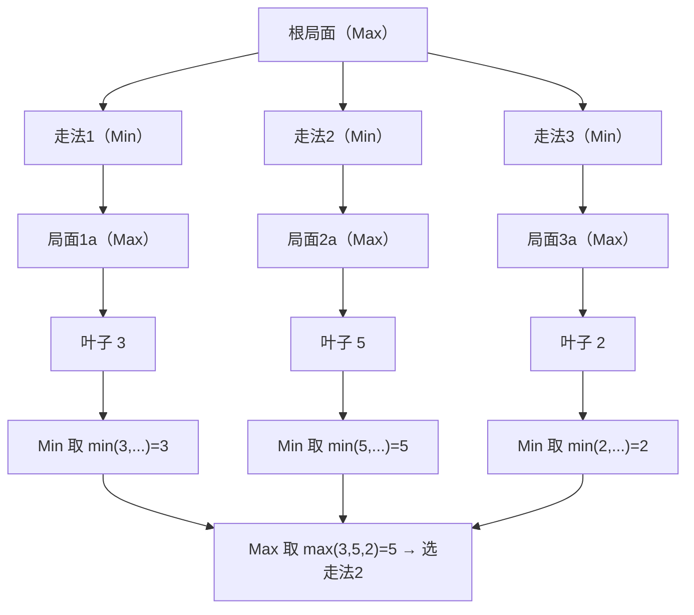
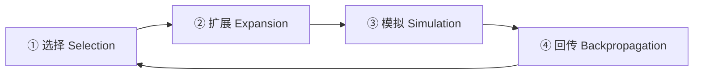

# 博弈搜索与对战 AI（Minimax / Alpha-Beta / MCTS）

> 知识基线：引擎无关的游戏 AI 通用原理；本领域为"对手建模 + 前瞻搜索"的经典决策技术，与状态机/行为树/效用 AI/GOAP 同属决策技术谱系；涉及 UE 的实现以[游戏知识/05-AI系统/README.md](../../游戏知识/05-AI系统/README.md)为交叉验证边界。
> 适用范围：棋牌（象棋/围棋/五子棋/卡牌）、策略（自走棋/战棋/回合制）、格斗与即时策略中的 AI 对手、以及任何"有限可选动作 + 可评估局面"的对战场景；也适用于战斗 AI 的短视搜索（如技能连招选择）。
> 事实边界：算法结论（Minimax 正确性、Alpha-Beta 剪枝性质、UCT 收敛性）为通用计算机科学事实；具体引擎/平台无博弈搜索内置框架，落地需自研或接入第三方库；性能数字（搜索深度、节点数、时间预算）与硬件、实现语言、评估函数复杂度强相关，需以项目实测为准。
> 最后更新：2026-08-07。
> 参考来源：[Wikipedia: Minimax](https://en.wikipedia.org/wiki/Minimax)、[Wikipedia: Monte Carlo tree search](https://en.wikipedia.org/wiki/Monte_Carlo_tree_search)、[UCT 原始论文（Kocsis & Szepesvári 2006）](https://doi.org/10.1007/11871842_43)。

> 本分类前四篇回答"AI 下一步做什么"（按规则、按评分、按规划），本文回答另一类问题：**当 AI 面对一个"对手也会思考"的局面时，如何向前看几步做出最优选择**。棋类、卡牌、战棋、格斗中的"强 AI"，本质都是博弈搜索：在动作空间里枚举并评估未来局面，选择对自己最有利的一步。

---

## 一、概述

### 1.1 什么是博弈搜索

博弈搜索（Game Tree Search）把"对战决策"建模为**博弈树**：

- 树的节点 = 一个局面（Game State）；
- 节点的子节点 = 走一步之后的所有可能局面；
- 叶子节点 = 终局（胜负和）或到达搜索深度的局面；
- 搜索的目标 = 在当前局面选择一个动作，使得**最坏情况下**的收益最大化（零和博弈的"最大最小"原则）。

与行为树/效用 AI 的关键区别：

| 维度 | 行为树 / 效用 AI | 博弈搜索 |
| --- | --- | --- |
| 决策依据 | 当前状态的特征评分 | 向前搜索若干步后的局面评估 |
| 对手 | 不显式建模（或简单规则） | 显式建模"对手也会最优应对" |
| 计算方式 | 每帧/每决策 O(候选数) | 指数级搜索（靠剪枝/采样控制） |
| 适用场景 | 大多数 NPC 行为 | 回合制/策略/棋牌/格斗等对抗决策 |

### 1.2 本文路线

1. **Minimax 原理**：博弈树上的递归最优决策；
2. **Alpha-Beta 剪枝**：把指数搜索变成"可接受"的关键优化；
3. **Negamax 形式**：Minimax 的简洁等价写法；
4. **MCTS**：用随机模拟代替全量枚举，蒙特卡洛树搜索；
5. **评估函数设计**：搜索的"地基"——如何给局面打分；
6. **工程技巧**：迭代加深、置换表、开局库、时间管理；
7. **与强化学习的关系**：AlphaGo 系的演进路径；
8. **应用与 FAQ**：棋牌/卡牌/策略/格斗中的落地。

> 涉及 UE 的具体实现（如行为树中嵌入搜索、Mass 中的决策）请参阅 [游戏知识/05-AI系统/README.md](../../游戏知识/05-AI系统/README.md)，本文只讲引擎无关的通用原理。

---

## 二、核心概念

| 概念 | 英文 | 一句话定义 | 备注 |
| --- | --- | --- | --- |
| 博弈树 | Game Tree | 以局面为节点、动作为边的树结构 | 分支因子 b、深度 d |
| 零和博弈 | Zero-sum Game | 一方收益 = 另一方等量损失 | Minimax 的适用前提 |
| 最大最小 | Minimax | 自己取最大、对手取最小的递归决策 | 假设对手最优 |
| 剪枝 | Pruning | 砍掉不可能影响最终决策的分支 | Alpha-Beta 是精确剪枝 |
| Alpha 值 | Alpha | 当前已知的"我能保证的最大收益下界" | 随搜索提升 |
| Beta 值 | Beta | 当前已知的"对手能保证的最小收益上界" | 随搜索降低 |
| 负极大 | Negamax | 用"双方都取最大"的对称形式重写 Minimax | 代码更简洁 |
| 蒙特卡洛树搜索 | MCTS | 随机模拟 + 树内统计的迭代搜索框架 | 选择-扩展-模拟-回传 |
| UCT | Upper Confidence Bound for Trees | MCTS 选择阶段的置信上界公式 | 平衡探索与利用 |
| 评估函数 | Evaluation Function | 对非终局局面打分（静态评估） | 搜索的"眼力" |
| 迭代加深 | Iterative Deepening | 逐层加深搜索深度并复用上层结果 | 时间可控 |
| 置换表 | Transposition Table | 缓存已评估局面的哈希表 | 消除重复局面 |
| 开局库 | Opening Book | 预置的开局走法库 | 省前期时间 |
| 评估函数学习 | Learned Evaluation | 用 ML/RL 学出评估函数 | AlphaGo 系核心 |

---

## 三、原理详解

### 3.1 Minimax 原理

#### 3.1.1 递归定义

设局面 s，轮到玩家 P（Max）或对手 O（Min），搜索深度 d：

- 终局：返回胜负值（如 +1 胜 / 0 和 / -1 负，或带子力差分的浮点值）；
- 到达深度上限：返回 `Evaluate(s)`；
- Max 节点：`max( 子节点值 )`——自己会选择收益最大的走法；
- Min 节点：`min( 子节点值 )`——对手会选择让收益最小的走法。

```text
// 伪代码：Minimax（节选）
function minimax(state, depth, maximizing):
    if terminal(state) or depth == 0:
        return evaluate(state)
    if maximizing:
        best = -infinity
        for move in legal_moves(state):
            value = minimax(apply(state, move), depth-1, false)
            best = max(best, value)
        return best
    else:
        best = +infinity
        for move in legal_moves(state):
            value = minimax(apply(state, move), depth-1, true)
            best = min(best, value)
        return best
```

#### 3.1.2 复杂度与问题

完全搜索的节点数 = `O(b^d)`（b 为分支因子，d 为深度）。国际象棋 b≈35、围棋 b≈250，完全搜索不可行——这是 Minimax 从未被直接用于强棋力的原因。



*图释：三走法两层的 Minimax 示例。Min 层取子节点最小值，Max 层取各走法最大值，最终选择走法 2（值 5）。*

### 3.2 Alpha-Beta 剪枝

#### 3.2.1 思想

维护两个窗口：

- **Alpha**：Max 侧已经能保证的下界（至少能拿到这么多）；
- **Beta**：Min 侧已经能保证的上界（对手最多让这么多）。

当某个子节点返回的值使得 `alpha >= beta` 时，当前节点**不可能再影响根节点的决策**，立即剪掉剩余子节点——剪枝是**精确的**（不改变根节点结果）。

```text
// 伪代码：Alpha-Beta（节选）
function alphabeta(state, depth, alpha, beta, maximizing):
    if terminal(state) or depth == 0:
        return evaluate(state)
    if maximizing:
        value = -infinity
        for move in legal_moves(state):
            value = max(value, alphabeta(apply(state, move), depth-1, alpha, beta, false))
            alpha = max(alpha, value)
            if beta <= alpha:
                break          // 剪枝
        return value
    else:
        value = +infinity
        for move in legal_moves(state):
            value = min(value, alphabeta(apply(state, move), depth-1, alpha, beta, true))
            beta = min(beta, value)
            if beta <= alpha:
                break          // 剪枝
        return value
```

#### 3.2.2 走法排序决定剪枝效率

剪枝效率强烈依赖**子节点访问顺序**：

- 最优排序：`O(b^(d/2))`，同等深度搜索量约为 Minimax 的平方根（国际象棋经验：相同时间可多搜一倍深度）；
- 最差排序：`O(b^d)`，退化为 Minimax。

常用排序策略：杀手走法（Killer Move）、历史表（History Heuristic）、置换表命中的走法优先、吃子走法（MVV-LVA）优先。

### 3.3 Negamax 形式

Minimax 的对称重写：**双方都取最大值**，轮到谁就把返回值取负。

```text
// 伪代码：Negamax + Alpha-Beta（节选）
function negamax(state, depth, alpha, beta):
    if terminal(state) or depth == 0:
        return evaluate_from_side_to_move(state)
    value = -infinity
    for move in legal_moves(state):
        value = max(value, -negamax(apply(state, move), depth-1, -beta, -alpha))
        alpha = max(alpha, value)
        if alpha >= beta:
            break
    return value
```

工程收益：一个函数同时处理双方逻辑，代码减半、bug 面减半；几乎所有棋类引擎（Stockfish、Leela 等）都使用 Negamax 变体。

### 3.4 MCTS（蒙特卡洛树搜索）

#### 3.4.1 四阶段循环



*图释：MCTS 每轮迭代依次执行选择→扩展→模拟→回传，反复迭代直到时间预算耗尽，最后按根节点访问次数选走法。*

1. **选择（Selection）**：从根节点沿树下降，每层用 UCT 公式选子节点，直到叶子；
2. **扩展（Expansion）**：给叶子节点展开一个（或全部）合法子节点；
3. **模拟（Simulation / Rollout）**：从新节点开始用默认策略（随机或启发式）快速对局到终局；
4. **回传（Backpropagation）**：把模拟结果沿路径回传，更新各节点访问次数与累计收益。

#### 3.4.2 UCT 公式

```text
UCT = (W_i / N_i) + C * sqrt( ln(N_parent) / N_i )
```

- `W_i / N_i`：节点 i 的平均收益（利用项）；
- `C * sqrt(ln(N_parent)/N_i)`：探索项，访问少的节点获得加成；
- `C` 为探索常数（经验值通常 1.0~1.4，需调参）。

#### 3.4.3 MCTS 的适用性

| 特性 | 说明 |
| --- | --- |
| 免评估函数 | 模拟到终局即可打分，适合"局面难以静态评估"的游戏（围棋经典优势） |
| 逐步增量 | 任意时刻可中断返回当前最佳走法，天然适合时间预算 |
| 分支因子鲁棒 | 对 b 大但"好走法集中"的游戏效果好 |
| 弱点 | 依赖模拟策略质量；窄窗口/战术性局面（如国际象棋残局杀棋）可能失效 |

### 3.5 评估函数设计

评估函数把非终局局面映射为数值，是搜索质量的"天花板"：

1. **特征选择**：子力价值（经典国际象棋：兵 1/马 3/象 3/车 5/后 9）、位置表（兵形/王城）、机动性、控制格数、威胁；
2. **加权求和**：`E(s) = Σ w_i * f_i(s)`，权重可用棋谱/自对弈回归标定；
3. **归一化与对称性**：对当前行棋方取正负对称，保证 Negamax 可用；
4. **终局特殊处理**：将死/逼和必须返回极端值，且**距离终局越近值越大**（否则 AI 可能拖延）；
5. **评估一致性**：搜索深度越深，评估越应"保守"（防地平线效应）。

### 3.6 工程技巧：迭代加深 / 置换表 / 开局库

| 技巧 | 原理 | 收益 |
| --- | --- | --- |
| 迭代加深 | 依次搜索深度 1、2、3…直到时间到 | 时间可控、浅层结果可复用于排序、天然支持"随时取当前最佳" |
| 置换表 | 局面哈希（Zobrist）→ 缓存 `(深度, alpha, beta, 值, 最佳走法)` | 消除重复局面（转置）重复搜索，命中率可达 30%+ |
| 开局库 | 预置前 N 手走法（人工整理或批量自对弈生成） | 省去开局搜索时间，直接进入中盘 |
| 时间管理 | 每步时间 = f(剩余时间, 步数, 局面复杂度) | 避免超时判负 |
| 空着裁剪 | Null-move Pruning：让对手连走两步，若仍占优则剪枝 | 中盘提速显著（需验证合法性） |
| 延迟着法扩展 | 只对"吃子/将军"类走法扩展一层 | 减少地平线效应 |

### 3.7 与强化学习的关系（AlphaGo 系演进）


*图释：AlphaGo 系把"评估函数 + 模拟策略"替换为深度网络，再用自对弈训练，最终（MuZero）连环境模型都内化学习。*

- 经典博弈搜索的**两个可学习组件**：评估函数（价值网络）与走法排序（策略网络）；
- AlphaGo 把 MCTS 的选择阶段改为 `Q + U + P(s,a)`（策略先验 P 来自策略网络），模拟阶段改为价值网络直接输出；
- 对游戏开发者的启示：**不必学完 MCTS 才做棋类 AI**——先上"评估函数 + Alpha-Beta + 迭代加深"，棋力已超过大多数休闲玩家；ML 方案适用于需要顶尖棋力或评估函数难以人工设计的场景。

### 3.8 各游戏类型中的应用

| 类型 | 搜索形态 | 说明 |
| --- | --- | --- |
| 象棋/五子棋 | Alpha-Beta + 置换表 + 迭代加深 | 局面可静态评估，经典组合 |
| 围棋 | MCTS（+ 网络策略） | 局面难以静态评估，模拟导向 |
| 卡牌（含隐藏信息） | 期望最大化 / 蒙特卡洛采样 | 对手手牌未知 → 对信息集采样后搜索 |
| 自走棋/战棋 | 分层搜索（买/摆位/战斗） | 动作空间分阶段，逐层决策 |
| 格斗 | 短深搜索（2~3 层）+ 帧数据 | 连招选择与对策，实时约束强 |
| 即时策略（RTS） | 战术级局部搜索 + 全局策略层 | 全树不可行，搜索只用于局部（如微操） |

---

## 四、选型对比：Minimax 系 vs MCTS vs RL

| 维度 | Alpha-Beta 系 | MCTS | RL（自对弈训练） |
| --- | --- | --- | --- |
| 评估函数 | 必需（人工/学习） | 可无（模拟代替） | 学习得到 |
| 实时性 | 好（毫秒级可中断） | 好（迭代可中断） | 推理快，训练慢 |
| 实现成本 | 低~中 | 中 | 高（训练管线） |
| 可解释性 | 高（可回溯最佳走法链） | 中 | 低 |
| 典型棋力 | 强（配合好评估） | 强（配合好模拟） | 顶尖 |
| 适用项目 | 多数游戏内 AI | 评估难写的棋类 | 顶级对战/研究 |

---

## 五、伪代码/示例：完整的最小博弈 AI 骨架

```text
// 伪代码：对战 AI 骨架（节选/示意）
class GameAI:
    def choose_move(self, state, time_budget_ms):
        deadline = now() + time_budget_ms
        best_move = first_legal_move(state)
        depth = 1
        while now() < deadline:
            value, move = self.search_root(state, depth)
            best_move = move           // 迭代加深：随时取当前最佳
            depth += 1
        return best_move

    def search_root(self, state, depth):
        alpha, beta = -INF, +INF
        best = -INF
        for move in ordered_moves(state):     // 用置换表/历史表排序
            value = -negamax(apply(state, move), depth-1, -beta, -alpha)
            if value > best:
                best, best_move = value, move
            alpha = max(alpha, best)
            if alpha >= beta:
                break
        return best, best_move

    def evaluate(self, state):
        // 特征加权：material + position + mobility + threats
        return dot(weights, features(state))
```

---

## 六、最佳实践

1. **先确认博弈类型**：零和、完全信息 → Minimax 系；隐藏信息 → 采样/期望；评估难写 → MCTS。
2. **评估函数优先于搜索深度**：评估不准时加深搜索只会放大错误；先用简单评估 + 浅层验证"AI 是否像人"。
3. **搜索时间预算化**：用迭代加深把搜索放进时间片，杜绝"一步超时"。
4. **走法排序是第一优化**：排序好，Alpha-Beta 效率翻倍；杀手走法 + 历史表成本最低。
5. **置换表用 Zobrist 哈希**：局面哈希增量更新，表大小按节点预算取（如 2^20 项）。
6. **为"地平线效应"设防线**：检查吃子/将军的延迟着法扩展，避免"看似占优实则送死"。
7. **开局库按玩家水平分档**：休闲局用"自然"开局，竞技局用研究过的变例。
8. **可观测性**：记录搜索深度、节点数、剪枝率、每步耗时，用于调参与回归。
9. **与行为树/效用层混合**：战略层用状态机/效用决策，战术层（走哪步）用搜索——不要全树搜索。
10. **对局回放验证**：把 AI 走法与人类/职业棋谱对比，量化"棋力"而非只看胜率。

---

## 七、常见问题 FAQ

1. **Q：Minimax 和 MCTS 哪个"更强"？** A：取决于游戏与评估质量。国际象棋类用 Alpha-Beta 系；围棋类（评估难写）MCTS 占优；两者都可配合神经网络达到顶尖。
2. **Q：剪枝会改变结果吗？** A：不会。Alpha-Beta 是精确剪枝——被剪掉的子树在**任何**情况下都不影响根节点最优值（前提：走法枚举完整、评估一致）。
3. **Q：分支因子太大（如 250）怎么办？** A：MCTS 对高分支因子更鲁棒；或先做动作过滤（策略网络/启发式只留 Top-K 走法）。
4. **Q：游戏有随机性（骰子/抽牌）怎么办？** A：期望最大化的 Minimax（对随机结果取期望），或蒙特卡洛采样多次模拟后取平均。
5. **Q：搜索深度多少够用？** A：取决于游戏复杂度与时间预算。五子棋 4~6 层可玩性不错；国际象棋引擎 15~20 层；休闲 AI 2~4 层即可。
6. **Q：评估函数怎么调权重？** A：先人工给初值，再对局测试；进阶用梯度法/自对弈数据回归，或用"时序差分"从胜负反推。
7. **Q：AI 总是走出"看起来很蠢"的棋怎么办？** A：多半是评估函数缺特征（如兵形、控制格）或搜索太浅；用"对局回放 + 人类走法对比"定位。
8. **Q：MCTS 什么时候该换成 Minimax？** A：当游戏战术性强、局面可静态评估、且时间敏感（如格斗），Minimax 系更可控。
9. **Q：RL 和博弈搜索要一起用吗？** A：AlphaZero 证明二者结合（网络引导 MCTS）最强；游戏项目若无顶尖棋力需求，先上经典搜索即可。
10. **Q：多人在线对战能用博弈搜索吗？** A：能，但搜索需在服务端做权威决策（防作弊），且受帧/回合时间预算约束；客户端只做表现与预测。

---

## 八、关联阅读

- 本分类：[01-AI总体架构与感知.md](01-AI总体架构与感知.md) —— 感知/黑板为博弈搜索提供局面输入；
- 本分类：[02-状态机与层次状态机.md](02-状态机与层次状态机.md) —— 战略层状态机 + 战术层搜索的混合结构；
- 本分类：[04-Utility与GOAP.md](04-Utility与GOAP.md) —— 效用评分与搜索的互补（评估函数即效用思想的延伸）；
- 本分类：[03-行为树通用原理.md](03-行为树通用原理.md) —— 行为树中嵌入"搜索节点"的集成方式；
- 移动学习：[03-学习型AI.md](../02-移动学习与服务端/03-学习型AI.md) —— RL 与博弈搜索的关系、自对弈训练；
- 算法基础：[游戏算法/01-寻路与图论/01-图论基础与搜索算法.md](../../游戏算法/01-寻路与图论/01-图论基础与搜索算法.md) —— 树/图搜索与启发式的数学基础；
- UE 侧：[游戏知识/05-AI系统/README.md](../../游戏知识/05-AI系统/README.md) —— UE 行为树/EQS 等实现层指路。

---

## 更新日志

- 2026-08-07：初稿。补齐"博弈搜索"这一决策技术谱系空白（P0）；涵盖 Minimax/Alpha-Beta/Negamax/MCTS/评估函数/工程技巧/RL 演进；为引擎无关通用层，UE 实现仅指路。
