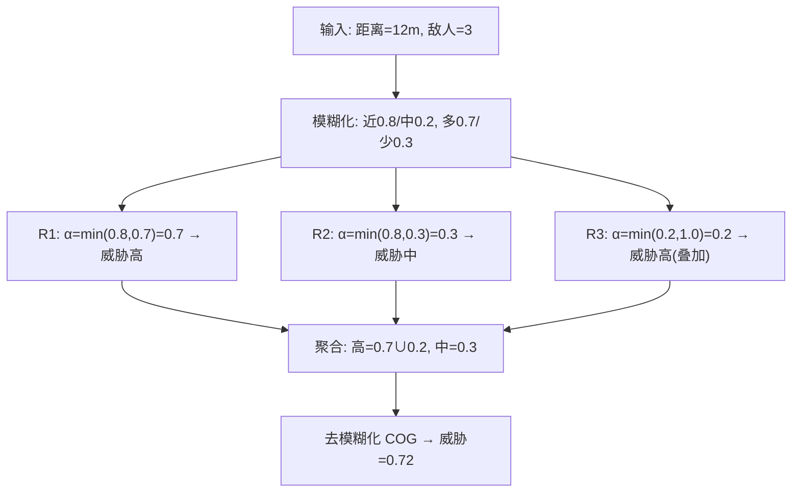

# 模糊逻辑与连续决策（Fuzzy Logic）

> 知识基线：引擎无关的游戏 AI 通用原理；模糊逻辑是与状态机/行为树/效用 AI/GOAP 并列的经典决策技术，特别适合"程度化判断"；涉及 UE 的实现以[游戏知识/05-AI系统/README.md](../../游戏知识/05-AI系统/README.md)为交叉验证边界。
> 适用范围：威胁评估（距离/血量/人数的"高/中/低"判断）、移动平滑（转向力度、速度档位）、对话倾向（好感度/信任的连续态度）、技能释放强度、以及任何"输入连续、结论连续"的决策场景；与效用 AI 常配合使用。
> 事实边界：模糊集合/隶属度函数/推理/去模糊化算法为通用数学与工程方法；具体引擎无内置模糊逻辑框架，落地需自研（或用第三方库）；参数（隶属度形状、规则权重、去模糊化方法）需按项目实测调参，不存在"万能参数"。
> 最后更新：2026-08-07。
> 参考来源：[Wikipedia: Fuzzy logic](https://en.wikipedia.org/wiki/Fuzzy_logic)、[Mamdani 模糊推理经典论文（1975）](https://doi.org/10.1049/el:19750040)。

> 状态机要求"状态是离散的"，行为树要求"条件是布尔判断"。但游戏里大量判断本质是**程度**问题："敌人有多危险？""我应该多用力转向？""这个对话对象有多友好？"——模糊逻辑（Fuzzy Logic）正是处理"程度"的决策技术：把连续输入映射到模糊集合，用语言化规则推理，再输出连续结论。

---

## 一、概述

### 1.1 为什么需要模糊逻辑

经典布尔判断（阈值）的问题：

- 敌人血量 30% 时"危险"，29% 时突然"不危险"——边界跳变导致行为抖动；
- 规则要覆盖所有区间组合，规则数爆炸；
- 策划想表达"如果敌人很近**而且**我血很少，就逃跑"这种**自然语言规则**，布尔逻辑难以直接落地。

模糊逻辑的三步范式：

1. **模糊化（Fuzzification）**：把精确输入（距离 12 米）映射为隶属度（"近"=0.8，"中"=0.2）；
2. **模糊推理（Inference）**：执行 IF-THEN 规则（"如果 近 且 血少 → 逃跑倾向高"）；
3. **去模糊化（Defuzzification）**：把模糊结论转回精确输出（逃跑倾向 0.65）。


*图释：模糊决策流水线——输入经隶属度函数变成"程度"，规则库推理出模糊结论，再转回精确值供游戏逻辑使用。*

### 1.2 与既有技术的定位

| 技术 | 回答的问题 | 输入/输出形态 |
| --- | --- | --- |
| 状态机 | 现在处于哪个离散状态 | 离散 → 离散 |
| 行为树 | 按规则走哪个分支 | 布尔 → 离散 |
| 效用 AI | 每个候选行为值多少分 | 连续 → 排序 |
| 模糊逻辑 | 当前局面"程度"如何、输出多少 | 连续 → 连续 |

模糊逻辑与效用 AI 互补：效用 AI 负责"选哪个行为"，模糊逻辑负责"把判断表达成平滑的连续值"（如攻击意愿、转向力度）。

---

## 二、核心概念

| 概念 | 英文 | 一句话定义 | 示例 |
| --- | --- | --- | --- |
| 模糊集合 | Fuzzy Set | 元素以 0~1 隶属度属于集合 | "近距离"集合 |
| 隶属度函数 | Membership Function | 把精确值映射为隶属度的函数 | 三角/梯形/高斯 |
| 语言变量 | Linguistic Variable | 用词表达的变量（如"距离"） | 距离 = {近, 中, 远} |
| 语言值 | Linguistic Term | 语言变量的取值 | 近/中/远 |
| 模糊规则 | Fuzzy Rule | IF 前提 THEN 结论的规则 | IF 近 AND 血少 THEN 逃 |
| 模糊化 | Fuzzification | 输入 → 隶属度 | 12m → 近 0.8 |
| 模糊推理 | Inference | 规则库 → 模糊结论 | Mamdani / Sugeno |
| 去模糊化 | Defuzzification | 模糊结论 → 精确值 | 重心法 COG |
| 隶属度聚合 | Aggregation | 合并多条规则的结论 | max / 加权 |
| 模糊状态机 | Fuzzy State Machine | 状态间以连续激活度过渡 | 巡逻→警觉渐变 |

---

## 三、原理详解

### 3.1 隶属度函数

#### 3.1.1 三种常用形态

```text
// 伪代码：三种隶属度函数（节选/示意）
// 三角：在 [a, b, c] 上峰值 1
function triangle(x, a, b, c):
    if x <= a or x >= c: return 0
    if x < b: return (x - a) / (b - a)
    return (c - x) / (c - b)

// 梯形：在 [a, b, c, d] 上平台 1
function trapezoid(x, a, b, c, d):
    if x <= a or x >= d: return 0
    if x < b: return (x - a) / (b - a)
    if x <= c: return 1
    return (d - x) / (d - c)

// 高斯：均值 m、宽度 s
function gaussian(x, m, s):
    return exp(-(x - m)^2 / (2 * s^2))
```

#### 3.1.2 设计要点

- **覆盖性**：语言值的隶属度函数应覆盖整个输入区间（任何输入至少有一个集合隶属度 > 0）；
- **重叠度**：相邻集合重叠 10%~25% 是常见经验——重叠太少输出跳变，太多则模糊；
- **归一化**：同一变量的语言值最好构成"划分"（各点隶属度和≈1），便于解释；
- **边界形态**：最小/最大语言值用梯形（半开区间），中间用三角或高斯。

### 3.2 模糊规则库

规则是"IF 前提 THEN 结论"的语言化知识，前提由语言值用 AND/OR/NOT 组合：

```text
// 示例：威胁评估规则库（节选）
R1: IF 距离 IS 近 AND 敌人数量 IS 多 THEN 威胁 IS 高
R2: IF 距离 IS 近 AND 敌人数量 IS 少 THEN 威胁 IS 中
R3: IF 距离 IS 中 AND 血量 IS 低 THEN 威胁 IS 高
R4: IF 距离 IS 远 THEN 威胁 IS 低
```

规则数控制：语言值数量 m、变量数 n 时全组合为 `m^n`——**不要追求完备覆盖**，先用核心规则，缺失组合由"默认规则"兜底。

### 3.3 模糊推理：Mamdani 与 Sugeno

#### 3.3.1 Mamdani（最常用，输出也是模糊集合）

1. **前提激活度**：`α = min(μ_近(12m), μ_多(3人))`（AND 取 min，OR 取 max）；
2. **结论裁剪**：把规则结论集合截断到 α（min 算子）或缩放（乘积算子）；
3. **聚合**：所有规则的结论取 max 合并成一个输出模糊集合；
4. **去模糊化**：重心法（COG）输出精确值。

#### 3.3.2 Sugeno（输出为函数，常用于控制）

结论是常数或输入的线性函数：`IF 距离 IS 近 THEN 输出 = 0.2 * 距离 + 0.8`。

- 优点：去模糊化是加权平均，计算快、输出平滑；
- 适用：实时控制类输出（转向、速度、技能强度）。



*图释：两条/多条规则同时激活时，各自按前提激活度裁剪结论，聚合后重心法输出精确威胁值。*

### 3.4 去模糊化方法

| 方法 | 英文 | 计算 | 特点 |
| --- | --- | --- | --- |
| 重心法 | Center of Gravity (COG) | 输出集合的重心横坐标 | 平滑、常用；计算略重 |
| 最大值法 | Mean of Maxima (MOM) | 隶属度最大区域的均值 | 简单、对集合形状不敏感 |
| 加权平均 | Sugeno 默认 | Σ(wi*zi)/Σwi | 最快，适合实时控制 |

### 3.5 与 FSM / 效用 AI 的结合

#### 3.5.1 模糊状态机（Fuzzy State Machine）

每个状态有"激活度"（0~1），状态间不再硬切换而是**连续过渡**：

- 状态激活度 = 模糊规则输出（如"警觉度 0.6 → 巡逻 0.4 / 警觉 0.6"）；
- 行为按激活度混合（动画混合、行为权重）；
- 优点：消除状态切换抖动；缺点：状态语义模糊，调试变难。

#### 3.5.2 模糊效用（Fuzzy Utility）

把模糊逻辑嵌入效用 AI 的评分函数：

- 用模糊规则算出"攻击价值""撤退价值"等连续评分；
- 替代手工曲线/权重表，规则更接近策划语言；
- 与效用 AI 的响应曲线（见 [04-Utility与GOAP.md](04-Utility与GOAP.md)）互为替代方案。

### 3.6 应用场景

| 场景 | 输入 | 输出 | 说明 |
| --- | --- | --- | --- |
| 威胁评估 | 距离/血量/人数 | 威胁等级 0~1 | 驱动逃跑/攻击/呼叫决策 |
| 移动平滑 | 目标距离/角度 | 转向力度/速度 | 消除布尔转向的抖动 |
| 对话倾向 | 好感度/信任/心情 | 对话态度/开放度 | NPC 社交表现 |
| 技能强度 | 距离/目标状态 | 技能蓄力/命中修正 | 攻击"看情况"的力度 |
| 难度调节 | 玩家表现/血量 | 敌人数值缩放 | 与 DDA 配合 |
| 资源调度 | 负载/水位 | 扩容/回收力度 | 服务端策略（进阶） |

### 3.7 参数调优与规则自动生成

#### 3.7.1 调参工作流

模糊系统的参数（隶属度形状、规则权重、去模糊化方法）互相耦合，建议按以下顺序调优：

1. **先定规则语义**：用策划语言写规则（"近/多/高"），先跑通行为再调形状；
2. **再调隶属度**：观察输入分布（距离/血量直方图），让隶属度函数覆盖数据的密集区；
3. **最后调权重与输出**：规则权重解决规则冲突，输出曲线决定"激进/保守"；
4. **回归验证**：固定输入集断言输出范围（见最佳实践 10）。

#### 3.7.2 与机器学习结合

- **从数据学隶属度**：用聚类（K-Means/FCM 模糊 C 均值）从行为数据拟合隶属度函数；
- **从数据学规则**：用决策树归纳规则（输入→输出训练集，提取 IF-THEN 规则再人工审查）；
- **神经模糊系统（ANFIS）**：用神经网络拟合模糊规则参数——强大但可解释性下降，项目需评估；
- **工程建议**：游戏项目优先"人工规则 + 数据辅助调参"，避免黑盒化失去策划可调性。

### 3.8 复杂度与性能

| 环节 | 复杂度 | 说明 |
| --- | --- | --- |
| 模糊化 | O(输入数 × 语言值数) | 每输入对每个语言值求隶属度 |
| 规则推理 | O(规则数) | 每条规则一次 min/max |
| 去模糊化 | O(输出集合采样数) | COG 需遍历输出域 |
| 总成本 | 微秒级/决策 | 对 AI 预算可忽略；高频控制用 Sugeno |

优化手段：

- **规则剪枝**：前提激活度为 0 的规则跳过；
- **预计算隶属度**：输入离散化后查表（如距离按 0.1m 粒度查表）；
- **减少语言值**：每变量 3~5 个语言值足够，过多反而难调。

### 3.9 与行为树/状态机的集成模式

模糊逻辑很少单独存在，常见三种集成形态：

| 集成模式 | 做法 | 典型场景 |
| --- | --- | --- |
| 模糊条件 | 行为树装饰器/服务读取模糊输出（≥阈值） | BT 中"威胁高才逃跑" |
| 模糊参数 | 模糊输出作为行为参数（移动速度/技能强度） | 转向力度、蓄力 |
| 模糊仲裁 | 模糊评分替代硬优先级（多行为竞争） | 攻击/撤退/呼叫的竞争 |

```text
// 伪代码：BT 装饰器集成（节选/示意）
class FuzzyThresholdDecorator:
    def can_execute(self, blackboard):
        threat = blackboard.fuzzy_threat      // 模糊评估器输出
        return threat >= self.threshold       // 阈值可配
```

要点：

- 模糊输出写入黑板（连续键），BT/状态机按需读取；
- 阈值+滞回组合（高 0.7 进、低 0.5 出），防边界抖动；
- 集成时保持模糊评估为**纯函数**（无副作用），便于测试与回放。

---

## 四、伪代码/示例：威胁评估完整骨架

```text
// 伪代码：模糊威胁评估（节选/示意）
class FuzzyThreatEvaluator:
    def evaluate(self, distance, enemy_count, hp_ratio):
        # 1. 模糊化
        d_near  = triangle(distance, 0, 0, 15)
        d_mid   = trapezoid(distance, 10, 15, 25, 35)
        d_far   = trapezoid(distance, 30, 50, 999, 999)
        c_many  = triangle(enemy_count, 2, 4, 6)
        h_low   = trapezoid(hp_ratio, 0, 0, 0.3, 0.5)

        # 2. 规则推理（Mamdani，min 前提 / max 聚合）
        threat_high = max(min(d_near, c_many),
                          min(d_mid,  h_low))
        threat_mid  = min(d_near, 1 - c_many)
        threat_low  = d_far

        # 3. 去模糊化（简化 COG：加权平均）
        score = (threat_high * 0.9 + threat_mid * 0.5 + threat_low * 0.1) /
                (threat_high + threat_mid + threat_low + 1e-6)
        return score
```

---

## 五、最佳实践

1. **先问"是否需要连续"**：输出本质是离散动作（攻击/逃跑二选一）时，用模糊结果 + 阈值即可，不要为模糊而模糊。
2. **规则用策划语言写**：规则表用"近/多/高"等词，让策划可读可调，这是模糊逻辑的最大价值。
3. **控制规则数量**：优先核心规则 + 默认兜底，避免 `m^n` 爆炸。
4. **输出加滞回/冷却**：模糊输出也可能在边界小幅抖动，配合决策冷却或滞回更稳。
5. **调试可视化**：绘制隶属度曲线、规则激活度、输出曲线——没有可视化的模糊系统无法调参。
6. **性能**：Mamdani 全流程每决策约几十次函数求值，对 AI 预算可忽略；高频控制（每帧）用 Sugeno。
7. **与效用 AI 组合**：模糊做"程度评估"，效用做"行为选择"，二者天然互补。
8. **模糊状态机慎用**：激活度混合会导致行为"四不像"，建议只在表现层（动画/移动）用连续过渡。
9. **参数落表**：隶属度参数、规则权重全部进配置表，支持热更与 A/B 测试。
10. **回归验证**：对固定输入集断言输出范围，防止调参破坏既有行为。

---

## 六、常见问题 FAQ

1. **Q：模糊逻辑比阈值判断"更好"吗？** A：在"程度连续、边界敏感"的场景更平滑、规则更可读；但引入参数与调试成本，简单场景阈值即可。
2. **Q：Mamdani 和 Sugeno 怎么选？** A：输出要"自然语言解释"用 Mamdani；实时控制、追求计算效率用 Sugeno。
3. **Q：隶属度函数怎么调？** A：先按领域知识定形状（三角/梯形），用可视化 + 对局测试迭代；重叠度 10%~25% 起步。
4. **Q：规则太多怎么办？** A：用"关键变量分层"（先粗后细）、默认规则兜底、或用决策树自动归纳规则（从数据学习）。
5. **Q：模糊输出有抖动怎么办？** A：加滞回（切换需超过阈值差）、输出低通滤波、降低决策频率。
6. **Q：和效用 AI 有什么区别？** A：效用 AI 为**多个候选行为**评分并选优；模糊逻辑把一个**连续量**算得平滑；二者可嵌套。
7. **Q：能在行为树里用吗？** A：能——把模糊输出作为黑板的连续键，行为树服务/装饰器读取它做条件判断或参数化。
8. **Q：模糊逻辑会过时吗？** A：作为"小成本平滑决策"工具仍常用；ML 方案成本高时，模糊逻辑是性价比最高的替代。
9. **Q：需要模糊引擎库吗？** A：小型项目手写 100 行即可（如本文骨架）；大型规则库可考虑成熟库（如 jFuzzyLogic 思路，按语言选型）。
10. **Q：模糊逻辑适合服务端 AI 吗？** A：适合——纯函数、无状态、确定性好，服务端 AI 预算内可跑，且天然支持回放复现。

---

## 七、关联阅读

- 本分类：[01-AI总体架构与感知.md](01-AI总体架构与感知.md) —— 感知输出（距离/数量）是模糊规则的典型输入；
- 本分类：[02-状态机与层次状态机.md](02-状态机与层次状态机.md) —— 模糊状态机与离散状态机的对比；
- 本分类：[04-Utility与GOAP.md](04-Utility与GOAP.md) —— 效用评分与模糊评分的互补关系；
- 本分类：[05-博弈搜索与对战AI.md](05-博弈搜索与对战AI.md) —— 评估函数也可用模糊规则表达；
- 移动学习：[02-战斗与Boss设计.md](../02-移动学习与服务端/02-战斗与Boss设计.md) —— 威胁评估/难度曲线的实战结合；
- UE 侧：[游戏知识/05-AI系统/README.md](../../游戏知识/05-AI系统/README.md) —— UE 行为树/EQS 中嵌入模糊评估的指路。

---

## 更新日志

- 2026-08-07：初稿。补齐"模糊逻辑"决策技术空白（P1）；涵盖隶属度函数、规则库、Mamdani/Sugeno 推理、去模糊化、模糊状态机/模糊效用、威胁评估示例；引擎无关通用层，UE 实现仅指路。
