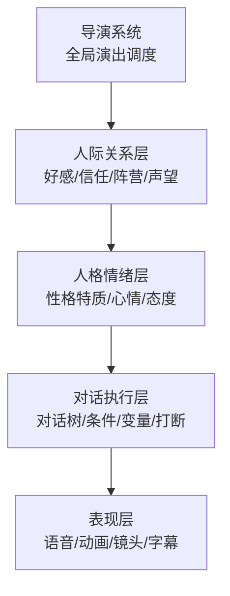
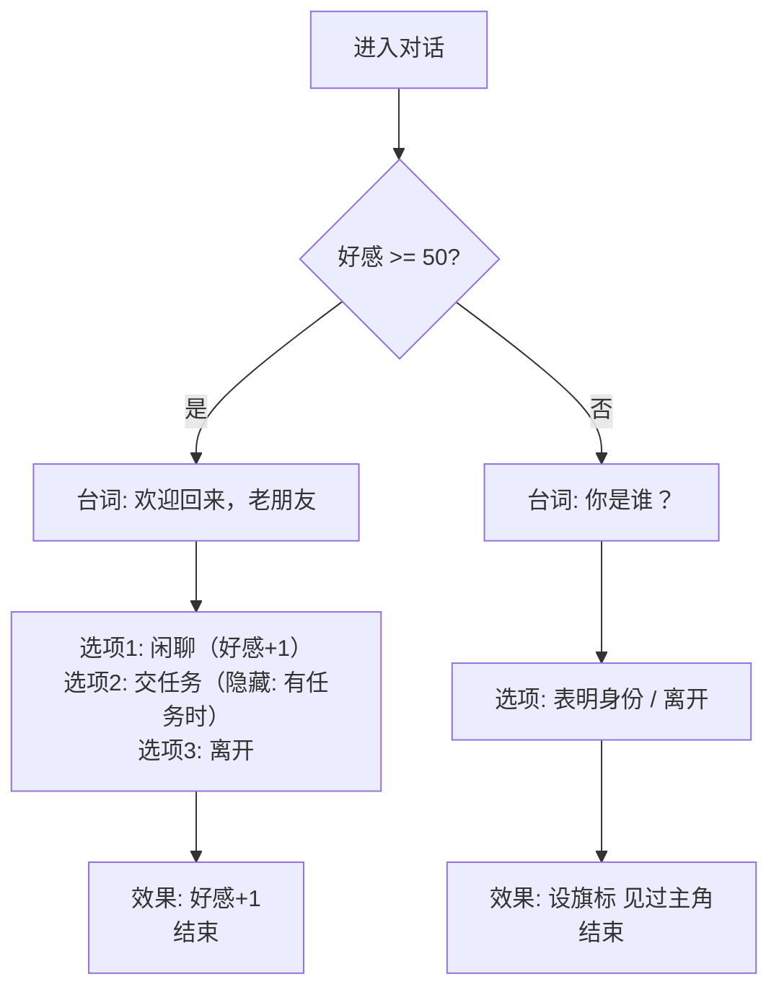
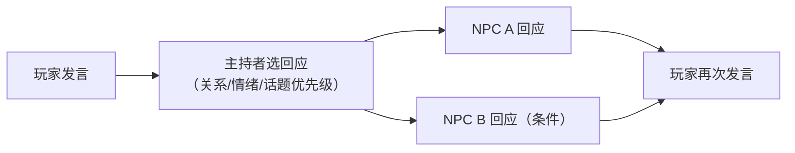

# NPC 人格、对话与社交 AI

> 知识基线：引擎无关的游戏 AI 通用原理；本文覆盖传统对话系统（对话树/条件/变量）、NPC 人格与情绪模型、人际关系（好感度/阵营/声望）、导演系统，以及与传统对话和 LLM 方案的选型关系；涉及 UE 的实现以[游戏知识/05-AI系统/README.md](../../游戏知识/05-AI系统/README.md)为交叉验证边界。
> 适用范围：RPG/CRPG/开放世界中的 NPC 对话、任务 NPC、同伴系统、城镇生态模拟；演出型项目的对白管线；以及"传统对话树 vs LLM NPC"的架构决策。
> 事实边界：对话树/人格/情绪/好感度等为通用游戏设计模式，无标准 API；LLM 对话属于外部服务能力，其安全与评测边界见[03-评测与安全/01-AI评测回放与LLM安全.md](../03-评测与安全/01-AI评测回放与LLM安全.md)；具体引擎（UE Dialogue 生态、第三方对话插件）以官方资料核对为准。
> 最后更新：2026-08-07。
> 参考来源：[Wikipedia: Dialogue tree](https://en.wikipedia.org/wiki/Dialogue_tree)、[Wikipedia: Non-player character](https://en.wikipedia.org/wiki/Non-player_character)。

> 前几篇讲"NPC 怎么战斗、怎么决策"，本文讲"NPC 怎么像人一样说话与相处"：**对话树**给出可控的台词与分支，**人格与情绪模型**让 NPC 有"性格"与"心情"，**人际关系系统**记录好感/信任/阵营，**导演系统**在全局调度演出。这是开放世界与 CRPG 的"活的世界"体验核心。

---

## 一、概述

### 1.1 四层结构



*图释：社交 AI 的四层架构——上层（导演/关系）决定"说什么、对谁什么态度"，下层（对话/表现）决定"怎么说"。*

### 1.2 为什么需要专门设计

- **一致性**：NPC 今天说的话要符合昨天的行为（做了坏事 → 态度变差）；
- **可控性**：台词必须过审、配音必须可控、分支必须可测试——这是 LLM 自由对话的难点；
- **可玩性**：好感度/分支是 RPG 的核心成长反馈；
- **工程性**：对白量庞大（主线+支线+闲谈），需要数据驱动与工具链支持。

---

## 二、核心概念

| 概念 | 英文 | 一句话定义 | 示例 |
| --- | --- | --- | --- |
| 对话树 | Dialogue Tree | 节点=台词/选项，边=分支的树（或图） | 问路→三种回答 |
| 对话节点 | Dialogue Node | 单条台词/单个选项 | "你好，旅行者" |
| 条件分支 | Conditional Branch | 按变量/旗标选择分支 | 好感>50 才解锁选项 |
| 对话变量 | Dialogue Variable | 影响分支的全局/局部状态 | 已完成任务数 |
| 旗标 | Flag | 布尔状态标记 | 见过主角、救过村庄 |
| 人格特质 | Personality Trait | 稳定的性格维度 | 外向/多疑/善良 |
| 情绪模型 | Emotion Model | 短期心情状态及其变化 | 高兴/愤怒/恐惧 |
| 好感度 | Relationship/Favor | 对玩家的长期态度分数 | 0~100 |
| 阵营/声望 | Faction / Reputation | 群体对玩家的整体态度 | 城镇声望等级 |
| 导演系统 | Director System | 全局控制演出节奏与事件触发 | 任务高潮插播过场 |
| 打断 | Interruption | 玩家/事件打断当前台词 | 战斗时NPC停止闲聊 |

---

## 三、原理详解

### 3.1 对话树设计

#### 3.1.1 节点类型

| 节点 | 作用 | 备注 |
| --- | --- | --- |
| 台词节点 | 说一句话（可带配音/动画/镜头） | 对话的基本单元 |
| 选项节点 | 给玩家 2~4 个可选回复 | 选项可带条件/隐藏 |
| 条件节点 | 按变量跳转 | 相当于脚本 if |
| 效果节点 | 执行副作用（加好感/给道具/开任务） | 挂在台词/选项上 |
| 随机节点 | 从多条闲谈中随机选 | 避免重复 |
| 中断节点 | 结束对话 / 交回控制权 | 含超时处理 |



*图释：典型对话树——条件节点分流，选项带条件隐藏，效果节点写副作用。*

#### 3.1.2 数据驱动与工具链

- 对白配置表：`ID / 说话人 / 台词 / 配音 / 动画 / 条件 / 效果 / 下一节点`；
- 编辑器（可视化对话图）是刚需：树规模上百节点后纯文本无法维护；
- 本地化：台词必须走 FText/本地化管线（见[游戏知识/01-引擎基础/10-FName与FText底层.md](../../游戏知识/01-引擎基础/10-FName与FText底层.md)的 FText 选型）；
- 版本与分支管理：对话资产与任务系统同版本，条件字段引用任务 ID 需建立引用检查。

### 3.2 人格模型

#### 3.2.1 经典维度

- **OCEAN 五因素**（心理学）常被简化借用：开放性、尽责性、外向性、宜人性、神经质；
- 游戏化人格：勇敢/谨慎/贪婪/忠诚/多疑/幽默——用 2~5 个标签表达；
- 人格影响：台词风格（语气词、句式）、决策倾向（战斗/逃跑/谈判）、社交行为（主动搭话/保持距离）。

#### 3.2.2 实现形态

```text
// 伪代码：人格驱动的台词选择（节选/示意）
struct Personality:
    traits: dict[str, float]     // { "brave": 0.8, "greedy": 0.3, ... }

function pick_line(npc, situation, candidates):
    // 每条候选台词带"人格倾向"标签，取最匹配的
    return argmax(c, score_line(npc.traits, c.trait_tags))

function score_line(traits, tags):
    return sum(traits[t] * weight for t, weight in tags)
```

### 3.3 情绪模型

情绪是**短期、易变**的状态，与稳定人格互补：

1. **情绪空间**：二维（效价 Valence 正负 × 唤醒 Arousal 高低）或离散情绪集（高兴/愤怒/悲伤/恐惧/惊讶/厌恶）；
2. **情绪更新**：事件驱动——受攻击→愤怒+、被帮助→高兴+；随时间自然衰减回基准；
3. **情绪影响表现**：语气、动画、对话前缀、决策参数（愤怒时更激进）；
4. **实现**：`情绪值 = 基线 + Σ(事件影响 × 衰减系数)`，每帧/每事件更新。

### 3.4 人际关系系统

#### 3.4.1 三层关系

| 层 | 粒度 | 数据 | 用途 |
| --- | --- | --- | --- |
| 个体好感 | NPC×玩家 | 好感分 0~100 + 等级 | 对话解锁、任务授予 |
| 阵营声望 | 阵营×玩家 | 声望等级/分数 | 商店折扣、通行证、敌对 |
| 关系图谱 | NPC×NPC | 友好/敌对/亲属/上下级 | 事件传播、AI 行为 |

#### 3.4.2 好感度变化规则

- **事件驱动**：完成任务 +10、送礼 +5、偷窃 -15、攻击同伴 -30；
- **上限与档位**：分段（冷淡/中立/友好/信任/挚友），档位解锁新对话与行为；
- **衰减与回归**：长期不互动缓慢衰减（可选，防"刷满好感"）；
- **持久化**：好感/声望/旗标随存档保存（客户端存档或服务端玩家数据，见[游戏服务端/02-数据与业务/01-数据库选型与存储设计.md](../../游戏服务端/02-数据与业务/01-数据库选型与存储设计.md)）。

### 3.5 导演系统

导演系统在对话/演出之上的**全局调度层**：

- **节奏控制**：避免连续长对话，插播探索/战斗/过场；
- **事件编排**：任务关键点触发定制演出（"任务高潮时全城变暗 + BGM 切换"）；
- **优先级与互斥**：多个 NPC 想同时找玩家时按优先级排队；
- **与任务系统联动**：对话树引用任务状态，任务推进解锁对话节点。

### 3.6 传统对话树 vs LLM NPC

| 维度 | 传统对话树 | LLM NPC（外部服务） |
| --- | --- | --- |
| 可控性 | 高（台词白名单） | 低（需过滤/护栏） |
| 成本 | 内容制作成本（配音/写稿） | 推理成本 + 安全治理 |
| 一致性 | 高（可测试） | 中（需记忆机制约束） |
| 沉浸感 | 中（重复/受限） | 高（自由对话） |
| 离线/存档 | 原生支持 | 依赖服务可用性 |
| 混合形态 | —— | 树定骨架 + LLM 补自由回复 |

> LLM NPC 的安全、评测、记忆与门禁边界见[03-评测与安全/01-AI评测回放与LLM安全.md](../03-评测与安全/01-AI评测回放与LLM安全.md)。

### 3.7 多角色对话与群聊

多 NPC 参与的群聊是对话树的扩展场景：



*图释：多角色对话由主持者（导演/脚本）决定谁回应，避免多个 NPC 抢话。*

实现要点：

- **回应者选择**：按"关系最相关 + 情绪最高 + 上次未发言"评分选 1~2 个；
- **发言打断**：高优先级事件（战斗/剧情）可打断群聊；
- **话题状态**：群聊共享话题变量（聊到哪了），避免重复话题；
- **表现调度**：多角色轮流说话由表现层排队（口型/镜头），逻辑层只管"谁说什么"。

### 3.8 对话系统测试与本地化

- **无头对话测试**：自动遍历对话树全分支，断言条件与效果（配合[03-评测与安全/02-自动测试玩家与AI回归基准.md](../03-评测与安全/02-自动测试玩家与AI回归基准.md)）；
- **本地化管线**：台词走 FText/资源表，翻译后校验字符溢出与变量占位符（{0}）一致性；
- **配音管理**：配音文件按语言分目录，缺失语种自动降级为字幕；
- **引用检查**：对话引用的任务/道具/旗标做静态检查，防止"引用已删除内容"。

---

## 四、伪代码/示例：对话运行时骨架

```text
// 伪代码：对话系统运行时（节选/示意）
class DialogueSystem:
    def start(node_id, speaker, player):
        self.stack = [node_id]
        self.state = load_dialogue_vars(player)

    def tick(self, input):
        node = get_node(self.stack.top())
        if node.type == LINE:
            play(node.line, node.voice, node.anim)
            self.stack.push(node.next)
        elif node.type == OPTIONS:
            visible = [o for o in node.options if o.condition(self.state)]
            if input in visible:
                apply_effects(input.effects, self.state, player)
                self.stack.push(input.next)
        elif node.type == CONDITION:
            self.stack.push(node.branch(self.state))

    def on_event(self, event):
        // 事件驱动的情绪/好感更新
        npc.emotion.update(event)
        relationship[player].add(event.favor_delta)
```

---

## 五、最佳实践

1. **对话树别做太深**：单次对话 3~8 个节点为宜，长对话拆成多次对话 + 任务阶段。
2. **条件/效果集中管理**：条件与效果函数注册表驱动，配置表只写函数名+参数，避免脚本散落。
3. **旗标命名规范**：`quest_<id>_<step>`、`met_<npc>`、`favor_<npc>`，建立字典防拼写错误。
4. **好感度事件幂等**：同一事件重复触发不能重复加减（用事件 ID 去重）。
5. **配音/字幕双轨**：台词表同时产出配音文件名与字幕 key，缺失时静默降级。
6. **打断与恢复**：战斗/强制事件可打断对话，结束后恢复现场（保存对话栈）。
7. **测试自动化**：对白脚本可跑"无头对话测试"——自动遍历分支、断言条件与效果。
8. **表现层分离**：台词/配音/动画/镜头由表现系统消费，对话逻辑只输出"说话+选项"。
9. **性能**：对话系统低频（玩家主动触发），但闲谈 AI（世界 NPC 互聊）需预算控制与分帧。
10. **LLM 接入留接口**：对话执行器抽象出 `generate_reply(context)`，树与 LLM 可插拔切换。

---

## 六、常见问题 FAQ

1. **Q：对话树和任务系统怎么衔接？** A：任务状态作为对话条件/效果的共享变量源；任务奖励挂到对话效果节点（发货走服务端事务）。
2. **Q：好感度存客户端还是服务端？** A：单机存存档；联网游戏必须服务端权威（防作弊），客户端只读缓存。
3. **Q：NPC 会说重复台词怎么办？** A：闲谈池 + 最近 N 条去重 + 随机权重；关键台词单次标记。
4. **Q：情绪模型会不会让行为不可控？** A：情绪只影响"表现与参数"，不改变硬性规则（任务 NPC 必须给的对话）；必要时情绪冻结。
5. **Q：人格怎么测？** A：给 NPC 一组固定场景，断言其选择分布符合人格设定（如勇敢者 80% 选战斗）。
6. **Q：用 LLM 后还要对话树吗？** A：主流是混合——树保证主线可控，LLM 填充自由闲聊；纯 LLM 用于非关键 NPC。
7. **Q：对话打断后状态怎么恢复？** A：保存对话栈 + 变量快照，恢复时重放栈顶节点；打断期间挂起所有效果。
8. **Q：多语言配音成本高怎么办？** A：字幕全量本地化，配音按语种分级（核心角色配、路人无语音）；文本先走 L10N 管线。
9. **Q：导演系统会不会和任务系统打架？** A：导演只做"演出调度"，任务系统是"逻辑权威"；导演触发演出前查询任务状态。
10. **Q：世界 NPC 之间的对话（闲谈）怎么做？** A：预写闲谈片段 + 条件触发，分帧调度；服务端 AI 场景注意广播预算（见[游戏AI/02-移动学习与服务端/04-服务端AI与性能.md](../02-移动学习与服务端/04-服务端AI与性能.md)）。

---

## 七、关联阅读

- 本分类：[01-AI总体架构与感知.md](01-AI总体架构与感知.md) —— NPC 感知世界（谁在场/什么事件）是社交行为的输入；
- 本分类：[02-状态机与层次状态机.md](02-状态机与层次状态机.md) —— 对话/社交状态机（闲谈/任务/敌对）的实现；
- 本分类：[04-Utility与GOAP.md](04-Utility与GOAP.md) —— 人格/情绪作为效用评分输入的思路；
- 移动学习：[02-战斗与Boss设计.md](../02-移动学习与服务端/02-战斗与Boss设计.md) —— 战斗台词/情绪的配合；
- 评测安全：[01-AI评测回放与LLM安全.md](../03-评测与安全/01-AI评测回放与LLM安全.md) —— LLM NPC 的安全与评测边界；
- 服务端：[游戏服务端/02-数据与业务/01-数据库选型与存储设计.md](../../游戏服务端/02-数据与业务/01-数据库选型与存储设计.md) —— 好感/声望的持久化；
- UE 侧：[游戏知识/05-AI系统/README.md](../../游戏知识/05-AI系统/README.md) —— UE 侧 AI 与对话生态指路。

---

## 更新日志

- 2026-08-07：初稿。补齐"NPC 人格/对话/社交 AI"空白（P1）；涵盖对话树数据驱动、人格与情绪模型、人际关系三层、导演系统、传统对话 vs LLM 选型；引擎无关通用层，UE 实现仅指路。

## 落地检查清单

### 常见反模式

1. **对话树全部硬编码在代码里**：条件与分支散落各处，策划无法配置，热更困难。
2. **打断后上下文丢失**：对话被打断后从头开始或进入错误分支，玩家重复操作。
3. **好感度只增不减**：关系系统失去约束，玩家可无限刷好感，叙事失去张力。
4. **NPC 人格只体现在台词上**：人格未影响决策与行为，角色表现分裂。
5. **导演系统无失败保护**：事件死锁或重复触发，玩家陷入卡死或循环演出。
6. **LLM 对话无回退**：开放对话失败时没有确定性兜底，体验不可控（指路 03-01 安全要求）。

- [ ] 对话树节点类型覆盖：普通对话、条件分支、变量赋值、随机、跳转、打断恢复。
- [ ] 对话上下文（NPC/玩家/历史/好感度）在所有节点可读且作用域清晰。
- [ ] 人格模型已参数化（如 OCEAN 五维），并映射到语气/用词/行为倾向。
- [ ] 情绪状态有来源（事件/关系/环境）、衰减与恢复规则，且可观测。
- [ ] 关系系统（好感度/声望/阵营/信任）有上限、衰减与事件驱动更新。
- [ ] NPC-NPC 关系与日程记忆有容量上限与淘汰策略。
- [ ] 导演系统具备节奏控制、全局状态与失败保护（不会死锁或重复触发）。
- [ ] 传统对话树与 LLM NPC 的选型边界明确：确定性内容走树，开放对话走 LLM（指路 03-01 安全要求）。
- [ ] 对话打断与恢复：任意时刻可打断，恢复后回到正确节点与上下文。
- [ ] 本地化与配音衔接：文本/音频/条件字段解耦，可批量导出。

### 术语速查

| 术语 | 英文 | 一句话解释 |
| --- | --- | --- |
| 对话树 | Dialogue Tree | 以节点与分支组织的确定性对话结构 |
| 打断恢复 | Interrupt & Resume | 对话被打断后回到正确上下文继续 |
| 大五人格 | OCEAN / Big Five | 开放性/尽责性/外向性/宜人性/神经质 |
| 情绪模型 | Emotion Model | 情绪状态、强度、衰减与事件驱动的表示 |
| 好感度 | Affinity / Favor | NPC 对玩家的关系数值 |
| 声望 | Reputation | 群体/阵营对玩家的评价 |
| 导演系统 | Director System | 控制叙事节奏与事件触发的上层系统 |
| LLM NPC | LLM-driven NPC | 由大语言模型驱动的开放对话 NPC |
