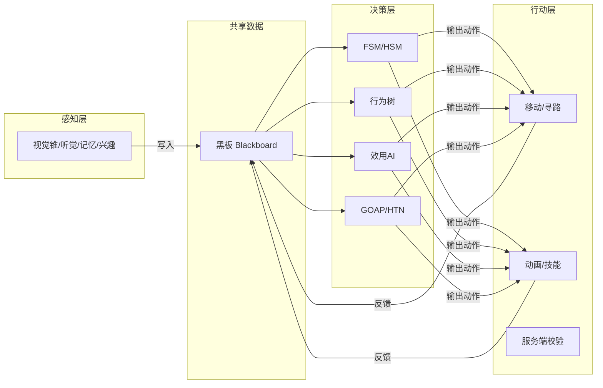

# 游戏AI「决策与架构」知识库

> 本目录聚焦游戏 AI 的**决策层与总体架构**：AI 如何"感知世界 → 做出决策 → 驱动行动"，以及主流的决策技术（状态机、行为树、效用 AI、GOAP）各自的原理、实现与选型。内容为**引擎无关的通用原理**，面向全栈游戏开发者（客户端、服务端、AI 策划均可阅读）。

---

## 一、分类简介

游戏 AI 是一个"从感知到行动"的完整闭环。本目录回答三类核心问题：

1. **架构问题**：AI 系统在游戏里如何组织？感知、决策、行动如何分工？更新频率如何分配？
2. **决策问题**：面对当前局面，AI 应该"做什么"？—— 这是本目录的主题。
3. **技术选型问题**：状态机、行为树、效用 AI、GOAP 各适合什么场景？如何组合使用？

与 UE 客户端知识库的关系：

- 本目录（`01-决策与架构`）讲解**通用原理**，用伪代码和引擎无关示例说明"为什么这样做"；
- UE 客户端目录（[游戏知识/05-AI系统](../../游戏知识/05-AI系统/README.md)）讲解 **UE 具体实现**，用蓝图/C++ 说明"在 UE 里怎么做"；
- 建议**配合阅读**：先在本目录建立通用心智模型，再进入 UE 目录查看具体节点、接口与工具链（如 EQS、NavMesh 的 UE 化实现）。

---

## 二、文件列表

| 文件 | 一句话简介 |
| --- | --- |
| [01-AI总体架构与感知.md](01-AI总体架构与感知.md) | 感知-思考-行动循环、分层 AI 架构、黑板与知识表示、感知系统（视觉锥/听觉/记忆/兴趣）及 AI 分帧更新策略 |
| [02-状态机与层次状态机.md](02-状态机与层次状态机.md) | FSM/HSM 原理、状态设计模式、并发状态，与行为树的对比及敌人巡逻-警觉-攻击实战示例 |
| [03-行为树通用原理.md](03-行为树通用原理.md) | 行为树节点类型、Tick 执行语义、黑板数据流、Abort 中止机制，跨引擎对比与设计规范 |
| [04-Utility与GOAP.md](04-Utility与GOAP.md) | 效用 AI（评分/曲线/决策器）、GOAP（动作/状态/A* 规划器）、HTN 简述及三类决策技术选型对比 |
| [05-博弈搜索与对战AI.md](05-博弈搜索与对战AI.md) | Minimax/Alpha-Beta/Negamax、MCTS+UCT、评估函数设计、迭代加深/置换表/开局库、与 RL 的关系及棋牌/卡牌/策略/格斗应用 |
| [06-模糊逻辑与连续决策.md](06-模糊逻辑与连续决策.md) | 模糊集合与隶属度函数、规则库、Mamdani/Sugeno 推理、去模糊化、模糊状态机/模糊效用及应用（威胁评估/移动平滑/对话倾向） |
| [07-NPC人格对话与社交AI.md](07-NPC人格对话与社交AI.md) | 对话树数据驱动设计、人格与情绪模型、人际关系（好感/声望/阵营）、导演系统、传统对话树 vs LLM NPC 选型 |

---

## 三、学习顺序建议

### 推荐路径（从架构到技术）

1. **先读 [01-AI总体架构与感知.md](01-AI总体架构与感知.md)**
   - 建立"感知 → 思考 → 行动"的整体循环，理解 AI 系统在帧循环中的位置；
   - 掌握黑板、感知系统、分帧更新这些**所有决策技术共用的地基**。
2. **再读 [02-状态机与层次状态机.md](02-状态机与层次状态机.md)**
   - 状态机是最直观、最易上手的决策模型，适合小规模、状态离散的 AI；
   - 先学会"状态转换"思维，再学行为树时会更清楚两者的边界。
3. **接着读 [03-行为树通用原理.md](03-行为树通用原理.md)**
   - 行为树是目前商业项目最主流的决策技术，模块化、可复用、可调试；
   - 重点理解 Tick 语义、黑板数据流与 Abort 中止机制。
4. **最后读 [04-Utility与GOAP.md](04-Utility与GOAP.md)**
   - 效用 AI 解决"多个合理行为选哪个"的连续决策问题；
   - GOAP 解决"目标明确但步骤多变"的规划问题；
   - 读完可对照选型表，判断各技术适用边界。

### 与 UE 知识库的搭配路径

- 读完本目录 01 → 阅读 UE 的 [02-感知系统与EQS.md](../../游戏知识/05-AI系统/02-感知系统与EQS.md)：把通用感知概念映射到 UE 的 AIPerception + EQS；
- 读完本目录 03 → 阅读 UE 的 [01-行为树详解.md](../../游戏知识/05-AI系统/01-行为树详解.md)：把通用行为树原理映射到 UE Behavior Tree 的节点与黑板；
- 需要寻路落地 → 阅读 UE 的 [03-NavMesh寻路.md](../../游戏知识/05-AI系统/03-NavMesh寻路.md)；
- 始终以 UE 目录的 [README.md](../../游戏知识/05-AI系统/README.md) 为 UE 侧导航。

### 快速上手（时间有限时）

- 只做简单巡逻/开关类 AI：**02 状态机** + 01 的感知小节；
- 做复杂 NPC/战斗 AI：**03 行为树** 是主线，01 是前置，04 用于"择优"扩展；
- 做"策略感"强的 AI（如 Boss 技能选择、阵营战术）：**04 效用 AI/GOAP**。

---

## 四、知识地图（Mermaid）

---

## 五、撰写约定

- 各篇均采用统一结构：**概述 → 核心概念（表格）→ 原理详解 → 伪代码/通用代码示例 → 选型对比 → 最佳实践 → 常见问题 FAQ → 关联阅读**；
- 代码示例为**引擎无关伪代码**（含 Python 风格与 C++ 风格示例），可直接迁移到任意引擎；
- 涉及 UE 的具体实现只做"指路"，不重复撰写，统一引用 [游戏知识/05-AI系统](../../游戏知识/05-AI系统/README.md)；
- Mermaid 图用于表达状态机、行为树、架构分层等结构。

---

> 维护说明：本目录为「游戏AI」知识库的第一分类，后续分类（如 02-移动学习与服务端）与本目录共同构成完整知识体系。欢迎按上述结构补充新文章。
