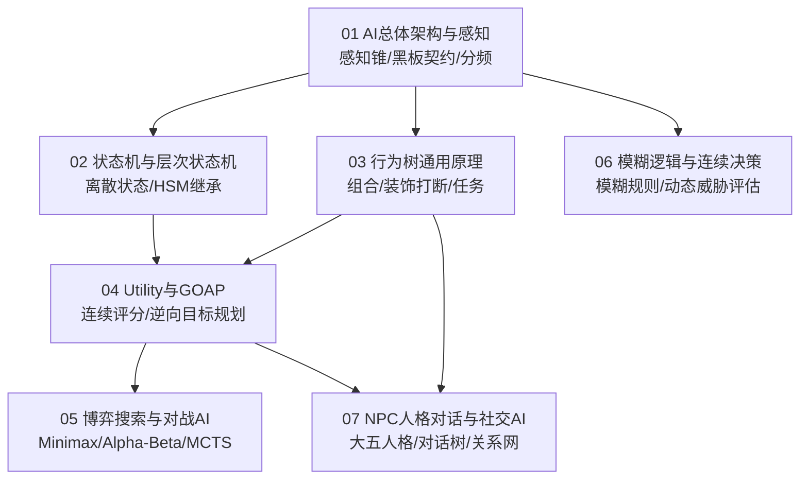

# 01 决策与架构

> 知识成熟度：L2（子域工程手册，已按 7 篇核心决策专题与全域拓扑全面标准化）。
>
> 领域权威导航：[游戏 AI Domain MOC](../../00_Index/domains/游戏AI.md) ｜ [游戏 AI 领域总手册](../README.md)。

---

## 1. 核心定位与设计思想

「01-决策与架构」负责游戏 AI 的**核心认知与决策推理层（Decision & Reasoning Core）**。

其核心命题是回答：“面对动态演变的世界局势与玩家行为，智能体应该**感知什么、记住什么、并在有限帧时隙内决定做什么**”：

- **感知与黑板契约（Perception & Blackboard）**：将分散的视锥几何、听觉距离衰减与物理碰撞转化为结构化的刺激事件（Stimulus），通过黑板（Blackboard）提供类型安全、带遗忘衰减的共享数据总线；
- **全谱系经典决策技术**：系统覆盖从离散确定的有限/层次状态机（FSM/HSM）、工业级分层任务执行的行为树（Behavior Tree），到连续多需求权衡的效用 AI（Utility AI）、目标逆向推演的 GOAP/HTN、完全/不完全信息博弈搜索（Minimax/Alpha-Beta/MCTS）、模糊逻辑连续控制（Fuzzy Logic），以及社会化拟人人格与对话系统（OCEAN/Dialogue Tree）；
- **引擎无关的通用抽象**：以严谨伪代码与标准设计模式阐明算法机理，与引擎客户端具体组件解耦，作为全栈开发者（客户端、服务端、AI 策划）共同的心智模型。

---

## 2. 专题矩阵与知识状态

| 专题文件（Canonical 路径） | 知识类型 | 成熟度 | 核心工程关注点与落地场景 |
| :--- | :---: | :---: | :--- |
| [01-AI总体架构与感知.md](01-AI总体架构与感知.md) | Architecture | L2 | 感知-思考-行动循环、分层架构、视听感知锥数学模型、黑板数据流与 AI 主循环分频调度 |
| [02-状态机与层次状态机.md](02-状态机与层次状态机.md) | Mechanism | L2 | 经典 FSM 状态转换表、状态模式实现、HSM 状态继承与复用、历史状态恢复、Boss 三阶段转换 |
| [03-行为树通用原理.md](03-行为树通用原理.md) | Mechanism | L2 | Composite 复合节点（选择/顺序/简单并行）、Decorator 中止打断语义（Lower Priority/Both）、Task 任务契约与反模式 |
| [04-Utility与GOAP.md](04-Utility与GOAP.md) | Comparison | L2 | 效用响应曲线拟合、多因子加权评分、GOAP 状态空间与 A* 逆向动作规划、HTN 层次任务网络与选型权衡 |
| [05-博弈搜索与对战AI.md](05-博弈搜索与对战AI.md) | Mechanism | L2 | Minimax 极大极小博弈、Alpha-Beta 剪枝、MCTS 蒙特卡洛树搜索（选择/扩展/模拟/反向传播）、棋牌与战棋对战 AI |
| [06-模糊逻辑与连续决策.md](06-模糊逻辑与连续决策.md) | Mechanism | L2 | 模糊集合与隶属度函数、Mamdani 规则库推理、重心法去模糊化、战场动态威胁评估与平滑控制 |
| [07-NPC人格对话与社交AI.md](07-NPC人格对话与社交AI.md) | Architecture | L2 | 大五人格（OCEAN）参数化、情绪模型与衰减、好感度/声望网络、数据驱动对话树打断恢复与导演系统 |

---

## 3. 逻辑学习顺序与推导闭环

```mermaid
flowchart TD
    A[01 AI总体架构与感知<br/>感知锥/黑板契约/分频] --> B[02 状态机与层次状态机<br/>离散状态/HSM继承]
    A --> C[03 行为树通用原理<br/>组合/装饰打断/任务]
    B --> D[04 Utility与GOAP<br/>连续评分/逆向目标规划]
    C --> D
    A --> E[06 模糊逻辑与连续决策<br/>模糊规则/动态威胁评估]
    D --> F[05 博弈搜索与对战AI<br/>Minimax/Alpha-Beta/MCTS]
    C --> G[07 NPC人格对话与社交AI<br/>大五人格/对话树/关系网]
    D --> G
```

1. **第一阶段（体系地基）**：必读 `01-AI总体架构与感知`，建立“感知 → 记忆 → 决策 → 动作”的通用时序模型，搞清 AI 更新频率（Tick Interval）与渲染帧率的解耦机制；
2. **第二阶段（工业核心主流）**：精读 `02-状态机与层次状态机` 与 `03-行为树通用原理`，理解离散状态转换与分层树状任务遍历的区别，掌握商业项目中最核心的行为树被打断（Abort）机制；
3. **第三阶段（复杂意图与规划）**：攻克 `04-Utility与GOAP`，理解模拟人生式的意图涌现（Utility）与极度恐慌式的逆向动作推导（GOAP/HTN），解决行为树条件分支爆炸的痛点；
4. **第四阶段（专业与专项领域）**：
   - 战局态势感知：研读 `06-模糊逻辑与连续决策`；
   - 回合对战与棋牌策略：研读 `05-博弈搜索与对战AI`；
   - 叙事交互与社会化 NPC：研读 `07-NPC人格对话与社交AI`。

---

## 4. 决策技术横向选型与工程落地

| 维度 | FSM / HSM | 行为树 (BT) | 效用 AI (Utility) | GOAP / HTN |
| :--- | :--- | :--- | :--- | :--- |
| **思维模型** | “我在什么状态，发生事件去哪” | “我从左到右尝试，谁能执行跑谁” | “当前局面下，所有可选动作谁分最高” | “我的最终目标是什么，逆向搜索行动链” |
| **状态爆炸风险** | 极高（$O(N^2)$ 转移连线） | 极低（树状模块化隔离） | 无（各动作独立评分） | 低（定义动作的前置与后置即可） |
| **策划友好度** | 中（状态多时连线成乱麻） | 极高（可视化强，逻辑直观） | 中（曲线微调需要数学感觉） | 较低（方案由算法动态生成，不易硬控） |
| **打断与反应敏捷度** | 依赖事件触发，极快 | 依赖 Decorator 轮询或观察者 | 每次决策重新评估，极平滑 | 重新规划成本较高，易出现停顿 |
| **典型适用场景** | 门/机关/UI、Boss 宏观阶段机 | 绝大多数 3D 动作怪兽、开放世界 NPC | 市民生活模拟、载具驾驶选择、多武器切换 | 战术小队进攻、解谜 NPC、复杂长线生存行为 |

---

## 5. 跨域技术依赖与前后置导航

- **向下扎根（基础与算法支撑）**：
  - 启发式搜索与图论算法：[游戏算法 01-寻路与图论](../../游戏算法/01-寻路与图论/README.md)
  - 随机数分布与打散（用于避免决策同质化）：[游戏算法 03-01 随机数与洗牌算法](../../知识/02-数学与游戏算法/随机采样与程序化生成/01-随机数与洗牌算法.md)
- **横向联动（行动层与工程落地）**：
  - 移动与战术走位执行：[02-移动学习与服务端/01-移动与群组行为](../02-移动学习与服务端/01-移动与群组行为.md)
  - 仇恨系统与 Boss 技能编排：[02-移动学习与服务端/02-战斗与Boss设计](../02-移动学习与服务端/02-战斗与Boss设计.md)
  - 大模型 NPC 安全接入与防注入：[03-评测与安全/03-LLM-NPC安全](../03-评测与安全/03-LLM-NPC安全.md)
- **引擎落地（虚幻引擎客户端映射）**：
  - UE 行为树与黑板实现：[游戏知识 05-01 行为树详解](../../游戏知识/05-AI系统/01-行为树详解.md)
  - UE 感知与环境查询：[游戏知识 05-02 感知系统与EQS](../../游戏知识/05-AI系统/02-感知系统与EQS.md)
  - UE 现代化轻量状态树：[游戏知识 05-05 StateTree状态树](../../游戏知识/05-AI系统/05-StateTree状态树.md)
- **源码对照与实战参考**：
  - 行为树底层求值机制源码：[游戏知识 12-12 行为树与AI源码](../../游戏知识/12-引擎源码分析/12-行为树与AI源码.md)
  - 假人 Bot 端到端行为树实战：[系统实战 07-假人AI完整链路](../../系统实战/07-假人AI完整链路.md)
