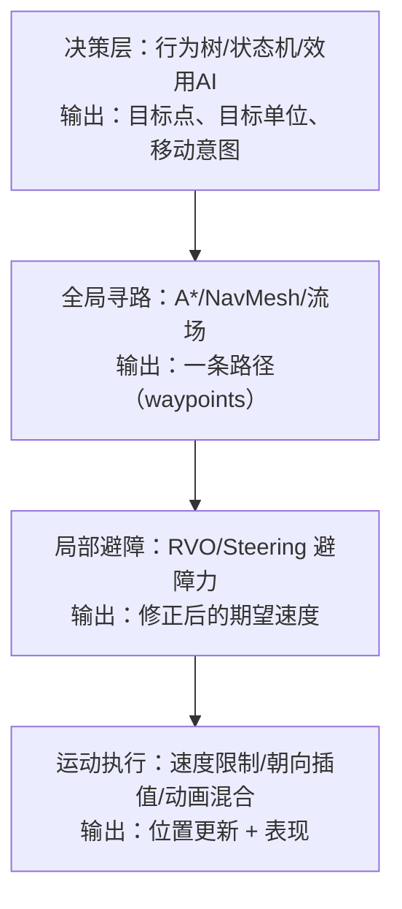
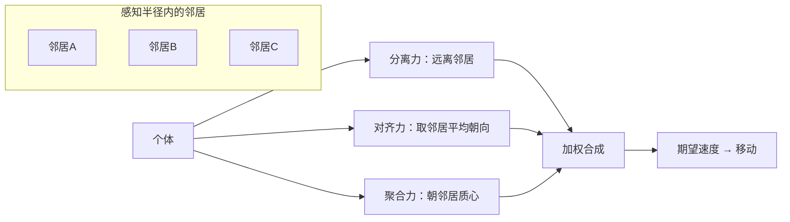

# 游戏AI「移动与群组行为」全解

> 本文讲解游戏 AI 的**行动层**：决策系统（行为树/状态机）输出"要去哪、追谁、躲谁"之后，移动层负责把这些抽象意图翻译成**连续、平滑、不穿模、有表现力**的运动。内容覆盖 Steering Behaviors（转向行为）、Boids 群集、队形保持、寻路与避障的结合（RVO/局部避障）、以及移动表现层（朝向/动画）。
>
> 全文为**引擎无关的通用原理与伪代码**；涉及 UE 具体实现（NavMesh、MoveTo、EQS 等）处仅指路 [游戏知识/05-AI系统](../../游戏知识/05-AI系统/README.md)，不重复撰写。

---

## 一、概述

在"感知 → 决策 → 行动"的 AI 闭环中，移动层是最后的**行动出口**。决策层告诉你"追击玩家"，但玩家在墙后、路上有障碍、周围有 20 个队友——怎么走过去、以什么速度、面朝哪里、播放哪段动画，全部由移动层回答。

移动层之所以值得单独成文，是因为它有三个决策层没有的特性：

1. **连续性**：决策是离散事件（切换状态、选择技能），而移动是每帧连续计算的高频输出。一个 60 FPS 的游戏里，移动层每帧都要跑，其性能开销直接乘以 Agent 数量。
2. **物理性**：移动必须尊重速度、加速度、角速度、碰撞等约束，否则就会出现"漂移"、穿墙、鬼畜抖动。
3. **表现性**：玩家看到的是"角色在走路/奔跑/急停"，而不是"一个点在移动"。朝向插值、动画混合、脚步节奏共同构成移动的"手感"。

移动 AI 的经典体系来自 Craig Reynolds 1987 年的论文《Flocks, Herds and Schools: A Distributed Behavioral Model》（Boids 与 Steering Behaviors 的鼻祖），以及 1999 年《Programming Game AI by Example》（Mat Buckland）等实践著作。30 多年过去，这套体系依然是 RTS 编队、MMO 怪物、开放世界 NPC、动作游戏 Boss 走位的地基——只是外面包上了寻路网格、避障算法与动画系统。

本文的组织方式：先给核心概念速览，再逐个原理详解，然后给出可直接落地的伪代码，最后是选型、最佳实践与 FAQ。

---

## 二、核心概念速览

| 概念 | 一句话定义 | 典型用途 | 复杂度 |
| --- | --- | --- | --- |
| Steering Behavior（转向行为） | 根据局部环境持续计算一个"期望速度/加速度"的行为函数 | 追逐、逃跑、到达、游荡、避障 | ★☆☆ |
| Seek / Flee（追寻/逃离） | 朝目标加速 / 背对目标加速 | 追击、逃跑的最基本元件 | ★☆☆ |
| Arrive（到达） | 接近目标时按距离减速，平滑停下 | 走到站位点、靠近 NPC 对话 | ★☆☆ |
| Pursue / Evade（预测追逐/规避） | 朝目标**未来位置**追 / 远离目标未来位置 | 追玩家、躲子弹、追逐战 | ★★☆ |
| Wander（游荡） | 随机但平滑地改变方向，产生自然巡逻 | 闲逛 NPC、怪物散步 | ★☆☆ |
| Obstacle Avoidance（避障） | 检测前方障碍并产生绕行力 | 所有需要移动的 AI | ★★☆ |
| Boids（群集） | 三条局部规则（分离/对齐/聚合）涌现出群体行为 | 鸟群、鱼群、虫群、小兵集群 | ★★☆ |
| Separation / Alignment / Cohesion | 群集的三个基础力：别挤/顺大流/跟队伍 | RTS 编队、怪物群 | ★★☆ |
| Formation（队形） | 通过槽位或偏移把群体约束成特定几何形状 | RTS 编队、副本 NPC 小队 | ★★★ |
| RVO / ORCA（局部避障） | 基于速度空间的多智能体避碰算法，可解"双向迎面"问题 | 密集人群、大世界 NPC 避让 | ★★★ |
| Flow Field（流场） | 预计算/实时计算"每个格子指向目标的期望方向" | 千人军团移动、塔防怪群 | ★★★ |
| 移动表现层 | 把计算出的速度转成朝向插值、动画状态与脚步 | 所有 AI 的最终呈现 | ★★☆ |

---

## 三、原理详解

### 3.1 移动层的分层位置

一个完整的移动系统通常分四层，上层输出是下层的输入：



关键设计原则：**决策低频（毫秒级~百毫秒级），移动高频（每帧）**。决策层不要直接操纵位置，只输出"意图"；移动层负责平滑执行。这样即使决策层每 0.2 秒才换一次目标，移动也不会卡顿。

### 3.2 Steering Behaviors：逐力详解

Steering 的基本模型是一个"质点"（Vehicle），带位置、速度、最大速度、最大力（加速度上限）。每个行为是一个函数 `Steering = f(vehicle, world)`，返回一个**期望加速度向量**，最终叠加到速度上：

```
每帧：
    steering = 行为函数的输出（加速度，有上限 max_force）
    速度 += steering * dt
    速度 = 限制(速度, max_speed)
    位置 += 速度 * dt
```

#### 3.2.1 Seek 与 Flee：最基础的一对

- **Seek**：期望速度 = 目标位置 - 当前位置（归一化 × max_speed），steering = 期望速度 - 当前速度。
- **Flee**：与 Seek 完全相反，期望速度背离目标。实际游戏中直接逃跑显得太机械，一般用 `flee` 配合 `wander` 或障碍检测，让逃跑路径自然一些。

#### 3.2.2 Arrive：会刹车的 Seek

Seek 的问题是：到达目标时以全速冲过去然后来回震荡。Arrive 在"慢速区"内按距离线性/二次减速：

```
arrive(target):
    to_target = target - pos
    dist = |to_target|
    if dist < slow_radius:            # 进入减速区
        speed = max_speed * dist / slow_radius
    else:
        speed = max_speed
    desired = normalize(to_target) * speed
    return desired - velocity         # 限制在 max_force 内
```

Arrive 是所有"站位"类行为的基础：Boss 走到技能施放点、NPC 走到对话点、小兵走到队形槽位，本质都是 Arrive。

#### 3.2.3 Pursue 与 Evade：预测目标未来位置

直接朝目标当前位置追，会被蛇形走位的玩家遛弯。Pursue 的做法是**预测**：

```
pursue(target):
    to_target = target.pos - pos
    dist = |to_target|
    t = dist / max_speed              # 估计到达所需时间
    future = target.pos + target.velocity * t   # 目标未来位置
    return seek(future)
```

Evade 对称：`future = target.pos + target.velocity * t`，然后 `flee(future)`。注意预测时间要封顶（比如最多预测 1 秒），否则离得远时预测点会乱跳。Pursue 在追逐战（如《生化危机》追击者、《黎明杀机》屠夫）中几乎是标配。

#### 3.2.4 Wander：自然游荡

Wander 不是每帧随机选方向（那样会抖动得像醉酒），而是维护一个"当前方向"，每帧只让它做**小幅随机偏转**，再把方向投射到一个前方圆圈上的目标点，对它执行 Seek：

```
wander():
    wander_theta += 随机(-max_turn, +max_turn)   # 小步偏转
    center = pos + forward * wander_distance      # 前方圆心
    target = center + (cos(wander_theta), sin(wander_theta)) * wander_radius
    return seek(target)
```

Wander 是"闲逛巡逻"的最便宜实现，适合开放世界的路人 NPC、安全区怪物散步；需要"有目的"的巡逻（路线、停留点）时则用路径点巡逻代替。

#### 3.2.5 Obstacle Avoidance：避开局部障碍

Steering 式避障通常做法：在角色前方发射**若干条短射线**（或一个胶囊体/球体做扫掠），检测到障碍物时，计算"把角色推离障碍边缘"的侧向力：

```
obstacle_avoidance():
    ahead = pos + normalize(velocity) * look_ahead   # 前方探测点（距离与速度正比）
    for o in 附近的障碍物:
        if 探测线与 o 的包围球相交:
            计算交点与障碍中心的偏移向量 d
            横向力 = 垂直于速度方向、把角色推向障碍边缘的力（强度与穿透深度成正比）
            叠加到 steering
    return 总避障力
```

要点：探测距离 `look_ahead` 与速度成正比（走得快看得远），力的大小与"预计碰撞时间"成反比。纯 Steering 避障在稀疏场景够用，但无法保证"绕过去"，密集场景会卡住或抖动，此时应升级为 RVO（见 3.5）。

### 3.3 Boids 群集：三条规则涌现群体

1987 年 Reynolds 发现：不需要全局指挥，只要每个个体遵守三条局部规则，群体就会涌现出"聚拢、同行、避让"的自然行为：

1. **Separation（分离）**：与邻居太近时，施加推离力——避免重叠，力与距离成反比。
2. **Alignment（对齐）**：与邻居的平均朝向对齐——让群体朝同一方向。
3. **Cohesion（聚合）**：朝邻居的质心移动——让群体不散开。



实现要点：

- **邻域查询**：每个个体每帧找"半径内邻居"是 O(n²) 热点，必须用**空间网格/空间哈希**（把世界划分成格子，只查相邻格子）或 KD 树优化。1000 个 Boid 不做空间划分会直接卡死。
- **权重调参**：`separation_weight > cohesion_weight > alignment_weight` 是常见起点；分离权重太大群体散架，太小个体重叠穿模。
- **视锥限制（可选）**：只把"前方视野内"的个体当邻居，行为更像动物。
- **行为切换**：同一批 Boid 可以按状态切换目标——逃跑时只分离+对齐（不聚合），追击时全开，逼近目标时分离权重拉高形成"包围圈"。

游戏实例：RTS 中小兵跟随英雄（Hero 是 leader，小兵是 boids）；MMO 中"虫群/狼群"怪物；《战地》《全面战争》系列的步兵方阵内部避让。

### 3.4 队形保持：从"一群人"到"一支队伍"

群集产生"自然的乱"，但玩家期望军队走**整齐的队形**。两种主流做法：

#### 3.4.1 槽位制（Slot / Formation Pattern）

队伍维护一个"编队锚点"（位置+朝向），每个成员有一个**相对偏移槽位**（如方阵、楔形、纵队）。每帧：

```
formation_update(anchor_pos, anchor_yaw):
    for each member i:
        slot_world = anchor_pos + RotateYaw(slot_offset[i], anchor_yaw)
        member.steering = arrive(slot_world) + separation(队友)   # 到槽位 + 防挤
```

- 优点：队形精确可控，适合战棋、RTS 摆阵型；Boss 战小怪"站阵"也常用。
- 缺点：槽位必须始终可达（过窄巷道会堵）；需处理"槽位被占/成员死亡后重排"。

#### 3.4.2 偏移跟随（Leader Following / Offset Pursuit）

设一个 Leader（玩家控制的英雄或队首单位），其他成员用 **Offset Pursuit**：预测 Leader 未来位置，再加上自己的偏移：

```
offset_pursuit(leader, offset):
    t = |leader.pos - pos| / max_speed   # 预测时间
    future = leader.pos + leader.velocity * t
    target = future + RotateYaw(offset, leader.yaw)
    return arrive(target)
```

- 优点：Leader 怎么拐弯，队伍自然跟着甩尾，非常平滑；实现简单。
- 缺点：队形松散，转弯时队伍会"拉面条"。

工程上的常见做法是**两者结合**：槽位定形，但槽位目标用 offset pursuit 预测；再加 separation 防止重叠、obstacle avoidance 让个体绕障（允许暂时离开槽位，绕完后回到槽位——这叫"队形形变"）。RTS 经典问题"过桥堵死"的解法就是：检测到前方通道变窄时，把队形临时切换成纵队，过去后再恢复阵型。

### 3.5 寻路与避障的结合：RVO 与局部避障

#### 3.5.1 为什么要两层

全局寻路（A*/NavMesh，UE 侧实现见 [游戏知识/05-AI系统/03-NavMesh寻路.md](../../游戏知识/05-AI系统/03-NavMesh寻路.md)）解决"宏观怎么走"：绕过大墙、跨过断桥。但它不解决"微观怎么躲"：两个单位迎面相遇、走廊里三个人挤在一起。如果只靠寻路，每帧重算路径既贵又会抖动；所以标准做法是：

1. **全局层**：低频（每 0.5~1 秒，或目标移动超过阈值时）算一条路径；
2. **局部层**：高频（每帧）沿路径走，同时用 RVO/避障力修正速度，躲开动态障碍（其他单位、玩家）。

#### 3.5.2 RVO / ORCA 原理

RVO（Reciprocal Velocity Obstacles，van den Berg, 2008）解决"对称避让"问题：传统避障中 A 躲 B、B 躲 A，各自独立决策会导致**震荡**（两人同时往一边让，又同时让回另一边）。RVO 的洞见是：**每个个体假设对方也会承担一半避让责任**，于是各自只让一半，行为立刻稳定。

ORCA（Optimal Reciprocal Collision Avoidance）是 RVO 的高效变体，思路：

```
对每个邻居 B：
    1. 计算"会导致碰撞的速度集合"（速度障碍 VO）
    2. 用"双方各让一半"的假设，把 VO 缩成半尺寸（RVO 区域）
    3. 在所有 RVO 区域的补集中，找一个"最接近期望速度"的可行速度
    4. 速度 = 该可行速度（位置 += 速度 * dt）
```

ORCA 的优点：每个 Agent 每帧只解一个小的几何问题，可支撑**数千个 Agent 实时避让**（城市行人模拟、Unity DOTS 群组示例都用它）。缺点：需要邻居的速度信息，且对"非对等角色"（玩家 vs NPC）要调整责任系数——通常玩家不参与对等避让，NPC 让玩家。

#### 3.5.3 Flow Field：万人级移动

当同屏 AI 上千（《全面战争》《亿万僵尸》、塔防怪群），逐 Agent 寻路太贵，改用**流场**：把地图网格化，从目标点做一次 BFS/Dijkstra 得到"每个格子到目标的距离场"，再取梯度得到"每个格子的期望方向"。所有 Agent 查自己所在格子的方向即可：

```
flow_field_agent_move():
    dir = flow_field[格子(agent.pos)]          # O(1) 查表
    desired = dir * max_speed
    agent.velocity = 平滑逼近(desired, agent.velocity)
```

流场每帧只更新一次（或分帧更新），成本与格子数相关、与 Agent 数无关——这是它能支撑万人的根本原因。缺点：目标变化时要重算流场；多目标（多波怪）需要多个流场或分层流场。

### 3.6 移动表现层：朝向与动画

计算出的速度向量不能直接"摆"到角色上，否则会出现瞬转、滑步。

#### 3.6.1 朝向

- **朝向插值**：每帧把角色朝向向"移动方向"旋转，限制最大角速度（如 360°/s），用 `DampAngle`/`SmoothDamp` 类函数做指数平滑，避免抖动。
- **后退/侧移（Strafe）**：战斗 AI 需要"面朝目标但向侧面移动"（如 Boss 侧移走位），此时朝向由**目标方向**决定，不由移动方向决定——这是移动表现层最常见的分支：

```
if 战斗状态 and 需要面朝目标:
    目标朝向 = normalize(target.pos - pos)
else:
    目标朝向 = normalize(velocity) 或 保持上次
朝向 = 角速度受限的插值(朝向, 目标朝向)
```

- **转身动画**：急转身时播放转身动画（如 180° 转身 0.3 秒），而不是瞬间跳转；大型怪物（龙、巨兽）转身慢，本身就是"弱点窗口"的设计语言。

#### 3.6.2 动画

- **Locomotion 混合**：用"速度大小 + 方向"驱动动画混合空间（Blend Space）：静止 → 走路 → 跑步；前进/后退/左右侧移是 2D Blend Space 的两个轴。
- **根运动（Root Motion）**：动画自带位移（如翻滚、扑击、击退）时用根运动；普通寻路移动用"速度驱动"（动画只做表现，位置由移动层算），两者要明确区分，避免双写位置。
- **急停/转向混合**：速度从 5 m/s 骤降到 0 时，播放急停动画并让移动层"滑行一小段"（惯性），比瞬间站定自然得多。
- **状态切换**：移动动画状态机（Idle → Walk → Run）与 AI 决策状态机解耦：AI 说"去那里"，动画层自己根据实际速度选走路还是跑步，不要由 AI 决策层直接切动画状态。

---

## 四、伪代码与通用实现示例

### 4.1 Vehicle 基类与 Seek/Arrive/Pursue 完整示例

```
class Vehicle:
    pos, velocity, yaw
    max_speed, max_force        # 最大速度、最大加速度

    def update(dt):
        steering = compute_steering()      # 各行为函数叠加，见下
        steering = truncate(steering, max_force)
        velocity += steering * dt
        velocity = truncate(velocity, max_speed)
        pos += velocity * dt
        yaw = damp_angle(yaw, atan2(velocity.y, velocity.x), max_turn_rate, dt)

    def seek(target):
        desired = normalize(target - pos) * max_speed
        return desired - velocity

    def flee(target):
        desired = normalize(pos - target) * max_speed
        return desired - velocity

    def arrive(target, slow_radius):
        to_target = target - pos
        dist = length(to_target)
        speed = max_speed * clamp(dist / slow_radius, 0, 1)
        desired = normalize(to_target) * speed
        return desired - velocity

    def pursue(target):          # 预测追逐
        t = length(target.pos - pos) / max_speed
        return seek(target.pos + target.velocity * clamp(t, 0, 1.0))

    def evade(target):
        t = length(target.pos - pos) / max_speed
        return flee(target.pos + target.velocity * clamp(t, 0, 1.0))
```

### 4.2 行为组合：追击 + 避障 + 防挤

```
def compute_steering():
    force = Vector2.ZERO
    if has_target:
        force += pursue(target) * 1.0          # 主行为
        force += obstacle_avoidance() * 0.8    # 避障（优先级高）
    else:
        force += wander() * 0.6                # 无事闲逛
    force += separation(neighbors) * 1.2       # 防重叠，常驻
    return force
```

经验法则：**避障力永远不被其他力稀释**——要么把避障放在最后叠加并钳制总力，要么用"优先级仲裁"（有碰撞风险时只输出避障力）。

### 4.3 Boids 三力

```
def boids_steering(me, neighbors):
    s = a = c = Vector2.ZERO
    n = len(neighbors)
    if n == 0:
        return s
    for nb in neighbors:
        d = me.pos - nb.pos
        s += normalize(d) / max(length(d), 0.01)   # 分离：越近力越大
        a += nb.velocity                            # 对齐：邻居平均速度
        c += nb.pos                                 # 聚合：邻居质心
    s = truncate(s, max_force)
    a = truncate(a / n - me.velocity, max_force)
    c = truncate(normalize(c / n - me.pos) * max_speed - me.velocity, max_force)
    return s * w_sep + a * w_ali + c * w_coh        # 权重：分离 > 聚合 > 对齐
```

### 4.4 队形：槽位 + 偏移跟随 + 队形切换

```
class Formation:
    slots: list[Vector2]        # 相对锚点的偏移（方阵/楔形/纵队…）

    def world_slot(self, i, anchor_pos, anchor_yaw):
        return anchor_pos + rotate(slots[i], anchor_yaw)

def member_update(member, formation, anchor, yaw):
    slot = formation.world_slot(member.index, anchor, yaw)
    # 通道变窄时：leader 检测到瓶颈，通知 formation 切换为纵队
    if formation.mode == COLUMN:
        slot = formation.column_slot(member.index)   # 沿路径拉直
    force = arrive(slot, slow_radius=0.5)
    force += separation(队友) * 1.5
    force += obstacle_avoidance() * 0.9
    member.apply(force)
```

### 4.5 ORCA 局部避障（概念级）

```
def orca_velocity(me, neighbors, preferred_velocity, time_horizon, max_speed):
    constraints = []
    for nb in neighbors:
        # 1. 由相对位置/速度构造速度障碍 VO（一个圆锥区域）
        vo = velocity_obstacle(me, nb, time_horizon)
        # 2. 双方各让一半 -> 半尺寸 RVO 区域，约束为一条半平面
        constraints.append(half_plane_from(vo, me.velocity + nb.velocity) / 2)
    # 3. 在满足所有半平面约束的速度集合里，选最接近 preferred_velocity 的
    return linear_program(preferred_velocity, constraints, max_speed)
```

实际工程中 ORCA/RVO 直接使用成熟库（如 Unity 的 DOTS 群组、RVO2 库、UE 的 DetourCrowd），不要自己写线性规划求解器。

---

## 五、选型对比

### 5.1 移动方案选型

| 方案 | 解决层级 | 支持 Agent 数 | 动态障碍 | 实现成本 | 适用场景 |
| --- | --- | --- | --- | --- | --- |
| 纯 Steering（seek/arrive/wander） | 局部 | ~百级 | 好（但会卡） | 低 | 少量 NPC、Boss 走位、宠物跟随 |
| 全局寻路 A*/NavMesh + Steering 避障 | 全局+局部 | ~百~千级 | 中（射线避障不稳） | 中 | 标准开放世界、MMO 怪物 |
| 全局寻路 + RVO/ORCA | 全局+局部 | ~千级 | 很好（对称避让） | 中高 | 城市 NPC、密集战斗、竞技场 |
| Flow Field 流场 | 全局 | ~万级 | 差（静态场） | 中 | 塔防、RTS 大军、尸潮 |
| Boids 群集 | 局部（群体） | ~千级 | 中（需配合寻路） | 低中 | 鸟群/鱼群/小兵集群视觉 |

### 5.2 队形实现选型

| 方式 | 队形精度 | 平滑度 | 瓶颈处理 | 适用 |
| --- | --- | --- | --- | --- |
| 槽位制（Slot） | 高 | 中（过窄会堵） | 需手动切纵队 | RTS 阵型、战棋、Boss 小怪站位 |
| 偏移跟随（Offset Pursuit） | 低（拉面条） | 高 | 自然甩尾 | 小队跟随英雄、护送 |
| 槽位 + 偏移预测 + 形变 | 高 | 高 | 自动降级纵队 | 商业 RTS/MMO 标准做法 |

### 5.3 避障算法选型

| 算法 | 对称性 | 震荡 | 需要邻居信息 | 数量级 |
| --- | --- | --- | --- | --- |
| 射线避障（Steering） | 无（各躲各的） | 易震荡 | 不需要 | 百级 |
| VO（速度障碍） | 无 | 严重 | 需要 | 百级 |
| RVO | 对称（让一半） | 基本消除 | 需要 | 千级 |
| ORCA | 对称 | 消除 | 需要 | 数千级 |

---

## 六、最佳实践

1. **决策与移动分离**：决策层只写"意图"（目标点/目标单位/模式），移动层每帧执行。禁止行为树节点直接 SetPosition。
2. **先分层再优化**：先用"寻路 + 简单避障"跑通，再按 Profiler 数据决定是否上 RVO/流场——过早优化是移动 AI 最常见的返工原因。
3. **避障优先级最高**：碰撞风险存在时，其他力让路；宁可不追目标，不可穿模。
4. **参数可调且集中管理**：max_speed、角速度、慢速区半径、权重等全部配置化（数据表/配置类），调手感时不用改代码。
5. **空间划分是刚需**：任何"找邻居/找附近障碍"的逻辑，Agent 数过百就必须上空间网格/哈希，并缓存查询结果（每 0.1~0.2 秒查一次，不要每帧查）。
6. **分帧更新**：非玩家关注的 AI 每 3~10 帧更新一次移动计算，表现几乎无差别，性能翻倍（详见 [04-服务端AI与性能.md](04-服务端AI与性能.md) 的降频策略）。
7. **表现层独立**：动画状态由"实际速度/朝向"驱动，不由 AI 意图直接驱动，避免意图与表现不一致的滑步。
8. **为寻路失败兜底**：目标不可达时（路径找不到），设定"重新寻路冷却 + 靠近最近可达点"策略，禁止原地鬼畜。
9. **玩家特权**：玩家单位不参与对等避让（RVO 责任系数 0），NPC 负责让玩家，保证玩家操控感。
10. **群组行为要可关**：编队/Boids 提供"解散/聚合"开关，战斗时解散成个体行为，行军时聚合，这是 RTS 的基本操作。

---

## 七、常见问题 FAQ

**Q1：单位到达目标后一直来回抖动/震荡怎么办？**
用 Arrive 替代 Seek；再不行检查"目标在减速区边缘反复进出"——给减速区加滞回（进入半径 2m，退出半径 2.5m），或到达后强制吸附（距离 < 0.1m 直接对准）。

**Q2：两个 NPC 迎面相遇互相"跳舞"（左右横跳）怎么解决？**
这是典型的非对称避让震荡。方案：a) 换 RVO/ORCA（对称避让）；b) 给每个单位固定"让行规则"（如统一靠右让）；c) 让先到达的单位的避障权重略高。优先级 a > b > c。

**Q3：Boids 群体会散架或挤成一团？**
权重问题：散架 = 聚合/对齐权重太低；挤团 = 分离权重太低或分离力被截断。先固定"分离力永不截断"（或单独大上限），再调权重。另外邻居数量太少也会散，检查感知半径。

**Q4：编队过桥/过窄门就堵死，怎么破？**
瓶颈检测 + 队形降级：当 leader 前方通道宽度 < 队形宽度时，整队切成单列纵队（按进入顺序排队），通过后恢复阵型。流场类地图可预计算"瓶颈格子"标记。

**Q5：AI 追击玩家时总是撞墙/绕远路？**
说明局部避障在替全局寻路"擦屁股"。正确做法：先确保全局路径存在（NavMesh 可达），追击目标用 Pursue 预测点，但预测点必须在可行走区域上（采样回网格）；每 0.3~0.5 秒重算一次路径。

**Q6：单位急停/急转看起来像"漂移"？**
加三样东西：a) 加速度限制（max_force 别给满）；b) 朝向角速度限制 + 指数平滑；c) 动画层做急停/转身混合。注意"朝向跟随移动方向"和"面朝目标"两种模式的切换要平滑过渡。

**Q7：几千个单位时帧率暴跌，瓶颈在哪？**
按顺序排查：邻居查询（没空间划分？）→ 每帧寻路（应低频）→ 每帧决策（应降频）→ 动画/骨骼更新（LOD 换低模/禁用根运动）→ 物理碰撞（AI 单位用简化碰撞体）。90% 的坑在前两个。

**Q8：RVO 让 NPC 互相让路，但玩家觉得"挡路"？**
玩家责任系数设为 0（不参与对等避让），NPC 单方面让玩家；同时给玩家单位设置"推开 NPC"的软碰撞或高优先级。

**Q9：怪物被卡在墙角/地形缝隙里？**
根因通常是"局部避障力与寻路路径打架"。方案：a) 检测到速度长时间接近 0 且未到达 → 强制重新寻路 + 短暂"无视避障"；b) 对墙角做 NavMesh 膨胀（agent radius 加大）；c) 卡死超时后直接传送回最近路径点（有 0.5s 隐身穿墙动画遮丑）。

**Q10：Wander 游荡看起来还是太机械？**
给 wander 参数加噪声（半径/偏转幅度随时间缓慢变化），叠加轻微 separation，并随机"停留"（走 3~6 秒停 1~2 秒，播放观望动画）。开放世界 NPC 的"生活感"主要来自停留与朝向变化，而不是移动本身。

---

## 八、关联阅读

- 本目录：[02-战斗与Boss设计.md](02-战斗与Boss设计.md) —— Boss 走位/技能施放点站位是移动层的典型应用；
- 本目录：[04-服务端AI与性能.md](04-服务端AI与性能.md) —— 移动计算的分帧/LOD 预算、万人军团的流场方案；
- 决策层：[游戏AI/01-决策与架构](../01-决策与架构/README.md) —— 移动是决策的输出端，先有意图才有运动；
- UE 实现：[游戏知识/05-AI系统/03-NavMesh寻路.md](../../游戏知识/05-AI系统/03-NavMesh寻路.md) —— NavMesh/A*、NavLink、避障组件与性能优化的 UE 落地；
- UE 实现：[游戏知识/05-AI系统/02-感知系统与EQS.md](../../游戏知识/05-AI系统/02-感知系统与EQS.md) —— EQS 常用于"找站位/找掩体"，与 arrive/走位配合；
- 经典资料：Craig Reynolds《Flocks, Herds and Schools》(1987)；《Programming Game AI by Example》(Mat Buckland)；RVO/ORCA 论文 (van den Berg et al., 2008/2011)。

> 一句话总结：**决策告诉 AI 去哪，寻路告诉 AI 怎么绕，Steering 告诉 AI 怎么动，表现层告诉玩家它在动**——四层各司其职，缺一不可。
