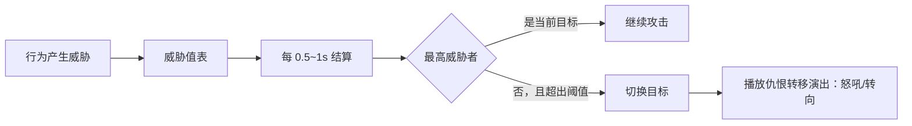
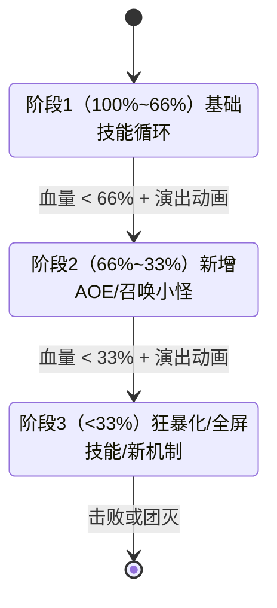

# 游戏AI「战斗与Boss设计」全解

> 知识基线：引擎无关的游戏 AI 通用原理；涉及 UE 的实现以[游戏知识/05-AI系统/01-行为树详解.md](../../游戏知识/05-AI系统/01-行为树详解.md)和[游戏知识/05-AI系统/02-感知系统与EQS.md](../../游戏知识/05-AI系统/02-感知系统与EQS.md)为交叉验证边界。
> 适用范围：适用于单机/客户端战斗 NPC 与 Boss、服务端权威战斗逻辑、AI/战斗策划的仇恨与难度调参，以及跨引擎的目标选择—技能决策—走位—反馈设计；具体网络模型和平台预算需单独验收。
> 事实边界：算法/架构结论与具体引擎、模型、平台版本分开；仇恨、Utility、行为树、阶段和技能序列是通用设计方法，Boss 编排与数值是案例/经验，公平性、性能和强度必须按项目评估；代码与流程图为示意。
> 最后更新：2026-08-06（补齐来源、适用范围与事实边界）。
> 参考来源：[Unreal Engine 官方文档总页](https://dev.epicgames.com/documentation/en-us/unreal-engine)；交叉阅读：[游戏知识/05-AI系统/01-行为树详解.md](../../游戏知识/05-AI系统/01-行为树详解.md)、[游戏知识/05-AI系统/02-感知系统与EQS.md](../../游戏知识/05-AI系统/02-感知系统与EQS.md)。

> 本文讲解战斗 AI 的完整设计链：**仇恨系统 → 目标选择 → 技能决策 → 走位 → Boss 模式化 → 难度曲线 → 团队协作 → 打击感反馈**。战斗 AI 是玩家感知最直接、最容易被"骂"的 AI——打错人、乱放技能、站着挨打、Boss 无脑复读，每一个问题都会立刻毁掉战斗体验。
>
> 全文为**引擎无关的通用原理与伪代码**；涉及 UE 具体实现（行为树节点、EQS 站位）处仅指路 [游戏知识/05-AI系统](../../游戏知识/05-AI系统/README.md)。决策手段（行为树/效用 AI）详见 [游戏AI/01-决策与架构](../01-决策与架构/README.md)。

---

## 一、概述

战斗 AI 与普通 NPC AI 的根本区别：**它必须同时服务"挑战性"与"观赏性"**。怪物太聪明（无限完美闪避、无懈可击的连招）会让玩家挫败；太笨（站着挨打、撞墙）会让战斗索然无味。好的战斗 AI 是"看起来很聪明，但永远给玩家留一扇窗"。

战斗 AI 的三个层次：

1. **个体层**：一个怪物怎么选目标、放技能、走位——仇恨系统与技能决策是核心；
2. **Boss 层**：精心编排的多阶段战斗——模式化设计（阶段、技能序列、狂暴）是核心；
3. **群体层**：多个敌人与玩家团队之间的博弈——仇恨分工、集火、包围、团队协作。

设计战斗 AI 时永远要回答三个问题：

- **公平吗**：玩家能否通过观察与学习找到对策？（红圈预警、前摇动作、技能规律）
- **有反馈吗**：玩家的每个操作是否换来可见的 AI 反应？（受击硬直、仇恨转移、Boss 怒吼）
- **扛得住吗**：战斗中可能有几十个怪物同时决策，性能预算必须提前规划（详见 [04-服务端AI与性能.md](04-服务端AI与性能.md)）。

本文按"从单个怪物的决策到整个战斗的编排"的顺序展开：先讲仇恨与目标（打谁），再讲技能与走位（怎么打），然后是 Boss 编排（整场战斗怎么演），最后是难度、协作与反馈（玩家体验怎么调）。

---

## 二、核心概念速览

| 概念 | 一句话定义 | 典型用途 | 复杂度 |
| --- | --- | --- | --- |
| 仇恨系统（Aggro/Threat） | 记录每个单位对各目标的威胁值，决定"打谁" | MMO 副本怪、坦克嘲讽 | ★★★ |
| 威胁值（Threat） | 伤害/治疗/嘲讽等行为产生的数值化仇恨 | 仇恨列表排序 | ★★☆ |
| 目标选择（Target Selection） | 从候选目标中选出当前攻击对象（规则或评分） | 所有战斗 AI | ★★☆ |
| 技能决策（Skill Decision） | 在冷却/距离/状态约束下选择放哪个技能 | 怪物技能、Boss 招式 | ★★★ |
| 走位（Positioning） | 在战斗中维持有利位置（距离/侧向/掩体） | Boss 战、精英怪 | ★★☆ |
| 阶段切换（Phase） | 血量/时间触发整场战斗的规则切换 | Boss 战 | ★★★ |
| 技能序列（Pattern/Sequence） | 按预定顺序或加权随机选择技能组合 | Boss 招式表 | ★★★ |
| 狂暴（Enrage） | 战斗超时后 AI 伤害暴增/全屏技能，强制结束战斗 | 副本 Boss | ★☆☆ |
| 难度曲线（Difficulty Curve） | 挑战难度随进度/时间的设计走势 | 关卡、副本 | ★★☆ |
| 动态难度（DDA） | 根据玩家表现实时调整 AI 强度 | 单机/主机游戏 | ★★☆ |
| 团队协作 AI（Tactical AI） | 多单位按分工/指令协同作战 | 副本 Boss 战、战场 | ★★★ |
| 打击感反馈（Hit Feedback） | AI 对受击/施法/危险的可见反应 | 动作游戏、MMO | ★★☆ |

---

## 三、原理详解

### 3.1 仇恨系统：AI 的"记账本"

仇恨系统的本质：**给每个潜在目标记一笔"威胁账"，定期结算，选威胁值最高的目标攻击**。它让"怪物为什么打我"变得可预测、可操作，是 MMO 团队战斗（坦克/输出/治疗分工）的基石。



#### 3.1.1 威胁值的来源与数值

典型规则（各游戏差异很大，这里给通用范式）：

- **伤害**：造成伤害 → 威胁 += 伤害值 × 系数（近战 1.0、远程 0.8 之类）；
- **治疗**：治疗队友 → 威胁 += 治疗量 × 系数（通常 0.5 左右，治疗 OT 需要技巧）；
- **嘲讽（Taunt）**：直接设置"强制目标 = 施放者"并给予大额威胁，持续数秒；
- **增益/减益**：上 Buff/Debuff 产生少量威胁；
- **距离/进入战斗**：先手者/最近者获得初始威胁，防止怪物发呆。

#### 3.1.2 衰减与清仇恨

- **时间衰减**：威胁值按秒衰减（如每秒 -5%），长时间不被打的怪物仇恨自然回落，便于换坦/风筝；
- **脱战重置**：脱离战斗范围（或目标死亡）后清空仇恨表；
- **技能清仇恨**：玩家技能"消失/渐隐"（如盗贼消失）直接清零自身威胁；
- **OT（Over-Threat）判定**：输出超过坦克威胁一定比例（如 110%）且超出范围时，怪物转火输出——这是"仇恨管理"玩法的核心机制，也让战斗有张力。

#### 3.1.3 仇恨系统的变体

- **无仇恨的"就近攻击"**：单机动作游戏怪物常用"最近目标 + 被打响应"（谁打我我打谁），简单直接，但容易被风筝；
- **仇恨 + 行为权重**：Boss 战中"威胁值决定主目标，但技能目标可以特殊指定"（点名技能选最远/最近/随机玩家），仇恨不决定一切；
- **软仇恨/兴趣点**：开放世界怪物用"兴趣值"代替仇恨——看到玩家、听到声音、被攻击都会加分，分数高才进入战斗。

### 3.2 目标选择：从"仇恨最高"到"评分制"

目标选择不一定等于仇恨排序。实战中常见策略：

| 策略 | 规则 | 适用 |
| --- | --- | --- |
| 仇恨最高 | 永远打威胁值最高者 | MMO 副本怪、需要坦克的场合 |
| 最近目标 | 打离自己最近的可攻击目标 | 动作游戏杂兵、RTS 近战 |
| 最低血量 | 集火残血，快速减员 | 狗群、小怪集群（配合"击杀优先"） |
| 评分制 | 各因素加权打分（距离/威胁/血量/职业/状态） | 精英怪、Boss 的复杂选择 |
| 随机点名 | 完全随机选一个玩家 | Boss 点名技能（需要全体戒备） |

评分制示例（后文有完整伪代码）：

```
score(target) = w1 * 威胁值归一化 + w2 * (1 - 距离归一化) + w3 * (1 - 血量归一化) + w4 * 职业权重
```

设计要点：

- **可读性优先**：玩家必须能"猜到"怪物为什么打他。纯随机/黑箱评分会毁掉体验；
- **切换冷却**：目标切换不要过于频繁（加 1~3 秒锁定），否则怪物看起来"精神分裂"；
- **与仇恨联动**：评分制通常只用于"次级目标"（召唤物、治疗者），主目标仍由仇恨锁定。

### 3.3 技能决策：在约束下选"最该放"的技能

技能决策是战斗 AI 的"大脑"：每个 AI 有若干技能（普攻、重击、冲锋、AOE、召唤、治疗…），每帧/每 0.2 秒要决定"现在放哪个"。约束条件比普通决策多得多：

- **冷却（Cooldown）**：技能有自己的 CD，未冷却完不能放；
- **距离/范围**：冲锋需要目标在 8~25m；近战 AOE 需要目标在 3m 内；
- **资源**：能量/怒气/法力是否足够；
- **状态**：被控（眩晕/冰冻）时只能挨打；硬直中不能起手；
- **前摇/引导/后摇**：技能有施法时间，决策要"提前量"——不能在玩家离开范围时才选冲锋；
- **环境**：目标是否在视线内、是否有墙体遮挡（法术弹道）。

实现上有两种常见风格：

#### 3.3.1 规则式（条件优先级）

写死优先级表：`if 冲锋冷却好 and 目标在 8~25m and 无遮挡 → 冲锋`，否则查下一条。优点：简单、可控、易调试；缺点：规则一多就变成意大利面，且"最优解"固定，容易被玩家摸透。

#### 3.3.2 效用式（Utility Scoring）

给每个技能算一个效用分，取最高分执行（详见 [游戏AI/01-决策与架构/04-Utility与GOAP.md](../01-决策与架构/04-Utility与GOAP.md)）：

```
utility(冲锋) = 距离匹配度(0~1) × 冷却就绪(0/1) × 危险系数(被风筝时高)
utility(重击) = 目标在近战范围(0/1) × 怒气充足(0/1) × 随机扰动(0.8~1.2)
```

效用式的优点：连续、自然、可加随机扰动让行为不那么"公式化"；缺点：分数曲线调参费时，出问题时不如规则式好定位。

一种常见工程分层是：**Boss 和精英用效用/行为树混合，杂兵用规则式**。杂兵的决策开销要压到微秒级（一个 if 链），Boss 才值得花几百微秒做华丽决策；具体分层和预算仍需按项目实测评估。

#### 3.3.3 技能施放管线

一个完整技能施放包含四个阶段，AI 与动画/表现层各管一段：

```
决策(选择技能) → 前摇(0.3~1s，播放起手动画+预警特效，可被打断)
    → 生效(伤害/效果结算，可带引导条)
        → 后摇(收招硬直，AI 可被玩家惩罚) → 回到决策
```

前摇是**玩家反应窗口**，也是"公平性"的关键：大型技能前摇必须长且明显（红圈、蓄力、吼叫）。后摇是**玩家输出窗口**：Boss 放完大招的僵直时间就是团队集火的时机。

### 3.4 走位：战斗中的"战术移动"

走位是 [01-移动与群组行为.md](01-移动与群组行为.md) 中移动技术（arrive/strafe/避障）在战斗场景的战术化应用。常见模式：

| 走位模式 | 行为 | 典型角色 |
| --- | --- | --- |
| 近战贴脸（Melee） | 追到目标近战距离，绕背输出 | 近战怪、Boss 近战阶段 |
| 保持距离（Keep Range） | 与目标维持"技能最佳射程"（远了追、近了退） | 远程怪、法师怪 |
| 风筝（Kite） | 边退边打，利用减速/定身技能放目标风筝 | 放风筝型 Boss、精英 |
| 侧移环绕（Strafe） | 面朝目标横向移动，规避正面 AOE | 所有战斗 AI 的基础机动 |
| 找掩体（Cover） | 移动到遮挡物后规避弹道技能 | 射击游戏 AI、需要掩体的怪 |
| 包围（Flank） | 从侧后方向目标移动（绕背） | 狼群、盗贼怪 |

#### 3.4.1 走位的实现要点

- **目标点生成**：走位本质上还是"选一个目标点 + arrive"（见 01 文档）。远程怪的目标点 = 目标位置 + 反向偏移（保持射程）；绕背怪的目标点 = 目标背后 1.5m 的弧线上；
- **站位可用性**：目标点必须做可行性检测（NavMesh 可达、无碰撞），不可达时降级为"靠近但保持当前距离"；
- **EQS 类查询**：找掩体、找最佳输出位这类"从一堆候选点里评分选优"的需求，UE 用 EQS 实现（见 [游戏知识/05-AI系统/02-感知系统与EQS.md](../../游戏知识/05-AI系统/02-感知系统与EQS.md)），其他引擎用采样点 + 评分函数；
- **移动与技能协同**：放技能时停下（前摇期间不移动），技能结束再继续走位——"停-打-走"的节奏本身就是战斗感；
- **别被卡住**：走位 AI 最容易翻车的就是贴墙抖动，复用 01 文档 FAQ 中的"卡死检测 + 重新寻路"方案。

#### 3.4.2 走位的"性格"

同一个 Boss 的走位参数（追击速度、贴脸距离、绕背倾向、撤退距离）决定它的"性格"：狂暴型（全速贴脸、很少后撤）、风筝型（保持中距、频繁位移）、站桩型（几乎不动，全靠技能范围）。这些参数应该集中配置，方便策划调"手感"。

### 3.5 Boss 模式化设计：整场战斗的"剧本"

Boss 战与杂兵战的最大区别：**Boss 战是编排出来的"剧本"，而不是自由发挥的沙盒**。玩家体验的核心是"读懂剧本 → 背下解法 → 执行操作"的成长循环。

#### 3.5.1 阶段切换（Phase）

阶段是 Boss 战最重要的结构单位：血量降到阈值（如 100%/66%/33%）或战斗时间到点，Boss 切换阶段，规则整体改变：



阶段切换的设计要点：

- **切换演出**：阶段切换必须打断战斗节奏（Boss 无敌 + 动画 + 台词），给玩家"新阶段开始"的明确信号；
- **血量阈值 vs 时间阈值**：血量阈值保证"打得越快阶段越早"，时间阈值（如每 60 秒强制转阶段）防止卡 Bug 拖时间，两者可混用；
- **阶段与仇恨**：转阶段通常**清空仇恨**（Boss 重新选择目标），这是团队换坦/调整站位的时间窗；
- **阶段不是加血条**：新阶段必须引入**新机制**（新技能、新召唤、地形变化），否则只是"数值更高的同一场战斗"。

#### 3.5.2 技能序列（Pattern / Rotation）

技能序列是 Boss 每阶段内"招式顺序"的组织方式，三种典型设计：

| 序列类型 | 规则 | 特点 | 实例 |
| --- | --- | --- | --- |
| 固定循环（Rotation） | 按固定顺序循环：A→B→C→A… | 极易学习，适合入门 Boss | 新手村 Boss 三连招 |
| 加权随机（Weighted Random） | 每招带权重，随机抽取，可加"避免连用"约束 | 有变化但可预期 | MMO 副本小 Boss |
| 反应式（Reactive） | 根据玩家行为选招（玩家近身→AOE 震开；玩家远离→冲锋） | 聪明感强，需行为检测 | 动作游戏精英/Boss |

工程实现上，技能序列通常是一个"技能表 + 调度器"：

```
pattern_tick(boss, dt):
    if 当前技能未结束: return           # 前摇/引导/后摇中
    if 冷却中的技能过多: 普攻兜底
    候选 = [s for s in 技能表 if 冷却就绪 and 距离满足 and 资源满足]
    if boss.phase == 2: 候选 += [召唤小怪]    # 阶段解锁技能
    if 玩家密集: 候选权重提升 AOE 技能
    技能 = weighted_pick(候选, 权重表)        # 避免与上一招相同
    boss.cast(技能)
```

#### 3.5.3 狂暴（Enrage）与软狂暴

- **硬狂暴**：开战 X 分钟后（或血量低于阈值），Boss 伤害翻倍/全屏必杀——强制团队在时限内结束战斗，防止"磨死"；
- **软狂暴**：Boss 技能越来越快、AOE 越来越多，但仍有操作空间——比硬狂暴更有"压迫感"；
- **设计要点**：狂暴计时必须在 UI 上可见（Boss 血条旁倒计时），否则玩家会认为"突然被秒"是不公平。

#### 3.5.4 动作游戏 Boss 与 MMO Boss 的差异

| 维度 | 动作游戏 Boss（魂系/战神） | MMO 副本 Boss（魔兽/FF14） |
| --- | --- | --- |
| 决策频率 | 每帧级（读玩家动作，取消/连招） | 秒级（固定循环 + 点名） |
| 仇恨 | 弱（就近/被打响应） | 强（坦克嘲讽体系） |
| 难点来源 | 玩家操作精度（闪避帧、目押） | 团队机制执行（站位、点名、转火） |
| 表现力 | 招式演出、处决、霸体 | 全屏预警、阶段台词、演出动画 |
| 学习方式 | 玩家死记 Boss 动作帧 | 团队背机制攻略 |

两者没有优劣，只是"难点"分配不同：动作游戏把难度放在**个体操作**上，MMO 把难度放在**团队配合**上。设计时先想清楚你的战斗是"给谁看的"。

### 3.6 难度曲线与动态难度

#### 3.6.1 难度曲线的设计

难度曲线描述"挑战强度随游戏进程的变化"。好曲线不是单调上升，而是**爬坡-平台-陡坡**的波浪结构：


设计要点：

- **难度 = 机制复杂度 × 数值强度 × 容错度**，三者可分别调节：机制复杂但数值低 = "教学关"；机制简单但数值高 = "数值检验"；
- **每次引入新机制后给一个"免费练习场"**（低风险怪/教学 Boss），再放进高压力场景；
- **失败即信息**：玩家死亡后要能看出"刚才为什么死"（红圈没躲/点名没接），否则难度曲线再合理也是空谈。

#### 3.6.2 动态难度（DDA，Dynamic Difficulty Adjustment）

动态难度指 AI 根据玩家表现实时调整强度：

| 机制 | 做法 | 典型应用 |
| --- | --- | --- |
| 橡皮筋（Rubber Banding） | 领先时 AI 变强，落后时 AI 变弱 | 竞速游戏、派对游戏 |
| 失败补偿 | 连续死亡后降低 AI 反应速度/伤害，或给玩家增益 | 单机动作游戏 |
| 成功加压 | 连续无伤后 AI 解锁更强招式 | 鬼泣、猎天使魔女的"评价系统" |
| 隐形辅助 | AI 命中率、弹速微调（玩家感知不到） | 射击游戏 |

DDA 的争议与原则：

- **公平透明**：难度变化最好让玩家"感觉到"（Boss 狂暴化、敌人变红），隐形的橡皮筋最招骂（《马力欧赛车》的蓝龟壳被吐槽多年）；
- **AI 作弊要有度**：AI 读玩家输入（预判闪避）在动作游戏里是常见手段，但要加反应延迟与概率，否则玩家觉得"被读心"；
- **多人游戏慎用**：PVP 或带排行榜的场景禁用 DDA，公平性优先。

#### 3.6.3 多人副本的难度适配

- **人数缩放**：Boss 血量/伤害按队伍人数缩放（如 1 人 100%，4 人 350%），公式必须连续且经过测试，防止"3 人队比 4 人队还难"；
- **弹性副本**：中途加人/减人时动态重算，需要服务端支持（详见 [04-服务端AI与性能.md](04-服务端AI与性能.md)）；
- **辅助模式**：明确标注的"简单模式"（AI 自动闪避/伤害减免）比暗改数值更受好评。

### 3.7 战术与团队协作 AI

当多个 AI 单位需要配合（副本 Boss 的护卫、战场小队、RTS 兵团），就要有协作机制。三个层次：

#### 3.7.1 隐式协作（Emergent）

每个单位独立决策，但共享规则，涌现出配合效果——Boids 群集围攻玩家、小怪自动包围 = "隐式协作"：每个怪都向"目标侧后方"移动，群体自然形成包围圈。优点：零同步成本，服务端友好；缺点：无法保证精确配合。

#### 3.7.2 角色分工（Role Assignment）

给单位分配固定角色与规则：护卫（挡在 Boss 与治疗之间）、DPS（只打被标记目标）、召唤师（保持距离输出）。实现通常是"单位类型内置行为模式"，配合黑板的共享信息（谁被点名、谁需要保护）。

#### 3.7.3 指挥式协作（Commander / Leader）

一个"指挥官"单位（Boss 或队长）发出战术指令，其他单位执行：

```
commander_tick(战斗态势):
    if 玩家治疗者威胁大: 广播指令 = 集火(治疗者)
    if 玩家站位密集:     广播指令 = 全体AOE蓄力
    if 我方被AOE覆盖:    广播指令 = 分散(阵型散开)
    小兵收到指令 → 更新自己的目标/技能/走位（局部仍自治）
```

指挥式协作是"集中决策 + 分布执行"：指挥官低频决策（每 0.5~1 秒），小兵高频执行。这与 [01-移动与群组行为.md](01-移动与群组行为.md) 的"Leader + 编队"一脉相承。

#### 3.7.4 团队协作 AI 的常见机制

- **集火标记**：Boss 标记一个目标（小怪优先攻击），玩家需要转火保护——经典"压力机制"；
- **连携技**：两个 AI 配合释放组合技（一个控场一个输出），需要时间同步（约定延迟/信号）；
- **掩护**：射手 AI 躲到盾兵 AI 身后输出，盾兵根据射手位置移动——隐式协作 + 简单寻路即可实现；
- **复活/增援**：治疗小怪为 Boss 回血，玩家需优先击杀——仇恨系统 + 优先级规则的组合。

### 3.8 打击感与 AI 反馈

打击感（Game Feel）是"玩家操作 → 游戏反应"的感官闭环，AI 是闭环的另一半。AI 侧要提供的反馈：

#### 3.8.1 受击反馈

- **硬直（Hit Stun）**：受击后 AI 短暂中断动作（0.1~0.3 秒），让玩家"感觉到打中了"；大型怪物硬直更短或免疫（霸体），体现体型差；
- **击退/击飞**：受击位移要配合动画与音效，位移量与伤害挂钩；击飞后的倒地时间是玩家的追击窗口；
- **闪红/抖动**：命中瞬间模型闪白/闪红 1~2 帧，是"打中了"的最低成本反馈；
- **受击 AI 反应**：被打醒（巡逻怪被打后进入战斗）、被打断（前摇被打断后 Boss 换招）、被打怒（血量低后狂暴）。

#### 3.8.2 施法与危险预警

- **前摇 = 预警**：任何有威胁的技能都必须有可辨识的前摇（动作 + 特效 + 音效 + 地面红圈），预警时间与技能威胁成正比；
- **点名反馈**：被点名的玩家要有明确的 UI 提示（红色箭头/连线），并给反应时间；
- **台词/吼叫**：阶段切换、狂暴、召唤小怪时的台词与吼叫，既是演出也是信息。

#### 3.8.3 死亡与胜利演出

- **处决/终结技**：Boss 低血量时触发终结演出（QTE/过场），是"奖励玩家通关"的情绪高点；
- **死亡反馈**：死亡动画要匹配击杀方式（处决、坠落、元素伤害各有演出），怪物死亡瞬间清除其占用的 AI 槽位与仇恨表。

#### 3.8.4 反馈的优先级

反馈要按"信息价值"排序：**危险预警 > 受击反馈 > 状态反馈 > 装饰反馈**。预算不足时先保预警（红圈）与受击（硬直），它们是战斗"公平感"的底线。

---

## 四、伪代码与通用实现示例

### 4.1 仇恨表

```
class ThreatTable:
    threats: dict[UnitID, float]

    def add_threat(unit, amount):
        threats[unit] += amount * 威胁系数(行为类型)
        if 技能为嘲讽:
            force_target = unit          # 强制目标
            threats[unit] += 大额固定值

    def tick(dt):
        for id in threats:
            threats[id] *= (1 - 0.05 * dt)     # 每秒 5% 衰减
        if 当前目标不在表中 or 当前目标已死亡:
            重新选择目标()

    def select_target():
        best = argmax(threats)                 # 最高威胁
        if best != current and threats[best] > threats[current] * 1.1:
            switch_target(best)                # OT 判定：超出 110%
        return current

    def clear():
        threats.clear()                        # 脱战/转阶段清空
```

### 4.2 评分制目标选择

```
def score_target(unit, target):
    t = target.threat / max_threat             # 威胁归一化 0~1
    d = 1 - clamp(dist(unit, target) / 30, 0, 1)   # 距离（30m 内）
    h = 1 - target.hp_ratio                    # 血量越低分越高（集火）
    r = 职业权重(治疗者=0.3, 输出=0.2, 坦克=0.1)   # 可配置
    return 0.4*t + 0.2*d + 0.3*h + 0.1*r

def choose_target(unit, candidates):
    # 目标切换冷却：距上次切换 < 2s 则不换
    if unit.switch_cooldown > 0: return unit.current
    best = max(candidates, key=lambda c: score_target(unit, c))
    if score(best) - score(unit.current) > 0.15:   # 阈值防抖
        unit.switch_target(best)
```

### 4.3 技能决策（效用式）

```
def skill_utility(ai, skill, target):
    if skill.cooldown_remaining > 0: return 0
    if not skill.can_cast(ai, target): return 0
    score = 0.0
    score += skill.range_curve(dist(ai, target))     # 距离匹配曲线
    score += skill.situation_bonus(ai)               # 情境加分（密集AOE等）
    score *= random.uniform(0.8, 1.2)                # 随机扰动防公式化
    if skill == ai.last_skill: score *= 0.3          # 避免连用同一招
    return score

def decide_skill(ai):
    if ai.current_cast: return                        # 施放中不打断
    best = max(ai.skills, key=lambda s: skill_utility(ai, s, ai.target))
    if skill_utility(ai, best, ai.target) > 0.1:
        ai.begin_cast(best)                           # 进入前摇
```

### 4.4 Boss 阶段状态机 + 技能序列

```
class BossAI:
    phase = 1

    def on_damaged(hp_ratio):
        if hp_ratio < 0.66 and phase == 1:
            self.start_phase(2)          # 清仇恨 + 演出 + 解锁新技能
        if hp_ratio < 0.33 and phase == 2:
            self.start_phase(3)          # 狂暴化

    def start_phase(p):
        phase = p
        threat.clear()
        play_cutscene(p)                 # 阶段演出（无敌+台词）
        skills += phase_skills[p]        # 解锁新技能
        pattern.reset()

    def pattern_tick(dt):
        if casting: return
        if enrage_timer <= 0:            # 狂暴计时
            cast(全屏必杀); return
        candidates = ready_skills()
        if phase == 2 and 玩家聚集: candidates += [召唤小怪]
        s = weighted_pick(candidates, avoid_repeat=True)
        cast(s)                          # 前摇→生效→后摇
```

### 4.5 团队协作：集火指令

```
def commander_tick(squad, world):
    healer = world.find_healer(squad.enemies)
    if healer and healer.is_threatening():
        squad.broadcast(FOCUS, healer)      # 全员集火治疗者
    elif world.enemies_clustered(radius=6):
        squad.broadcast(AOE_PREPARE)        # 全员准备AOE
    else:
        squad.broadcast(FREE)               # 自由行动

def soldier_on_command(cmd):
    if cmd == FOCUS and 我的攻击距离内:
        target = cmd.target                 # 覆盖自己的目标选择
    if cmd == AOE_PREPARE:
        move_to(敌群中心 + 偏移) 然后 蓄力
```

协作的关键纪律：**指令只改"意图"，不接管小兵的移动/技能细节**——否则指挥官一死，全队瘫痪。

---

## 五、选型对比

### 5.1 目标选择机制

| 机制 | 可预测性 | 玩家博弈深度 | 实现成本 | 适用 |
| --- | --- | --- | --- | --- |
| 仇恨最高 | 高（可算） | 高（坦克/OT 管理） | 中 | MMO 副本、团队战 |
| 最近目标 | 高 | 低（躲远就行） | 极低 | 动作游戏杂兵 |
| 最低血量 | 中 | 中（保护残血） | 低 | 狗群、召唤物 |
| 评分制 | 低-中 | 中 | 中 | 精英怪、Boss 次级目标 |
| 纯随机 | 低 | 低 | 极低 | 点名技能（配合预警） |

### 5.2 技能决策风格

| 风格 | 行为多样性 | 可调试性 | 调参成本 | 适用 |
| --- | --- | --- | --- | --- |
| 规则优先级 | 低（固定） | 高 | 低 | 杂兵、模式化 Boss |
| 加权随机 | 中 | 高 | 低 | 技能序列 |
| 效用评分 | 高 | 中（曲线难调） | 中高 | 精英怪、自由决策 Boss |
| 行为树 | 高（可组合） | 高（可视化） | 中 | 复杂战斗 AI（UE 常见） |
| 机器学习 | 极高（不可控） | 低 | 极高 | 实验性/特定场景（见 03） |

### 5.3 战斗编排方式

| 方式 | 观赏性 | 可重复挑战价值 | 制作成本 | 适用 |
| --- | --- | --- | --- | --- |
| 纯自由 AI | 低（容易乱） | 中 | 低 | 杂兵、开放世界遭遇 |
| 固定循环序列 | 中 | 低（背板） | 低 | 新手 Boss |
| 加权随机 + 防连用 | 高 | 中高 | 中 | MMO 副本 Boss |
| 多阶段 + 机制组合 | 极高 | 高（学习成长） | 高 | 核心 Boss、副本尾王 |

### 5.4 难度调节方式

| 方式 | 公平感 | 实现成本 | 适用 |
| --- | --- | --- | --- |
| 静态数值曲线 | 高（一致） | 低 | 大多数 PVE |
| 人数缩放 | 高（透明） | 中 | 多人副本 |
| 失败补偿 DDA | 中（需隐藏） | 中 | 单机动作 |
| 橡皮筋 DDA | 低（易感知） | 低 | 派对/竞速 |
| 显式难度选项 | 高（玩家自选） | 低 | 所有游戏（推荐标配） |

---

## 六、最佳实践

1. **公平性优先**：任何技能都要给反应时间（前摇+预警），"无解技"只允许出现在"需要团队配合破解"的机制里；
2. **仇恨可见**：MMO 中玩家的仇恨行为（嘲讽、OT）要能通过 UI/表现看到，仇恨系统才成立；
3. **决策分层**：杂兵用规则式（微秒级），精英用效用/行为树（百微秒级），Boss 全开——预算分配见 [04-服务端AI与性能.md](04-服务端AI与性能.md)；
4. **技能前摇不可瞬发**：瞬发大伤害是战斗公平感的头号杀手，所有关键技能强制前摇；
5. **Boss 新阶段 = 新机制**：没有新机制就不要做新阶段，避免"同一场战斗打三遍"；
6. **狂暴必须计时可见**：硬狂暴倒计时显示在 Boss 血条上，这是战斗设计的诚信问题；
7. **AI 不读玩家输入**（或至少加延迟+概率）：预判闪避要留 100~200ms 反应余量，否则玩家感到被读心；
8. **走位参数配置化**：追击速度、贴脸距离、撤退阈值进配置表，策划可调，程序不背锅；
9. **战斗结束清理**：死亡/脱战立即释放 AI 槽位、清仇恨、停用技能调度，防止"尸体还在决策"；
10. **用数据验证体验**：统计"玩家平均死亡次数、Boss 战时长分布、技能命中率"，用数据调难度曲线而不是拍脑袋；
11. **演出与玩法解耦**：阶段切换演出期间 AI 逻辑暂停（无敌+不可操作），避免"演出打到一半 Boss 突然放技能"的穿帮；
12. **为所有 AI 行为留调试开关**：强制触发某个技能、锁阶段、关闭狂暴——测试和 QA 会感谢你。

---

## 七、常见问题 FAQ

**Q1：怪物打人"东一榔头西一棒"，目标换来换去？**
原因：目标选择过于频繁。解法：a) 目标切换加冷却（2~3 秒）；b) 仇恨系统加"锁定当前目标直到 OT 阈值"的机制；c) 评分制加切换阈值（新目标分必须超出当前目标 X% 才换）。

**Q2：坦克拉不住怪，输出一打就 OT？**
数值问题：威胁系数配比失衡。检查：a) 坦克技能（嘲讽/仇恨技能）的威胁系数是否足够；b) 输出威胁系数是否过高；c) OT 阈值（110%）是否太紧；d) 嘲讽是否有 CD 空窗。先给坦克"仇恨技能组合"，再调系数。

**Q3：Boss 技能循环被玩家"背板"后毫无还手之力？**
背板是 Boss 战的正常结果。解法：a) 加权随机 + 防连用（变化但可预期）；b) 反应式技能（打断玩家连招/针对站位）；c) 阶段机制强制改变打法（转阶段换规则）；d) 接受"背板 = 玩家成长"，把难度放在机制执行上。

**Q4：Boss 放技能时玩家已经跑出范围，技能总是空放？**
这是"决策与执行不同步"：决策时玩家在范围内，前摇后玩家走了。解法：a) 技能瞄准用"起手瞬间锁定"（范围类）或"施法时追踪"（弹道类）；b) 技能加"取消条件"（目标离开范围则取消施法，返还部分 CD）；c) 用预测（目标当前速度外推 0.5 秒的位置）。

**Q5：怪物站着不动挨打，玩家觉得太蠢？**
加"受击反应链"：被打 → 硬直 → 反击意愿上升（短时间内置"被打后必反击"）；近战怪被打时侧移/后撤一步再打；远程怪被打时拉开距离。最低成本方案：受击后强制触发"格挡/闪避动画 + 后撤 2m"。

**Q6：团队副本里小怪各打各的，乱成一锅粥？**
需要协作机制：a) 给小怪共享"战斗目标状态"（黑板/广播）；b) 引入指挥官模式（见 3.7.3）；c) 定义角色分工（护卫/输出/治疗各司其职）；d) 集火机制（点名目标共享）。

**Q7：动态难度被玩家发现后口碑崩了？**
动态难度的第一原则是"玩家不可感知或感知为正向"：a) 优先调"AI 反应速度/技能频率"这类隐性参数；b) 显性变化（Boss 狂暴）要配合演出与叙事（"它愤怒了！"）；c) 提供显式难度选项作为兜底；d) PVP/排行榜场景禁用。

**Q8：Boss 转阶段时仇恨清空导致坦克被秒？**
转阶段清仇恨是常见设计，但要处理空窗：a) 转阶段演出期间 Boss 无敌+不可攻击（仇恨自然冻结）；b) 演出结束后给坦克 1~2 秒"强制当前目标"缓冲；c) 或不清仇恨，改为"点名换目标"机制。

**Q9：战斗 AI 的性能开销太大，同屏 50 个怪就掉帧？**
按预算分层：a) 杂兵降频（每 0.5 秒决策一次，见 04 文档）；b) 只对"视线内/战斗中的怪"跑完整决策，其余跑 LOD 简化；c) 技能调度用事件驱动（冷却好才检查）而不是每帧轮询；d) 仇恨表更新合并到低频 tick。

**Q10：玩家反馈"Boss 的 AOE 没有预警，死得莫名其妙"？**
预警是硬需求不是加分项：a) 地面红圈/范围特效提前 1~2 秒显示；b) 前摇动画要"夸张可读"（蓄力、后仰、发光）；c) 音效/台词提示；d) 测试时专门验证"不看 UI 只靠表现能否躲开"——不行就加表现。

---

## 八、关联阅读

- 本目录：[01-移动与群组行为.md](01-移动与群组行为.md) —— 走位/站位/包围是战斗 AI 的移动实现基础；
- 本目录：[03-学习型AI.md](03-学习型AI.md) —— 学习型方法在战斗 AI（格斗、RTS 微操）中的实验与应用边界；
- 本目录：[04-服务端AI与性能.md](04-服务端AI与性能.md) —— MMO 场景下战斗 AI 的归属、预算与降频；
- 决策层：[游戏AI/01-决策与架构/03-行为树通用原理.md](../01-决策与架构/03-行为树通用原理.md) 与 [04-Utility与GOAP.md](../01-决策与架构/04-Utility与GOAP.md) —— 技能决策/目标选择的行为树与效用实现；
- UE 实现：[游戏知识/05-AI系统/01-行为树详解.md](../../游戏知识/05-AI系统/01-行为树详解.md) —— 把技能决策、阶段机落到 Behavior Tree + 黑板；
- UE 实现：[游戏知识/05-AI系统/02-感知系统与EQS.md](../../游戏知识/05-AI系统/02-感知系统与EQS.md) —— EQS 找掩体/最佳站位，用于走位决策；
- 经典资料：Game AI Pro 系列（CRC Press）战斗 AI 章节；《AI for Games》(Ian Millington) 第八章"Movement"与战斗相关章节。

> 一句话总结：**仇恨让 AI 记仇，技能让 AI 有招，走位让 AI 会躲，阶段让 AI 会进化，反馈让玩家看得懂**——五者齐备，战斗才有"人味"。
