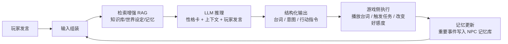

# 游戏AI「学习型AI」全解

> 知识基线：引擎无关的游戏 AI 通用原理；涉及 UE 的实现以[游戏知识/05-AI系统/01-行为树详解.md](../../游戏知识/05-AI系统/01-行为树详解.md)和[UE5.8 行为树与 AI 源码专题](../../游戏知识/12-引擎源码分析/12-行为树与AI源码.md)为交叉验证边界。
> 适用范围：适用于单机/客户端的离线训练与本地推理、服务端 AI 队友/陪练与模型推理、AI/系统策划的数据和安全约束设计，以及跨引擎的 RL/IL/LLM 方案评估；训练环境、上线运行时和平台预算需分别验收。
> 事实边界：算法/架构结论与具体引擎、模型、平台版本分开；PPO、AlphaStar、OpenAI Five、LLM NPC 和 ML-Agents 均是案例/经验或工具链参考，不能外推为通用选型，效果、成本、延迟与安全性需按项目评估并以官方资料核对；伪代码和模型示例为示意。
> 最后更新：2026-08-06（补齐来源、适用范围与事实边界）。
> 参考来源：[Sutton & Barto《Reinforcement Learning: An Introduction》第二版](https://incompleteideas.net/book/the-book-2nd.html)；[Unity ML-Agents 官方仓库](https://github.com/Unity-Technologies/ml-agents)；[Unity ML-Agents Releases](https://github.com/Unity-Technologies/ml-agents/releases)；交叉阅读：[游戏知识/05-AI系统/01-行为树详解.md](../../游戏知识/05-AI系统/01-行为树详解.md)、[游戏知识/12-引擎源码分析/12-行为树与AI源码.md](../../游戏知识/12-引擎源码分析/12-行为树与AI源码.md)。

> 本文讲解"让 AI 从数据中学习"的三大流派：**强化学习（RL，自己试错学）**、**模仿学习（IL，跟人类学）**、**大模型对话（LLM，用语言学/用语言演）**，以及它们在游戏中的落地形态、工程要点与局限性。
>
> 全文为**引擎无关的通用原理与伪代码**。Unity ML-Agents 给出架构级简述；UE 侧 ML 实践仅指路（[游戏知识/05-AI系统](../../游戏知识/05-AI系统/README.md) 与官方文档），不重复撰写。
>
---

## 一、概述

前面两篇（移动、战斗）讲的都是**手写 AI**：程序员把规则、权重、行为树写死。手写 AI 的优点是可控、可调试、可预测；缺点是**设计成本随复杂度爆炸**——一个格斗游戏 AI 要写几百条应对规则，一个 RTS 微操 AI 根本写不完，NPC 对话更是无底洞。

学习型 AI 的思路反过来：**不写行为，写"学习目标"，让算法从数据中自己长出行为**。

三个流派解决三类问题：

1. **强化学习（RL）**：给 AI 一个环境和一个奖励信号，让它自己试错。适合"有明确胜负/分数、规则可模拟"的场景：格斗、RTS 微操、赛车、Boss 陪练。
2. **模仿学习（IL）**：给 AI 人类专家的行为数据（回放/操作序列），让它模仿。适合"规则难写但人类很会玩"的场景：赛车走线、NPC 动画、战斗连招。
3. **大模型对话（LLM）**：给 AI 一个会说话的大脑，让 NPC 能与玩家自由对话、按性格行事。适合"对话与叙事"场景：开放世界 NPC、剧情演出、桌游 DM。

学习型 AI 在工业界的真实地位：**锦上添花多，雪中送炭少**。AlphaStar、OpenAI Five 等公开案例展示了在特定规则、训练环境和资源配置下达到顶尖水平的可能性，但不能据此推断所有商业游戏都适合大规模采用；常见工程形态仍是"传统 AI + 少量学习型增强"。读完本文你应该能判断：什么场景值得上学习型方案，什么场景是花钱买罪受。

---

## 二、核心概念速览

| 概念 | 一句话定义 | 所属流派 | 复杂度 |
| --- | --- | --- | --- |
| MDP（马尔可夫决策过程） | 强化学习的数学框架：状态/动作/转移/奖励五元组 | RL | ★★★ |
| 策略 π | 从状态到动作的映射（AI 的"大脑"） | RL | ★★☆ |
| 奖励（Reward） | 告诉 AI 什么行为好/坏的标量信号 | RL | ★★☆ |
| 回报（Return） | 累计折扣奖励，AI 优化的目标 | RL | ★★★ |
| 值函数 V/Q | 评估"这个状态（+动作）值多少" | RL | ★★★ |
| Q-Learning / DQN | 基于值函数的经典算法 / 用神经网络近似 Q 值 | RL | ★★★ |
| PPO | 常用且通用的策略梯度算法（稳定、支持连续动作） | RL | ★★★★ |
| 行为克隆（BC） | 监督学习式模仿专家行为 | IL | ★★☆ |
| DAgger | 边模仿边让专家纠正错误的迭代式模仿 | IL | ★★★ |
| GAIL / 逆强化学习 | 从专家数据反推奖励函数再学策略 | IL | ★★★★ |
| LLM NPC | 用大语言模型驱动 NPC 对话与行为 | LLM | ★★★ |
| RAG（检索增强） | 对话前从知识库检索相关内容喂给模型 | LLM | ★★☆ |
| 性格卡 / 系统提示 | 固定 NPC 人设与规则约束的提示词 | LLM | ★☆☆ |
| 训练 / 推理 | 离线学出模型参数 / 运行时用模型做决策 | 通用 | ★★☆ |

---

## 三、原理详解

### 3.1 强化学习基础

#### 3.1.1 MDP：RL 的数学舞台

强化学习的问题被形式化为**马尔可夫决策过程（MDP）**：

```
MDP = (S, A, P, R, γ)
  S  状态集合       —— 游戏局面（位置、血量、距离、CD…）
  A  动作集合       —— 可执行操作（移动、攻击、防御…）
  P  状态转移概率   —— 环境如何响应动作（游戏规则）
  R  奖励函数       —— 每个转移获得多少奖励
  γ  折扣因子(0~1) —— 未来奖励打几折（γ 越小越短视）
```

AI 的目标是找到**策略 π(a|s)**——每个状态下选哪个动作——使**期望回报**最大：

```
回报 G_t = r_t + γ·r_{t+1} + γ²·r_{t+2} + …
目标：max E[G_0 | π]
```

三个关键组件：

- **奖励函数**：设计者的"翻译器"。注意"你想要什么 ≠ 你奖励什么"——奖励设错，AI 会钻空子（"奖励刷分"而非"赢"）；
- **折扣因子 γ**：控制短视程度。格斗游戏每招都要算，γ 取 0.9+；追求"下一帧最佳反应"的场景可取低值；
- **回合（Episode）**：游戏天然适合回合制训练——一局打完才结算，正好是一个 episode。

#### 3.1.2 值函数与贝尔曼方程

**值函数**回答"这个局面值多少"：

```
V(s)    = 状态值：从状态 s 出发，按策略 π 能拿到的期望回报
Q(s,a)  = 动作值：在状态 s 先做动作 a，之后按 π，能拿到的期望回报

贝尔曼方程（核心递推）：
V(s) = Σ_a π(a|s) · Σ_s' P(s'|s,a) · [ R(s,a,s') + γ·V(s') ]
```

直觉：**当前状态的价值 = 立即奖励 + 下一状态价值的折扣**。整个强化学习（值函数派）就是反复用这个递推式逼近真实 V/Q。

#### 3.1.3 Q-Learning 与 DQN

**Q-Learning** 是经典无模型算法：用一张 Q 表记录每个 (s,a) 的价值，通过试错更新：

```
Q(s,a) ← Q(s,a) + α · [ r + γ·max_a' Q(s',a') - Q(s,a) ]
```

游戏状态空间巨大（位置连续、血量连续），Q 表存不下 → **DQN（Deep Q-Network，2015，DeepMind 玩 Atari）** 用神经网络近似 Q 函数，并引入两个关键技巧：

- **经验回放（Replay Buffer）**：把经历存起来，随机抽样训练——打破样本相关性；
- **目标网络（Target Network）**：用旧参数的网络算 TD 目标，训练更稳定。

DQN 的问题：只能输出离散动作，且对动作多、奖励稀疏的场景不稳定。

#### 3.1.4 策略梯度与 PPO：常见策略梯度方案（需按项目评估）

策略梯度方法**直接优化策略**（而不是先学价值）：让"带来高回报的动作"概率上升，低回报的下降。**PPO（Proximal Policy Optimization，2017，OpenAI）** 是其中最强壮的变体，核心是**裁剪（Clipping）**：

```
每次更新时：
    ratio = π_new(a|s) / π_old(a|s)              # 新旧策略的动作概率比
    adv   = 优势估计（这个动作比平均好多少）
    loss  = -min(ratio·adv, clip(ratio, 1-ε, 1+ε)·adv)   # 裁剪防止一步更新太猛
```

PPO 在游戏 RL 中常被采用的原因：a) 训练相对稳定（裁剪控制步长）；b) 支持连续动作（直接输出"转向角、速度"）；c) 开源实现成熟（Stable-Baselines3、ML-Agents 内置 PPO）。AlphaStar、OpenAI Five 是使用 PPO 或其变体的公开案例；不能据此概括所有商业 RL 项目，具体算法仍需按环境和评估结果选择。

#### 3.1.5 游戏 RL 的三种应用形态

| 形态 | 做法 | 特点 |
| --- | --- | --- |
| 离线训练 → 导出策略 | 训练出策略网络，运行时只做前向推理 | 运行时开销极小（毫秒级），但策略固定 |
| 在线自学习 | AI 在真实对局中持续学习 | 效果不可控，公平性存疑，极少用于商业 |
| 训练辅助（训练时用） | 用 RL 生成测试数据/调参基准 | 不直接上线，用于验证设计 |

许多商业项目会优先选择第一种：**训练是离线工程，上线的是推理**；是否允许在线学习要结合公平性、回滚、成本和安全要求评估。

### 3.2 Unity ML-Agents 与 UE 的 ML 实践简述

#### 3.2.1 Unity ML-Agents 架构

Unity ML-Agents 是 Unity 生态的开源强化学习/模仿学习工具包，属于常用、代表性的"引擎内训 AI"工具之一。这里不作“最普及”等市场排名判断；版本、Release 与 Package API 应随[官方仓库](https://github.com/Unity-Technologies/ml-agents)及其[官方 Releases](https://github.com/Unity-Technologies/ml-agents/releases) / Package 文档核对。核心组件：

| 组件 | 职责 |
| --- | --- |
| Academy | 训练环境的总调度（重置、步进、控制训练节奏） |
| Agent | 单个 AI 个体：实现 `CollectObservations`（采集状态）、`OnActionReceived`（执行动作）、`OnEpisodeBegin`（回合重置） |
| 观察（Observation） | 状态编码：向量（位置/血量/距离）+ 视觉（渲染画面/传感器图） |
| 动作（Action） | 离散（整数枚举）或连续（浮点向量）输出 |
| 奖励（Reward） | 由 Agent 在关键事件（得分/死亡/到终点）时给出 |
| Trainer（PPO/SAC） | 外部 Python 进程，通过通信与 Unity 环境交互训练 |

标准训练流程：

```
1. 在 Unity 里搭训练场景（简化版战斗/竞速环境 + Agent 脚本 + 奖励埋点）
2. 启动 mlagents-learn 训练（超参数：学习率/批次/裁剪 ε/熵系数）
3. 观察 TensorBoard 曲线（奖励曲线、熵、价值损失）
4. 达标后导出 .onnx 模型 → 运行时用 ONNX Runtime 推理
5. 把推理模型接入正式 AI 逻辑（作为决策器或决策器的一部分）
```

工程要点：

- **课程学习（Curriculum）**：从简单环境开始（1 个敌人），逐步加难（3 个敌人）——收敛速度提升数倍；
- **奖励塑形（Reward Shaping）**：稀疏奖励（赢=+1，输=-1）难学，需要中间奖励（命中=+0.1，被击=-0.1），但塑形要小心"奖励黑客"；
- **多 Agent 并行**：一个场景跑几十个 Agent 同时训练，数据量才够；
- **验证与回归**：训练出的策略必须在**未见过的新关卡**上测试，防止过拟合训练场景。

#### 3.2.2 UE 侧的 ML 实践（指路）

以 UE5.8 为基准，UE5.8 本身未提供本文所需的通用 RL 训练闭环；项目需外部训练框架、插件或自建通信/推理方案，具体能力须按目标版本、插件版本和官方文档核对。常见做法包括：

- **动画侧**：UE5 官方提供 **ML Deformer**（机器学习形变器，用于高精度网格形变/骨骼预测），属于"表现优化"而非决策 AI；
- **决策侧**：接入第三方方案（如通过 UE 插件集成 Python 训练环境、用外部 RL 框架 + 自建通信层），或使用 AI 中间件（如 Inworld AI 等 LLM 角色方案）；
- **通用 AI 框架**：UE 的决策 AI（行为树/EQS/NavMesh）依然是手写体系，详见 [游戏知识/05-AI系统/README.md](../../游戏知识/05-AI系统/README.md)——学习型方法与 UE 的结合点通常是"训练产出模型 → 在 UE 里写一个推理服务/插件节点调用"，这属于工程集成，超出本知识库范围，以官方文档与插件生态为准。

一句话：**Unity 学 RL 入门可评估 ML-Agents，UE5.8 项目需按目标版本选择外部训练/插件方案**——选型时要算清楚工程成本。

### 3.3 模仿学习：不试错，直接学人类

RL 的问题：试错成本高（一局游戏几十分钟）、奖励难设。**模仿学习（Imitation Learning）**换个思路——直接拿人类专家的操作数据来学。

#### 3.3.1 行为克隆（BC，Behavioral Cloning）

最简单的模仿：把专家操作当作监督学习数据，训练"状态 → 动作"的映射：

```
数据：人类玩 1000 局 → 每帧记录 (状态s, 动作a)
训练：分类/回归模型 f(s) ≈ a
```

优点：实现简单，OpenAI 早期 Dota2 模型也先用 BC 热启动。缺点：**分布偏移（Compounding Error）**——专家数据里没有"AI 犯过的错"，AI 一旦偏离专家轨迹就进入未知状态，越错越离谱。

#### 3.3.2 DAgger：边做边纠正

DAgger（Dataset Aggregation）解决分布偏移：AI 边执行边请专家（人类/更强 AI）纠正它的动作，把"纠正数据"不断加回数据集再训练：

```
循环 N 轮：
    用当前策略 π 跑若干局
    每步请专家给出"正确动作" a*
    把 (s, a*) 加入数据集 D
    用 D 重新训练 π
```

#### 3.3.3 GAIL 与逆强化学习

**逆强化学习（IRL）**：从专家数据反推"专家在优化什么奖励"，再用 RL 学。**GAIL（生成对抗模仿学习）**：让"判别器"区分专家行为与 AI 行为，AI 的目标是骗过判别器——不需要显式奖励函数，学出来的行为比 BC 更接近专家"风格"。

#### 3.3.4 游戏中的模仿学习用途

- **赛车 AI**：直接学习人类玩家的最佳走线（比手写路径点自然得多）；
- **格斗/动作 AI**：学习连招与立回习惯，生成"像某个高手"的陪练；
- **NPC 动画**：学习动作捕捉数据之外的"风格化"动作；
- **辅助 RL 热启动**：先用 BC 训出初始策略，再上 RL 微调——公开案例中可见类似组合（如 AlphaStar），实际收益需按项目评估。

### 3.4 LLM 大模型 NPC 对话：让 NPC 会"说话"

#### 3.4.1 与传统对话树的本质区别

传统 NPC 对话 = **对话树/关键词匹配**：写死分支，玩家选一句 NPC 答一句。优点：内容可控、成本低；缺点：只能回答写过的内容，开放问题一律"听不懂"。

LLM NPC = **生成式对话**：NPC 的"大脑"是语言模型，输入上下文，输出自然语言台词与意图。优点：开放问答、人设一致、能理解玩家自由输入；缺点：端到端延迟和费用会随模型、上下文、网络、并发与供应商变化；“数百毫秒到秒级”只能作为部分部署的经验范围，不能当行业固定值；还要面对幻觉（胡说八道）与内容安全。

#### 3.4.2 一个 LLM NPC 的完整管线



关键组件：

- **性格卡（System Prompt / Persona）**：固定提示词定义 NPC 身份（名字、性格、说话风格、知识边界、禁忌）。人设一致性全靠它；
- **上下文窗口管理**：LLM 输入长度有限，历史对话要裁剪/摘要——保留"最近对话 + 长期记忆摘要"；
- **记忆系统**：NPC 要记得玩家（上次帮过忙/骗过它）。做法：重要事件写成结构化记忆（`时间/对象/事件/情感值`），检索时按相关性取回；
- **RAG 检索增强**：把世界观文档、任务数据、物品说明切成片段，玩家提问时检索相关片段拼进提示——既省 token 又减少幻觉；
- **结构化输出**：让模型输出 JSON（`{reply, emotion, action}`），游戏侧解析执行——把"说话"与"做事"连接起来；
- **审核与安全**：输入输出都过敏感词/安全过滤；未成年人场景启用内容限制。

#### 3.4.3 混合架构：规则为骨，LLM 为肉

商业项目的务实做法不是"全 AI 对话"，而是**分层混合**：

```
玩家发言 → 意图分类（小模型/规则，毫秒级）
    ├─ 任务/交易/战斗指令 → 走传统对话树（快、稳、免费）
    └─ 闲聊/开放问题 → 走 LLM（慢、贵、灵活）
```

这样既保住了核心玩法的稳定（任务对话必须 100% 可控），又给 NPC 加了"自由聊天"的惊喜感。斯坦福"生成式 Agent 小镇"（25 个 LLM NPC 自治生活）证明了技术可行性，但直接照搬进商业 MMO 会先被成本劝退。

### 3.5 落地案例与局限

#### 3.5.1 里程碑案例

| 案例 | 方法 | 成果 | 对游戏业的启示 |
| --- | --- | --- | --- |
| AlphaGo（2016） | RL + 蒙特卡洛树搜索 | 击败人类围棋冠军 | 证明 RL 能在"规则清晰"的博弈中超越人类 |
| AlphaStar（2019，公开案例） | PPO + 模仿学习 + 联盟训练 | 星际争霸2 宗师级 | 展示 RTS 级长期规划可行；其训练资源是该案例配置，不能外推为行业成本基线 |
| OpenAI Five（2019，公开案例） | PPO + 大规模分布式训练 | Dota2 击败职业队 | 展示团队配合可学；训练规模与效果受特定规则、环境和资源约束 |
| ML-Agents 官方示例 | PPO | 训练 3D 平衡、足球、格斗小样 | 代表性的引擎内训练工具链案例 |
| 生成式 Agent 小镇（2023） | LLM + 记忆 + 反思 | 25 个 NPC 自治社交 | 证明 LLM NPC 的"生活感"可行，成本与延迟是门槛 |
| 商业陪练/难度适配 | RL/IL 混合 | 格斗、赛车、FPS 的 AI 陪练 | "离线训练 + 在线推理"是一种常见商业落地形态 |

#### 3.5.2 学习型 AI 的六条局限

1. **不可解释性**：神经网络策略是黑盒。玩家投诉"Boss 怎么突然这么强"，你无法像行为树那样指出是哪条规则的问题——这是商业项目最大的心理障碍；
2. **确定性与公平性**：RL 策略含随机性，同一局面可能打出不同操作。对战游戏需要确定性（回放一致、反作弊），而确定性恰恰是学习型模型不擅长的（详见 [04-服务端AI与性能.md](04-服务端AI与性能.md) 的确定性章节）；
3. **训练成本**：AlphaStar 级训练在公开案例中属于大规模投入；“8 卡跑几天”只能作为某些项目的经验量级，实际成本会随环境步速、模型、并行度、硬件与评估目标变化，必须按项目实测和预算核算；
4. **泛化能力**：训练场景与正式关卡只要略有差异（新地图、新技能），策略可能断崖式变蠢。需要大量"域随机化"与验证；
5. **调试地狱**：训练不收敛时，问题可能在奖励函数、超参数、状态编码、环境 Bug 的任意一处——排错周期以天计；
6. **内容安全**：LLM NPC 可能说出违禁内容、剧透剧情、教唆行为。上线前必须有过滤与应急兜底（规则回复）。

#### 3.5.3 学习型 AI 在商业游戏里的"正确姿势"

- **难度自适应陪练**：离线训练多个强度档位的 AI 模型，玩家按段位匹配——一种常见的商业落地形式（格斗/赛车/FPS 的"电脑对手"）；
- **动作/动画增强**：用 ML 生成自然过渡动画（如 UE5 ML Deformer），提升表现不碰决策；
- **NPC 对话增强**：混合架构（规则核心 + LLM 闲聊），控制成本与风险；
- **辅助内容生成**：用 LLM 生成任务文本、NPC 台词初稿，人工审核后入库——把 AI 当"实习生"而不是"主演"；
- **数据分析**：用 RL 探索关卡设计空间（AI 能否通关、哪里卡关），指导关卡调优。

一句话：**学习型 AI 最适合"环境可模拟、目标可量化、错误可接受"的场景；最不适合"要背锅"的场景**（核心玩法稳定性、竞技公平性、内容安全）。

---

## 四、伪代码与通用实现示例

### 4.1 MDP 形式化与奖励定义（以格斗 AI 为例）

```
# 状态 S：距离、双方血量、体力、帧数、技能CD、位置坐标（归一化）
s = [dist/10, my_hp, foe_hp, my_stamina, foe_stamina, frame%60]

# 动作 A：离散技能表
A = [轻拳, 重拳, 踢, 前冲, 后撤, 防御, 跳跃, 必杀]

# 奖励 R（稀疏 + 塑形混合）：
def reward(prev, cur):
    r = 0
    if cur.foe_hp < prev.foe_hp:  r += 1.0          # 命中
    if cur.my_hp < prev.my_hp:    r -= 1.2          # 被打
    if 回合结束 and cur.my_hp > 0: r += 10          # 胜利
    if 回合结束 and cur.my_hp <= 0: r -= 10         # 失败
    r -= 0.01 * 被动挨打帧数                          # 鼓励进攻（塑形，注意别过量）
    return r
```

### 4.2 Q-Learning 伪代码（教学级）

```
def q_learning(env, alpha=0.1, gamma=0.95, epsilon=0.1, episodes=10000):
    Q = 全零表                       # 状态×动作
    for ep in range(episodes):
        s = env.reset()
        while not env.done():
            a = epsilon_greedy(Q[s], epsilon)     # ε-greedy 探索
            s2, r = env.step(a)
            Q[s][a] += alpha * (r + gamma * max(Q[s2]) - Q[s][a])
            s = s2
    return Q                          # 上线时：argmax_a Q[s]
```

### 4.3 PPO 伪代码（概念级，以 ML-Agents/Stable-Baselines3 为参照）

```
def ppo_train(env, policy_net, value_net, epochs=3, clip_eps=0.2):
    buf = 采样N步(env, policy_net)              # 跑若干局收集 (s,a,r,s')
    for k in range(epochs):
        for batch in buf:
            adv  = gae(batch)                    # 优势估计（GAE）
            ratio = policy_net.prob(batch.a) / batch.old_prob
            loss_p = -mean(min(ratio*adv, clip(ratio, 1-clip_eps, 1+clip_eps)*adv))
            loss_v = mse(value_net(batch.s), batch.return)
            梯度更新(policy_net, loss_p - c1*loss_v + c2*熵奖励)
    return policy_net
```

### 4.4 行为克隆（BC）伪代码

```
def behavioral_cloning(expert_replays):
    # expert_replays: 人类操作记录 [(s0,a0), (s1,a1), …] × 多局
    X, y = [], []
    for replay in expert_replays:
        for s, a in replay:
            X.append(featurize(s))       # 状态特征化（归一化）
            y.append(a_index)            # 动作标签
    model = 训练分类器(X, y)              # 交叉熵损失即可
    return model
```

### 4.5 LLM NPC 对话管线伪代码

```
def npc_respond(npc, player_input, game_state):
    persona = load_persona(npc.id)                     # 性格卡
    memory = retrieve_memory(npc.id, player_input)     # 记忆检索（向量相似度）
    docs = rag_retrieve(世界知识库, player_input)       # RAG 检索
    prompt = build_prompt(persona, memory, docs,
                          game_state, player_input)
    result = llm.chat(prompt, response_format="json")
    reply, emotion, action = parse_json(result)
    if not safety_check(reply):
        reply = 兜底台词(npc)                          # 安全过滤
    commit_memory(npc.id, player_input, reply)        # 记忆落库
    execute_action(action)                             # 触发游戏行为
    return reply

---

## 五、选型对比

### 5.1 手写 AI vs 学习型 AI

| 维度 | 手写 AI（行为树/规则） | 学习型 AI（RL/IL/LLM） |
| --- | --- | --- |
| 行为可控性 | 完全可控 | 黑盒（不可逐条解释） |
| 开发成本 | 复杂度高时爆炸 | 训练/数据/调参成本高 |
| 表现上限 | 受限于设计者想象力 | 可超越人类设计 |
| 调试 | 可视化、可单步 | 排错周期以天计 |
| 确定性 | 完全确定 | 随机（需固定种子） |
| 运行开销 | 微秒级 | 小模型前向推理常见毫秒级但需按硬件实测；LLM 可能为数百毫秒、秒级或更高 |
| 适用 | 核心玩法、竞技、需要背锅的场景 | 陪练、表现增强、对话、探索性玩法 |

### 5.2 RL / IL / LLM 三流派选型

| 维度 | 强化学习 RL | 模仿学习 IL | 大模型 LLM |
| --- | --- | --- | --- |
| 学习信号 | 奖励（自己试错） | 专家数据（别人示范） | 语料（预训练知识） |
| 擅长 | 决策/操作（格斗、RTS、竞速） | 风格化行为（走线、连招、动画） | 语言/叙事（对话、任务、演出） |
| 需要环境模拟 | 必须（可加速/并行） | 不需要（只要有数据） | 不需要 |
| 训练成本 | 极高 | 中 | 无（用现成模型）/ 微调高 |
| 运行成本 | 低（推理） | 低（推理） | 高（每轮对话按 token 计费） |
| 主要风险 | 奖励黑客/不收敛/泛化差 | 数据质量/分布偏移 | 幻觉/延迟/安全/成本 |
| 上手工具 | ML-Agents、Stable-Baselines3 | 同上 + 数据管线 | 各 LLM API + 提示工程 |

### 5.3 部署形态选型

| 形态 | 延迟 | 成本 | 可控性 | 适用 |
| --- | --- | --- | --- | --- |
| 客户端推理（小模型） | 毫秒级 | 低 | 中 | 单机陪练、动画 |
| 服务端推理（中模型） | 十毫秒级 | 中 | 中高 | 联机陪练、AI 队友 |
| 云端 LLM API | 可能为数百毫秒至秒级或更高（依模型/网络实测） | 高 | 低 | NPC 对话（需评估可接受延迟） |
| 混合（规则+模型） | 分级 | 分级 | 高 | 商业项目标配 |

---

## 六、最佳实践

1. **先有基线再上学习型**：先用手写 AI 做出可玩的版本，学习型方案负责"超越基线"——没有基线，你连"学得好不好"都无法判断；
2. **奖励设计从稀疏开始**：先只给"赢/输"奖励验证能学，再加塑形；塑形奖励要逐条审查，防止奖励黑客（刷分、绕圈、自伤）；
3. **域随机化**：训练环境随机化（地图、对手强度、初始状态），防止过拟合单一场景；
4. **固定种子做回归**：训练与推理都要固定随机种子，保证可复现——"昨天还能赢今天突然变蠢"必须有排查路径；
5. **课程学习**：难度从易到难分阶段训练，每阶段冻结评估，比一锅炖快数倍；
6. **RL 训练必须可视化监控**：奖励曲线、熵、价值损失、每 episode 长度四张图常看，收敛异常早发现；
7. **推理侧做安全网**：模型输出异常（Q 值全 0、动作越界）时回退手写 AI，禁止把异常输出直接喂给游戏；
8. **LLM 永远分层**：核心玩法（任务、交易）走规则/对话树，LLM 只负责闲聊与表现层；内容安全过滤必须有；
9. **记忆与上下文裁剪**：LLM NPC 的历史对话定期摘要，控制 token 成本；长期记忆用结构化事件存储；
10. **数据合规**：模仿学习用的玩家数据、LLM 对话数据都要走隐私合规流程（脱敏、告知、删除权）；
11. **评估集独立**：训练集/验证集/玩家盲测分开，防止"训练场景里天下无敌，正式关卡里智商为零"；
12. **算好总账**：训练卡时成本 + 推理成本 + 维护成本，与"手写 AI 外包给策划配表"的成本对比，很多项目算完就清醒了。

---

## 七、常见问题 FAQ

**Q1：RL 训练不收敛/奖励曲线一直上不去，先查什么？**
按顺序：a) 环境 Bug（状态没更新/动作没生效/奖励重复发放）——先用"随机策略跑 100 局"验证环境自洽；b) 奖励太稀疏——先试稀疏奖励能否学到局部进展；c) 状态编码问题（没归一化、信息缺失）；d) 超参数（学习率太高/太低、批次太小）；e) 最后才怀疑算法本身。80% 的问题是环境 Bug。

**Q2：训练好的 AI 在新关卡里突然变蠢？**
泛化失败。解法：a) 域随机化（训练时随机地图/对手/初始条件）；b) 评估集必须包含未见过关卡；c) 降低状态编码对场景细节的依赖（用相对位置而不是绝对坐标）；d) 不行就多档模型 + 场景匹配。

**Q3：奖励黑客是什么？我该怎么防？**
AI 找到了"你奖励函数的漏洞"而不是"你真正想要的行为"：比如"命中奖励"导致 AI 打空气蹭奖励、"到达奖励"导致绕圈刷分。防法：a) 奖励只给"结果"不给"过程"；b) 每加一条奖励做"黑客测试"（让 AI 训练后检查是否钻空子）；c) 用逆强化学习反推真实目标。

**Q4：LLM NPC 会乱说话/剧透/教唆，怎么控？**
四道防线：a) 性格卡与知识边界写死（"你是新手村铁匠，不知道主线剧情"）；b) RAG 只检索允许的知识库，剧情内容不进库；c) 输出过滤（敏感词/安全分类器）；d) 兜底：触发敏感时返回预设台词。上线前做"攻击测试"（恶意输入清单）。

**Q5：项目实测 LLM 对话 P95 约 2 秒，玩家体验很差怎么办？**
分层：a) 意图分类先行（毫秒级），简单问答走规则库；b) 流式输出（打字机效果）让玩家感觉快；c) 异步化（NPC 先说一句缓冲台词，LLM 结果到了再补充）；d) 缓存高频问答；e) 接受"深度对话有延迟"，把 LLM 用在非实时场景（信件、日记、回想）。

**Q6：能不能让 RL 直接控制 Boss，做出无敌的 Boss？**
技术上可以，商业上强烈不建议：a) RL 策略不可解释，无法调"难度"；b) 玩家投诉无法定位问题；c) 训练出的"最优"往往无聊（龟缩、无限风筝）。正确姿势：RL 产出的策略当"陪练/测试基准"，正式 Boss 仍用手写模式化设计（见 [02-战斗与Boss设计.md](02-战斗与Boss设计.md)）。

**Q7：模仿学习需要多少数据？**
取决于任务复杂度：简单走线 10~50 局够用；格斗连招策略需要数百局；要"风格像某高手"需要上千局 + 数据清洗（去掉挂机/失误局）。数据质量 >> 数据量：一段人类失误操作会教坏模型。

**Q8：训练和正式游戏状态空间不一样怎么办？**
训练环境与正式环境必须"同构"：a) 状态特征只用两者共有的信息（统一坐标系/归一化）；b) 正式版本的物理参数（速度、伤害）变更后必须重训/验证；c) 做"训练-发布"自动化管线，版本号对齐，防止线上跑旧模型。

**Q9：ML-Agents 训练好的模型怎么接到正式玩法里？**
导出 ONNX → 运行时 ONNX Runtime 推理（延迟需按目标硬件实测）→ 输出作为决策器的一路输入（可与其他规则投票）。注意：a) 推理输入张量顺序必须与训练时一致；b) 做输入越界保护；c) 模型版本管理。UE5.8 本身未提供本文所需的通用 RL 训练闭环，需按目标版本自建插件或接入外部中间件（见 3.2.2）。

**Q10：老板问"我们项目要不要上 AI 大模型 NPC"，怎么回答？**
先问三个问题：a) 我们的核心玩法需要自由对话吗？（不需要 → 别上）；b) 玩家会高频对话吗？预算扛得住 token 费吗？（扛不住 → 混合架构）；c) 内容安全团队/流程有吗？（没有 → 先补流程）。LLM 是"体验放大器"，不是"玩法替代品"——把预算花在核心玩法上通常回报更高。

---

## 八、关联阅读

- 本目录：[02-战斗与Boss设计.md](02-战斗与Boss设计.md) —— 学习型 AI 增强战斗的落点（陪练、难度自适应）；
- 本目录：[04-服务端AI与性能.md](04-服务端AI与性能.md) —— 学习型 AI 上服务端的推理延迟/确定性/成本问题；
- 决策层：[游戏AI/01-决策与架构](../01-决策与架构/README.md) —— 手写决策技术是"基线"，学习型方案与它们组合而非替代；
- UE 侧：[游戏知识/05-AI系统/README.md](../../游戏知识/05-AI系统/README.md) —— UE 的 AI 体系为手写式，ML 决策集成需自建；
- 经典资料：Sutton & Barto《Reinforcement Learning: An Introduction》(2nd ed.)；PPO 论文 (Schulman et al., 2017)；DQN 论文 (Mnih et al., 2015)；[Unity ML-Agents 官方仓库](https://github.com/Unity-Technologies/ml-agents)（版本随官方 Release/Package 文档核对）；《Generative Agents: Interactive Simulacra of Human Behavior》(2023)。

> 一句话总结：**RL 让 AI 学会打，IL 让 AI 学会像人一样打，LLM 让 AI 学会说**——但商业游戏里，它们都是"增强件"，不是"发动机"。
```
