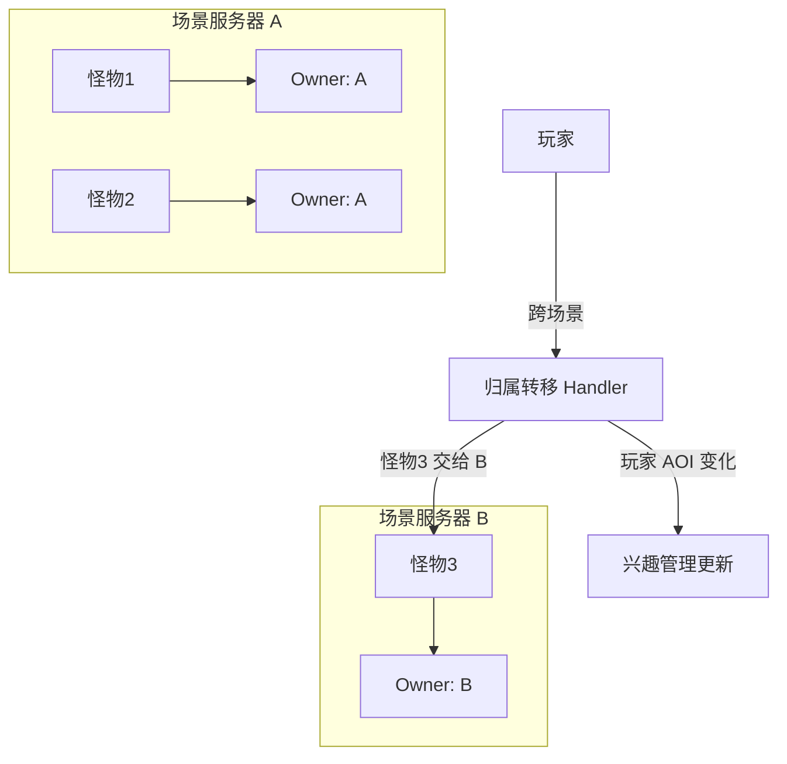
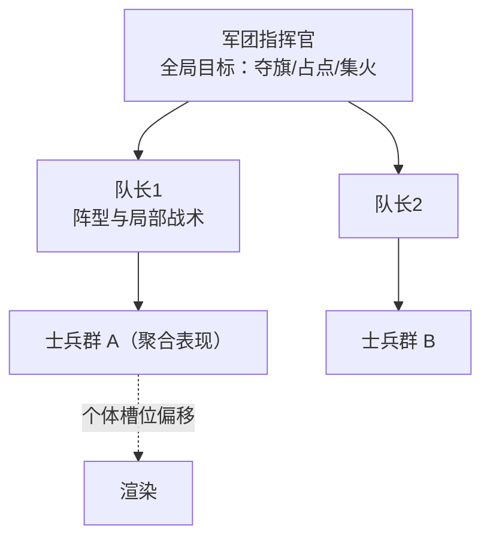

# 游戏AI「服务端AI与性能」全解

> 本文讲解**多人在线游戏（MMO/大世界/大规模对战）中服务端 AI 的工程问题**：AI 归谁管（分布与归属）、预算怎么分（降频与 LOD）、如何保证可复现（确定性与回放）、怎么调试（可视化/日志/统计）、以及万人规模下 AI 的架构（军团与聚合）。
>
> 全文为**引擎无关的通用原理与伪代码**。UE 侧 AI 框架（行为树/EQS/NavMesh）为客户端导向，服务端 AI 架构多为自研，相关指路见 [游戏知识/05-AI系统/README.md](../../游戏知识/05-AI系统/README.md)。

---

## 一、概述

单机游戏的 AI 只需要对自己负责：一个 Boss、几十个怪物，随便怎么跑。但服务端 AI 面对的是**乘法问题**：10 万人同时在线的世界里可能有 100 万只怪物、10 万场战斗、上万个军团。服务器不能每帧完整决策每个 AI——那需要几个数据中心的算力。

服务端 AI 的核心矛盾：**AI 数量与 AI 质量不可兼得，必须在"玩家看得见的地方"分配算力**。所有服务端 AI 技术都是围绕这个矛盾展开的：

1. **归属**：AI 由哪台服务器、哪个进程、哪个逻辑单元负责，玩家进出时如何交接；
2. **预算**：每帧/每秒给 AI 多少钱（CPU 时间），按重要性分给谁；
3. **确定性**：同样的输入必须产生同样的结果——这是回放、观战、反作弊的根基；
4. **调试**：AI 跑在服务器上，玩家看不见，你必须能"看见"它；
5. **规模化**：从"一千个怪"到"一万个兵"，架构必须换打法（聚合、流场、分层）。

本文按"架构 → 预算 → 确定性 → 调试 → 规模化"的顺序展开。读完你会得到一张完整的服务端 AI 工程地图，并理解为什么"服务器 AI 的第一原则是别跑不必要的 AI"。

---

## 二、核心概念速览

| 概念 | 一句话定义 | 典型用途 | 复杂度 |
| --- | --- | --- | --- |
| AI 归属（Ownership） | 确定每个 AI 由哪个服务器实体负责更新 | MMO 分线/分场景 | ★★★ |
| AOI / 兴趣管理 | 只更新/同步"玩家附近"的 AI | 所有 MMO | ★★★ |
| 分帧（Staggered Tick） | 把 N 个 AI 的更新摊到 N 帧执行 | 预算控制 | ★★☆ |
| 距离 LOD | 按与玩家距离降级 AI 更新频率与决策复杂度 | 大世界怪物 | ★★☆ |
| AI 预算（Budget） | 每帧分配给 AI 的 CPU 时间上限 | 性能保障 | ★★★ |
| 确定性（Determinism） | 相同输入 → 相同输出，可复现 | 回放、观战、反作弊 | ★★★★ |
| 固定时间步 | 逻辑用固定 dt 推进，与帧率解耦 | 确定性基础 | ★★☆ |
| 回放（Replay） | 记录初始状态+输入，重放还原整场战斗 | 观战、查证、客服 | ★★★ |
| Lockstep | 所有客户端同步执行相同输入序列 | RTS 对战 | ★★★★ |
| 军团 AI（Squad/Army AI） | 以"队伍/军团"为单位的聚合决策 | 万人团战 | ★★★★ |
| 流场（Flow Field） | 网格化的群体移动方向场 | 军团移动 | ★★★ |
| 调试可视化 | 服务器决策过程的可视化/日志/统计 | 线上排查 | ★★☆ |

---

## 三、原理详解

### 3.1 MMO/服务器 AI 架构：AI 分布与归属

#### 3.1.1 谁在跑 AI：权威模型

多人在线游戏里"怪物打谁、掉多少血"必须由**一个权威方**裁决，否则每个客户端各算各的，结果必然不一致。主流是**服务端权威**：

| 层 | 职责 | 频率 | 示例 |
| --- | --- | --- | --- |
| 服务端（权威） | AI 决策、伤害结算、状态变更 | 10~30 Hz（逻辑帧） | 仇恨、技能、掉落 |
| 客户端（表现） | 位置插值、动画、特效、预测 | 渲染帧 60+ Hz | 走路、施法演出 |
| 客户端（预测） | 玩家自己的操作本地先行（可选） | 每帧 | 移动预测、技能命中预测 |

服务端跑 AI 的代价是明显的（所有 Agent 都要在服务器上决策），好处是决定性的：**公平（外挂难改）、一致（所有玩家看到同一结果）、可回放**。少数玩法（纯休闲、单机带联机）允许客户端 AI + 服务端验算，但战斗类游戏基本都是服务端权威。

#### 3.1.2 AI 归属：谁管这只怪

世界被切成多个"区域/场景/分线"，每个区域由一个**场景进程（Zone Server）**负责。AI 归属规则：



归属的关键规则：

- **一怪一主**：任何时刻一个 AI 只能有一个权威 Owner，避免两个进程同时改同一只怪；
- **归属随场景**：怪物属于它所在的场景进程；玩家跨场景时，怪物留在原场景；
- **归属可转移**：特殊玩法（Boss 拉脱战跑到另一个区域、军团跨服战）需要"所有权转移协议"（冻结 → 序列化状态 → 新 Owner 接管 → 解冻）；
- **归属与 AOI 解耦**：AI 的"归属"（谁算）与"同步"（谁看）是两回事——玩家能看到远处 AI 的位置（同步），但只有 AOI 内的 AI 才做完整决策（计算）。

#### 3.1.3 兴趣管理（AOI）：看不见的 AI 不 tick

AOI（Area of Interest）是服务端 AI 性能的第一道闸门：**玩家感知不到的 AI，不做完整决策**。实现方式：

- **九宫格/网格 AOI**：以玩家为中心取周围 N×N 格子内的实体进"兴趣集"；
- **十字链表/四叉树**：经典 AOI 数据结构，支持高效的范围查询；
- **广播与订阅**：兴趣集决定哪些 AI 的状态变更要推送给哪些客户端。

典型分级（以玩家为中心）：

```
0~50m    —— 完整 AI：行为树决策 + 技能 + 仇恨 + 同步
50~150m  —— 简化 AI：状态机/降频决策 + 位置同步
150m~    —— 冻结 AI：不决策，只定时同步位置（或完全不同步）
```

AOI 做得好，百万实体的大世界在线服务器只需要对每个玩家周围几十个实体做完整计算——这就是"百万怪物的世界"实际可行的原因。

#### 3.1.4 客户端表现与服务器预测

服务器 AI 是低频权威，客户端要"补帧"：怪物移动用**位置插值**（服务器 10Hz 位置 → 客户端 60Hz 平滑）、施法前摇用**本地预测**（服务器确认前先播动画）。这本质上是 [01-移动与群组行为.md](01-移动与群组行为.md) 表现层原理在联机场景的应用——决策在服务器，表现交给客户端。

### 3.2 AI 预算与降频：把毫秒花在刀刃上

#### 3.2.1 预算模型

服务端每个逻辑帧（如 20Hz，即 50ms/帧）有总 CPU 预算，AI 分到其中一块（如 2~5ms）。预算管理的基本盘：

```
每帧：
    总预算 = 5ms
    AI 分配 = 按优先级排队：战斗中 > 玩家附近 > 巡逻中 > 远处
    跑完预算即停，超时者顺延到下一帧
```

预算用尽时"谁被牺牲"要提前定好规则——通常牺牲顺序是：远处巡逻 AI 的决策、非战斗状态更新、装饰性行为。

#### 3.2.2 分帧（Staggered Tick）：把 1000 个 AI 摊到 100 帧

最基础的降频手段：不是每帧更新所有 AI，而是把 AI 分组，轮流更新：

```
AI.tick_interval = 3 帧（即每秒约 7 次决策，20Hz 逻辑下）
每帧只更新 (frame_index % interval == 0) 的 AI
```

- 1000 个 AI 每帧全更新 → 1000 次决策/帧；
- 分帧后 interval=5 → 200 次决策/帧，肉眼无差别；
- 配合**相位抖动**（每组的起始帧错开），避免"同帧全动、下帧全停"的群体卡顿感。

#### 3.2.3 距离 LOD：决策分级

按与最近玩家的距离，AI 走不同"档位"：

| 档位 | 距离 | 决策频率 | 决策复杂度 | 表现 |
| --- | --- | --- | --- | --- |
| LOD0（完整） | < 40m | 每帧~每 2 帧 | 行为树/完整仇恨+技能 | 精细 |
| LOD1（简化） | 40~120m | 每 5~10 帧 | 状态机 + 简化移动 | 可接受 |
| LOD2（低保真） | 120~300m | 每秒 1~2 次 | 只更新位置/朝向 | 粗略 |
| LOD3（冻结） | > 300m 或无玩家 | 不更新 | 无（仅响应事件） | 无 |

要点：

- **LOD 切换要平滑**：从 LOD0 降到 LOD1 时，不能出现"怪物突然瞬移"——切换时保持位置连续，只降决策频率；
- **事件唤醒**：冻结的 AI 也要能响应事件（被 AOE 蹭到、玩家走近），实现方式是"AOI 进入事件 + 仇恨事件"驱动唤醒；
- **LOD 与玩法解耦**：Boss/任务怪永远 LOD0（不管多远），普通野怪才享受 LOD——规则要可配置。

#### 3.2.4 优先级调度

比"平均分"更好的做法是按**重要性**分配：战斗中 AI > 玩家视野内巡逻 AI > 全图背景 AI。实现为一个按优先级排序的可执行队列：

```
每帧：
    从高到低遍历优先级队列，执行 AI 更新
    累积耗时 > 预算 → 停止，剩余 AI 顺延
    顺延惩罚：连续被顺延的 AI 提升优先级（防饿死）
```

#### 3.2.5 聚合决策与简化决策

- **聚合决策**：同一种类的 20 只野怪共享"组决策"（组长做选择，成员只做移动表现），决策成本从 20 次降到 1 次 + 19 次廉价跟随；
- **简化决策**：LOD1 的怪从行为树切到状态机（巡逻/追击/攻击三态），决策成本降低一个数量级；
- **事件驱动**：把"每帧轮询"改成"事件触发"——冷却好了再检查技能（定时器），目标进入范围再唤醒（AOI 事件），大部分 AI 大部分时间无事可做。

#### 3.2.6 预算的测量与告警

预算不是拍脑袋：每个 AI 系统上报自己的耗时（决策/移动/寻路/同步分开统计），聚合到监控面板。出现"某场景 AI 超预算"要能告警并自动降级（全体 AI 降一档 LOD），而不是让服务器卡死。

### 3.3 确定性 AI 与回放

#### 3.3.1 为什么要确定性

**确定性（Determinism）**：给定相同的初始状态与输入序列，AI 行为完全一致。用途：

1. **回放（Replay）**：观战、客服查证、比赛复盘——只需要记录"初始状态 + 输入流"，重放即可还原整场战斗；
2. **跨服一致**：同一副本在不同服务器/不同时间运行，结果可复现（活动排名公平）；
3. **反作弊**：服务器可以复算客户端上报的"AI 行为"验证合法性（对 AI 本身反作弊意义有限，但对伤害/掉落结算有意义）；
4. **测试**：确定性让"AI 行为回归测试"成为可能——改了一行代码，跑同一输入，对比输出差异。

#### 3.3.2 破坏确定性的七个元凶

| 元凶 | 例子 | 对策 |
| --- | --- | --- |
| 随机数未播种 | 每次启动 rand() 序列不同 | 全局确定性 RNG（种子随战斗/世界初始化） |
| 浮点跨平台 | x86 与 ARM 的 float 运算尾数不同 | 用定点数或统一编译/统一平台；禁止跨平台比较 |
| 帧率依赖 | 60FPS 与 30FPS 下 dt 不同 | 固定逻辑时间步（如 50ms），物理/移动按步推进 |
| 容器遍历顺序 | 哈希表遍历顺序不稳定 | 用有序容器或先排序再遍历 |
| 真实时间 | 用 wall-clock 计时 | 用逻辑时间（帧计数）代替 |
| 并发/多线程 | 决策结果依赖线程调度 | 单线程逻辑更新或确定性并行（无共享可变状态） |
| 外部查询 | 网络延迟、数据库结果影响决策 | 决策输入全部本地化/缓存 |

#### 3.3.3 确定性 RNG

游戏 AI 到处用随机（暴击、技能变化、巡逻偏移），必须用**确定性伪随机**：

```
战斗随机数：seed = hash(战斗ID, 服务器启动种子)
每次取随机：seed = LCG(seed)  → 返回结果
```

这样同一场战斗（同 seed）在任何重放中产生完全相同的随机序列。注意区分"表现随机"（特效抖动，可随意）与"逻辑随机"（伤害、决策，必须确定性）。

#### 3.3.4 回放系统的构成

```
记录（在线时）：
    初始世界状态（玩家属性、AI 表、种子）
    输入流（玩家操作、时间戳、事件）
重放（离线时）：
    加载初始状态 → 按输入流推进固定时间步 → 完整还原
    在重放中挂接调试器（查看任何 AI 的决策过程）
```

回放的价值远超"观战"：它是**线上问题排查的时光机**——玩家报"Boss 卡在墙里了"，拿到他的战斗回放，在本地把整个服务器 AI 决策过程重放一遍，加断点、看变量，问题定位从"猜"变成"看"。

#### 3.3.5 Lockstep 与状态同步（AI 视角）

对战游戏的两大同步模型对 AI 的影响：

| 模型 | 原理 | AI 在哪跑 | 特点 |
| --- | --- | --- | --- |
| Lockstep | 所有客户端执行相同输入序列，帧同步推进 | 每个客户端跑**同一份确定性 AI** | 带宽极小；对确定性要求极高；AI 必须完全一致（否则分叉） |
| 状态同步（State Sync） | 服务器跑权威逻辑，广播状态 | 服务器跑 AI，客户端表现 | 服务器负担重；客户端可自由表现；AI 只需要服务器确定性 |

RTS（星际、帝国时代）用 Lockstep：AI 在每个客户端都跑，任何非确定性（浮点、随机、遍历顺序）都会导致"不同步"掉线。MMO 用状态同步：AI 只跑服务器，客户端不需要确定性，但要解决表现插值。

#### 3.3.6 确定性的代价

确定性不是免费的：

- **性能**：所有 AI 必须完整跑（回放不能跳过"反正没人看的 AI"），降频 LOD 会改变结果——所以**回放模式下禁止 LOD 裁剪**，或把 LOD 决策也做成确定性的（按固定规则降级）；
- **工程约束**：全局变量、多线程、真实时间都是敌人，团队要建立"确定性纪律"（代码规范 + CI 回归测试）；
- **权衡**：很多 MMO 只对"战斗结算"做确定性（伤害、掉落），世界 AI 不追求完全确定性——回放只还原战斗。**确定性的范围要按需求裁剪**。

### 3.4 AI 调试：看不见的 AI 也要"看得见"

单机 AI 调试很简单：打开编辑器，P 键运行，断点打在行为树节点上。服务端 AI 的调试难在**你看不见它**——AI 跑在机房，玩家报的问题发生在三小时前。服务端 AI 调试三件套：**可视化、日志、统计**。

#### 3.4.1 可视化（Debug Visualization）

- **服务端快照**：定期把服务器世界状态（AI 位置、目标、仇恨值、技能状态）导出为快照，用工具离线渲染成"上帝视角"动画——回放式的可视化；
- **在线调试视图**：开一个"调试 GM 视角"，GM 工具直接订阅指定 AI 的状态流（位置、当前决策、仇恨表），在客户端以调试绘制（线条/图标/文字）叠加显示；
- **决策树可视化**：行为树/状态机节点实时高亮（当前执行路径），与 [01-决策与架构](../01-决策与架构/README.md) 的单机调试器同构，只是数据走网络；
- **热更新开关**：调试期间动态开启"所有 AI 显示仇恨线"之类的开关，无需重启服务器。

#### 3.4.2 日志（结构化决策日志）

日志是"事后诸葛"的主力。要点：

```
[12:33:01.204] [AI:Monster_8821] 决策=切换目标
  原因=OT（威胁值 1520 > 坦克 1380 × 110%）
  旧目标=玩家A(坦克) 新目标=玩家B(输出) 距离=8.3m
  [仇恨表] A:1380 B:1520 C:210 …
```

工程要求：

- **结构化**：JSON/键值对格式，字段可查询（按 AI ID、时间、类型过滤），不要写给人看的散文日志；
- **采样与限流**：全量日志会淹没磁盘——只记录"决策变更"（而不是每帧状态）、异常（寻路失败、仇恨表空）与玩家举报时段的全量上下文；
- **可追溯**：日志带"战斗 ID/场景实例 ID"，与回放数据关联——一条日志可以直接跳到回放对应时刻；
- **决策理由**：AI 的每次"关键决策"要记录理由（选了哪个技能、为什么），这是排查"AI 为什么犯蠢"的钥匙。

#### 3.4.3 统计（Metrics）

统计回答"整体健康度"，不回答"单个问题"：

| 指标 | 意义 | 告警阈值示例 |
| --- | --- | --- |
| AI 决策耗时（P50/P99） | 决策系统是否超预算 | P99 > 预算 80% 告警 |
| 每场景 AI 数量分布 | 热点区域发现 | 单场景 AI > 容量 70% |
| LOD 降级比例 | 是否频繁降级（体验风险） | 战斗中 AI 被降级 > 5% |
| 寻路失败率 | 地图/导航数据问题 | > 1% 告警 |
| 卡死 AI 数（速度≈0 超时） | 移动系统健康 | 持续 > 10 只 |
| 仇恨切换频率 | 战斗逻辑异常 | 单怪 1 秒内切换 > 3 次 |

#### 3.4.4 线上问题定位流程

```
玩家举报/监控告警
  → 拉取该战斗的回放 + 结构化日志（按战斗ID）
  → 本地重放 + 决策树断点 → 定位根因
  → 修复 → 用同一回放做回归验证（确定性红利）
```

这条流程能成立的前提是 3.3 的确定性基建——**没有回放，服务端 AI 的线上问题排查就是大海捞针**。

### 3.5 大规模 AI：万人团战与军团

当同屏/同场景 AI 达到数千到数万（国战、军团战、尸潮玩法），逐 Agent 架构失效，必须换打法。

#### 3.5.1 聚合单位：以"军团"为决策单元

核心思想：**玩家看到的是"一万个兵"，服务器决策的是"几十个军团"**。

```
军团 = 聚合体
    军团级状态：位置、朝向、阵型、士气、目标
    个体兵：只保留渲染表现（客户端）+ 服务器上的"影子"（位置偏移）
军团决策（低频，如 2Hz）：选目标、定阵型、发指令
个体兵行为：跟随军团指令的廉价执行（槽位跟随，见 01 文档）
```

收益：决策成本从 O(士兵数) 降到 O(军团数)；同步成本同理（只同步军团状态 + 个体偏移参数，客户端本地生成个体位置）。

#### 3.5.2 分层指挥树

大规模战斗用"指挥官 → 队长 → 士兵"三层：



指挥官低频决策（目标与战术），队长中频（阵型微调、局部绕行），士兵零决策（表现）。这与 [01-移动与群组行为.md](01-移动与群组行为.md) 的"Leader + 编队"完全同构，只是规模放大。

#### 3.5.3 军团移动：流场

几千个士兵逐 A* 寻路必死。军团移动标配**流场**（见 01 文档 3.5.3）：地图网格化，每个格子预计算"到目标的方向"，士兵查表移动，成本与格子数相关、与士兵数无关。军团战地图在开战前烘焙流场，战斗中目标变化时分帧重算。

#### 3.5.4 空间查询与碰撞

- 万级单位的邻居查询必须用空间哈希/四叉树（O(n) 而非 O(n²)）；
- 服务器上的军团士兵通常**不做碰撞**（只做"不重叠"的软约束/偏移），碰撞只在客户端表现层；
- 军团间的"接触判定"用军团包围盒 + 格子粗查，命中后再细化。

#### 3.5.5 战斗结算聚合

万人大战如果每个士兵逐帧算攻击，服务器会炸。聚合打法：

```
军团接触后：
    1. 计算"接触强度"（双方军团兵力 × 士气 × 加成）
    2. 按固定时间步（如 1 秒）结算一次"群体伤害"
    3. 伤害按比例分摊到个体（表现层播放个体受击动画）
```

个体战斗只发生在"玩家直接参与的局部"（玩家砍到的那个兵才走完整战斗逻辑），其余全部聚合结算——这是万人国战服务器的标准做法。

#### 3.5.6 大世界 vs 副本的 AI 架构差异

| 维度 | 开放大世界 | 副本/竞技场 |
| --- | --- | --- |
| AI 密度 | 低-中（分散） | 中-高（集中） |
| 架构重心 | AOI、LOD、归属转移 | 预算、确定性、回放 |
| 规模极限 | 万级（全服分布） | 千级（单场景） |
| 玩家交互深度 | 浅（路过/遭遇） | 深（团队机制） |
| 典型技术 | 流场、聚合、事件驱动 | 完整决策 + 确定性 |

---

## 四、伪代码与通用实现示例

### 4.1 AI 调度器：预算 + 分帧 + LOD

```
class AIScheduler:
    budget_ms = 4.0                      # 每帧 AI 预算

    def tick(frame_idx, dt):
        start = now_ms()
        # 1. 按优先级排序的 AI 列表（战斗中 > 玩家附近 > 巡逻 > 远处）
        for ai in prioritized_queue():
            if now_ms() - start > budget_ms:
                break                     # 超预算，剩余顺延
            if frame_idx % ai.tick_interval != 0:
                continue                  # 分帧：不是我的帧
            if not ai.is_relevant():      # LOD3：无玩家在 AOI 内
                continue                  # 冻结（事件驱动唤醒）
            ai.update(dt)
        # 2. 统计与告警
        record("ai_budget_used_ms", now_ms() - start)
```

### 4.2 距离 LOD 分级

```
def update_ai_lod(ai, nearest_player_dist):
    if nearest_player_dist < 40:
        ai.lod, ai.tick_interval = LOD0, 1      # 完整决策，每帧
    elif nearest_player_dist < 120:
        ai.lod, ai.tick_interval = LOD1, 8      # 状态机决策
    elif nearest_player_dist < 300:
        ai.lod, ai.tick_interval = LOD2, 20     # 仅位置更新
    else:
        ai.lod, ai.tick_interval = LOD3, 0      # 冻结
        ai.register_wake_events()               # 等待 AOI/仇恨事件唤醒

def on_lod_change(ai, old, new):
    if old > LOD1 and new <= LOD1:              # 升级：重新初始化完整决策
        ai.sync_world_state()                   # 补上冻结期间的世界变化
```

### 4.3 确定性随机

```
class DeterministicRNG:
    def __init__(self, seed):
        self.state = seed & 0xFFFFFFFF

    def next(self):                             # LCG：快速、可复现
        self.state = (self.state * 1664525 + 1013904223) & 0xFFFFFFFF
        return self.state / 0x100000000         # [0,1)

# 每场战斗一个 RNG，种子由"战斗 ID + 服务器启动种子"派生：
battle_rng = DeterministicRNG(hash(battle_id) ^ server_launch_seed)
# 所有伤害/暴击/技能选择都从 battle_rng 取数
```

### 4.4 回放记录与重放

```
def record_frame(world, inputs):
    log.append({tick: world.tick,
                inputs: inputs,               # 玩家操作流
                events: world.collect_events()})   # AI 事件（可选）

def replay(initial_snapshot, input_stream):
    world = load_snapshot(initial_snapshot)   # 含各 AI 的确定性种子
    for frame in input_stream:
        world.step(frame.dt)                  # 固定时间步推进
        attach_debugger(world)                # 可挂断点/可视化
        assert world.state_hash() == frame.expected_hash  # 校验（可选）
```

### 4.5 军团聚合决策

```
class Legion:
    pos, formation, morale, target
    soldiers: list[Unit]              # 个体（表现用）

    def tick(self, dt):
        # 低频决策（2Hz）：
        self.morale = compute_morale(self)          # 士气 = f(兵力, 胜负, 加成)
        self.target = choose_objective(self)        # 夺旗/占点/集火
        self.formation = choose_formation(self)     # 攻击/防御/撤退阵型
        self.flow = update_flow_field(self.target)  # 重算流场（分帧）

        # 个体执行（每帧，廉价）：
        for u in self.soldiers:
            dir = self.flow.cell_dir(u.cell)
            u.vel = follow_slot(u, self.formation, dir)   # 槽位 + 流场

def combat_settle(legion_a, legion_b, dt):
    # 群体结算：1 秒一次，替代逐兵攻击
    intensity = f(legion_a.power, legion_b.power)
    dmg = intensity * dt * 系数
    legion_a.apply_group_damage(dmg)          # 伤害按比例摊到个体
```

### 4.6 结构化决策日志

```
def log_ai_decision(ai, decision, reason, context):
    log.write_json({
        "t": now_log_time(), "battle": ai.battle_id,
        "ai": ai.id, "type": ai.type,
        "decision": decision, "reason": reason,
        "ctx": context,                       # 仇恨表/距离/技能CD 等关键状态
        "tick": world.tick,
    })

---

## 五、选型对比

### 5.1 客户端 AI vs 服务端 AI

| 维度 | 客户端 AI | 服务端 AI |
| --- | --- | --- |
| 权威性 | 无（易作弊/不一致） | 有（公平、一致） |
| 算力来源 | 玩家机器（免费） | 服务器（贵，需预算） |
| 规模 | 单机视野内（百级） | 全服（万~百万级，靠 LOD/AOI 裁剪） |
| 确定性要求 | 低 | 高（回放/反作弊） |
| 调试 | 本地断点 | 回放 + 日志 + 统计 |
| 适用 | 单机、纯表现、非战斗 NPC | 战斗、经济、排名等核心玩法 |

### 5.2 同步模型（AI 视角）

| 模型 | AI 运行位置 | 确定性要求 | 带宽 | 适用 |
| --- | --- | --- | --- | --- |
| Lockstep | 每个客户端各跑一份 | 极高（一帧分叉全盘皆输） | 极低 | RTS、格斗（小众对战） |
| 状态同步 | 服务器跑 | 仅服务器内部 | 中-高（状态量） | MMO、MOBA、射击 |
| 客户端预测+服务器权威 | 服务器跑，客户端预测表现 | 服务器确定性 | 中 | 现代 MMO/射击标配 |

### 5.3 AI 规模化架构

| 架构 | 决策单元 | 支持规模 | 表现精度 | 适用 |
| --- | --- | --- | --- | --- |
| 逐 Agent | 单个 AI | ~千级（靠 LOD） | 最高 | 副本、大世界野怪 |
| 组聚合 | 小组（5~20 单位） | ~万级 | 高 | 怪物群、小规模战斗 |
| 军团聚合 | 军团（百~千单位） | ~十万级 | 中（个体趋同） | 国战、军团战 |
| 分层指挥树 | 指挥官/队长/士兵 | 万级军团 | 高（指令+局部自治） | RTS、国战 |

### 5.4 降频手段组合

| 手段 | 收益 | 风险 | 何时用 |
| --- | --- | --- | --- |
| 分帧 | 线性摊薄 | 群体响应变慢 | 永远启用 |
| 距离 LOD | 数量级削减 | 玩家近前"瞬移感" | 大世界标配 |
| 事件驱动 | 空闲 AI 零成本 | 事件漏触发 | 配合 AOI 一起 |
| 聚合决策 | 按组削减 | 组内个体行为趋同 | 同质怪群、军团 |
| 简化决策（降级行为树→状态机） | 单决策成本降 10 倍 | 行为变糙 | LOD1 及以下 |

---

## 六、最佳实践

1. **第一原则：不跑不必要的 AI**——AOI 裁剪 + 事件驱动 + 冻结，比任何算法优化都值钱；
2. **预算先行**：上线前就定好"每帧 AI 预算"，超预算自动降级，而不是让服务器硬扛；
3. **确定性纪律进 CI**：写"确定性回归测试"（同输入两次运行输出一致），随机数、遍历顺序、浮点问题在提交时就被抓住；
4. **逻辑时间步固定**：所有 AI/战斗逻辑用固定 dt（如 50ms），禁止读真实时钟；
5. **确定性 RNG 全局唯一入口**：禁止散落 rand()，全部走"按场景/战斗播种的 RNG"；
6. **回放是投资不是功能**：从第一天就设计"输入流 + 快照"的录制，后期补回放的成本是前期的十倍；
7. **日志结构化 + 采样**：决策日志带理由、可查询、限流，与回放按战斗 ID 关联；
8. **LOD 切换保连续**：降级/升级瞬间位置、朝向、目标必须连续，升级时补"冻结期间的世界变化"；
9. **军团是架构不是表演**：万人场景从架构第一天就按军团设计，别等卡了再重构；
10. **监控 + 告警 + 自动降级**：AI 耗时、寻路失败率、卡死数持续观测，异常自动降级保命；
11. **为调试留后门**：线上可动态开启"AI 状态流订阅"（GM 工具），平时零开销、排查时可用；
12. **区分逻辑随机与表现随机**：伤害/决策用确定性 RNG，特效/抖动随便用——两边混用是回放对不上的头号原因。

---

## 七、常见问题 FAQ

**Q1：AI 一多服务器 CPU 就爆，第一刀砍哪里？**
按收益排序：a) 砍"不必要"——AOI 外的 AI 冻结（收益最大）；b) 砍"频率"——分帧 + LOD 降频；c) 砍"复杂度"——LOD1 以下用状态机替代行为树；d) 最后才优化"单次决策"（算法级）。90% 的项目在 a/b 两步就解决问题。

**Q2：回放对不上，玩家操作明明一样结果不同？**
按概率排查：a) 随机数（有没有用确定性 RNG？种子哪来的？）；b) 遍历顺序（哈希表/字典顺序不稳定）；c) 浮点（跨平台/编译器差异）；d) 真实时间（wall-clock 混入决策）；e) 多线程（决策被并行化了）。逐项用"同输入跑两次"的回归测试定位。

**Q3：Lockstep 游戏怎么处理"AI 用随机数"？**
所有客户端从同一帧开始用同一个种子序列，各自推进相同的 RNG——只要种子与消耗顺序一致，结果就一致。关键：RNG 的消耗次数必须确定（比如"每帧每 AI 固定消耗 2 个随机数"，不能按条件消耗）。

**Q4：AI 降频后怪物反应变慢，玩家觉得"卡"？**
降频针对的是"决策"，不是"移动表现"：决策 2Hz 时，位置仍然每帧插值（服务器 10Hz 同步位置 + 客户端插值）。玩家感知到的是移动/施法动画，这些不降频。若仍觉得反应慢，给"战斗中 AI"单独提频（战斗中 10Hz，巡逻 2Hz）。

**Q5：BOSS 跨场景拉脱战，状态怎么交接？**
所有权转移协议：a) 旧 Owner 冻结 AI（停止决策，锁定位置）；b) 序列化完整状态（位置、血量、仇恨表、技能 CD、当前动作、确定性 RNG 状态）；c) 新 Owner 接管并解冻；d) 期间 AI 无敌且不可交互（演出遮丑）。仇恨表通常跨场景清空（Boss 脱战重置是合理设计）。

**Q6：万人国战怎么保证不卡？服务器数量不够怎么办？**
万人的正确姿势不是"堆机器"而是"降粒度"：a) 军团聚合（决策 O(军团数)）；b) 流场移动；c) 群体结算；d) 玩家直接交互的局部才跑完整逻辑。另外"动态分线/分流"（按负载把玩家分到不同场景实例）比单场景硬扛更稳。

**Q7：LOD 降级后怪物"瞬移"到玩家面前？**
LOD 降级期间 AI 仍在移动（低频），玩家靠近时它可能偏离预期位置。解法：a) 升级时先"补状态"（重算冻结期间的世界变化）；b) 位置在升级瞬间向"玩家可见的合理位置"吸附（小距离直接拉平）；c) 冻结档位的 AI 也保持 1Hz 位置更新，别完全停。

**Q8：AI 行为树在服务器上跑不动，怎么办？**
方案阶梯：a) 降频（2~5Hz 决策足够）；b) 简化树（远程玩家用"巡逻/追击/攻击"三态状态机）；c) 换事件驱动（冷却定时器、AOI 触发代替轮询）；d) 聚合（同类型怪共享组决策）。行为树每节点几十微秒，1000 个 AI × 5Hz 完全可承受，关键是把"谁跑完整树"管住。

**Q9：玩家举报"怪物作弊"（隔着墙打我），怎么查证？**
流程：a) 拉该玩家战斗回放；b) 检查怪物决策日志的"目标选择理由"（是否走了 AOI/仇恨事件）；c) 检查"视线检测"（服务器有没有做 LineCast/遮挡判定，还是只按距离）；d) 修复后重放回归。绝大多数"隔墙打人"是视线检测缺失，不是 AI 作弊。

**Q10：小团队做 MMO，AI 系统从哪开始搭？**
最小可行集合：a) 单线程固定时间步逻辑循环；b) 网格 AOI（裁剪同步与决策）；c) 分帧调度器（预算可配）；d) 确定性 RNG + 输入流记录（为回放留接口）；e) 结构化决策日志。这五样加起来不到一个月的量，却是后续所有 AI 工作的地基。

---

## 八、关联阅读

- 本目录：[01-移动与群组行为.md](01-移动与群组行为.md) —— 军团移动（流场/编队/避障）是服务端大规模 AI 的移动实现；
- 本目录：[02-战斗与Boss设计.md](02-战斗与Boss设计.md) —— 战斗 AI 的决策逻辑（仇恨/技能）在服务端的归属与预算分配；
- 本目录：[03-学习型AI.md](03-学习型AI.md) —— 学习型 AI 上服务端的推理延迟、确定性（固定种子）与成本问题；
- 决策层：[游戏AI/01-决策与架构/01-AI总体架构与感知.md](../01-决策与架构/01-AI总体架构与感知.md) —— 分帧更新、感知系统的单机版原理，服务端是其规模化延伸；
- UE 侧：[游戏知识/05-AI系统/03-NavMesh寻路.md](../../游戏知识/05-AI系统/03-NavMesh寻路.md) —— 客户端寻路与性能优化，与服务端流场思想可互证；
- 经典资料：《Game Programming Gems》系列（服务端 AI 章节）；《Massively Multiplayer Game Development》系列；RVO/流场相关论文见 01 文档。

> 一句话总结：**服务端 AI 的胜利不属于算法，属于预算、归属与确定性**——管住"谁在算、算多少、算得可复现"，剩下的都是细节。
```
