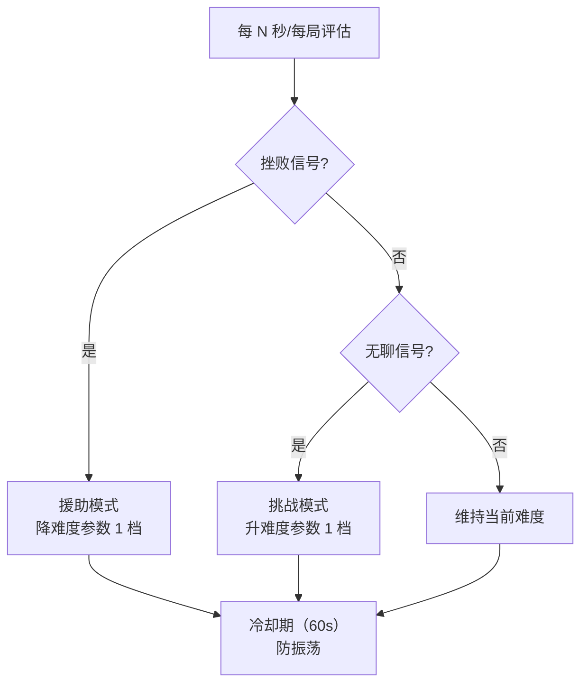
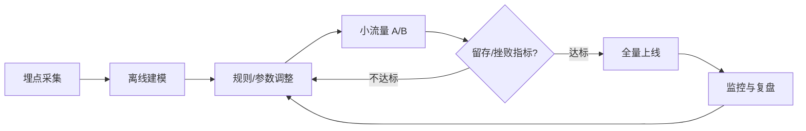

# 玩家建模与自适应难度（Player Modeling / DDA）

> 知识基线：引擎无关的游戏 AI 通用原理；玩家建模（Player Modeling）与动态难度调整（DDA, Dynamic Difficulty Adjustment）属于"AI 服务玩家体验"的方向，与 NPC 决策 AI 互补；涉及 UE 的实现以[游戏知识/05-AI系统/README.md](../../游戏知识/05-AI系统/README.md)为交叉验证边界。
> 适用范围：单机与联网 PvE 的难度调节、留存与体验优化、新手引导（tutorial）个性化、商业化（礼包/活动投放）与匹配（与 ELO 互补）；PvP 场景仅用于非对称匹配与观感优化，不得用于作弊级干预。
> 事实边界：玩家模型（技能/偏好/情绪推断）与 DDA 策略（参数调节/资源调节/隐式帮助）为通用游戏设计方法；具体实现无标准库；涉及玩家数据的采集、存储与使用必须符合隐私合规（未成年人保护、地区法规）；算法效果需 A/B 测试与留存数据验证。
> 最后更新：2026-08-07。
> 参考来源：[Wikipedia: Dynamic game difficulty balancing](https://en.wikipedia.org/wiki/Dynamic_game_difficulty_balancing)、[Flow Theory（Csikszentmihalyi）](https://en.wikipedia.org/wiki/Flow_(psychology))。

> 前面的文章让 NPC 更聪明，本文让**游戏更懂玩家**：通过持续观测玩家行为建立"玩家模型"（水平、偏好、情绪），再据此**动态调节难度**（DDA），让玩家始终处于"心流区"——太难就流失，太简单就无聊，自适应难度是留存优化的核心手段之一。

---

## 一、概述

### 1.1 问题背景

静态难度的问题：

- 固定数值对新手太难、对高手太简单，两头流失；
- 玩家群体方差大（年龄、经验、设备），单一曲线无法服务所有人；
- 难度体验与"挫败/无聊"直接相关，是留存与付费的先行指标。

### 1.2 两条主线


*图释：自适应难度的闭环——观测行为 → 建模 → 调难度 → 观测反馈。*

---

## 二、核心概念

| 概念 | 英文 | 一句话定义 | 示例 |
| --- | --- | --- | --- |
| 玩家模型 | Player Model | 对玩家技能/偏好/情绪的量化描述 | 技能分 0.72 |
| 技能估计 | Skill Estimation | 从行为推断玩家水平 | 胜率/完成时间/操作精度 |
| 动态难度调整 | DDA | 运行时按玩家状态调难度 | 敌人血量 ×0.8 |
| 心流 | Flow | 挑战与技能匹配的沉浸状态 | 胜率 60%~75% 区间 |
| 挫败信号 | Frustration Signal | 预示玩家受挫的行为特征 | 连续失败/长时间卡关 |
| 隐式帮助 | Rubber-banding / Help | 不显式降难度的暗中帮助 | 子弹磁吸、敌人失误率 |
| 难度参数 | Difficulty Knob | 可调的游戏数值维度 | 血量/伤害/时间/数量 |
| 个性化 | Personalization | 为个体定制内容/参数 | 新手跳过教学 |
| 内容推荐 | Content Recommendation | 按偏好推送关卡/皮肤/活动 | 喜欢解谜→推荐谜题 |

---

## 三、原理详解

### 3.1 玩家建模

#### 3.1.1 建模维度

| 维度 | 观测数据 | 推断方法 | 用途 |
| --- | --- | --- | --- |
| 技能水平 | 胜负、完成时间、命中率、APM | ELO/Glicko 变体、滑动窗口胜率 | 难度基线 |
| 操作风格 | 按键节奏、走位模式、道具使用 | 行为聚类（K-Means 等） | 推荐与引导 |
| 挫败状态 | 连续失败、卡关时长、重复同一操作 | 阈值 + 时间窗检测 | 触发降难度 |
| 无聊状态 | 低失误高胜率、跳过内容、挂机 | 胜率过高 + 活跃下降 | 触发升难度 |
| 偏好 | 玩法模式、内容点击、付费行为 | 协同过滤/规则 | 内容推荐 |

#### 3.1.2 技能估计实现

```text
// 伪代码：滑动窗口技能估计（节选/示意）
class SkillTracker:
    def __init__(self, window=20):
        self.results = deque(maxlen=window)

    def on_result(self, won, margin):
        self.results.append((won, margin))
        self.skill = self._estimate()

    def _estimate(self):
        if len(self.results) < 5:
            return None              // 样本不足，用默认难度
        wr = mean(won for won, _ in self.results)
        margin_avg = mean(margin for _, margin in self.results)
        return clamp(wr * 0.7 + margin_avg * 0.3, 0, 1)
```

#### 3.1.3 挫败/无聊检测

- **挫败**：连续失败 ≥3 次 或 同一关卡失败 ≥5 次 或 单关时长超均值 2 倍 → 触发"援助模式"；
- **无聊**：近期胜率 ≥85% 且平均耗时显著下降 或 主动跳过内容 → 触发"挑战模式"；
- 注意误报：挫败信号需结合"玩家是否仍在尝试"（活跃输入）过滤挂机。

### 3.2 DDA 策略谱系

#### 3.2.1 显式参数调节

| 层级 | 手段 | 示例 | 代价 |
| --- | --- | --- | --- |
| 数值 | 敌人血量/伤害/数量/速度 | 血量 ×0.8 | 简单，但显式、可被感知 |
| 行为 | 敌人反应延迟/失误率/攻击欲望 | 失误率 +20% | 隐式感更好 |
| 资源 | 补给/道具/复活点密度 | 弹药补给 +30% | 影响经济系统 |
| 时间 | 时限/波次间隔 | 波次间隔 +15% | 改变节奏 |
| 机制 | 简化机制/跳过环节 | 新手跳过 QTE | 大改，需谨慎 |

#### 3.2.2 隐式帮助（Rubber-banding）

- 子弹磁吸（Bullet Magnetism）：射失的子弹小幅修正命中；
- 敌人"失误"：AI 偶发发呆、准星抖动（见[02-战斗与Boss设计.md](02-战斗与Boss设计.md)的 AI 失误设计）；
- 补给前置：把资源放在玩家必经之路；
- 复活保护：连续死亡后短时减伤/无敌。

隐式帮助的要点：**玩家不应感知到"游戏在放水"**——否则成就感崩塌；通常结合"难度自适应+暗中修正"两层。

### 3.3 DDA 决策策略



*图释：DDA 决策状态机——挫败降档、无聊升档，均带冷却期防止难度振荡。*

关键工程点：

- **平滑**：难度参数用插值（如 3 秒渐变）而非跳变；
- **防振荡**：冷却期 + 滞回（升档需满足更强条件）；
- **上下限**：难度硬边界（最低不能无挑战、最高不能劝退），保护"数值尊严"；
- **可追溯**：记录每次调档的触发信号，用于 A/B 分析与问题排查。

### 3.4 与匹配/评分系统的关系

- **PvE**：玩家模型直接驱动 DDA；
- **PvP**：技能估计交给匹配（ELO/MMR，见[游戏服务端/03-业务系统设计/04-匹配与房间系统.md](../../游戏服务端/03-业务系统设计/04-匹配与房间系统.md)）；DDA 不干预对局，只做观感优化（如排位保护）；
- **混合**：玩家模型可同时服务匹配与内容推荐（同一份技能分）。

### 3.5 数据、隐私与合规

- 采集最小化：只采集难度调节所需的行为特征；
- 本地优先：单机建模可在客户端本地完成，不上报；
- 联网上报需隐私合规（未成年人保护法、GDPR 等），脱敏后用于离线分析；
- 留存指标验证：DDA 上线必须 A/B 测试（见[游戏AI/03-评测与安全/01-AI评测回放与LLM安全.md](../03-评测与安全/01-AI评测回放与LLM安全.md)的评测方法论）。

### 3.6 玩家分群与画像

个体建模之外，**群体分群**支撑内容推荐与运营：

```text
// 伪代码：玩家分群（节选/示意）
features = [技能分, 操作风格向量, 内容偏好, 活跃度, 付费倾向]
clusters = kmeans(features, k=6)        // 离线聚类
player.segment = assign_cluster(player, clusters)
```

典型分群：

| 分群 | 特征 | 运营动作 |
| --- | --- | --- |
| 新手 | 低技能分、短会话 | 简化引导、低难度 |
| 挑战者 | 高技能分、高活跃 | 高难度内容、竞技入口 |
| 收集者 | 内容完成率高 | 收集向活动推送 |
| 社交型 | 组队/聊天频率高 | 公会/组队活动 |
| 休闲型 | 低时长、低挫败容忍 | 短对局、低压力模式 |

画像输出可复用：匹配（PvP 分池）、推荐（商城/活动）、客服（问题定位）。

### 3.7 DDA 上线与迭代流程



*图释：DDA 迭代闭环——数据驱动调整，A/B 验证后全量，持续监控回流。*

上线清单：

1. 埋点：技能分/挫败信号/难度档位/结果指标（通关、流失）全部入库；
2. 基线：先跑 1~2 周"无 DDA"基线数据；
3. A/B：小流量对比 DDA 开/关的留存与挫败流失率；
4. 全量：达标后全量，保留手动开关（紧急关停）。

---

## 四、伪代码/示例：DDA 控制器

```text
// 伪代码：DDA 控制器（节选/示意）
class DdaController:
    def __init__(self):
        self.difficulty = 1.0          // 难度系数基线
        self.cooldown = 0

    def tick(self, dt, skill, frust, bored):
        self.cooldown -= dt
        if self.cooldown > 0:
            return
        if frust:
            self.difficulty = max(0.5, self.difficulty - 0.1)
            self.cooldown = 60
        elif bored:
            self.difficulty = min(1.5, self.difficulty + 0.1)
            self.cooldown = 60
        self.target = self.difficulty

    def current_multiplier(self):
        // 平滑插值，避免跳变
        self.current = lerp(self.current, self.target, 0.1)
        return self.current
```

---

## 五、最佳实践

1. **默认难度用静态基线**：先做扎实的静态难度曲线，DDA 只在边界干预（±20% 以内）。
2. **先隐式后显式**：优先隐式帮助（失误率/补给），显式数值调整作为兜底。
3. **挫败比无聊优先**：挫败导致的流失通常比无聊更严重，降档优先。
4. **尊重玩家选择**：提供"难度开关"与 DDA 并存（手动模式关闭自动调节）。
5. **记录一切调档**：触发信号、参数前后值、结果（是否通关/流失）——没有数据无法迭代。
6. **A/B 验证**：DDA 上线前做小流量 A/B，指标看留存与通关率，不只看出色率。
7. **避免"橡皮筋"感知**：调档幅度小、频率低，玩家不应察觉"被照顾/被惩罚"。
8. **与叙事兼容**：Boss 战的 DDA 不破坏演出节奏（如演出阶段不调数值）。
9. **多端差异化**：移动端操作精度方差大，DDA 权重应更高。
10. **冷却与滞回**：所有调档必须带冷却，防止难度在两档间反复横跳。

---

## 六、常见问题 FAQ

1. **Q：DDA 会让高手觉得游戏"变蠢"吗？** A：正确实现是"感知不到"的——隐式帮助 + 小幅度参数，且高手遇到的干预极少（难度本就在上限）。
2. **Q：怎么区分"挫败"和"玩家在挑战"？** A：看活跃输入与尝试次数：反复尝试但持续失败 → 挫败；安静挂机/低活跃 → 无聊。
3. **Q：DDA 会影响排行榜公平性吗？** A：PvE 排行榜需记录难度系数并分池/加权；PvP 严禁 DDA 干预。
4. **Q：样本不足时怎么办？** A：新玩家用默认难度 + 前几局快速探测（用入门关表现估计）。
5. **Q：玩家模型要存多久？** A：会话级即可满足大部分 DDA；跨会话（留存相关）需持久化并做版本迁移。
6. **Q：DDA 和付费/商业化的关系？** A：DDA 提升体验间接提升留存；直接"难度逼氪"是高风险短视策略，不建议。
7. **Q：多人合作关卡 DDA 按谁调？** A：按队伍平均/最低技能（取最低更防挫败），并避免同屏参数不一致（以主机/房主为准同步）。
8. **Q：挫败检测误报（玩家自己作死）怎么办？** A：误报代价小（降一档难度），配合冷却可自愈；重点防"该降不降"。
9. **Q：DDA 与叙事难度（剧情战）冲突吗？** A：剧情战固定演出数值，DDA 只作用于自由战斗/探索，二者隔离。
10. **Q：如何评估 DDA 的效果？** A：A/B 对照留存率、通关率、挫败流失率、平均在线时长；用评测回放体系（见[03-01 评测篇](../03-评测与安全/01-AI评测回放与LLM安全.md)）做离线验证。

---

## 七、关联阅读

- 本分类：[02-战斗与Boss设计.md](02-战斗与Boss设计.md) —— 难度曲线、AI 失误设计（隐式帮助的载体）；
- 本分类：[03-学习型AI.md](03-学习型AI.md) —— 用 RL/行为克隆做玩家模型或难度策略的进阶；
- 本分类：[04-服务端AI与性能.md](04-服务端AI与性能.md) —— 服务端 DDA 的确定性、预算与回放；
- 评测安全：[01-AI评测回放与LLM安全.md](../03-评测与安全/01-AI评测回放与LLM安全.md) —— DDA 效果的评测与 A/B 方法论；
- 服务端：[游戏服务端/03-业务系统设计/04-匹配与房间系统.md](../../游戏服务端/03-业务系统设计/04-匹配与房间系统.md) —— PvP 技能估计与匹配的关系；
- UE 侧：[游戏知识/05-AI系统/README.md](../../游戏知识/05-AI系统/README.md) —— UE 侧实现指路（难度调节与 AI 参数化）。

---

## 更新日志

- 2026-08-07：初稿。补齐"玩家建模与自适应难度"空白（P1）；涵盖玩家模型三维度、挫败/无聊检测、DDA 策略谱系（显式/隐式）、决策状态机、隐私合规与 A/B 验证；引擎无关通用层。

## 落地检查清单

### 常见反模式

1. **DDA 调整过于频繁**：每局多次改变难度，玩家感到被操控，挫败感反而上升。
2. **只看单局表现**：把一次失误当成长期能力，难度剧烈抖动。
3. **隐式调整不可解释**：玩家察觉难度变化但无法理解原因，信任度下降。
4. **与匹配系统冲突**：DDA 与 MMR 互相拉扯，对局失衡。
5. **滥用玩家数据**：行为采集超出必要范围，隐私合规风险。
6. **无回测直接上线**：难度策略未做 A/B 与回放评估（联动 03-01），上线后难以回滚。

- [ ] 行为特征采集有明确事件源、采样窗口与去重规则（符合隐私合规）。
- [ ] 技能水平估计使用稳定指标（ELO/任务表现/滑动窗口）并带置信度。
- [ ] 玩家风格分类（聚类/规则标签）有离线验证，不随单局剧烈漂移。
- [ ] DDA 反馈环具备：最小评估窗口、平滑限幅、安全期（避免频繁调整）。
- [ ] 隐式调整与显性调整（难度档位/选项）边界清晰，玩家可感知的调整可解释。
- [ ] 心流目标窗口（挫败/无聊阈值）已参数化且可调。
- [ ] 个性化内容（推荐/参数化生成）有版本与回滚机制。
- [ ] 防滥用：不因单局表现或恶意行为被锁定到极端难度。
- [ ] 与评测指标联动：A/B 验证、回放评估与回归门禁（指路 03-01）。
- [ ] 多人场景公平性：不因 DDA 造成对局失衡，匹配 MMR 不与 DDA 冲突。

### 术语速查

| 术语 | 英文 | 一句话解释 |
| --- | --- | --- |
| 玩家建模 | Player Modeling | 用行为数据估计玩家技能/风格/动机 |
| 动态难度调整 | DDA | 根据玩家表现动态调整难度 |
| 橡胶带效应 | Rubber-banding | 落后补偿使比赛保持接近（赛车） |
| 心流 | Flow | 挑战与技能匹配的沉浸状态 |
| 置信度 | Confidence | 技能估计的可信程度 |
| 安全期 | Cooldown Window | 两次调整之间的最小间隔 |
| 挫败检测 | Frustration Detection | 识别玩家持续失败的状态 |
| 个性化内容 | Personalization | 按玩家模型定制内容与体验 |
