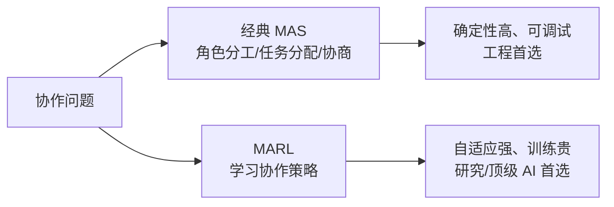
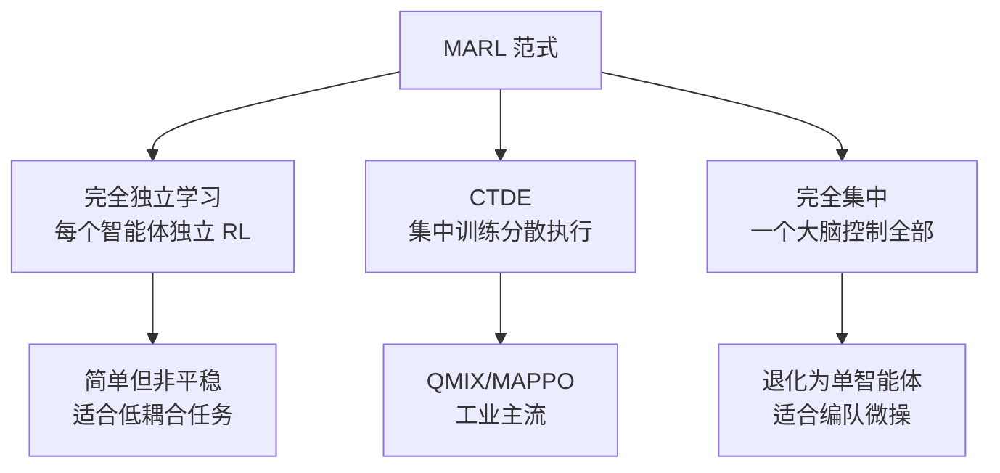
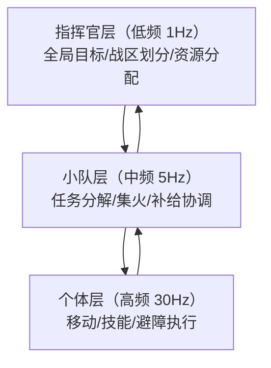

# 多智能体协作与强化学习（MARL）

> 知识基线：引擎无关的游戏 AI 通用原理；多智能体协作（协商/联盟/任务分配）与多智能体强化学习（MARL）属于"决策层协同"，与移动层协同（Boids/编队，见 01-移动与群组行为）互补；涉及 UE 的实现以[游戏知识/05-AI系统/README.md](../../游戏知识/05-AI系统/README.md)为交叉验证边界。
> 适用范围：RTS/策略游戏的单位协同（集火/包围/撤退掩护）、MMO 副本 AI（坦克-输出-治疗配合）、自走棋/战棋的团队决策、以及服务端大规模 AI 的协作调度；MARL 部分适用于研究型/顶级 AI 项目。
> 事实边界：协商/联盟/任务分配为经典多智能体系统（MAS）方法；MARL（CTDE、QMIX、MAPPO 等）为前沿研究，工程落地需评估稳定性与算力；具体引擎无内置多智能体框架；性能与收敛结论需以项目实测为准。
> 最后更新：2026-08-07。
> 参考来源：[Wikipedia: Multi-agent system](https://en.wikipedia.org/wiki/Multi-agent_system)、[QMIX 论文（Rashid et al. 2018）](https://arxiv.org/abs/1803.11485)、[MAPPO 论文（Yu et al. 2022）](https://arxiv.org/abs/2103.01955)。

> 单智能体 AI 回答"我该做什么"；多智能体 AI 回答"**我们**该怎么配合"——谁去打哪个目标、谁去占点、谁掩护谁撤退。本文先讲工程可落地的经典协作方法（角色分工、任务分配、协商与联盟），再讲 MARL（多智能体强化学习）的原理、范式与适用边界。

---

## 一、概述

### 1.1 为什么协作难

- **指数组合**：N 个智能体 × M 个目标，分配方案是排列组合级；
- **协调成本**：需要共享意图（谁在做什么），通信带宽与延迟受限；
- **涌现风险**：各自最优 ≠ 团队最优（如五个人都去追残血目标，无人占点）；
- **非平稳性**：队友也在学习/变化，环境对每个智能体都不是静止的。

### 1.2 两条路线



*图释：协作问题的两条技术路线——经典方法可控可调，MARL 自适应但昂贵。*

---

## 二、核心概念

| 概念 | 英文 | 一句话定义 | 示例 |
| --- | --- | --- | --- |
| 多智能体系统 | MAS | 多个自主智能体共享环境交互的系统 | 五人小队 |
| 角色分工 | Role Assignment | 按角色分配职责与动作空间 | 坦/奶/输出 |
| 任务分配 | Task Allocation | 把任务集合分配给智能体集合 | 谁打 A 谁打 B |
| 协商 | Negotiation | 通过提议/反提议达成一致 | 拍卖式分配 |
| 联盟 | Coalition | 智能体结成临时团体共同行动 | 两家 AI 联合攻城 |
| 通信协议 | Communication Protocol | 共享意图的消息格式 | 宣告目标/请求支援 |
| 共享黑板 | Shared Blackboard | 中央共享知识库 | 目标列表+分配状态 |
| 集中训练分散执行 | CTDE | 训练时共享信息、执行时独立决策 | QMIX/MAPPO |
| 信用分配 | Credit Assignment | 判断哪个智能体的贡献导致回报 | 谁的关键治疗 |
| 非平稳性 | Non-stationarity | 队友策略变化导致环境不稳定 | 队友换打法 |

---

## 三、原理详解

### 3.1 经典协作方法（工程首选）

#### 3.1.1 角色分工（Role-based）

把团队拆成角色，每个角色有**独立的决策逻辑**（行为树/状态机）：

```text
// 伪代码：角色分工（节选/示意）
class Squad:
    roles = {TANK, DPS, HEALER}

    def assign(self, units):
        // 简单分配：按职业标签 + 当前状态
        for unit in units:
            unit.role = best_role(unit, squad_state)
```

- 优点：可调试、可预测、内容可控；
- 缺点：角色死板，无法应对突发组合（治疗死了谁来补）。

#### 3.1.2 任务分配（Task Allocation）

经典算法：**匈牙利算法**（最小代价匹配）、贪心分配、拍卖式分配。

```text
// 伪代码：贪心任务分配（节选/示意）
function greedy_assign(units, tasks, cost_fn):
    assign = {}
    for task in tasks.sort_by_urgency():
        unit = argmin(u, cost_fn(u, task) for u in units if u.free)
        assign[task] = unit
        unit.free = false
    return assign
```

分配代价函数示例：`cost = α*距离 + β*输出能力 + γ*当前血量`——把"谁最适合"变成可调权重。

#### 3.1.3 协商与联盟

- **拍卖式分配**：任务发标，智能体按能力报价，最低价中标（适合市场类场景）；
- **投票/仲裁**：多个智能体提议方案，仲裁者（队长）选优；
- **联盟形成**：针对强目标，计算"哪些智能体组合能击败它"并结成联盟（覆盖度问题）；
- **工程提醒**：协商开销高，游戏内通常用"队长仲裁 + 宣告"简化（广播意图，避免重复决策）。

#### 3.1.4 通信协议

- 共享黑板：目标列表、分配状态、冷却信息（集中式，适合小团队）；
- 宣告式广播：`I_ATTACK(target=X)`、`REQUEST_HEAL`、`FALLBACK(pos)`；
- 协议设计原则：**意图级通信**（说"我要打 X"而非"我的坐标是 y"）、频率限制、无通信兜底（超时默认规则）。

### 3.2 MARL 基础

#### 3.2.1 与单智能体 RL 的差异

| 维度 | 单智能体 RL | MARL |
| --- | --- | --- |
| 环境 | 静止（其他实体是环境） | 其他智能体也在学习（非平稳） |
| 回报 | 个体回报 | 个体回报 vs 团队回报的平衡 |
| 收敛 | 相对稳定 | 不稳定，需 CTDE/对手建模等技巧 |
| 训练成本 | 高 | 更高（多智能体交互样本） |

#### 3.2.2 三大范式



*图释：MARL 三种范式——独立学习简单但非平稳，CTDE 是当前主流（QMIX/MAPPO），完全集中在动作空间巨大时不可行。*

#### 3.2.3 代表算法

| 算法 | 类型 | 核心思想 | 适用 |
| --- | --- | --- | --- |
| IQL（独立 Q-Learning） | 值函数 | 各自学 Q，忽略队友 | 低耦合、教学示例 |
| QMIX | 值函数/CTDE | 用混合网络把个体 Q 单调组合成团队 Q | 合作任务（星际争霸微操） |
| MAPPO | 策略梯度/CTDE | 集中 Critic + 分散 Actor | 连续动作、大规模 |
| MADDPG | 演员-评论家/CTDE | 集中 Critic 看到所有智能体 | 混合合作竞争 |

#### 3.2.4 信用分配问题

团队回报无法告诉"谁的贡献大"——常用技巧：

- **个体奖励塑形**：给每个智能体额外的局部奖励（造成伤害+1、承伤+0.5）；
- **事后分配**：差分回报（COMA 思路）按反事实基线分配；
- **工程建议**：游戏项目先做"规则化角色分工 + 局部奖励塑形"，比直接上 MARL 收敛快得多。

### 3.3 服务端多智能体（大规模）

- 大规模 AI（万人军团）不能逐个协商：用**分层架构**——指挥官（全局分配）→ 小队（局部协作）→ 个体（执行）；
- 预算约束：协商/黑板更新低频（秒级），个体决策高频（帧级）；
- 确定性：协作决策需可回放（见[04-服务端AI与性能.md](04-服务端AI与性能.md)与[游戏算法/04-确定性与基准工程/01-动态寻路确定性与基准测试.md](../../游戏算法/04-确定性与基准工程/01-动态寻路确定性与基准测试.md)）。

### 3.3.1 指挥官分层架构

大规模协作的标准形态是**三层指挥链**：



*图释：三层指挥链——指挥官做全局分配，小队做局部协作，个体做高频执行；每层频率递减、视野递增。*

设计要点：

- **频率分层**：越高层越低频（指挥官 0.5~1Hz、小队 3~5Hz、个体 30Hz），预算可控；
- **命令语义**：上层下发"意图"（去 X 战区、集火目标 A），下层翻译为动作；
- **反馈上报**：下层上报关键状态（伤亡、目标完成），驱动上层重分配；
- **降级**：指挥官死亡/失联 → 小队独立作战（默认规则），个体就近加入其他小队。

### 3.3.2 协作失败降级矩阵

| 故障 | 降级行为 | 恢复 |
| --- | --- | --- |
| 队长失联 | 小队按默认编组独立行动 | 新队长选举（按军衔/存活） |
| 治疗者死亡 | 自动改为"撤退+包扎"模式 | 重生后角色重分配 |
| 通信超时 | 个体按"最后指令 + 就近规则"行动 | 通信恢复后重同步 |
| 目标消失 | 小队转最近未分配目标 | 指挥官重分配 |
| 全局调度故障 | 各区域独立运行（分区自治） | 调度恢复后合并 |

降级设计原则：**任何层级故障都不能让下层完全停摆**——每个个体必须有"无指令默认行为"（防守/就近支援）。

---

## 四、伪代码/示例：小队协作骨架

```text
// 伪代码：小队协作（节选/示意）
class SquadBrain:
    def tick(self, world, dt):
        if self.plan_cooldown <= 0:
            self.plan(world)          // 低频：任务分配 + 角色微调
            self.plan_cooldown = 1.0
        for unit in self.units:
            unit.decide(self.blackboard)   // 高频：个体执行

    def plan(self, world):
        threats = world.threats()
        if threats:
            assign = greedy_assign(self.units, threats, cost_fn)
            self.blackboard["targets"] = assign
        if any(u.hp < 0.3 for u in self.units):
            self.blackboard["request_heal"] = nearest_healer()
```

---

## 五、最佳实践

1. **先经典后学习**：角色分工 + 任务分配 + 黑板能覆盖 90% 游戏需求，MARL 只在"策略空间大、规则难写"时引入。
2. **通信最小化**：只广播意图与关键状态，频率限制，无通信时用默认行为兜底。
3. **分配权重可调**：代价函数（距离/能力/血量）权重进配置表，策划可调。
4. **防"羊群效应"**：同一目标被多人重复选择时，分配器需去重/排序（已分配目标标记）。
5. **协作失败降级**：队友死亡/离线时，其他智能体自动接管职责（角色重分配）。
6. **回放与调试**：协作决策记录到回放（谁分配了什么、为什么），否则无法定位"集体送死"。
7. **MARL 用 CTDE 起步**：QMIX 类适合离散动作合作任务；先小场景验证再扩大。
8. **奖励塑形先行**：个体局部奖励 + 团队奖励混合，解决信用分配。
9. **非平稳防御**：训练时冻结对手/队友策略做对照，评估时用固定基准队伍。
10. **预算与确定性**：服务端大规模协作走分层架构，决策可回放可测（见[03-评测与安全](../03-评测与安全/README.md)）。

---

## 六、常见问题 FAQ

1. **Q：五个 AI 一起打一个目标，算协作吗？** A：算最基础的"聚合攻击"；真正的协作是**有分工**（谁控、谁输出、谁挡枪）。
2. **Q：协商真的需要吗？** A：多数游戏不需要显式协商——队长仲裁 + 宣告广播就够；协商适合市场/外交类玩法。
3. **Q：MARL 训练很慢怎么办？** A：用规则 AI 做对手/队友初始化，小地图先训，经验复用；或放弃 MARL 用规则协作。
4. **Q：QMIX 和 MAPPO 怎么选？** A：离散动作、合作任务 → QMIX 类；连续动作、大规模 → MAPPO 类；都从官方参考实现起步。
5. **Q：信用分配在游戏里怎么简化？** A：个体局部奖励（伤害/治疗/占点贡献）+ 团队胜负奖励，加权合成个体回报。
6. **Q：队友 AI 变化会导致 MARL 崩溃吗？** A：会（非平稳）；训练时固定对手/队友做对照，上线后冻结策略、小步更新。
7. **Q：协作 AI 需要多少通信带宽？** A：意图级广播每智能体每秒几条消息即可；避免每帧全量位置同步。
8. **Q：治疗 AI 怎么决定给谁奶？** A：优先级 = 血量最低 + 承伤最高 + 角色权重（坦克优先），可加"请求治疗"信号。
9. **Q：大规模军团协作怎么做？** A：三层架构（指挥官/小队/个体），分配低频、执行高频，黑板集中共享。
10. **Q：多智能体测试怎么做？** A：固定场景矩阵（集火/撤退/保护）+ 回放断言关键事件（如治疗是否及时），见[03-评测与安全](../03-评测与安全/README.md)。

---

## 七、关联阅读

- 本分类：[01-移动与群组行为.md](01-移动与群组行为.md) —— 移动层协同（Boids/编队）与决策层协作的分工；
- 本分类：[02-战斗与Boss设计.md](02-战斗与Boss设计.md) —— 团队战斗 AI 的实战（集火/换坦）；
- 本分类：[03-学习型AI.md](03-学习型AI.md) —— 单智能体 RL 基础（MARL 的前置知识）；
- 本分类：[04-服务端AI与性能.md](04-服务端AI与性能.md) —— 服务端大规模 AI 的分层与预算；
- 评测安全：[01-AI评测回放与LLM安全.md](../03-评测与安全/01-AI评测回放与LLM安全.md) —— 多智能体场景的评测与回放；
- 算法：[游戏算法/04-确定性与基准工程/01-动态寻路确定性与基准测试.md](../../游戏算法/04-确定性与基准工程/01-动态寻路确定性与基准测试.md) —— 协作决策的确定性要求；
- UE 侧：[游戏知识/05-AI系统/README.md](../../游戏知识/05-AI系统/README.md) —— UE Mass/StateTree 的多智能体实现指路。

---

## 更新日志

- 2026-08-07：初稿。补齐"多智能体协作与强化学习"空白（P1）；涵盖角色分工/任务分配/协商联盟/通信协议经典方法、MARL 三大范式（IQL/QMIX/MAPPO/MADDPG）、信用分配、服务端大规模协作；引擎无关通用层。

## 落地检查清单

### 常见反模式

1. **把移动层协同当决策层协作**：Boids 编队解决不了任务分配与目标选择问题。
2. **协商无超时**：智能体互相等待导致死锁，对局卡住。
3. **MARL 忽略信用分配**：团队奖励平均回传，个体学习信号被淹没。
4. **通信无预算**：智能体间消息泛滥，服务端带宽与 CPU 被打满。
5. **训练与评测环境漂移**：训练用简化规则，上线后行为失稳。
6. **LLM 多智能体无降级**：外部调用失败时没有确定性回退，整局不可控。

### 补充：协作决策示例流程

```text
小队目标出现
  -> 角色分工（坦克/输出/治疗）按状态评分
  -> 任务分配（市场拍卖或角色槽）幂等提交
  -> 执行中协商（换位/集火）带超时与重试
  -> 失败回退：等待/重分配/请求增援
  -> 目标完成或放弃，释放协作上下文
```

该流程是方案示意，具体机制（评分、拍卖、协商协议）按项目玩法设计。

- [ ] 协作层次已区分：移动层协同（Boids/编队，指路 01 篇）与决策层协作（本文）。
- [ ] 角色分工与任务分配有明确机制（角色槽/市场拍卖/指挥官指令）。
- [ ] 协商与联盟规则有状态机与超时，避免死锁与反复背约。
- [ ] 智能体间通信有协议边界（消息类型/频率/容量/延迟容忍）。
- [ ] MARL 方案明确训练范式（IQL/QMIX/MAPPO/MADDPG）与集中训练/分散执行边界。
- [ ] 信用分配问题已识别（团队奖励如何回传），有奖励塑形或差分机制。
- [ ] 训练环境与评测环境隔离，回放证据可复现（联动 03-01）。
- [ ] 服务端大规模协作有预算：每帧决策数、通信量、降级策略。
- [ ] LLM 多智能体框架（若采用）有成本、延迟与失败回退方案。
- [ ] 协作行为有观测指标：任务完成率、联盟稳定性、通信开销。

### 术语速查

| 术语 | 英文 | 一句话解释 |
| --- | --- | --- |
| 任务分配 | Task Allocation | 把任务按能力/位置/负载分给智能体 |
| 协商 | Negotiation | 智能体就目标/资源达成一致的过程 |
| 联盟 | Coalition | 多个智能体为共同目标的临时组合 |
| 多智能体强化学习 | MARL | 多智能体共同学习的强化学习范式 |
| 集中训练分散执行 | CTDE | 训练时可访问全局信息，执行时只用局部信息 |
| 信用分配 | Credit Assignment | 判断团队结果中每个智能体的贡献 |
| 经验回放 | Experience Replay | 用历史样本打散相关性训练 |
| 通信协议 | Communication Protocol | 智能体间消息的格式与约束 |
