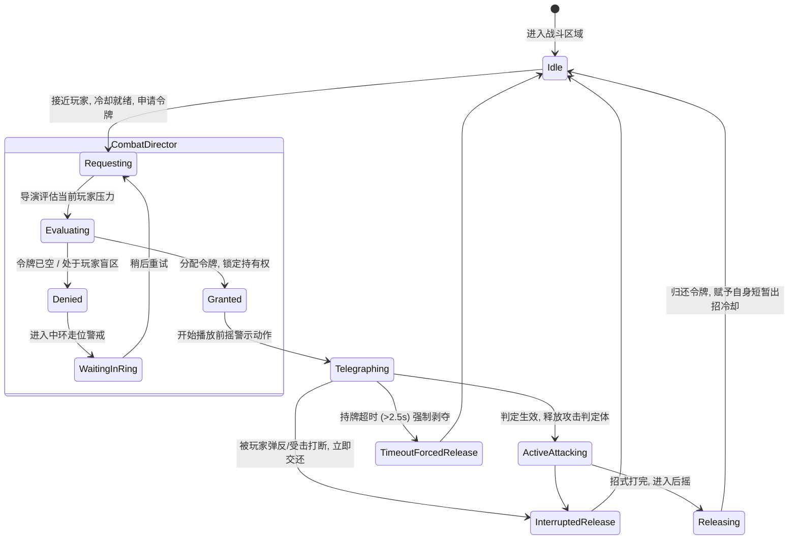
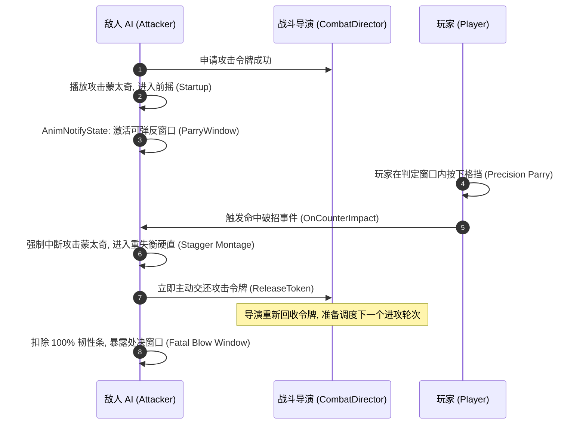

# 07 战斗AI编排与战术协同

> 知识成熟度：L2（工程体系化新著：攻击欲望令牌桶、战术多层环形槽位、视野盲区减压、招式前摇反制与破招协同）。
> 知识基线：面向动作游戏（ACT / ARPG / 动作射击 / 魂系 / 战锤等）多智能体战斗编排与战术协同设计；横向联动 [游戏AI/02-移动学习与服务端/02-战斗与Boss设计.md](02-战斗与Boss设计.md)、[游戏AI/01-决策与架构/03-行为树通用原理.md](../01-决策与架构/03-行为树通用原理.md)、[游戏知识/04-动画系统/08-动作战斗系统与打击手感.md](../../游戏知识/04-动画系统/08-动作战斗系统与打击手感.md) 以及 [游戏知识/05-AI系统/02-感知系统与EQS.md](../../游戏知识/05-AI系统/02-感知系统与EQS.md)。
> 适用范围：多敌人同屏战斗调度、近战与远程攻击轮次管控、AI 围堵走位与槽位竞争、动态战斗压迫感与难度曲线调节。
> 事实边界：战斗导演（Combat Director）与槽位算法无单一业界标准，本文给出主流 3A 动作系统通用方案（分级令牌桶池、三层动态包围圈、视锥盲区降权、破招失衡即刻归还）；涉及 C++ 示例与行为树集成以工业级标准为准。
> 参考来源：GDC: *The Artificial Intelligence of Assassin's Creed / Doom (2016) Combat Director*；Unreal Engine EQS & AI Architecture。

---

## 一、概述与战斗导演哲学（Combat Director Philosophy）

### 1.1 动作战斗的根本矛盾：单体局部最优 vs 群体体验灾难

在传统的简单 AI 架构中，每个敌人往往是一个“自主闭环系统”：每只怪独立感知玩家、独立计算冷却、独立寻路并独立出招。当场上只有 1 只怪物时，体验尚可；但当场上存在 5~10 只怪物时，系统必然陷入**“围殴风暴灾难（Swarming Chaos）”**：
- **无间断连击压迫**：多只怪物同时进入攻击距离，并在同一帧或连续毫秒级间隔内连续释放霸体攻击，导致玩家处于无限硬直中被“连到死”，没有任何操作防御空间；
- **空间重叠与穿模堆叠**：所有怪物都以“玩家原点”为寻路终点，导致怪物互相挤碰、模型重叠穿模、视觉混乱，毫无电影级交战的观赏美感；
- **视野外冷箭偷袭**：处于玩家屏幕视锥外的怪物在盲区突然发动致命背刺，玩家毫无反应窗口，挫败感极强。

### 1.2 现代动作战斗的“实时回合制”编排哲学

现代优秀动作游戏（如《蝙蝠侠：阿卡姆》、《对马岛之魂》、《黑神话》、《战神》等）的共识：**优秀的战斗体验绝不是单体 AI 的暴力堆砌，而是由一个高层“中央战斗导演（Combat Director）”统一指挥的舞台编排戏剧**。

```text
[单体 AI：我能打谁？怎么走过去？] ──(上报意图)──> [战斗导演：准许你攻击！其他人围困警戒！]
                                                              │
                                            ┌─────────────────┴─────────────────┐
                                            ▼                                   ▼
                             [攻击欲望令牌桶 (Attack Tokens)]     [战术包围圈环形槽位 (Ring Slots)]
                             - 控制攻击密度与攻防轮次               - 分散站位，杜绝穿模扎堆
                             - 保证玩家拥有观察反制窗口             - 保持逼真压迫感与舞台包围圈
```

---

## 二、攻击欲望令牌桶系统（Attack Token System）

### 2.1 令牌分类与分级池（Token Pools）

攻击令牌（Attack Token）代表**“对玩家发动攻击的排他性许可证”**。没有获得令牌的敌人，即便已经近在咫尺、CD 已转好，也严禁发动攻击，只能执行警戒、佯动、走位或挑衅。

工业级战斗导演通常维护三类互斥的令牌池：

| 令牌类型 | 英文标识 | 全局发放配额 | 核心用途与约束 |
| :--- | :--- | :---: | :--- |
| **近战主攻令牌** | `MeleeAttackToken` | 通常 1 个（高难度下允许 2 个） | 授予当前执行近战轻击/重击/连段的敌人；主攻怪获得绝对出招权 |
| **远程骚扰令牌** | `RangedHarassToken` | 1 个 | 授予弓箭手或法系敌人施放远距离骚扰投掷物；必须与近战攻击打出时间差 |
| **特殊霸体/抓取令牌** | `SpecialGrabToken` | 严格互斥 1 个 | 致命红光投技、大范围砸地特技；发放时必须触发玩家全屏危急警报音效 |

### 2.2 令牌全生命周期流转与防死锁机制



**防死锁三法则（Anti-Deadlock Rules）**：
1. **持有超时强行回收（Token Timeout）**：持牌怪若因寻路卡住、被其他怪物阻挡，或前摇动画过长导致持有令牌超过上限（如 $2.5\text{s}$），战斗导演强行剥夺其令牌并归还公池，防止全场陷入“无怪出招”的永久假死；
2. **受击/破招即刻释放（Immediate Release on Stagger）**：一旦持牌怪受到玩家攻击导致硬直（Hit Stun）或被弹反（Parry），必须在当帧立即归还令牌，让场上其他怪物能够迅速跟进；
3. **出招冷却间隔（Post-Attack Cooldown）**：归还令牌后，该怪物自身进入 $3.0 \sim 5.0\text{s}$ 的个人冷却期，禁止连续霸占令牌。

### 2.3 动态战斗压力调节（Combat Stress Adaptation）

战斗导演并非机械发牌，它根据玩家当前的实时生存状态动态缩放令牌上限：
- **玩家受击硬直中（Player in Hitstun）**：主攻令牌池临时锁死（当前最大发牌数降为 0），杜绝玩家在硬直中被第二只怪补刀暴毙；
- **玩家倒地起身保护（Player Knocked Down）**：所有敌人后撤 $1\text{m}$，停止发牌，给玩家起身重整旗鼓的窗口；
- **玩家残血吃药状态（Player Consuming Flask）**：根据策划难度曲线，可允许远程怪施加骚扰，但近战大招令牌延迟 1.5 秒发放。

---

## 三、战术包围圈多层环形槽位系统（Multi-Ring Slots System）

### 3.1 环形几何拓扑架构（Ring Topology）

为彻底解决怪物扎堆穿模与推挤，围绕玩家建立以玩家位置为圆心、随视线旋转的**三层战术环形槽位（Tactical Multi-Ring Slots）**：

```text
                                [外环：远程射击圈 (R=10.0m)]
                                     ○     ○     ○
                         [中环：战术压迫圈 (R=5.0m)]
                               ○     ●     ●     ○
                   [内环：近战出招圈 (R=2.5m)]
                         ○         ●         ○
                                  [玩家]
                         ○         ○         ○
                               ○     ○     ○
                                     ○     ○     ○
```

| 环层 | 默认半径 | 槽位数 | 角色定位 | 行为模式与动画表现 |
| :--- | :---: | :---: | :--- | :--- |
| **内环（Inner Melee Ring）** | $2.0 \sim 3.0\text{m}$ | $4 \sim 6$ 个 | 持有攻击令牌的主攻手 | 贴身近战挥砍、连击压制、闪避走位 |
| **中环（Middle Pressure Ring）** | $4.5 \sim 7.0\text{m}$ | $8 \sim 12$ 个 | 候补佯攻手（Stalkers） | 保持面向锁定、横向绕圈走位（Orbiting）、做武器敲盾/怒吼挑衅动画 |
| **外环（Outer Ranged Ring）** | $8.0 \sim 15.0\text{m}$ | $6 \sim 8$ 个 | 弓箭手、法系敌人 | 寻找开阔射击角度、拉开距离、避开近战推挤 |

### 3.2 槽位数学几何计算与动态更新

设玩家当前世界坐标为 $\vec{P}_{player}$，朝向正前方向量为 $\vec{F}_{player}$，内环槽位总数为 $N$，环半径为 $R$。第 $k$ 个槽位的世界理想坐标 $\vec{S}_k$ 计算公式为：

$$\theta_k = \frac{2\pi \cdot k}{N} + \text{YawOffset}$$
$$\vec{S}_k = \vec{P}_{player} + R \cdot (\vec{F}_{player} \cdot \cos\theta_k + \vec{R}_{player} \cdot \sin\theta_k)$$

```cpp
FVector UTacticalRingSlotComponent::GetSlotWorldLocation(int32 RingIndex, int32 SlotIndex) const
{
    const FRingDefinition& Ring = Rings[RingIndex];
    const float AngleStep = 360.0f / Ring.SlotCount;
    const float CurrentAngle = AngleStep * SlotIndex + Ring.CurrentRotationYaw;

    const FRotator Rotation(0.0f, CurrentAngle, 0.0f);
    const FVector LocalOffset = Rotation.Vector() * Ring.Radius;

    // 沿玩家位置偏移
    FVector IdealLocation = GetOwner()->GetActorLocation() + LocalOffset;

    // 关键步骤：沿 NavMesh 投影，确保槽位在可行走地面上
    FNavLocation NavLoc;
    if (NavSys->ProjectPointToNavigation(IdealLocation, NavLoc, FVector(50.f, 50.f, 200.f)))
    {
        return NavLoc.Location;
    }
    return IdealLocation;
}
```

### 3.3 视野盲区减压机制（Off-Screen Attack Dampening）

在主机级动作游戏中，“屏幕外敌人攻击”是导致玩家差评的首要元凶。
**视野审查机制**：
1. 战斗导演每帧将所有怪物的世界坐标投影到玩家相机的视锥体（Camera View Frustum）中：
   $$\text{ScreenPos} = \text{WorldToScreen}(\vec{P}_{enemy})$$
2. 若 $\text{ScreenPos}$ 落在视口边缘之外（即玩家看不见的后方或侧后方）：
   - 该怪物申请攻击令牌的权重**强制降低 80%**；
   - 严禁发放致命红光技能令牌；
   - 若该怪物执意攻击，行为树必须先驱动其执行“横向绕行移动（Flank Orbiting）”，直至其进入玩家视野正前方 $90^\circ$ 扇形区域内，才准许发起蓄力冲刺。

---

## 四、招式前摇警示与破招失衡协同（Telegraphing & Counter Integration）

### 4.1 动作前摇提示（Telegraphing）的三维传达

AI 在获得攻击令牌并准备出招时，严禁使用“无起手瞬发攻击（Instant Startup）”。必须提供明确的视听语言，赋予玩家预判窗口：
1. **肢体蓄力拉长**：动作设计上前摇帧拉长至 $400 \sim 700\text{ms}$（双手高举大剑、身体后倾蓄力）；
2. **材质与粒子信号**：
   - **黄光/白光**：可格挡/可弹反攻击（Parryable）；
   - **红光/危字**：不可防御重击/抓取技能（Unblockable），必须翻滚或跳跃规避；
3. **音频警示（Audio Cue）**：伴随蓄力动作播放标志性的“兵刃破空嘶鸣”或“怪物咆哮”，使玩家无需紧盯模型也能建立肌肉反应。

### 4.2 破招失衡与动作系统底层联动

当 AI 处于出招前摇时，通过动画时间轴上的 `AnimNotifyState_CounterWindow` 开放破招判定：



---

## 五、工业级 C++ 架构与核心源码实现

### 5.1 战斗导演管理器（CombatDirectorSubsystem）

```cpp
// CombatDirectorSubsystem.h
#pragma once

#include "CoreMinimal.h"
#include "Subsystems/WorldSubsystem.h"
#include "CombatDirectorSubsystem.generated.h"

UENUM(BlueprintType)
enum class ECombatTokenType : uint8
{
    Melee,
    Ranged,
    Special
};

USTRUCT()
struct FTokenHolder
{
    GENERATED_BODY()

    TWeakObjectPtr<AActor> HolderActor;
    float AcquireTimestamp = 0.0f;
    float MaxHoldDuration = 3.0f; // 超时自动剥夺时长
};

UCLASS()
class YOURGAME_API UCombatDirectorSubsystem : public UWorldSubsystem
{
    GENERATED_BODY()

public:
    virtual void Initialize(FSubsystemCollectionBase& Collection) override;
    virtual void Tick(float DeltaTime);

    // 申请攻击令牌
    bool RequestAttackToken(AActor* Requester, ECombatTokenType TokenType);

    // 释放攻击令牌
    void ReleaseAttackToken(AActor* Requester, ECombatTokenType TokenType);

    // 玩家状态变更通知（硬直/倒地时锁死发牌）
    void SetPlayerCombatPressureLocked(bool bLocked);

private:
    // 各类令牌当前持有者列表
    TMap<ECombatTokenType, TArray<FTokenHolder>> ActiveTokenHolders;

    // 各类令牌最大配额
    TMap<ECombatTokenType, int32> MaxTokenQuotas;

    bool bPlayerUnderExtremeStress = false;

    void CheckTokenTimeouts(float CurrentTime);
};
```

```cpp
// CombatDirectorSubsystem.cpp
#include "CombatDirectorSubsystem.h"

void UCombatDirectorSubsystem::Initialize(FSubsystemCollectionBase& Collection)
{
    Super::Initialize(Collection);
    MaxTokenQuotas.Add(ECombatTokenType::Melee, 1);   // 近战同时允许 1 个
    MaxTokenQuotas.Add(ECombatTokenType::Ranged, 1);  // 远程骚扰允许 1 个
    MaxTokenQuotas.Add(ECombatTokenType::Special, 1); // 绝招严格互斥 1 个
}

bool UCombatDirectorSubsystem::RequestAttackToken(AActor* Requester, ECombatTokenType TokenType)
{
    if (!Requester || bPlayerUnderExtremeStress)
    {
        return false; // 玩家处于极端硬直/倒地时暂停发牌
    }

    TArray<FTokenHolder>& Holders = ActiveTokenHolders.FindOrAdd(TokenType);
    const int32 MaxQuota = MaxTokenQuotas.FindRef(TokenType);

    // 清理失效指针
    Holders.RemoveAll([](const FTokenHolder& H) { return !H.HolderActor.IsValid(); });

    if (Holders.Num() < MaxQuota)
    {
        FTokenHolder NewHolder;
        NewHolder.HolderActor = Requester;
        NewHolder.AcquireTimestamp = GetWorld()->GetTimeSeconds();
        Holders.Add(NewHolder);
        return true; // 成功借调令牌
    }

    return false; // 令牌池耗尽
}

void UCombatDirectorSubsystem::ReleaseAttackToken(AActor* Requester, ECombatTokenType TokenType)
{
    if (!Requester) return;

    if (TArray<FTokenHolder>* Holders = ActiveTokenHolders.Find(TokenType))
    {
        Holders->RemoveAll([Requester](const FTokenHolder& H) {
            return H.HolderActor.Get() == Requester;
        });
    }
}

void UCombatDirectorSubsystem::CheckTokenTimeouts(float CurrentTime)
{
    for (auto& Pair : ActiveTokenHolders)
    {
        TArray<FTokenHolder>& Holders = Pair.Value;
        Holders.RemoveAll([CurrentTime](const FTokenHolder& H) {
            return (CurrentTime - H.AcquireTimestamp) > H.MaxHoldDuration;
        });
    }
}
```

---

## 六、反模式、失败边界与性能基准

### 6.1 常见反模式（Anti-Patterns）与解决方案

| 反模式 | 典型恶果 | 正确工业级解法 |
| :--- | :--- | :--- |
| **单体全自主无协调** | 10 只近战小怪同时起手出刀，玩家瞬间暴毙 | 引入全局 CombatDirector 严格按令牌池（Token Bucket）限量发牌 |
| **令牌永久死锁** | 持牌怪在跑位中被队友卡住，令牌未归还，导致全场怪只围观不出手 | 引入 `MaxHoldDuration`（$2.5\text{s}$）强制超时剥夺并重置状态机 |
| **槽位穿墙悬空** | 环形槽位纯靠旋转公式计算，槽位恰好落在悬崖外或山体内部 | 每个槽位世界坐标强制调用 `ProjectPointToNavigation` 贴回合法 NavMesh |
| **屏幕外暗箭难防** | 玩家视角后方盲区的射手频繁打断玩家操作，无法防备 | 结合视锥剔除与世界转屏幕坐标计算，盲区怪出招权重压降 80% 并禁止致命大招 |

### 6.2 性能预算与分帧调度

- **槽位更新分帧（Time-slicing）**：环形槽位坐标计算无需每帧运行。将 20 只怪物的槽位分配分散在 4 个 Tick 中更新（每帧仅更新 5 只），CPU 耗时稳定在 $< 0.05\text{ms}$；
- **NavMesh 投影缓存**：当玩家处于平坦地面静止时，缓存已投影的槽位点，避免高频调用 `ProjectPointToNavigation`；
- **距离降频（AI LOD）**：距离玩家 $15\text{m}$ 以外的怪物不参与环形槽位竞争与令牌申请，直接进入低开销巡逻状态。

---

## 七、关联阅读与演进索引

- **单体决策与行为树**：[01-03 行为树通用原理](../01-决策与架构/03-行为树通用原理.md)
- **Boss 阶段与仇恨设计**：[02-02 战斗与Boss设计](02-战斗与Boss设计.md)
- **动作手感与打击判定**：[游戏知识/04-动画系统/08-动作战斗系统与打击手感.md](../../游戏知识/04-动画系统/08-动作战斗系统与打击手感.md)
- **空间感知与环境查询**：[游戏知识/05-AI系统/02-感知系统与EQS.md](../../游戏知识/05-AI系统/02-感知系统与EQS.md)
- **假人 AI 端到端实战链路**：[系统实战/07-假人AI完整链路.md](../../系统实战/07-假人AI完整链路.md)
- **服务端主循环与 AI 时间预算**：[游戏服务端/06-世界模拟与运行时/11-AI与寻路时间预算.md](../../游戏服务端/06-世界模拟与运行时/11-AI与寻路时间预算.md)
