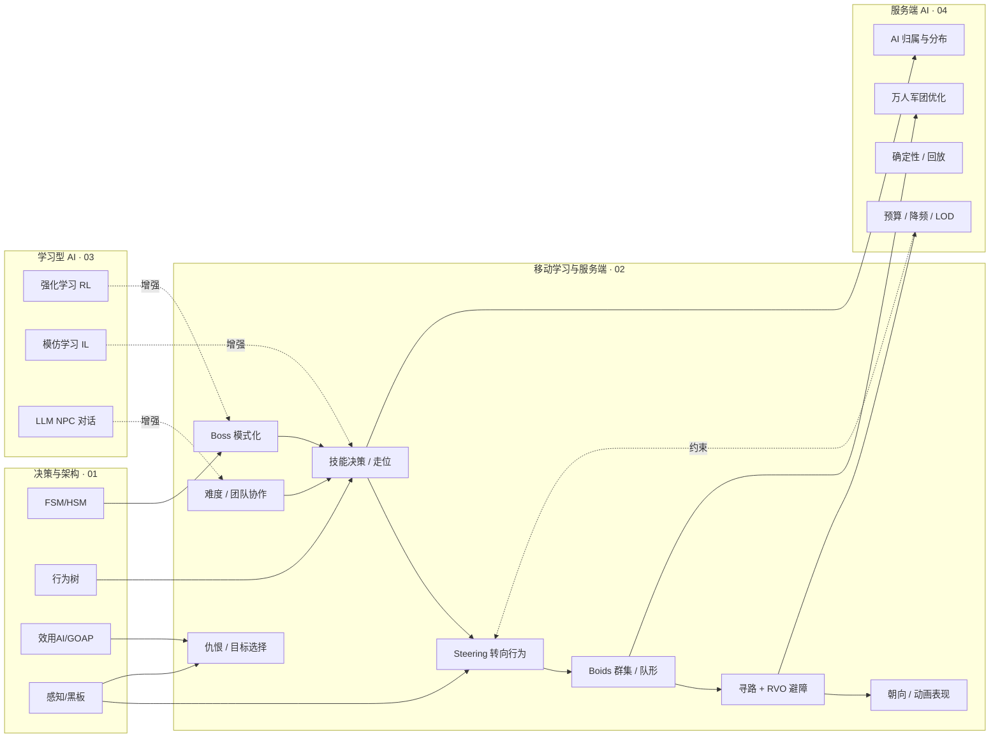

# 游戏AI「移动学习与服务端」知识库

> 本目录聚焦游戏 AI 的**行动层与工程落地**：AI 决定"做什么"之后如何"动起来"（移动与群组行为）、如何在战斗中表现得聪明且有观赏性（战斗与 Boss 设计）、如何借助机器学习让 AI 自己"学会"（学习型 AI）、以及当玩家数量与 AI 数量都暴涨时如何在服务端把 AI 跑起来（服务端 AI 与性能）。
>
> 内容为**引擎无关的通用原理 + 通用伪代码**，面向全栈游戏开发者：客户端程序、服务端程序、AI 策划、技术策划均可阅读。凡涉及 UE 具体实现处，一律指路到 [游戏知识/05-AI系统](../../游戏知识/05-AI系统/README.md)，本目录不重复撰写引擎代码。

---

## 一、分类简介

决策与架构目录回答"AI 想做什么"，本目录回答"AI 怎么把事做成、怎么做得好、怎么扛得住"：

1. **移动层**：把"决策结果"翻译成连续的运动——Steering Behaviors（转向行为）、Boids 群集、队形保持、寻路与避障的结合、朝向与动画表现。这是所有动作型 AI 的地基，RTS 编队、MMO 怪物、开放世界 NPC 都依赖它。
2. **战斗层**：把"战斗意图"翻译成行为——仇恨系统、目标选择、技能决策、走位、Boss 模式化设计、难度曲线、团队协作、打击感反馈。它建立在决策层（行为树/效用 AI）之上，是"玩家体验 AI"最直接的窗口。
3. **学习层**：让 AI 从数据中习得行为——强化学习（MDP/策略/奖励）、Unity ML-Agents 与 UE 的 ML 实践、模仿学习、LLM 大模型 NPC 对话，以及这些技术在真实项目中的落地案例与局限。
4. **工程层**：让 AI 在大规模下还能跑——MMO/服务器 AI 架构、AI 预算与降频（分帧/距离 LOD）、确定性 AI 与回放、AI 调试（可视化/日志/统计）、万人军团级 AI 的优化策略。

---

## 二、文件列表

| 文件 | 一句话简介 |
| --- | --- |
| [01-移动与群组行为.md](01-移动与群组行为.md) | Steering Behaviors（seek/flee/arrive/pursue/evade/wander/避障）、Boids 群集三力、队形保持（槽位/偏移跟随）、寻路+RVO 局部避障的层次结合，以及朝向与动画的移动表现层 |
| [02-战斗与Boss设计.md](02-战斗与Boss设计.md) | 仇恨系统/目标选择/技能决策/走位、Boss 阶段切换与技能序列与狂暴、难度曲线与动态难度、战术与团队协作 AI、打击感与 AI 反馈 |
| [03-学习型AI.md](03-学习型AI.md) | 强化学习基础（MDP/策略/奖励/PPO）、Unity ML-Agents 与 UE ML 实践简述、模仿学习（BC/GAIL/DAgger）、LLM NPC 对话简述，以及落地案例与局限 |
| [04-服务端AI与性能.md](04-服务端AI与性能.md) | MMO/服务器 AI 分布与归属、AI 预算与降频（分帧/距离 LOD）、确定性 AI 与回放、AI 调试三件套、万人团战与军团的规模化优化 |
| [05-玩家建模与自适应难度.md](05-玩家建模与自适应难度.md) | 玩家建模（技能/偏好/挫败/无聊推断）、DDA 策略谱系（显式参数/隐式帮助）、难度决策状态机、隐私合规与 A/B 验证 |
| [06-多智能体协作与强化学习.md](06-多智能体协作与强化学习.md) | 角色分工/任务分配/协商联盟/通信协议经典协作、MARL 三大范式（IQL/QMIX/MAPPO/MADDPG）、信用分配与服务端大规模协作 |

---

## 三、学习顺序建议

### 推荐路径（从单兵到军团）

1. **先读 [01-移动与群组行为.md](01-移动与群组行为.md)**
   - 移动层是行动层的基础：即使只做 Boss 战，Boss 的"走位"也依赖 arrive/strafe/避障；
   - 重点掌握"决策输出目标 → 移动层平滑执行"的分层思想，以及三个力（seek/arrive/群集）的数学直觉。
2. **再读 [02-战斗与Boss设计.md](02-战斗与Boss设计.md)**
   - 在会"动"的基础上学"打"：仇恨、技能决策、Boss 模式化是 MMO/动作游戏 AI 的核心；
   - 需要时回头查阅 [01-决策与架构](../01-决策与架构/README.md) 中的行为树/效用 AI 章节作为决策实现手段。
3. **接着读 [04-服务端AI与性能.md](04-服务端AI与性能.md)**
   - 单机 AI 成立后，立刻要回答"多 Agent 并发下怎么不卡"：预算、降频、LOD、确定性；
   - 建议与 01 的群组部分对照阅读——军团 AI 就是"移动层 + 服务端预算"的合体。
4. **最后读 [03-学习型AI.md](03-学习型AI.md)**
   - 学习型 AI 是"锦上添花"与"探索方向"：先有手写 AI 的基线，再用学习型方法补足表现力；
   - 理解 RL/IL/LLM 的边界，避免在需要确定性（对战公平、回放）的场景误用。

### 与 [游戏AI/01-决策与架构](../01-决策与架构/README.md) 的关系

- **01 是"大脑"，本目录是"手脚 + 身体 + 血管"**：01 回答感知与决策（FSM/行为树/效用 AI/GOAP），本目录把决策结果变成移动、战斗行为，并解决规模化工程问题；
- 读 02-战斗与Boss设计 前，建议先掌握 01 的 [03-行为树通用原理](../01-决策与架构/03-行为树通用原理.md) 与 [04-Utility与GOAP](../01-决策与架构/04-Utility与GOAP.md)——技能决策与目标选择通常就是它们的应用；
- 读 01-移动与群组行为 前，建议先了解 01 的 [01-AI总体架构与感知](../01-决策与架构/01-AI总体架构与感知.md)——"感知 → 决策 → 行动"循环中，移动层就是最后的"行动"出口。

### 与 [游戏知识/05-AI系统](../../游戏知识/05-AI系统/README.md)（UE 知识库）的关系

- 本目录讲**通用原理与伪代码**，UE 目录讲 **UE 蓝图/C++ 具体实现**，两者是"为什么"与"怎么做"的关系；
- 01-移动与群组行为 → 对照 UE 的 [03-NavMesh寻路.md](../../游戏知识/05-AI系统/03-NavMesh寻路.md)（NavMesh/A* 的 UE 实现、避障组件）与 [02-感知系统与EQS.md](../../游戏知识/05-AI系统/02-感知系统与EQS.md)（EQS 找掩体/站位，常用于战斗走位）；
- 02-战斗与Boss设计 → 对照 UE 的 [01-行为树详解.md](../../游戏知识/05-AI系统/01-行为树详解.md)（把"技能决策/Boss 阶段机"落到 Behavior Tree + 黑板）；
- 03-学习型AI → UE 侧 ML 实践（ML Deformer、插件生态）以官方文档为准，本目录只做原理简述；
- 04-服务端AI → 服务端一般不依赖 UE 客户端框架，但"AI 预算、分帧、LOD"思想与 UE 的 AI 感知分帧、NavMesh 分区优化同源，可互相印证。

### 快速上手（时间有限时）

- 只想让 AI "会走路不撞墙"：读 01 的 Steering + 寻路避障小节；
- 正在做 Boss 战/副本 AI：读 02 全文 + 01 的走位相关小节；
- 正在做 MMO/大世界：读 04 全文 + 01 的群组小节；
- 对机器学习好奇：直接读 03，前 3 节建立概念即可，不必深究数学推导。

---

## 四、知识地图（Mermaid）

---

## 五、目录间的关系总览

| 需求场景 | 本目录要读 | 联动目录 |
| --- | --- | --- |
| RTS 编队 / 军团移动 | 01 的 Boids 与队形、04 的军团优化 | 01-决策与架构 的 01（感知） |
| MMO 怪物 AI | 02 的仇恨与技能决策、04 的 AI 归属 | 01-决策与架构 的 03/04（行为树/效用） |
| 动作游戏 Boss | 02 全文、01 的走位 | UE 05-AI系统 的 01（行为树） |
| 开放世界 NPC | 01 的避障与表现层、04 的预算 LOD | UE 05-AI系统 的 03（NavMesh） |
| 对战/回放公平性 | 04 的确定性 AI | 01-决策与架构 的 01（分帧） |

> 建议：阅读本目录时始终带着"**性能**"这条暗线——移动层的每个力、战斗层的每次决策、服务端的每个 tick，都要问一句"它值多少微秒/多少 Agent"。
