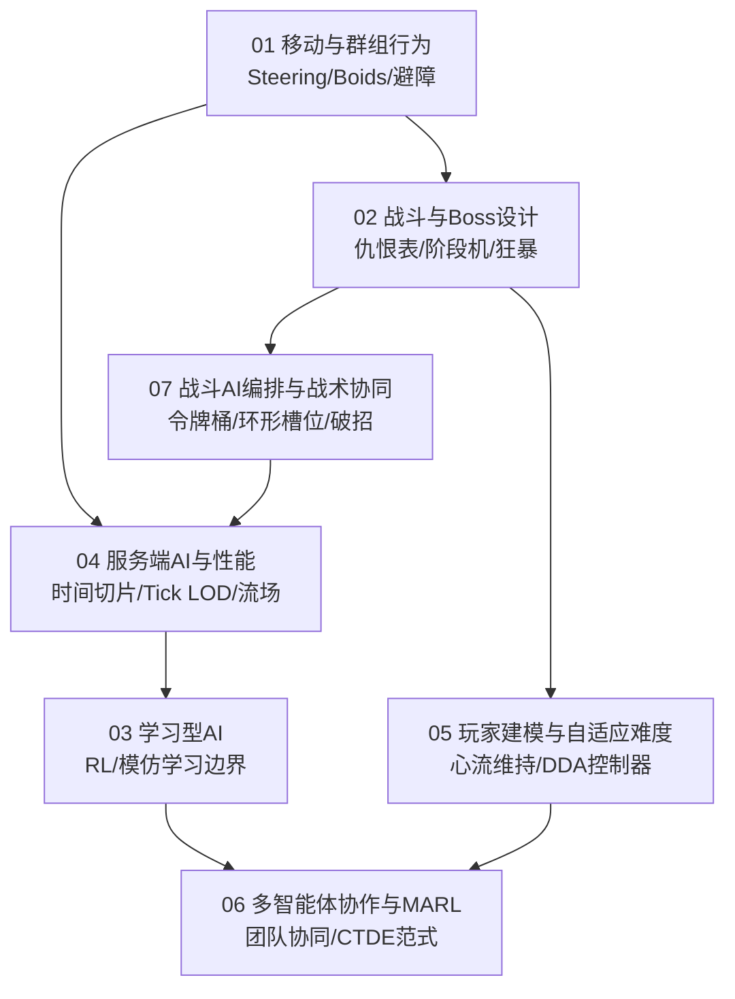
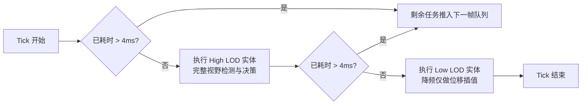

# 02 移动学习与服务端

> 知识成熟度：L2（子域工程手册，已按 7 篇核心专题、服务端调度与移动协同拓扑全面标准化）。
>
> 领域权威导航：[游戏 AI Domain MOC](../../00_Index/domains/游戏AI.md) ｜ [游戏 AI 领域总手册](../README.md)。

---

## 1. 核心定位与设计思想

「02-移动学习与服务端」负责游戏 AI 的**行动执行层、大规模服务端并发工程与智能体进化层（Locomotion, Server Scaling & Learning）**。

在游戏研发中，“决定做什么”只是第一步，“怎么把动作做漂亮、怎么在大规模下不卡顿、怎么让 AI 具备学习进化能力”才是决定产品品质的胜负手：

- **平滑运动与仿生群聚（Locomotion & Flocking）**：将寻路输出的折线航点，通过 Reynolds Steering Behaviors（Seek/Arrive/Wander/避障）转化为平滑自然的向心力、离心力与转向力；借助 Boids 三法则（分离、对齐、凝聚）与动态包围圈槽位，实现令人惊叹的鱼群、鸟群与战术包围表现；
- **战斗编排与战术协同（Combat Director & Ring Slots）**：打破单体 AI 围殴风暴，建立中央战斗导演、攻击欲望令牌桶（Attack Token Bucket）、三层动态环形包围圈（Multi-Ring Slots）以及视锥盲区降权减压机制；
- **战斗与 Boss 体验工程**：超越生硬的“数值堆砌”，构建包含仇恨衰减表、目标动态加权、招式发号施令、阶段狂暴转换与攻击预警的工业级 Boss 战斗体系；
- **服务端大规模 AI 调度与时间预算**：针对 MMO 与万人大世界，确立权威服务器架构（Server Authority）、单帧时间切片（Time Slicing）、距离与可见性 Tick LOD 降频、以及基于流场寻路（Flow Field）的军团级性能优化方案；
- **学习型智能体与多智能体协作**：跨越手写规则的局限，探索强化学习（RL）、模仿学习（IL）、玩家建模动态难度自适应（DDA）以及多智能体强化学习（MARL/CTDE）在真实商业项目中的应用边界与落地约束。

---

## 2. 专题矩阵与知识状态

| 专题文件（Canonical 路径） | 知识类型 | 成熟度 | 核心工程关注点与落地场景 |
| :--- | :---: | :---: | :--- |
| [01-移动与群组行为.md](01-移动与群组行为.md) | Mechanism | L2 | Reynolds 转向力模型（Seek/Arrive/Wander）、Boids 群聚三法则、队形保持与槽位分配、全局寻路与局部 RVO 避障分工 |
| [02-战斗与Boss设计.md](02-战斗与Boss设计.md) | BestPractice | L2 | 仇恨系统（伤害/治疗/距离复合加权与衰减）、动态包围圈槽位竞争、Boss 阶段转换机、招式节奏与打击反馈 |
| [03-学习型AI.md](03-学习型AI.md) | Tutorial | L2 | 游戏强化学习（RL）工程落地、MDP/PPO/DQN 状态动作空间设计、奖励函数反模式、模仿学习与商业化落地边界 |
| [04-服务端AI与性能.md](04-服务端AI与性能.md) | Architecture | L2 | 服务端权威架构与输入校验、单帧时间切片分帧（Time Slicing）、Tick LOD 距离降频、万人流场寻路优化 |
| [05-玩家建模与自适应难度.md](05-玩家建模与自适应难度.md) | Mechanism | L2 | 玩家技能特征提取、挫败感与无聊感度量、DDA 动态难度控制器设计、心流区间维持与隐式帮扶 |
| [06-多智能体协作与强化学习.md](06-多智能体协作与强化学习.md) | Research | L2 | 经典小队协作模式（角色分工/集火/换坦）、MARL 范式（CTDE/MAPPO/QMIX）、通信开销治理与服务端部署 |
| [07-战斗AI编排与战术协同.md](07-战斗AI编排与战术协同.md) | Architecture | L2 | 动作战斗导演（Combat Director）、攻击欲望令牌桶（Attack Tokens）、三层环形包围槽位（Ring Slots）、视锥盲区减压与动作破招协同 |

---

## 3. 逻辑学习顺序与推导闭环

```mermaid
flowchart TD
    A[01 移动与群组行为<br/>Steering/Boids/避障] --> B[02 战斗与Boss设计<br/>仇恨表/阶段机/狂暴]
    B --> G[07 战斗AI编排与战术协同<br/>令牌桶/环形槽位/破招]
    A --> C[04 服务端AI与性能<br/>时间切片/Tick LOD/流场]
    G --> C
    B --> D[05 玩家建模与自适应难度<br/>心流维持/DDA控制器]
    C --> E[03 学习型AI<br/>RL/模仿学习边界]
    E --> F[06 多智能体协作与MARL<br/>团队协同/CTDE范式]
    D --> F
```

1. **第一阶段（单体与群组运动基础）**：先读 `01-移动与群组行为`，建立“力驱动运动”的直觉，搞清楚为什么寻路（Pathfinding）和运动执行（Steering）必须分层；
2. **第二阶段（单体战斗与商业 Boss 落地）**：精读 `02-战斗与Boss设计`，深入仇恨管理算法与 Boss 技能招式节奏；
3. **第三阶段（群体战斗导演与战术协同）**：攻坚 `07-战斗AI编排与战术协同`，掌控攻击欲望令牌桶防无脑围殴、三层环形槽位防堆叠扎堆、视野盲区减压以及动作破招失衡联动；
4. **第四阶段（服务端吞吐量与性能硬仗）**：深研 `04-服务端AI与性能`，学习如何把 5000 只怪物压缩在 5ms CPU 帧预算内，掌握分帧更新、Tick 降频与流场寻路；
5. **第五阶段（自适应调节与前沿智能体）**：
   - 提升玩家体验与防挫败：研读 `05-玩家建模与自适应难度`；
   - 引入机器学习辅助：研读 `03-学习型AI` 与 `06-多智能体协作与强化学习`。

---

## 4. 移动、战斗与服务端调度工程落地

### 4.1 运动控制技术分层
- **全局规划层（Macro Path）**：在 NavMesh 或网格图上运行 A* / JPS，获得关键拐角点序列（Waypoints）；
- **局部平滑层（Funnel / Steering）**：利用漏斗算法拉平折线，使用 Arrive 与 Seek 行为产生平滑速度矢量；
- **局部避障层（Micro Avoidance）**：利用 RVO / ORCA 计算避让圆锥，在不改变宏观目标的前提下互相错车，避免集群拥堵。

### 4.2 服务端时间预算与降级契约
在服务端主循环中，AI 运算必须被严格限制在时间预算内（如每 Tick 预留 4ms）：

```mermaid
flowchart LR
    Start[Tick 开始] --> Check{已耗时 > 4ms?}
    Check -- 否 --> RunHigh[执行 High LOD 实体<br/>完整视野检测与决策]
    Check -- 是 --> Yield[剩余任务推入下一帧队列]
    RunHigh --> Check2{已耗时 > 4ms?}
    Check2 -- 否 --> RunLow[执行 Low LOD 实体<br/>降频仅做位移插值]
    Check2 -- 是 --> Yield
    RunLow --> End[Tick 结束]
```

- **距离分级（Distance LOD）**：离玩家 0~20m（Tick 0.1s），20~50m（Tick 0.5s），50m 以上仅更新状态机不跑物理；
- **流场寻路（Flow Field）**：当几百个单位涌向同一目标时，从目标点反向生成一次 Dijkstra 势能场，所有单位直接读取网格矢量，寻路复杂度从 $O(K \cdot N \log N)$ 骤降到 $O(N)$。

---

## 5. 跨域技术依赖与前后置导航

- **向上承接（认知决策输入）**：
  - 决策大脑与意图下发：[01-决策与架构/01-AI总体架构与感知](../01-决策与架构/01-AI总体架构与感知.md)
  - 战斗技能抉择机制：[01-决策与架构/03-行为树通用原理](../01-决策与架构/03-行为树通用原理.md) 与 [01-04 Utility与GOAP](../01-决策与架构/04-Utility与GOAP.md)
- **横向协同（动作系统与打击手感）**：
  - 动作连招打断与受击霸体：[游戏知识 04-08 动作战斗系统与打击手感](../../游戏知识/04-动画系统/08-动作战斗系统与打击手感.md)
- **向下扎根（算法与底层实现）**：
  - 寻路算法与网格烘焙：[游戏算法 01-寻路与图论/02-A星算法与优化](../../知识/02-数学与游戏算法/路径搜索与导航/02-A星算法与优化.md)
  - 流场群体算法原理：[游戏算法 01-寻路与图论/03-流场与群体寻路](../../知识/02-数学与游戏算法/路径搜索与导航/03-流场与群体寻路.md)
  - 路径平滑与转向行为算法：[游戏算法 03-04 路径平滑与转向行为](../../知识/02-数学与游戏算法/路径搜索与导航/04-路径平滑与转向行为.md)
- **服务端世界模拟联动**：
  - 权威服务端时间切片机制：[游戏服务端 06-11 AI与寻路时间预算](../../游戏服务端/06-世界模拟与运行时/11-AI与寻路时间预算.md)
  - 房间与战场匹配调度：[游戏服务端 03-04 匹配与房间系统](../../游戏服务端/03-业务系统设计/04-匹配与房间系统.md)
- **虚幻引擎客户端落地**：
  - UE NavMesh 与寻路组件：[游戏知识 05-03 NavMesh寻路](../../游戏知识/05-AI系统/03-NavMesh寻路.md)
  - UE Mass 海量群集框架：[游戏知识 05-04 Mass实体框架与群集模拟](../../游戏知识/05-AI系统/04-Mass实体框架与群集模拟.md)
  - Lyra 团队机器人协调源码：[游戏知识 12-46 Lyra-AI机器人与队伍源码](../../游戏知识/12-引擎源码分析/46-Lyra-AI机器人与队伍源码.md)
- **端到端战局实战**：
  - 商业 MMO 假人 AI 全链路：[系统实战 07-假人AI完整链路](../../系统实战/07-假人AI完整链路.md)
