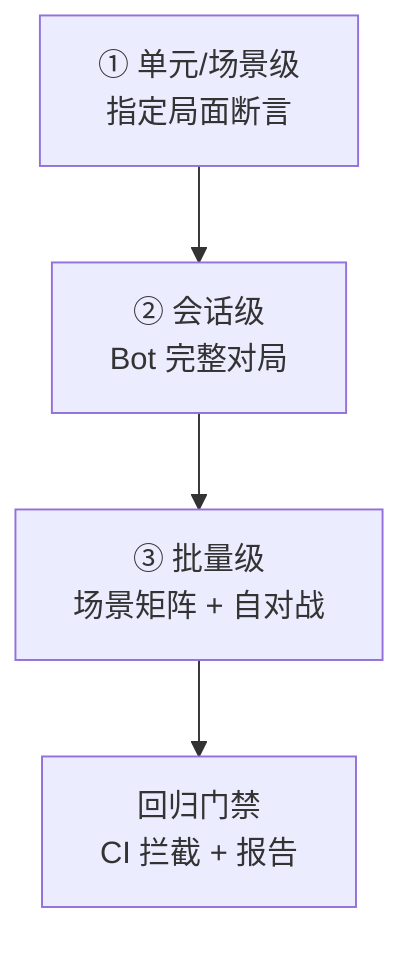
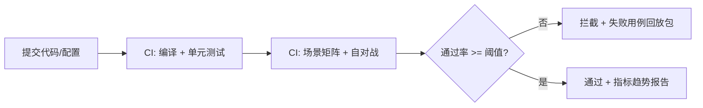

# 自动测试玩家与 AI 回归基准（Playtesting Bots）

> 知识基线：引擎无关的游戏 AI 通用方法；本文覆盖"谁来跑测试、怎么批量跑"的执行层——自动测试玩家（Bot）、自对战、场景矩阵批量执行、AI 回归基准与门禁；与[01-AI评测回放与LLM安全.md](01-AI评测回放与LLM安全.md)（评测指标/回放证据链）构成"指标定义 → 执行与回归"闭环；涉及 UE 的实现以[游戏知识/05-AI系统/README.md](../../游戏知识/05-AI系统/README.md)为交叉验证边界。
> 适用范围：AI 系统的自动化验收（行为树/状态机/效用/MARL 策略）、战斗平衡回归、关卡可玩性测试、服务端 AI 压力验证、以及 CI 中的 AI 回归门禁。
> 事实边界：Bot 框架/回放断言/回归门禁为通用工程方法，无标准 API；UE 侧的 Automation/Gauntlet 能力参见[游戏测试与质量](../../游戏测试与质量/README.md)与 UE 官方文档；测试覆盖与通过标准需按项目场景定义，不存在万能阈值。
> 最后更新：2026-08-07。
> 参考来源：[Unreal Engine: Automated Testing](https://dev.epicgames.com/documentation/en-us/unreal-engine/automated-testing-in-unreal-engine)、[Wikipedia: Software performance testing](https://en.wikipedia.org/wiki/Software_performance_testing)。

> 评测篇定义了"测什么、什么算好"（指标与回放证据链），本文回答"**谁来跑、怎么批量跑**"：用自动测试玩家（Bot）代替人工反复试玩，用自对战与场景矩阵批量覆盖，把 AI 行为回归变成 CI 里可重复、可门禁的工程流程。

---

## 一、概述

### 1.1 为什么需要自动测试玩家

- **回归**：AI 调参/改逻辑后，旧行为可能悄悄退化（NPC 不会绕墙了、Boss 连招失效）；
- **规模**：人工测试无法覆盖"全角色 × 全场景 × 全难度"组合；
- **可重复**：Bot 脚本可复现同一局面，比较改动前后行为差异；
- **门禁**：AI 行为纳入 CI，改动不合规直接拦截，而不是上线后被玩家发现。

### 1.2 三层体系



*图释：AI 自动化测试三层体系——从单点断言到批量矩阵，最后进入 CI 门禁。*

---

## 二、核心概念

| 概念 | 英文 | 一句话定义 | 示例 |
| --- | --- | --- | --- |
| 自动测试玩家 | Playtesting Bot | 脚本化玩家行为模拟器 | 自动走位/攻击/交互 |
| 自对战 | Self-play | AI 与自己（或同族）对战 | 两个 AI 打一场 |
| 场景矩阵 | Scenario Matrix | 参数组合生成的测试用例集 | 角色×地图×难度 |
| 固定回归集 | Fixed Regression Set | 长期不变的基准用例集合 | 100 个经典局面 |
| 断言 | Assertion | 对行为的硬性检查 | 10 秒内到达目标点 |
| 行为轨迹 | Behavior Trace | 记录决策与状态的日志 | 每帧决策快照 |
| 回归门禁 | Regression Gate | CI 中拦截行为退化的检查 | 基准通过率 < 95% 拦截 |
| 黄金回放 | Golden Replay | 标注为正确的回放基准 | 人工验证过的回放 |
| 混沌注入 | Chaos Injection | 随机扰动输入验证鲁棒性 | 随机延迟/丢包 |

---

## 三、原理详解

### 3.1 Bot 设计

#### 3.1.1 Bot 形态

| 形态 | 做法 | 用途 |
| --- | --- | --- |
| 脚本 Bot | 预写动作序列（走位→攻击→交互） | 关卡流程测试 |
| 决策 Bot | 复用游戏 AI 决策逻辑，随机化参数 | 行为覆盖测试 |
| 玩家模拟 Bot | 模拟人类输入节奏（反应延迟/精度噪声） | 平衡与难度测试 |
| 无头 Bot | 无渲染运行（服务端/CI） | 批量回归 |

#### 3.1.2 关键设计

- **可注入输入**：Bot 通过统一输入接口（移动/瞄准/技能/交互）驱动，与真实玩家同路径（防"测试走捷径"）；
- **可观测输出**：每帧记录状态快照（位置/血量/决策），形成行为轨迹；
- **确定性种子**：随机数种子可控，同一种子复现同一局（见[游戏算法/03-工程与实用技巧/01-随机数与洗牌算法.md](../../游戏算法/03-工程与实用技巧/01-随机数与洗牌算法.md)）；
- **超时与自杀**：卡死检测（位置不变 N 秒）自动结束并标记失败。

### 3.2 断言与行为指标

```text
// 伪代码：场景断言（节选/示意）
def assert_scenario(rec):
    # 目标性：是否在时限内达成目标
    assert rec.time_to_objective < 30s
    # 有效性：是否有效使用技能（非站桩）
    assert rec.skill_usage_rate > 0.3
    # 存活/代价：失败次数与承伤
    assert rec.deaths < 2
    # 一致性：与黄金回放的关键帧偏差
    assert frame_distance(rec, GOLDEN) < 0.15
```

指标来源：**行为正确性**（达成目标）、**效率**（时间/资源）、**稳定性**（方差）、**与黄金回放的相似度**（防"换了个打法但结果碰巧通过"）。

### 3.3 场景矩阵与批量执行

```text
// 伪代码：场景矩阵生成（节选/示意）
matrix = product(
    maps=[map_a, map_b, map_c],
    enemies=[easy, normal, hard],
    bots=[melee_bot, ranged_bot, mixed],
    seeds=[1..10],
)
for case in matrix:
    result = run_case(case)         // 无头运行 + 轨迹记录
    report.add(result)
```

工程要点：

- **组合爆炸控制**：全组合可能上万——用"全组合 × 少量种子 + 关键组合 × 更多种子"分层；
- **并行执行**：无头进程并行跑（注意 CPU 核数与资源隔离）；
- **失败分类**：超时/崩溃/断言失败/性能超限分门别类，不混为一谈；
- **增量运行**：CI 只跑受影响模块相关场景（全量跑放夜间）。

### 3.4 自对战与平衡回归

- **同族对战**：新 AI 与旧 AI 对战 N 局，胜率漂移超阈值即告警（行为回归的强信号）；
- **跨配置对战**：不同参数版本互打，量化参数敏感性；
- **平衡性回归**：角色/职业胜率矩阵（A vs B vs C），配合[04-匹配与房间系统](../../游戏服务端/03-业务系统设计/04-匹配与房间系统.md)的数据验证。

### 3.5 回归门禁与报告



*图释：AI 回归门禁流程——批量测试结果低于阈值即拦截，并产出失败用例的回放包供定位。*

门禁阈值建议：**核心场景 100% 通过（硬门禁）+ 全量场景通过率趋势（软告警）**；阈值按项目历史数据定，避免拍脑袋。

### 3.6 与人工测试、线上观测的关系

- 自动化覆盖"可断言、可复现"的部分；
- 人工测试覆盖"手感、演出、氛围"等主观部分；
- 线上观测（玩家行为数据）发现自动化漏网问题 → 沉淀为新回归用例（闭环）。

### 3.7 混沌注入与鲁棒性测试

确定性测试之外，用**受控随机扰动**验证 AI 在非理想条件下的鲁棒性：

```text
// 伪代码：混沌注入（节选/示意）
def run_with_chaos(case, chaos_level):
    injector = ChaosInjector(seed=case.seed)
    injector.add(InputDelay(mean=50ms, jitter=30ms))      // 输入延迟
    injector.add(ActionFailure(rate=0.05))                // 动作偶发失败
    injector.add(ObservationNoise(0.02))                  // 感知噪声
    injector.add(TargetJitter(0.1))                       // 目标位置抖动
    return run_case(case, injector)
```

注入维度：输入延迟/丢失、动作失败、感知噪声、目标抖动、环境扰动（障碍物移位）。

判定：混沌级别下行为指标允许退化（如时间放宽 30%），但不允许**定性失败**（卡死/违反安全规则）。

### 3.8 报告与趋势看板

- **每次运行**：用例/种子/版本/结果/轨迹摘要 → 入库；
- **趋势看板**：通过率、平均得分、P50/P99 耗时按版本趋势图；
- **失败聚类**：相似失败（同地图/同角色/同断言）自动聚合，减少噪音；
- **门禁报告**：每次 CI 输出"核心通过率 + 全量通过率 + 新增失败用例列表"。

### 3.9 与 RL 训练环境的复用

- Bot harness 与 RL 训练环境共用"环境接口"（观察/动作/重置），一份环境两用；
- 回归集可直接作为 RL 评估集（评估时冻结策略）；
- 黄金回放可作为模仿学习（BC）的训练数据源；
- 注意：RL 训练需要高随机性，回归测试需要确定性——用同一环境 + 种子开关切换（见[03-学习型AI.md](../02-移动学习与服务端/03-学习型AI.md)）。

---

## 四、伪代码/示例：回归框架骨架

```text
// 伪代码：AI 回归框架（节选/示意）
class AiRegression:
    def run_suite(self, cases, parallel=8):
        results = pool.map(self.run_one, cases, parallel)
        gate = self.evaluate(results)
        self.emit_report(results, gate)
        return gate.passed

    def run_one(self, case):
        world = launch_headless(case.map, case.seed)
        spawn_bots(case.bots)
        trace = world.run_until(end_condition, timeout=case.timeout)
        return evaluate_case(case, trace)

    def evaluate(self, results):
        core = [r for r in results if r.case.is_core]
        core_pass = all(r.ok for r in core)
        overall = mean(r.score for r in results)
        return Gate(passed=core_pass and overall >= 0.95,
                    report=build_report(results))
```

---

## 五、最佳实践

1. **从 10 个核心场景起步**：先覆盖"每个 AI 类型至少一个黄金场景"，再谈矩阵。
2. **黄金回放人工验收**：每个核心场景的"正确行为"必须人工确认过，否则断言无意义。
3. **种子与版本入报告**：回放包必须能复现（记录种子、版本、输入序列）。
4. **断言少而准**：每场景 3~5 个高价值断言，避免"测试通过但没测到东西"。
5. **失败即回放**：任何失败自动产出回放文件 + 关键帧截图，定位成本降一个量级。
6. **矩阵分层**：全组合 × 少种子（回归）+ 关键组合 × 多种子（稳定性）。
7. **性能并入回归**：同场景记录帧耗时/P50/P99，性能劣化与行为退化一并拦截。
8. **随机扰动**：混沌注入（延迟/输入噪声）验证 AI 鲁棒性，防止"只在确定性环境能过"。
9. **门禁渐进**：先软告警（报告不拦截），稳定后转硬门禁；避免第一天就拦死开发。
10. **与评测指标一致**：Bot 用的指标与[01-评测篇](01-AI评测回放与LLM安全.md)的指标表同源，避免两套标准。

---

## 六、常见问题 FAQ

1. **Q：Bot 测试和单元测试什么区别？** A：单元测试测函数逻辑；Bot 测试测"AI 在游戏里的整体行为"，需要完整环境与回放。
2. **Q：测试 Bot 和游戏 AI 是同一套代码吗？** A：玩家模拟 Bot 复用输入接口；测试驱动的决策 Bot 可直接复用 AI 决策代码（配置不同参数）。
3. **Q：场景太多跑不完怎么办？** A：分层——CI 增量跑核心集，夜间全量；并行无头进程摊薄时间。
4. **Q：AI 有随机性怎么断言？** A：固定种子 + 统计断言（跑 10 局看均值/分布），而非单局断言。
5. **Q：回放文件太大？** A：只存输入序列 + 种子 + 版本（确定性系统可完整复现），不存全量帧数据。
6. **Q：怎么防止"测试通过但行为变蠢"？** A：黄金回放相似度断言 + 自对战胜率漂移检测双保险。
7. **Q：Bot 测试能测手感吗？** A：不能——手感留给人工测试；Bot 测可量化部分（到达率/用时/死亡率）。
8. **Q：门禁阈值设多少？** A：核心场景 100% + 全量通过率 ≥95%（按历史数据校准），初期可先软告警。
9. **Q：服务端 AI 怎么测？** A：无头多进程 + 固定种子并行跑，复用本文框架；规模压测见[游戏测试与质量/03-服务端测试与机器人压测.md](../../游戏测试与质量/03-服务端测试与机器人压测.md)。
10. **Q：上线后还要跑吗？** A：要——每次 AI/关卡/数值改动都跑；线上异常沉淀为新用例，形成回归闭环。

---

## 七、关联阅读

- 本分类：[01-AI评测回放与LLM安全.md](01-AI评测回放与LLM安全.md) —— 指标定义、回放证据链与门禁口径（本文的执行层配套）；
- 移动学习：[03-学习型AI.md](../02-移动学习与服务端/03-学习型AI.md) —— RL 训练环境与测试 harness 复用；
- 移动学习：[06-多智能体协作与强化学习.md](../02-移动学习与服务端/06-多智能体协作与强化学习.md) —— 多智能体协作的批量测试；
- 测试体系：[游戏测试与质量/03-服务端测试与机器人压测.md](../../游戏测试与质量/03-服务端测试与机器人压测.md) —— 服务端压测与机器人体系；
- 算法：[游戏算法/04-确定性与基准工程/01-动态寻路确定性与基准测试.md](../../游戏算法/04-确定性与基准工程/01-动态寻路确定性与基准测试.md) —— 确定性、种子与回放的方法论；
- UE 侧：[游戏知识/05-AI系统/README.md](../../游戏知识/05-AI系统/README.md) —— UE AI 自动化测试指路。

---

## 更新日志

- 2026-08-07：初稿。补齐"自动测试玩家与 AI 回归基准"空白（P1）；涵盖 Bot 形态设计、断言与行为指标、场景矩阵批量执行、自对战平衡回归、CI 门禁与回放闭环；引擎无关通用层。

## 落地检查清单

### 常见反模式

1. **Bot 与真实玩家行为差距过大**：只做登录挂机或脚本化操作，测不出真实负载与平衡问题。
2. **无确定性输入**：随机种子/时钟不固定，失败无法复现。
3. **场景矩阵一成不变**：只跑固定集，新玩法/新地图未纳入回归。
4. **门禁一刀切**：产品失败与测试基础设施失败混为一谈，误阻断发布。
5. **回放证据缺失**：失败后只有一句"测试失败"，无法定位。
6. **测试环境与训练环境漂移**：harness 两套实现，行为不一致。
7. **批量执行无资源隔离**：并行测试互相干扰，结果不可信。
8. **只测通过不测失败路径**：AI 拒绝、超时、异常分支无覆盖。

### 补充：门禁分级示意

```text
提交级：单场景冒烟（< 2 分钟）
合入级：核心场景回归（含自对战基线）
版本级：全量场景矩阵 + 长稳 + 平衡报告
发布级：线上灰度观测 + 回放抽样
```

分级是方案示意，具体阈值按项目节奏与资源设定。

### 补充：指标基线表

| 指标 | 基线（示意） | 失败动作 |
| --- | --- | --- |
| 自对战胜率偏差 | 新旧版本差异 < 5% | 审查平衡改动 |
| 场景完成率 | >= 99% | 阻断合入 |
| 行为违规率 | = 0 | 阻断发布 |
| 回放可复现率 | 100% | 修复确定性 |
| 平均模拟耗时 | < 预算 | 优化场景或降并发 |

基线值是方案示意，按项目目标与历史数据校准。

- [ ] Bot 形态明确：规则 AI / 行为脚本 / RL 策略，各自适用范围与维护者。
- [ ] Bot 可注入随机种子与时钟，回放可复现（联动 01 篇回放确定性）。
- [ ] 场景矩阵覆盖：固定回归集、随机集、对抗集、极端边界（满员/空场/高负载）。
- [ ] 断言与行为指标定义明确（胜率/完成率/资源效率/违规行为）。
- [ ] 自对战用于平衡回归：多版本基线对比，差异超阈值触发审查。
- [ ] 批量执行有调度与资源隔离：并行度、超时、失败重试与证据留存。
- [ ] CI 门禁分级：提交级冒烟、合入级回归、版本级全量。
- [ ] 回放证据链：失败用例自动附带输入/种子/状态哈希/日志。
- [ ] 与 RL 训练环境复用同一 harness，避免"测试环境"与"训练环境"漂移。
- [ ] 报告含首次失败与最终结果，失败分类（产品/测试/基础设施）不混淆。

### 术语速查

| 术语 | 英文 | 一句话解释 |
| --- | --- | --- |
| 自动测试玩家 | Playtesting Bot | 模拟玩家行为的自动化测试代理 |
| 自对战 | Self-play | AI 与自己对战以发现平衡问题 |
| 场景矩阵 | Scenario Matrix | 覆盖多条件的批量测试组合 |
| 回归基准 | Regression Baseline | 防止 AI 行为退化的指标基线 |
| Harness | Test Harness | 驱动被测对象并采集证据的框架 |
| 证据链 | Evidence Chain | 输入/种子/日志/状态的完整复现信息 |
| 门禁分级 | Gate Tier | 提交/合入/版本三级质量门禁 |
| 失败分类 | Failure Taxonomy | 产品/测试/基础设施三类失败归因 |
