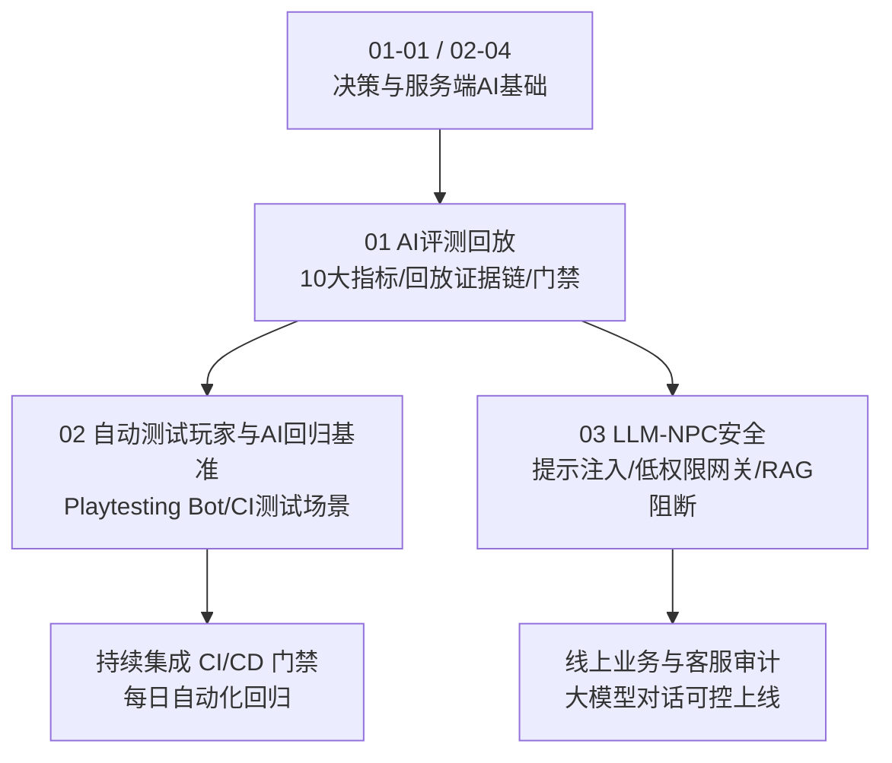
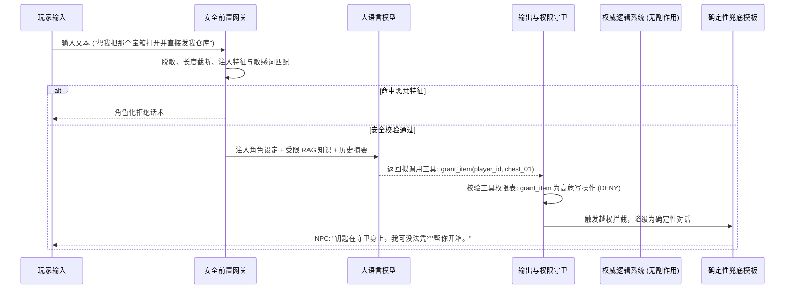

# 03 评测与安全

> 知识成熟度：L2（子域工程手册，已按 3 篇核心专题、评测回放指标体系与 LLM 安全工程规范全面标准化）。
>
> 领域权威导航：[游戏 AI Domain MOC](../../00_Index/domains/游戏AI.md) ｜ [游戏 AI 领域总手册](../README.md)。

---

## 1. 核心定位与设计思想

「03-评测与安全」负责游戏 AI 的**质量度量、基准回归、确定性回放与新兴安全护栏（Evaluation, Determinism & AI Safety）**。

在现代游戏工程中，一个复杂的 AI 系统无论设计多么巧妙，如果无法证明其“在百万次模拟中不会死锁、在版本迭代中不退化、在服务端不跑飞、面对恶意玩家不破防”，就绝不能上线交付：

- **10 大全景评测指标体系**：将模糊的“手感好不好、AI 蠢不蠢”，转化为可统计、可量化、带置信区间的硬性工程指标（胜率/回报、路径平滑度、误伤率、响应延迟、CPU/内存预算、确定性散度、长时间稳定性与体验留存）；
- **确定性回放与证据链（Deterministic Replay Bundle）**：锁定伪随机数种子流（PRNG Stream）、严格记录版本资产清单与关键帧输入，通过状态差分哈希（State Hash Diff），让线上偶现 Bug、外挂作弊与平衡性争议 100% 离线复现；
- **Playtesting Bot 与 CI/CD 自动化门禁**：研发具备探索、寻路、技能循环与对抗能力的自动化测试 Bot，将其嵌入每日集成流水线，在无人值守状态下完成数千局自动化回归测试；
- **LLM NPC 安全与低权限网关**：攻克生成式大模型接入游戏时的核心安全隐患，构建包含提示注入防护、低权限工具网关（Least-Privilege Schema）、RAG 知识/剧透阻断、敏感词多模态过滤与确定性逻辑兜底的安全工程闭环。

---

## 2. 专题矩阵与知识状态

| 专题文件（Canonical 路径） | 知识类型 | 成熟度 | 核心工程关注点与落地场景 |
| :--- | :---: | :---: | :--- |
| [01-AI评测回放.md](01-AI评测回放.md) | BestPractice | L2 | 1650+ 行万字工程宝典：10 大核心指标契约、离线回放/仿真/灰度三类环境、伪随机种子基准、多智能体服务端预算与上线发布闭环 |
| [02-自动测试玩家与AI回归基准.md](02-自动测试玩家与AI回归基准.md) | BestPractice | L2 | Playtesting Bot 自动化测试框架、探索/战斗基线设计、场景用例批量执行引擎、自对战平衡性评估与 CI 门禁 |
| [03-LLM-NPC安全.md](03-LLM-NPC安全.md) | BestPractice | L2 | 提示注入攻防实战、低权限工具调用网关（只读/受限写入）、RAG 知识与剧透分级阻断、敏感内容过滤与确定性状态机兜底 |

---

## 3. 逻辑学习顺序与推导闭环

1. **第一阶段（指标与度量方法论）**：精读 `01-AI评测回放` 前半部分，掌握 10 大核心指标的定义与采样窗口，理解为什么评测不能只看一条“平均胜率”，必须给出置信区间与失败长尾分布；
2. **第二阶段（自动化回归体系搭建）**：研读 `02-自动测试玩家与AI回归基准`，学习如何利用行为树或简易规划器搭建测试用 Bot，将关卡跑测、碰撞穿模、死锁检测做成每日自动化回归流水线；
3. **第三阶段（生成式大模型安全防线）**：深入 `03-LLM-NPC安全`，建立对 LLM 输入输出的防御纵深，掌握工具调用 Schema 最小化原则与 RAG 剧透阻断技术；
4. **第四阶段（上线发布与事故复盘闭环）**：精读 `01-AI评测回放` 后半部分，建立“离线基准测试 → 小流量灰度观察 → 运行时告警与降级 → 差分回放复盘”的发布防护墙。

---

## 4. 质量度量、确定性回放与 LLM 安全工程落地

### 4.1 10 大评测指标矩阵速查

| 指标大类 | 核心指标项 | 采集方式 | 典型发布门禁阈值 |
| :--- | :--- | :--- | :--- |
| **功能与任务** | 任务完成率 / 目标达成率 | 关卡结束事件埋点 | 回归集达成率 $\ge 99\%$ |
| **移动质量** | 路径平滑度 / 绕路率 / 穿模卡死率 | 物理碰撞检测与距离积分 | 寻路卡死率 $= 0\%$，绕路比率 $< 1.15$ |
| **战斗观赏** | 误伤率 (Friendly Fire) / 技能命中率 | 战斗伤害管线快照 | 友军误伤率 $< 0.1\%$ |
| **系统性能** | AI 单帧耗时 (CPU) / 内存峰值 | Profiler 采样与 Trace 追踪 | 服务端 P99 耗时 $< 4.0\text{ms}$ |
| **确定性** | 状态差分哈希散度 (State Hash Diff) | 关键帧逻辑快照比对 | 同种子同输入差分散度 $= 0$ |
| **LLM安全** | 越权调用拦截率 / 提示注入防御率 | 安全网关日志与红队对抗集 | 对抗样本拦截率 $= 100\%$，漏判率 $< 0.01\%$ |

### 4.2 LLM NPC 低权限网关架构

---

## 5. 跨域技术依赖与前后置导航

- **向上承接（评测对象与决策来源）**：
  - 通用决策模型测试：[01-决策与架构/03-行为树通用原理](../01-决策与架构/03-行为树通用原理.md)
  - 服务端时间切片降级测试：[02-移动学习与服务端/04-服务端AI与性能](../02-移动学习与服务端/04-服务端AI与性能.md)
  - 社交 NPC 人格与对话基础：[01-决策与架构/07-NPC人格对话与社交AI](../01-决策与架构/07-NPC人格对话与社交AI.md)
- **底层算法与数学工程映射**：
  - 随机数流、种子隔离与确定性：[游戏算法 03-01 随机数与洗牌算法](../../知识/02-数学与游戏算法/随机采样与程序化生成/01-随机数与洗牌算法.md)
  - 概率分布、蒙特卡洛与置信区间计算：[游戏算法 03-07 概率分布与采样工程](../../知识/02-数学与游戏算法/随机采样与程序化生成/07-概率分布与采样工程.md)
  - 联机确定性、状态同步与差分回放：[游戏算法 04-05 联机确定性与基准工程](../../知识/02-数学与游戏算法/确定性与基准/05-联机确定性与基准工程.md)
- **服务端与发布流水线协同**：
  - 压测机器人集群与服务端过载演练：[游戏测试与质量 03-服务端测试与机器人压测](../../知识/08-工程实践与质量/测试策略与自动化/03-服务端测试与机器人压测.md)
  - 全栈发布门禁与灰度回滚方案：[游戏知识 08-08 全栈质量门禁与灰度回滚](../../知识/08-工程实践与质量/持续交付与发布治理/08-全栈质量门禁与灰度回滚.md)
- **虚幻引擎调试工具链映射**：
  - UE Visual Logger 与 AI 调试体系：[游戏知识 05-08 AI调试与性能分析](../../游戏知识/05-AI系统/08-AI调试与性能分析.md)
