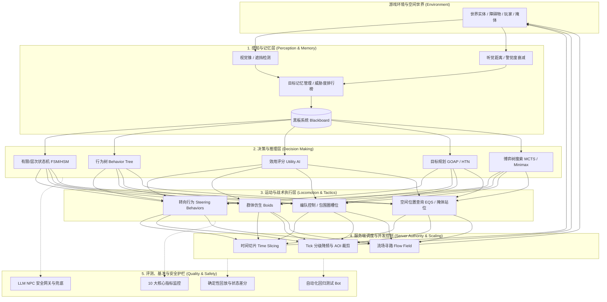
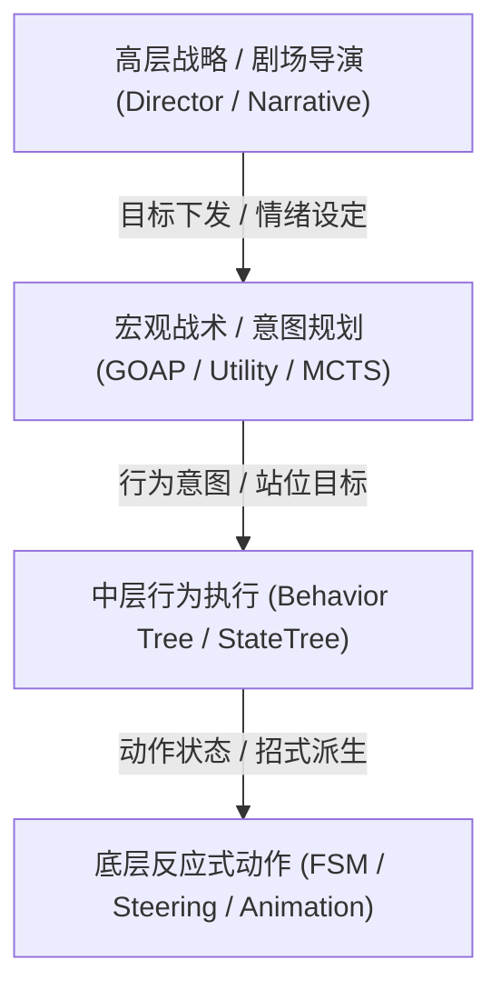

# 游戏 AI 领域工程手册

> 知识成熟度：L2（领域级工程手册，已按 17 篇核心专题、跨域工程边界与全域拓扑全面标准化）。
>
> 领域权威导航：[游戏 AI Domain MOC](../00_Index/domains/游戏AI.md) ｜ [Global MOC](../00_Index/MOC.md) ｜ [跨域主题索引](../00_Index/axes/跨域主题.md)。

---

## 1. 核心定位与设计思想

「游戏 AI」知识库负责游戏人工智能领域的**通用核心原理、认知决策模型、运动控制、强化学习、服务端海量调度与质量安全工程**。

与传统的“游戏脚本堆砌”不同，现代游戏 AI 是一个跨越客户端表现层、权威服务端裁决层、数值算法层与持续集成测试流的立体工程系统：

- **引擎无关的通用原理（Engine-Agnostic Principles）**：以标准伪代码、状态转移拓扑、树状执行模型与数学评分函数表达本质逻辑，面向客户端、服务端与 AI 技术策划全角色，避免与特定引擎实现强耦合；
- **全生命周期闭环**：构建“环境感知（Stimulus/Blackboard） → 认知决策（FSM/BT/Utility/GOAP/StateTree） → 运动空间查询（Steering/Boids/EQS/NavMesh） → 服务端权威调度（Time Slicing/Tick LOD） → 强化学习与自适应（RL/MARL/DDA） → 自动化评测与 LLM 安全”的六层闭环；
- **权威服务端与性能第一**：深入 MMO 与大规模战局场景，将单帧 CPU 耗时切片、空间流场（Flow Field）、视线检查缓存与分级降频作为硬性工程指标；
- **质量度量与安全护栏**：通过 10 大评测指标矩阵、回放包一致性验证、自动测试 Bot 基准与严格的 LLM NPC 低权限工具网关，确保 AI 表现“可度量、可复现、可回归、无安全漏洞”。

---

## 2. 认知与执行闭环全景

---

## 3. 三大子域与 17 篇核心专题矩阵

| 子域与分类 | Canonical 专题文件 | 知识类型 | 成熟度 | 核心工程定位与覆盖问题 |
| :--- | :--- | :---: | :---: | :--- |
| **01-决策与架构** [子域手册](01-决策与架构/README.md) | [01-AI总体架构与感知.md](../知识/06-游戏AI/感知决策与行为规划/01-AI总体架构与感知.md) | Architecture | L2 | 感知-决策-行动三层解耦、视听觉感知锥模型、黑板数据契约与主循环分频 |
| | [02-状态机与层次状态机.md](../知识/06-游戏AI/感知决策与行为规划/02-状态机与层次状态机.md) | Mechanism | L2 | 经典 FSM 状态转换表、HSM 状态继承与复用、历史状态堆栈、Boss 三阶段转换 |
| | [03-行为树通用原理.md](../知识/06-游戏AI/感知决策与行为规划/03-行为树通用原理.md) | Mechanism | L2 | Composite 复合节点（选择/顺序/并行）、Decorator 条件打断、Task 契约与反模式 |
| | [04-Utility与GOAP.md](../知识/06-游戏AI/感知决策与行为规划/04-Utility与GOAP.md) | Comparison | L2 | 效用响应曲线拟合、GOAP 状态空间与 A* 逆向规划、HTN 层次任务网络与选型决策 |
| | [05-博弈搜索与对战AI.md](../知识/06-游戏AI/感知决策与行为规划/05-博弈搜索与对战AI.md) | Mechanism | L2 | Minimax 极大极小搜索、Alpha-Beta 剪枝、MCTS 蒙特卡洛树搜索与对局评估函数 |
| | [06-模糊逻辑与连续决策.md](../知识/06-游戏AI/感知决策与行为规划/06-模糊逻辑与连续决策.md) | Mechanism | L2 | 隶属度函数、模糊规则库推理（Mamdani）、去模糊化（重心法）与战场态势评估 |
| | [07-NPC人格对话与社交AI.md](../知识/06-游戏AI/学习适应与社会行为/07-NPC人格对话与社交AI.md) | Architecture | L2 | 大五人格 OCEAN 映射、情绪衰减、好感/声望网络、对话树打断恢复与导演系统 |
| **02-移动学习与服务端** [子域手册](02-移动学习与服务端/README.md) | [01-移动与群组行为.md](../知识/06-游戏AI/导航移动与群体协同/01-移动与群组行为.md) | Mechanism | L2 | Reynolds 转向行为（Seek/Arrive/Wander）、Boids 群聚三法则、编队与避障 |
| | [02-战斗与Boss设计.md](../知识/06-游戏AI/战斗战术与机器人/02-战斗与Boss设计.md) | BestPractice | L2 | 仇恨列表（Damage/Heal/Distance 加权）、包围圈槽位分配、Boss 阶段与招式节奏 |
| | [03-学习型AI.md](../知识/06-游戏AI/学习适应与社会行为/03-学习型AI.md) | Tutorial | L2 | 强化学习（RL）工程落地、状态/动作空间设计、奖励函数陷阱、模仿学习边界 |
| | [04-服务端AI与性能.md](../知识/06-游戏AI/评测安全与运行预算/04-服务端AI与性能.md) | Architecture | L2 | 服务端权威判定、单帧时间切片分帧、距离与可见性 LOD 降频、海量流场寻路 |
| | [05-玩家建模与自适应难度.md](../知识/06-游戏AI/学习适应与社会行为/05-玩家建模与自适应难度.md) | Mechanism | L2 | 玩家技能特征提取、心流区间维持、动态难度自适应（DDA）控制器、隐式帮扶 |
| | [06-多智能体协作与强化学习.md](../知识/06-游戏AI/学习适应与社会行为/06-多智能体协作与强化学习.md) | Research | L2 | 多智能体强化学习（MARL）、CTDE 范式、团队集火换坦策略与通信瓶颈治理 |
| | [07-战斗AI编排与战术协同.md](../知识/06-游戏AI/战斗战术与机器人/07-战斗AI编排与战术协同.md) | Architecture | L2 | 动作战斗导演、攻击欲望令牌桶、三层环形包围槽位、视锥盲区减压与破招协同 |
| **03-评测与安全** [子域手册](03-评测与安全/README.md) | [01-AI评测回放.md](../知识/06-游戏AI/评测安全与运行预算/01-AI评测回放.md) | BestPractice | L2 | 10 大核心指标体系、回放包证据链、伪随机种子基准、状态差分哈希与门禁阈值 |
| | [02-自动测试玩家与AI回归基准.md](../知识/06-游戏AI/评测安全与运行预算/02-自动测试玩家与AI回归基准.md) | BestPractice | L2 | Playtesting Bot 自动化测试框架、探索/战斗基线、回归场景集与持续集成门禁 |
| | [03-LLM-NPC安全.md](../知识/06-游戏AI/评测安全与运行预算/03-LLM-NPC安全.md) | BestPractice | L2 | 提示注入防御、低权限工具调用网关、RAG 知识/剧透阻断、敏感词过滤与人工兜底 |

---

## 4. 决策模型技术选型与协作范式

在实际工业研发中，顶级游戏往往采用**分层混合决策架构（Hybrid Decision Architecture）**，而非孤立使用单一技术：

- **分层状态机（HSM）与行为树（BT）的协作**：HSM 负责管理宏观顶层状态（如「非战斗/战斗警戒/Boss阶段转换」），行为树负责状态内部复杂的反应式行为抉择（如「寻找掩体 → 施放压制技能 → 换弹」）；
- **行为树（BT）与效用 AI（Utility）的协作**：在行为树中引入 Utility 评估节点，或用 Utility Selector 替代硬编码顺序的 Priority Selector，使 AI 能够根据当前血量、弹药和距离平滑挑选最合适应急动作；
- **传统确定性决策与大语言模型（LLM）的协作**：确定性任务逻辑、战斗技能和状态推进由行为树/状态机强行把控，LLM 仅挂载在社交与开放对话插槽，并通过低权限网关提出动作申请，坚决杜绝 LLM 直接拥有游戏逻辑裁决权。

---

## 5. 跨域工程边界与单一事实源

本库与其他核心领域紧密协同，严格遵守单一事实源（Single Source of Truth）契约：

| 关联领域 | 承接职责与单一事实源 | 边界分工原则 | 权威导航 |
| :--- | :--- | :--- | :--- |
| **游戏知识 (05-AI系统)** | 承接虚幻引擎客户端 AI 组件与 C++ 源码实现 | 本域讲解通用原理与伪代码；UE 的 BehaviorTree、EQS、NavMesh、Mass、StateTree 与 VisualLogger 详见该域 | [游戏知识 05-AI系统](../游戏知识/05-AI系统/README.md) |
| **游戏知识 (12-源码分析)** | 承接引擎底层 AI 调度与 Lyra 项目源码实现 | 行为树节点求值源码、MassEntity 批处理执行器、Lyra-Bot 队伍协调证据见该域 | [12-12 行为树与AI源码](../知识/06-游戏AI/感知决策与行为规划/12-行为树与AI源码.md) ｜ [12-46 Lyra-AI源码](../知识/06-游戏AI/战斗战术与机器人/46-Lyra-AI机器人与队伍源码.md) |
| **游戏算法** | 承接寻路图搜索、几何计算、流场、导航网格与采样 | A*、JPS、Recast/Detour 网格烘焙、漏斗平滑、随机数与统计采样算法属算法域底层 | [游戏算法 01-寻路与图论](../游戏算法/01-寻路与图论/README.md) ｜ [游戏算法 04-确定性工程](../游戏算法/04-确定性与基准工程/README.md) |
| **游戏服务端** | 承接权威服务器世界模拟、AOI 广播裁剪与帧时间预算 | 服务端 AI 的通用逻辑属本域；具体的主循环 Tick、时间轮、跨 Zone 迁移与网络协议属服务端域 | [游戏服务端 06-11 AI时间预算](../知识/07-网络与游戏服务端/运行调度与过载保护/11-AI与寻路时间预算.md) ｜ [游戏服务端总目录](../游戏服务端/README.md) |
| **系统实战** | 承接商业化游戏真实端到端工程落地与完整链路 | 理论与算法在此汇总落地为具备行为树、状态机、同步与属性系统的假人 Bot | [系统实战 07-假人AI完整链路](../知识/06-游戏AI/战斗战术与机器人/07-假人AI完整链路.md) |
| **游戏测试与质量** | 承接服务端机器人集群压测与自动化 CI/CD 测试流水线 | 本域定义指标与 Bot 逻辑；压测平台搭建、并发注入与混沌测试见该域 | [游戏测试与质量 03-机器人压测](../知识/08-工程实践与质量/测试策略与自动化/03-服务端测试与机器人压测.md) |

---

## 6. 撰写与工程规范

- **统一结构**：核心概念 → 原理推导 → 通用代码/伪代码实现 → 选型对比 → 最佳实践与反模式 → 常见问题 FAQ → 结构化关联阅读；
- **算法与数学严谨性**：涉及几何（视锥、避障）、评分函数（Sigmoid、多项式效用）与强化学习（Bellman 方程、PPO 裁剪目标）处，均需给出明确数学公式或边界条件；
- **图示规范**：决策流与时序优先采用标准 Mermaid 图；
- **代码规范**：统一采用现代 C++/标准伪代码，严谨表达内存布局、指针生命周期与黑板键值安全，杜绝模糊伪代码；
- **门禁合规**：所有新建或修改文档必须符合 OKF v0.2 frontmatter 规范，严禁出现坏链。
