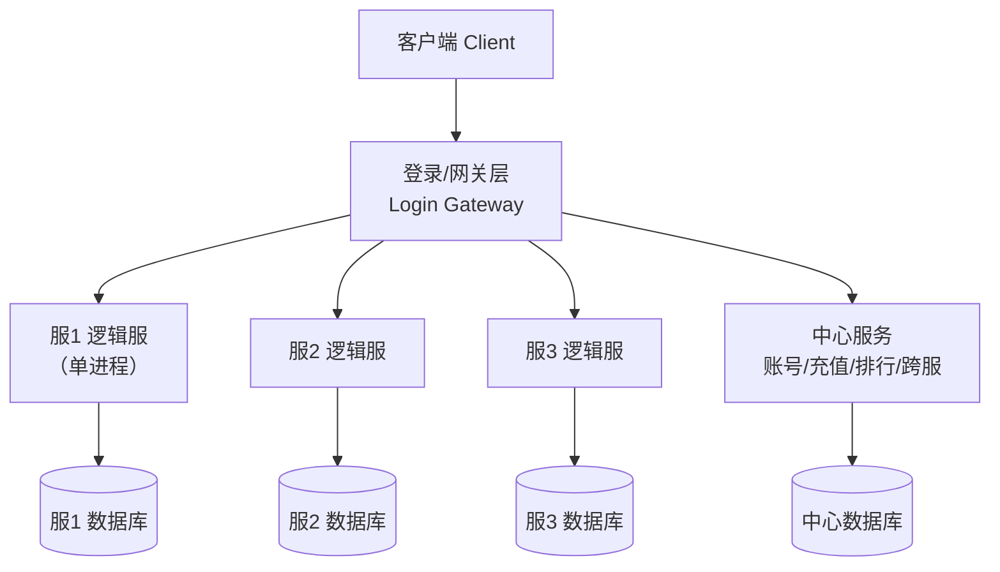
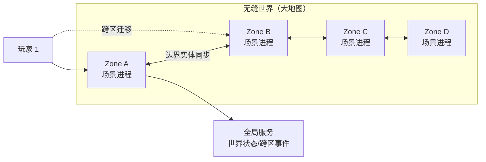
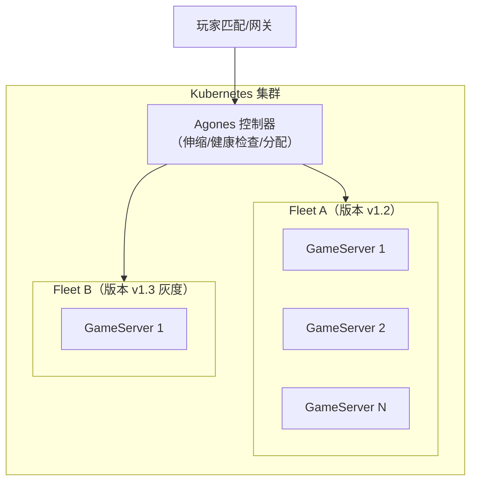
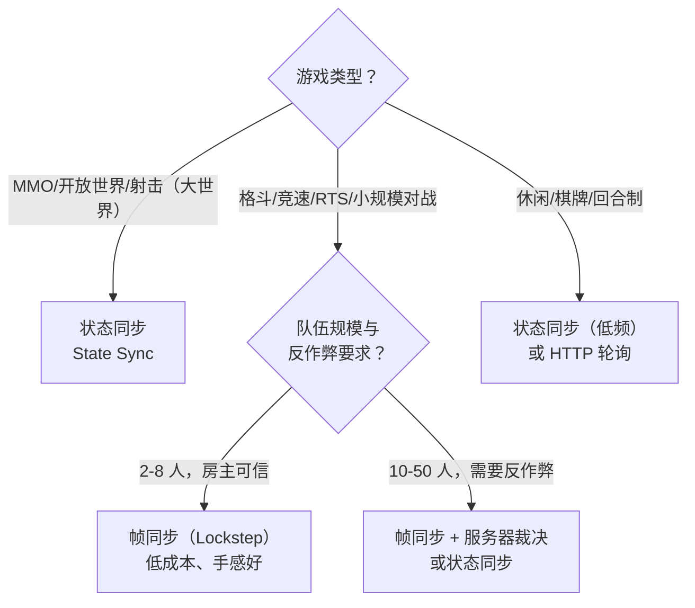
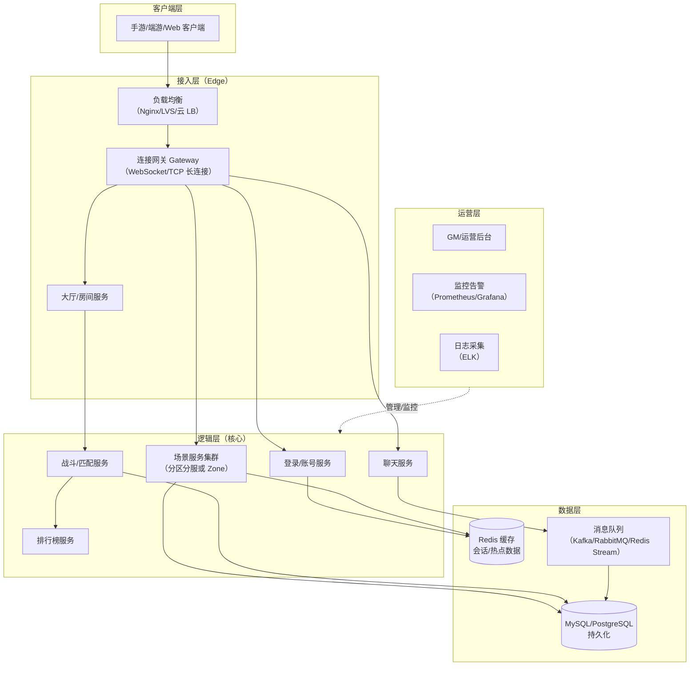

# 01 服务器架构模式（Server Architecture Patterns）

> 适用读者：服务端新人、架构师、技术负责人
> 前置知识：基本网络知识（TCP/IP）、进程与线程概念
> 目标：理解五种主流服务器架构的演进脉络与取舍，掌握"权威服务器"（authoritative server）原则，
> 学会根据游戏类型选择同步架构，并能画出自己的服务器拓扑图。

---

## 1. 概述

服务器架构（server architecture）决定了游戏的**容量上限、开发效率、运维成本与反作弊能力**。
在写第一行业务代码之前，团队必须先回答三个问题：

1. **世界怎么切分**：所有玩家在同一个世界里，还是按区、按服、按场景切分？
2. **谁说了算**：客户端计算的结果服务器是否信任（权威服务器原则）？
3. **怎么扩容**：加机器就能加容量（水平扩展，horizontal scaling），还是只能换更强的机器（垂直扩展，vertical scaling）？

游戏服务端架构的演进大体经历了五代：

| 代际 | 架构 | 代表年代/产品 | 核心特征 |
| --- | --- | --- | --- |
| 第一代 | 单服架构（Monolithic） | 早期页游、单机联机 | 一台服务器扛全部，架构最简单 |
| 第二代 | 分区分服（Sharding） | 传奇、梦幻西游、大部分 MMORPG | 按区服切分世界，低成本高隔离 |
| 第三代 | 无缝世界（Zone/Seamless World） | World of Warcraft、EVE Online | 大世界按区域划分，跨区动态迁移 |
| 第四代 | 微服务/服务化（Microservices） | 腾讯互娱、网易、中台化产品 | 按业务域拆分服务，独立部署伸缩 |
| 第五代 | 容器化与云原生（Cloud-Native） | Amazon GameLift、Agones、Google Stadia 类 | 容器编排、弹性伸缩、按量付费 |

> 注意：五代架构并非"后者取代前者"，而是**并存**的。今天仍有大量成功产品使用分区分服，
> 架构选择是 trade-off（取舍）而非"越新越好"。

---

## 2. 核心概念（Core Concepts）

| 术语 | 英文 | 说明 |
| --- | --- | --- |
| 单服架构 | Monolithic Architecture | 所有模块（登录、场景、背包、战斗）打成一个进程 |
| 分区分服 | Sharding / Server Group | 玩家被分配到固定区服，区服之间数据隔离 |
| 无缝世界 | Seamless World | 大地图切分为多个 Zone，玩家跨区时无感迁移 |
| 区域 | Zone / Region / Cell / Grid | 无缝世界中承担局部场景的服务器单元 |
| 网关 | Gateway / Frontend | 客户端接入层，负责连接管理、消息转发、流量控制 |
| 场景服务器 | Scene / Game Server | 承载具体玩法逻辑（移动、战斗、AI）的进程 |
| 权威服务器 | Authoritative Server | 所有关键状态由服务器计算与裁决，客户端只提交输入 |
| 客户端预测 | Client Prediction | 客户端先行模拟以降低延迟感，服务器结果到达后校正 |
| 回滚 | Reconciliation / Rollback | 客户端预测与服务器结果不一致时修正状态 |
| 无状态服务 | Stateless Service | 不保存会话状态，可随意水平扩展（如登录、匹配） |
| 有状态服务 | Stateful Service | 保存玩家/场景状态，扩容需要状态迁移或分片 |
| 微服务 | Microservices | 按业务能力拆分的、可独立部署的服务集合 |
| 服务发现 | Service Discovery | 服务间互相定位的机制（etcd、Consul、ZooKeeper） |
| 容器编排 | Container Orchestration | 自动化部署、扩缩容、故障恢复（Kubernetes） |
| 水平扩展 | Horizontal Scaling | 增加机器数量提升容量 |
| 垂直扩展 | Vertical Scaling | 提升单机配置（CPU/内存）提升容量 |
| 有状态分片 | Stateful Sharding | 按玩家 ID 哈希等规则把状态分布到多台机器 |
| 合服 | Server Merge | 将多个低负载区服合并，提升社交密度 |
| 跨服 | Cross-Server | 让不同区服的玩家进入同一活动场景（跨服战） |

---

## 3. 原理详解（In-Depth）

### 3.1 单服架构（Monolithic）

**原理**：所有功能运行在同一个进程内，客户端直连（或经简单网关转发）唯一入口。
内存中的全局状态天然一致，没有跨进程通信开销。

**优点**：
- 开发最快：无分布式问题（无 RPC、无一致性难题），调试直观；
- 事务天然：所有数据在同一进程内，无需分布式事务；
- 运维简单：只部署一套进程。

**缺点**：
- 容量天花板：单进程受 CPU/内存/GC 限制，在线人数上限低（通常数百到数千）；
- 单点故障（single point of failure）：进程崩溃=全服宕机；
- 无法按模块扩缩容：场景压力大时无法只扩容场景模块；
- 大版本迭代风险高：改一行代码影响全服。

**适用场景**：休闲小游戏、原型验证（MVP）、房主制（P2P host）游戏的服务端辅助、
以及"不差钱但要快速上线"的轻度产品。

### 3.2 分区分服（Sharding / Server Group）

**原理**：按区（region）、服（server）或频道（channel）把玩家群体切分，
每个服是**独立的世界**（独立进程、独立数据库或独立库表），服内架构可以仍然是"单服"。
玩家注册时被分配到一个服，登录后绑定在该服。

**为什么流行**：成本低——一台物理机（或一个 Docker 容器）就是一个服；
隔离好——一个服出问题不影响其他服；社交密度可控——小服内玩家更容易形成熟人社区。

**关键问题与解法**：

| 问题 | 说明 | 常见解法 |
| --- | --- | --- |
| 鬼服 | 玩家流失后单服人数过少 | 合服（server merge）、动态移民 |
| 跨服玩法 | 国战、跨服战场需要多服玩家同场 | 跨服网关 + 独立的跨服战场服务器 |
| 服间数据 | 好友、聊天等需要跨服 | 中心化服务（好友中心、聊天中心）或共享存储 |
| 运营活动 | 每个服单独开活动成本高 | 活动配置中心化下发，逻辑服内执行 |
| 负载不均 | 新服爆满、老服冷清 | 预约开服、动态合服、AI 填充 |

**典型拓扑**：



### 3.3 无缝世界（Seamless World / Zone）

**原理**：把巨大的连续世界地图切分为若干**区域**（Zone/Cell/Grid），每个区域由一个场景进程负责。
玩家在区域边界移动时，由服务器协调**跨区迁移**（handover/transfer），玩家无感。
同一区域的玩家数据在同一个进程内，保证一致性与性能；区域之间通过轻量交互（边界同步、跨区事件）协作。

**关键技术**：
- **AOI（Area of Interest，兴趣区域）**：每个玩家只关注周围一定范围内的实体，广播量从 O(N²) 降到 O(N·K)；
- **跨界迁移**：玩家跨越 Zone 边界时，源 Zone 打包玩家状态 → 目标 Zone 重建实体 → 双方确认 → 切换连接归属；
- **Zone 负载均衡**：热点区域拆分（如主城人多拆成多个副本线）、冷区合并；
- **无缝感**：客户端看到的是连续大地图，Zone 之间只是服务器内部的切分。

**代表案例**：
- **World of Warcraft**：大陆按区域划分，跨区时出现短暂的"Loading"（旧版），新版已接近无缝；
- **EVE Online**：星域（solar system）即 Zone，最著名的"时间膨胀"（time dilation）机制——
  当单星系负载过高时主动放慢服务器时间片，保证公平而非崩溃；
- **Minecraft 大型服务器**：分区块（chunk）由不同进程承载。



**优缺点**：体验最好（大世界、无感切换、社交无边界），但实现复杂度最高——
需要处理迁移一致性、跨 Zone 战斗（边缘战斗）、全局对象（如世界 BOSS）归属等问题。
**适用**：大型 MMORPG、开放世界（Open World）游戏。

### 3.4 微服务架构（Microservices）

**原理**：把服务器按**业务域**（domain）拆分为多个独立部署的服务，例如：
账号服务、登录服务、匹配服务、战斗服务、聊天服务、排行榜服务、商城服务、数据存档服务。
服务之间通过 RPC 或消息队列通信，每个服务可独立扩缩容、独立发布。

**游戏微服务与 Web 微服务的差异**：游戏的核心痛点是**有状态**（场景/战斗状态）与**低延迟**，
因此游戏里通常采用"**无状态服务自由扩展 + 有状态服务分片**"的组合：
- 无状态：登录、匹配、排行、聊天（可随意加机器）；
- 有状态：场景/战斗服务按"房间"或"分片"分配，配合一致性哈希（consistent hashing）与状态迁移。

**游戏界的"类微服务/服务化"框架**：

| 框架 | 语言 | 模型 | 特点 |
| --- | --- | --- | --- |
| Skynet（云风） | C + Lua | Actor（服务） | 单进程内多服务，消息驱动，国内中小团队使用极广 |
| ET（猫大仙） | C# | 双端共享 + 组件 | 客户端服务端共享逻辑代码，ECS 风格 |
| kbengine | C++ + Python | 多进程（cell/base） | 开源 MMORPG 引擎，cell 负责场景、base 负责玩家 |
| Pomelo | Node.js | 多进程（connector/game） | 早期页游/手游常用，JS 全栈 |
| Nakama | Go | 单进程多模块 | 开源游戏后端，内置社交/排行/实时多人 |
| Photon | C# | 云托管房间制 | 商业化实时多人后端（Photon Cloud） |

**优点**：模块独立演进、故障隔离（聊天挂了不影响战斗）、弹性伸缩、团队并行开发。
**缺点**：分布式复杂度（网络分区、一致性、链路追踪）、运维成本高、延迟增加（多一跳 RPC）。
**适用**：大型项目、中台化组织、需要多端复用（App/Web/小程序）的产品。

### 3.5 容器化与云原生（Containerization & Cloud-Native）

**原理**：把服务器进程打包成 Docker 镜像，用 Kubernetes 等编排系统管理，
由平台自动完成部署、扩容、故障重启。云厂商进一步提供游戏专用托管：

- **Amazon GameLift**：专为游戏设计的托管平台，提供"队列（queue）→ 舰队（fleet）→ 实例（instance）→ 游戏会话（game session）"模型，
  支持按玩家需求自动拉起游戏会话（session-based scaling），内置玩家放置（placement）与伸缩策略；
- **Agones（Google，开源）**：基于 Kubernetes 的游戏服务器托管，用 CRD（自定义资源）管理 GameServer，
  支持 Fleet 与自动伸缩，与 Kubernetes 生态无缝集成；
- **Open Match（Google，开源）**：与 Agones 配套的通用匹配框架；
- **Hathora / Edgegap / Improbable（SpatialOS）**：边缘节点部署、空间化计算。

**容器化带来的能力**：

| 能力 | 说明 |
| --- | --- |
| 弹性伸缩（Auto Scaling） | 根据在线人数/队列长度自动增减游戏服实例 |
| 故障自愈（Self-Healing） | 实例崩溃自动重建，降低运维人工干预 |
| 灰度发布（Canary） | 新版本先上少量实例验证再全量 |
| 环境一致 | 开发/测试/生产同一镜像，消灭"在我机器上能跑" |
| 成本优化 | 低谷期缩容到最小规模，按量计费 |



### 3.6 权威服务器原则（Authoritative Server）

**定义**：游戏中影响胜负与经济的**关键状态**（位置、血量、伤害、掉落、交易）一律由服务器计算和裁决；
客户端只发送**输入**（按键、指令），并展示服务器确认后的结果。

**为什么必须权威**：
- **反作弊**：客户端是"不可信终端"（untrusted terminal），内存修改、变速齿轮（speed hack）、
  瞬移（teleport hack）、伤害外挂（damage hack）都建立在客户端可篡改状态之上；
- **一致性**：多人共享世界必须以同一份状态为准，否则各客户端各自为政；
- **经济安全**：掉落、货币、交易等与收入相关的状态绝不能由客户端决定。

**权威化的层次**（从松到严）：

| 层次 | 说明 | 例子 |
| --- | --- | --- |
| 校验型 | 客户端上报结果，服务器做合法性校验 | 简易移动（校验速度上限） |
| 指令型 | 客户端只发意图，服务器算结果 | 技能释放、攻击判定 |
| 全权型 | 客户端只做表现，所有逻辑在服务器 | 帧同步（服务器裁决） |

**代价**：服务器计算压力大、网络延迟增加（一次操作需要 RTT 往返）、手感依赖预测与补偿技术。

**配套技术**：客户端预测（client prediction）、服务器回滚（server reconciliation）、
延迟补偿（lag compensation，如 FPS 的"回放击中"）、输入缓冲（input buffering）。

### 3.7 同步架构选型：状态同步 vs 帧同步

这是"网络同步"主题（见 `03-帧同步与状态同步.md`）的顶层决策，这里先给结论性对比：

| 维度 | 状态同步（State Sync） | 帧同步（Lockstep / Frame Sync） |
| --- | --- | --- |
| 同步内容 | 同步**结果状态**（坐标、血量、Buff） | 同步**输入指令**（操作 + 帧号） |
| 网络流量 | 与实体数量相关，通常较大 | 与玩家数量相关，指令小、流量低 |
| 服务器负载 | 高（服务器跑全量逻辑） | 低（服务器只转发指令，可选校验） |
| 客户端逻辑 | 客户端可跑表现层逻辑，容错高 | 客户端必须与服务器逻辑**完全一致**（确定性） |
| 反作弊 | 天然强（服务器权威） | 弱（客户端各有逻辑，需服务器校验或混合） |
| 回放/观战 | 快照重放，实现简单 | 指令重放，实现优雅且体积小 |
| 断线重连 | 友好（拉取最新快照即可） | 需要补齐指令流，实现复杂 |
| 网络要求 | 容忍一定抖动（插值缓冲） | 对抖动敏感（需要延迟隐藏与预测） |
| 代表品类 | MMO、MOBA（王者荣耀早期/主流）、射击 | 格斗（街霸）、RTS（星际争霸）、部分 MOBA |



---

## 4. 服务器拓扑图（完整参考）

一张"标准大型网游"的完整拓扑，供对照与裁剪：



---

## 5. 代码/配置示例（Examples）

### 5.1 分区分服的最小目录结构（参考）

```text
gameserver/
├── gateway/          # 连接网关（长连接、转发、限流）
├── logic/            # 逻辑服（场景、玩法），一服一进程
├── center/           # 中心服（账号、跨服、排行、充值）
├── common/           # 共享代码（协议、工具、配置）
├── proto/            # 协议定义（protobuf）
└── deploy/
    ├── docker/       # 各服务 Dockerfile
    └── config/       # 区服配置
```

### 5.2 GameLift 舰队配置（Fleet 配置 YAML 示例）

```yaml
# gamelift-fleet.yaml（示意）
Fleet:
  Name: "cn-moba-fleet"
  BuildId: "build-2026-08-01"
  InstanceType: "c5.large"
  EC2InboundPermissions:
    - IpRange: "0.0.0.0/0"
      Protocol: "UDP"
      FromPort: 7777
      ToPort: 7787
  RuntimeConfiguration:
    ServerProcesses:
      - LaunchPath: "/local/game/server"
        Parameters: "--port 7777 --log /local/game/logs"
        ConcurrentExecutions: 4
  ScalingPolicy:
    TargetTracking:
      MetricName: "PercentActiveSessions"
      TargetValue: 70
```

> 要点：`ConcurrentExecutions` 决定单实例上并行游戏会话数（rooms per instance）；
> 伸缩策略建议按"活跃会话占比"而非 CPU 使用率，因为游戏进程对延迟更敏感。

### 5.3 服务拆分示例（gRPC proto 片段）

```protobuf
syntax = "proto3";
package game.center;

// 中心服的跨服服务（示意）
service CenterService {
  rpc GetPlayerAcrossServer(PlayerIdReq) returns (PlayerBrief);
  rpc CrossServerBattle(CrossBattleReq) returns (CrossBattleResp);
}

message PlayerIdReq {
  uint64 player_id = 1;
  uint32 source_region = 2;   // 来源区服
}

message PlayerBrief {
  uint64 player_id = 1;
  string name = 2;
  uint32 level = 3;
  uint64 combat_power = 4;
}
```

### 5.4 权威服务器：移动校验伪代码（C#）

```csharp
// 服务端：校验客户端上报的移动
public void OnMoveRequest(Player p, MoveRequest req) {
    var dt = req.ClientTime - p.LastMoveTime;   // 时间间隔
    var dist = Vector3.Distance(req.Position, p.Position);
    var maxDist = p.Speed * dt * 1.5f;         // 1.5 容忍网络抖动

    if (dist > maxDist) {
        // 客户端移动过快 → 判定疑似瞬移，丢弃并按服务器位置校正
        SendToClient(new MoveCorrection { Position = p.Position });
        BanRisk(p, "teleport-hack");
        return;
    }
    p.Position = req.Position;                  // 以服务器接收为准
    BroadcastNearby(p, new MoveBroadcast { PlayerId = p.Id, Position = p.Position });
}
```

---

## 6. 最佳实践（Best Practices）

1. **先定"世界模型"再写代码**：玩家是否跨服、世界是否无缝，决定了网关、状态存储与 RPC 设计，
   后期返工成本极高。建议用一页纸画出拓扑图并评审。
2. **权威服务器原则不可妥协**：PVP 结算、经济系统、掉落必须服务器裁决；
   即使采用帧同步，也要保留服务器校验能力（关键指令复算、结果抽查）。
3. **无状态与有状态分离**：登录、匹配、排行尽量无状态化，方便弹性伸缩；
   场景、战斗等有状态服务用"房间/分片"模型管理，明确归属与迁移协议。
4. **网关只做"交通警察"**：网关负责连接、鉴权、限流、转发，不承载玩法逻辑，
   这样协议升级与逻辑扩容互不影响。
5. **容量规划用"峰值×1.5"**：按高峰在线（CCU，Concurrent Users）估算，
   单进程承载建议留 50% 余量，避免 GC/毛刺导致雪崩。
6. **演进式架构**：原型期单服起步，验证玩法后再拆服务；
   用"防腐层"（anti-corruption layer）隔离核心逻辑与外部依赖，为重构留后路。
7. **跨服/合服是产品需求**：架构设计时就为"合服"与"跨服战场"预留中心化服务与玩家数据抽象，
   避免后期做数据搬运大手术。
8. **容器化尽早引入**：即使部署在裸机，也建议从第一天用 Docker 打包，
   保证开发/测试/生产环境一致，为将来上云留路。
9. **延迟预算**：为每跳网络设定预算（客户端→网关 20ms，网关→逻辑服 <1ms，逻辑服→DB <5ms 等），
   架构评审时逐跳核算，防止"分布式优雅但手感崩坏"。
10. **故障演练**：定期演练"单服宕机、网关雪崩、DB 主从切换"场景，
    确认架构的故障隔离与恢复路径真实可用。

---

## 7. 常见问题 FAQ

**Q1：单服能扛多少人？**
取决于玩法计算量：纯聊天/挂机类单进程可扛数千人；MMORPG 全量逻辑单进程通常 500~2000 人
（场景内同屏人数更关键）。超过后要么分服，要么分 Zone。

**Q2：分区分服的"服"到底是什么？**
一个"服"通常 = 一组进程（网关 + 场景 + 中心）+ 一份数据库。
玩家账号数据按服隔离，排行榜、好友等可能由中心服务统一维护。

**Q3：无缝世界的 Zone 之间怎么打架？**
边界战斗是难点：常见方案有"边缘归属"（边界区域归某一 Zone 全权负责）、
"战斗快照迁移"（开战时把双方临时迁移到同一 Zone）、或"跨 Zone 代理战斗"（重量级但复杂）。

**Q4：微服务是不是一定比单服好？**
不是。微服务解决的是**团队规模与部署弹性**问题，代价是延迟与复杂度。
小团队 + 轻玩法，单服/分区分服更务实；大团队 + 多端 + 高并发，服务化收益明显。

**Q5：什么时候必须用 GameLift/Agones 这类托管平台？**
当你的游戏是"会话制"（session-based，如 MOBA 对局、吃鸡、狼人杀）且流量波动剧烈时，
托管平台能按对局数自动拉起/回收实例，成本优势巨大；MMORPG 长连接型则更常见自建集群。

**Q6：状态同步和帧同步能混用吗？**
能，而且是主流：例如 MOBA 常用"服务器权威的状态同步 + 客户端预测"，而格斗游戏用帧同步；
同一游戏也可混合（PVE 用状态同步、PVP 小规模对战用帧同步）。

**Q7：客户端预测会不会被外挂利用？**
预测只是"表现层提前显示"，最终以服务器状态为准（服务器回滚校正）。
只要服务器严格校验输入与结果，预测本身不降低安全性。

---

## 8. 关联阅读（Related Reading）

- 本分类：[02-网络通信与协议设计.md](02-网络通信与协议设计.md)（网关背后的字节传输与协议）
- 本分类：[03-帧同步与状态同步.md](03-帧同步与状态同步.md)（状态/帧同步机制详解）
- 本分类：[04-消息系统与事件驱动.md](04-消息系统与事件驱动.md)（服务间 RPC 与消息协作）
- 本分类：[05-并发与高性能.md](05-并发与高性能.md)（单服/单进程内的并发模型）
- 知识库其他篇章：数据存储与缓存（Redis 会话与存档）、运维与部署（容器化实践）、安全与反外挂
- 外部资料：GameLift 开发者指南（AWS）、Agones 文档（Google）、
  《游戏编程模式》"服务定位器/更新方法"、云风《Skynet 的设计与实现》系列博客
