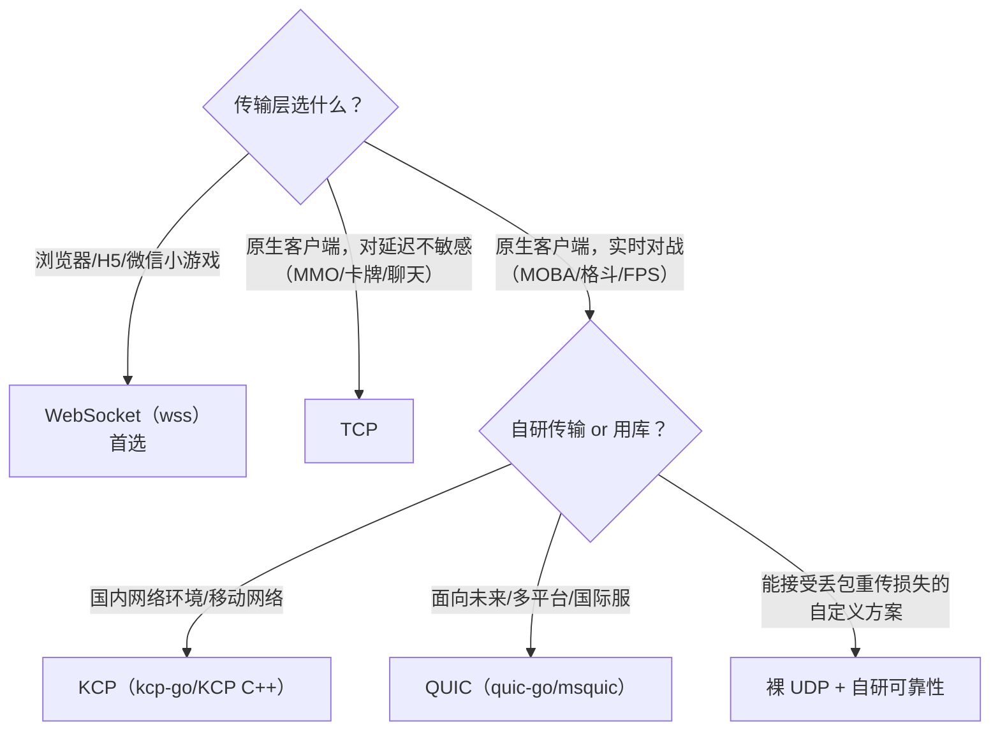
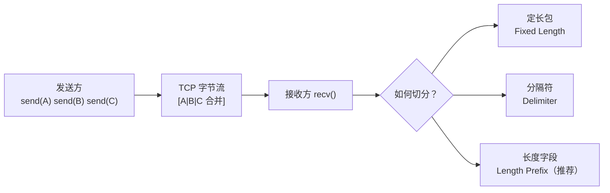
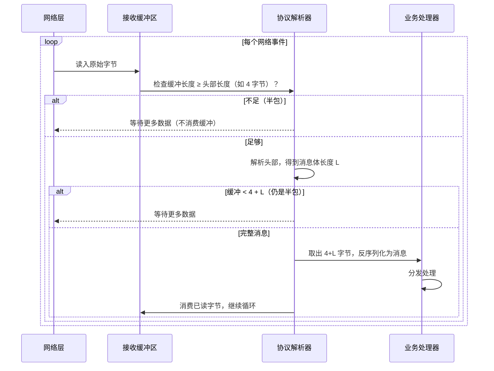
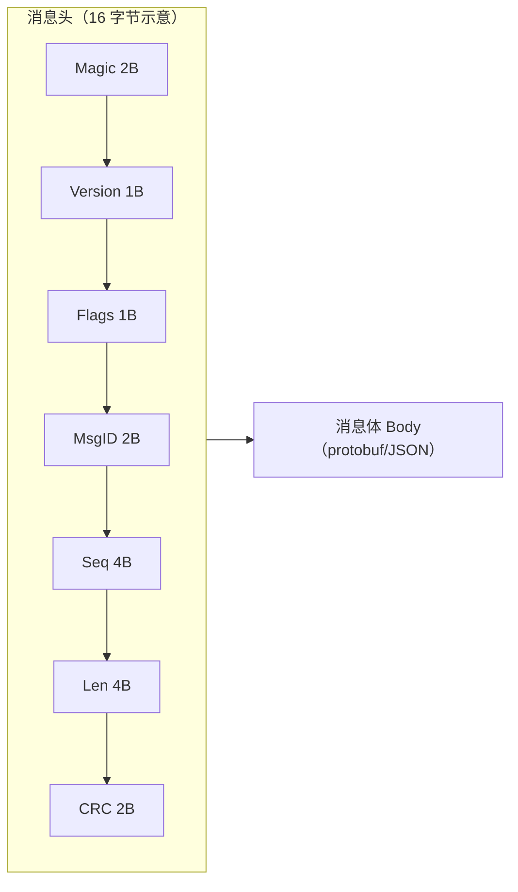
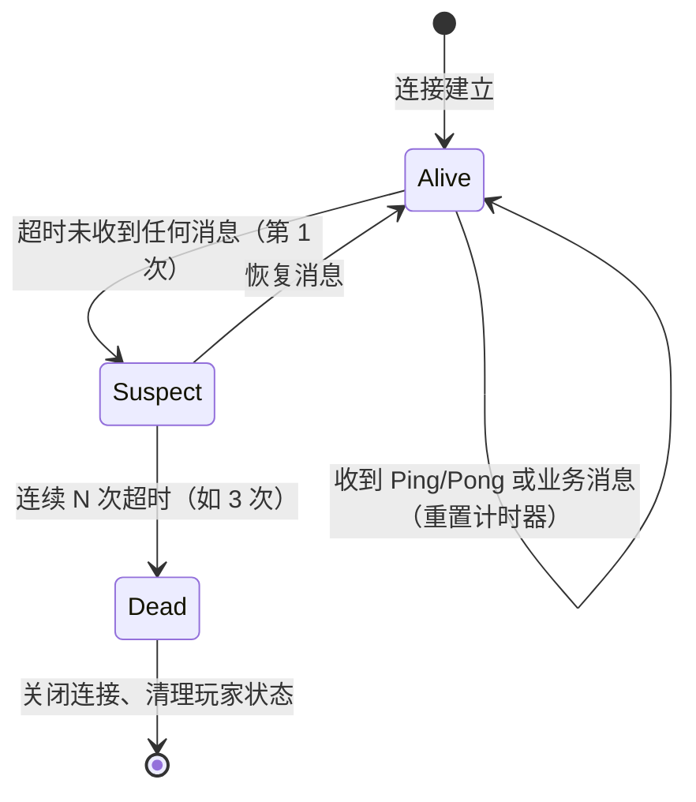

# 02 网络通信与协议设计（Networking & Protocol Design）

> 适用读者：服务端开发、客户端网络层开发、协议设计者
> 前置知识：TCP/IP 基础、Socket 编程基础
> 目标：掌握传输层协议选型（TCP/UDP/KCP/QUIC/WebSocket），精通粘包拆包与消息协议设计，
> 理解心跳、重连、流量控制与加密传输的工程细节。

---

## 1. 概述

网络通信是游戏服务端的"血管"：玩家每一次移动、放技能、聊天，最终都变成网络上的字节流。
游戏网络设计与 Web 网络设计最大的区别在于**实时性**与**双向长连接**：

- 实时性：MMO 中移动广播通常要求 100ms 内送达，MOBA/格斗要求 50ms 级；
- 长连接：游戏普遍使用长连接（long-lived connection），而非 HTTP 的短请求；
- 双向：服务器主动推送（push）与客户端请求（request）同样频繁。

本章围绕"字节如何安全、快速、可靠地在两端流动"展开：

1. **传输层选型**：TCP、UDP、KCP、QUIC、WebSocket 各有什么优劣；
2. **粘包拆包**：字节流如何切分成一条条消息；
3. **消息协议设计**：消息头、消息 ID、序列化（protobuf）、版本兼容；
4. **心跳与超时**：如何发现"假连接"（半开连接）；
5. **断线重连**：网络抖动时如何优雅恢复；
6. **流量与带宽控制**：服务器扛不住/玩家带宽有限怎么办；
7. **加密传输**：防窃听、防篡改、防重放。

---

## 2. 核心概念（Core Concepts）

| 术语 | 英文 | 说明 |
| --- | --- | --- |
| 传输控制协议 | TCP | 面向连接、可靠、有序的字节流协议 |
| 用户数据报协议 | UDP | 无连接、不可靠、无序的数据报协议 |
| KCP | KCP (KCP Protocol) | 基于 UDP 的可靠传输协议，ARQ 与快重传优化 |
| QUIC | QUIC (Quick UDP Internet Connections) | 基于 UDP 的现代传输协议，0-RTT、连接迁移 |
| WebSocket | WebSocket | 基于 TCP 的全双工应用层协议，浏览器友好 |
| 粘包 | Sticky Packet | 多条消息被合并成一段字节流，无法直接切分 |
| 拆包 | Packet Framing | 从字节流中切分出完整消息的技术 |
| 半包 | Partial Packet | 一次读取只得到消息的一部分 |
| 消息头 | Message Header / Packet Header | 消息的元信息（长度、ID、序号、校验） |
| 消息体 | Message Body / Payload | 消息的业务内容（序列化后的数据） |
| 序列化 | Serialization | 结构化数据 ↔ 字节流（protobuf/JSON/MessagePack） |
| 心跳 | Heartbeat / Keepalive | 周期性探测连接存活的消息 |
| 半开连接 | Half-Open Connection | 一端已失效但对端未感知的连接 |
| 超时重传 | Retransmission | 超时未确认则重发（TCP/KCP 核心机制） |
| 指数退避 | Exponential Backoff | 重连间隔按指数增长，避免重连风暴 |
| 限流 | Rate Limiting | 限制单位时间消息量，保护服务器 |
| 令牌桶 | Token Bucket | 一种平滑限流算法 |
| 往返时间 | RTT (Round-Trip Time) | 消息从发出到收到确认的时间 |
| 拥塞控制 | Congestion Control | 根据网络状况调整发送速率 |
| 滑动窗口 | Sliding Window | 控制未确认数据量的机制 |
| 传输层安全 | TLS (Transport Layer Security) | 加密传输协议（HTTPS/wss 的基础） |

---

## 3. 原理详解（In-Depth）

### 3.1 传输协议选型对比

| 维度 | TCP | UDP | KCP（基于 UDP） | QUIC（基于 UDP） | WebSocket（基于 TCP） |
| --- | --- | --- | --- | --- | --- |
| 可靠性 | 可靠（重传） | 不可靠 | 可靠（ARQ） | 可靠 | 可靠（依赖 TCP） |
| 有序性 | 有序（队头阻塞） | 无序 | 可配置（快速重传，减少队头阻塞） | 按流有序，流间无阻塞 | 有序（依赖 TCP） |
| 传输模式 | 字节流 | 数据报 | 数据报（KCP 包） | 数据报（帧） | 消息帧 |
| 拥塞控制 | 有（复杂、波动大） | 无（需应用层实现） | 无（默认不控，可自定义） | 有（更现代，恢复快） | 有（依赖 TCP） |
| 头部开销 | 20 字节 | 8 字节 | 24 字节（含 UDP） | 约 30-50 字节（含握手态） | 2-14 字节帧头 + TCP |
| 握手延迟 | 1-RTT（TLS 另加） | 0 | 0（可在已建 UDP 上直接跑） | 0-RTT/1-RTT | 1-RTT（wss 另加 TLS） |
| 连接迁移 | 不支持（IP 变了就断） | 天然无连接 | 由应用层处理 | 原生支持（连接 ID） | 不支持 |
| 浏览器支持 | 否（原始 Socket） | 否 | 否 | 是（HTTP/3，支持面渐广） | 是（天然支持） |
| 游戏适用场景 | MMO 长连接、登录、聊天 | 动作类实时同步 | MOBA/格斗实时对战 | 新项目实时对战（尤其端游/原生） | 手游/H5/页游主流 |

**选型口诀**：



### 3.2 TCP 与粘包拆包（Packet Framing）

**为什么会粘包**：TCP 是**字节流**（byte stream）协议，没有消息边界。
发送方多次 `send()` 的数据可能被内核合并成一段（Nagle 算法、接收缓冲区合并），
接收方一次 `recv()` 可能收到多条消息（粘包）或一条消息的一部分（半包）。



**三种拆包方案对比**：

| 方案 | 原理 | 优点 | 缺点 | 适用 |
| --- | --- | --- | --- | --- |
| 定长包 | 每条消息固定 N 字节 | 实现最简单 | 浪费带宽、扩展性差 | 极简单协议（如心跳） |
| 分隔符 | 消息以 `\n`/`\0` 结尾 | 简单、可读 | 内容含分隔符需转义；无法表达二进制 | 文本协议（行协议） |
| 长度字段 | 头部携带消息长度 | 通用、高效、支持二进制 | 需要处理半包 | **绝大多数游戏协议** |

**长度字段拆包的完整流程**：



**核心实现（C++ 示意）**：

```cpp
// 简化版：长度字段拆包器（4 字节大端长度 + 消息体）
class PacketFramer {
    std::vector<char> buf_;  // 累积缓冲
public:
    void Append(const char* data, size_t len) {
        buf_.insert(buf_.end(), data, data + len);
        Consume();
    }
private:
    void Consume() {
        while (buf_.size() >= 4) {
            uint32_t bodyLen = ReadU32BE(&buf_[0]);
            if (bodyLen > kMaxPacketSize) {   // 防恶意超大包
                CloseConnection();            // 直接断开，防内存攻击
                return;
            }
            if (buf_.size() < 4 + bodyLen) return;  // 半包，等待
            HandleMessage(&buf_[4], bodyLen);       // 完整包，交给上层
            buf_.erase(buf_.begin(), buf_.begin() + 4 + bodyLen);  // 消费
        }
    }
};
```

> **工程要点**：`bodyLen` 必须校验上限（如 64KB），否则恶意客户端可以声称
> "长度 = 4GB" 让服务器无限等待/分配内存（内存耗尽攻击，memory exhaustion attack）。

### 3.3 UDP 与可靠传输：KCP 原理

**为什么实时游戏选 UDP**：TCP 的可靠机制（超时重传 + 拥塞控制）在网络丢包时会**大幅抬升延迟**
（重传等待 + 队头阻塞，head-of-line blocking），对"最新状态胜过旧状态"的游戏同步非常不利。

**KCP 的关键优化**（相对 TCP）：

| 机制 | TCP | KCP |
| --- | --- | --- |
| 超时重传 | RTO 较保守（最小 200ms 级） | 可配置（如 30ms），更激进 |
| 快速重传 | 3 个重复 ACK 才重传 | 收到 2 个重复 ACK 即重传 |
| 队头阻塞 | 一条流内有序，阻塞后续 | 支持"跳过旧包"模式（只保证最终一致） |
| 拥塞控制 | 内置（窗口收缩，延迟敏感场景吃亏） | 默认不控，应用层自定义（游戏通常不控） |
| 选择性确认 | SACK | 支持（快速定位丢失包） |
| 延迟 | 高 | 低（为游戏场景调优） |

**KCP 的包结构（简化）**：

```text
0               4               8               12
+---------------+---------------+---------------+
| conv(会话ID)   | cmd(命令)     | frg(分片)     | wnd(窗口)    |
+---------------+---------------+---------------+
| ts(时间戳)     | sn(序列号)    | una(未确认号)  | len(长度)     |
+---------------+---------------+---------------+---------------+
| 数据（len 字节）                                        |
+--------------------------------------------------------+
```

`conv` 用于多路复用（一个 UDP Socket 承载多个会话）；`sn` 是数据包序号；
`una` 告诉对端"这个序号之前的包我都收到了"，用于快速推进窗口。

**KCP 使用示例（Go，kcp-go）**：

```go
import "github.com/xtaci/kcp-go"

func main() {
    // 服务端：监听 UDP 端口，底层自动完成 KCP 握手
    listener, err := kcp.ListenWithOptions(":7777", nil, 0, 0)
    if err != nil { panic(err) }
    for {
        conn, err := listener.AcceptKCP()
        if err != nil { continue }
        go handleConn(conn)   // conn 实现了 net.Conn 接口
    }
}
```

> 类似的库：C++ 版 KCP（skywind3000/kcp）、Netty 的 KCP 实现、Enet（可靠 UDP 库）、
> RakNet（老牌游戏网络库，UE 早期使用）。

### 3.4 QUIC：面向未来的传输协议

QUIC 是 Google 设计、IETF 标准化的基于 UDP 的传输协议，是 HTTP/3 的基石。对游戏的价值：

- **0-RTT 连接恢复**：有缓存凭证的客户端重连时第一个包即可携带数据，秒连；
- **连接迁移**：通过连接 ID（Connection ID）而非 IP:端口标识连接，WiFi↔4G 切换不断连；
- **多路复用无队头阻塞**：一条连接内多条流互相独立，一条流丢包不影响其他流；
- **内置 TLS 1.3**：加密是协议的一部分，无额外握手；
- **可插拔拥塞控制**：可实现"低延迟优先"的拥塞算法。

**代价**：协议复杂（实现与调优成本高）、库生态相对 TCP 年轻、
国内部分老旧网络设备/NAT 对 UDP 的限制。代表库：quic-go（Go）、msquic（微软）、quiche（Cloudflare）。

### 3.5 WebSocket：浏览器游戏的事实标准

WebSocket 在 TCP 之上提供**全双工消息帧**，浏览器原生支持，天然适合 H5/页游/微信小游戏：

- 帧格式：FIN/Opcode（text/binary/close/ping/pong）/Mask/长度；
- 游戏用法：binary 帧承载 protobuf，text 帧承载 JSON 调试协议；
- `wss://` 走 TLS 加密，与 HTTPS 同端口兼容（代理友好）；
- 注意：WebSocket 有**队头阻塞**（底层 TCP），且帧头有 Mask 开销，但浏览器场景没有更好选择。

**服务端实现对照**：Node.js 的 ws/socket.io、Go 的 gorilla/websocket、C# 的 Fleck/Kestrel WebSockets、
C++ 的 websocketpp、Java 的 Netty。

### 3.6 消息协议设计（Protocol Design）

#### 消息头设计

一个典型的游戏消息头（以二进制协议为例）：

| 字段 | 长度 | 说明 |
| --- | --- | --- |
| Magic（魔数） | 2 字节 | 固定值如 `0x4D53`（"MS"），快速识别非法包 |
| Version（版本） | 1 字节 | 协议版本，用于兼容与升级 |
| Flags（标志位） | 1 字节 | 压缩/加密/ACK 要求等位标记 |
| Message ID（消息 ID） | 2 字节 | 标识消息类型（如 1001=登录，2003=移动） |
| Sequence（序列号） | 4 字节 | 请求-响应关联、防重放、乱序检测 |
| Body Length（长度） | 4 字节 | 消息体字节数（拆包依据） |
| Checksum（校验和） | 2 字节 | 可选：CRC32/简单异或，防篡改与传输错误 |



#### 消息 ID 的命名与分配

- 建议按模块分段：`1000-1999` 登录/账号，`2000-2999` 场景/移动，`3000-3999` 战斗，
  `4000-4999` 聊天/社交，`5000-5999` 商城/经济；
- 客户端→服务器（C2S）与服务器→客户端（S2C）可以共用 ID 空间（方向由消息语义决定），
  也可以高位区分（如 S2C 加 0x8000）；
- ID 一旦发布**永不复用**（废弃的标记 deprecated），避免新旧客户端混淆。

#### 序列化：protobuf 为核心

protobuf（Protocol Buffers）是游戏界最主流的二进制序列化方案：

```protobuf
syntax = "proto3";
package game.scene;

// 移动请求（C2S）
message MoveReq {
  uint32 seq = 1;            // 客户端自增序号，用于预测与回滚
  float x = 2;
  float y = 3;
  float dir = 4;
  uint32 client_time = 5;    // 客户端时间戳（毫秒）
}

// 移动广播（S2C）
message MoveNotify {
  uint64 player_id = 1;
  float x = 2;
  float y = 3;
  float dir = 4;
  uint32 server_time = 5;
}
```

**序列化方案对比**：

| 方案 | 体积 | 速度 | 可读性 | 跨语言 | 适用 |
| --- | --- | --- | --- | --- | --- |
| protobuf | 小 | 快 | 差 | 极好（官方多语言） | **核心战斗/高频消息** |
| MessagePack | 中 | 快 | 差 | 好 | 需要自描述的场景 |
| JSON | 大（3-5 倍） | 慢 | 好 | 极好 | 调试、运营后台、低频消息 |
| FlatBuffers | 小 | 极快（零拷贝） | 差 | 好 | 超高帧率同步（可选） |

**协议兼容性铁律**：只增字段不改编号、不删字段（用 `reserved` 保留）、
新客户端兼容旧服务器、新服务器兼容旧客户端（双版本兼容窗口）。

### 3.7 心跳与超时（Heartbeat & Timeout）

**为什么需要心跳**：TCP 的 `SO_KEEPALIVE` 默认 2 小时才探测一次，且不能感知应用层卡死；
玩家拔网线、WiFi 断连、App 被杀，服务器端连接可能长期处于**半开状态**（half-open），
白白占用 socket、内存与逻辑资源。

**心跳协议设计**：

| 要素 | 推荐值/方案 |
| --- | --- |
| 心跳类型 | 应用层 Ping/Pong（客户端发 Ping，服务器回 Pong；或双向） |
| 心跳间隔 | 10~30 秒（手游 15s 常见；实时对战可更短但需与业务区分） |
| 超时判定 | 连续 2~3 次无响应即判定死亡（如 15s 间隔、3 次 = 45s 判定） |
| 附带信息 | 心跳包可携带客户端时间、帧率、内存水位，服务端用于统计与体验优化 |
| 业务心跳 | 场景内移动消息本身可作为"活动心跳"（收到业务包即重置计时） |



### 3.8 断线重连（Reconnection）

**重连策略**：

1. **立即重试**：第一次断线立刻重连（网络抖动常见）；
2. **指数退避 + 抖动**：间隔 = `min(base * 2^n, cap) + random(0, jitter)`，
   如 `1s → 2s → 4s → 8s → 16s（上限 30s）`，随机抖动防止**重连风暴**（thundering herd）；
3. **会话恢复（Session Resume）**：服务器为断线玩家保留一定时间的会话（如 60 秒），
   重连时凭 session token 恢复原连接上下文，玩家回到原位而不是重新登录；
4. **重连期间的场景托管**：角色留在原地（可被攻击但有保护），或进入离线托管（AI 托管）。

```python
# 指数退避 + 抖动（示意）
import random, time

def reconnect_loop(client, on_connected):
    delay = 1.0
    while True:
        try:
            client.connect()
            on_connected()
            delay = 1.0              # 成功后重置
        except ConnectionError:
            wait = min(delay, 30.0) + random.uniform(0, 0.5)
            time.sleep(wait)
            delay *= 2               # 指数退避
```

**服务器端防重连风暴**：
- 网关按 IP/账号限流重连频率；
- 重连请求进入队列而非直接打满逻辑服；
- 大版本更新/机房故障时，开启"维护模式"统一拒绝并引导。

### 3.9 流量与带宽控制（Traffic & Bandwidth Control）

| 手段 | 原理 | 适用 |
| --- | --- | --- |
| 消息合并（Batch） | 多个小消息打包成一个大包发送（如 10ms 一包） | 移动广播、弹幕、聊天 |
| 增量同步（Delta） | 只发送变化字段，而非全量快照 | 状态同步（见 03 篇） |
| 压缩 | Snappy/LZ4（CPU 换带宽）或 zstd（高压缩比） | 大块数据（排行榜、地图） |
| 兴趣区域裁剪 | AOI 只广播给附近玩家 | MMO 场景广播 |
| 限流（Rate Limit） | 令牌桶/漏桶限制单位时间消息数 | 防刷屏、防 DDoS、防恶意高频 |
| 服务端降级 | 高负载时降低广播频率/分辨率 | 国战、全服活动 |
| 按优先级丢包 | 低优先级消息（如特效）可丢弃 | UDP 实时同步 |

**令牌桶限流（Go 示意）**：

```go
import "golang.org/x/time/rate"

// 每个玩家连接一个限流器：每秒最多 30 条上行消息，突发允许 60
limiter := rate.NewLimiter(rate.Limit(30), 60)

func OnRecv(conn *Conn, msg Message) bool {
    if !limiter.Allow() {
        conn.Close("rate-limit")   // 或丢弃 + 警告
        return false
    }
    return dispatch(conn, msg)
}
```

### 3.10 加密传输（Encryption）

**加密层次**：

| 层次 | 方案 | 保护范围 | 代价 |
| --- | --- | --- | --- |
| 传输层 | TLS 1.3（wss/https 天然具备） | 防窃听、防篡改 | 握手开销、CPU 开销（可硬件加速） |
| 应用层 | 自定义加密（AES-GCM 等 AEAD） | 防窃听、防篡改、防重放（加序号） | 实现复杂、密钥管理 |
| 逻辑层 | 关键逻辑校验（HMAC 签名、双端校验） | 防外挂篡改协议 | 需要密钥保护（客户端易被逆向） |

**工程建议**：

- **首选 TLS 1.3**：性能好（0/1-RTT 握手、AEAD 加密），浏览器端 wss 强制；
- 自研协议 + 非对称握手：客户端持有服务器公钥，用 ECDH（X25519）协商会话密钥，
  会话密钥 + 递增序号做 AES-GCM，天然防重放；
- **不要用 XOR/异或自嗨加密**：可逆、无认证，防君子不防小人，且给运维挖坑；
- 客户端密钥必然可被逆向：**客户端侧永远不可信**，关键校验必须在服务器（见 01 篇权威服务器）；
- 性能：AES-NI 指令集下 AES-GCM 加解密可达数 GB/s，不是瓶颈；
  真正的瓶颈往往是 TLS 握手次数——用连接复用/0-RTT 缓解。

---

## 4. 代码/配置示例（Examples）

### 4.1 完整消息头定义（C++ 结构体，紧凑对齐）

```cpp
#pragma pack(push, 1)
struct MsgHeader {
    uint16_t magic;     // 0x4D53 ("MS")
    uint8_t  version;   // 协议版本
    uint8_t  flags;     // bit0:压缩 bit1:加密 bit2:需要ACK
    uint16_t msg_id;    // 消息 ID
    uint32_t seq;       // 序列号（请求-响应关联/防重放）
    uint32_t body_len;  // 消息体长度
    uint16_t crc;       // 消息体 CRC16（可选）
};
#pragma pack(pop)
static_assert(sizeof(MsgHeader) == 16, "header must be 16 bytes");
```

### 4.2 心跳管理器（C# 示意）

```csharp
public sealed class HeartbeatManager {
    private readonly TimeSpan _interval = TimeSpan.FromSeconds(15);
    private readonly TimeSpan _timeout  = TimeSpan.FromSeconds(45); // 3 次
    private DateTime _lastRecv = DateTime.UtcNow;
    private int _missCount;

    public void OnAnyMessage() => _lastRecv = DateTime.UtcNow;

    public void Tick() {
        if (DateTime.UtcNow - _lastRecv > _timeout) {
            _missCount++;
            if (_missCount >= 3) { Connection.Close("heartbeat-timeout"); }
        } else {
            _missCount = 0;
        }
    }
}
```

### 4.3 移动场景的 UDP 消息结构（protobuf + KCP 组合示意）

```protobuf
// 高频移动同步：每条约 20 字节（不含头）
message PlayerMove {
  uint32 frame = 1;       // 帧号（与帧同步配合）
  uint16 input = 2;       // 输入位掩码（上/下/左/右/跳/攻击）
  uint32 random_seed = 3; // 用于确定性随机（见 03 篇）
}
```

### 4.4 连接层架构（分层示意）

```text
┌───────────────────────────────────────────────┐
│ 业务层：消息 Handler（登录/移动/战斗）           │
├───────────────────────────────────────────────┤
│ 消息层：ID 分发器、序列化/反序列化、压缩、加密    │
├───────────────────────────────────────────────┤
│ 传输层：拆包器、心跳、重连、限流                │
├───────────────────────────────────────────────┤
│ Socket 层：TCP/UDP/KCP/WebSocket 适配器        │
└───────────────────────────────────────────────┘
```

---

## 5. 最佳实践（Best Practices）

1. **所有协议字段显式定义大小端**：统一大端（网络字节序）或小端，避免跨平台踩坑；
2. **拆包长度必须设上限**：防止内存耗尽攻击；异常包直接断连并记日志；
3. **消息 ID 永不复用**，废弃字段用 `reserved` 显式保留；
4. **protobuf 字段编号从 1 开始、小号留给高频字段**（varint 编码更短）；
5. **心跳与业务解耦**：Ping/Pong 与业务消息共用"最近活动时间"，避免双套计时器打架；
6. **重连必带退避 + 抖动**：没有抖动的退避在故障恢复时会形成重连风暴；
7. **移动端优先 wss + TCP 长连接**，实时对战再上 KCP/UDP（需评估运营商对 UDP 的容忍度）；
8. **上线前做弱网测试**：模拟丢包 5%/10%/20%、延迟 100/300ms、抖动，验证协议与重连；
9. **协议层埋点**：消息数、字节数、耗时、丢包率全部上报监控（见 05 篇压测与监控）；
10. **加密默认开启**：正式环境一律 TLS/加密，防抓包逆向协议；
    但保留"明文模式"开关便于内网调试。

---

## 6. 常见问题 FAQ

**Q1：粘包是不是协议 bug？**
不是 bug，是 TCP 字节流的**固有特性**。只要用"长度字段"拆包，粘包/半包都天然解决。

**Q2：UDP 是不是一定比 TCP 快？**
不一定。无丢包时两者延迟几乎一样；丢包时 TCP 因重传与队头阻塞延迟飙升，
而游戏（尤其帧同步）对"旧包"不敏感，UDP/KCP 能显著降低延迟。
但 UDP 需要自己处理丢包、乱序、NAT 穿透，工程成本更高。

**Q3：心跳间隔设多少合适？**
折中：太短浪费流量与电量，太长发现死亡慢。
移动端 15~30s 常见；实时对战可 5s（但可用业务消息代替）；PC 端可 30~60s。
判定死亡建议"间隔 × 2~3 次"。

**Q4：为什么 WebSocket 帧头有 Mask？**
WebSocket 规范要求**客户端→服务器**的帧必须掩码（Mask），
防止缓存投毒（cache poisoning）攻击；服务器→客户端不掩码。这不是浪费，是安全设计。

**Q5：Nagle 算法对游戏有影响吗？**
有。Nagle 会延迟小包发送（最多 200ms），实时游戏应 `TCP_NODELAY = true` 关闭，
再用"消息合并"代替 Nagle 的批量效果（合并时机由应用层控制更精准）。

**Q6：QUIC 现在能用吗？**
能。端游/原生客户端新项目值得尝试（quic-go、msquic 成熟度较高）；
浏览器端受限于 HTTP/3 覆盖度（WebTransport 尚在演进）。若面向国内移动网络，
需先验证运营商 UDP 限速情况。

**Q7：自研加密和 TLS 怎么选？**
优先 TLS：正确性有保障、有证书体系、性能足够。自研加密仅当
（a）协议非常特殊（如 P2P 穿透场景）或（b）需要避开 TLS 指纹检测（反审查）时才考虑，
且必须用 AEAD（AES-GCM/ChaCha20）+ 序号防重放，找安全专家评审。

**Q8：服务器怎么防止客户端"发超快"（消息洪水）？**
连接级令牌桶限流 + 单消息处理耗时预算（超时丢弃/降级） +
高频消息合并窗口（如 100ms 内最多处理 N 条移动）+ 风控封禁。

---

## 7. 关联阅读（Related Reading）

- 本分类：[01-服务器架构模式.md](01-服务器架构模式.md)（网关与接入层的架构定位）
- 本分类：[03-帧同步与状态同步.md](03-帧同步与状态同步.md)（UDP/KCP 之上的同步机制）
- 本分类：[04-消息系统与事件驱动.md](04-消息系统与事件驱动.md)（消息到达服务器后的分发与 RPC）
- 本分类：[05-并发与高性能.md](05-并发与高性能.md)（IO 线程模型与压测）
- 知识库其他篇章：安全与反外挂（协议逆向与防护）
- 外部资料：RFC 793（TCP）、RFC 9000（QUIC）、RFC 6455（WebSocket）、
  skywind3000/kcp（GitHub）、protobuf 官方文档（Language Guide）
