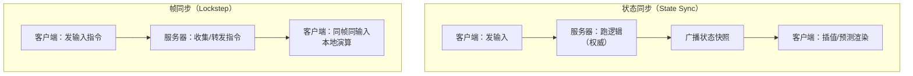
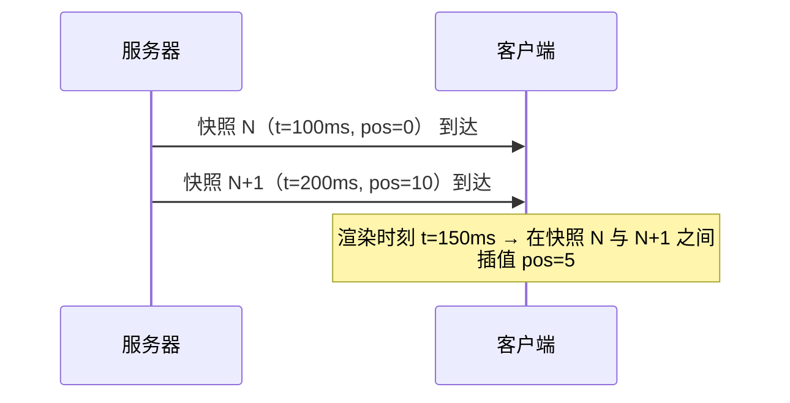
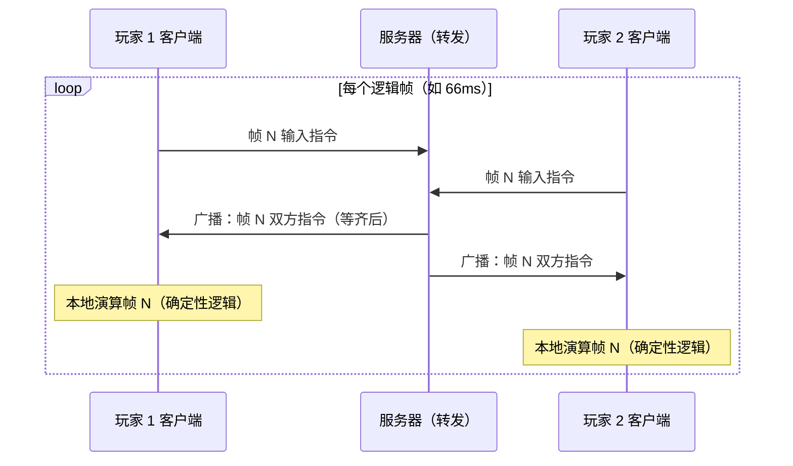
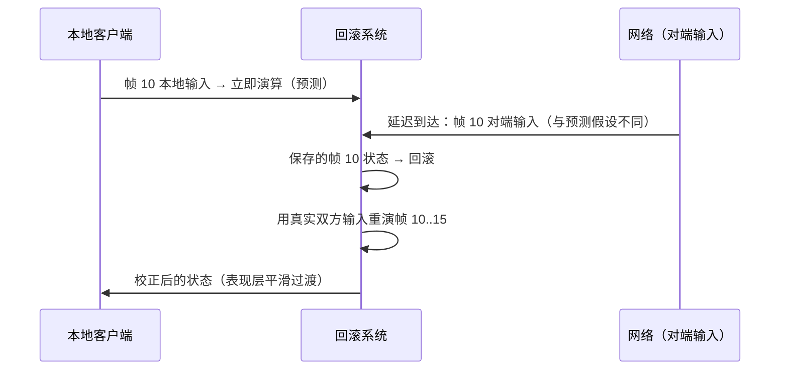

# 03 帧同步与状态同步（Lockstep vs State Sync）

> 知识基线：实时游戏服务端通用架构；示例中的语言、数据库、缓存、容器和云平台版本必须以项目部署清单为准。
> 适用范围：覆盖房间/游戏服内的状态同步、帧同步、回放与观战；网关/登录只负责连接与会话，不负责玩法权威判定。
> 事实边界：协议规范、组件行为和示例方案分开；容量数字只作示意/经验值，必须通过压测验证。
> 最后更新：2026-08-06（补齐规范来源、版本边界与工程验收入口）。
> 版本边界：以 2026-08-06 为核对日，不新增不确定的当前组件版本号；逻辑、物理、序列化和客户端库版本由项目部署清单锁定。
> 参考来源：[QUIC RFC 9000](https://www.rfc-editor.org/rfc/rfc9000.html)、[WebSocket RFC 6455](https://www.rfc-editor.org/rfc/rfc6455.html)、[Protocol Buffers 官方文档](https://protobuf.dev/)、[gRPC 官方文档](https://grpc.io/docs/)。

### P0 同步证据与确定性验收

| 方案 | 必须成立的假设 | 验收入口 |
| --- | --- | --- |
| 状态同步 | 服务端是权威状态源，客户端只消费快照/增量并做插值或预测表现 | 快照序号、重连全量校正、丢包/乱序恢复、客户端不可信字段拒绝 |
| 帧同步 | 各端消费同一输入序列，并在固定时间步、随机种子、数值表示、迭代顺序和逻辑版本下得到同一结果 | 跨平台回放复算、哈希/关键状态比对、断线追帧、非确定性告警 |

- 传输只是承载选择：TCP/WebSocket 适合可靠有序控制和快照；UDP/KCP/QUIC 可承载低延迟输入或增量，但必须先验证丢包、乱序、MTU、连接迁移/重传语义和目标网络可达性；KCP 的实现与参数不属于 RFC 规范。
- 帧格式与输入消息使用 protobuf 时，字段编号不可复用，新增字段需旧端可忽略；回放文件、快照和事件要带 schema/逻辑版本，版本差异不能靠“当前最新”假设掩盖。
- 限流/超时边界：按玩家、房间和连接限制输入频率与帧积压，设置握手、心跳、追帧、快照和回放读取 deadline；超过预算时按业务选择丢弃非关键输入、降频、暂停追帧或结束会话。
- 工程验收必须保留确定性测试矩阵、网络故障注入、重连结果和压测报告；“看起来同步”不是跨平台确定性的证据。

> 适用读者：游戏客户端/服务端网络同步开发者、玩法架构师
> 前置知识：02 篇的传输层与消息协议基础
> 目标：透彻理解状态同步与帧同步两种机制的原理、优劣与工程实现，
> 掌握确定性（determinism）实现的四大要点（定点数/浮点一致/随机种子/固定时间步），
> 并了解回放（replay）与观战（spectator）的落地方式。

---

## 1. 概述

多人实时游戏的核心问题是：**如何让所有玩家看到"同一个世界"**。
网络有延迟（latency）、抖动（jitter）与丢包（packet loss），而玩家要求"指哪打哪"的手感。
同步机制（synchronization mechanism）就是回答这个问题的技术体系，主要分两大流派：

- **状态同步（State Synchronization）**：服务器同步"世界状态"（位置、血量、Buff），
  客户端渲染状态并做插值/预测。主流 MMO、射击游戏使用。
- **帧同步（Lockstep / Frame Synchronization）**：服务器同步"玩家输入"（指令），
  每个客户端用同一套逻辑自行演算，从而得到一致的世界。格斗、RTS、部分 MOBA 使用。

> 关键认知：帧同步"省流量、省服务器"的本质是把**计算分摊到客户端**，
> 但它要求所有客户端**逐位一致**（deterministic），这是整个流派最大的工程难点。

---

## 2. 核心概念（Core Concepts）

| 术语 | 英文 | 说明 |
| --- | --- | --- |
| 状态同步 | State Synchronization | 同步实体状态结果（快照），客户端负责表现 |
| 帧同步 | Frame Synchronization / Lockstep | 同步输入指令，各端独立演算同一逻辑 |
| 快照 | Snapshot | 某一时刻全体实体状态的集合 |
| 增量快照 | Delta Snapshot | 只含变化字段的快照 |
| 插值 | Interpolation | 在两次快照之间平滑过渡（补偿抖动） |
| 外推 | Extrapolation / Dead Reckoning | 无新快照时按运动规律预测位置 |
| 确定性 | Determinism | 相同输入 + 相同逻辑 ⇒ 相同结果（逐位一致） |
| 定点数 | Fixed-Point Arithmetic | 用整数模拟小数，消除浮点平台差异 |
| 固定时间步 | Fixed Timestep | 逻辑按固定 dt 推进（如 66ms/帧） |
| 输入指令 | Input Command | 玩家操作序列化后的最小单元（方向/按键/帧号） |
| 输入队列 | Input Queue | 按帧号缓冲与排序的指令队列 |
| 预测 | Prediction | 客户端本地先行演算，减少感知延迟 |
| 回滚 | Rollback | 服务器结果与预测不符时回退重演（GGPO 类技术） |
| 回放 | Replay / Demo | 用指令或快照重演对局 |
| 观战 | Spectator | 以延迟 N 帧的方式旁观对局 |
| 逻辑帧 | Logic Tick / Frame | 逻辑层的时间单位（与渲染帧无关） |
| 渲染帧 | Render Frame | 图形层每秒 60/120 帧的绘制单位 |
| 延迟补偿 | Lag Compensation | FPS 中服务器按"射击时刻"回放判定 |

---

## 3. 原理详解（In-Depth）

### 3.1 两种机制的原理对比



| 维度 | 状态同步 | 帧同步 |
| --- | --- | --- |
| 同步内容 | 状态快照（结果） | 输入指令（原因） |
| 每帧数据量 | 与实体数成正比（大） | 与玩家数成正比（小，每条几字节） |
| 服务器职责 | 跑全量逻辑（重） | 收集/转发/校验（轻） |
| 客户端职责 | 表现 + 预测 | 跑全量逻辑（重） |
| 反作弊 | 强（服务器权威） | 弱（需额外校验/复算） |
| 断线重连 | 拉快照即可（简单） | 需补指令流（复杂） |
| 回放 | 存快照（体积大） | 存指令（体积小、可快进） |
| 逻辑一致性要求 | 客户端可容错 | 必须确定性 |
| 代表游戏 | WOW、王者荣耀（主流方案）、PUBG | 星际争霸、街霸 5（回滚）、拳皇 |

### 3.2 状态同步详解（State Sync）

#### 快照（Snapshot）

服务器按固定频率（如 10~20Hz）把场景内实体状态打包广播。快照是全量（full）或增量（delta）：

- **全量快照**：实现简单、容错强（丢包无累积误差），但流量大；
- **增量快照**：只发送变化字段（如 `dirty mask` 标记哪些字段变了），流量小，但丢包会引入不一致。

工程上常用"**周期全量 + 帧间增量**"组合：每 1 秒一个全量兜底，期间发增量。

```protobuf
message Snapshot {
  uint32 seq = 1;                    // 快照序号（客户端排序去重）
  uint64 server_time = 2;            // 服务器时间（毫秒）
  repeated EntityState entities = 3; // 实体状态列表
}

message EntityState {
  uint64 entity_id = 1;
  uint32 dirty = 2;                  // 位掩码：哪些字段有效（增量快照）
  optional float x = 3;
  optional float y = 4;
  optional float hp = 5;
  optional uint32 anim_state = 6;
}
```

#### 插值（Interpolation）

网络抖动会让快照到达时间不均匀。插值法：客户端维护一个**快照缓冲**（interpolation buffer），
渲染时永远"慢半拍"（如 100ms），在两个快照之间线性/样条插值出位置。



**插值 vs 外推**：

| | 插值（Interpolation） | 外推（Extrapolation / Dead Reckoning） |
| --- | --- | --- |
| 原理 | 用**过去两个**状态平滑过渡 | 用**最近一个**状态 + 速度预测未来 |
| 表现 | 平滑但整体延迟约半个缓冲期 | 响应快但预测错时会有"拉扯" |
| 丢包表现 | 缓冲耗尽会停顿 | 可持续预测，偏差靠校正 |
| 适用 | MMO 移动、任何平滑移动 | 射击游戏子弹、他人角色（配合校正） |

#### 外推与校正（Dead Reckoning & Reconciliation）

外推公式：`pos(t+dt) = pos(t) + vel * dt`（可加加速度）。当新快照到达且与预测偏差较大时，
客户端需要**校正**（snap 或平滑过渡），否则会看到角色瞬移。
权威型校正：客户端预测自己的操作（client-side prediction），服务器回发权威状态时，
若不一致则**回滚到服务器状态并重放本地输入**（reconciliation）。

### 3.3 帧同步详解（Lockstep）

#### 基本流程



**核心规则**：
1. 每个逻辑帧（tick），玩家把**输入指令**（带帧号）上报服务器；
2. 服务器收集该帧**所有玩家**的指令，齐了才广播（这就是 lockstep——步调一致）；
3. 每个客户端拿到全量指令后，用确定性逻辑推进一帧；
4. 只要逻辑与初始状态一致，所有客户端的世界**逐位相同**，无需同步状态。

#### 输入指令（Input Command）

```protobuf
message InputCommand {
  uint32 frame = 1;        // 逻辑帧号
  uint32 action_mask = 2;  // 按键位掩码（bit0=左 bit1=右 bit2=跳 bit3=攻击...）
  int16  dx = 3;           // 摇杆方向（可选，-1000~1000 定点）
  int16  dy = 4;
  uint32 random_seed = 5;  // 本帧随机种子（用于命中/暴击等判定）
  uint32 seq = 6;          // 客户端指令序号（去重）
}
```

指令要**幂等可重放**：服务器/客户端缓存最近 N 帧指令，用于补发与回滚。

#### 确定性（Determinism）——帧同步的生命线

帧同步要求"相同输入 → 相同输出"，任何一处平台差异都会导致**世界分叉**（desync）。
四大要点：

##### (a) 定点数（Fixed-Point）

浮点数（float/double）在不同 CPU（x86 vs ARM）、不同编译器优化、不同数学库实现下
结果可能不同（IEEE 754 只约束单次运算，不约束中间舍入）。**彻底解法：不用浮点，用定点**。

定点数 = 整数 × 缩放因子。例如 Q16.16 格式（16 位整数 + 16 位小数）：

| 运算 | 公式（Q16.16） | 说明 |
| --- | --- | --- |
| 加法 | `a + b` | 直接加 |
| 减法 | `a - b` | 直接减 |
| 乘法 | `(a * b) >> 16` | 先乘后右移（注意 64 位中间量） |
| 除法 | `(a << 16) / b` | 先左移再除 |
| 开方 | 整数牛顿迭代/查表 | 无浮点库 |

```cpp
// 简化定点数（Q16.16，32 位）
using fixed = int32_t;
constexpr int32_t FRAC = 16;

fixed FixedMul(fixed a, fixed b) {
    return (fixed)(((int64_t)a * b) >> FRAC);   // 64 位中间量防溢出
}

fixed FixedDiv(fixed a, fixed b) {
    return (fixed)(((int64_t)a << FRAC) / b);
}
```

##### (b) 浮点一致性（如果坚持用浮点）

- 统一编译器与优化选项（`-ffast-math` 禁止！它破坏 IEEE 语义）；
- 统一使用单精度 float，禁用 double 混用；
- 三角函数/开方/指数：**自己实现确定性版本**（查表 + 定点/整数近似），
  因为 `sin()` 在不同库、不同 CPU 上结果不同；
- 统一编译目标（x86-64 与 ARM64 的 fma 融合乘加行为不同，需显式控制）。

##### (c) 随机种子（Random Seed）

随机必须**可复现**：不用系统 `rand()`，用确定性伪随机数发生器（PRNG），
以"对局种子 + 帧号 + 实体 ID"为输入：

```cpp
// LCG：简单但确定（游戏逻辑够用；加密场景不要用）
uint32_t seed = battleSeed ^ (frame << 16) ^ entityId;
uint32_t NextRand(uint32_t& s) {
    s = s * 1664525u + 1013904223u;
    return s;
}
```

更好的选择：xorshift、PCG、SplitMix64（同样确定性，分布更均匀）。
注意：**每个客户端必须用同一序列**，即随机数的"消费顺序"也必须一致——这正是帧同步要求逻辑一致的原因。

##### (d) 固定时间步（Fixed Timestep）

逻辑推进必须用**固定 dt**（如 1/15s = 66ms 或 1/30s），绝不能跟随渲染帧率：

```cpp
// 固定时间步累加器（客户端与服务端同一套）
const double FIXED_DT = 1.0 / 30.0;
double accumulator = 0;

void OnRenderFrame(double frameDelta) {
    accumulator += frameDelta;
    while (accumulator >= FIXED_DT) {
        StepLogic(FIXED_DT);   // 每步推进一个逻辑帧
        accumulator -= FIXED_DT;
    }
}
```

##### 其他确定性陷阱

- **哈希表/字典遍历顺序**：不同平台迭代顺序可能不同 → 用有序容器或显式排序；
- **多线程**：逻辑必须单线程（或多线程严格分区，绝不共享可变状态）；
- **未初始化变量**：读取未初始化内存在不同平台结果不同；
- **`sin/cos`、`pow`、`sqrt`**：一律替换为确定性实现；
- **字符串/排序**：比较规则统一（如 UTF-8 字节序）；
- **物理引擎**：Box2D 在定点/浮点模式下都要验证跨平台一致性（Box2D 官方提供 fixed-point 版本思路）。

#### 3.4 Lockstep 与延迟隐藏（Latency Hiding）

朴素 Lockstep 的痛点：**最慢的玩家决定所有人的帧率**（等待最慢者指令）。
解法：

| 技术 | 原理 | 效果 |
| --- | --- | --- |
| 输入延迟（Input Delay） | 所有玩家延迟 N 帧执行输入（如 3 帧） | 用固定延迟换取确定性，格斗游戏经典方案 |
| 乐观帧（Optimistic Lockstep） | 服务器不等齐就广播已收集的指令，客户端先演算 | 降低等待，但可能短暂不一致（预测回滚兜底） |
| 回滚网络代码（Rollback / GGPO） | 客户端先按本地输入演算，收到他人输入发现冲突时回滚重演 | 格斗/竞速手感最佳（GGPO 中间件，街霸 5、拳皇 14 使用） |
| 服务器统一仲裁 | 服务器权威跑逻辑，客户端预测 + 回滚 | 防作弊最强，但服务器成本高（回到状态同步） |

**GGPO（Good Game Peace Out）回滚核心流程**：



#### 3.5 回放与观战（Replay & Spectator）

**回放（Replay）**：

- **帧同步回放**：只需记录"每帧的全体输入指令 + 对局种子"，体积极小
  （1 小时对战约几 MB），可任意快进/倒退（重演即可）；这是 RTS/格斗 demo 的标准做法；
- **状态同步回放**：定期快照（如每秒 2 个）+ 帧间增量，重放时插值；
  体积大，但可回放任意视角、任意实体；
- **双轨回放**：关键对局用指令轨（可复盘操作），观战用状态轨（可自由视角）。

```python
# 帧同步回放文件（示意，JSON 便于阅读；线上用二进制）
{
  "game": "battle-arena",
  "version": 15,
  "battle_seed": 2026080401,
  "players": [{"id": 1, "hero": "archer"}, {"id": 2, "hero": "mage"}],
  "frames": [
    {"f": 0, "inputs": {"1": 0, "2": 0}},
    {"f": 1, "inputs": {"1": 3, "2": 4}},
    {"f": 2, "inputs": {"1": 3, "2": 5}}
  ]
}
```

**观战（Spectator）**：

- **延迟 N 帧观战**：观战端收到指令/快照后延迟 N 帧播放，保证观战看到的是"已确定"的最终结果（无预测抖动）；
- **观战者数量**：大规模观战（电竞赛事）由服务器做"观战流"——服务器本身成为观察者，
  对观战者广播合并流，避免每个观战者都成为逻辑参与者；
- **帧同步观战陷阱**：观战者不参与逻辑，只消费"最终状态"（由某个权威端或服务器转译），
  否则 1 万观战者 = 1 万份逻辑演算。

---

## 4. 代码/配置示例（Examples）

### 4.1 确定性随机（PCG 简化版）

```cpp
struct DeterministicRng {
    uint64_t state;
    explicit DeterministicRng(uint64_t seed) : state(seed) {}

    uint32_t Next() {
        uint64_t old = state;
        state = old * 6364136223846793005ULL + 1442695040888963407ULL;
        uint32_t xorshifted = (uint32_t)(((old >> 18u) ^ old) >> 27u);
        uint32_t rot = (uint32_t)(old >> 59u);
        return (xorshifted >> rot) | (xorshifted << ((-rot) & 31));
    }
    // 每个玩家、每帧独立实例，确保消费顺序一致
};
```

### 4.2 帧同步服务器的帧调度（Go 示意）

```go
type FrameState struct {
    Frame  uint32
    Inputs map[uint64]InputCommand // player_id -> input
}

func (s *Room) Tick() {
    s.frame++
    // 等齐所有存活玩家的本帧指令（或超时采用"上一帧指令/空指令"策略）
    if !s.allInputsReady() {
        s.waitForInputs()          // 阻塞该帧（Lockstep 语义）
    }
    s.Broadcast(&FrameBroadcast{
        Frame:  s.frame,
        Inputs: s.frameInputs,
    })
    s.frameInputs = map[uint64]InputCommand{}
}
```

### 4.3 状态同步的插值缓冲（C# 示意）

```csharp
public class InterpolationBuffer {
    private readonly Queue<Snapshot> _buf = new();
    private TimeSpan _bufferTime = TimeSpan.FromMilliseconds(100);

    public Vector3 GetRenderPosition(TimeSpan now) {
        // 移除过期快照，保持缓冲深度 ≈ 100ms
        while (_buf.Count >= 2 && _buf.Peek().Time < now - _bufferTime) {
            _buf.Dequeue();
        }
        if (_buf.Count < 2) return _buf.Peek().Pos;      // 缓冲不足：直接显示最新
        var a = _buf.ElementAt(0);
        var b = _buf.ElementAt(1);
        float t = (float)((now - a.Time).TotalSeconds / (b.Time - a.Time).TotalSeconds);
        return Vector3.Lerp(a.Pos, b.Pos, Math.Clamp(t, 0, 1));
    }
}
```

### 4.4 回滚（Rollback）保存与恢复（伪代码）

```cpp
// 每帧保存完整世界状态（帧同步世界小，快照便宜）
class RollbackBuffer {
    std::deque<std::pair<uint32_t, WorldState>> states_;  // 帧号 -> 状态

    void SaveFrame(uint32_t frame, const WorldState& ws) {
        states_.push_back({frame, ws});
        if (states_.size() > kMaxRollbackFrames) states_.pop_front();
    }
    WorldState LoadFrame(uint32_t frame) {
        for (auto it = states_.rbegin(); it != states_.rend(); ++it)
            if (it->first == frame) return it->second;
        throw std::runtime_error("frame too old to rollback");
    }
};
```

---

## 5. 最佳实践（Best Practices）

1. **选型看品类**：大世界（MMO/开放世界）用状态同步；小规模强对抗（格斗/RTS/竞速/部分 MOBA）
   用帧同步或回滚；**不确定就状态同步**——它的工程风险最低。
2. **确定性从第一天做起**：只要可能上帧同步，逻辑层立刻禁用浮点/系统随机，
   用固定时间步 + 定点数 + 确定性 PRNG，并为逻辑代码写"确定性单测"（同一输入双端对拍）。
3. **对拍测试（Replay Test）**：录制一段真实对局指令流，在 CI 中让
   Windows/Linux/ARM 三个环境重演并逐帧比对哈希（世界状态哈希），任何分叉立即失败。
4. **服务器保留校验能力**：纯帧同步防作弊弱；建议服务器对关键帧复算
   （确定性逻辑服务器也能跑），抽查客户端上报的对局哈希（battle hash）。
5. **断线重连按同步类型设计**：状态同步重连 = 拉快照 + 排队期间补帧；
   帧同步重连 = 补指令流 + 快进演算，超时未归队判负/托管。
6. **观战与回放纳入架构**：对局一开始就决定"谁录、录什么、何时可回放"，别等上线后补。
7. **网络预算先行**：帧同步每玩家每帧指令 ≤ 几十字节；状态同步按实体数预算
   （如 50 实体 × 20Hz × 50B = 50KB/s 需评估移动网络）。
8. **表现与逻辑分离**：渲染帧与逻辑帧解耦；表现层插值/抖动缓冲永远不要污染逻辑层。
9. **外推的"拉扯"最小化**：预测偏差大时用"指数平滑校正"而非瞬移；
   同时上报服务器时间戳统一时钟（NTP 或服务器时间同步包）。
10. **混合同步**：PVE 状态同步 + PVP 帧同步在同一游戏内完全可以共存，
    但两套系统要抽象成统一接口（`ISyncDriver`），避免逻辑层被同步方案绑架。

---

## 6. 常见问题 FAQ

**Q1：帧同步和状态同步哪个流量小？**
帧同步流量小得多（每玩家每帧几字节 vs 每实体每帧几十字节），
但这是以"客户端各自跑逻辑"为代价的。10v10 帧同步 ≈ 10 条指令/帧；
100 实体的状态同步 ≈ 100 条实体状态/帧。

**Q2：为什么我的帧同步在 Android 和 iPhone 上分叉（desync）？**
几乎都是确定性问题：float 运算、系统 `rand()`、`sin/cos` 库差异、
字典遍历顺序、未初始化内存。按 3.3 节逐一排查，并用对拍测试固化。

**Q3：格斗游戏为什么要"输入延迟"？**
因为纯 Lockstep 必须等最慢的玩家。输入延迟（如 3 帧 ≈ 50ms）给网络一个
"缓冲窗口"，代价是固定的操作延迟；回滚（GGPO）则用预测消除等待，但实现复杂得多。

**Q4：状态同步的"插值慢半拍"会不会影响操作手感？**
插值只用于**他人**实体（网络延迟本来就有）；**自己**的角色用"客户端预测 + 服务器回滚"，
手感几乎无感。FPS 再加延迟补偿（lag compensation）处理"打中与否"的判定。

**Q5：帧同步怎么防外挂？**
帧同步客户端持有全部逻辑，天然易被"透视/修改器"攻击。
对策：服务器复算关键帧（确定性逻辑服务器也能跑）、对局哈希抽查、
关键数据（视野、经济）仍走服务器权威下发、敏感判定（如开箱）服务器参与。
完全无法接受外挂风险的品类（如竞技排名）建议状态同步。

**Q6：帧同步支持多少人？**
理论无上限（指令数量线性），但实际受限于：等待最慢玩家（人多更容易出现卡顿）、
回滚成本（状态大时回滚贵）、确定性逻辑复杂度。常见：格斗 2-8 人、RTS 8-16 人、
MOBA 10 人；几十人以上的强对抗更推荐状态同步或"服务器权威帧同步"（服务器跑逻辑，
客户端只做表现——本质是状态同步，但协议按帧组织）。

**Q7：观战需要跑逻辑吗？**
不需要。观战端消费"最终状态流"（服务器转译或权威端输出），延迟 N 帧播放；
让观战者跑逻辑 = 服务器压力翻倍且可能被观战者拖慢对局。

**Q8：回放文件能用于反作弊吗？**
能。帧同步回放天然记录全部输入，可用于"人工仲裁"（举报审核）与
"机器复算校验"（用服务器确定性逻辑重演，比对玩家上报结果）。

---

## 7. 关联阅读（Related Reading）

- 本分类：[01-服务器架构模式.md](01-服务器架构模式.md)（同步架构选型与权威服务器）
- 本分类：[02-网络通信与协议设计.md](02-网络通信与协议设计.md)（UDP/KCP 承载帧同步、TCP 承载状态同步）
- 本分类：[04-消息系统与事件驱动.md](04-消息系统与事件驱动.md)（服务器内对局房间的消息调度）
- 本分类：[05-并发与高性能.md](05-并发与高性能.md)（确定性逻辑与多线程的冲突）
- 知识库其他篇章：逻辑系统与玩法（战斗系统落地）、安全与反外挂（对局校验）
- 外部资料：[GGPO 官方网站](https://www.ggpo.net/)、[Box2D 官方文档](https://box2d.org/documentation/)、
  [Gaffer On Games](https://gafferongames.com/)（网络同步系列）、
  [Networking for Game Programmers](https://www.gamedev.net/tutorials/programming/general-and-gameplay-programming/networking-for-game-programmers-r509/)
