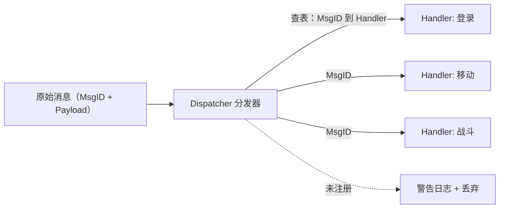
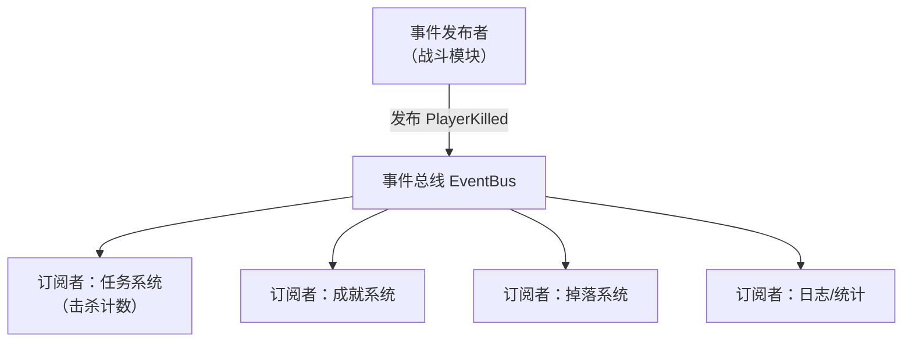
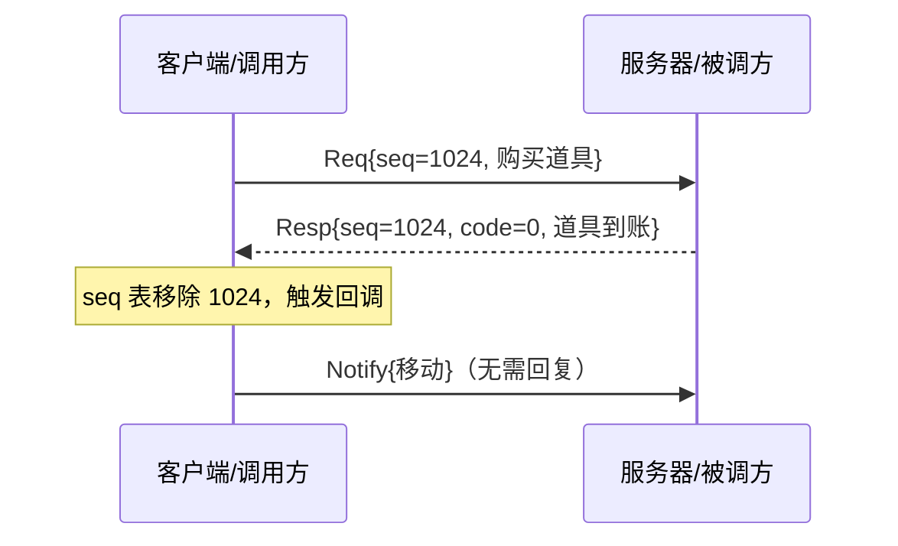
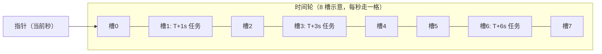
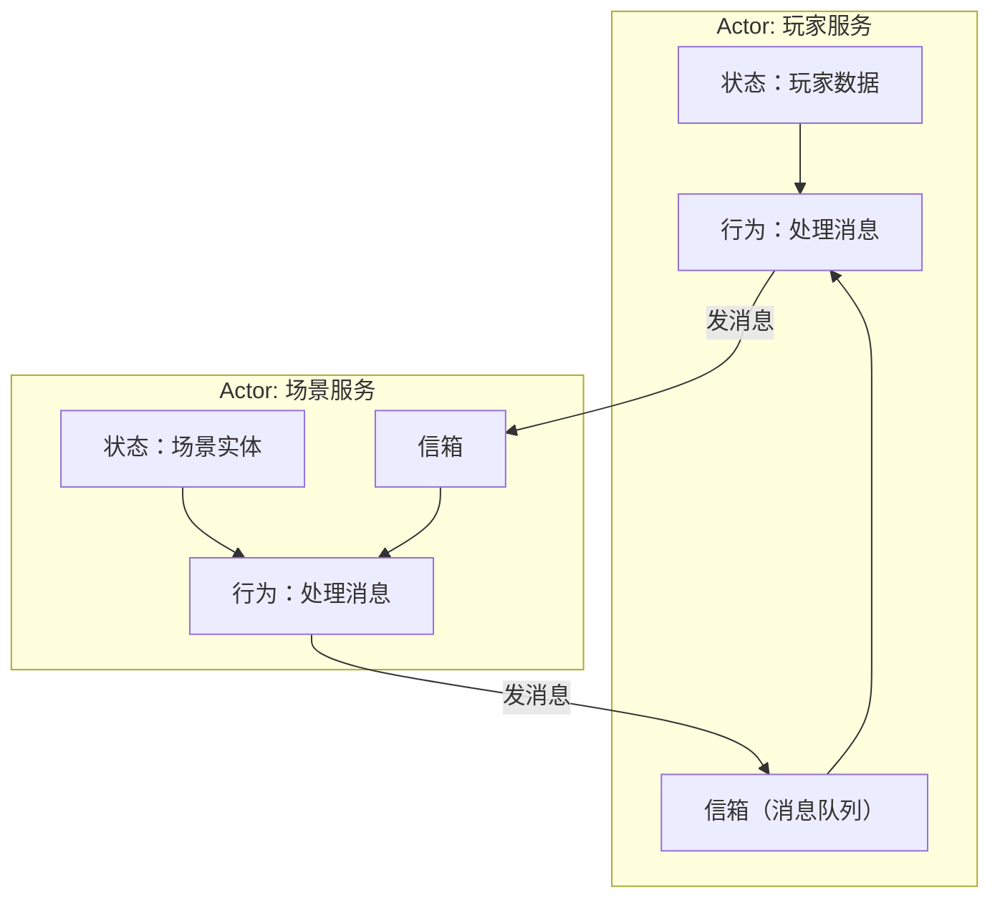
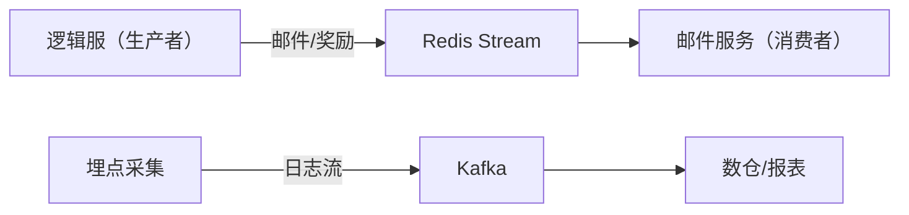

# 04 消息系统与事件驱动（Messaging & Event-Driven Architecture）

> 知识基线：实时游戏服务端通用架构；示例中的语言、数据库、缓存、容器和云平台版本必须以项目部署清单为准。
> 适用范围：覆盖网关到游戏服以及服务间的请求、事件、队列和 RPC 路径；不定义具体业务资产的数据库模型。
> 事实边界：协议规范、组件行为和示例方案分开；容量数字只作示意/经验值，必须通过压测验证。
> 最后更新：2026-08-06（补齐规范来源、版本边界与工程验收入口）。
> 版本边界：以 2026-08-06 为核对日，不新增不确定的当前组件版本号；消息运行时、中间件和容器版本由项目部署清单锁定。
> 参考来源：[TCP RFC 9293](https://www.rfc-editor.org/rfc/rfc9293.html)、[Protocol Buffers 官方文档](https://protobuf.dev/)、[gRPC 官方文档](https://grpc.io/docs/)、[Redis 官方文档](https://redis.io/docs/latest/)。

### P0 消息兼容与投递边界

- protobuf schema 是消息兼容的证据入口：字段编号不可复用，新增字段应允许旧消费者忽略，删除字段保留编号；每条命令/事件记录 schema 版本、消息 ID、来源和产生时间。
- gRPC 请求必须定义 deadline、状态码、重试条件和幂等语义；事件/队列按至少一次投递设计时，消费者以 eventId 或业务键去重，不能把“送达”误写成“只处理一次”。
- 顺序只在明确的 key/分区/Actor 内保证；不追求跨服务全局有序。积压、消费者变慢和毒消息要有背压、隔离、重试上限和死信/人工处理入口。
- 限流与超时按连接、调用方、消息类型和队列长度分层设置；超过处理预算要拒绝、降级或延迟，不以无限重试掩盖故障。验收需覆盖重复、乱序、断连、重启、发布回滚和消息洪水。

> 适用读者：服务端开发、框架设计者
> 前置知识：01 篇的架构模式、02 篇的消息协议
> 目标：掌握服务器内部"消息如何流转"的完整体系——消息路由、事件系统、请求-响应、
> 时间轮定时器、Actor 模型、消息队列与 RPC 框架设计。

---

## 1. 概述

游戏服务器本质是一个**消息处理机器**：玩家的每个操作是消息，场景的每个事件是消息，
模块之间的每次协作也是消息。消息系统（messaging system）设计的好坏，
直接决定代码的耦合度、可扩展性与并发安全。

本章回答五个问题：

1. **消息怎么路由**：一条消息到达后，如何找到处理它的代码？
2. **事件怎么传播**：模块之间如何"解耦地"通知彼此（发布-订阅）？
3. **请求-响应怎么做**：需要"问一句答一句"的场景如何建模？
4. **定时任务怎么调度**：Buff 到期、活动开启等海量定时器如何高效管理？
5. **跨进程/跨服怎么通信**：Actor、消息队列、RPC 各自解决什么问题？

业界框架对照：**Skynet**（C+Lua，Actor 模型开源实现）、**ET**（C# 双端）、
**kbengine**（C++ 多进程消息）、**Pomelo**（Node.js 多进程推送）、**Nakama**（Go 单进程多模块）、
**Akka/Erlang**（Actor 的工业标杆）。

---

## 2. 核心概念（Core Concepts）

| 术语 | 英文 | 说明 |
| --- | --- | --- |
| 消息 | Message | 进程内/进程间传递的数据单元（含类型与载荷） |
| 事件 | Event | "已经发生的事实"（如 PlayerLevelUp），发布-订阅传播 |
| 命令 | Command | "希望发生的意图"（如 AddItem），通常有明确接收者 |
| 事件驱动 | Event-Driven | 程序流程由事件（消息）触发，而非顺序调用 |
| 消息路由 | Message Routing | 根据消息类型/目标把消息送达处理者的机制 |
| 分发器 | Dispatcher | 消息 ID 到 Handler 的注册与查表组件 |
| 发布-订阅 | Pub/Sub | 发布者不关心谁订阅，订阅者不关心谁发布 |
| 请求-响应 | Request-Response | 一问一答模式，靠请求 ID 关联 |
| 通知 | Notification | 单向消息（Oneway），无需回复 |
| RPC | Remote Procedure Call | 让跨进程调用像本地函数调用 |
| 定时器 | Timer | 延迟/周期执行的任务 |
| 时间轮 | Timing Wheel | O(1) 增删定时任务的数据结构 |
| Actor | Actor Model | 万物皆 Actor：状态私有 + 信箱 + 消息驱动 |
| 信箱 | Mailbox | Actor 的消息队列 |
| 消息队列 | Message Queue | 解耦生产/消费的中间件（进程内或跨服） |
| 背压 | Backpressure | 消费速度跟不上时反向限制生产 |
| 幂等 | Idempotency | 同一请求执行多次结果一致（重试安全） |
| 熔断 | Circuit Breaker | 下游故障时快速失败，避免雪崩 |

---

## 3. 原理详解（In-Depth）

### 3.1 消息路由与分发（Routing and Dispatch）

进程内消息分发的最常见形态：**消息 ID 到处理函数**的注册表。



**三种路由粒度**：

| 粒度 | 依据 | 适用 |
| --- | --- | --- |
| 类型路由 | 消息类/ID | 通用网络消息（C2S/S2C） |
| 目标路由 | 玩家 ID/房间 ID/服务名 | 把消息投递给具体玩家、房间、场景 |
| 主题路由 | Topic（如 chat.room.100） | 广播、订阅类消息 |

**目标路由的关键问题：消息"住在哪里"**。玩家数据可能分布在多个场景/服务，
路由层需要一张**定位表**（location table）：player_id 到 (service, node)。
Skynet 用 service name 到 handle 的注册表；kbengine 用 entityID 到 (cell, base) 双地址。

### 3.2 事件系统（Event System）

#### 事件与命令的区别

- **事件（Event）**：过去式命名，如 PlayerDied、ItemSold；没有"接收者"概念，
  谁关心谁订阅；发布者不知道也不关心结果；
- **命令（Command）**：祈使式命名，如 AddItem(玩家, 物品)；有明确目标，
  通常走请求-响应或 RPC，调用方关心成败。

> 铁律：**事件不返回值、不抛业务异常给发布者**；需要结果的用命令/RPC。

#### 发布-订阅（Pub/Sub）



```csharp
// C# 事件总线（简化）
public sealed class EventBus {
    private readonly Dictionary<Type, List<Delegate>> _subs = new();

    public void Subscribe<T>(Action<T> handler) where T : IEvent {
        if (!_subs.TryGetValue(typeof(T), out var list))
            _subs[typeof(T)] = list = new List<Delegate>();
        list.Add(handler);
    }

    public void Publish<T>(T evt) where T : IEvent {
        if (_subs.TryGetValue(typeof(T), out var list))
            foreach (var h in list) ((Action<T>)h)(evt);  // 同步分发
    }
}
```

**同步 vs 异步事件**：

| | 同步事件 | 异步事件 |
| --- | --- | --- |
| 执行时机 | 发布线程内立即执行 | 投递到队列，稍后处理 |
| 优点 | 简单、顺序确定、无竞态 | 解耦彻底、可跨线程 |
| 缺点 | 订阅者慢会拖慢发布者；重入风险 | 顺序不保证；调试难 |
| 适用 | 单线程逻辑服内部 | 跨线程/跨进程通知 |

**事件风暴（Event Storming Problem）**：一个事件触发一串事件（A 到 B 到 C 再到 A）可能死循环；
订阅者抛异常会污染发布者。对策：事件链深度限制、订阅者异常隔离（try/catch 包裹）、
必要时事件投递去重（dedupe）。

### 3.3 请求-响应与通知（Request-Response and Notification）

消息按语义分三类：

| 类型 | 方向 | 是否需回复 | 示例 |
| --- | --- | --- | --- |
| 通知 Notification（Oneway） | 单向 | 否 | 移动广播、聊天、Buff 生效 |
| 请求 Request | C 到 S 或 S 到 S | 是 | 登录、购买、移动校验 |
| 响应 Response | 反向 | 无需再回 | 登录结果、购买结果 |

**请求-响应关联**：靠请求消息头里的**序列号（seq）**配对。客户端发请求带 seq=1024，
服务器响应原样带回 seq=1024，客户端用 seq 到 callback 的映射表匹配。



**超时与错误码**：每个请求必须配超时（如 5 秒），超时触发重发或失败回调；
响应必须带错误码（code=0 表示成功），且**请求必须幂等**（重复执行不产生重复扣款/发奖）
——这是 RPC 重试安全的基础。

### 3.4 定时器与时间轮（Timers and Timing Wheel）

游戏服务器里有海量定时任务：Buff 到期（大量玩家乘多个 Buff）、技能冷却、活动倒计时、
定时存档。朴素做法（每个任务一个线程/一个 sleep）不可行；主流方案是**时间轮**。

**时间轮原理**：一个环形数组（槽位），每个槽位挂一个任务链表；
一个指针按固定 tick 前进一格，指针指向的槽位里的任务全部到期执行。
任务需要延迟 d 时，放入 (当前指针 + d 除以粒度) 对槽数取模的槽位。



**单层时间轮的局限**：槽数乘粒度等于最大延迟。8 槽乘 1 秒只能管 8 秒。
**层级时间轮（Hashed Hierarchical Timing Wheel，HHTW）**：多级轮（秒轮/分轮/时轮），
任务到期时降级到下轮。Netty 的 HashedWheelTimer、Linux 内核定时器都是此思想。

```python
# 简化时间轮（Python 示意）
class TimingWheel:
    def __init__(self, ticks: int, tick_ms: int):
        self.slots = [[] for _ in range(ticks)]
        self.tick_ms = tick_ms
        self.current = 0

    def add(self, delay_ms: int, callback):
        idx = (self.current + delay_ms // self.tick_ms) % len(self.slots)
        self.slots[idx].append(callback)   # 简化：不处理跨圈

    def advance(self):  # 每个 tick_ms 调用一次
        for task in self.slots[self.current]:
            task()                 # 执行到期任务
        self.slots[self.current].clear()
        self.current = (self.current + 1) % len(self.slots)
```

**工程要点**：定时器回调要"短平快"（不能阻塞太久）；取消任务用句柄（handle）
而非遍历查找；时间轮与最小堆对比：时间轮增删 O(1)，最小堆取最小 O(1) 但插入 O(log n)；
任务数巨大且延迟粒度固定时时间轮占优。

### 3.5 Actor 模型（Actor Model）

**定义**：万物皆 Actor。每个 Actor 拥有：

1. **私有状态**（不共享内存，天然无锁）；
2. **信箱（Mailbox）**：收到的消息排队；
3. **行为（Behavior）**：逐条处理消息，处理中可创建子 Actor、给其他 Actor 发消息。



**代表实现**：

| 框架 | 语言 | 特点 |
| --- | --- | --- |
| Erlang/OTP | Erlang | Actor 鼻祖，进程级隔离 + 监督树（supervisor）容错 |
| Akka | Scala/Java | JVM 版 Actor，集群模式成熟 |
| Skynet | C/Lua | 云风开源，单进程多"服务"（Lua 虚拟机），国内游戏团队使用极广 |
| Orleans | C# | 微软"虚拟 Actor"（Grain），自动激活/休眠，适合有状态服务 |
| Nakama | Go | 单进程多模块（近似 Actor 的模块化） |

**Skynet 示例（Lua）**：

```lua
-- 定义一个服务（Actor）
local skynet = require "skynet"

skynet.start(function()
    local counter = 0          -- 私有状态
    skynet.dispatch("lua", function(_, _, cmd, ...)
        if cmd == "inc" then
            counter = counter + 1
            skynet.ret(skynet.pack(counter))
        elseif cmd == "get" then
            skynet.ret(skynet.pack(counter))
        end
    end)
end)
```

**Actor 的代价**：消息复制/序列化开销、跨 Actor 调试困难、嵌套调用易成"消息风暴"。
**游戏里的最佳实践**：以"玩家/场景/服务"为 Actor 边界，Actor 内单线程处理，
避免"每个对象一个 Actor"的细粒度滥用。

### 3.6 消息队列（Message Queue）

#### 进程内队列

单进程内解耦生产/消费（如 IO 线程到逻辑线程），常用**无锁队列**（见 05 篇）
或双缓冲队列（生产者写 A 缓冲、消费者读 B 缓冲，交换指针）。

#### 跨服/跨进程队列

| 中间件 | 模型 | 游戏典型用途 |
| --- | --- | --- |
| Redis Stream/List | 轻量队列 | 跨服聊天、邮件、活动奖励发放 |
| RabbitMQ | AMQP，路由灵活 | 运营后台向游戏服下发指令 |
| Kafka | 高吞吐日志流 | 埋点日志、对局回放归档、排行榜流计算 |
| NATS | 轻量发布订阅 | 服务间事件通知 |



**消息队列三要素**：

1. **可靠性语义**：at-most-once（最多一次）/ at-least-once（至少一次，消费需幂等）/
   exactly-once（恰好一次，通常靠"幂等 + 去重"近似实现）；
2. **背压（Backpressure）**：队列堆积时要限流或拒绝新任务，避免内存暴涨；
3. **顺序保证**：跨服消息的全局顺序几乎不可得；按 key（如玩家 ID）分区保证单 key 有序即可。

### 3.7 RPC 框架设计（RPC Framework）

**RPC（远程过程调用）**让跨进程调用像本地函数：Login(playerId) 背后可能是
网关到登录服务的一次网络往返。

**完整 RPC 需要**：

| 组件 | 说明 |
| --- | --- |
| IDL 定义 | protobuf/gRPC、Thrift、自研协议文件 |
| 序列化 | 参数/返回值编解码 |
| 寻址 | 服务发现 + 负载均衡（etcd/Consul/K8s DNS） |
| 超时与重试 | 超时阈值、重试次数、幂等保证 |
| 错误处理 | 错误码、异常传播、熔断（circuit breaker） |
| 追踪 | trace ID 贯穿调用链（日志聚合） |

```protobuf
// gRPC 服务定义（跨服 RPC 示例）
service TradeService {
  rpc CreateTrade(CreateTradeReq) returns (CreateTradeResp);
  rpc ConfirmTrade(ConfirmTradeReq) returns (ConfirmTradeResp);
}

message CreateTradeReq {
  uint64 request_id = 1;   // 幂等键：同一 request_id 重复调用只生效一次
  uint64 player_a = 2;
  uint64 player_b = 3;
  repeated ItemSlot items_a = 4;
  repeated ItemSlot items_b = 5;
}
```

**RPC 陷阱**：

- **超时重试必须幂等**：扣款、发奖类操作以 request_id 去重；
- **嵌套 RPC 深度**：A 到 B 到 C 链路过长时延迟叠加，超时预算逐层递减；
- **回调地狱**：用协程/async-await 压平（Skynet 的 skynet.call、C# 的 async、Go 天然同步）；
- **网络分区**：RPC 失败不等于业务失败，状态机要能处理"未知结果"
  （如支付回调丢失后对账）。

---

## 4. 代码/配置示例（Examples）

### 4.1 消息注册与分发（C++ 示意）

```cpp
using Handler = std::function<void(Player*, const Message&)>;

class Dispatcher {
    std::unordered_map<uint16_t, Handler> handlers_;
public:
    void Register(uint16_t msgId, Handler h) { handlers_[msgId] = std::move(h); }

    void Dispatch(Player* p, const Message& msg) {
        auto it = handlers_.find(msg.Header.MsgId);
        if (it == handlers_.end()) {
            LogWarn("unhandled msg: %u", msg.Header.MsgId);  // 打日志，别静默
            return;
        }
        it->second(p, msg);
    }
};
```

### 4.2 请求-响应的 seq 关联（C# 示意）

```csharp
public sealed class RpcClient {
    private readonly Dictionary<uint, TaskCompletionSource<Message>> _pending = new();
    private uint _nextSeq = 1;

    public async Task<Message> CallAsync(Message req, TimeSpan timeout) {
        var seq = _nextSeq++;
        req.Header.Seq = seq;
        var tcs = new TaskCompletionSource<Message>();
        _pending[seq] = tcs;
        Send(req);
        using var ct = new CancellationTokenSource(timeout);
        ct.Token.Register(() => tcs.TrySetException(new TimeoutException("rpc timeout")));
        return await tcs.Task;
    }

    public void OnResponse(Message resp) {
        if (_pending.Remove(resp.Header.Seq, out var tcs))
            tcs.TrySetResult(resp);     // 超时后到达的响应直接丢弃
    }
}
```

### 4.3 事件驱动的任务系统（Lua 示意）

```lua
-- 事件总线（单线程逻辑服内）
local listeners = {}   -- event_name -> {fn, ...}

function subscribe(name, fn)
    listeners[name] = listeners[name] or {}
    table.insert(listeners[name], fn)
end

function publish(name, ...)
    for _, fn in ipairs(listeners[name] or {}) do
        local ok, err = pcall(fn, ...)   -- 订阅者异常隔离
        if not ok then log.error("event %s handler error: %s", name, err) end
    end
end

-- 用法：击杀事件驱动任务/成就/掉落
subscribe("PlayerKilled", function(killer, victim)
    quest_system.on_kill(killer, victim)
    achievement_system.on_kill(killer, victim)
    loot_system.on_kill(killer, victim)
end)
```

### 4.4 跨服消息（Redis Stream 消费，Go 示意）

```go
// 邮件服务消费"跨服邮件"队列
func ConsumeMail(ctx context.Context, rdb *redis.Client) {
    for {
        result, err := rdb.XReadGroup(ctx, &redis.XReadGroupArgs{
            Group: "mail-svc", Consumer: "mail-1",
            Streams: []string{"mail:deliver", ">"},
            Count: 100, Block: time.Second,
        }).Result()
        if err != nil { continue }
        for _, stream := range result {
            for _, msg := range stream.Messages {
                deliverMail(msg)          // 处理
                rdb.XAck(ctx, "mail:deliver", "mail-svc", msg.ID)  // 确认（at-least-once）
            }
        }
    }
}
```

---

## 5. 最佳实践（Best Practices）

1. **消息语义先分类再编码**：Oneway/Request/Response 在协议层显式区分，
   避免"不知道要不要回复"的混乱；通知不带 seq，请求必带 seq。
2. **事件用过去式、命令用祈使式**：命名即文档，杜绝"既是事件又是命令"的暧昧消息。
3. **订阅者必须异常隔离**：一个订阅者崩溃不能拖垮发布者与其他订阅者（pcall/try-catch）。
4. **事件链设深度上限**：防止 A 到 B 到 A 死循环；调试期打印事件链。
5. **所有请求必设超时**：无超时的 RPC 是内存泄漏与挂起协程的头号来源。
6. **写操作必幂等**：request_id 去重是分布式系统的第一安全网。
7. **定时器回调短平快**：回调里只做"投递消息"，重活交给逻辑帧；防止时间轮被阻塞。
8. **Actor 边界按"玩家/场景/服务"划**，粒度太细等于消息风暴加调试地狱。
9. **跨服队列按玩家 ID 分区**保证单玩家消息有序；全局有序是伪需求。
10. **埋点贯穿消息系统**：每个消息类型统计（次数/耗时/积压长度），
    上线后靠数据发现"热点消息"与"异常风暴"。

---

## 6. 常见问题 FAQ

**Q1：事件总线和直接函数调用有什么区别？**
直接调用 = 强耦合（A 要知道 B）；事件总线 = 解耦（A 只发事实，B/C/D 自己订阅）。
代价是流程隐性化（读代码难追踪）。**低频跨模块通知用事件，高频同模块调用用直接调用**。

**Q2：消息队列会不会让服务器变慢？**
会引入毫秒级延迟与额外资源，但换来解耦与削峰。游戏内**高频实时路径**（移动/战斗）
绝不走跨进程队列；队列只用于邮件、奖励、日志、活动等**非实时**业务。

**Q3：Skynet 的"服务"是线程吗？**
不是。Skynet 服务是运行在**单个线程**上的多个 Lua 虚拟机（协程调度），
消息在服务间投递（带锁的队列），服务内逐条处理。所以 Skynet 天然单线程逻辑、
无共享内存竞争，这也是它稳定的原因。

**Q4：RPC 超时了怎么办？重发安全吗？**
超时不代表失败（可能只是响应慢）。重发必须幂等：用 request_id 让服务端去重；
对"扣款/发奖"类操作，宁可"重复请求被去重"，不可"重复执行"。若无法幂等，
则只能"查询结果"而非"重发操作"。

**Q5：时间轮和最小堆定时器怎么选？**
任务量大（万级以上）、延迟粒度固定、增删频繁，选时间轮（O(1)）；
任务量小、需要精确取最近到期，选最小堆。游戏 Buff/冷却适合时间轮；活动倒计时随便。

**Q6：Actor 之间会死锁吗？**
同步阻塞式调用（A 等 B、B 等 A）会死锁。解决：
（a）禁止同步等待，全部异步回调/协程；（b）调用设超时；
（c）嵌套调用深度限制。Skynet 的 skynet.call 本质是"挂起协程等响应"，
配合超时机制规避死锁。

**Q7：消息顺序怎么保证？**
单线程逻辑服内天然有序；跨进程按 key 分区保证单 key 有序；
广播类消息不需要全局有序（客户端按 seq 排序）。**不要追求跨服务全局有序**。

---

## 7. 关联阅读（Related Reading）

- 本分类：[01-服务器架构模式.md](01-服务器架构模式.md)（服务化/微服务拆分与网关）
- 本分类：[02-网络通信与协议设计.md](02-网络通信与协议设计.md)（消息头、消息 ID 与序列化）
- 本分类：[05-并发与高性能.md](05-并发与高性能.md)（无锁队列、协程与 IO 线程模型）
- 知识库其他篇章：数据存储与缓存（Redis 队列与缓存一致性）、运维与部署（消息中间件运维）
- 外部资料：[Skynet 源码](https://github.com/cloudwu/skynet)、[Erlang/OTP 文档](https://www.erlang.org/doc/)（Actor 与监督树）、
  [Akka 文档](https://doc.akka.io/)、[Microsoft Orleans 文档](https://learn.microsoft.com/en-us/dotnet/orleans/overview)、[Netty HashedWheelTimer API](https://netty.io/4.1/api/io/netty/util/HashedWheelTimer.html)
