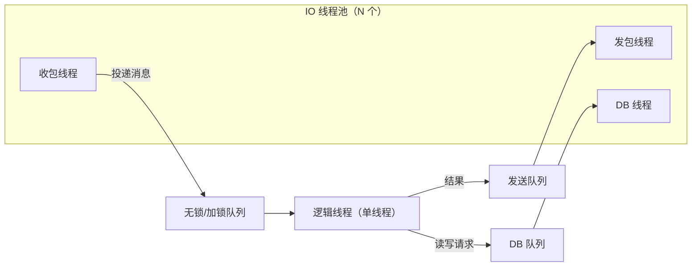
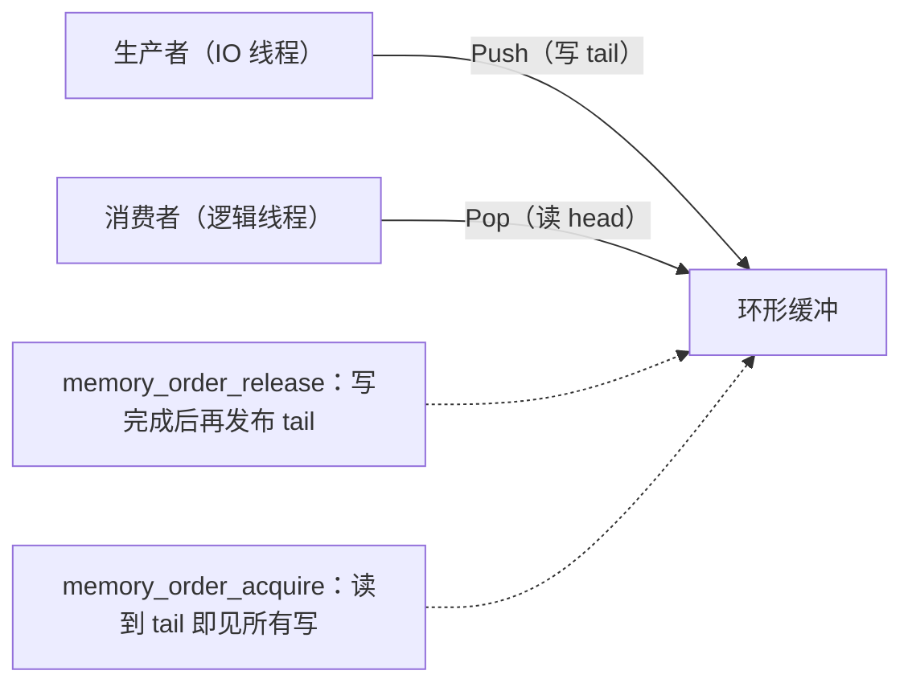
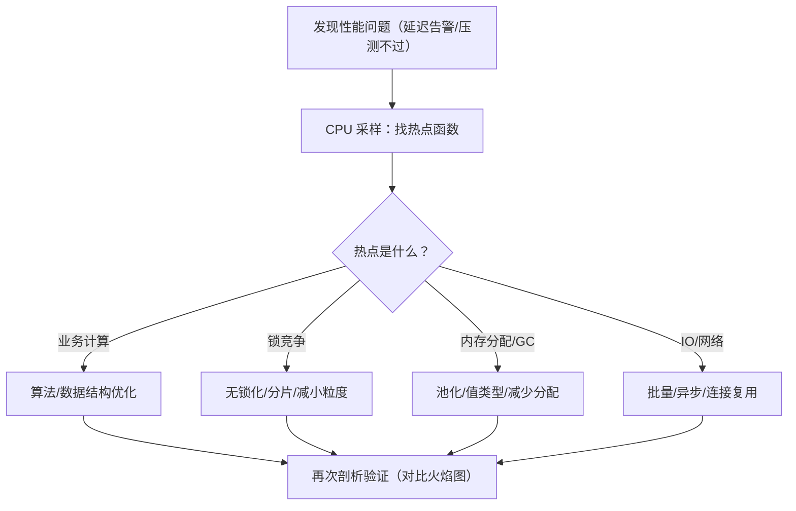

# 05 并发与高性能（Concurrency & High Performance）

> 知识基线：实时游戏服务端通用架构；示例中的语言、数据库、缓存、容器和云平台版本必须以项目部署清单为准。
> 适用范围：覆盖网关/登录 IO、房间/游戏服逻辑并发、数据服务连接池与压测入口；不把单机测得的容量外推到全链路。
> 事实边界：协议规范、组件行为和示例方案分开；容量数字只作示意/经验值，必须通过压测验证。
> 最后更新：2026-08-06（补齐规范来源、版本边界与工程验收入口）。
> 版本边界：以 2026-08-06 为核对日，不新增不确定的当前组件版本号；编译器、运行时、RPC 库和容器版本由项目部署清单锁定。
> 参考来源：[TCP RFC 9293](https://www.rfc-editor.org/rfc/rfc9293.html)、[QUIC RFC 9000](https://www.rfc-editor.org/rfc/rfc9000.html)、[Protocol Buffers 官方文档](https://protobuf.dev/)、[gRPC 官方文档](https://grpc.io/docs/)。

### P0 并发与性能证据入口

- 并发模型先证明逻辑所有权与消息顺序，再谈线程数；网关/登录 IO、房间/游戏服 Actor 或分片、数据连接池必须分别给出队列长度、背压、超时和关闭策略。
- 协议处理链路应把 protobuf 解码、gRPC deadline、TCP/QUIC 连接状态和业务处理预算分开观测；任何“吞吐提升”都必须同时检查尾延迟、错误率、丢弃率、GC/分配和数据一致性。
- 限流按连接、账号、IP/设备、房间和消息类型分层，超预算时优先丢弃可重建的非关键消息；重试必须有上限与幂等键，不能用无限线程或无限队列换取表面吞吐。
- 工程验收至少包含稳定负载、阶梯负载、开服登录风暴、慢客户端、丢包/断连、滚动发布和故障恢复；容量数字只有在目标部署清单和压测报告同时存在时才可作为方案输入。

> 适用读者：服务端开发、性能工程师
> 前置知识：操作系统线程/进程概念、04 篇的消息系统基础
> 目标：掌握游戏服务器的并发模型选型（多线程/协程/无锁）、内存优化手段
> （对象池/内存池/GC 优化），以及性能剖析与压测的完整方法论。

---

## 1. 概述

一台游戏服务器要在有限硬件上承载数千玩家与每秒几十万条消息，
核心矛盾是：**逻辑的正确性要求（顺序、一致）** 与 **硬件的并行能力（多核）** 之间的张力。

游戏服务端性能优化的三大战场：

1. **并发模型**：如何组织线程/协程/进程，让多核真正干活，又不引入数据竞争；
2. **内存效率**：如何减少分配、复用对象、驯服 GC，消除"卡顿毛刺"（GC pause）；
3. **测量能力**：如何剖析热点、设计压测，让优化"基于数据"而非"拍脑袋"。

> 金句：**先测量，再优化**（measure first, optimize later）。
> 没有性能数据的"优化"大多是玄学；而有了数据，90% 的瓶颈一眼可见。

---

## 2. 核心概念（Core Concepts）

| 术语 | 英文 | 说明 |
| --- | --- | --- |
| 进程 | Process | 独立地址空间，进程间通信靠 IPC/网络 |
| 线程 | Thread | 进程内可并行的执行流，共享内存 |
| 协程 | Coroutine | 用户态协作式调度，无内核切换开销 |
| 竞态条件 | Race Condition | 多线程访问共享数据结果取决于调度顺序 |
| 互斥锁 | Mutex | 互斥访问临界区 |
| 读写锁 | RWLock | 读共享、写独占 |
| 自旋锁 | SpinLock | 忙等而非睡眠，短临界区适用 |
| 无锁队列 | Lock-Free Queue | 用原子操作（CAS）实现的并发队列 |
| CAS | Compare-And-Swap | 比较并交换，无锁编程的基础原子操作 |
| ABA 问题 | ABA Problem | CAS 中值从 A 变 B 又变回 A 导致误判 |
| 内存序 | Memory Order | 多核下内存可见性与重排的约束（acquire/release） |
| 对象池 | Object Pool | 复用对象实例，减少分配与 GC |
| 内存池 | Memory Pool | 固定大小块的内存复用分配器 |
| 逃逸分析 | Escape Analysis | 编译器判断对象是否逃逸到堆（Go/Java） |
| 垃圾回收 | GC (Garbage Collection) | 自动回收不再使用的内存 |
| 停顿 | GC Pause / Stop-The-World | GC 期间应用线程暂停的时间 |
| 剖析 | Profiling | 采样/插桩分析 CPU、内存、锁等热点 |
| 压测 | Load Testing | 模拟真实负载验证容量与稳定性 |
| 每秒查询数 | QPS (Queries Per Second) | 吞吐指标 |
| 百分位延迟 | P99 / P95 | 99%/95% 请求的延迟上界 |
| 背压 | Backpressure | 生产者速度受消费者能力反向约束 |
| 伪共享 | False Sharing | 不同核心的变量落在同一缓存行互相拖慢 |

---

## 3. 原理详解（In-Depth）

### 3.1 并发模型选型（Concurrency Models）

| 模型 | 代表 | 优点 | 缺点 | 游戏适用 |
| --- | --- | --- | --- | --- |
| 单线程 + 多线程 IO | Skynet、Redis、Node.js | 逻辑无锁、开发简单、稳定 | 单核逻辑上限 | **绝大多数逻辑服首选** |
| 多线程逻辑（分片） | 按场景/分片并行 | 吃满多核 | 跨片交互复杂、调试难 | 大型 MMO 场景服 |
| 多进程 | kbengine（cell/base）、微服务 | 隔离强、可独立扩容 | 通信开销、部署复杂 | 服务化/跨服架构 |
| 协程（单线程内） | Lua 协程、C++20 coroutine、Go goroutine | 极低切换成本、代码同步化 | 单协程阻塞会卡全部 | 逻辑服内异步化 |
| Actor/消息驱动 | Skynet、Erlang、Orleans | 无共享内存、天然并发安全 | 消息开销、调试难 | 服务化逻辑 |

#### 3.1.1 单线程逻辑 + 多线程 IO（最稳的起点）

游戏逻辑（场景、战斗、背包）天然是**顺序依赖**的：一个玩家的操作影响另一个玩家，
并行化逻辑收益有限而风险巨大（锁、死锁、不确定性）。因此主流做法：

- **IO 多线程**：网络收发、数据库访问、日志写入跑在专用线程池；
- **逻辑单线程**：IO 线程把消息投递到逻辑线程的队列，逻辑线程逐条处理；
- **数据分层**：逻辑线程独占可变数据；IO 线程只碰连接对象与队列。



**为什么单线程逻辑是"稳定之王"**：

- 无锁：逻辑代码里完全没有 mutex，杜绝死锁与竞态；
- 确定性：帧同步/回放（见 03 篇）要求确定性，多线程几乎必然破坏；
- 调试友好：逻辑 bug 可单步、可回放；
- 吞吐足够：单核 3-5GHz 处理纯逻辑可达每秒百万级轻量消息，
  大多数游戏单场景几千人远未触及单核上限。

**什么时候必须多线程逻辑**：单场景万人国战、AI 密集型玩法、物理计算量大时，
按"分片"（shard）拆成多个逻辑线程，每个分片内部仍是单线程，跨分片走消息。

### 3.2 协程（Coroutines）

**协程 vs 线程**：

| 维度 | 线程 | 协程 |
| --- | --- | --- |
| 调度 | 内核抢占式 | 用户态协作式 |
| 切换成本 | 微秒级（内核态切换） | 纳秒级（函数调用级） |
| 栈 | 默认 MB 级（预分配） | 可小至 KB 级（或共享栈） |
| 并发单位 | 万级撑不住 | 十万/百万级轻松 |
| 数据安全 | 需锁 | 单线程内天然安全 |
| 阻塞 | 阻塞只卡自己 | 阻塞会卡同线程所有协程 |

#### Lua 协程（Skynet 模式）

Skynet 里每个服务是一个 Lua 虚拟机，服务内用协程处理消息：

```lua
local skynet = require "skynet"

-- skynet.call 是"协程挂起等响应"，不阻塞其他协程
local ok, result = skynet.call("db_service", "lua", "query", player_id)
-- 协程在这里挂起；服务内其他消息继续处理；响应到达后本协程恢复
```

#### C++20 协程

```cpp
// C++20 协程示例（示意）：异步 RPC 同步化书写
Awaitable<PlayerData> GetPlayer(uint64_t id) {
    auto req = MakeRpc("player.query", id);
    co_await SendRpc(req);                    // 挂起，不阻塞线程
    PlayerData data = co_await RecvRpc(req);  // 恢复
    co_return data;
}
```

#### Go goroutine

Go 的 goroutine 是**有栈协程 + 工作窃取调度器（GMP）**：goroutine 多路复用到线程池上，
程序员无需关心线程数；`channel` 提供通信原语。

```go
// Go 示意：每个连接一个 goroutine，天然"同步写法"
func handleConn(conn net.Conn) {
    for {
        msg, err := ReadMsg(conn)   // 阻塞式读，但只挂起当前 goroutine
        if err != nil { return }
        go process(msg)             // 轻量并发
    }
}
```

> 注意：**协程不是银弹**。单线程协程中一个死循环或阻塞调用会卡死整线程；
> 任何"长任务"都要切成小块或交给线程池。

### 3.3 锁与无锁队列（Locks & Lock-Free Queues）

#### 锁的正确使用

即使单线程逻辑，IO 线程与逻辑线程之间仍需同步，锁不可避免：

| 锁类型 | 场景 | 注意 |
| --- | --- | --- |
| 互斥锁（Mutex） | 通用临界区 | 临界区要短；避免嵌套（死锁） |
| 读写锁（RWLock） | 读多写少（配置表） | 写者饥饿问题；C++ shared_mutex |
| 自旋锁（SpinLock） | 纳秒级临界区 | 临界区过长会烧 CPU |
| 原子变量（atomic） | 计数器、标志位 | 无锁但仅限单变量 |

**锁的三大坑**：

1. **死锁（Deadlock）**：两个线程互相持有对方要的锁 → 固定顺序加锁 / try-lock / 单一锁；
2. **锁竞争（Contention）**：热点锁让线程排队 → 减小粒度、分片锁、无锁化；
3. **伪共享（False Sharing）**：两个线程的变量落在同一缓存行（64 字节），
   互相 invalidate → 变量 padding 对齐到缓存行。

#### 无锁队列

游戏中最常见的无锁需求是 **SPSC（单生产者单消费者）**：IO 线程写、逻辑线程读。

```cpp
// SPSC 无锁队列（环形缓冲，简化版）
template <typename T, size_t N>
class SPSCQueue {
    alignas(64) std::atomic<size_t> head_{0};  // 消费者位置（伪共享隔离）
    alignas(64) std::atomic<size_t> tail_{0};  // 生产者位置
    T buf_[N];

public:
    bool Push(const T& v) {
        size_t t = tail_.load(std::memory_order_relaxed);
        size_t next = (t + 1) % N;
        if (next == head_.load(std::memory_order_acquire)) return false; // 满
        buf_[t] = v;
        tail_.store(next, std::memory_order_release);
        return true;
    }

    bool Pop(T& out) {
        size_t h = head_.load(std::memory_order_relaxed);
        if (h == tail_.load(std::memory_order_acquire)) return false;   // 空
        out = buf_[h];
        head_.store((h + 1) % N, std::memory_order_release);
        return true;
    }
};
```

**要点**：单生产者单消费者时只需要 `release`/`acquire` 内存序；
MPMC（多生产者多消费者）需要 CAS 或加锁兜底。注意 **ABA 问题**：
CAS 循环中指针被复用时，用"版本号 + 指针"打包（如 `std::atomic<uint64_t>` 高 16 位作版本）规避。



### 3.4 内存池与对象池（Memory & Object Pools）

#### 对象池（Object Pool）

游戏热路径上每秒创建/销毁海量小对象（消息、Buff、子弹、掉落），
反复 new/delete 或触发 GC 是性能杀手。**对象池**预创建一批对象，用后归还：

```csharp
// C# 对象池（配合泛型，Unity/服务器通用思路）
public sealed class ObjectPool<T> where T : class, new() {
    private readonly Stack<T> _free = new();
    private readonly object _lock = new();

    public T Rent() {
        lock (_lock) {
            return _free.Count > 0 ? _free.Pop() : new T();
        }
    }

    public void Return(T item) {
        (item as IPoolable)?.Reset();   // 归还前重置状态，防止脏数据泄漏
        lock (_lock) {
            if (_free.Count < 4096) _free.Push(item);  // 有界，防止池膨胀
        }
    }
}
```

**对象池四原则**：

1. **归还必重置**：不重置 = 状态泄漏（下个使用者拿到脏数据）；
2. **池要有界**：无界池 = 变相内存泄漏；
3. **避免归还后仍被引用**：悬垂引用是经典 bug（用后置空持有者）；
4. **不做"池一切"**：大对象、低频对象池化收益低，白加复杂度。

#### 内存池（Memory Pool）

与对象池不同，内存池管的是**原始内存块**：按固定大小（如 64B/256B/1KB）分桶，
分配 O(1) 且无碎片。工业级实现：**tcmalloc**（Google）、**jemalloc**（FreeBSD/Facebook）、
Mimalloc（微软）。**建议直接用现成的**，除非你的分配模式极其特殊。

> 游戏引擎（Unity/Unreal）的"帧内存/栈分配器"：每帧一个单调递增的分配器，
> 帧末整体释放——对"每帧临时对象"极其高效，但需要严格的生命周期纪律。

### 3.5 GC 与分配优化（GC & Allocation Tuning）

#### C#（Unity/ET 常用）

- **值类型（struct）优先**：栈上分配，零 GC 压力；但大 struct 拷贝贵，要权衡；
- **避免装箱（boxing）**：`int` 转 `object` 产生垃圾；泛型 + 接口避免；
- **字符串拼接**：热路径用 `StringBuilder` 或池化字符串；
- **减少闭包与 lambda 分配**：热路径缓存委托；
- **数组池**：`ArrayPool<T>`（.NET 内置）复用临时数组；
- **GC 模式**：服务器端可用 Server GC + 大对象堆（LOH）监控。

```csharp
// 坏：每次调用分配一个新数组 → 每帧产生垃圾
float[] tmp = new float[8];

// 好：从数组池租用，用后归还
float[] tmp = ArrayPool<float>.Shared.Rent(8);
try { /* ... */ }
finally { ArrayPool<float>.Shared.Return(tmp); }
```

#### Go

- **逃逸分析**：小对象若未逃逸则在栈上分配；`go build -gcflags="-m"` 可查看逃逸决策；
- **sync.Pool**：复用临时对象（注意 GC 会清空 Pool，它是"缓存"不是"保底"）；
- **避免热路径 string 拼接**：用 `strings.Builder` 或 `[]byte`；
- **GC 调参**：`GOGC` 与环境变量调整触发阈值；服务器场景一般默认即可。

#### C++

- 默认 new/delete 慢且碎片化：热路径用池（3.4 节）；
- **避免小对象散堆**：用紧凑布局（struct-of-arrays，SoA）提升缓存命中；
- **shared_ptr 慎用**：原子引用计数在热路径昂贵；明确所有权（unique_ptr/裸指针+作用域）。

> 核心心法：**热路径零分配**（zero-allocation in hot path）——
> 游戏每帧、每消息处理的代码路径上不允许出现堆分配。

### 3.6 性能剖析与压测（Profiling & Load Testing）

#### 剖析（Profiling）

| 工具 | 平台 | 用途 |
| --- | --- | --- |
| perf / gprof | Linux | CPU 采样、火焰图（FlameGraph） |
| pprof | Go | CPU/内存/阻塞剖析，火焰图 |
| Tracy Profiler | C++ | 游戏服务器实时帧剖析（客户端服务端通用） |
| Unity Profiler / dotTrace | C# | 托管代码分配与耗时 |
| Visual Studio Profiler / PerfView | Windows/C# | CPU 与 .NET GC 分析 |
| eBPF/BCC | Linux | 内核级观测（网络、锁、syscall） |

**剖析流程**：



**Go pprof 接入（3 行代码）**：

```go
import _ "net/http/pprof"

// main 中开一个端口
go func() { http.ListenAndServe(":6060", nil) }()
// 然后：go tool pprof http://localhost:6060/debug/pprof/profile
```

#### 压测（Load Testing）

**工具**：

| 工具 | 场景 |
| --- | --- |
| wrk / vegeta | HTTP/WebSocket 轻量压测 |
| ghz | gRPC 压测 |
| locust | Python 脚本化分布式压测 |
| 自研机器人压测 | **游戏专用**：真实客户端协议模拟（最重要！） |

**游戏压测三阶段**：

1. **协议冒烟**：单连接正确性 + 简单负载；
2. **梯度加压**：从 10% 负载逐步加到 200%，记录 QPS、P50/P95/P99 延迟、错误率；
3. **极限与稳定性**：找到拐点（吞吐不再随并发上升 = 拐点）；持续 12-24 小时压测查内存泄漏。

**压测铁律**：

- 机器人必须走**真实协议**（别用 HTTP 打 Socket 服）；
- 记录**服务器侧指标**（CPU/内存/GC/网络）与**客户端侧指标**（延迟）对照；
- 压测环境与生产同配置（至少同 CPU 架构）；
- 先测"单进程极限"，再测"集群极限"，定位瓶颈层。

```python
# locust 风格示意（伪代码，说明思路）
class GameBot(TaskSet):
    @task
    def move(self):
        self.client.send_packet(pack_move(self.robot_id, x, y))

class GameUser(HttpUser):
    tasks = [GameBot]
    # 按"每用户每秒消息数"建模，而不是盲目循环
```

**指标看板**：Prometheus + Grafana 采集服务器指标；
关键指标：QPS、P99 延迟、GC 次数/耗时、锁等待、队列积压、CPU 使用率、内存水位。

---

## 4. 代码/配置示例（Examples）

### 4.1 逻辑线程 + IO 线程的消息泵（C++ 示意）

```cpp
// 逻辑线程主循环：处理队列中所有消息，再睡眠到下一 tick
void LogicThreadMain(SPSCQueue<Message>& inbox) {
    while (running) {
        Message msg;
        size_t processed = 0;
        while (inbox.Pop(msg) && processed < 1024) {  // 每帧限量，防饿死其他任务
            Dispatch(msg);
            processed++;
        }
        TickLogic(kFixedDt);   // 固定时间步（见 03 篇）
        std::this_thread::sleep_for(1ms);  // 让出 CPU，降低功耗与抖动
    }
}
```

### 4.2 分片逻辑线程（多场景并行，Go 示意）

```go
// 按场景 ID 分片：每个分片一个 goroutine 单线程处理
var shards [8]*SceneShard

func RouteToScene(sceneID uint64, msg Message) {
    shard := shards[sceneID%8]      // 一致性分片
    shard.inbox <- msg              // 场景内消息保持有序
}

func (s *SceneShard) Run() {
    for msg := range s.inbox {
        s.scene.Handle(msg)         // 分片内串行，无需锁
    }
}
```

### 4.3 火焰图解读示例（文本示意）

```text
--------------------------------------------------------------
  FlameGraph 采样结果（简化）：
  [ 25% ] Server.Update
    [ 20% ] Scene.Update
      [ 12% ] PathFinding.A*          ← 热点 1：寻路（可缓存/分帧）
      [  6% ] Entity.Broadcast
    [  5% ] Net.Poll
  [ 18% ] GC.Collect                  ← 热点 2：GC（可池化削减）
  [ 12% ] Lock.Contend                ← 热点 3：锁竞争（分片/无锁）
--------------------------------------------------------------
```

### 4.4 压测机器人协议脚本（Python 示意）

```python
import socket, struct, threading, time

MSG_MOVE = 2003

def bot(player_id: int, host: str, port: int, duration: float):
    s = socket.create_connection((host, port))
    send_login(s, player_id)
    end = time.time() + duration
    sent = 0
    while time.time() < end:
        body = struct.pack("<ff", x(), y())      # 模拟移动
        send_packet(s, MSG_MOVE, body)
        sent += 1
        time.sleep(0.066)                        # 模拟 15 帧/秒操作
    report(player_id, sent)

# 1000 个机器人线程（生产环境用多进程 + 协程）
for i in range(1000):
    threading.Thread(target=bot, args=(i, "127.0.0.1", 7777, 300)).start()
```

---

## 5. 最佳实践（Best Practices）

1. **默认单线程逻辑**：逻辑服从"单线程 + 多线程 IO"起步，
   只有数据证明单核不够时才引入分片；分片间通信走消息而非共享内存。
2. **热路径零分配**：每消息/每帧处理路径禁止堆分配；用对象池 + 值类型 + 复用缓冲。
3. **锁的三大纪律**：临界区最短化、固定顺序防死锁、热点锁无锁化或分片。
4. **无锁队列选型**：SPSC 用环形缓冲 + release/acquire；MPMC 优先用现成库
   （如 moodycamel::ConcurrentQueue），别手搓 CAS 队列（ABA、内存序都是坑）。
5. **对象池有界且必重置**：防泄漏、防脏数据；池化对象禁止外泄引用。
6. **GC 靠"少分配"而非"调参数"**：GC 参数只是止痛药，分配削减才是根治。
7. **压测用真实协议**：自研机器人模拟真实玩家行为（移动/战斗/聊天混合），
   比纯吞吐测试更有价值；混合比例要对齐线上。
8. **指标先行**：上线前就把 Prometheus/Grafana 指标配好
   （QPS、P99、GC、锁等待、队列积压、内存），压测与线上共用一套看板。
9. **每轮优化闭环**：剖析 → 优化 → 再剖析（对比火焰图）→ 记录基线。
   没有基线的优化不可验收。
10. **容量留余量**：按峰值负载的 1.5 倍设计，P99 延迟必须达标
    （MMO 场景逻辑帧 < 50ms、移动广播 P99 < 200ms 之类，按产品定义）。

---

## 6. 常见问题 FAQ

**Q1：单线程逻辑真的够用吗？**
绝大多数情况够。单核每秒可处理数十万条轻量消息；瓶颈通常在 IO、
数据库与 GC 而非纯逻辑。万人同屏国战类才需要分片多线程，且分片复杂度极高，
建议先优化算法与数据结构，再考虑并行。

**Q2：协程和线程哪个快？**
协程切换（用户态、纳秒级）远快于线程切换（内核态、微秒级），
且协程可以开十万级。但协程解决的是"并发写法"而非"并行计算"——
单线程协程不利用多核；多核并行仍需多线程（或多进程）。

**Q3：无锁队列真的无锁吗？**
"无锁"指没有互斥锁（mutex），但仍用原子指令（CAS/load/store）与内存序，
底层硬件有锁总线/缓存一致性协议。无锁的价值是**避免线程被内核挂起**，
适合临界区极短的高频场景；设计错误（ABA、乱序）比锁更难排查。

**Q4：为什么 GC 会让游戏"卡一下"？**
GC 触发 Stop-The-World 暂停所有托管线程。服务器端对策：
（a）减少分配（根本）；（b）分代/并发 GC 参数调优；
（c）把 GC 敏感路径搬到非托管代码或避免在热路径分配。

**Q5：压测时 QPS 上不去，先查什么？**
按顺序查：CPU 是否打满（哪个核）→ 锁等待 → GC 频率 → 网络小包吞吐 →
数据库连接池 → 中间件积压。用火焰图定位，别猜。

**Q6：对象池和内存池有什么区别？**
对象池管"对象实例"（含构造/析构与重置语义）；内存池管"原始字节块"。
游戏逻辑层多用对象池（消息、实体）；底层分配器用内存池（tcmalloc/jemalloc 已内置）。

**Q7：伪共享是什么？怎么发现？**
两个线程频繁修改**不同变量**，但它们落在同一 64 字节缓存行，
每次写都触发缓存行失效与同步。发现：perf c2c / 火焰图高但逻辑简单；
解决：变量按缓存行对齐（alignas(64)）或分到不同结构。

**Q8：压测机器人数量是不是越多越好？**
不是。机器人要模拟**真实行为分布**（登录率、移动频率、战斗占比、在线时长），
纯"越多越好"只会测出网络栈上限，掩盖逻辑瓶颈。建议按线上 CCU 结构建模，
并做"拐点测试"找最大承载。

---

## 7. 关联阅读（Related Reading）

- 本分类：[01-服务器架构模式.md](01-服务器架构模式.md)（单服/分片/微服务的进程组织）
- 本分类：[02-网络通信与协议设计.md](02-网络通信与协议设计.md)（IO 线程处理的对象：连接与消息）
- 本分类：[03-帧同步与状态同步.md](03-帧同步与状态同步.md)（确定性与单线程逻辑的关系）
- 本分类：[04-消息系统与事件驱动.md](04-消息系统与事件驱动.md)（消息队列与背压）
- 知识库其他篇章：数据存储与缓存（DB 连接池与缓存性能）、运维与部署（监控告警落地）
- 外部资料：[Game Programming Patterns](https://gameprogrammingpatterns.com/contents.html)（对象池、更新模式章节）、
  [Go pprof 官方文章](https://go.dev/blog/pprof)、[C++ Concurrency in Action](https://www.cppconcurrencyinaction.com/)、
  [Preshing on Programming](https://preshing.com/)（无锁编程系列）
