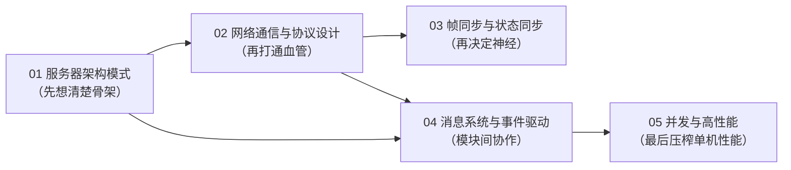
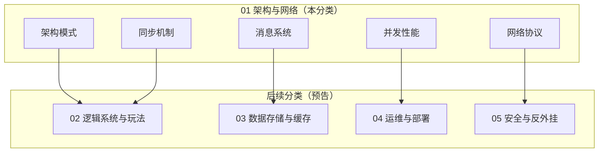

# 01 架构与网络（Architecture & Networking）

> 本分类是《游戏服务端全栈知识库》的第一篇章，也是后续所有篇章（逻辑系统、数据存储、运维部署、安全反外挂等）的地基。
> 覆盖两大主题：**服务器架构设计**（单服、分区分服、无缝世界、微服务、容器化）与**网络通信**（协议选型、消息设计、帧同步/状态同步、并发高性能）。

---

## 分类简介

游戏服务端与普通 Web 服务端最大的不同在于：**实时性、状态一致性、并发规模与反作弊要求**并存。
一个玩家在线时每秒可能产生数十条消息，一场国战可能有数千名玩家同时在一个场景内交互，
服务器需要在毫秒级延迟约束下维持"权威的世界状态"（authoritative world state）。

本分类从五个维度逐步拆解这些问题：

1. **架构模式**：选择正确的"骨架"——单服、分区分服、无缝世界还是微服务，决定了后续所有设计的边界；
2. **网络通信**：选择正确的"血管"——TCP/UDP/KCP/QUIC/WebSocket，并设计可靠的消息协议；
3. **同步机制**：选择正确的"神经"——状态同步与帧同步，决定游戏手感、流量与服务器成本；
4. **消息系统**：选择正确的"大脑回路"——消息分发、事件驱动、Actor、RPC，让模块之间优雅协作；
5. **并发性能**：选择正确的"肌肉"——多线程/协程/无锁队列/内存池，把单机吞吐压榨到极致。

每篇文档均遵循统一结构：**概述 → 核心概念（表格）→ 原理详解 → 代码/配置示例 → 最佳实践 → 常见问题 FAQ → 关联阅读**，
并配有 Mermaid 图（拓扑图、时序图、状态机、流程图），术语一律给出中英文对照。

---

## 文件列表

| 文件 | 一句话简介 |
| --- | --- |
| [01-服务器架构模式.md](01-服务器架构模式.md) | 对比单服、分区分服、无缝世界（Zone）、微服务、容器化五种架构，讲解权威服务器原则与同步架构选型，附完整服务器拓扑图 |
| [02-网络通信与协议设计.md](02-网络通信与协议设计.md) | 讲解 TCP/UDP/KCP/QUIC/WebSocket 选型对比、粘包拆包、消息头与 protobuf 协议设计、心跳超时、断线重连、流量控制与加密传输 |
| [03-帧同步与状态同步.md](03-帧同步与状态同步.md) | 深挖状态同步（快照/插值/外推）与帧同步（Lockstep/确定性/输入指令序列）的原理、确定性实现（定点数/随机种子）与回放观战 |
| [04-消息系统与事件驱动.md](04-消息系统与事件驱动.md) | 讲解消息路由分发、事件系统、请求-响应与通知、时间轮定时器、Actor 模型、消息队列与 RPC 框架设计 |
| [05-并发与高性能.md](05-并发与高性能.md) | 讲解多线程模型、协程（Lua/C++/Go）、锁与无锁队列、内存池与对象池、GC 与分配优化、性能剖析与压测方法论 |

---

## 学习顺序建议

### 推荐路线（按依赖关系）

1. **第一步：读 `01-服务器架构模式.md`**——先建立全局视野，了解"服务器分几层、世界怎么切分、谁是权威"。
   这些决策一旦做出，后期很难推翻，值得最先投入时间。
2. **第二步：读 `02-网络通信与协议设计.md`**——架构定了之后，先解决"字节怎么在客户端与服务端之间可靠传输"。
   粘包拆包、心跳重连是任何网络游戏都绕不开的硬功夫。
3. **第三步：读 `03-帧同步与状态同步.md`**——根据游戏类型（MOBA/格斗/射击/MMO）选择同步机制，
   这是决定"手感"与"成本"的关键一役。
4. **第四步：读 `04-消息系统与事件驱动.md`**——有了网络与同步，接着设计服务器内部的消息流转：
   事件、Actor、RPC、时间轮，让几千行代码的模块之间不打架。
5. **第五步：读 `05-并发与高性能.md`**——最后解决"单台服务器能扛多少人"的问题：线程模型、协程、无锁、池化、压测。

### 按角色/场景选择

- **刚入行的服务端新人**：01 → 02 → 05 前两节（线程模型）即可，先有全局观；
- **做 MOBA/格斗/竞速类**：优先精读 03（帧同步）与 02（UDP/KCP 选型）；
- **做 MMO/射击类**：优先精读 01（Zone/微服务）与 03 的状态同步部分；
- **做中台/跨服系统**：优先精读 04（消息队列、RPC）与 05（无锁队列、压测）。

### 阅读约定

- 每篇文档末尾的「关联阅读」会指向本分类内的兄弟文档与其他篇章，可交叉跳转；
- 代码示例语言不限（C++/C#/Go/Lua/Python），目的是讲清**思想**而非绑定语言；
- 提及的业界框架（Skynet、ET、kbengine、Pomelo、Nakama、Photon、GameLift 等）仅作对照参考，
  具体选型请结合团队技术栈与项目预算评估。

---

## 配套知识图谱

本分类与其他分类的关系（知识库全貌示意，仅列与本分类直接相关的部分）：

> 说明：本 README 为分类导航文档，篇幅从简；真正的技术深度请进入 01~05 各篇正文（每篇 300+ 行）。
