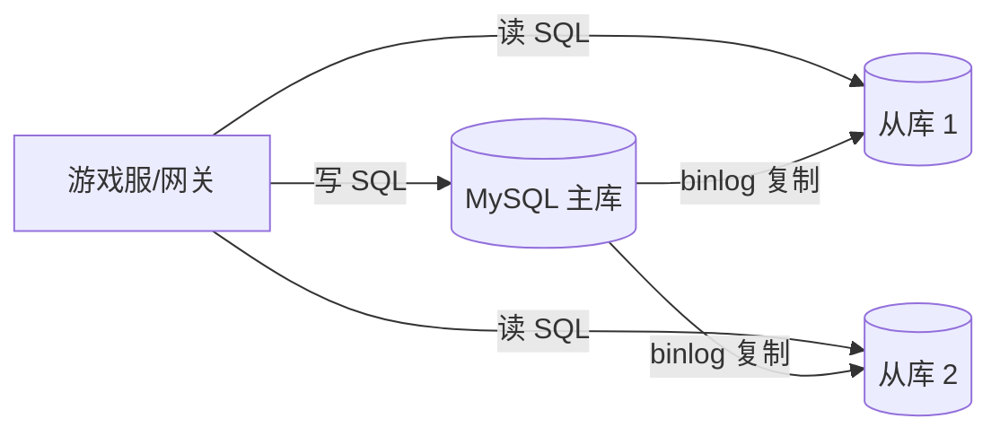
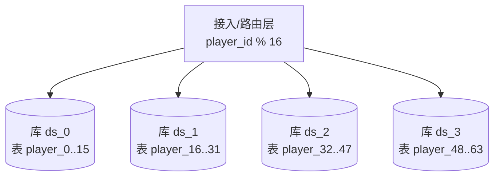
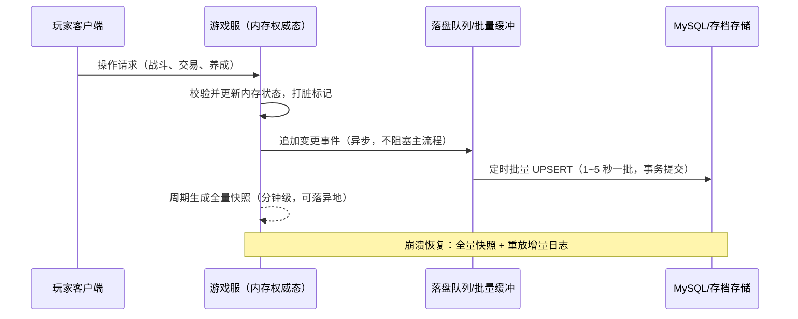

# 01 数据库选型与存储设计

> 知识基线：实时游戏服务端通用架构；示例中的语言、数据库、缓存、容器和云平台版本必须以项目部署清单为准。
> 适用范围：覆盖数据/存档、资产流水、读写分离、迁移与恢复路径；不替代网关传输、玩法规则或运营审批流程。
> 事实边界：协议规范、组件行为和示例方案分开；容量数字只作示意/经验值，必须通过压测验证。
> 最后更新：2026-08-06（补齐规范来源、版本边界与工程验收入口）。
> 版本边界：以 2026-08-06 为核对日，不新增不确定的当前组件版本号；数据库、缓存、迁移工具和云平台版本由项目部署清单锁定。
> 参考来源：[PostgreSQL 官方文档](https://www.postgresql.org/docs/)、[Redis 官方文档](https://redis.io/docs/latest/)、[OpenTelemetry 官方文档](https://opentelemetry.io/docs/)。

### P0 数据证据与恢复验收

- 一致性分级是方案取舍：货币、道具和订单通常要求数据库事务、唯一约束或条件更新；排行榜、在线态和日志可以采用缓存/异步读模型，但必须声明允许的陈旧窗口和回源规则。
- 迁移验收采用版本化、可审查、可回滚的 expand/contract 流程：先验证新旧代码兼容，再执行数据回填和约束收紧；不能把 ORM 自动建表或一次性 DDL 当作生产迁移证据。
- 备份恢复验收不以“有备份文件”为终点，必须记录 RPO/RTO、恢复到隔离环境的结果、行数/校验和/流水连续性和恢复后读写检查；具体目标由项目清单与业务等级锁定。
- PostgreSQL、Redis 和可观测性组件的行为以官方文档和部署清单为准；一致性、迁移、备份恢复的结论是方案选择，不是对所有游戏都成立的绝对规则。

> 玩家数据是游戏服务端的"资产"：选对存储引擎、设计好存档表、保障读写性能与数据可靠性，是数据层与业务层的根基。

## 1. 概述

游戏服务端的数据特征与普通互联网业务差异显著：

- **读多写少、写入随机**：玩家在线期间会产生大量小额、随机位置的写入（等级、金币、背包变化），而非互联网业务常见的"顺序追加"；
- **数据以玩家维度聚合**：角色、背包、任务、社交关系都以"一个玩家一行（one row per player）"为组织单位；
- **延迟与一致性分级**：排行榜、实时属性对延迟敏感；金钱、道具要求强一致（Strong Consistency）；聊天、日志、埋点可接受最终一致（Eventual Consistency）；
- **规模线性增长**：玩家数量增长要求存储层可水平扩展，单机 MySQL 无法无限承载。

本文按工程落地顺序展开：**选型（3.1）→ 表设计（3.2）→ 读写架构（3.3/3.4）→ 性能优化（3.5）→ 落盘可靠性（3.6）**，最后给出代码示例、最佳实践与 FAQ。

## 2. 核心概念

| 概念 | 英文 | 说明 |
| --- | --- | --- |
| 关系型数据库 | Relational Database | 以二维表组织数据，支持 SQL 与 ACID 事务，典型代表 MySQL、PostgreSQL |
| 键值存储 | Key-Value Store | 以 Key 定位 Value，读写极快，典型代表 Redis、Memcached |
| 文档数据库 | Document Database | 以 JSON/BSON 文档组织数据，无固定 Schema，典型代表 MongoDB |
| 读写分离 | Read-Write Splitting | 主库负责写、从库负责读，横向分摊读压力 |
| 主从复制 | Master-Slave Replication | 主库把变更以 binlog 形式同步到从库并回放 |
| 半同步复制 | Semi-Synchronous Replication | 主库等待至少一个从库确认收到 binlog 后才提交 |
| 分库分表 | Database/Table Sharding | 按维度把数据分散到多个库/表，突破单机容量与性能瓶颈 |
| 分片键 | Shard Key | 决定一行数据归属哪个分片的字段（如 player_id） |
| 慢查询 | Slow Query | 执行时间超过阈值（如 1s）的 SQL，是性能问题的首要排查对象 |
| 索引 | Index | 加速查询的数据结构（MySQL 为 B+ 树），以空间换时间 |
| 覆盖索引 | Covering Index | 查询所需列全部包含在索引中，免回表 |
| 存档快照 | Save Snapshot | 将玩家状态序列化为可恢复的持久化副本 |
| 异步落盘 | Async Persistence | 先改内存/缓存，再异步批量刷入磁盘存储 |
| WAL | Write-Ahead Logging | 先写日志、后写数据，用于崩溃恢复 |
| 全局唯一 ID | Global Unique ID | 分布式环境下不冲突的主键生成方案（雪花算法等） |
| 冷热分离 | Hot/Cold Data Separation | 热数据放高速存储，冷数据归档到低成本存储 |

## 3. 原理详解

### 3.1 数据库选型对比：MySQL / Redis / MongoDB

| 维度 | MySQL | Redis | MongoDB |
| --- | --- | --- | --- |
| 数据模型 | 关系表 + SQL | KV + 多种数据结构 | 文档（BSON），类 JSON |
| 事务能力 | 强 ACID（InnoDB） | 单实例 Lua 脚本原子；集群弱 | 单文档原子，多文档事务较弱 |
| 持久化 | 磁盘为主，可靠 | 内存为主，RDB/AOF 辅助 | 磁盘 + WiredTiger WAL |
| 单机读性能 | 数千～数万 QPS | 十万级 QPS | 万级 QPS |
| 容量扩展 | 分库分表/读写分离 | 受内存限制，集群分片 | 原生分片（Sharding） |
| 典型场景 | 存档主库、交易、对账、运营报表 | 缓存、排行榜、计数、分布式锁、会话 | 日志、行为埋点、结构多变的运营数据 |

选型原则：

1. **存档、货币、道具交易等需要强一致与回滚能力** → MySQL（InnoDB 事务）；
2. **高频读、可丢失/可重建的数据** → Redis（排行榜、计数、热点配置、在线状态）；
3. **结构多变、无强事务要求的运营数据** → MongoDB（邮件、日志、活动配置）。

补充知识——MySQL 存储引擎与隔离级别：

- 引擎对比：InnoDB（支持事务、行锁、MVCC、外键，**默认引擎**）vs MyISAM（表锁、无事务，仅剩历史存量场景）vs RocksDB 系（LSM 树、写放大低，适合写密集日志，常见于 TiDB 底层）；
- 事务隔离级别：读未提交（Read Uncommitted）→ 读已提交（Read Committed，**默认**，解决脏读）→ 可重复读（Repeatable Read，解决不可重复读）→ 串行化（Serializable，性能差）；
- 并发控制：MVCC（多版本并发控制，Multi-Version Concurrency Control）+ 行级锁，配合 undo log 实现快照读。

### 3.2 玩家存档表设计

核心思想：**一行一玩家**。把玩家维度的数据聚合成行，配合 JSON 列存放动态结构，避免"为每个系统建一张表、每次读档 JOIN 十几张表"的过度设计。

```sql
CREATE TABLE `player` (
  `player_id`   BIGINT UNSIGNED NOT NULL COMMENT '玩家ID（全局唯一）',
  `account_id`  BIGINT UNSIGNED NOT NULL COMMENT '账号ID',
  `server_id`   INT UNSIGNED    NOT NULL COMMENT '所在服ID（分表键）',
  `name`        VARCHAR(32)     NOT NULL COMMENT '昵称',
  `level`       INT UNSIGNED    NOT NULL DEFAULT 1 COMMENT '等级',
  `exp`         BIGINT UNSIGNED NOT NULL DEFAULT 0 COMMENT '经验',
  `gold`        BIGINT UNSIGNED NOT NULL DEFAULT 0 COMMENT '金币（最小单位）',
  `diamond`     BIGINT UNSIGNED NOT NULL DEFAULT 0 COMMENT '钻石（最小单位）',
  `profile`     JSON            NULL COMMENT '可变属性：时装、称号、头像框等',
  `bag`         JSON            NULL COMMENT '背包快照：道具id -> 数量',
  `quest`       JSON            NULL COMMENT '任务进度快照',
  `version`     INT UNSIGNED    NOT NULL DEFAULT 1 COMMENT '乐观锁版本号',
  `created_at`  DATETIME        NOT NULL DEFAULT CURRENT_TIMESTAMP COMMENT '创建时间',
  `updated_at`  DATETIME        NOT NULL DEFAULT CURRENT_TIMESTAMP ON UPDATE CURRENT_TIMESTAMP COMMENT '更新时间',
  PRIMARY KEY (`server_id`, `player_id`),
  UNIQUE KEY `uk_player_id` (`player_id`),
  KEY `idx_account` (`account_id`)
) ENGINE=InnoDB DEFAULT CHARSET=utf8mb4 COMMENT='玩家主存档';
```

设计要点：

1. **主键 `(server_id, player_id)`**：天然把同一服的玩家聚到同一分片，后续分表/分库按 server_id 路由即可；
2. **金额用整数存最小单位**（分/铜币），严禁浮点——浮点累加会产生精度误差，影响对账；
3. **高频字段独立成列**（等级、货币、VIP），用于索引与排行榜 SQL；低频动态结构进 JSON（profile/bag/quest），减少列数、避免宽表；
4. **version 乐观锁**：并发写存档时通过版本号防止覆盖（见 4.4）；
5. **冷热分离**：在线高频读写的热数据留主表，下线超过 N 天的历史数据定期归档到归档库/冷存储（如 OSS + 压缩）；
6. **Schema 演进（Schema Evolution）**：JSON 列天然兼容新旧字段；独立列新增用 `ALTER TABLE ... ADD COLUMN` 时选低峰期执行（8.0 支持 INSTANT 算法，只改元数据不重建表）。

### 3.3 读写分离

原理：主库（Primary）开启 binlog（二进制日志，Binary Log），从库（Replica）的 I/O 线程拉取 binlog 写入本地 relay log（中继日志），SQL 线程顺序回放，完成异步复制（Asynchronous Replication）。



关键点：

- 读写分离解决**读扩展**，不解决写瓶颈；写放大场景（如排行榜批量更新）仍要回到分库分表或异步化；
- **主从延迟**（Replication Lag）导致"写后读不一致"：对策为①关键读走主库、②按账号维度延迟容忍（1~2s 内强制读主）、③读从库发现数据缺失时重试主库；
- 半同步复制（Semi-Sync）：主库提交前等待至少一个从库 ACK，把"丢数据窗口"压缩到极短，是游戏存档场景的常用增强；
- 常用中间件：ProxySQL（功能强、规则灵活）、ShardingSphere-Proxy（读写分离 + 分片一体）、自研网关层按 SQL 特征路由。

### 3.4 分库分表

分库分表 = 垂直拆分（Vertical Sharding）+ 水平拆分（Horizontal Sharding）：

- **垂直拆分**：按业务域拆库（存档库/交易库/日志库），按字段冷热拆表（玩家基础表/玩家扩展表）；
- **水平拆分**：按分片键把行均匀分散到多张表、多个库，单表数据量控制在百万～千万级。



分片策略对比：

| 策略 | 优点 | 缺点 | 适用 |
| --- | --- | --- | --- |
| 取模（HASH_MOD） | 实现简单、数据均匀 | 扩容需迁移大部分数据（翻倍扩容可减半迁移） | 存档表等需均匀分布的场景 |
| 范围分片（RANGE） | 扩容简单、利于区间查询 | 热点倾斜（新区玩家集中） | 按时间归档的日志、邮件 |
| 一致性哈希 | 扩容只迁移少量 key | 实现复杂、均匀性依赖虚拟节点 | Redis Cluster、网关路由 |

配套组件：

- **全局唯一 ID**：雪花算法（Snowflake）——41 位时间戳 + 10 位机器 ID + 12 位序列号，趋势递增、全局唯一、无中心依赖；或号段模式（Segment）：发号器批量发放 ID 段，DB 压力小；
- **跨分片查询**：避免跨分片 JOIN 与聚合；需要全局查询（全服排行）时用"汇总表/汇总缓存"，由异步任务把各分片结果归并；
- **广播表/ER 分片**：配置类小表（道具表、活动表）全分片复制；有关联的表按相同分片键分片（如 player 与 player_mail 都按 player_id），保证 JOIN 在分片内完成；
- **分布式事务**：跨库写需要 2PC / TCC / 本地消息表 + 最终一致。游戏内原则是**避免跨库事务**——同玩家数据放同一分片，用"本地事务 + 消息补偿"替代强一致。

### 3.5 慢查询与索引优化

排查链路：**慢查询日志 → 聚合分析 → EXPLAIN → 优化索引/改写 SQL → 观察验证**。

```sql
-- 开启慢查询（可写入 my.cnf 持久化）
SET GLOBAL slow_query_log = ON;
SET GLOBAL long_query_time = 1;                    -- 超过 1 秒即记录
SET GLOBAL log_queries_not_using_indexes = ON;     -- 记录未走索引的查询

-- 分析执行计划
EXPLAIN SELECT player_id, gold FROM player
 WHERE server_id = 1 AND level > 50 ORDER BY level DESC;
```

EXPLAIN 关键列：

| 列 | 含义 | 优化目标 |
| --- | --- | --- |
| type | 访问类型 | 避免 ALL（全表扫描）；至少 range，理想 ref / eq_ref / const |
| key | 实际使用的索引 | 应有值且合理 |
| rows | 预估扫描行数 | 越小越好 |
| Extra | 附加信息 | 出现 Using filesort / Using temporary 需优化 |

索引优化规则：

1. **联合索引最左前缀**：`KEY idx_server_level (server_id, level)` 能命中 `server_id` 单列、`server_id + level` 组合条件；跳过首列的 `level` 条件无法走该索引；
2. **区分度高的列放前面**：把选择性（Selectivity = 去重值/总行数）高的列放联合索引左侧；
3. **覆盖索引**：`SELECT level FROM player WHERE server_id=1` 若索引含 level 列则免回表；
4. **避免索引失效**：索引列上做函数运算（`WHERE YEAR(created_at)=2026`）、隐式类型转换（`WHERE player_id='123'`）、前导通配符（`LIKE '%abc'`）都会导致失效；
5. **排序/分组尽量走索引**：`ORDER BY level` 若与索引顺序一致可避免 filesort；
6. 常见工具：`mysqldumpslow -s t /var/log/mysql/slow.log` 聚合 TOP N 慢查询；`performance_schema` 或 `sys.schema_unused_indexes` 找冗余索引。

### 3.6 存档快照与异步落盘

存档写入的两个极端都不合适：

- 每次变更立即写库 → 写放大、行锁竞争、DB 成为瓶颈；
- 全部攒到下线/定时才写 → 宕机丢大量数据、回档风险高。

折中方案：**内存为权威（In-Memory Authority）+ 脏标记（Dirty Flag）+ 批量异步落盘 + 快照/增量兜底**。



要点：

1. **脏标记**：仅被修改过的存档参与落盘，避免全量扫描；
2. **全量快照 + 增量日志**：快照提供快速恢复基线，增量（WAL/事件日志）补齐快照之后的变化；两者都写成功才推进"安全水位"；
3. **下线强制 flush**：玩家下线时同步落盘，"下线即存档"，杜绝"下线后回档"投诉；
4. **在线宕机**：最多丢失数秒增量，恢复流程 = 拉最近全量快照 + 重放该快照之后的增量日志 → 回滚到最近一致点；
5. Redis 持久化类比：RDB（全量快照，恢复快、可能丢数据）与 AOF（追加日志，更安全、文件大），生产建议 AOF + 定期重写（Rewrite），或主从 + 从库持久化；
6. 备份体系：每日全量（mysqldump/XtraBackup）+ binlog 增量，并**定期演练恢复**，明确 RPO（Recovery Point Objective，最多丢多少）与 RTO（Recovery Time Objective，多久恢复）。

## 4. 代码与配置示例

### 4.1 ShardingSphere 分库分表（YAML）

```yaml
rules:
  - !SHARDING
    tables:
      player:
        actualDataNodes: ds_${0..3}.player_${0..15}   # 4 库 × 16 表
        tableStrategy:
          standard:
            shardingColumn: player_id
            shardingAlgorithmName: player_hash_mod
    shardingAlgorithms:
      player_hash_mod:
        type: HASH_MOD
        props:
          sharding-count: 64
  - !READWRITE_SPLITTING
    dataSources:
      ds_0:
        writeDataSourceName: ds_0_master
        readDataSourceNames:
          - ds_0_replica_1
          - ds_0_replica_2
```

### 4.2 雪花 ID 生成（Go 简化版）

```go
type Snowflake struct {
    epoch     int64 // 自定义起始时间戳(ms)
    machineID int64 // 10 bit 机器ID
    last      int64 // 上次生成时间戳
    seq       int64 // 12 bit 序列号
}

func (s *Snowflake) NextID() int64 {
    now := time.Now().UnixMilli() - s.epoch
    if now == s.last {
        s.seq = (s.seq + 1) & 0xFFF
        if s.seq == 0 { // 同一毫秒序列号耗尽，自旋等待下一毫秒
            for now <= s.last {
                now = time.Now().UnixMilli() - s.epoch
            }
        }
    } else {
        s.seq = 0
    }
    s.last = now
    return (now << 22) | (s.machineID << 12) | s.seq
}
```

### 4.3 异步落盘工作器（Go 伪代码）

```go
type SaveWorker struct {
    mu    sync.Mutex
    dirty map[int64]*Player // 脏存档（玩家ID -> 内存对象）
}

func (w *SaveWorker) MarkDirty(p *Player) {
    w.mu.Lock(); w.dirty[p.ID] = p; w.mu.Unlock()
}

func (w *SaveWorker) FlushLoop(ctx context.Context) {
    ticker := time.NewTicker(3 * time.Second)
    defer ticker.Stop()
    for {
        select {
        case <-ticker.C:
            w.mu.Lock()
            batch := w.dirty
            w.dirty = make(map[int64]*Player)
            w.mu.Unlock()
            w.saveBatch(batch) // 批量 UPSERT，单事务提交，失败告警+重试
        case <-ctx.Done():
            w.mu.Lock()
            batch := w.dirty
            w.mu.Unlock()
            w.saveBatch(batch) // 进程退出前兜底落盘
            return
        }
    }
}
```

### 4.4 乐观锁防覆盖（SQL）

```sql
-- 预期版本号一致才更新，防止并发覆盖存档
UPDATE player
   SET gold = gold - #{cost},
       version = version + 1
 WHERE player_id = #{pid}
   AND version = #{expectVersion}
   AND gold >= #{cost};
-- 影响行数 = 0：版本冲突或余额不足，业务层重试或报错
```

### 4.5 ProxySQL 读写分离（配置节选）

```ini
mysql_replication_hostgroups:
  - { writer_hostgroup: 10, reader_hostgroup: 20, comment: "game-db" }
mysql_servers:
  - { hostgroup: 10, hostname: 10.0.0.1, port: 3306 }   # 主库
  - { hostgroup: 20, hostname: 10.0.0.2, port: 3306 }   # 从库1
  - { hostgroup: 20, hostname: 10.0.0.3, port: 3306 }   # 从库2
mysql_query_rules:
  # SELECT 且不以 FOR UPDATE 结尾 → 读组；其余 → 写组
  - { match_pattern: "^SELECT .*", destination_hostgroup: 20, apply: 1 }
```

### 4.6 MongoDB 存档与埋点示例

文档模型天然适合"一行一玩家 + 动态结构"，适合运营侧数据（邮件、活动记录、行为埋点）：

```javascript
// 邮件集合：动态结构无需迁移
db.mail.insertOne({
  player_id: 10001,
  title: "七日签到奖励",
  attachments: [{ item_id: 101, count: 10 }, { item_id: 202, count: 1 }],
  expire_at: new Date("2026-09-01T00:00:00Z"),
  read: false
});

// 行为埋点集合（TTL 索引自动过期清理）
db.behavior.createIndex({ ts: 1 }, { expireAfterSeconds: 2592000 });

// 聚合查询：某活动充值金额 TOP 玩家
db.recharge.aggregate([
  { $match: { activity_id: "summer2026" } },
  { $group: { _id: "$player_id", total: { $sum: "$amount" } } },
  { $sort: { total: -1 } },
  { $limit: 100 }
]);
```

注意：MongoDB 适合"不需要跨文档事务"的数据；若存档需要与 MySQL 事务联动（如充值流水），优先统一放 MySQL。

## 5. 最佳实践

1. **选型克制**：强一致走 MySQL，高频读走 Redis，灵活结构走 MongoDB；不要"一把梭 Redis 存所有"，也不要为日志上分布式事务；
2. **表设计**：一行一玩家；金额整数化；JSON 只放低频动态结构；version 乐观锁常备；
3. **读写分离**：关键读走主库；监控 Seconds_Behind_Master；半同步保障存档不丢；
4. **分库分表**：按 player_id/server_id 分片保证玩家数据内聚；先垂直拆、后水平拆；能用缓存解决就不先分表；
5. **索引**：慢查询日志常开（阈值 1s），每周巡检；联合索引遵循最左前缀；用覆盖索引消回表；
6. **落盘**：内存权威 + 脏标记 + 批量异步落盘 + 全量快照/增量日志 + 下线强制 flush；把 RPO/RTO 写进 SLA；
7. **备份**：每日全量 + binlog 增量，异地备份，季度级恢复演练；
8. **监控**：连接数、慢查询数、主从延迟、落盘积压队列长度都进监控（见 05 篇）。

## 6. 常见问题 FAQ

**Q1：玩家同账号双端登录，存档互相覆盖怎么办？**
A：三件套——①单服单进程保证同玩家串行处理；②version 乐观锁拒绝旧版本写入；③新连接登录时使旧 token 失效并踢下线。若已多实例化，用分布式锁（见 03 篇）保证同玩家同一时刻只有一个进程可写。

**Q2：MySQL 单表几千万行变慢了，要不要立刻分表？**
A：先查慢查询与 EXPLAIN，往往补索引就能解决；其次归档冷数据（删除/迁移历史行）；最后才是分表。分表会引入路由、跨表查询、全局 ID 等复杂度，是最后手段。

**Q3：读写分离后，充值完查余额还是旧值？**
A：三类对策：①"写后立刻读"的关键读强制走主库（按账号维度 1~2 秒窗口）；②读从库时若发现数据缺失（如玩家不存在）自动重试主库；③接受最终一致，UI 上延迟刷新。游戏货币场景务必用①。

**Q4：服务器宕机丢了 5 秒存档，玩家要求补偿怎么办？**
A：数据层明确 RPO（如"在线最多丢 10 秒"），按"快照 + 增量日志"恢复；运营侧对受影响玩家按恢复点补发并补偿；把 RPO/RTO 写入运维 SLA 与对外公告口径。

**Q5：JSON 列能建索引吗？**
A：MySQL 8.0 可为 JSON 列建生成列（Generated Column）再对生成列建索引；但高频查询字段建议直接独立成列，JSON 只用于低频动态结构。

**Q6：异步落盘丢数据的窗口怎么进一步压缩？**
A：①缩短批量周期（1s 级）并让玩家下线强制 flush；②变更事件先写本地 WAL 再更新内存，崩溃后可重放；③关键经济操作（充值、交易）同步写流水表，异步只针对非关键状态。

**Q7：全服排行榜要读全表玩家数据，分表后怎么查？**
A：排行榜不应实时扫分片表，标准做法是"写时维护 Redis ZSet，定时回源 DB 重建"（见 02 篇）；需要 SQL 报表时，用汇总表或数仓（如 ClickHouse）按日归并各分片数据。

**Q8：表里 JSON 越来越大，会不会拖慢查询？**
A：会。JSON 列随内容增长会显著增加行大小与回表代价。治理：①低频大字段（背包历史、战报）拆到独立表/对象存储，只留引用；②只读必要字段（`JSON_EXTRACT` 有开销，高频字段仍应独立成列）；③定期归档旧版本 JSON。

**Q9：数据库 CPU 打满但慢查询日志为空，怎么排查？**
A：慢日志只记录"执行慢"的 SQL；CPU 高还可能是：①高频小查询（QPS 过高）——看 `SHOW GLOBAL STATUS LIKE 'Questions'` 与连接数；②锁等待（行锁/元数据锁）——查 `performance_schema.data_lock_waits`；③非 SQL 开销（连接风暴、备份任务）。对策：连接池限流、批量读写、分离备份任务到从库。

**Q10：为什么说游戏存档"不要用 ORM 自动建表"？**
A：ORM 自动建表（AutoMigrate）通常丢失索引设计、字符集、分区等 DBA 细节，且生产环境变更不可控。正确做法：DDL 走版本化迁移（Flyway/Liquibase 或自研迁移脚本），代码评审 + 低峰期执行 + 演练回滚。

## 7. 关联阅读

- 下一篇：[02-缓存与排行榜系统](02-缓存与排行榜系统.md)——存档之上的缓存层与 Redis 应用，理解"缓存与 DB 一致性"；
- 分布式事务、分布式锁与一致性哈希：见 [03-分布式与高可用](03-分布式与高可用.md)；
- 存档安全、防回档与外挂对抗：见 [04-安全与反作弊](04-安全与反作弊.md)；
- 备份演练、数据库监控与容量规划：见 [05-部署运维与监控](05-部署运维与监控.md)；
- 上游基础：`../01-架构与网络/` 中的消息系统与并发模型决定了存档写入路径。
