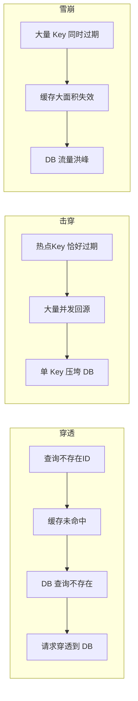
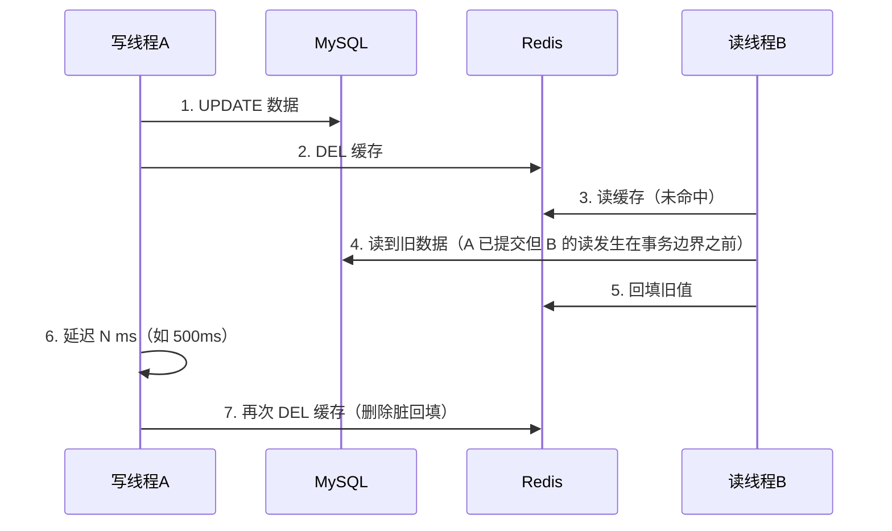
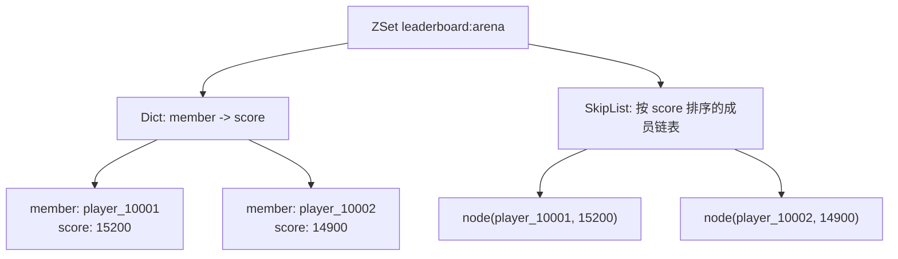

# 02 缓存与排行榜系统

> 缓存让游戏"读得快"，排行榜让游戏"玩得爽"：本文覆盖 Redis 数据结构实战、缓存穿透/击穿/雪崩治理、缓存一致性、ZSet 排行榜与热点数据处理。

## 1. 概述

游戏服务器的读流量远高于写流量：玩家每次打开背包、查看商店、刷新排行榜都会触发大量读请求，而底层 MySQL 的 QPS 上限有限。缓存的本质是**用空间换时间、用内存换磁盘、用近似换精确**。

缓存分层：

1. **进程内缓存（Local Cache）**：游戏服进程内存（如 Caffeine/LRU Map），延迟纳秒级，但多实例间不一致，适合只读配置；
2. **分布式缓存（Distributed Cache）**：Redis 为主，所有实例共享，延迟亚毫秒级，是本文主线；
3. **数据库**：最终数据权威，缓存失效后的兜底。

排行榜（Leaderboard）是游戏最典型的缓存业务：全球/全服/好友三种榜单，要求毫秒级读取、写时更新、同分排序稳定。Redis 的有序集合（Sorted Set，ZSet）几乎是为排行榜而生的数据结构。

## 2. 核心概念

| 概念 | 英文 | 说明 |
| --- | --- | --- |
| 缓存穿透 | Cache Penetration | 查询不存在的数据，缓存与 DB 都查不到，请求直达 DB |
| 缓存击穿 | Cache Breakdown | 热点 Key 过期瞬间，大量并发同时回源 DB |
| 缓存雪崩 | Cache Avalanche | 大量 Key 同时过期（或缓存宕机），DB 被压垮 |
| 布隆过滤器 | Bloom Filter | 用位数组 + 多次哈希判断"一定不存在/可能存在"的结构 |
| 旁路缓存 | Cache-Aside | 读时先查缓存、未命中回源 DB 并回填；写时先更 DB 再删缓存 |
| 延迟双删 | Delayed Double Delete | 写 DB 后删缓存，延迟一小段时间再删一次，抵消并发读回填 |
| 互斥锁 | Mutex / Distributed Lock | 缓存重建期间只允许一个请求回源 DB，其余等待/返回旧值 |
| 逻辑过期 | Logical Expiration | 缓存不设 TTL，业务侧维护过期时间，异步线程重建 |
| 有序集合 | Sorted Set (ZSet) | Redis 中带分数（score）的集合，按分数排序，跳表实现 |
| 跳表 | Skip List | ZSet 的底层有序数据结构，支持 O(logN) 插入与范围查询 |
| 热点 Key | Hot Key | 被超高并发访问的单个缓存 Key（如爆款道具、名人玩家） |
| 多副本缓存 | Multi-Replica Cache | 热点 Key 打散成 N 份副本，分散单点压力 |
| 最终一致 | Eventual Consistency | 允许短暂不一致，经过一段时间后趋于一致 |

## 3. 原理详解

### 3.1 Redis 常用数据结构与游戏场景

| 结构 | 底层 | 常用命令 | 游戏场景 |
| --- | --- | --- | --- |
| String | SDS 动态字符串 | GET/SET/INCR/DECR/EXPIRE/SETNX | 计数（在线人数、钻石）、限流、分布式锁、会话 |
| Hash | 哈希表 + ziplist | HGET/HSET/HINCRBY/HGETALL | 玩家属性对象、道具数量、配置表 |
| ZSet | 跳表 + 哈希表 | ZADD/ZINCRBY/ZREVRANGE/ZRANK | 排行榜、延迟队列、时间线 |
| Set | 哈希表/整数集合 | SADD/SISMEMBER/SINTER/SUNION | 去重（签到、抽奖）、好友关系、共同好友 |
| List | 双向链表/quicklist | LPUSH/RPUSH/LPOP/BRPOP | 简单消息队列、最近公告 |
| Bitmap | 位数组（String 特殊视图） | SETBIT/GETBIT/BITCOUNT | 签到日历、连续登录 |
| HyperLogLog | 概率基数统计 | PFADD/PFCOUNT | UV 统计（在线去重人数） |
| Stream | 持久化消息结构 | XADD/XREAD/XGROUP | 可靠消息队列（Redis 5.0+） |

#### String：计数与限流

```bash
INCR online:login   # 登录计数（原子自增）
SET role:10001:name "剑客" EX 600
SET lock:buy:10001 1 NX EX 3   # 分布式锁原语（NX=不存在才设置）
```

#### Hash：玩家属性对象

```bash
HSET role:10001 level 10 gold 1000 diamond 88
HINCRBY role:10001 gold -150        # 原子扣款
HGETALL role:10001
```

Hash 相比"每属性一个 String Key"的优势：同类数据聚在一个 Key 下，减少 Key 数量、支持原子字段增减、便于批量读取与过期管理。

#### List：简单消息队列

```bash
LPUSH mail:10001 "{'title':'补偿','items':[{'id':101,'n':5}]}"
BRPOP mail:10001 0     # 阻塞弹出，实现简易可靠队列
```

#### Set：好友与去重

```bash
SADD friend:10001 20001 30001
SINTERSTORE common friend:10001 friend:20001   # 共同好友
```

### 3.2 缓存穿透、击穿、雪崩



#### 3.2.1 缓存穿透（Cache Penetration）

现象：攻击者/异常客户端持续查询**不存在的 Key**（如伪造 player_id），缓存永远不命中，请求全部打到 DB。

解决方案：

1. **空值缓存**：DB 查询为空时，把空结果以短 TTL（如 60s）写入缓存，后续请求命中空值；
2. **布隆过滤器**：查询前先过 Bloom Filter，判断"一定不存在"则直接返回，拦截绝大多数穿透请求。原理：多个哈希函数把 Key 映射到位数组的若干位；插入置 1，查询时任一位置为 0 则一定不存在。误判率（False Positive Rate）≈ `(1 - e^(-kn/m))^k`，可通过位数组长度 m 与哈希函数数 k 调节；
3. **入口参数校验**：ID 格式、范围、合法性校验（非法 ID 直接拒绝）。

#### 3.2.2 缓存击穿（Cache Breakdown）

现象：单个**热点 Key** 在过期瞬间，大量并发请求同时发现缓存未命中，一起回源 DB，DB 单点被打爆。

解决方案：

1. **互斥锁（Mutex）重建**：回源前先抢分布式锁，只有一个请求回源 DB，其余请求短暂等待后读取新缓存（或返回旧值/降级数据）；用 Lua 保证"查缓存→抢锁"原子性，避免惊群；
2. **逻辑过期**：缓存不设 TTL，value 内嵌过期时间；读取时发现"逻辑过期"立即返回旧值，同时异步线程重建缓存——读请求永远不阻塞，适合容忍秒级陈旧的数据；
3. **永不过期 + 主动更新**：热点配置类数据由后台任务定时刷新。

#### 3.2.3 缓存雪崩（Cache Avalanche）

现象：①大量 Key 在同一时刻过期（如统一 TTL=3600s 同时写入）；②缓存实例宕机/网络分区。缓存整体失效导致 DB 流量洪峰。

解决方案：

1. **TTL 加随机抖动**：`TTL = base + random(0, 300)`，错开过期时刻；
2. **多级缓存**：Redis 之上再加本地缓存，Redis 抖动时本地兜底；
3. **缓存高可用**：Redis 主从 + 哨兵/Cluster，故障自动切换（见 03 篇）；
4. **降级与限流**：缓存不可用时开启 DB 读限流 + 熔断，保护 DB 不被压垮；可降级为返回旧数据或"稍后重试"。

### 3.3 缓存一致性（Cache Consistency）

#### 3.3.1 旁路缓存（Cache-Aside）

读流程：先查缓存 → 命中返回 → 未命中查 DB → 回填缓存（设置 TTL）→ 返回。

写流程：**先更新 DB，再删除缓存**（Delete Cache After DB Write）。为什么"删"而不是"更新"缓存？

- 更新缓存是写操作，可能与并发读回填互相覆盖，产生不一致；
- 删缓存是惰性策略：下次读时自然回填最新值；
- 更新缓存需要额外序列化逻辑，删除更简单可靠。

#### 3.3.2 延迟双删（Delayed Double Delete）

问题：线程 A 更新 DB 后删缓存，但删除前线程 B 已读到旧值并回填缓存，缓存又变旧。



实现要点：

- 延迟时间 > 业务上"读→回填"的最长耗时（通常 300ms~1s），可用延迟队列/消息异步执行第二次删除；
- 第二次删除失败要有**补偿**：把删除动作发到消息队列，消费者重试；或订阅 MySQL binlog（如 Canal）异步删缓存，保证最终一致；
- 适用边界：旁路缓存 + 双删保证的是**最终一致性**；货币等强一致场景应直接读 DB 或"DB 事务 + 缓存同步更新 + 失败重试"。

### 3.4 ZSet 排行榜

#### 3.4.1 数据结构

ZSet = 哈希表（member → score 映射，O(1) 查分数）+ 跳表（按 score 排序，O(logN) 插入/范围查询）。member 唯一、score 可重复。



#### 3.4.2 常用命令

```bash
ZADD arena:week 15200 player_10001        # 新增/更新分数
ZINCRBY arena:week 50 player_10001        # 分数增量（原子）
ZREVRANGE arena:week 0 9 WITHSCORES       # TOP10（分数从高到低）
ZRANGE arena:week 0 9 WITHSCORES          # 分数从低到高
ZREVRANK arena:week player_10001          # 我的名次（0 起始，+1 即第几名）
ZRANGEBYSCORE arena:week 10000 15000      # 区间查询（按分数范围取成员）
ZSCORE arena:week player_10001            # 查我的分数
ZREM arena:week player_10001              # 移除成员
EXPIRE arena:week 604800                  # 榜单自然过期（周榜）
```

#### 3.4.3 同分排序（Tie-Breaking）

ZSet 同分时按 member 字典序排，这不符合游戏"同分先达到者排前面"的需求。标准解法：**把时间信息编码进 score**。

方案：`score = 业务分 * 10^9 + (MAX_TIME - 达到该分的时间戳)`。例如满分段 100000，时间戳精度到秒：

```go
// 战斗分 15200，在 2026-08-04 12:00:00 达成（时间戳 1780_000_000）
score := 15200*1_000_000_000 + (999_999_999_999 - 1780000000)
```

效果：分数越高越靠前；同分时"更早达成"（时间戳更小）得分更高，排在前面。注意：

- 时间戳位数要与分数最大值匹配，避免溢出 score 的 double 精度（Redis score 为 64 位 double，整数部分 2^53 内精确）；
- 玩家分数变化时用 ZADD 全量重写 score（而非 ZINCRBY，因为时间戳编码后不可增量）；
- 需要展示"原始分数"时，业务侧再解码或把原始分存 Hash 字段。

#### 3.4.4 区间查询与分段榜单

1. **TopN / 我的名次**：`ZREVRANGE ... WITHSCORES` + `ZREVRANK`，毫秒级；
2. **分页区间**：`ZREVRANGE key start stop`（start/stop 为排名下标）；
3. **分段榜单**：key 设计带维度——`rank:arena:global`、`rank:arena:server:{server_id}`、`rank:arena:level:{level_range}`；写时同步维护多个 ZSet（同一次 ZADD 写多个 key 用 Lua 保证原子）；
4. **好友榜**：每个玩家维护自己的好友 ZSet，用 `ZINTERSTORE` 或客户端并集计算；好友量大时改为"好友ID集合 + 全局榜 ZSCORE 批量查询"；
5. **跨服排行**：多服分数汇聚到中心 Redis（消息队列异步汇总），中心榜单只读。

#### 3.4.5 更新与一致性策略

- **写时更新**：战斗结算/积分变动时同步 ZADD，实时性最好，是默认方案；
- **定时重建**：凌晨从 DB 全量重建榜单（防止长期运行后 Redis 与 DB 漂移），重建期间用双 key 切换（新 key 写、旧 key 读，重建完原子切换）；
- **名次缓存**：展示层把"我的名次"缓存 5~30s，减少高频 ZREVRANK 压力；
- **防作弊联动**：分数增量必须服务端权威计算（见 04 篇），风控拦截异常分数后再入榜。

### 3.5 热点数据处理（Hot Key）

#### 3.5.1 热点识别

- 代理层/网关统计 Key 访问频次（如 1 秒内超过阈值标记热点）；
- 业务预判：开服活动道具、版本新英雄、名人玩家等已知热点提前规划；
- 慢于 Redis 的现象复现：单 Key QPS 超过单实例承载（如 >10 万 QPS）。

#### 3.5.2 多副本打散

```mermaid
flowchart LR
    C[客户端/网关] -->|读 hot:item:0| R1[(Redis 副本0)]
    C -->|读 hot:item:1| R2[(Redis 副本1)]
    C -->|读 hot:item:2| R3[(Redis 副本2)]
    C -->|读 hot:item:3| R4[(Redis 副本3)]
    Note: 写入时全副本更新；读取时按 随机/一致性哈希 选择副本
```

做法：`hot:item:123` 拆成 `hot:item:123:0..N-1`，读请求随机/按请求特征选副本；写请求更新全部副本（或依赖 TTL 让过期副本自然淘汰）。副本数按热点程度调节（如 8~16）。

#### 3.5.3 本地缓存兜底

热点数据（活动配置、公共公告）再加一层进程内缓存（Caffeine/LRU），Redis 压力减到 1/N；本地缓存失效通过版本号轮询或发布订阅（Pub/Sub）广播刷新。

#### 3.5.4 热点限流与降级

热点 Key 的 DB 回源统一走"互斥重建 + 限流"，防止回源风暴；必要时对热点接口返回降级数据（如排行榜展示缓存 30 秒前的快照）。

## 4. 代码与配置示例

### 4.1 排行榜全套命令（Shell）

```bash
# 周赛榜：玩家胜利 +50 分
ZINCRBY rank:arena:2026W32 50 player_10001
# TOP10
ZREVRANGE rank:arena:2026W32 0 9 WITHSCORES
# 我的名次（第 0 名是第一名）
ZREVRANK rank:arena:2026W32 player_10001
# 分数区间 10000-15000 的玩家数（运营统计）
ZCOUNT rank:arena:2026W32 10000 15000
# 7 天后榜单自动过期
EXPIRE rank:arena:2026W32 604800
```

### 4.2 互斥锁重建缓存（Lua + Go）

```lua
-- 原子：查缓存；未命中则尝试抢锁，抢到返回 1，抢不到返回 0
local v = redis.call('GET', KEYS[1])
if v then return {0, v} end
local ok = redis.call('SET', KEYS[2], ARGV[1], 'NX', 'EX', ARGV[2])
if ok then return {1, ''} else return {0, ''} end
```

```go
func GetOrLoad(ctx context.Context, key string, load func() (string, error)) (string, error) {
    lockKey := "lock:" + key
    if v, _ := rdb.Get(ctx, key).Result(); v != "" {
        return v, nil
    }
    ok, _ := rdb.SetNX(ctx, lockKey, "1", 3*time.Second).Result()
    if !ok { // 其他请求正在重建：短暂等待后读缓存
        time.Sleep(50 * time.Millisecond)
        if v, _ := rdb.Get(ctx, key).Result(); v != "" {
            return v, nil
        }
        return load() // 兜底：直接回源（可加本地限流）
    }
    defer rdb.Del(ctx, lockKey)
    v, err := load() // 只有持锁者回源 DB
    if err == nil {
        rdb.Set(ctx, key, v, time.Second*60) // 回填
    }
    return v, err
}
```

### 4.3 延迟双删（Go）

```go
func UpdateWithDoubleDelete(ctx context.Context, db *sql.DB, rdb *redis.Client, id int64) error {
    tx, err := db.BeginTx(ctx, nil)
    // 1. 更新 DB
    tx.ExecContext(ctx, "UPDATE player SET gold=? WHERE player_id=?", 500, id)
    tx.Commit()
    // 2. 第一次删缓存
    rdb.Del(ctx, fmt.Sprintf("player:%d", id))
    // 3. 延迟异步第二次删除（可用延迟队列实现，这里是简化示例）
    time.AfterFunc(500*time.Millisecond, func() {
        if err := rdb.Del(ctx, fmt.Sprintf("player:%d", id)).Err(); err != nil {
            // 失败进重试队列/消息队列，由消费者补偿
            enqueueRetry("cache-del", fmt.Sprintf("player:%d", id))
        }
    })
    return nil
}
```

### 4.4 布隆过滤器要点（Redis Module 用法）

```bash
# RedisBloom 模块（或自研位数组实现）
BF.RESERVE player_exist 0.01 10000000   # 误判率 1%，预期 1000 万元素
BF.ADD player_exist 10001
BF.EXISTS player_exist 10001   # 1 = 可能存在；0 = 一定不存在
```

### 4.5 同分排序 score 计算（Go）

```go
const (
    scoreScale   = int64(1_000_000_000)   // 业务分放大系数
    maxTimestamp = int64(999_999_999_999) // 时间戳上限
)

func ComposeScore(bizScore int64, achieveAt int64) int64 {
    return bizScore*scoreScale + (maxTimestamp - achieveAt)
}

// 读取时解码业务分
func ParseBizScore(score int64) int64 { return score / scoreScale }
```

### 4.6 热点多副本读写（Go 伪代码）

```go
func HotGet(ctx context.Context, key string, replicas int) (string, error) {
    // 按请求随机选副本，分散单 Key 压力
    idx := rand.Intn(replicas)
    return rdb.Get(ctx, fmt.Sprintf("%s:%d", key, idx)).Result()
}

func HotSet(ctx context.Context, key string, val string, ttl time.Duration, replicas int) {
    pipe := rdb.Pipeline()
    for i := 0; i < replicas; i++ {
        pipe.Set(ctx, fmt.Sprintf("%s:%d", key, i), val, ttl)
    }
    pipe.Exec(ctx) // 写全副本（或只写部分副本 + TTL 自然淘汰）
}
```

## 5. 最佳实践

1. **缓存什么**：只缓存"可重建、可容忍短暂陈旧"的数据；货币余额、背包关键道具默认走 DB 或"DB 事务 + 缓存同步"；
2. **TTL 策略**：一律设置 TTL，并加随机抖动防雪崩；热点配置类用逻辑过期 + 异步刷新；
3. **写流程统一**：先 DB 后删缓存（旁路缓存），配合延迟双删与失败补偿队列；禁止"先删缓存再写 DB"（会放大不一致窗口）；
4. **排行榜**：ZSet 写时更新 + 定时重建兜底；同分用 score 编码时间；榜单 key 带版本/周期后缀，支持整榜切换；
5. **热点治理**：先识别（网关统计），再多副本打散 + 本地缓存兜底 + 回源限流；
6. **容量**：监控 Redis 内存、命中率、大 Key/热 Key（`redis-cli --bigkeys`、`--hotkeys`）；
7. **安全**：缓存不可作为唯一数据源；防穿透（布隆/空值缓存）、防注入（参数校验）都要做。

## 6. 常见问题 FAQ

**Q1：为什么缓存更新用"删除"而不是"更新"？**
A：更新缓存与并发读回填存在竞态（旧值覆盖新值），且序列化成本高；删除是惰性策略，下次读自动回填最新值，配合双删与补偿可做到最终一致。

**Q2：延迟双删的延迟时间怎么定？**
A：延迟要大于"读请求从缓存未命中到回填完成"的最长耗时，一般 300ms~1s；严格场景用 binlog 订阅（Canal）替代双删，由异步任务删缓存，天然消除时序竞态。

**Q3：排行榜同分时为什么不能直接用 ZINCRBY？**
A：同分排序要求"先到先得"，需要把时间戳编码进 score，而时间戳编码后分数不再是增量关系，ZINCRBY 会破坏编码；正确做法是结算时用 ZADD 全量重写 score。

**Q4：布隆过滤器误判怎么办？**
A：误判只导致"本可拦截的请求漏过"，最终仍由 DB 兜底返回空；空值缓存可二次拦截。若数据量增长导致误判率上升，重建过滤器（重新分配位数组并批量填充）。

**Q5：缓存和 DB 数据不一致了，以谁为准？**
A：以 DB 为准（DB 是权威源）。不一致时：①依赖 TTL 过期自愈；②补偿队列重试删除；③对账任务定期扫描修复。游戏货币类强一致数据应避免进"可删除缓存"，改走 DB 直接读写。

**Q6：全服排行榜几百万玩家，ZSet 能扛住吗？**
A：能。单 ZSet 百万成员内存约几十 MB，ZREVRANGE/ZRANK 都是毫秒级；瓶颈在写入频率（每秒 ZADD 数万次可承受，再高需分批/异步）。超大榜单（千万级）考虑分段榜单或只保留 TopN + 尾部玩家用 DB 兜底。

**Q7：热点 Key 的 TTL 到了，多副本怎么办？**
A：多副本各自带 TTL，过期后由"互斥重建"流程回源 DB 并回填全部副本（或惰性重建当前副本）；副本间短暂不一致可接受，因为热点数据本身容忍秒级陈旧。

**Q8：Redis 内存被打满（OOM）会怎样？**
A：按 maxmemory 策略淘汰：allkeys-lru 最常用；noeviction 会直接拒绝写入导致业务报错。游戏建议：①缓存类数据 allkeys-lru；②不可丢的数据（如排行榜）单独实例/单独 DB 号并设置足够内存 + 监控告警。

## 7. 关联阅读

- 上一篇：[01-数据库选型与存储设计](01-数据库选型与存储设计.md)——缓存回源与存档落盘的数据基础；
- 分布式锁的可靠实现与 Redis 高可用（哨兵/集群）：见 [03-分布式与高可用](03-分布式与高可用.md)；
- 排行榜防作弊与分数风控：见 [04-安全与反作弊](04-安全与反作弊.md)；
- Redis 监控（命中率/内存/大 Key）与告警：见 [05-部署运维与监控](05-部署运维与监控.md)；
- 一致性哈希在 Redis Cluster 与网关路由中的应用：见 [03-分布式与高可用](03-分布式与高可用.md) 3.1 节。
