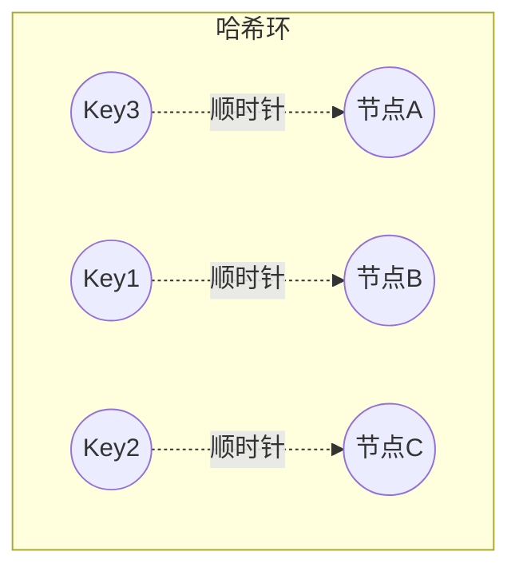
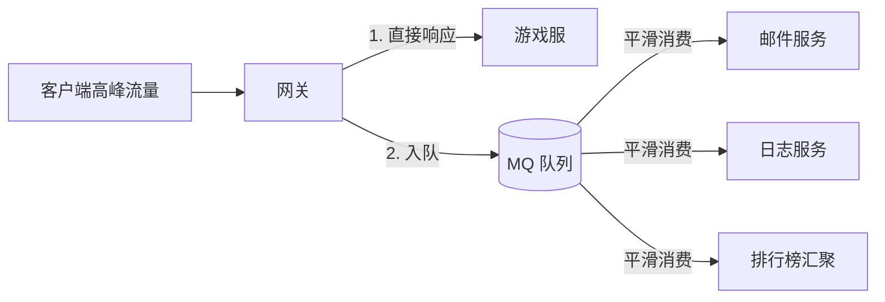
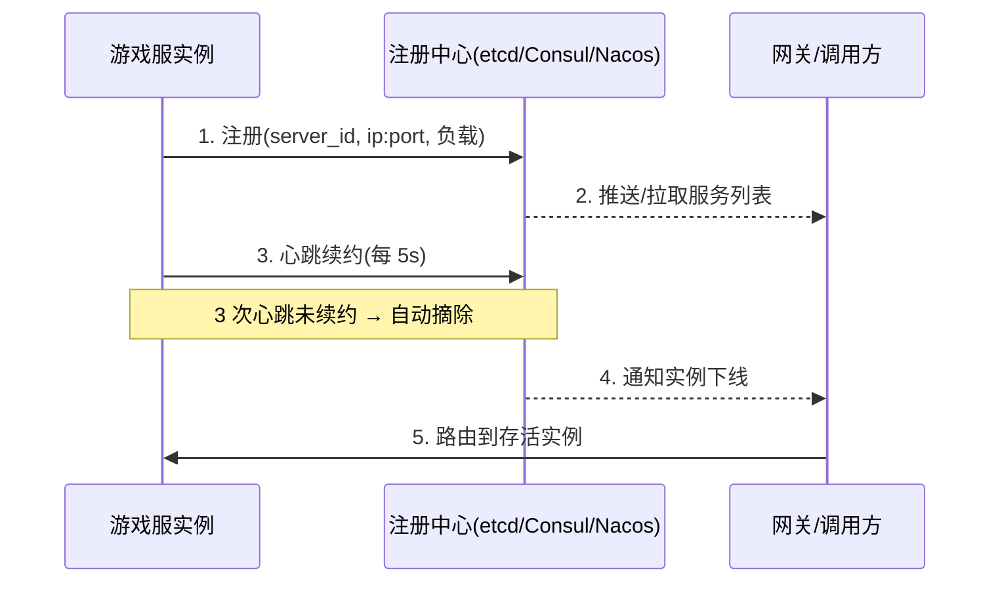
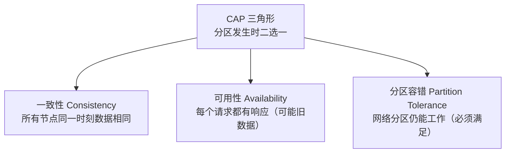
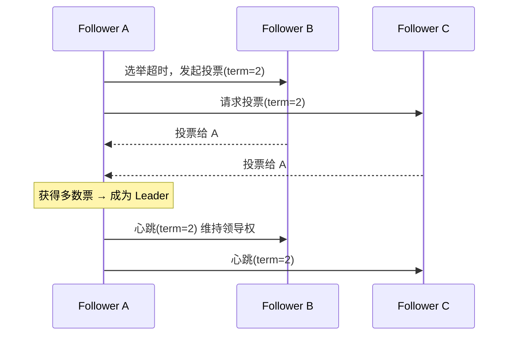
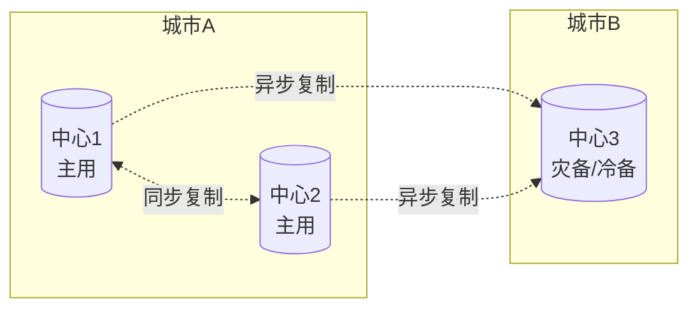
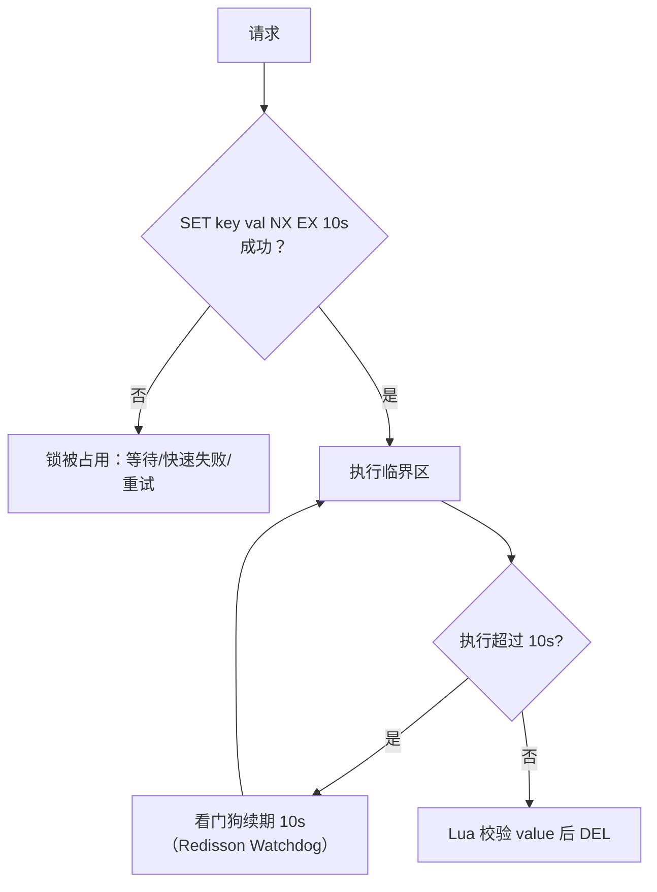

# 03 分布式与高可用

> 知识基线：实时游戏服务端通用架构；示例中的语言、数据库、缓存、容器和云平台版本必须以项目部署清单为准。
> 适用范围：覆盖全链路服务发现、网关路由、房间/游戏服分片、数据层高可用和运营容灾；不替代具体云厂商的部署清单与演练方案。
> 事实边界：协议规范、组件行为和示例方案分开；容量数字只作示意/经验值，必须通过压测验证。
> 最后更新：2026-08-06（补齐规范来源、版本边界与工程验收入口）。
> 版本边界：以 2026-08-06 为核对日，不新增不确定的当前组件版本号；数据库、Redis、编排、注册中心和云平台版本由项目部署清单锁定。
> 参考来源：[PostgreSQL 官方文档](https://www.postgresql.org/docs/)、[Redis 官方文档](https://redis.io/docs/latest/)、[Kubernetes 官方文档](https://kubernetes.io/docs/)、[OpenTelemetry 官方文档](https://opentelemetry.io/docs/)。

### P0 一致性与高可用验收

- 一致性结论是按业务分级的方案取舍：资产/订单通常宁可失败也不接受错账，在线态/排行榜可以优先可用并接受最终一致；必须把失败语义和补偿入口写进接口契约。
- 迁移、扩缩容和故障切换要验证路由稳定性、会话排空、重复消费、锁失效、脑裂保护与回滚；仅有副本数或“自动重启”不能证明高可用。
- 备份恢复必须在与生产隔离的环境演练，记录 RPO/RTO、数据校验和、幂等重放与恢复后流量切换；跨地域多活是否值得采用取决于成本、延迟和业务容忍度。
- Kubernetes 负责运行时调度，Redis/PostgreSQL 负责各自数据语义，OpenTelemetry 负责跨服务观测信号；组件行为、容量和告警阈值都要以部署清单、压测和故障注入结果为准。

> 单机撑不住规模，分布式引入了新问题：路由、通信、一致性、容灾。本文讲解游戏服务端分布式化的核心组件与理论：一致性哈希、消息队列、负载均衡、服务发现、CAP/BASE、Raft、容灾多活与分布式锁。

## 1. 概述

游戏服务端从"单服单进程"演进到"分布式微服务"，动机有三：

1. **规模**：单服容量有限（数千~数万同时在线），需要分服、分区分流；
2. **可用性**：单点故障即全服停服，需要冗余与自动切换；
3. **业务拆分**：登录、匹配、战斗、排行榜、充值等子系统独立部署、独立伸缩。

但分布式引入三类新问题：**怎么路由**（一致性哈希、负载均衡、服务发现）、**怎么通信**（消息队列、RPC）、**怎么保证一致**（CAP/BASE、Raft、分布式锁、容灾多活）。本文逐一展开。

## 2. 核心概念

| 概念 | 英文 | 说明 |
| --- | --- | --- |
| 一致性哈希 | Consistent Hashing | 哈希环 + 顺时针寻址，扩容只影响少量 Key 的路由 |
| 虚拟节点 | Virtual Node | 一致性哈希中每个物理节点映射多个环上位置，改善均匀性 |
| 消息队列 | Message Queue (MQ) | 异步传递消息的中间件，实现削峰、解耦、事件驱动 |
| 削峰填谷 | Peak Shaving | 用队列缓冲瞬时高峰流量，平缓下游压力 |
| 负载均衡 | Load Balancing | 把请求分散到多台后端，提升吞吐与可用性 |
| 服务发现 | Service Discovery | 服务实例动态注册/注销，调用方按需寻址 |
| 注册中心 | Registry | 保存服务实例元数据（地址、状态）的中心组件 |
| CAP 定理 | CAP Theorem | 分布式系统在分区时只能在一致性与可用性二选一 |
| BASE 理论 | BASE | 基本可用 + 软状态 + 最终一致，CAP 在工程上的妥协 |
| Raft | Raft | 共识算法（Consensus Algorithm）：选举 + 日志复制 |
| 容灾 | Disaster Recovery | 故障/灾难下保证数据不丢、服务可恢复的能力 |
| 多活 | Multi-Active | 多个数据中心同时对外服务，互为备份并分担流量 |
| 分布式锁 | Distributed Lock | 跨进程互斥：同一资源同一时刻只有一个执行者 |
| 租约 | Lease | 带 TTL 的授权，过期自动失效，用于锁续期与选主保活 |

## 3. 原理详解

### 3.1 一致性哈希（Consistent Hashing）

**问题背景**：分片路由若用"取模（hash mod N）"，节点数 N 变化（扩容/缩容）时，几乎所有 Key 都要迁移。

**原理**：把哈希值空间组织成首尾相接的环（0 ~ 2^32-1），节点与 Key 都哈希到环上；Key 归属"顺时针遇到的第一个节点"。



**虚拟节点**：每个物理节点在环上放多个虚拟节点（如 100~200 个），解决"节点少时分布不均"与"节点下线时负载倾斜"问题。

**对比**：

| 方案 | 扩容迁移量 | 均匀性 | 复杂度 |
| --- | --- | --- | --- |
| 取模（mod N） | 约 1/N 的数据迁移（翻倍扩容） | 好 | 低 |
| 一致性哈希 | 仅环上邻近 Key（约 1/N） | 依赖虚拟节点 | 中 |
| 范围分片 | 无迁移（新开区间） | 差（热点倾斜） | 低 |

**游戏中的应用**：

- Redis Cluster 的 slot 路由（16384 个 slot，本质是"槽位 + 环式迁移"）；
- 网关按玩家 ID 一致性哈希路由到对应游戏服，保证同玩家始终连同一服（会话保持）；
- 分库分表中间件的一致性哈希分片（见 01 篇）；
- 消息分区键路由：同一玩家的事件进同一 Kafka 分区，保证顺序。

### 3.2 消息队列（Message Queue）

**为什么需要 MQ**：

1. **削峰填谷（Peak Shaving）**：开服、活动瞬间的注册/登录洪峰，先入队缓冲，消费者按能力消费；
2. **异步解耦**：登录成功 → 发邮件、记日志、同步数据，主链路只做必要动作；
3. **事件驱动**：跨服战、全服活动、排行榜汇聚等通过事件总线协作；
4. **故障隔离**：下游（邮件服务）挂掉不影响主流程，消息可重试。



**Kafka vs RabbitMQ**：

| 维度 | Kafka | RabbitMQ |
| --- | --- | --- |
| 模型 | Topic / Partition / Offset | Exchange / Queue / Routing Key |
| 吞吐 | 极高（百万级 msg/s，顺序写） | 中高（万级 msg/s） |
| 顺序性 | 单分区内严格有序 | 单队列内有序（多消费者需注意） |
| 可靠性 | acks + 副本 + 幂等 Producer | Publisher Confirm + 持久化 + Consumer Ack |
| 消费模型 | 拉模式（pull），消费者管理 offset | 推/拉结合，Broker 管理投递 |
| 典型用途 | 大数据流、日志、事件总线、跨服消息 | 业务消息、任务分发、可靠投递 |

**Kafka 核心概念**：Topic（主题）→ 多个 Partition（分区，并行与顺序的单位）→ Offset（消费位点）；Consumer Group（消费组）内分区级负载均衡，组内一个分区只被一个消费者消费（保证组内顺序）。

**可靠性三件套**：

1. 生产端：`acks=all` + 重试 + 幂等 Producer（`enable.idempotence=true`）保证不丢不重；
2. Broker 端：`replication.factor>=3`、`min.insync.replicas>=2`，分区有副本冗余；
3. 消费端：手动提交 offset（处理成功后才提交）+ **消费幂等**（业务侧用唯一业务键去重，如邮件发放记录表唯一索引）。

**顺序消息**：需要严格顺序的业务（如玩家交易流水）按业务键路由到同一分区（`key=player_id`），单分区内保序；RabbitMQ 用单队列 + 单消费者或一致性哈希 Exchange。

### 3.3 负载均衡（Load Balancing）

层级：

- **L4（传输层）**：按 IP/端口转发，性能高，如云 LB、LVS；
- **L7（应用层）**：按 URL/Header/会话路由，支持健康检查与灰度，如 Nginx、网关（Kong/自研）。

算法对比：

| 算法 | 说明 | 适用 |
| --- | --- | --- |
| 轮询（Round Robin） | 依次分发 | 无状态服务 |
| 加权轮询（Weighted RR） | 按权重分发 | 异构机器 |
| 最少连接（Least Connections） | 给当前连接最少的节点 | 长连接服务 |
| 一致性哈希（Consistent Hash） | 按来源/玩家 ID 哈希 | 有状态游戏服（会话保持） |
| 随机（Random） | 简单、均匀 | 无状态场景 |

**游戏注意点**：游戏连接是**有状态长连接**（登录态、场景数据在服内），负载均衡必须"会话保持（Sticky Session）"——按玩家 ID 哈希到固定服务器；玩家跨服（转服、跨服战）由网关层路由而非 LB 随机分发。

### 3.4 服务发现（Service Discovery）

流程：服务启动 → 向注册中心注册（地址 + 元数据 + 健康状态）→ 心跳续约 → 下线/失活自动摘除 → 调用方订阅变更。



两种发现模式：

- **客户端发现**：调用方直接查注册中心并自己负载均衡（如 gRPC + Consul）；
- **服务端发现**：调用方只连 LB，LB 查注册中心转发（如 Nginx + Consul）。

游戏场景：开服/合服时游戏服动态注册 `zone-1-server-3`，网关按"玩家所在服"查注册中心拿到真实地址建立长连接；合服时旧实例摘除、新实例注册，连接平滑迁移。

### 3.5 CAP 与 BASE

**CAP 定理**：分布式系统中，网络分区（Partition，必然发生）时，只能在一致性（Consistency）与可用性（Availability）之间取舍：

- **CP**：牺牲可用性，保证所有节点读到一致数据（如 etcd、ZooKeeper、MongoDB 主从强同步）；
- **AP**：牺牲强一致，保证服务可用，接受最终一致（如 Redis 集群异步复制、Kafka）。



**BASE**：基本可用（Basically Available）+ 软状态（Soft State，允许中间态）+ 最终一致（Eventually Consistent），是 AP 路线的工程实现指南。

**游戏取舍**：

- 玩家存档、货币、道具：CP 倾向（写路径强一致，失败宁可报错不可错账）；
- 排行榜、在线人数、全服广播：AP 倾向（短暂陈旧可接受）；
- 跨服数据（跨服战结果）：最终一致 + 对账补偿。

### 3.6 Raft 简述

Raft 是易于理解的共识算法（Consensus Algorithm），用于让多节点就"同一份状态"达成一致（如选主、复制日志）。

**角色**：

- Leader（领导者）：接收客户端写入，复制日志到 Follower；
- Follower（跟随者）：被动复制，响应投票；
- Candidate（候选者）：选举超时后发起投票。

**机制**：

- 任期（Term）：每次选举递增的纪元号，防旧 Leader 干扰；
- 选举：Follower 选举超时（150~300ms 随机）→ 变 Candidate → 获得多数票成为 Leader，Leader 通过心跳续任期；
- 日志复制：客户端写 → Leader 追加日志 → 复制到多数节点（多数派提交，Majority Commit）→ 提交并应用；
- 安全性：只有日志最新者能当选；Leader 任期内的日志一定被多数节点保存。



**游戏应用**：etcd 存元数据与配置（注册中心、分布式锁底层）；游戏"主服选举"（跨服战的主服、活动服）可用 Raft 系组件选主；自研主从切换（如 MySQL MGR、Redis Cluster 的 failover）都基于类似的多数派思想。

### 3.7 容灾与多活

**容灾等级**（从低到高）：

| 方案 | 说明 | RPO/RTO |
| --- | --- | --- |
| 本地备份 | 每日备份 + 恢复 | 小时级 |
| 同城双活 | 同城两机房同时服务，故障秒级切换 | 分钟级 |
| 两地三中心 | 生产双中心 + 异地灾备中心 | 分钟~小时级 |
| 三地五中心 | 多地多中心，单机房故障几乎无感 | 秒级 |



**游戏特殊性**：

1. 游戏按"服"组织玩家，容灾粒度常是"服级"：单服故障 → 该服玩家可转移/回滚到最近存档点（见 01 篇快照体系），而非全局切换；
2. 跨机房数据同步用异步复制为主，同城双活用于网关/登录/充值等无状态或低延迟依赖的系统；
3. 脑裂（Split-Brain）防护：双中心必须靠"多数派仲裁 + fencing（隔离旧主）"防止两边同时写；
4. 容灾演练常态化：每季度模拟机房断电、数据库切换、整服回档，验证 RPO/RTO 达标。

### 3.8 分布式锁（Distributed Lock）

**适用场景**：定时任务只在一个实例执行（每日重置）、跨服交易互斥、发奖幂等（同一订单只发一次）、热点资源（活动限量道具）扣减。

**Redis 实现（SETNX + 过期 + 续期）**：



要点：

- **原子性**：加锁用 `SET key val NX EX ttl`（一个命令）；释放用 Lua（GET 校验 value 是自己的才 DEL），防止误删他人锁；
- **value 唯一**：每线程生成唯一值（UUID），释放时校验；
- **续期（Watchdog）**：持锁超过 TTL 自动续期，防止任务未完成锁已过期；
- **RedLock 争议**：Redis 作者提出的多实例加锁算法（半数以上实例成功才算持锁），业界争议大（依赖时钟、性能差）；大多数业务场景单实例 Redis + 哨兵高可用足够；
- **etcd 实现**：租约（Lease）+ 前缀创建 + Revision 序数比较，谁的最小谁持锁，天然支持 watch 等待与自动过期，无时钟依赖，适合强一致场景；
- **数据库实现**：悲观锁（SELECT ... FOR UPDATE）与乐观锁（version 比对，见 01 篇），适合低频、强一致场景。

## 4. 代码与配置示例

### 4.1 一致性哈希（Go 简化版）

```go
type ConsistentHash struct {
    ring       map[uint32]string // 环：哈希值 -> 节点
    sortedKeys []uint32          // 有序哈希值
    replicas   int               // 每个节点的虚拟节点数
}

func (c *ConsistentHash) Add(node string) {
    for i := 0; i < c.replicas; i++ {
        h := crc32.ChecksumIEEE([]byte(fmt.Sprintf("%s-%d", node, i)))
        c.ring[h] = node
        c.sortedKeys = append(c.sortedKeys, h)
    }
    sort.Slice(c.sortedKeys, func(i, j int) bool { return c.sortedKeys[i] < c.sortedKeys[j] })
}

func (c *ConsistentHash) Get(key string) string {
    h := crc32.ChecksumIEEE([]byte(key))
    idx := sort.Search(len(c.sortedKeys), func(i int) bool { return c.sortedKeys[i] >= h })
    if idx == len(c.sortedKeys) { idx = 0 } // 环回绕
    return c.ring[c.sortedKeys[idx]]
}
```

### 4.2 Kafka 生产者配置（YAML/Properties）

```yaml
producer:
  bootstrap.servers: "kafka-1:9092,kafka-2:9092,kafka-3:9092"
  acks: all                    # 等待所有 ISR 副本确认
  enable.idempotence: true     # 幂等生产者，防止重试导致重复
  key.serializer: StringSerializer
  value.serializer: StringSerializer
consumer:
  group.id: game-mail-consumer
  enable.auto.commit: false    # 手动提交 offset
  max.poll.records: 200
topics:
  mail: { partitions: 16, replication.factor: 3 }
  cross-server: { partitions: 32, replication.factor: 3 }
```

### 4.3 RabbitMQ 队列声明与消费（Python 节选）

```python
import pika
conn = pika.BlockingConnection(pika.ConnectionParameters("rabbitmq"))
ch = conn.channel()
ch.exchange_declare("game.mail", "direct", durable=True)
ch.queue_declare("mail.send", durable=True)
ch.queue_bind("mail.send", "game.mail", routing_key="send")
ch.basic_qos(prefetch_count=50)   # 消费限速，防止积压压垮下游

def on_msg(ch, method, props, body):
    send_mail(json.loads(body))    # 业务处理
    ch.basic_ack(method.delivery_tag)  # 成功才 ack

ch.basic_consume("mail.send", on_msg)
ch.start_consuming()
```

### 4.4 Redis 分布式锁（Go + Lua）

```go
const unlockScript = `
if redis.call("GET", KEYS[1]) == ARGV[1] then
    return redis.call("DEL", KEYS[1])
else
    return 0
end`

func Lock(ctx context.Context, key, val string, ttl time.Duration) (bool, error) {
    return rdb.SetNX(ctx, key, val, ttl).Result() // SET key val NX EX ttl 原子
}

func Unlock(ctx context.Context, key, val string) error {
    return rdb.Eval(ctx, unlockScript, []string{key}, val).Err() // 校验后删除
}
```

### 4.5 etcd 选主/锁（Go 伪代码）

```go
// 基于租约 + Revision 序数：最小 Revision 者持锁
lease := client.Lease.Grant(ctx, 10)                 // 10s 租约，自动续约
resp, _ := client.Put(ctx, "/lock/daily-reset", "leader", clientv3.WithLease(lease.ID))
// 读取同前缀所有 key，若自己的 Revision 最小 → 获得锁；否则 watch 前一个 Revision 删除
for _, kv := range allKeys {
    if kv.CreateRevision < resp.Header.Revision { waitRelease(ctx, kv.Key) }
}
```

### 4.6 Nginx 负载均衡（游戏网关前置，配置节选）

```nginx
upstream game_gate {
    # 一致性哈希按玩家ID路由：同玩家固定连同一网关（会话保持）
    hash $arg_player_id consistent;
    server 10.0.0.11:8080 weight=5;
    server 10.0.0.12:8080 weight=5;
    server 10.0.0.13:8080 backup;   # 备用节点
}
server {
    listen 9000;
    location /ws {
        proxy_pass http://game_gate;
        proxy_http_version 1.1;
        proxy_set_header Upgrade $http_upgrade;   # WebSocket 长连接
        proxy_set_header Connection "upgrade";
    }
}
```

## 5. 最佳实践

1. **路由**：玩家维度的状态路由用一致性哈希或取模 + 元数据表，保证会话保持；变更路由（合服）要平滑迁移（双写窗口 + 校验）；
2. **MQ**：关键业务消息用 Kafka（acks=all + 幂等），业务消费必须幂等（业务键唯一约束）；队列积压要有监控告警（lag）；
3. **LB**：无状态服务轮询/加权，有状态游戏服按玩家哈希 + 健康检查摘除；
4. **服务发现**：注册中心要独立高可用（etcd/Consul 集群），心跳超时与摘除参数按游戏服特性调优（长连接服务摘除要防"雪崩式重连"——摘除后加延迟重连与抖动）；
5. **一致性**：明确每个数据的 CP/AP 定位；跨服务写用"本地事务 + 消息补偿"实现最终一致；
6. **锁**：优先 Redis 单实例 + 哨兵；value 唯一 + Lua 释放 + 看门狗续期；强一致场景（发奖对账）用 etcd 锁或数据库唯一约束兜底；
7. **容灾**：按服级容灾设计，备份与恢复演练进季度计划；脑裂防护（fencing）必须做。

## 6. 常见问题 FAQ

**Q1：一致性哈希和取模怎么选？**
A：节点数量稳定、翻倍扩容可接受取模（实现简单）；节点频繁增删（云环境弹性伸缩、Redis Cluster）选一致性哈希。游戏网关路由推荐一致性哈希，保证玩家会话稳定。

**Q2：Kafka 消息会丢吗？怎么做到不丢不重？**
A：生产者 acks=all + 幂等；Broker 副本数 ≥3 且 min.insync.replicas=2；消费者手动提交 offset。但"不重"只能靠消费端幂等（业务键去重），分布式系统没有"恰好一次"的银弹（精确一次需要事务性幂等表）。

**Q3：消息重复消费导致重复发奖怎么办？**
A：发奖表对"订单号/消息ID"建唯一索引，重复消息插入失败即幂等跳过；或 Redis SETNX 幂等键（带 TTL）先标记再发奖。

**Q4：Redis 分布式锁在 GC 停顿/时钟跳变时会失效吗？**
A：会。GC 停顿导致锁过期而临界区未结束，可用看门狗续期缓解；RedLock 也无法完全解决（依赖时钟）。务实做法：锁 + 业务幂等双重保障——锁防并发，唯一约束/幂等键兜底。

**Q5：CAP 中游戏必须选 CP 吗？**
A：按数据分级：玩家资产/存档 CP（失败宁可报错）；排行榜/在线状态 AP。全盘 CP 会牺牲可用性（分区时拒绝服务），全盘 AP 会造成错账，游戏内通常混合。

**Q6：Raft 和 Paxos 什么关系？**
A：Paxos 是理论奠基（难实现难理解），Raft 是工程化共识算法（可理解、广泛落地：etcd、Consul、TiKV）。选型直接看产品：etcd（Raft）足够。

**Q7：两地三中心在游戏里怎么落地？**
A：游戏主链路（登录/存档/充值）同城双活；异地中心做灾备（异步复制 + 冷启动），因为游戏玩家数据按服隔离，异地容灾重点是"备份可恢复"，而非实时双活；跨服玩法（跨服战）再单独做中心化服务。

**Q8：服务实例批量下线为什么会雪崩？**
A：注册中心摘除后，客户端/网关集中重连造成连接风暴；对策：摘除前先摘流量（LB 停权重）→ 等待存量连接排空 → 再优雅下线；客户端重连加随机退避（指数退避 + 抖动）。

## 7. 关联阅读

- 上一篇：[02-缓存与排行榜系统](02-缓存与排行榜系统.md)——Redis 分布式锁与集群的缓存基础；
- 分库分表与分布式事务的数据面：见 [01-数据库选型与存储设计](01-数据库选型与存储设计.md)；
- 协议加密与防重放（分布式通信安全）：见 [04-安全与反作弊](04-安全与反作弊.md)；
- K8s 编排、弹性伸缩与故障恢复（分布式系统的运行时）：见 [05-部署运维与监控](05-部署运维与监控.md)；
- 上游基础：`../01-架构与网络/` 中的消息系统、并发模型与服务器架构模式。
