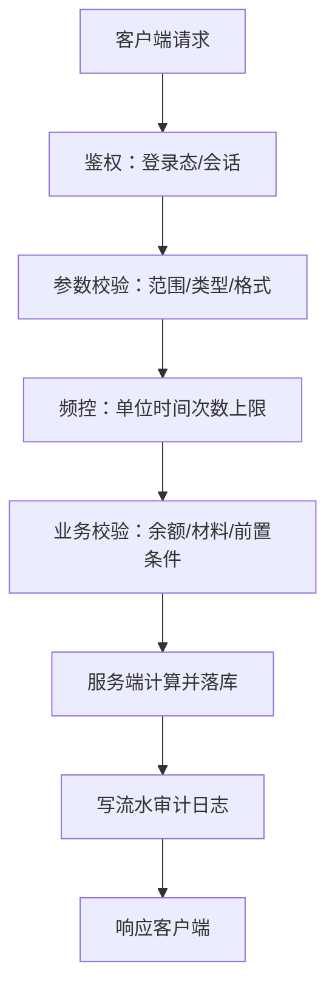
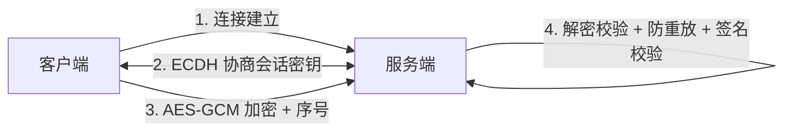
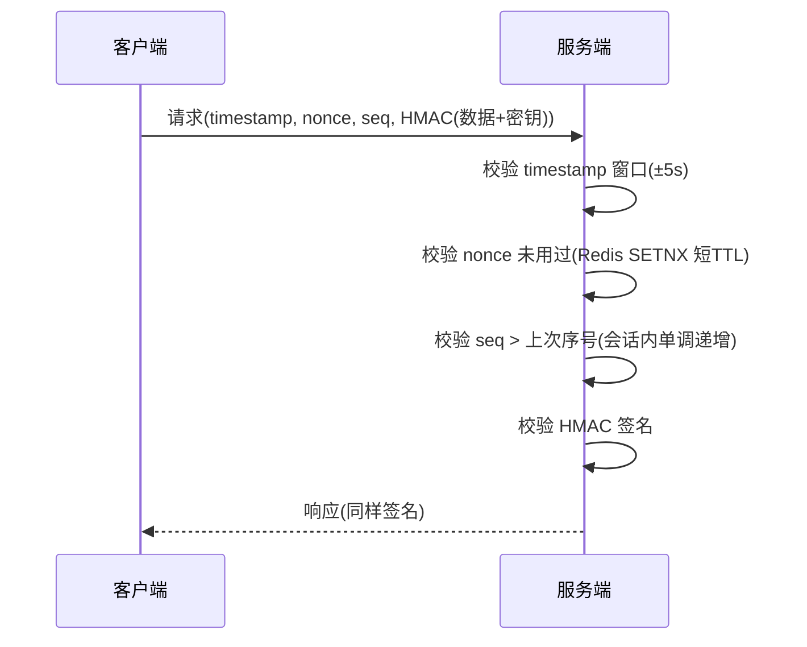
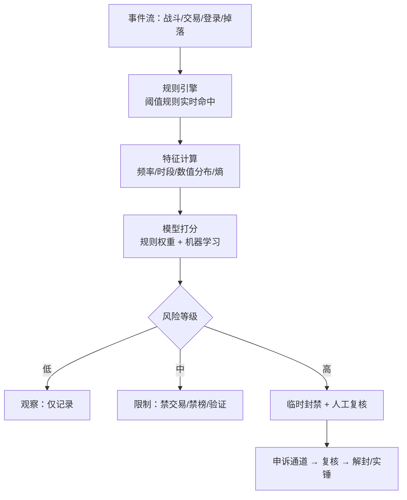

# 04 安全与反作弊

> 知识基线：实时游戏服务端通用架构；示例中的语言、数据库、缓存、容器和云平台版本必须以项目部署清单为准。
> 适用范围：覆盖网关/登录协议安全、游戏服权威校验、数据/资产风控和运营审计；不替代法律合规评审、客户端安全或渠道规则。
> 事实边界：协议规范、组件行为和示例方案分开；容量数字只作示意/经验值，必须通过压测验证。
> 最后更新：2026-08-06（补齐规范来源、版本边界与工程验收入口）。
> 版本边界：以 2026-08-06 为核对日，不新增不确定的当前组件版本号；密码库、Redis、数据库、采集和封禁平台版本由项目部署清单锁定。
> 参考来源：[TCP RFC 9293](https://www.rfc-editor.org/rfc/rfc9293.html)、[QUIC RFC 9000](https://www.rfc-editor.org/rfc/rfc9000.html)、[Redis 官方文档](https://redis.io/docs/latest/)、[PostgreSQL 官方文档](https://www.postgresql.org/docs/)、[OpenTelemetry 官方文档](https://opentelemetry.io/docs/)。

### P0 反作弊证据与审计验收

- “服务端权威”是信任边界，不是单一算法：输入校验、频率/时钟窗口、资产流水、回放复核和风控处置要按玩法威胁模型组合，反作弊结论属于方案取舍，不是绝对保证。
- nonce、序号、限流键和封禁状态的存储/过期策略必须说明一致性要求；Redis 适合作为短期状态或加速层时，也要以持久化流水和数据库约束兜底关键资产。
- 审计记录需能关联脱敏玩家/设备、请求或事件 ID、规则版本、判定、处置和申诉结果；OpenTelemetry 用于跨服务定位，不替代不可篡改或可追溯的业务审计存储。
- 验收应包含重放、改包、改时钟、断线重试、并发刷取、误报复核和恢复演练，记录拦截率、误报率、延迟、资源成本和回滚入口后再决定上线。

> 游戏是网络攻击与作弊的重灾区：经济系统、PVP 竞技、排行榜都是外挂目标。安全的第一原则是"服务器权威、客户端不可信"，在此基础上叠加协议安全、行为风控与合规治理。

## 1. 概述

游戏服务端面临的安全威胁分为四层：

1. **协议层**：抓包、篡改、重放、伪造请求；
2. **客户端层**：内存修改、变速、透视、脚本自动化；
3. **业务层**：刷资源、薅羊毛、利用漏洞刷排行榜；
4. **合规层**：未成年人防沉迷、个人信息保护、概率公示。

安全设计的第一性原理：**客户端运行在攻击者的机器上，一切客户端数据都不可信**（Never Trust the Client）。所有影响游戏经济与公平性的判定必须由服务端完成，并保留审计日志。

## 2. 核心概念

| 概念 | 英文 | 说明 |
| --- | --- | --- |
| 服务器权威 | Server Authority | 关键状态与判定由服务端计算，客户端只做表现 |
| 客户端不可信 | Never Trust the Client | 一切客户端输入/上报都可能被篡改 |
| 协议加密 | Protocol Encryption | 对通信内容加密，防止明文抓包 |
| 消息签名 | Message Signature | 用密钥对消息做 HMAC，防篡改与伪造 |
| 防重放 | Anti-Replay | 通过 timestamp/nonce/序号防止旧包重放 |
| 内存修改 | Memory Hacking | 修改客户端进程内存（数值、跳转指令） |
| 变速齿轮 | Speed Hack | 加速/减速系统时钟，改变游戏节奏 |
| 封包外挂 | Packet Editor | 抓包、改包、伪造、重放网络消息 |
| 脚本外挂 | Macro / Bot | 模拟按键自动操作（挂机、自动打怪） |
| 透视 | ESP / Map Hack | 读取内存绘制敌方位置、掉落等隐藏信息 |
| 反作弊 SDK | Anti-Cheat SDK | 嵌入客户端的检测与上报组件 |
| 行为检测 | Behavior Detection | 基于操作特征识别自动化与外挂行为 |
| 风控 | Risk Control | 规则+模型评估风险，分级处置 |
| 实名认证 | Real-Name Verification | 对接权威数据校验玩家身份 |
| 防沉迷 | Anti-Addiction | 未成年人时长/消费限制 |

## 3. 原理详解

### 3.1 服务器权威原则（Server Authority）

核心思想：**客户端 = 显示器 + 输入器**。客户端展示状态、收集输入；所有影响结果的判定在服务端重新执行或校验。

必须服务端权威的判定：

| 业务 | 客户端行为 | 服务端做法 |
| --- | --- | --- |
| 战斗伤害 | 客户端算伤害并上报 | 服务端按属性公式重算（或服务端模拟/仲裁） |
| 掉落 | 客户端表现掉落 | 服务端随机 + 发放，客户端只播放 |
| 货币/道具 | 客户端请求购买/合成 | 服务端校验价格、库存、余额后扣发 |
| 概率抽卡 | 客户端请求抽卡 | 服务端随机数生成结果，概率公示可验证 |
| 移动/技能 | 客户端上报位置 | 状态同步由服务端仲裁（见架构篇） |
| 任务进度 | 客户端上报完成 | 服务端校验条件（次数、物品、时间） |

实现要点：

- **随机数服务端生成**：客户端随机结果一律不采纳（防"随机数作弊"）；
- **幂等与审计**：所有经济操作带请求 ID，服务端记录流水（谁、何时、何物、何因），可回溯可对账；
- **日志先行**：重要操作"先记日志再执行"，便于事后审计与回滚；
- **服务器权威不等于一切重算**：实时战斗类游戏为性能采用"客户端预测 + 服务端仲裁/回溯"，但最终结果以服务端为准。

### 3.2 客户端数据校验（不做信任）

**原则：任何来自客户端的数字、时间、次数、状态都可能被改，服务端必须逐项校验。**

校验清单：

| 输入类型 | 校验内容 | 示例 |
| --- | --- | --- |
| 数值 | 范围、非负、类型 | 购买数量 ∈ [1, 999]，价格由服务端查表 |
| 时间 | 活动时间窗 | 领取奖励时间在活动起止内，服务端时钟为准 |
| 次数 | 频率与总量限制 | 每日签到最多 1 次，抽卡每日上限 |
| 幂等 | 请求唯一 | 同一订单/请求 ID 不重复处理 |
| 所有权 | 归属校验 | 只能操作自己的角色/物品 |
| 前置条件 | 状态机校验 | 未解锁的功能拒绝调用；合成材料必须真实存在 |



注意：**鉴权 ≠ 信任**——登录态只能证明"是谁"，不能证明"参数合法"；业务校验不可省略。

### 3.3 协议加密与签名

#### 3.3.1 传输层

- 首选 TLS（wss://），保证传输机密性与完整性，防中间人窃听；
- 游戏长连接（TCP/WebSocket）同样启用 TLS，或用 DTLS（UDP 场景）。

#### 3.3.2 应用层加密

传输层加密之上，关键业务（充值、交易）通常再叠加应用层加密：对称加密用 **AES-GCM**（带认证的加密，AEAD），非对称用于密钥协商（ECDH）与签名。



安全准则：

- **禁止自研加密算法**；XOR、RC4、固定密钥"混淆"在抓包逆向面前形同虚设；
- 密钥定期轮换（按天/按版本），不同服不同密钥；
- 密钥不硬编码在客户端二进制中（可被提取），配合白盒加密（White-Box Cryptography）或服务端下发 + 内存保护；
- 加密 ≠ 防作弊：加密挡"看不懂"，服务器权威才挡"改不动"。

#### 3.3.3 消息签名与防重放



四道防线缺一不可：时间戳防"过期重放"、nonce 防"同刻重放"、序号防"乱序重放"、签名防"篡改伪造"。注意签名必须覆盖完整消息体（含上述字段），否则攻击者可"先改后签"——不，攻击者没有密钥签不了，但必须覆盖全部字段避免"字段替换攻击"。

### 3.4 常见外挂类型与对策

| 外挂类型 | 英文 | 原理 | 主要危害 | 核心对策 |
| --- | --- | --- | --- | --- |
| 内存修改 | Memory Hacking | 修改客户端进程内存中的数值/代码 | 秒杀、无敌、无限资源 | 服务器权威；反作弊 SDK 检测内存扫描/写入 |
| 变速齿轮 | Speed Hack | 加速/减速系统时钟 | 加速刷怪、无敌帧、跳过冷却 | 服务端按服务器时间计算冷却；行为检测异常节奏 |
| 封包外挂 | Packet Editor | 抓包改包、重放、伪造协议 | 刷物品、复制、篡改交易 | 加密 + 签名 + 防重放 + 服务端状态机校验 |
| 脚本外挂 | Macro / Bot | 模拟键鼠自动操作 | 挂机刷资源、自动钓鱼、代练 | 行为检测（操作模式、点击熵）+ 验证码/滑块 |
| 透视 | ESP / Wallhack | 读内存绘制敌方/物品位置 | 竞技不公平 | 反作弊 SDK 内存完整性检测；服务端不发送冗余信息 |
| AI 代打 | AI Bot | 视觉+操作自动化 | 排位/竞技污染 | 行为特征 + 机器学习识别 |

各类型对策详解：

1. **内存修改**：反作弊 SDK（内核/用户态）检测调试器（IsDebuggerPresent/断点）、内存扫描工具特征、代码段完整性（哈希校验）；服务端对高频异常数值（伤害峰值、移动速度）做审计；
2. **变速**：服务端权威时间——冷却、活动倒计时、掉落计时全部用服务器时间；客户端时钟只做展示。服务端可检测"请求到达间隔"的统计异常（变速挂通常伴随固定间隔）；
3. **封包**：服务端**状态机校验**——每个协议只在合法状态可调用（未进入副本不能提交副本奖励）、参数与服务器快照比对（背包里没有 999 个材料就不能合成 999 次）；配合签名/防重放（见 3.3）；
4. **脚本**：行为检测——按键间隔过于均匀（信息熵低）、7×24 在线、操作模式固定；对策：行为验证（验证码/滑块/答题）、随机化玩法（钓鱼位置随机）、挂机收益递减；
5. **透视**：SDK 检测 + 服务端信息最小化（不把地图全量实体位置发给客户端，用视野裁剪 + 迷雾）；
6. **通用**：作弊者样本采集 → 特征入库 → 规则/模型批量识别。

### 3.5 行为检测与风控

风控决策链路：



特征示例：

- **数值特征**：单次掉落价值、单位时间收益、排行榜分数增速（"3 分钟 100 万分"）；
- **行为特征**：操作间隔方差（人类 ~200ms 抖动 vs 脚本恒定）、鼠标轨迹曲率、点击坐标分布、在线时段（凌晨 4 点连续 30 天）；
- **关系特征**：小号批量行为、同 IP/同设备多账号、定向转移资源（养号）；
- **对抗特征**：SDK 上报的注入/调试器/模拟器标记。

处置原则：

- **分级处罚**：观察 → 限制（禁入排行榜、禁交易）→ 短期封禁 → 永久封禁，避免"一刀切"误伤；
- **灰度与复核**：新规则先离线回测再灰度上线，误封率可观测；申诉通道必须存在（合规要求）；
- **对抗升级**：外挂与反作弊是军备竞赛，检测规则要版本化、可灰度、防逆向（规则下发加密/服务端执行）。

### 3.6 防沉迷与合规

#### 3.6.1 防沉迷（中国网络游戏防沉迷新规，2021）

- **实名认证**：新用户必须实名（对接权威数据核验），未实名无法登录/充值；
- **未成年人时长**：仅周五/周六/周日及法定节假日 20:00~21:00 可玩 1 小时，其余时间禁玩（网络游戏服务时段限制）；
- **未成年人消费**：未满 8 周岁不得充值；8~16 周岁单次 ≤50 元、月累计 ≤200 元；16~18 周岁单次 ≤100 元、月累计 ≤400 元；
- **实现**：服务端统一时钟计算时长，跨游戏/跨平台由"网络游戏防沉迷实名验证系统"汇总；**时长计算必须在服务端**，客户端上报不可信；
- 海外市场注意当地法规（如韩国游戏宵禁、欧美 ESRB/PEGI 年龄分级、德国等对开箱概率的规定）。

#### 3.6.2 个人信息与内容合规

- **个人信息保护法（PIPL）/ GDPR**：最小化收集（只收必要信息）、加密存储（手机号、身份证哈希/加密）、提供删除权、隐私政策明示；
- **随机抽取概率公示**：抽卡/开箱概率必须公示且可验证（服务端随机算法可审计）；
- **内容合规**：聊天敏感词过滤、玩家昵称审核（接入审核服务或自建词库 + AI 审核）、UGC 内容先审后发；
- **未成年人保护**：家长监护平台、消费提醒、夜间禁玩；
- **审计留痕**：充值、实名、风控处置记录保留法定时限，便于监管检查与投诉举证。

## 4. 代码与配置示例

### 4.1 AES-GCM 加密封包（Go）

```go
func EncryptPacket(key []byte, plain []byte) ([]byte, error) {
    block, _ := aes.NewCipher(key)
    gcm, _ := cipher.NewGCM(block)
    nonce := make([]byte, gcm.NonceSize())
    if _, err := io.ReadFull(rand.Reader, nonce); err != nil {
        return nil, err
    }
    return gcm.Seal(nonce, nonce, plain, nil), nil // nonce 前置，密文自带认证
}

func DecryptPacket(key []byte, sealed []byte) ([]byte, error) {
    block, _ := aes.NewCipher(key)
    gcm, _ := cipher.NewGCM(block)
    nonce, ciphertext := sealed[:gcm.NonceSize()], sealed[gcm.NonceSize():]
    return gcm.Open(nil, nonce, ciphertext, nil) // 认证失败直接报错
}
```

### 4.2 HMAC 消息签名（Go）

```go
func SignMessage(key []byte, fields ...string) string {
    mac := hmac.New(sha256.New, key)
    for _, f := range fields { // 覆盖 timestamp、nonce、seq 与业务字段
        mac.Write([]byte(f))
        mac.Write([]byte{0})
    }
    return hex.EncodeToString(mac.Sum(nil))
}

// 校验：用相同输入重算签名，constant time 比较
func VerifySign(key []byte, got string, fields ...string) bool {
    expect := SignMessage(key, fields...)
    return hmac.Equal([]byte(got), []byte(expect))
}
```

### 4.3 防重放校验（伪代码）

```go
func CheckReplay(sess *Session, ts int64, nonce string, seq int64) error {
    now := time.Now().Unix()
    if abs(now-ts) > 5 { return ErrTimestamp }       // 时间窗校验
    ok, _ := rdb.SetNX(ctx, "nonce:"+sess.ID+":"+nonce, 1, 60*time.Second).Result()
    if !ok { return ErrReplayNonce }                 // nonce 唯一校验
    if seq <= sess.LastSeq { return ErrReplaySeq }   // 序号单调递增
    sess.LastSeq = seq
    return nil
}
```

### 4.4 频率限制（Redis 滑动窗口，Lua）

```lua
-- KEYS[1]=限流key，ARGV[1]=窗口秒数，ARGV[2]=上限，ARGV[3]=当前时间戳
local now = tonumber(ARGV[3])
redis.call('ZREMRANGEBYSCORE', KEYS[1], 0, now - tonumber(ARGV[1])*1000)
local count = redis.call('ZCARD', KEYS[1])
if count >= tonumber(ARGV[2]) then
  return 0
end
redis.call('ZADD', KEYS[1], now, now .. ':' .. math.random(1e9))
redis.call('EXPIRE', KEYS[1], tonumber(ARGV[1]))
return 1
```

### 4.5 服务器权威校验示例（购买道具，Go 伪代码）

```go
func BuyItem(ctx context.Context, pid int64, itemID int, count int) error {
    // 1. 基础校验
    if count <= 0 || count > 999 { return ErrBadParam }
    cfg := itemCfg[itemID]               // 价格查配置表，不信客户端传价
    if cfg == nil || !cfg.OnSale { return ErrItemNotOnSale }
    // 2. 频控与幂等（见 4.4）
    if !rateLimit(ctx, fmt.Sprintf("buy:%d", pid), 10, 1) { return ErrTooFrequent }
    if !dedup(ctx, reqID) { return ErrDuplicated }       // 同一请求只处理一次
    // 3. 事务：扣货币 + 发道具 + 写流水，同分片单事务
    tx := db.Begin()
    rows := tx.Exec("UPDATE player SET diamond=diamond-? WHERE player_id=? AND diamond>=?", cfg.Price*count, pid, cfg.Price*count)
    if rows == 0 { tx.Rollback(); return ErrNotEnough }
    tx.Exec("INSERT INTO player_item(pid,item_id,count) VALUES(?,?,?) ON DUPLICATE KEY UPDATE count=count+?", ...)
    tx.Exec("INSERT INTO trade_log(pid,req_id,item_id,count,cost,ts) VALUES(?,?,?,?,?,NOW())", ...)
    tx.Commit()
    return nil
}
```

### 4.6 风控规则配置（YAML）

```yaml
risk:
  rules:
    - id: freq_trade
      name: 高频交易
      metric: trade_count_per_minute
      threshold: 60
      action: limit_trade_2h
    - id: score_speed
      name: 排行榜分数异常增速
      metric: score_gain_per_10min
      threshold: 50000
      action: ban_leaderboard_24h
    - id: odd_hours
      name: 连续凌晨在线
      metric: consecutive_days_3am_online
      threshold: 14
      action: manual_review
  actions:
    limit_trade_2h: { type: restriction, target: trade, duration: 2h }
    ban_leaderboard_24h: { type: restriction, target: leaderboard, duration: 24h }
    manual_review: { type: queue, channel: risk-console }
```

## 5. 最佳实践

1. **架构先行**：关键计算服务端权威，客户端永远只是表现层；经济系统设计时就留"服务端流水 + 对账"能力；
2. **协议纵深**：TLS + AES-GCM + HMAC + 防重放四件套；密钥轮换与下发管理（密钥管理服务 KMS）；
3. **校验闭环**：参数校验 → 频控 → 业务校验 → 幂等 → 流水审计，缺一不可；
4. **反作弊分层**：SDK 客户端检测 + 服务端规则 + 行为模型 + 人工复核，层层递进，避免单点失效；
5. **风控灰度**：规则先离线回测、再小流量灰度、误封率监控、申诉与复核闭环；
6. **合规内置**：实名、防沉迷、概率公示、隐私保护从产品设计阶段就做（Security & Compliance by Design）；
7. **日志与取证**：风控处置保留完整证据链（操作日志、对局录像），防止误封纠纷与法律风险。

## 6. 常见问题 FAQ

**Q1：加了 TLS 加密是不是就防住外挂了？**
A：不是。TLS 只防窃听与中间人，外挂运行在玩家自己的机器上，可以 Hook 客户端、读取内存、甚至模拟点击——加密挡不住"客户端本身被控制"。服务器权威 + 行为检测才是根本。

**Q2：为什么客户端算伤害、服务端再验一遍，性能不够怎么办？**
A：实时战斗（MOBA/FPS）确实不能每帧服务端全量重算，采用"客户端预测 + 服务端仲裁（延迟补偿/回溯校验）"：服务端以较低频率校验关键事件（伤害峰值、经济变动、胜负判定），异常则回滚/修正。经济与掉落类低频操作则必须全量服务端权威。

**Q3：怎么区分"手速快的人类玩家"和"脚本"？**
A：统计特征：按键间隔分布（人类呈有抖动的高斯分布，脚本呈恒定值或周期性）、点击坐标精度、在线时长模式、操作序列的熵。单一特征易误判，用多特征模型 + 验证码（行为验证）二次确认。

**Q4：防重放里 nonce 存 Redis 会撑爆内存吗？**
A：nonce 带短 TTL（如 60s）即可，因为重放窗口只在时间戳窗口内才有意义；Redis 用 SETNX + EXPIRE，内存占用可控。序号校验（服务端会话态）可替代大部分 nonce 存储。

**Q5：未成年人用成年人身份证注册怎么办？**
A：实名认证对接权威数据（姓名+身份证一致）只能保证"身份真实"，无法识别"代认证"。补充手段：设备指纹、人脸识别（高敏场景）、家长申诉通道；合规要求企业尽到核验义务，剩余风险靠运营与监管机制兜底。

**Q6：误封了正常玩家怎么处理？**
A：处置分级（先限制后封禁）+ 申诉通道 + 人工复核；封禁必须附证据（可脱敏展示给玩家）；建立误封率指标（<0.1% 量级目标），规则上线先灰度。

**Q7：抽卡概率公示后，怎么让玩家相信随机是真的？**
A：服务端统一随机源（可种子的 CSPRNG），概率表版本化存档；可选"可验证随机"（如基于区块哈希/可验证延迟函数 VDF 的抽奖）；审计日志记录每次抽卡随机数与结果，支持监管抽查。

**Q8：聊天敏感词过滤怎么做？**
A：词库（精确 + 变体归一化：谐音、拆字、拼音）+ 服务端过滤；UGC 内容先审后发（自建审核 + 第三方审核 API）；涉政涉黄关键词接入监管词库；命中记录审计，重大违规上报。

## 7. 关联阅读

- 上一篇：[03-分布式与高可用](03-分布式与高可用.md)——分布式锁与幂等机制是"服务端权威 + 防重复"的基础设施；
- 存档流水与对账设计：见 [01-数据库选型与存储设计](01-数据库选型与存储设计.md)；
- 排行榜防作弊与缓存一致性：见 [02-缓存与排行榜系统](02-缓存与排行榜系统.md)；
- 风控日志留存、监控告警与合规审计：见 [05-部署运维与监控](05-部署运维与监控.md)；
- 上游基础：`../01-架构与网络/` 中的协议设计与状态同步（帧同步/状态同步）决定了服务器权威的落地方式。
