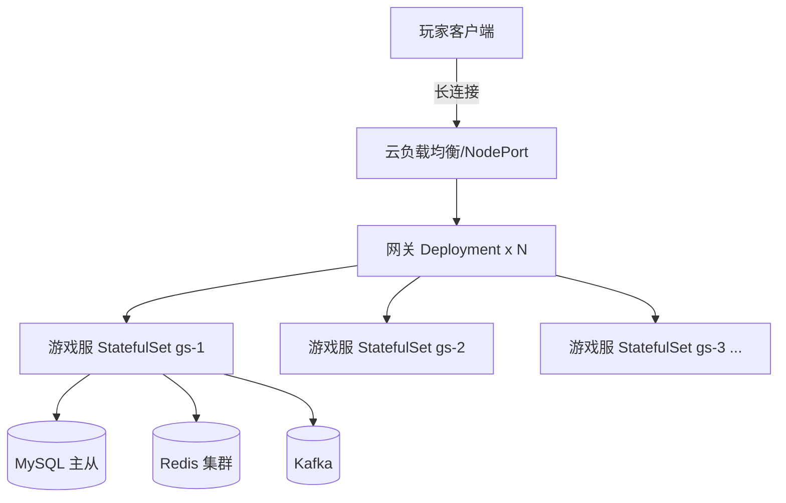
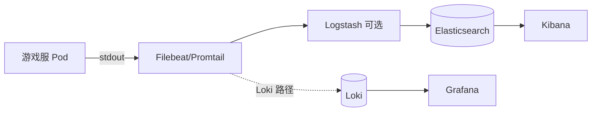
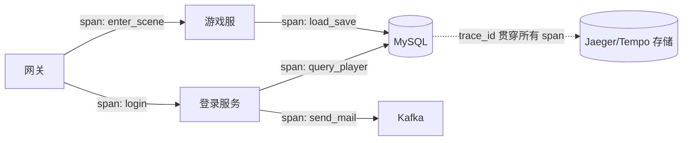
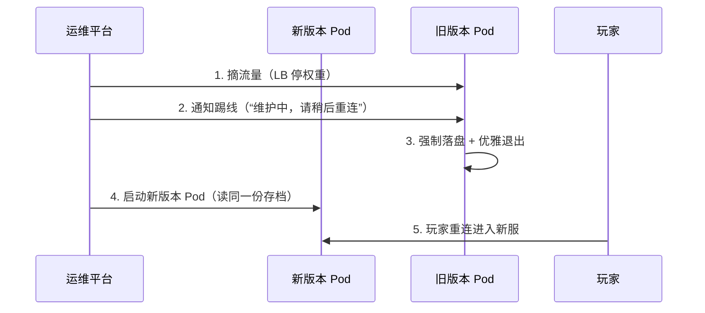

# 05 部署运维与监控

> 代码写得好，更要"跑得稳、看得清、扩得动"。本文覆盖游戏服务端的容器化部署（Docker/K8s）、CI/CD、日志采集（ELK/Loki）、监控告警（指标/链路追踪）、配置中心、不停服热更新与压测容量规划。

## 1. 概述

游戏运维与普通互联网服务有显著差异：

1. **有状态**：玩家连接与场景数据绑定在某台服上，不能随意漂移；
2. **长连接**：TCP/WebSocket 长连接为主，LB 需要会话保持；
3. **版本强耦合**：客户端与服务端协议版本必须配套，灰度与回滚要联动；
4. **业务节奏特殊**：开服、合服、活动、版本更新是运维的高频操作；
5. **不停服诉求**：玩家在线时长敏感，热更新、热更配置是常态能力。

因此游戏运维的目标是：**容器化标准化 + 自动化发布 + 全链路可观测 + 容量可规划**。

## 2. 核心概念

| 概念 | 英文 | 说明 |
| --- | --- | --- |
| 容器化 | Containerization | 用容器打包应用与依赖，实现环境一致性 |
| 镜像分层 | Image Layer | Docker 镜像由只读层组成，复用缓存、加速构建 |
| 容器编排 | Container Orchestration | 自动化部署、伸缩、管理容器（Kubernetes） |
| Pod | Pod | K8s 最小调度单元，一个或多个容器共享网络与存储 |
| StatefulSet | StatefulSet | 有状态应用的 K8s 工作负载（稳定网络标识/存储） |
| 持续集成/持续部署 | CI/CD | 提交代码后自动构建、测试、发布 |
| 灰度发布 | Canary Release | 先小流量验证再全量，失败可快速回滚 |
| 日志采集 | Log Collection | 集中收集、清洗、检索各服务日志 |
| 结构化日志 | Structured Logging | 以 JSON 等结构输出日志，便于机器解析 |
| 指标 | Metrics | 可聚合的数值型监控数据（QPS、RT、CPU） |
| 链路追踪 | Distributed Tracing | 追踪一次请求跨服务的完整调用链 |
| 配置中心 | Config Center | 集中管理配置并支持动态下发 |
| 热更新 | Hot Update | 不重启进程更新配置/代码 |
| 压测 | Load Testing | 用模拟流量验证系统容量与稳定性 |
| 容量规划 | Capacity Planning | 根据业务模型预估资源规模 |

## 3. 原理详解

### 3.1 Docker 化

Docker 解决的核心问题：**环境一致性**——"在我机器上能跑"变成"在任何机器上都能跑"。

镜像分层：Dockerfile 每条指令生成一层（Layer），构建时命中缓存层则跳过；多阶段构建（Multi-Stage Build）把"编译环境"与"运行环境"分离，大幅缩小镜像体积。

游戏服容器化的注意点：

- **状态外置**：容器是"牲畜"不是"宠物"，存档/日志必须写外部存储（MySQL/Redis/对象存储），容器可随时销毁重建；
- **时区与时钟**：容器内 UTC 时区要显式设置（Asia/Shanghai），游戏活动时间计算依赖服务器时间；
- **网络**：长连接端口固定暴露（NodePort/LoadBalancer），不要依赖容器 IP（会变）；
- **日志**：输出到 stdout/stderr（由采集器收集），不要写容器内文件（容器销毁即丢）；
- **优雅停机**：进程捕获 SIGTERM 先踢玩家/落盘再退出（见 3.7）。

> 生产数据库不宜“一刀切”规定必须或禁止容器化：优先使用托管数据库或具备专用运维能力的部署；若容器化生产库，必须明确持久化存储、备份恢复、升级/回滚、故障转移与定期故障演练。

### 3.2 K8s 编排

核心对象：

| 对象 | 作用 | 游戏场景 |
| --- | --- | --- |
| Pod | 最小调度单元 | 一个游戏服进程一个 Pod |
| Deployment | 无状态应用滚动管理 | 网关、登录、匹配等无状态服务 |
| StatefulSet | 有状态应用：稳定标识 + 顺序启停 | 游戏服（按 server_id 命名：gs-1、gs-2） |
| Service | 稳定访问入口（ClusterIP/NodePort/LB） | 对内 RPC、对外长连接入口 |
| Ingress | L7 入口路由 | HTTP/WebSocket 网关 |
| HPA | 按指标自动扩缩 | 可作用于实现 scale 子资源的工作负载（包括 Deployment/StatefulSet）；游戏服是否适用取决于会话、排空、分片和指标 |
| ConfigMap/Secret | 配置与密钥 | 环境配置、DB 口令 |



**为什么游戏服用 StatefulSet 而不用 Deployment**：

- 玩家路由依赖稳定标识（`gs-1.game.svc`），Pod 重建后名字不变；
- 开服/合服是运维操作，顺序启停可控；
- HPA 并非不能用于游戏服：Kubernetes HPA 可针对实现 scale 子资源的工作负载（包括 StatefulSet）按指标调整副本；但玩家会话不会自动迁移，排空、会话转移/重连、分片/服编号、容量指标和注册流程决定是否适用。对本文这类"玩家绑定单服"的场景，通常先把 HPA 用在无状态网关/登录；游戏服需先实现这些业务能力，再评估 HPA 或按服编排。

### 3.3 CI/CD 流水线


关键实践：

- **版本化**：镜像 tag 用 commit SHA（`game-server:abc1234`），可追溯可回滚；
- **灰度**：先 1 台/5% 流量，观察错误率与延迟再放量；游戏灰度按"服"（先更 1 个测试服再全区）；
- **回滚**：回滚 = 重新部署上一个镜像 + 数据库向后兼容（**SQL 迁移必须兼容新旧代码**，只加列不加删改）；客户端与服务端协议不兼容时必须强更（强制更新）而非平滑灰度；
- **配置与代码分离**：配置走配置中心（3.6），不随镜像发布，紧急调整不触发发布流程。

### 3.4 日志采集（ELK / Loki）

两条主流技术栈：

| 维度 | ELK | Loki |
| --- | --- | --- |
| 组件 | Filebeat → Logstash → Elasticsearch → Kibana | Promtail → Loki → Grafana |
| 索引方式 | 全文倒排索引，检索能力强 | 仅索引标签，按内容流式扫描 |
| 成本 | 存储/内存开销大 | 存储成本低（与 Prometheus 同源） |
| 适合 | 复杂检索、聚合分析、审计 | 轻量排障、与指标联动 |



结构化日志示例（见 4.6）：JSON 输出 + 统一字段（ts/level/player_id/server_id/trace_id/msg），使日志可被字段级检索与聚合。

日志治理：

- **分级采样**：ERROR 全量；INFO 按需采样（如 10%）；DEBUG 仅测试环境；
- **审计日志独立通道**：充值、风控、实名等合规日志单独 topic/索引，保留期按法规（≥1 年）；
- **战斗回放**：对局关键帧日志单独存储（体积大），用于争议仲裁与反作弊取证；
- **保留策略**：热日志 7 天、温日志 30 天、审计 1 年以上，分级存储（本地盘/SSD/对象存储）。

### 3.5 监控告警（指标 / 链路追踪）

#### 3.5.1 指标（Metrics）

Prometheus 四类指标：

| 类型 | 语义 | 游戏示例 |
| --- | --- | --- |
| Counter（计数器） | 只增不减 | 请求总数、登录次数、错误数 |
| Gauge（仪表） | 可增可减的当前值 | 在线人数、落盘队列长度、CPU |
| Histogram（直方图） | 值分布统计 | 请求耗时分布（P50/P95/P99） |
| Summary（摘要） | 客户端聚合的分位数 | 同 Histogram，适合无法预知区间的场景 |

方法论：

- **USE（资源视角）**：利用率（Utilization）、饱和度（Saturation）、错误（Errors）——CPU 利用率、线程池队列、网络丢包；
- **RED（服务视角）**：速率（Rate）、错误（Errors）、耗时（Duration）——QPS、错误率、P99 延迟。

游戏关键指标清单：

- 在线人数（CCU）按服/全区 Gauge；
- 网关 QPS、登录成功率、登录耗时 P99；
- 落盘积压队列长度、慢查询数、主从延迟（见 01 篇）；
- 缓存命中率、Redis 内存、大 Key/热 Key 计数（见 02 篇）；
- MQ 积压（lag）、消费失败重试数（见 03 篇）；
- 风控拦截率、外挂举报量（见 04 篇）。

告警分级与治理：

- **P0**：全服不可用、数据丢失风险——立即电话/IM 通知 + 自动恢复动作；
- **P1**：功能受损（登录成功率下降）——15 分钟内响应；
- **P2**：性能劣化（P99 上涨）——当日处理；
- **P3**：容量/资源预警——排期处理。

告警疲劳治理：阈值 + 持续时间 + 聚合（相同告警合并），每季度复盘"无效告警率"。

#### 3.5.2 链路追踪（Tracing）

OpenTelemetry（OTel）是厂商中立的可观测性框架：Trace（一次请求的完整链路）→ Span（链路中的一段调用）→ 上下文传播（trace_id/span_id 透传）。概念与信号入口见 [OpenTelemetry Concepts](https://opentelemetry.io/docs/concepts/)。



游戏场景：定位"登录慢"是网关、登录服务、DB 还是 Redis；跨服战全链路耗时分析。SDK 注入点：RPC 客户端/服务端中间件、DB 驱动、消息生产消费。

### 3.6 配置中心（Config Center）

为什么需要：环境差异（测试/生产）、动态调参（活动开关、掉落概率）、灰度配置（按服/按玩家分段）。

主流方案：

| 方案 | 模型 | 特点 |
| --- | --- | --- |
| Apollo | 配置项 + 命名空间 + 灰度发布 | 成熟、发布审计、适合业务配置 |
| Nacos | 配置 + 注册中心一体 | 与微服务体系集成好 |
| etcd | KV + Watch | 简单可靠，适合程序级配置 |

热更新机制：客户端长轮询/订阅（Watch）配置变更 → 本地缓存更新 → 回调通知业务模块刷新。

游戏场景：活动开关（春节活动 0 点生效）、掉落概率表调整、维护公告、分线/开服列表、风控阈值（见 04 篇 4.6）。

### 3.7 不停服热更新

三类热更：

1. **配置热更**：配置中心下发即生效（数值、开关、文案），成本最低、最常用；
2. **脚本热更**（Lua/代码热更框架）：替换 Lua 表/函数，注意"热更帧"安全点（战斗结算中等状态机稳定点再替换）、版本兼容与回滚；
3. **进程滚动更新**：C++/Go 等编译型服务不能原地热更 → 采用"滚动发布（Rolling Update）+ 优雅停机"：



注意：滚动更新期间同服玩家短暂掉线，需公告与补偿；全服更新（版本不兼容）则走停机维护流程：维护公告 → 踢线 → 数据备份 → 更新 → 冒烟 → 开服。

### 3.8 压测与容量规划

压测工具选型：

| 工具 | 特点 | 适用 |
| --- | --- | --- |
| wrk / ghz | 高并发 HTTP/gRPC 压测，单机可达十万级 QPS | 接口级压测 |
| Locust | Python 脚本化、分布式施压 | 场景化压测 |
| 自研协议压测 | 直连游戏协议（TCP/WS）模拟玩家 | 游戏业务压测（登录、战斗、交易） |

压测流程：基线压测（单机容量）→ 阶梯加压（找拐点）→ 峰值验证（目标流量 + 20% 冗余）→ 稳定性压测（持续 30min~2h，观察内存泄漏/连接泄漏）→ 压测报告（容量结论 + 瓶颈清单）。

关键指标与容量公式：

```text
单实例容量 QPS = 压测拐点 QPS × 0.7（安全系数）
实例数 = 峰值 QPS ÷ 单实例容量 × 冗余系数（如 1.5，支持 1 台故障）
游戏带宽：单服带宽(Mbps) ≈ CCU × 每玩家上行+下行 Kbps ÷ 1000
内存/CPU 按"峰值 CCU × 单玩家内存"估算（如 1KB~10KB/玩家）
```

游戏容量模型：

- **CCU（Concurrent Concurrent Users，同时在线人数）**：游戏容量第一指标；
- 单服承载（如 3000 CCU）→ 服务器数量 = 预期峰值 CCU ÷ 单服承载；
- 压测必须包含"最坏场景"：全服玩家同时进入活动地图、排行榜刷新峰值、登录风暴（开服瞬间）。

## 4. 代码与配置示例

### 4.1 Dockerfile 多阶段构建（Go 游戏服）

```dockerfile
# 阶段1：编译
FROM golang:1.22 AS builder
WORKDIR /src
COPY go.mod go.sum ./
RUN go mod download
COPY . .
RUN CGO_ENABLED=0 go build -ldflags="-s -w" -o /out/game-server ./cmd/server

# 阶段2：运行镜像（仅含二进制与配置）
FROM alpine:3.20
RUN apk add --no-cache tzdata
ENV TZ=Asia/Shanghai
COPY --from=builder /out/game-server /app/game-server
COPY configs/ /app/configs/
EXPOSE 9000
ENTRYPOINT ["/app/game-server"]
```

### 4.2 docker-compose 本地环境（节选）

```yaml
services:
  mysql:
    image: mysql:8.0
    environment:
      MYSQL_ROOT_PASSWORD: root
      TZ: Asia/Shanghai
    volumes: ["./docker/mysql:/docker-entrypoint-initdb.d"]
    ports: ["3306:3306"]
  redis:
    image: redis:7.2
    ports: ["6379:6379"]
  kafka:
    image: bitnami/kafka:4.0   # 示例固定版本，生产部署以最新稳定版为准
    ports: ["9092:9092"]
  game-server:
    build: .
    depends_on: [mysql, redis, kafka]
    environment:
      DB_DSN: "root:root@tcp(mysql:3306)/game?charset=utf8mb4"
    ports: ["9000:9000"]
```

### 4.3 K8s StatefulSet（游戏服，YAML 节选）

```yaml
apiVersion: apps/v1
kind: StatefulSet
metadata:
  name: game-server
spec:
  serviceName: game-server
  replicas: 3
  selector:
    matchLabels: { app: game-server }
  template:
    metadata:
      labels: { app: game-server }
    spec:
      terminationGracePeriodSeconds: 30   # 优雅停机：踢线+落盘
      containers:
        - name: server
          image: registry.internal/game-server:abc1234
          ports: [{ containerPort: 9000, name: game }]
          env:
            - name: SERVER_ID
              valueFrom:
                fieldRef: { fieldPath: metadata.name }  # gs-0/gs-1/gs-2
          readinessProbe:
            tcpSocket: { port: 9000 }
            initialDelaySeconds: 10
          resources:
            requests: { cpu: "4", memory: 8Gi }
            limits: { cpu: "8", memory: 16Gi }
```

### 4.4 CI/CD 流水线（GitLab CI，节选）

```yaml
stages: [test, build, deploy]

test:
  stage: test
  script: [go test ./... -race -cover]

build:
  stage: build
  script:
    - docker build -t registry.internal/game-server:$CI_COMMIT_SHA .
    - docker push registry.internal/game-server:$CI_COMMIT_SHA

deploy-canary:
  stage: deploy
  script:
    - kubectl set image statefulset/game-server server=registry.internal/game-server:$CI_COMMIT_SHA --record
    - kubectl rollout status statefulset/game-server --timeout=180s
  environment: { name: production }
  when: manual   # 人工确认后灰度
```

### 4.5 Prometheus 告警规则（YAML）

```yaml
groups:
  - name: game-alerts
    rules:
      - alert: OnlinePlayerDrop
        expr: sum(game_online_players) < 100
        for: 5m
        labels: { severity: P0 }
        annotations: { summary: "在线人数骤降，疑似大面积故障" }
      - alert: SaveQueueBacklog
        expr: game_save_queue_len > 100000
        for: 2m
        labels: { severity: P1 }
        annotations: { summary: "存档落盘积压过高" }
      - alert: MySQLReplicationLag
        expr: mysql_slave_seconds_behind_master > 30
        for: 3m
        labels: { severity: P1 }
        annotations: { summary: "主从延迟超过 30 秒" }
```

### 4.6 结构化日志与采集（JSON + Promtail 节选）

```json
{"ts":"2026-08-04T12:00:01.123+08:00","level":"info","logger":"trade",
 "player_id":10001,"server_id":3,"trace_id":"abc123","event":"buy_item",
 "item_id":101,"count":5,"cost":150,"result":"ok"}
```

```yaml
# promtail.yaml
scrape_configs:
  - job_name: game-server
    kubernetes_sd_configs:
      - role: pod
    pipeline_stages:
      - json: { expressions: { level: level, player_id: player_id } }
      - labels: { level: level }
```

### 4.7 压测脚本（wrk / Locust 节选）

```bash
# wrk：登录接口 20 并发 30 秒
wrk -t 8 -c 200 -d 30s -s login.lua http://gateway/login
```

```python
# Locust：模拟玩家登录→进场景→退出
class PlayerUser(HttpUser):
    @task
    def play_flow(self):
        token = self.client.post("/login", json={"uid": self.uid()}).json()["token"]
        self.client.post("/enter_scene", headers={"X-Token": token})
        self.client.post("/battle_finish", headers={"X-Token": token})
```

## 5. 最佳实践

1. **容器化**：多阶段构建瘦镜像；状态全部外置；优雅停机（SIGTERM → 落盘 → 退出）；
2. **编排**：无状态服务 Deployment + HPA；游戏服根据会话、排空、分片与指标能力选择 StatefulSet + HPA 或按服编排；数据库/缓存优先使用托管服务或专用运维体系，若容器化生产库，必须明确持久化存储、备份恢复、升级/回滚、故障转移与定期故障演练；
3. **发布**：镜像 tag = commit SHA；小步灰度、自动回滚；SQL 变更向后兼容；
4. **日志**：结构化 JSON + 统一字段；分级采样；审计日志独立保留；
5. **监控**：指标（USE/RED）+ 告警分级（P0~P3）+ 链路追踪（OTel）三件套齐备；告警要复盘降噪；
6. **配置**：全部进配置中心，支持按服/按玩家灰度；配置变更可审计可回滚；
7. **热更**：优先配置热更；脚本热更设安全点；编译型服务滚动发布 + 公告补偿；
8. **容量**：容量模型按 CCU 推导；压测常态化（每次大版本上线前）；压测环境与生产隔离。

## 6. 常见问题 FAQ

**Q1：游戏服是长连接有状态服务，K8s 适合吗？**
A：适合，但要用对姿势：StatefulSet 保稳定标识、存档外置、LB 会话保持（按玩家哈希）、滚动更新时先摘流量再踢线。K8s 解决的是"标准化与自动化"，不是"有状态难题"——后者靠架构（状态外置）解决。

**Q2：HPA 能用于游戏服吗？**
A：可以，但不是“Pod 数变了玩家就一定连不上”这么绝对。Kubernetes HPA 能扩缩实现 scale 子资源的 StatefulSet；它不会替业务迁移玩家。若游戏服支持排空、会话转移/重连、分片/服编号、注册摘流量以及自定义容量指标，可评估 HPA；否则更稳妥的是无状态网关/登录使用 HPA，游戏服按“新开 gs-4”等服级编排扩容。

**Q3：ELK 和 Loki 怎么选？**
A：预算充足、需要复杂全文检索与聚合（安全审计、风控取证）选 ELK；轻量排障、与 Prometheus/Grafana 一体化、控制成本选 Loki。游戏建议：业务日志 Loki + 审计日志独立 ES。

**Q4：线上问题定位为什么要有 trace_id？**
A：没有 trace_id 时，一条玩家报错要翻网关、登录、游戏服、DB 多套日志手工关联；有 trace_id（登录时生成、贯穿所有调用与日志）可一键检索全链路，配合链路追踪系统看各环节耗时。

**Q5：不停服热更 Lua 有什么坑？**
A：①热更时机：战斗结算、副本进行中等状态机执行中替换逻辑会产生不一致——只允许在安全点（无玩家战斗的间隙/整点）热更；②热更后 Lua 表被旧引用持有导致内存泄漏；③热更不可回滚（旧的被覆盖）——保留版本快照与灰度开关。核心结论：热更只放"低风险逻辑"，结构性改动走滚动发布。

**Q6：压测发现单服 3000 CCU 就顶不住了，怎么扩容？**
A：先找瓶颈：CPU（逻辑重算）、内存（玩家数据缓存）、带宽（同步消息量）、DB/Redis（落盘与查询）。针对性优化后仍不足，再降单服承载、加服（分区）——分服是游戏水平扩展的主手段，压测结论直接决定单服承载与服务器采购数量。

**Q7：发布回滚时数据库结构已经变了怎么办？**
A：原则是"数据库变更向前兼容"：只新增（加列/加表）不修改删除，新旧代码都能跑；回滚时旧代码忽略新字段。若必须破坏性变更（删列），先发代码（不再使用该列）→ 观察 → 下个版本再删列。

**Q8：开服瞬间登录风暴怎么扛？**
A：预扩容（压测结论 × 1.5）+ 登录限流排队（登录队列 + "排队中"提示）+ 网关分级（老玩家优先）+ 缓存预热（活动配置、常用存档预加载）。压测必须包含"开服瞬间"场景。

## 7. 关联阅读

- 上一篇：[04-安全与反作弊](04-安全与反作弊.md)——审计日志与风控处置的留存要求决定日志架构；
- 数据库备份演练、慢查询监控：见 [01-数据库选型与存储设计](01-数据库选型与存储设计.md)；
- 缓存命中率/内存监控：见 [02-缓存与排行榜系统](02-缓存与排行榜系统.md)；
- MQ 积压监控、服务发现与容灾多活：见 [03-分布式与高可用](03-分布式与高可用.md)；
- 上游基础：`../01-架构与网络/` 中的服务器架构模式与消息系统决定了部署拓扑与压测模型。
- 官方概念：[Kubernetes Horizontal Pod Autoscaling](https://kubernetes.io/docs/concepts/workloads/autoscaling/horizontal-pod-autoscale/)；[Kubernetes StatefulSet](https://kubernetes.io/docs/concepts/workloads/controllers/statefulset/)；[OpenTelemetry Concepts](https://opentelemetry.io/docs/concepts/)。
