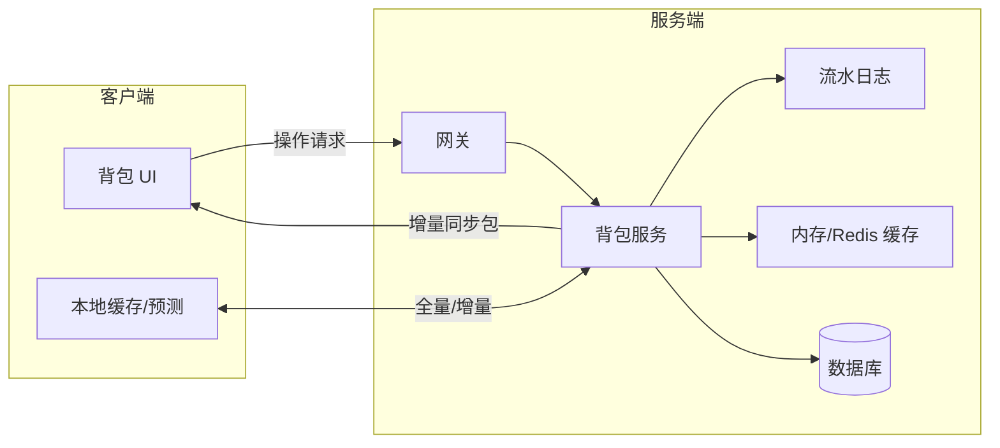
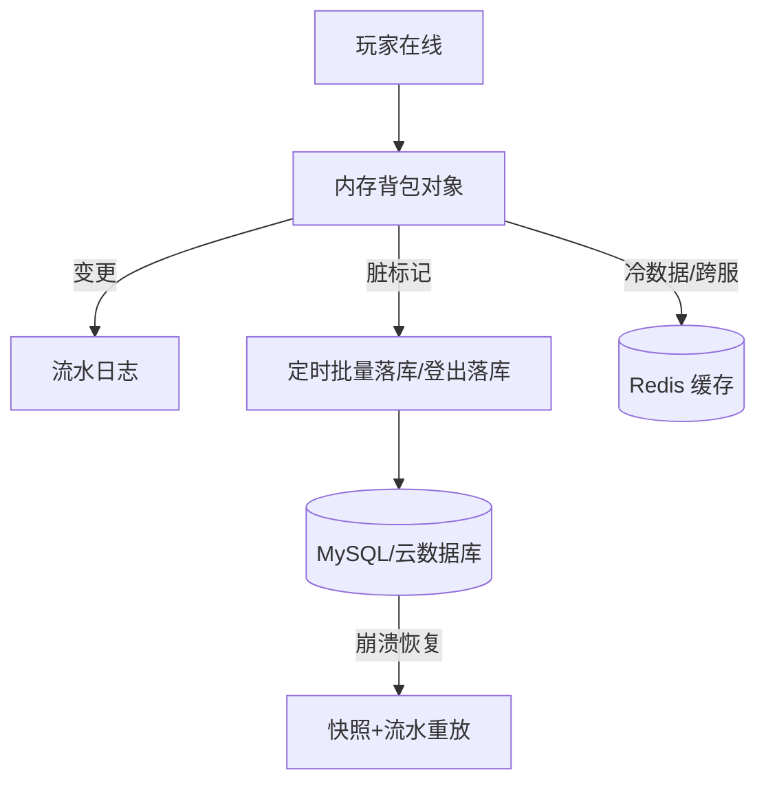
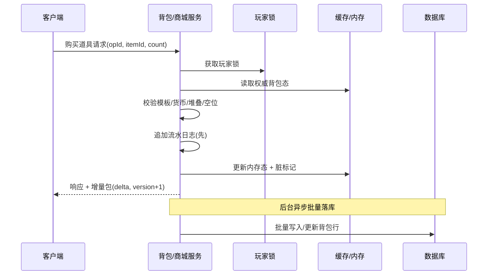
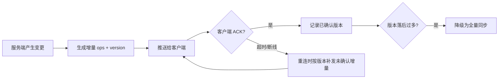

# 01-背包与道具系统

> 知识基线：实时游戏服务端通用架构；示例中的语言、数据库、缓存、容器和云平台版本必须以项目部署清单为准。
> 适用范围：覆盖玩家资产在游戏服与数据服务之间的获得、消耗、交易、同步和恢复；关联商城、任务、邮件，不覆盖支付渠道本身。
> 事实边界：协议规范、组件行为和示例方案分开；容量数字只作示意/经验值，必须通过压测验证。
> 最后更新：2026-08-06（补齐规范来源、版本边界与工程验收入口）。
> 版本边界：以 2026-08-06 为核对日，不新增不确定的当前组件版本号；数据库、Redis、协议库和容器版本由项目部署清单锁定。
> 参考来源：[PostgreSQL 官方文档](https://www.postgresql.org/docs/)、[Redis 官方文档](https://redis.io/docs/latest/)、[Protocol Buffers 官方文档](https://protobuf.dev/)、[OpenTelemetry 官方文档](https://opentelemetry.io/docs/)。

### P0 资产正确性与工程验收

| 验收项 | 设计基线 | 证据入口 |
| --- | --- | --- |
| 业务流水 | 每次获得、消耗、转移都记录 playerId、opId、原因、前后数量、配置/协议版本 | 流水连续性、资产总量对账、异常补偿可追溯 |
| 幂等 | 以 opId/业务键唯一约束和重试安全为基线；锁只是并发手段，不是幂等证明 | 重复、乱序、超时重试、进程崩溃后重放不重复扣发 |
| 审计 | 记录操作者、来源、目标、规则版本、traceId 关联和处置结果；Trace 不替代持久审计 | 客诉可按流水定位，审计记录可导出并脱敏 |
| 服务端权威验证 | 客户端只提交意图，服务端重取模板/数量/绑定关系并原子校验 | 改包、改数量、并发最后一件、断线重连均以服务端结果为准 |
| 版本兼容 | 同步 schema 只增不复用字段号，旧客户端可忽略新增字段，实例保存配置版本 | 新旧客户端混跑、回滚、迁移和快照恢复均可验证 |

> 结论边界：一致性、缓存、锁粒度和流水保留期都是按资产价值、延迟和恢复目标做的方案取舍；最终以部署清单、压测、故障注入和对账报告为准。

> 背包（Inventory / Bag）是几乎所有游戏都具备的基础资产系统：玩家获得、使用、交易、穿戴、分解道具，全部经由背包。背包系统的设计质量直接影响玩家体验（道具丢失、重复发放是最高等级的事故），也决定了商城发货、任务奖励、邮件附件等后续系统的实现复杂度。

## 一、概述

背包系统本质上要解决三个问题：

1. **怎么存**：玩家拥有哪些道具、每种多少、放在哪个位置、是否有私有状态（数据模型）；
2. **怎么改**：道具的增删改如何在并发请求、服务崩溃、重复提交下保持正确（事务、锁与幂等）；
3. **怎么同步**：服务端权威数据如何及时、省流量地反映到客户端，并在断线重连后保持一致（同步策略）。

背包的核心设计原则是**服务端权威（Server Authority）**：所有道具的增减必须以服务端判定为准，客户端只负责展示与发起请求。任何"客户端本地加一个道具再上报"的做法都等于给外挂留后门。

一个典型背包系统的模块划分：



## 二、核心概念

| 概念 | 英文 | 说明 | 关键点 |
| --- | --- | --- | --- |
| 背包 | Inventory / Bag | 玩家道具的容器，按槽位组织 | 容量上限、扩展（扩容卡） |
| 槽位 | Slot | 背包中一个可放置道具的位置 | 固定槽 / 动态槽 / 网格背包 |
| 堆叠 | Stack | 同种可堆叠道具的数量聚合 | 堆叠上限 maxStack，拆分/合并 |
| 道具模板 | Item Template | 静态配置：ID、名称、类型、堆叠上限、价格 | 只读、热更新、跨版本兼容 |
| 道具实例 | Item Instance | 带唯一 ID 的动态道具（有耐久/强化/词条等私有状态） | 与模板分离存储 |
| 唯一 ID | Unique ID / UID | 道具实例的全局唯一标识 | 雪花/发号器/DB 自增 |
| 全量同步 | Full Sync | 登录/重连时下发整个背包 | 包体大，需压缩与节流 |
| 增量同步 | Delta Sync | 变更集（add/update/remove + 版本号） | 日常主通道 |
| 事务 | Transaction | 一组原子操作，要么全成要么全败 | 扣减与校验同事务 |
| 幂等 | Idempotency | 同一请求重复执行结果一致 | 操作号 opId 去重 |
| 流水日志 | Ledger / Operation Log | 每次变更的审计记录 | 先写日志后改数据，可重放恢复 |
| 脏标记 | Dirty Flag | 内存数据被修改、待落库的标记 | 批量落库的依据 |
| 服务端权威 | Server Authority | 所有资产变更以服务端为准 | 反作弊的根基 |

## 三、原理详解

### 3.1 静态模板与动态实例：两层数据模型

道具数据必须拆成两层：

- **模板层（Template / Static）**：一行配置描述"这类道具长什么样"。例如道具 1001 是"初级生命药剂"，堆叠上限 99，出售价 5 金币。模板数据全服共享、只读，可以放在服务端内存或配置中心，支持热更新。
- **实例层（Instance / Dynamic）**：一行玩家数据描述"这个道具属于谁、有多少、有什么私有状态"。只有需要携带私有状态的才建实例。

为什么必须分离：

1. **省存储**：99 瓶药剂不需要 99 行，一行 `count=99` 即可；千万玩家的公共属性不重复存储；
2. **省流量**：同步包只需传 `itemId + count`，模板信息客户端本地查表；
3. **支持热更**：修改模板不影响已有实例数据；
4. **日志友好**：流水日志记录模板 ID 即可追溯"是什么道具"，配合实例 UID 追溯"哪一件"。

哪些道具需要实例（带 UID）？通常是有"个体差异"或"可追踪需求"的道具：装备（耐久、强化等级、词条）、宠物、限时道具（过期时间）、需要精确溯源的道具（活动发放的限定皮肤）。纯消耗品、材料一般只需要模板 ID + 数量。

### 3.2 背包存储模型：槽位、堆叠与网格

**固定槽位（Fixed Slots）**：背包开 N 个槽，一行一个槽，槽索引稳定。优点：实现简单、定位快、扩容直观；缺点：槽位迁移（整理背包）成本高。

**动态槽位（Dynamic Slots）**：槽位不固定，按"道具条目"存储，`slot_index` 由服务端分配或干脆用自增主键。优点：整理背包只是改索引、无需移动数据；缺点：需要维护"下一个空位"。

**网格背包（Grid Backpack）**：每个道具占 1×1、2×2 等网格（如《暗黑破坏神》《逃离塔科夫》），需要二维空间放置算法。服务端通常只校验"放置位置合法性"（格子是否重叠、是否越界、道具尺寸），寻路与拖拽体验在客户端做，但最终落库以服务端校验为准。

**堆叠（Stack）**：同类可堆叠道具聚合为一条记录，`count <= maxStack`。设计要点：

- 获得道具时优先叠加到"未满堆"，堆满再开新条目；
- 拆分（Split）：一条拆成两条，需原子操作；
- 合并（Merge）：客户端整理时可能请求合并，服务端校验同模板、同绑定状态、无实例属性；
- 堆叠溢出保护：单次获得超过堆叠上限时自动拆多条，超出背包容量时走"溢出处理"（见 FAQ）。

### 3.3 唯一 ID 设计

道具实例唯一 ID（UID）用于：邮件附件定位、交易记录、精确回滚、日志溯源、跨服迁移。常见方案：

| 方案 | 原理 | 优点 | 缺点 |
| --- | --- | --- | --- |
| 数据库自增 | 依赖 DB 序列 | 简单、有序 | 分库分表后冲突，需要号段 |
| 雪花算法（Snowflake） | 时间戳+机器号+自增序列 | 高性能、趋势递增、无中心 | 时钟回拨需处理 |
| 中心发号器 | Redis INCR / 号段模式 | 全局唯一、可控 | 单点，需高可用 |
| UUID | 随机 128 位 | 无需中心 | 无序、索引性能差、长度大 |

游戏服务端实践中，**号段式发号器（Segment）** 或 **雪花算法** 最为常见：服务实例启动时向 DB/Redis 领取一段区间，内存中自增，用完再领，兼顾性能与全局唯一。注意：道具 UID 只在需要实例时分配，纯堆叠材料不需要 UID，避免发号器压力。

### 3.4 道具增删改：事务、锁与幂等

**原子条件扣减（Atomic Conditional Deduction）**：背包操作最常见的坑是"检查-扣减"两步之间被并发请求插队，导致超扣。解决方法是让"条件检查"与"变更"处于同一临界区（同一把锁或同一事务）：

```go
// 错误示范：检查与扣减分离
if bag.CountOf(itemID) >= n {       // ① 检查
    bag.Consume(itemID, n)          // ② 扣减 —— ①与②之间可能已被其他请求扣光
}
```

**锁的粒度**：推荐"每玩家一把锁"（进程内 `sync.Mutex` 数组或 Redis 分布式锁），避免全局锁把所有玩家的背包操作串行化。跨进程时使用 Redis 锁（SETNX + 过期时间 + 续期），并注意锁的 key 设计（`lock:bag:{playerId}`）。

**事务边界**：

- 只涉及背包内部的多个操作（如拆分+合并+移动）：一个事务内完成；
- 跨系统操作（商城扣款 → 背包发货）：不能指望单库事务。推荐"**流水先行 + 最终一致**"：先写一条"待发货"流水，发货成功后再标记完成；发货失败由补偿任务重试。或者用可靠消息（本地消息表 / 事务消息）驱动。

**幂等（Idempotency）**：客户端超时重试、消息重投、回调重复是常态。所有"会产生资产变化"的接口必须支持幂等：

- 客户端每次操作带 `opId`（操作号），服务端以 `(playerId, opId)` 建唯一索引；
- 已处理过的 opId 直接返回上次结果，不再执行；
- opId 过期清理（如保留 7 天），避免表无限膨胀。

**流水日志（Ledger）先行**：每次变更先追加流水（`playerId, opId, 时间, 操作类型, itemId, itemUid, 数量, 变化前/后值, 来源模块, reason`），再更新内存态。崩溃后可从"最近快照 + 流水重放"恢复，也可用于客服查证"道具去哪了"。

### 3.5 同步策略：全量同步与增量同步

**全量同步（Full Sync）**：登录、重连、版本不一致时，下发整个背包。要点：

- 只下发客户端需要展示的字段（模板信息客户端查表）；
- 大背包分片下发（如每包 50 槽）并带总版本号，防止中间丢包造成永久不一致；
- 压缩（gzip/MessagePack）与批量。

**增量同步（Delta Sync）**：日常主通道。每次变更生成变更集：

```json
{
  "cmd": "inventory.delta",
  "version": 1025,
  "ops": [
    {"op": "add",    "slot": 3,  "itemId": 1002, "count": 5},
    {"op": "update", "slot": 0,  "count": 94},
    {"op": "remove", "slot": 2}
  ]
}
```

增量包的可靠性机制：

- **版本号（version）**：每次变更自增；客户端保存已收到的版本；
- **ACK**：客户端收到增量包后回 ACK，服务端记录"已确认版本"；未 ACK 的增量在重连时补发；
- **兜底**：若客户端版本落后太多（如离线超过 N 天），直接全量同步。

**客户端表现层**：展示类更新允许客户端本地插值/预测（如拾取动画先播放、数值后校正），但**任何校验性判定必须等服务端回包**。禁止客户端本地"预扣"后直接使用道具（使用结果必须服务端验证）。

### 3.6 背包与数据库、缓存的配合

典型的存储架构：



设计要点：

1. **在线态以内存/缓存为准**：玩家在线期间背包读写都在内存（或 Redis），避免每次操作打数据库；
2. **落库时机**：脏标记 + 定时批量（如 5 秒一批）、登出强制落库、每日定时快照；
3. **崩溃恢复**：DB 最新快照 + 流水重放，保证"已确认给玩家的操作"不丢失——这是"先流水后内存"的核心价值；
4. **Redis 的定位**：分布式锁、跨服迁移时的中转、排行榜/交易行的只读副本；不要用 Redis 做背包的唯一权威存储（易丢数据），它是"加速层"不是"事实层"；
5. **读写分离**：查询类（如查看他人背包/装备展示）走只读副本，变更类必须走权威路径。

### 3.7 海量物品的性能与容量

海量物品的典型场景：长期运营游戏，玩家背包数百槽位、邮件附件堆积、材料种类上千、单服在线数十万。优化手段：

1. **堆叠与聚合**：可堆叠道具绝不拆条；纯材料按 `(playerId, itemId)` 聚合为单行；
2. **分页与懒加载**：背包数据按页加载（如 50 条/页），服务端只处理被请求的页；
3. **归档（Archive）**：长期不动的道具（过期邮件附件、旧赛季材料）迁移到归档表/冷存储，热表保持小体积；
4. **索引设计**：主键 `(player_id, slot_index)` 天然按玩家聚集；按 `item_uid` 建唯一索引用于邮件附件定位；
5. **分库分表**：按 `player_id` 哈希分片，单玩家数据不跨片；跨片事务通过"单玩家单片"规避；
6. **上限保护**：背包槽位上上限、单种材料数量上限、邮件附件总上限——防止单玩家数据无限膨胀拖垮服务；
7. **压缩与协议优化**：同步包用二进制协议（protobuf/MessagePack），大背包分片。

## 四、设计示例

### 4.1 表结构（SQL）

```sql
-- 道具模板（静态配置，全服共享，可放配置中心）
CREATE TABLE item_template (
  item_id        INT PRIMARY KEY,
  name           VARCHAR(64)  NOT NULL,
  item_type      TINYINT      NOT NULL,  -- 1=消耗品 2=装备 3=材料 4=货币道具 5=礼包
  max_stack      INT          NOT NULL DEFAULT 1,  -- 堆叠上限，1=不可堆叠
  grid_width     TINYINT      NOT NULL DEFAULT 1,  -- 网格背包用
  grid_height    TINYINT      NOT NULL DEFAULT 1,
  sell_price     INT          NOT NULL DEFAULT 0,
  bind_on_obtain TINYINT      NOT NULL DEFAULT 0,  -- 获得即绑定
  expires_in_sec INT          NOT NULL DEFAULT 0,  -- 限时道具有效秒数，0=永久
  version        INT          NOT NULL DEFAULT 0   -- 配置版本，热更校验
);

-- 玩家背包（一行一个槽位/条目）
CREATE TABLE player_inventory (
  player_id    BIGINT      NOT NULL,
  slot_index   INT         NOT NULL,           -- 槽位索引
  item_id      INT         NOT NULL,           -- 模板 ID
  item_uid     BIGINT      NULL,               -- 实例 UID（可堆叠道具为 NULL）
  count        INT         NOT NULL DEFAULT 1,
  bind_type    TINYINT     NOT NULL DEFAULT 0, -- 0=未绑定 1=绑定
  durability   INT         NULL,               -- 实例私有属性示例
  attrs        JSON        NULL,               -- 其他实例属性（词条等）
  expires_at   DATETIME    NULL,               -- 过期时间
  version      INT         NOT NULL DEFAULT 0, -- 乐观锁版本号
  PRIMARY KEY (player_id, slot_index),
  UNIQUE KEY uk_uid (item_uid),
  KEY idx_player_item (player_id, item_id)     -- 材料聚合查询
) PARTITION BY HASH(player_id) PARTITIONS 64;

-- 背包流水日志（审计与恢复的关键）
CREATE TABLE inventory_ledger (
  id           BIGINT AUTO_INCREMENT PRIMARY KEY,
  player_id    BIGINT      NOT NULL,
  op_id        VARCHAR(64) NOT NULL,           -- 幂等键
  op_type      TINYINT     NOT NULL,           -- 1=获得 2=消耗 3=移动 4=拆分 5=合并 6=删除
  item_id      INT         NOT NULL,
  item_uid     BIGINT      NULL,
  count        INT         NOT NULL,
  before_count INT         NOT NULL,           -- 变化前数量（审计）
  after_count  INT         NOT NULL,           -- 变化后数量
  reason       VARCHAR(32) NOT NULL,           -- 来源模块: quest/shop/mail/drop...
  created_at   DATETIME    NOT NULL DEFAULT CURRENT_TIMESTAMP,
  UNIQUE KEY uk_op (player_id, op_id)
) PARTITION BY HASH(player_id) PARTITIONS 64;
```

### 4.2 全量同步数据（JSON）

```json
{
  "cmd": "inventory.full_sync",
  "version": 1024,
  "maxSlots": 120,
  "slots": [
    { "slot": 0, "itemId": 1001, "count": 99 },
    { "slot": 1, "itemId": 2001, "itemUid": 7123900001,
      "attrs": { "durability": 80, "level": 5 } }
  ]
}
```

### 4.3 核心伪代码（Go 风格）

```go
// 获得道具：堆叠优先、开槽兜底、流水先行、幂等
func (s *InventoryService) AddItem(playerID int64, itemID int32, count int32, opID, reason string) (int32, error) {
    // 1. 幂等：操作号已处理过则直接返回
    if done, r, err := s.idem.Get(playerID, opID); err == nil && done {
        return r, nil
    }
    // 2. 玩家级互斥（进程内锁或 Redis 分布式锁）
    lock := s.locks.Get(playerID)
    lock.Lock(); defer lock.Unlock()

    tmpl := s.templates.Get(itemID)
    if tmpl == nil { return 0, ErrItemNotFound }
    bag := s.cache.GetBag(playerID) // 权威内存态
    added := int32(0)

    // 3. 优先叠加到未满堆
    for _, it := range bag.Slots {
        if it == nil || it.ItemID != itemID || it.ItemUID != "" { continue }
        if it.Count >= tmpl.MaxStack { continue }
        n := int32(math.Min(float64(tmpl.MaxStack-it.Count), float64(count-added)))
        it.Count += n; added += n; bag.MarkDirty(it.Slot)
        if added == count { break }
    }
    // 4. 剩余开新槽
    for added < count {
        slot := bag.NextFreeSlot()
        if slot < 0 { break } // 背包满，走溢出处理
        n := int32(math.Min(float64(tmpl.MaxStack), float64(count-added)))
        bag.Slots[slot] = &Item{Slot: slot, ItemID: itemID, Count: n, BindType: tmpl.BindOnObtain}
        added += n; bag.MarkDirty(slot)
    }
    // 5. 流水先行（先于落库，保证可恢复）
    s.ledger.Append(playerID, &Ledger{OpID: opID, OpType: OpAdd, ItemID: itemID,
        Count: added, Before: 0, After: bag.CountOf(itemID), Reason: reason})
    s.idem.Set(playerID, opID, added)      // 幂等标记
    s.cache.ScheduleFlush(playerID, bag)   // 异步批量落库
    s.pushDelta(playerID, bag, "add")      // 增量同步
    return added, nil
}

// 消耗道具：条件检查与扣减必须在同一临界区
func (s *InventoryService) Consume(playerID int64, itemID int32, count int32, reason string) error {
    lock := s.locks.Get(playerID); lock.Lock(); defer lock.Unlock()
    bag := s.cache.GetBag(playerID)
    if bag.CountOf(itemID) < count { return ErrNotEnough }
    bag.Consume(itemID, count) // 从尾部堆叠开始扣
    s.ledger.Append(playerID, &Ledger{OpID: uuid(), OpType: OpConsume,
        ItemID: itemID, Count: -count, Reason: reason})
    s.cache.ScheduleFlush(playerID, bag)
    s.pushDelta(playerID, bag, "update")
    return nil
}
```

### 4.4 流程与时序图

**获得道具（以购买为例）的完整时序**：



**增量同步的可靠投递**：



## 五、最佳实践

1. **服务端权威**：所有判定在服务端，客户端只展示；对"客户端声称拥有某道具"的请求一律不信；
2. **先流水后数据**：任何资产变更先写流水日志，再更新内存/落库——这是崩溃恢复与客服查证的基础；
3. **玩家粒度加锁**：避免全局锁；跨进程用 Redis 锁并带过期时间与续期；
4. **入口全部幂等**：带 opId 的接口统一去重；消息队列消费端同样需要幂等；
5. **上限保护**：槽位、堆叠、单次变更数量、流水表大小都要有硬上限；
6. **增量为主、全量为辅**：日常增量同步，版本落后或重连时全量兜底；
7. **数据与配置分离**：模板走配置中心热更，玩家数据走数据库；模板变更不破坏既有实例；
8. **日志留足**：流水至少保留一个运营周期（如 90 天），支持"道具丢失"类客诉定位；
9. **自动化验证**：对背包核心操作做并发压测与故障注入（扣款后进程崩溃），验证恢复逻辑。

## 六、常见问题（FAQ）

**Q1：背包满了，新获得的道具去哪里？**
策略由玩法决定，常见：① 邮件补偿（附过期时间，如 30 天）；② 拒绝获得并提示；③ 自动出售换金币。无论哪种，规则必须明确且服务端兜底，禁止"凭空消失"。推荐"邮件补偿 + 过期回收"，玩家体验最好且可控。

**Q2：扣了道具但没生效，或者被重复扣了？**
先查流水日志：`(playerId, opId)` 是否唯一、before/after 是否连续。重复扣通常是因为接口未幂等（重试两次都执行）；未生效通常是内存态与 DB 不一致（落库失败未重试）。对策：幂等键 + 落库失败重试 + 流水对账任务。

**Q3：两个请求同时消耗最后一件道具，会不会都成功？**
如果"检查"与"扣减"不在同一临界区就会。对策：玩家级锁内完成检查+扣减；数据库层用条件更新兜底（`UPDATE ... SET count=count-? WHERE player_id=? AND item_id=? AND count>=?`）。

**Q4：服务器崩溃后背包回档了，怎么办？**
采用"快照 + 流水重放"：恢复最近快照，重放快照之后、已确认给玩家的流水，保证玩家已看到的结果不丢失。前提是流水先行且与确认顺序一致。

**Q5：玩家囤了几十万个材料，单行数据太大怎么办？**
堆叠上限内聚合；超过上限用多条或"数量压缩"（如 10 万以下精确、以上按千取整展示）；定期把过期/闲置材料归档。同时对单种道具总量设硬上限。

**Q6：客户端改了本地数据假装有道具，能行吗？**
不能。道具的"有效性"由服务端权威数据决定：使用道具时服务端重新校验模板、绑定、数量并原子扣减；同步包只作为展示，客户端无法伪造服务端判定结果。

**Q7：跨服迁移/合服时背包怎么处理？**
以数据库为准做全量导出，按新服分片规则重分（道具 UID 需重新映射并保留映射表，用于邮件附件等引用）；迁移期间只读，迁移完成后校验总数（模板维度合计）一致再开放。

## 七、关联阅读

- [02-数据库选型与存储设计](../02-数据与业务/01-数据库选型与存储设计.md)：分库分表、索引、JSON 字段的使用边界
- [02-缓存与排行榜系统](../02-数据与业务/02-缓存与排行榜系统.md)：缓存一致性、Redis 锁与缓存击穿防护
- [01-消息系统与事件驱动](../01-架构与网络/04-消息系统与事件驱动.md)：资产变更事件的发布订阅、可靠投递
- [01-并发与高性能](../01-架构与网络/05-并发与高性能.md)：玩家级锁、无锁结构、批量落库
- [03-商城与经济系统](03-商城与经济系统.md)：扣款-发货的跨系统一致性（流水/补偿/幂等）
- [05-聊天与社交系统](05-聊天与社交系统.md)：邮件附件引用道具 UID 的领取与过期流程
