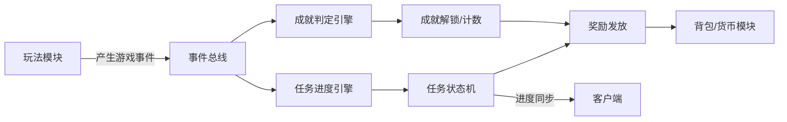
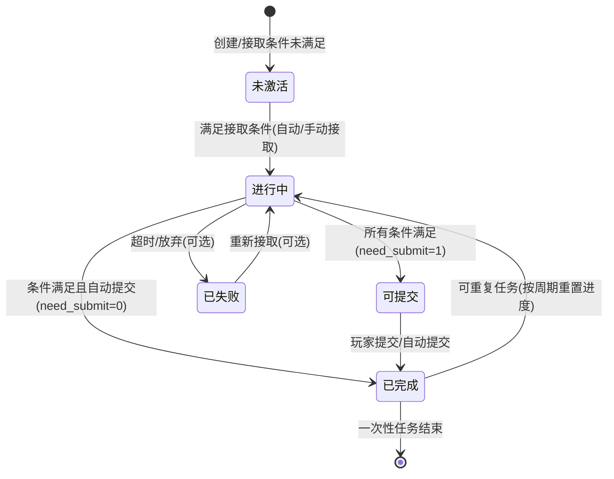
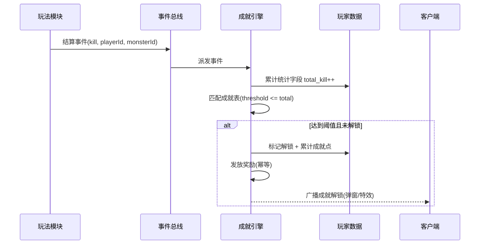

# 02-任务与成就系统

> 任务（Quest）与成就（Achievement）是游戏"目标感"的核心载体：任务引导玩家短期行动，成就沉淀长期荣誉。两者的共同本质是**对游戏事件的统计与判定**，因此适合用"数据驱动 + 事件驱动"的方式统一设计，避免每个任务写死一套代码。

## 一、概述

任务与成就系统回答四个问题：

1. **任务是什么**：任务由哪些条件、进度、奖励构成（数据驱动配置）；
2. **进度怎么来**：游戏事件如何转化为任务进度，由谁统计、何时上报（事件驱动 + 服务端权威）；
3. **何时算完成**：条件满足的判定、成就的一次性解锁、奖励发放（判定与发奖幂等）；
4. **怎么呈现**：进度如何同步给客户端、完成/解锁的交互表现，以及如何防作弊（防刷、防改）。

核心设计原则：

- **数据驱动（Data-Driven）**：任务/成就用配置表描述，新增玩法不改代码，只加配置；
- **事件驱动（Event-Driven）**：所有游戏行为（击杀、升级、消费、通关）先产生标准事件，任务系统订阅事件并累计进度；
- **服务端权威（Server Authority）**：进度统计以服务端事件为准，客户端上报只能作为补充且必须校验；
- **发奖幂等**：完成判定与奖励发放必须可重放而不重复。



## 二、核心概念

| 概念 | 英文 | 说明 | 关键点 |
| --- | --- | --- | --- |
| 任务模板 | Quest Template | 静态配置：任务 ID、条件、奖励、前置关系 | 数据驱动 |
| 任务实例 | Quest Instance | 玩家维度的任务状态与进度 | 玩家数据 |
| 条件 | Condition | 完成任务的判定要素（击杀 N 只、达到等级） | 支持组合 |
| 进度 | Progress | 条件的当前累计值 | 事件驱动累加 |
| 奖励 | Reward | 完成后的发放内容（道具/货币/经验） | 发放幂等 |
| 成就 | Achievement | 长期统计型荣誉目标，通常只解锁一次 | 只增不减 |
| 成就点 | Achievement Points | 成就系统的累计积分 | 排行榜素材 |
| 任务链 | Quest Chain | 前置-后置串联的任务序列 | 图结构校验 |
| 每日任务 | Daily Quest | 按天刷新的任务 | 周期重置 |
| 事件上报 | Event Report | 客户端/服务端模块产生行为事件 | 防伪校验 |
| 隐藏成就 | Hidden Achievement | 未达成前不显示条件 | 客户端不泄露配置 |

## 三、原理详解

### 3.1 数据驱动的任务设计

任务定义一般由三张表构成：

**任务表（quest_template）**：任务本体。关键字段：任务 ID、名称、类型（主线/支线/每日/活动）、可接条件（等级/前置任务）、奖励引用、是否可重复、刷新周期、失效时间。

**条件表（quest_condition）**：一行一个条件。条件类型用"类型码 + 参数"表达：

| 条件类型 | 类型码 | 参数示例 | 事件来源 |
| --- | --- | --- | --- |
| 击杀怪物 | kill_monster | monsterId=1001, count=10 | 战斗结算事件 |
| 通关副本 | finish_dungeon | dungeonId=5, count=1 | 副本结算事件 |
| 升级 | reach_level | level=20 | 等级变更事件 |
| 消耗货币 | spend_currency | currency=gold, amount=5000 | 货币流水事件 |
| 获得道具 | obtain_item | itemId=2001, count=3 | 背包获得事件 |
| 完成其他任务 | finish_quest | questId=10001 | 任务完成事件 |

条件之间支持 **与（AND）** 关系（全部满足才算完成），部分系统支持"或"与计数子条件。配置时用 JSON 表达组合：

```json
{
  "questId": 10001,
  "type": "daily",
  "conditions": [
    { "type": "kill_monster", "monsterId": 1001, "count": 10 },
    { "type": "spend_currency", "currency": "gold", "amount": 1000 }
  ],
  "combine": "AND",
  "rewards": [
    { "type": "item", "itemId": 3001, "count": 5 },
    { "type": "currency", "currency": "gold", "amount": 500 }
  ]
}
```

**奖励表（quest_reward）**：完成时发放内容。奖励发放必须支持**幂等**：同一任务的完成事件重复触发（重放、重复提交）不能发两次。

### 3.2 任务状态机



设计要点：

- **need_submit** 区分"自动完成"（如收集类）与"手动提交"（如交付类 NPC 任务），手动提交必须在服务端校验条件后触发发奖；
- **可重复任务**（每日/每周）的"重置"本质是新建一个周期实例，旧实例归档，而不是原地清零——这样日志可查、防刷可审计；
- **任务链**在配置期校验：前置任务必须存在、不能成环（拓扑排序校验），避免玩家卡死。

### 3.3 进度跟踪与上报

进度的两种来源：

1. **服务端事件统计（推荐，防作弊）**：玩法模块（战斗、副本、经济）在服务端结算时发出标准事件，任务引擎监听并累计。例如击杀事件由战斗服务器在结算时广播，客户端无法伪造。
2. **客户端上报**：仅用于无法服务端统计的行为（如"完成一次舞蹈动作"），客户端上报必须带**服务端可验证的上下文**（玩家 ID、时间戳、会话令牌），并做频率限制与异常检测（同类型事件 1 秒内超过阈值判可疑）。

进度累计采用"**事件 → 匹配 → 累计 → 检查完成**"管道：

```go
// 伪代码：任务进度引擎处理事件
func (q *QuestEngine) OnEvent(e *GameEvent) {
    // 1. 找到该玩家所有监听此事件类型的进行中任务
    quests := q.index.GetByPlayer(e.PlayerID)
    for _, inst := range quests {
        if inst.State != InProgress { continue }
        for _, cond := range inst.Template.Conditions {
            if cond.Type != e.Type { continue }
            if !cond.Match(e.Params) { continue } // 参数过滤，如指定怪物 ID
            // 2. 累计进度（防溢出、防超上限）
            inst.Progress[cond.ID] = min(inst.Progress[cond.ID]+e.Delta, cond.Target)
            q.markDirty(inst)
        }
        // 3. 全部条件满足 → 状态迁移 + 发奖
        if inst.AllConditionsMet() {
            q.Complete(inst) // 内部保证幂等
        }
    }
}
```

进度持久化时机：事件密集（战斗击杀）时先累计在内存，周期性落库（如 5 秒）或事件批次落库；关键节点（完成任务、跨天重置）必须立即落库。

### 3.4 成就判定与解锁

成就是"长期统计"任务：击杀总数、通关次数、累计消费等。与任务的关键差异：

- **只解锁一次**：判定为"累计值达到阈值"且"未解锁过"，解锁事件本身幂等；
- **只增不减**：成就进度是单调统计（如"累计击杀 10000 只"），不随死亡/消耗回退；即使有"反向成就"（如被击杀次数），底层统计字段也只增；
- **隐藏成就**：配置 `hidden=1`，客户端在解锁前不展示条件，防止玩家"照着做"；
- **成就点**：每个成就配积分，解锁后累加到玩家成就点，进排行榜（见关联阅读：缓存与排行榜）。

成就判定同样由事件驱动：事件 → 累加统计字段（如 `total_kill_count`）→ 与该成就阈值比较 → 满足则解锁 → 发奖 → 广播成就事件（客户端弹窗）。



### 3.5 与客户端表现同步

- **接取/进度**：客户端请求接取 → 服务端校验（等级、前置、次数）→ 下发任务实例（含当前进度）→ 后续进度以增量事件推送（`quest.progress`）；
- **完成**：服务端判定完成 → 推送 `quest.complete` → 客户端播动画 → 客户端回执后服务端进入"已领取"（若奖励需手动领取）；
- **手动领取奖励**：客户端"领取"请求必须服务端校验任务状态为已完成且未领取（`claimed=1`），发放走背包/货币模块的幂等接口；
- **重连同步**：登录或重连时下发"任务列表摘要（状态+进度版本号）"，与增量进度配合，避免重复弹窗：客户端以服务端状态为准过滤已展示过的完成动画。

### 3.6 防作弊校验

任务/成就系统是刷子与外挂的重灾区，防线如下：

1. **服务端统计**：进度只信服务端事件，不信客户端自报（客户端上报接口必须验签 + 限频 + 上下文校验）；
2. **数值合理性**：进度增量不超过单次事件合法上限（一次击杀最多 +1）；同事件短时间内重复触发限频；
3. **关联校验**：如"通关副本"任务须与副本结算记录对齐，防止客户端伪造结算；
4. **异常检测**：进度异常增长（如 1 分钟完成 100 天任务）触发告警、冻结任务、人工审核；
5. **奖励防重**：完成与领取均幂等；流水记录 `quest_ledger`，奖励发放与背包流水可对账；
6. **时间校验**：每日任务以服务器时区与玩家时区规则重置，禁止客户端本地时间参与判定（防改系统时间跨天刷任务）。

## 四、设计示例

### 4.1 表结构（SQL）

```sql
-- 任务模板（静态配置）
CREATE TABLE quest_template (
  quest_id        INT PRIMARY KEY,
  name            VARCHAR(64)  NOT NULL,
  quest_type      TINYINT      NOT NULL, -- 1=主线 2=支线 3=每日 4=每周 5=活动
  need_level      INT          NOT NULL DEFAULT 1,
  pre_quest_id    INT          NULL,      -- 前置任务
  need_submit     TINYINT      NOT NULL DEFAULT 0, -- 1=需手动提交
  repeat_type     TINYINT      NOT NULL DEFAULT 0, -- 0=一次性 1=每日 2=每周
  expire_sec      INT          NOT NULL DEFAULT 0, -- 接取后有效期
  conditions_json JSON         NOT NULL,  -- 条件组合
  rewards_json    JSON         NOT NULL,  -- 奖励组合
  hidden          TINYINT      NOT NULL DEFAULT 0,
  version         INT          NOT NULL DEFAULT 0
);

-- 玩家任务实例（动态数据）
CREATE TABLE player_quest (
  player_id    BIGINT      NOT NULL,
  quest_id     INT         NOT NULL,
  cycle_id     VARCHAR(32) NOT NULL,      -- 周期实例 ID（每日=YYYY-MM-DD）
  state        TINYINT     NOT NULL,      -- 0=未激活 1=进行中 2=可提交 3=已完成 4=已领取 5=已失败
  progress     JSON        NOT NULL,      -- {conditionId: curCount}
  accept_at    DATETIME    NOT NULL,
  complete_at  DATETIME    NULL,
  claim_at     DATETIME    NULL,
  version      INT         NOT NULL DEFAULT 0,
  PRIMARY KEY (player_id, quest_id, cycle_id),
  KEY idx_state (player_id, state)
) PARTITION BY HASH(player_id) PARTITIONS 64;

-- 成就定义（静态）
CREATE TABLE achievement_def (
  ach_id        INT PRIMARY KEY,
  name          VARCHAR(64) NOT NULL,
  stat_key      VARCHAR(32) NOT NULL,    -- 统计字段: total_kill 等
  threshold     BIGINT      NOT NULL,
  points        INT         NOT NULL DEFAULT 0,
  rewards_json  JSON        NOT NULL,
  hidden        TINYINT     NOT NULL DEFAULT 0,
  version       INT         NOT NULL DEFAULT 0
);

-- 玩家成就（动态，解锁只增）
CREATE TABLE player_achievement (
  player_id   BIGINT      NOT NULL,
  ach_id      INT         NOT NULL,
  unlocked_at DATETIME    NOT NULL,
  claim_at    DATETIME    NULL,          -- 奖励领取时间（幂等）
  PRIMARY KEY (player_id, ach_id)
) PARTITION BY HASH(player_id) PARTITIONS 64;

-- 玩家统计字段（成就底层数据）
CREATE TABLE player_stat (
  player_id   BIGINT      NOT NULL,
  stat_key    VARCHAR(32) NOT NULL,
  value       BIGINT      NOT NULL DEFAULT 0,
  updated_at  DATETIME    NOT NULL DEFAULT CURRENT_TIMESTAMP ON UPDATE CURRENT_TIMESTAMP,
  PRIMARY KEY (player_id, stat_key)
) PARTITION BY HASH(player_id) PARTITIONS 64;

-- 任务流水（审计/对账）
CREATE TABLE quest_ledger (
  id         BIGINT AUTO_INCREMENT PRIMARY KEY,
  player_id  BIGINT      NOT NULL,
  quest_id   INT         NOT NULL,
  cycle_id   VARCHAR(32) NOT NULL,
  event_type VARCHAR(32) NOT NULL,       -- accept/complete/claim/reset
  reward     JSON        NULL,
  created_at DATETIME    NOT NULL DEFAULT CURRENT_TIMESTAMP,
  KEY idx_player (player_id, created_at)
) PARTITION BY HASH(player_id) PARTITIONS 64;
```

### 4.2 任务完成与发奖伪代码

```go
// 完成任务（幂等）：状态迁移 + 发奖
func (q *QuestEngine) Complete(inst *QuestInst) error {
    lock := q.locks.Get(inst.PlayerID); lock.Lock(); defer lock.Unlock()
    // 幂等：已完成/已领取直接返回
    if inst.State >= Completed { return nil }
    // 最终校验：条件必须全部满足（防事件重复/脏数据）
    if !inst.AllConditionsMet() { return ErrConditionNotMet }
    inst.State = Completed
    inst.CompleteAt = now()
    q.save(inst) // 先落库再发奖？→ 见最佳实践"发奖前落库"

    rewards := inst.Template.Rewards
    // 走背包/货币模块的幂等接口（opId = quest:complete:{playerId}:{questId}:{cycleId}）
    opID := fmt.Sprintf("quest:%d:%d:%s", inst.PlayerID, inst.QuestID, inst.CycleID)
    if err := q.rewardSvc.Grant(inst.PlayerID, rewards, opID, "quest"); err != nil {
        return err // 补偿任务会重试，幂等保证不重复发
    }
    q.ledger.Append(inst.PlayerID, inst.QuestID, inst.CycleID, "complete", rewards)
    q.push(inst.PlayerID, &QuestPush{QuestID: inst.QuestID, State: Completed})
    return nil
}

// 每日任务跨天重置：按周期新建实例并归档旧实例
func (q *QuestEngine) DailyReset(playerID int64, date string) {
    lock := q.locks.Get(playerID); lock.Lock(); defer lock.Unlock()
    for _, inst := range q.listByType(playerID, QuestTypeDaily) {
        if inst.CycleID == date { continue }
        q.archive(inst)                                  // 旧周期归档
        q.newInstance(playerID, inst.QuestID, date)      // 新周期实例
    }
}
```

## 五、最佳实践

1. **配置驱动，代码为零**：新增任务 = 新增配置 + 复用事件类型；事件类型不足时先扩展事件层，而不是在任务引擎里写特例；
2. **事件先于任务存在**：玩法模块只发"事实事件"，任务/成就是订阅者；不要让玩法代码感知任务逻辑（解耦）；
3. **发奖前状态落库**：先持久化"已完成"，再发奖励；奖励接口幂等，崩溃重试不重复；
4. **进度防溢出**：累计值 clamp 到目标值，避免客户端负数/超限脏数据；
5. **统计字段只增**：成就底层统计单调递增，回退类玩法用独立字段表达；
6. **周期任务走实例化**：每日/每周任务用"周期实例"而非原地清零，保留审计；
7. **进度增量同步**：进度推送带版本号，重连补发，避免进度回跳；
8. **配置校验 CI**：任务链成环、条件参数引用不存在的怪物/副本 ID、奖励引用不存在道具——上线前自动化校验；
9. **防刷一体化**：服务端统计为主 + 上报限频 + 异常告警 + 流水对账。

## 六、常见问题（FAQ）

**Q1：任务进度丢了，玩家明明杀了 10 只却显示 3 只？**
查事件流水与进度落库：确认击杀事件是否由服务端结算产生（客户端上报易丢易伪造）、进度是否在事件批次中未及时落库。对策：服务端权威统计 + 周期性落库 + 重连补发。

**Q2：奖励重复发放了？**
发奖接口未幂等或重试逻辑在"状态已更新但发奖失败"后重跑。对策：发奖 opId 唯一（含 questId+cycleId）、奖励发放走背包幂等接口、流水对账任务扫描"已完成但无发奖流水"的实例。

**Q3：每日任务能靠改系统时间刷吗？**
不能。跨天判定以服务端时间为准，任务引擎定时执行重置（服务端时区/玩家时区规则），客户端时间不参与任何判定。

**Q4：成就进度会回退吗？**
不会。成就底层是单调统计字段（total_xxx），即使发生"删号重练"也按新角色独立统计；解锁后永久保留（除非运营明确重置）。

**Q5：客户端内存修改器改任务进度，能骗过服务端吗？**
不能直接生效：进度判定以服务端事件为准；客户端上报类任务有验签、限频与上下文校验，异常增长触发冻结与人工审核。

**Q6：任务配置热更新，玩家进行中的任务怎么办？**
约定兼容规则：条件目标上调→已累计进度保留但需补足；奖励变更→只影响新实例；删除任务→进行中实例按"放弃并补偿"处理。配置版本号记录在实例上，便于追溯。

**Q7：活动任务数量巨大（几千个），性能怎么办？**
事件按类型建立"任务索引"（type → 任务列表），玩家级只遍历进行中实例；条件匹配用预编译表达式；高频事件（击杀）批量累计、批量落库；统计字段读写分离。

## 七、关联阅读

- [01-消息系统与事件驱动](../01-架构与网络/04-消息系统与事件驱动.md)：事件总线、订阅分发、可靠投递（任务事件的基础设施）
- [02-缓存与排行榜系统](../02-数据与业务/02-缓存与排行榜系统.md)：成就点排行榜、统计字段缓存
- [01-背包与道具系统](01-背包与道具系统.md)：奖励发放的幂等接口与流水对账
- [03-商城与经济系统](03-商城与经济系统.md)：消费类任务（spend_currency）与货币流水联动
- [02-安全与反作弊](../02-数据与业务/04-安全与反作弊.md)：客户端上报验签、频率限制、异常检测
