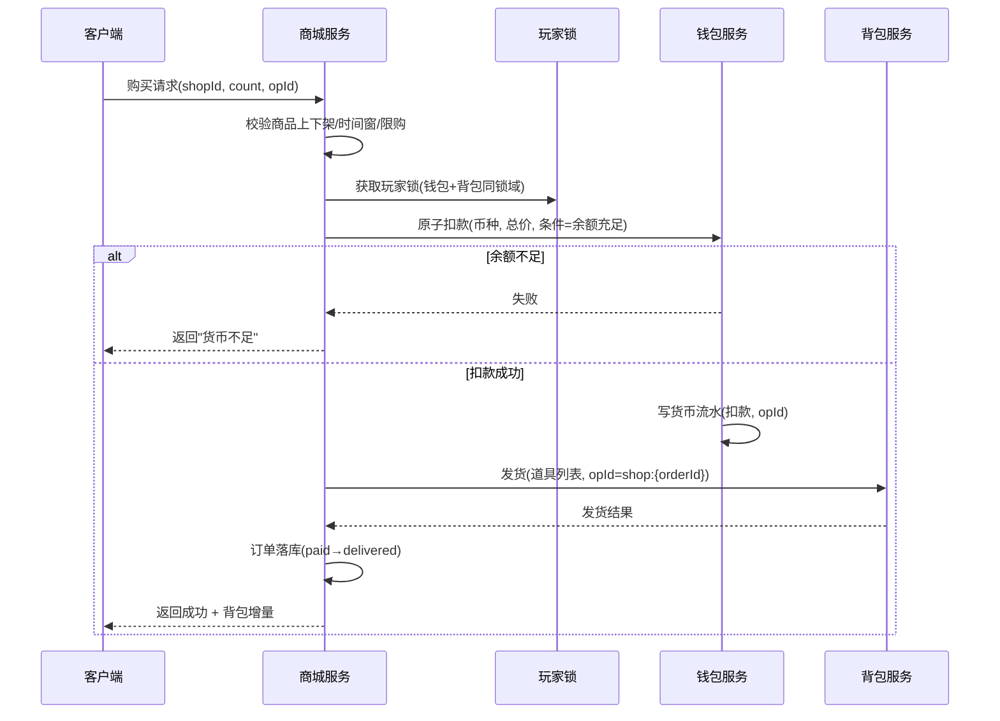
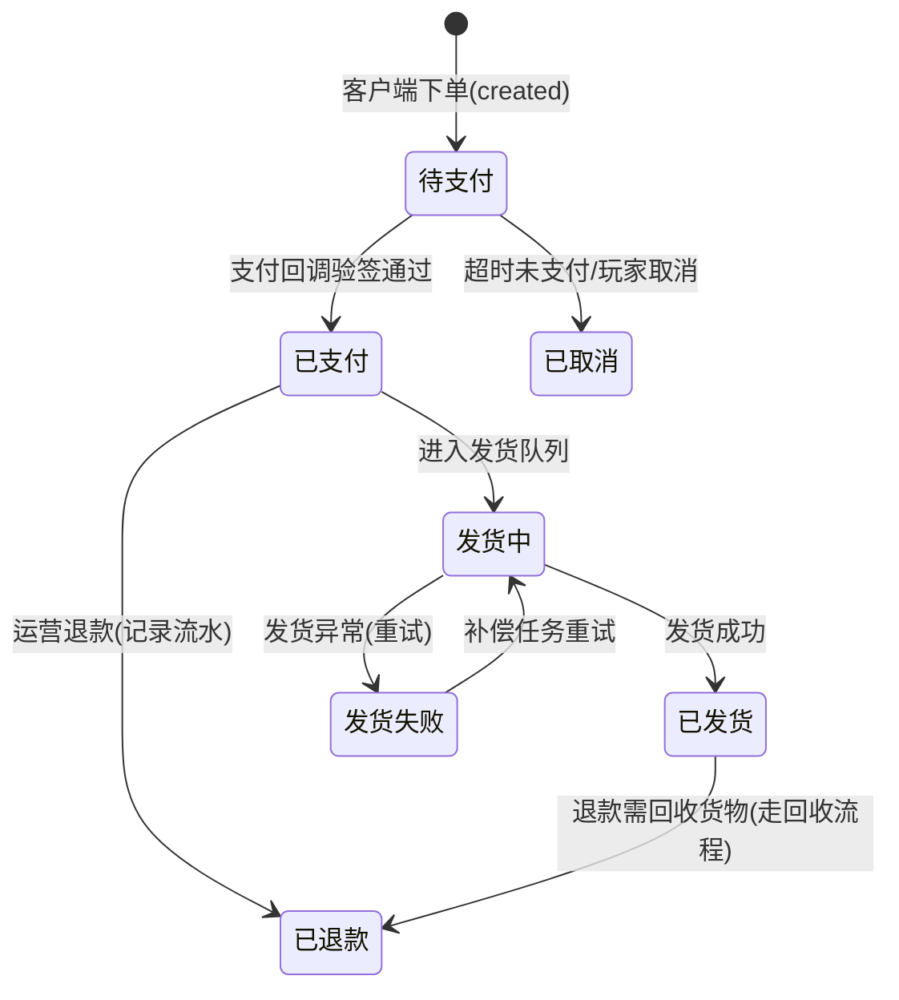

# 03-商城与经济系统

> 知识基线：实时游戏服务端通用架构；示例中的语言、数据库、缓存、容器和云平台版本必须以项目部署清单为准。
> 适用范围：覆盖商城、钱包、背包、支付回调与运营对账的全链路资产边界；支付渠道验签规则以渠道官方文档和部署清单为准。
> 事实边界：协议规范、组件行为和示例方案分开；容量数字只作示意/经验值，必须通过压测验证。
> 最后更新：2026-08-06（补齐规范来源、版本边界与工程验收入口）。
> 版本边界：以 2026-08-06 为核对日，不新增不确定的当前组件版本号；支付 SDK、数据库、Redis、协议库和容器版本由项目部署清单锁定。
> 参考来源：[PostgreSQL 官方文档](https://www.postgresql.org/docs/)、[Redis 官方文档](https://redis.io/docs/latest/)、[Protocol Buffers 官方文档](https://protobuf.dev/)、[OpenTelemetry 官方文档](https://opentelemetry.io/docs/)。

### P0 订单、流水与发货验收

| 验收项 | 设计基线 | 证据入口 |
| --- | --- | --- |
| 业务流水 | 订单、扣款、发货、退款和对账均保留前后余额、原因、渠道交易号、orderId/opId、规则版本 | 本地账与渠道账单可对账，负余额、缺货和异常退款有处置链 |
| 幂等 | 渠道回调以渠道键唯一，购买/发货/退款以服务端订单或业务键去重；重试必须安全 | 重复回调、回调乱序、扣款后崩溃和补偿重跑不重复发货 |
| 审计 | 记录验签结果、请求来源、商品快照、运营操作、人工补发和 traceId 关联 | 客诉/财务可按订单还原全链路，敏感支付信息不落明文 |
| 服务端权威验证 | 商品价格、上下架、限购、余额、回调金额和发货内容由服务端重新读取/校验 | 改价、改数量、伪造回调、并发限购和客户端伪造成功均被拒绝 |
| 版本兼容 | 订单保存商品/配置版本；协议字段只增不复用；新旧服务端可在迁移窗口共存 | 灰度、回滚、配置热更、补偿任务和旧客户端行为可回放 |

> 结论边界：扣款与发货采用事务还是最终一致、缓存是否参与、对账周期和风控阈值都是方案取舍；最终以渠道规则、部署清单、压测与故障演练为准。

> 商城（Shop）是游戏变现的核心入口，经济系统（Economy）则决定游戏数值生态的长期健康。商城涉及虚拟货币与真实支付的交叉，对正确性要求最高：**扣错钱、多发货、重复发货都是直接经济损失与客诉**。本文讲解商品配置、购买流程、订单与支付回调、经济平衡、限购活动与审计。

## 一、概述

商城与经济系统要解决的核心问题：

1. **怎么卖**：商品如何配置（价格、货币类型、限购、上下架）、购买流程如何保证原子与幂等；
2. **怎么收钱**：第三方支付（App Store / Google Play / 微信 / 支付宝 / Steam）回调如何验签、防重、对账；
3. **怎么平衡**：货币的产出与消耗如何设计，避免通胀失控（经济系统）；
4. **怎么审计**：每一笔货币变动可追溯，支撑客服、风控与财务。

两条铁律贯穿全文：

- **货币变更必留流水（Ledger）**：所有货币增减记录 `(playerId, 币种, 变化量, 变化前后余额, 原因码, 订单号/opId)`，这是防刷、对账、客服的基础；
- **扣款与发货解耦但最终一致**：先扣款、后发货；发货失败由补偿任务重试，接口幂等，绝不允许"扣了钱不发货"或"发两次货"。

## 二、核心概念

| 概念 | 英文 | 说明 | 关键点 |
| --- | --- | --- | --- |
| 商品 | Product / SKU | 可购买条目：道具、货币包、礼包、订阅 | 上下架、价格、限购 |
| 硬通货 | Hard Currency | 只能充值获得的货币（钻石/点券） | 变现锚点 |
| 软通货 | Soft Currency | 游戏内可产出货币（金币） | 经济调节阀 |
| 订单 | Order | 一次购买交易的记录 | 状态机驱动 |
| 支付回调 | Payment Callback | 支付渠道通知服务端"已支付" | 验签 + 幂等 |
| 对账 | Reconciliation | 本地订单与渠道账单比对 | 财务级一致性 |
| 限购 | Purchase Limit | 每玩家/每账号的购买次数限制 | 日/周/总次数 |
| 货币流水 | Currency Ledger | 货币每次变动的审计记录 | 只增不改 |
| 产出 | Sink / Source | 货币来源（产出）与消耗点（回收） | 经济平衡 |
| 通胀 | Inflation | 货币总量增速超过消耗 → 贬值 | 数值设计问题 |
| 防重 | Idempotency | 同一订单/回调只处理一次 | 唯一键 |

## 三、原理详解

### 3.1 商品配置与购买流程

**商品配置（shop_config）**：商品是"销售组合"而非道具本身。一个礼包商品 = 价格（货币类型+金额）+ 内容（多个道具/货币）+ 限购规则 + 售卖时间窗 + 展示信息。商品与内容分离，便于运营自由组合（如"6 元档：钻石×60 + 金币×10000"）。

**购买流程（虚拟货币购买，无第三方支付）**：



要点：

1. **扣款是原子条件操作**：`UPDATE wallet SET balance=balance-? WHERE player_id=? AND currency=? AND balance>=?`，影响行数为 0 表示余额不足；
2. **扣款与发货的边界**：单库内可同事务；跨库/跨服务时必须"流水先行 + 最终一致"——先写扣款流水与"待发货"订单，发货由可靠消息驱动；
3. **全链路幂等**：请求带 `opId`，订单号由服务端生成（`orderId`），发货 opId 使用订单号，保证重试不重复发货；
4. **超卖防护**：限购判断与扣款在同一临界区，用数据库唯一键或条件更新防并发超卖（如每日限购 1 次：`INSERT ... ON DUPLICATE KEY` 或条件 UPDATE）。

### 3.2 订单与支付回调

**订单状态机**：



**支付回调处理（以渠道服务器 → 游戏服务器为例）**：

```go
// 支付回调处理：验签 → 幂等 → 发货
func (s *PayService) OnPayCallback(raw []byte) error {
    req := parse(raw)
    // 1. 验签：渠道私钥签名校验，防伪造回调
    if !verifySign(req, s.channelPubKey) { return ErrBadSign }
    // 2. 查订单：订单必须存在且处于"待支付"
    order := s.getOrder(req.OrderID)
    if order == nil || order.State != Pending { return ErrOrderState }
    // 3. 金额核对：渠道金额与订单金额必须一致（防改单）
    if req.Amount != order.Amount || req.Currency != order.Currency {
        return ErrAmountMismatch
    }
    // 4. 幂等：以 (channel, channelTxnId) 唯一约束防重复回调
    if !s.idem.Acquire(req.Channel, req.ChannelTxnID) { return nil } // 已处理过
    // 5. 状态推进 + 发货（订单号作发货 opId）
    s.markPaid(order)
    s.deliver(order) // 可靠消息异步，失败重试
    s.ledger.Append(order.PlayerID, &CurrencyFlow{
        Currency: order.Currency, Delta: order.Amount, Reason: "recharge", OrderID: order.ID})
    return nil
}
```

回调处理的四个关键点：

1. **验签**：使用渠道官方 SDK 验签（RSA/签名串），绝不相信裸请求；
2. **金额核对**：渠道回传金额与本地订单金额必须一致，防止改单攻击；
3. **幂等**：以渠道流水号（`channelTxnId`）唯一索引，重复回调直接返回成功（渠道要求返回 200，否则会持续重推）；
4. **对账**：每日/每小时拉取渠道账单，与本地"已支付"订单比对：本地有渠道无 → 补发或人工；渠道有本地无 → 立即补单发货（玩家充了钱必须到账）。

### 3.3 经济系统设计：产出、消耗与通胀控制

经济系统的本质是**货币存量（Money Supply）管理**：

- **产出（Source / Mint）**：任务奖励、副本掉落、签到、活动赠送；
- **消耗（Sink / Burn）**：商店购买、强化、合成、修理、传送费、公会捐献；
- **沉淀（Holding）**：玩家囤积的货币不进流通，也是隐性"回收"。

通胀（Inflation）的成因：产出增速 > 消耗增速，导致货币贬值（物价被迫上涨、新手体验崩坏）。控制手段：

| 手段 | 原理 | 示例 |
| --- | --- | --- |
| 控制产出 | 限制高收益玩法次数 | 每日金币副本限次 |
| 增加消耗 | 设计持续消耗点 | 修理费、强化费、交易税 |
| 回收机制 | 周期性大额回收 | 赛季结算、拍卖行手续费 |
| 贬值策略 | 让存量货币相对贬值 | 新货币体系、旧币兑换率下调 |
| 限量供给 | 硬通货不直接产出 | 钻石只充值获得 |
| 数据监控 | 量化监控货币总量与流速 | 人均存量、日产出/消耗比看板 |

经济平衡是**数值工程**而非一次性设计：上线后持续监控"货币总存量曲线"与"产出/消耗比值"，超过阈值触发调整（改产出、加消耗点、开回收活动）。商城定价策略也反哺经济：限时折扣清库存、礼包价值锚定（让玩家感知"性价比"）、货币包与消耗点联动。

### 3.4 限购与活动

- **限购维度**：每人每日 / 每周 / 总计；按账号（跨角色）或按角色；部分游戏按"服务器总量"限购（限量礼包）；
- **限购实现**：购买计数表 `(playerId, shopId, periodKey)`，唯一键防并发；活动限购与普通限购分开计数；
- **活动商品**：活动 = 时间窗 + 商品组 + 价格策略（折扣/递增价/随机池）。活动配置与代码分离，运营可自助配置；
- **抽卡/开箱（Gacha）**：本质是概率商品，需服务端权威抽奖 + 概率公示 + 保底（Pity）机制；抽奖结果先落流水再展示，支持"晒单"验证。

### 3.5 日志与审计

- **货币流水（currency_flow）**：每次变动一行，`reason` 原因码（recharge/shop/quest/drop/guild/refund/admin），支持"玩家所有金币去向"查询；
- **订单流水（order_log）**：订单全生命周期事件（创建/支付回调/发货/退款/对账），便于定位"钱去哪了、货到没到"；
- **操作审计（admin_audit）**：运营后台发货、改货币、封号等操作记录操作人，防止内部滥用；
- **对账任务**：定期比对（订单 ↔ 渠道账单 ↔ 货币流水 ↔ 背包流水），不一致告警；
- **留存策略**：流水至少保留财务要求的周期（通常 ≥ 180 天），支持拉取归档。

## 四、设计示例

### 4.1 表结构（SQL）

```sql
-- 商品配置（静态）
CREATE TABLE shop_config (
  shop_id        INT PRIMARY KEY,
  name           VARCHAR(64) NOT NULL,
  goods_type     TINYINT     NOT NULL, -- 1=道具 2=货币包 3=礼包 4=订阅 5=抽奖
  price_currency TINYINT     NOT NULL, -- 1=钻石 2=金币 3=人民币(渠道价)
  price          BIGINT      NOT NULL,
  content_json   JSON        NOT NULL, -- 发货内容 [{type:item/currency, id, count}]
  limit_type     TINYINT     NOT NULL DEFAULT 0, -- 0=不限 1=每日 2=每周 3=总次数
  limit_count    INT         NOT NULL DEFAULT 0,
  start_at       DATETIME    NULL,
  end_at         DATETIME    NULL,
  status         TINYINT     NOT NULL DEFAULT 1, -- 0=下架 1=上架
  version        INT         NOT NULL DEFAULT 0
);

-- 玩家钱包
CREATE TABLE player_wallet (
  player_id  BIGINT   NOT NULL,
  currency   TINYINT  NOT NULL, -- 1=钻石 2=金币 3=工会币...
  balance    BIGINT   NOT NULL DEFAULT 0,
  version    INT      NOT NULL DEFAULT 0,
  PRIMARY KEY (player_id, currency)
) PARTITION BY HASH(player_id) PARTITIONS 64;

-- 货币流水（审计核心，只增不改）
CREATE TABLE currency_flow (
  id         BIGINT AUTO_INCREMENT PRIMARY KEY,
  player_id  BIGINT      NOT NULL,
  currency   TINYINT     NOT NULL,
  delta      BIGINT      NOT NULL,           -- 正=增 负=减
  before_bal BIGINT      NOT NULL,
  after_bal  BIGINT      NOT NULL,
  reason     VARCHAR(32) NOT NULL,           -- recharge/shop/quest/refund/admin...
  order_id   VARCHAR(64) NULL,
  op_id      VARCHAR(64) NOT NULL,           -- 幂等键
  created_at DATETIME    NOT NULL DEFAULT CURRENT_TIMESTAMP,
  UNIQUE KEY uk_op (player_id, op_id),
  KEY idx_player_time (player_id, created_at)
) PARTITION BY HASH(player_id) PARTITIONS 64;

-- 订单表
CREATE TABLE order_info (
  order_id       VARCHAR(64) PRIMARY KEY,    -- 服务端生成
  player_id      BIGINT      NOT NULL,
  shop_id        INT         NOT NULL,
  count          INT         NOT NULL DEFAULT 1,
  currency       TINYINT     NOT NULL,
  amount         BIGINT      NOT NULL,       -- 应付金额
  state          TINYINT     NOT NULL,       -- 0=待支付 1=已支付 2=发货中 3=已发货 4=已取消 5=已退款
  channel        VARCHAR(16) NULL,           -- apple/google/wechat/alipay...
  channel_txn_id VARCHAR(64) NULL,           -- 渠道流水号(唯一)
  created_at     DATETIME    NOT NULL DEFAULT CURRENT_TIMESTAMP,
  paid_at        DATETIME    NULL,
  delivered_at   DATETIME    NULL,
  UNIQUE KEY uk_channel_txn (channel, channel_txn_id)
) PARTITION BY HASH(player_id) PARTITIONS 64;

-- 限购计数
CREATE TABLE shop_limit (
  player_id  BIGINT      NOT NULL,
  shop_id    INT         NOT NULL,
  period_key VARCHAR(16) NOT NULL,           -- daily=20260804 / weekly=2026W32 / total
  bought     INT         NOT NULL DEFAULT 0,
  PRIMARY KEY (player_id, shop_id, period_key)
) PARTITION BY HASH(player_id) PARTITIONS 64;
```

### 4.2 购买伪代码（虚拟货币）

```go
func (s *ShopService) Buy(playerID int64, shopID int32, count int32, opID string) (*Order, error) {
    // 幂等
    if o, ok := s.idem.GetOrder(opID); ok { return o, nil }
    shop := s.config.Get(shopID)
    if shop == nil || shop.Status != On || !shop.InSaleWindow() { return nil, ErrNotOnSale }
    if count <= 0 || count > shop.MaxPerOrder { return nil, ErrBadCount }

    lock := s.locks.Get(playerID); lock.Lock(); defer lock.Unlock()

    // 限购校验 + 计数（同一临界区防超卖）
    key := s.periodKey(shop.LimitType)
    lim := s.limit.Get(playerID, shopID, key)
    if shop.LimitCount > 0 && lim.Bought+count > shop.LimitCount { return nil, ErrLimitExceeded }

    total := shop.Price * int64(count)
    // 原子扣款（条件更新，余额不足返回 0 行）
    if err := s.wallet.Deduct(playerID, shop.PriceCurrency, total,
        fmt.Sprintf("shop:%s", opID), "shop"); err != nil { return nil, err }

    order := s.createOrder(playerID, shopID, count, total)
    // 发货（幂等 opId = 订单号）
    if err := s.deliver(order); err != nil {
        s.mark(order, StateDeliverFailed) // 补偿任务重试
        return order, err
    }
    s.limit.Inc(playerID, shopID, key, count)
    s.mark(order, StateDelivered)
    s.idem.SetOrder(opID, order)
    return order, nil
}
```

### 4.3 支付回调 JSON 与验签伪代码

```json
// 渠道回调示例（以微信支付简化为例）
{
  "orderId": "G202608040001",
  "channelTxnId": "wx202608041200001234",
  "amount": 600,
  "currency": "CNY",
  "timestamp": 1785825600,
  "sign": "base64(RSA-SHA256 签名串)"
}
```

```python
import hashlib, base64

def verify_callback(raw: dict, pub_key_pem: str) -> bool:
    # 1. 拼接待签名串（渠道规定的字段顺序）
    text = f"{raw['orderId']}&{raw['channelTxnId']}&{raw['amount']}&{raw['timestamp']}"
    # 2. RSA 验签
    return rsa_verify(pub_key_pem, text.encode(), base64.b64decode(raw["sign"]))
```

## 五、最佳实践

1. **扣款原子**：余额检查与扣减必须原子（条件 UPDATE 或锁内），杜绝负余额；
2. **流水先行**：货币流水是唯一事实来源；余额可与流水不一致时以"流水重放"为准；
3. **全链路幂等**：购买 opId、发货 opId=订单号、回调以渠道流水号唯一；
4. **扣款发货最终一致**：跨服务不追求强一致，靠"待发货订单 + 补偿重试"保证不丢单；
5. **回调先验签再处理**：所有渠道回调必须验签 + 金额核对，返回 200 让渠道停止重推；
6. **对账自动化**：每日渠道账单对账，发现差异自动告警/补单；
7. **限购防超卖**：限购计数与扣款同一临界区 + 数据库唯一键兜底；
8. **经济监控**：货币总量、产出/消耗比、人均存量看板，阈值告警；
9. **负货币与退款**：退款必须走"回收货物→退币"流程并记流水，禁止直接改余额；
10. **风控**：异常充值（频率、金额、设备）标记人工审核；运营发放必须留痕。

## 六、常见问题（FAQ）

**Q1：玩家扣款成功但没收到货？**
大概率是"扣款与发货"之间链路失败。对策：订单进入"发货中"，补偿任务按订单号重试发货（发货接口幂等）；玩家可自助补发；对账任务兜底扫描。

**Q2：支付渠道重复回调，会发两次货吗？**
不会。回调以 `(channel, channelTxnId)` 唯一约束，重复回调直接返回成功；发货又以订单号为 opId 幂等，双重保险。

**Q3：渠道回调金额与订单不一致（改单攻击）？**
回调处理时强校验 `回调金额 == 订单金额`，不一致直接拒绝并告警；配合渠道侧签名，伪造回调无法通过验签。

**Q4：玩家要求退款，怎么处理？**
标准流程：订单标记退款 → 若已发货则先回收货物（背包扣回，走扣减流水）→ 原路退币/退款 → 记退款流水（reason=refund）→ 通知渠道。回收失败需人工处理，禁止直接改余额。

**Q5：游戏金币通胀了怎么办？**
先量化：产出/消耗比 > 1 持续数月即通胀。对策组合：砍高收益产出、加消耗点、开回收活动（限时强化/合成促销）、新货币体系转换；所有调整以配置热更实现并灰度。

**Q6：限购商品被并发买超了？**
限购计数与扣款在同一玩家锁内 + `shop_limit` 唯一键（playerId, shopId, periodKey）+ 条件 UPDATE（`bought=bought+? WHERE bought+?<=limit`）三层防护。

**Q7：玩家靠小号/脚本刷首充、刷活动？**
风控维度：设备指纹、IP、支付账号聚合；活动奖励与真实充值绑定；异常模式（同设备多账号、短时间多次充值）触发人工审核；刷出来的资产按规则回收并封号。

## 七、关联阅读

- [01-背包与道具系统](01-背包与道具系统.md)：发货目标系统的幂等接口与流水对账
- [02-任务与成就系统](02-任务与成就系统.md)：货币类任务（消费/充值）与货币流水联动
- [01-消息系统与事件驱动](../01-架构与网络/04-消息系统与事件驱动.md)：可靠消息驱动发货与补偿
- [02-数据库选型与存储设计](../02-数据与业务/01-数据库选型与存储设计.md)：分区表、唯一约束、条件更新
- [02-安全与反作弊](../02-数据与业务/04-安全与反作弊.md)：回调验签、风控、内部审计
- [05-部署运维与监控](../02-数据与业务/05-部署运维与监控.md)：对账任务、经济看板监控
