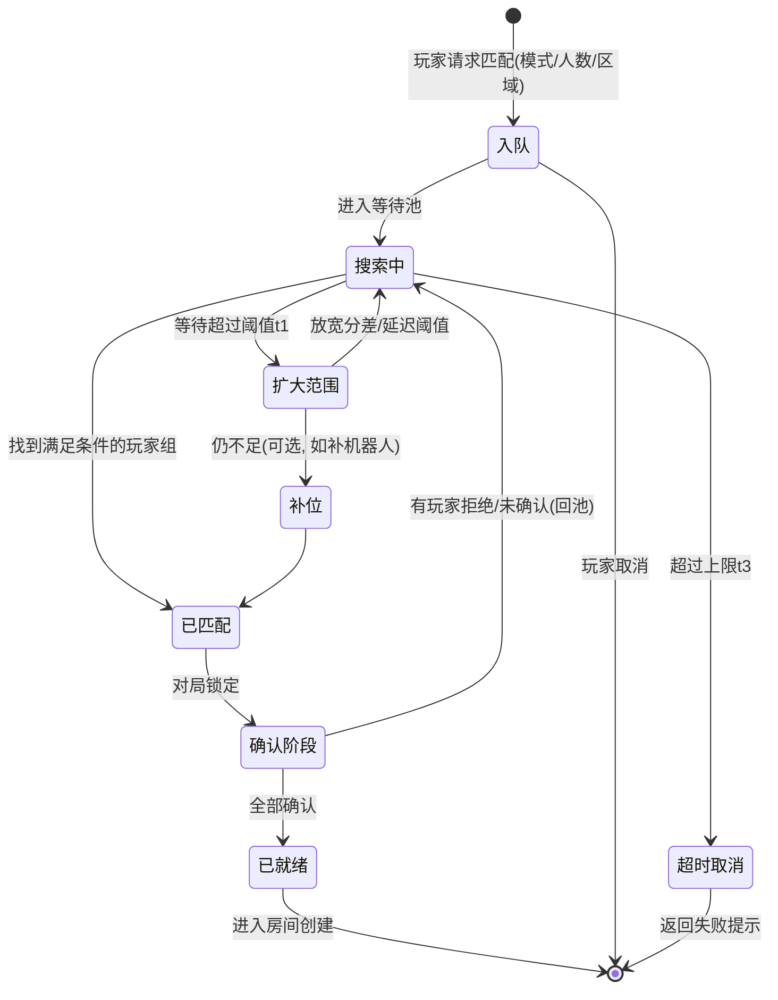
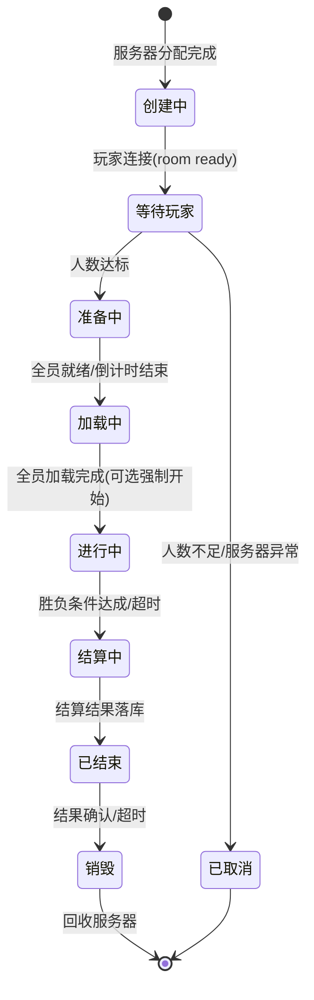
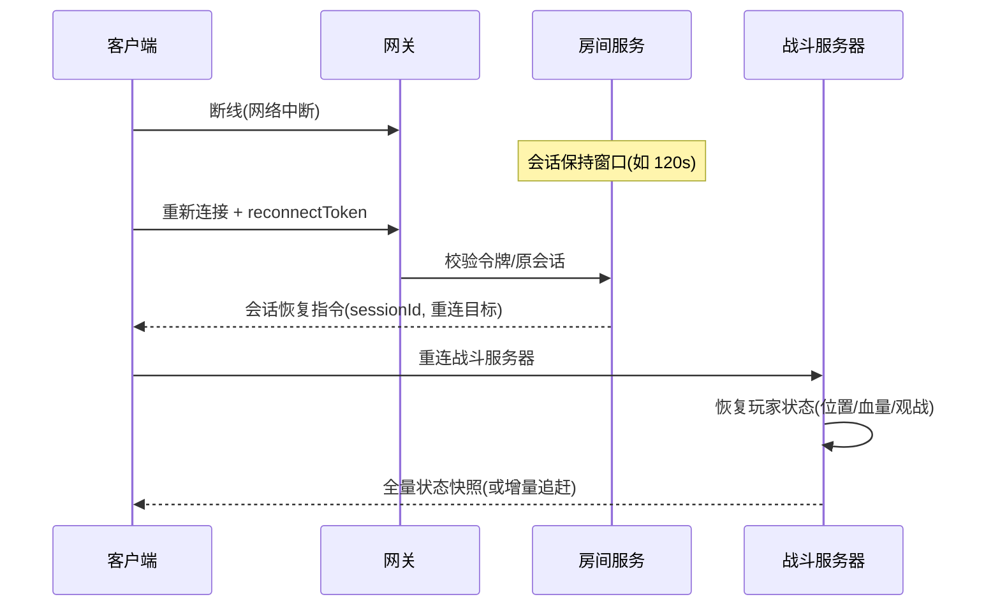

# 04-匹配与房间系统

> 匹配（Matchmaking）与房间（Room / Game Session）系统负责把玩家"组织到一起开一局"：匹配解决"和谁玩"，房间解决"在哪玩、怎么开始结束"。多人竞技游戏（MOBA、FPS、吃鸡、体育）的体验上限由匹配质量决定，稳定性由房间生命周期管理决定。

## 一、概述

匹配与房间系统覆盖四个阶段：

1. **匹配（Matchmaking）**：按实力（ELO/MMR）、延迟、段位、模式等维度为玩家寻找对局，控制等待时间与质量权衡；
2. **队列管理（Queue）**：入队、出队、超时策略（放宽条件、补机器人）、取消；
3. **房间/对局生命周期（Session Lifecycle）**：创建 → 准备 → 开始 → 进行 → 结算 → 销毁，以及服务器分配（专用服务器 vs 玩家建房）；
4. **断线重连（Reconnect）**：玩家掉线后的会话保持、位置恢复与状态同步。


## 二、核心概念

| 概念 | 英文 | 说明 | 关键点 |
| --- | --- | --- | --- |
| 实力分 | ELO / MMR | 玩家实力的数值化估计 | 隐藏分 vs 展示段位 |
| 段位 | Rank / Tier | 展示层分段（青铜→王者） | 由 MMR 映射 |
| K 因子 | K-Factor | ELO 更新的灵敏度 | 新号高 K 快速收敛 |
| 天梯 | Ranked / Ladder | 竞技排位匹配 | 胜负分严格 |
| 休闲 | Casual | 休闲匹配 | 快速、分差放宽 |
| 匹配队列 | Matchmaking Queue | 等待池 + 搜索逻辑 | 分模式、分区 |
| 超时策略 | Timeout / Fallback | 等待过久的放宽规则 | 扩大分差/补机器人 |
| 房间 | Room / Session | 一局游戏的会话实体 | 状态机 |
| 服务器分配 | Server Allocation | 选择对局服务器 | 延迟/负载/区域 |
| 专用服务器 | Dedicated Server | 权威对局服务器 | GameLift/FleetIQ |
| 断线重连 | Reconnect | 掉线后回到原对局 | 会话令牌、状态恢复 |

## 三、原理详解

### 3.1 匹配算法：ELO 与 MMR

**ELO**：经典棋类评分系统。对局后按结果更新双方分数：

```
期望胜率 E_a = 1 / (1 + 10^((Rb - Ra) / 400))
新分数 Ra' = Ra + K * (S - E_a)
  S = 1 胜 / 0.5 平 / 0 负
```

要点：

- **400 分差 = 10 倍胜率差**（标准 ELO 约定）；
- **K 因子**：高分段/老账号 K 小（波动小），新账号 K 大（快速定位真实实力）；
- **多人对局（10 人吃鸡）**：把所有人视作与"期望排名"比较（placement-based ELO），或只与邻近名次玩家比较；
- **MMR（Match Making Rating）**：现代匹配的隐藏分，通常融合 ELO + 表现修正 + 不确定性（uncertainty/σ）。高不确定的新号匹配范围宽、赢一把加分多；随对局数增加不确定性下降，MMR 收敛。

**天梯 vs 休闲**：

| 维度 | 天梯（Ranked） | 休闲（Casual） |
| --- | --- | --- |
| 匹配依据 | MMR 严格分差（如 ±100） | 宽松分差（如 ±300） |
| 段位映射 | 展示段位随 MMR 波动 | 无段位或娱乐分 |
| 惩罚 | 强退扣分/禁赛 | 轻惩罚（冷却） |
| 目的 | 竞技公平 | 快速开局、娱乐 |

**组队匹配（Party）**：多排按队伍"代表分"匹配，常见策略：取队内最高分 + 一定衰减（防高分带低分炸鱼），并限制最高与最低分段差（如差距 ≤ 2 个大段禁止组队）。

### 3.2 匹配队列与超时策略



工程要点：

1. **等待池结构**：按（模式、区域、段位桶）分队列；桶内按 MMR 排序的双端队列，搜索时以目标玩家为中心向两侧扩展；
2. **逐步放宽（Expanding Search）**：等待 0-15s 严格分差 → 15-45s 放宽到 2 倍 → 45s+ 放宽延迟与分差上限 → 超时（如 120s）取消或补机器人；
3. **确认机制（Accept/Decline）**：匹配成功后给所有玩家弹确认，超时未确认踢回队列（防挂机开局）；
4. **匹配服务必须无状态化**：队列状态放 Redis，匹配服务可水平扩展；玩家断线重连后仍在队列；
5. **取消与冷却**：玩家取消匹配有短冷却（防反复入队占坑）；强退对局有长惩罚（禁赛时间）。

### 3.3 房间/对局生命周期管理



生命周期事件由**房间服务（Session Service）**统一驱动，状态迁移必须幂等（同一事件重复到达不重复执行）。关键设计：

- **房间 ID（Session ID）**全局唯一，对局相关消息（战斗、聊天）都带 sessionId 上下文；
- **房间数据**：成员列表、状态、开始/结束时间、结算结果；落库供战绩、回放、客服查询；
- **开始条件**：人数达标 + 全员确认/就绪 + 倒计时；超时强制开始（防止恶意拖时间）；
- **异常处理**：服务器崩溃 → 房间服务检测心跳超时 → 对局作废/重赛判定，玩家强制回大厅；
- **销毁**：结算结果持久化后销毁房间、回收服务器资源；销毁前给玩家留"返回大厅"的收尾消息。

### 3.4 服务器分配（GameLift 等）

专用服务器（Dedicated Server）模式下，匹配成功后需要选择一个游戏服务器实例：

| 方案 | 说明 | 适用 |
| --- | --- | --- |
| 手动分配 | 自建服务器池 + 选服算法（延迟/负载） | 自运维 |
| AWS GameLift（FleetIQ） | 按延迟就近选实例，支持竞价实例 | 云上弹性 |
| GameLift FlexMatch | 托管匹配 + 队列 + 服务器放置一体化 | 快速落地 |
| 容器化调度（K8s + 自研） | 对局容器按需调度 | 大规模自研 |

选服算法考虑三个因素：

1. **延迟（Latency）**：玩家到候选服务器的实测延迟（通过 ping 探测/测速上报），选"延迟矩阵"代价最小的服务器；
2. **负载（Load）**：实例当前对局数、CPU/内存水位，避免超载；
3. **区域（Region）**：默认就近（同区玩家同服），跨区开黑时取折中。

分配后的**预创建（Pre-creation）**：服务器实例提前启动并加载地图资源（预热），玩家进入时秒开；对局结束后实例可复用（热回收）或销毁（冷回收）。弹性伸缩：按队列深度与在线人数扩缩容，缩容前等待进行中对局自然结束。

### 3.5 断线重连



要点：

- **重连令牌（Reconnect Token）**：登录时签发、绑定 sessionId 与过期时间，防止他人顶号乱入；
- **会话保持窗口**：玩家掉线后角色保留 N 秒（MOBA 常见 2-5 分钟），期间由 AI 托管（挂机托管）或原地不动；
- **状态恢复**：战斗服务器保留全量权威状态，重连后下发快照；状态同步类对局可直接恢复，帧同步类对局需同步"帧号 + 增量输入日志"追赶；
- **顶号处理**：同一账号新连接（换设备/重登）→ 旧连接踢下线，角色归新连接控制；
- **惩罚与托管**：超时未重连 → 判定挂机 → 结算扣分 + 冷却；托管 AI 的表现与胜负判定仍以服务端为准。

## 四、设计示例

### 4.1 表结构（SQL）

```sql
-- 玩家天梯数据
CREATE TABLE player_rank (
  player_id    BIGINT PRIMARY KEY,
  mmr          INT NOT NULL DEFAULT 1200,   -- 隐藏分
  uncertainty  FLOAT NOT NULL DEFAULT 350,  -- 不确定性(σ)，新号大
  tier         TINYINT NOT NULL DEFAULT 1,  -- 展示段位
  division     TINYINT NOT NULL DEFAULT 1,  -- 小段
  lp           INT NOT NULL DEFAULT 0,      -- 段位分
  wins         INT NOT NULL DEFAULT 0,
  losses       INT NOT NULL DEFAULT 0,
  streak       INT NOT NULL DEFAULT 0,      -- 连胜/连败
  season_id    INT NOT NULL,                -- 赛季
  updated_at   DATETIME NOT NULL DEFAULT CURRENT_TIMESTAMP ON UPDATE CURRENT_TIMESTAMP,
  UNIQUE KEY uk_season (player_id, season_id)
) PARTITION BY HASH(player_id) PARTITIONS 64;

-- 对局记录
CREATE TABLE match_record (
  match_id     VARCHAR(64) PRIMARY KEY,
  mode         TINYINT     NOT NULL,        -- 1=天梯 2=休闲 3=娱乐
  region       VARCHAR(8)  NOT NULL,
  server_id    VARCHAR(32) NOT NULL,        -- 战斗服务器实例
  state        TINYINT     NOT NULL,        -- 1=创建 2=进行中 3=结算中 4=已结束 5=作废
  player_ids   JSON        NOT NULL,        -- 成员
  result_json  JSON        NULL,            -- 结算结果
  started_at   DATETIME    NULL,
  ended_at     DATETIME    NULL,
  created_at   DATETIME    NOT NULL DEFAULT CURRENT_TIMESTAMP,
  KEY idx_player (player_ids)  -- 注意: 成员查询通常用关联表而非 JSON
);

-- 玩家-对局关联（查询"某玩家的最近对局"）
CREATE TABLE player_match (
  player_id  BIGINT      NOT NULL,
  match_id   VARCHAR(64) NOT NULL,
  mode       TINYINT     NOT NULL,
  result     TINYINT     NOT NULL,          -- 1=胜 2=负 3=平 4=挂机
  mmr_before INT         NOT NULL,
  mmr_after  INT         NOT NULL,
  created_at DATETIME    NOT NULL DEFAULT CURRENT_TIMESTAMP,
  PRIMARY KEY (player_id, match_id),
  KEY idx_time (player_id, created_at)
) PARTITION BY HASH(player_id) PARTITIONS 64;
```

### 4.2 匹配与 ELO 伪代码

```go
// ELO/MMR 更新（对局结算后）
func UpdateMMR(players []*RankData, placements []int) {
    for i, p := range players {
        expected := 0.0
        for j, q := range players {
            if i == j { continue }
            expected += ExpectedWin(p.MMR, q.MMR) // 1/(1+10^((q-p)/400))
        }
        expected /= float64(len(players)-1)       // 平均期望胜率
        actual := PlacementScore(placements, i, len(players)) // 1=第一 0=最后
        k := KFactor(p)                            // 新号/低分段 K 大
        p.MMR += int(k * (actual - expected))
        p.Uncertainty = math.Max(50, p.Uncertainty*0.95)
    }
}

// 匹配搜索：以目标玩家为中心，逐步放宽
func Search(queue *Queue, p *Player) []*Player {
    window := 100 // 初始分差 ±100
    for t := 0; t < maxWait; t += tick {
        cands := queue.Range(p.MMR-window, p.MMR+window)
        if len(cands) >= needed-1 {
            team := pickLowestLatency(p, cands)
            if team != nil { return team }
        }
        if t > 15s { window = 300 }     // 第一阶段放宽
        if t > 45s { window = 800 }     // 第二阶段放宽
        if t > 120s { return nil }      // 超时
    }
    return nil
}
```

### 4.3 房间生命周期伪代码

```go
// 事件驱动的幂等状态机
func (r *Room) ApplyEvent(ev *SessionEvent) error {
    r.mu.Lock(); defer r.mu.Unlock()
    switch r.State {
    case Waiting:
        if ev.Type == PlayerJoin { r.AddPlayer(ev.Player); if r.Full() { r.State = Ready } }
        if ev.Type == TimeoutEmpty { r.State = Cancelled }
    case Ready:
        if ev.Type == AllReady || ev.Type == CountdownEnd { r.State = Loading; r.AllocServer() }
        if ev.Type == PlayerLeave { r.State = Waiting }
    case Loading:
        if ev.Type == AllLoaded { r.State = Playing; r.Broadcast("match.start") }
        if ev.Type == LoadTimeout { r.State = Playing } // 强制开始
    case Playing:
        if ev.Type == BattleEnd { r.State = Settling; r.Settle() }
        if ev.Type == ServerHeartbeatTimeout { r.State = Cancelled } // 作废
    case Settling:
        if ev.Type == ResultPersisted { r.State = Ended }
    case Ended:
        if ev.Type == PlayersAcked || ev.Type == DestroyTimeout { r.Destroy() }
    }
    r.Persist() // 状态变更落库（幂等）
    return nil
}
```

## 五、最佳实践

1. **匹配质量与等待时间的权衡是产品决策**：用"分差-等待曲线"数据驱动，别拍脑袋；新号优先保证快速收敛（高 σ、高 K）；
2. **匹配服务无状态化**：队列状态入 Redis，服务可水平扩展、重启不丢队；
3. **状态机幂等**：房间/对局所有事件处理必须幂等，网络重投不会导致状态错乱；
4. **服务器分配考虑延迟矩阵**：用玩家测速数据而非 IP 地域猜测；
5. **预热与弹性伸缩**：对局服务器提前预热，缩容等待进行中对局结束，防止"开局闪退"；
6. **断线重连窗口**：MOBA 类 2-5 分钟 + AI 托管；吃鸡类更长；重连令牌绑定会话防顶号；
7. **防刷分**：组队限制分差、强退惩罚、挂机检测、异常 MMR 波动告警；
8. **可观测**：队列长度、匹配耗时分布、匹配成功率、服务器利用率、重连成功率全量监控；
9. **结算与匹配解耦**：对局结算（结果、MMR 更新）走异步队列，避免阻塞房间销毁。

## 六、常见问题（FAQ）

**Q1：匹配太慢，玩家流失怎么办？**
按等待时长分级放宽（分差→延迟→补机器人），并设置硬超时（如 120s）保证"最坏情况可预期"；同时监控各段位队列深度，人口不足时动态合并段位桶。

**Q2：ELO 波动太大/太小？**
调 K 因子与不确定性衰减：新号 σ 大、K 大快速收敛；老账号 σ 小、K 小保持稳定。若"连胜 10 把就上王者"说明 K 过大或段位映射过松。

**Q3：玩家开局秒退/挂机，怎么处理？**
三层：开局前（确认机制防挂机开局）、对局中（AI 托管 + 强退惩罚 + 禁赛冷却）、结算后（挂机标记、扣分、战绩红标）；挂机判定以服务端心跳与输入统计为准。

**Q4：匹配好了，但服务器分配失败？**
房间进入"创建失败"分支：玩家回队列并提示；分配前先检查服务器池水位，池不足时进入"排队等服务器"状态而不是失败。结合弹性伸缩提前扩容。

**Q5：玩家断线重连后状态对不上？**
状态同步类：重连下发全量权威快照；帧同步类：同步"当前帧号 + 输入日志"，客户端回放追赶。核心原则：以服务端权威状态为准，客户端只是恢复表现。

**Q6：跨区玩家组队，延迟高怎么办？**
选服算法取折中服务器（最小化最大延迟）；或限制跨区组队（差距过大禁止）。测速数据实时采集，服务器列表按延迟排序。

**Q7：怎么防"故意掉分"刷匹配？**
MMR 更新用表现修正（placement-based）+ 检测异常模式（连续快速投降、局内零操作）；组队匹配用"队内最高分加权"；异常账号降权进入"疑似演员池"互相匹配。

## 七、关联阅读

- [01-帧同步与状态同步](../01-架构与网络/03-帧同步与状态同步.md)：对局内同步机制与重连追赶的基础
- [01-网络通信与协议设计](../01-架构与网络/02-网络通信与协议设计.md)：测速、心跳、断线检测
- [01-消息系统与事件驱动](../01-架构与网络/04-消息系统与事件驱动.md)：房间事件驱动状态机、结算队列
- [02-缓存与排行榜系统](../02-数据与业务/02-缓存与排行榜系统.md)：天梯段位榜单实时刷新
- [02-分布式与高可用](../02-数据与业务/03-分布式与高可用.md)：匹配服务无状态化、Redis 队列
- [05-部署运维与监控](../02-数据与业务/05-部署运维与监控.md)：对局服务器弹性伸缩与监控
