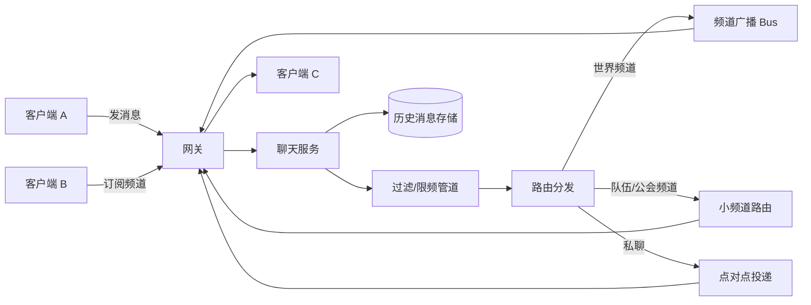
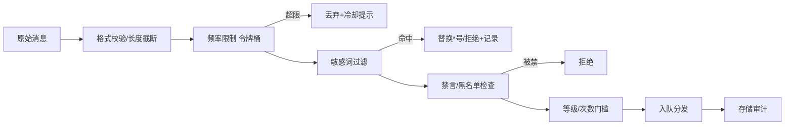
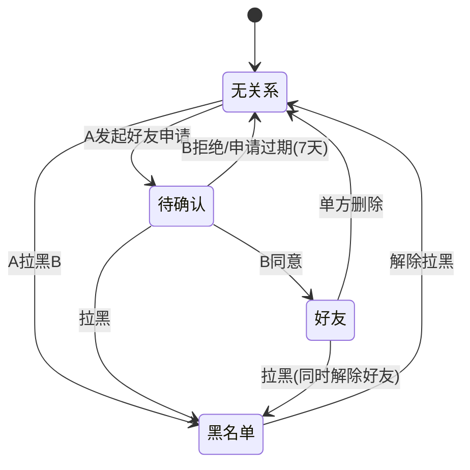
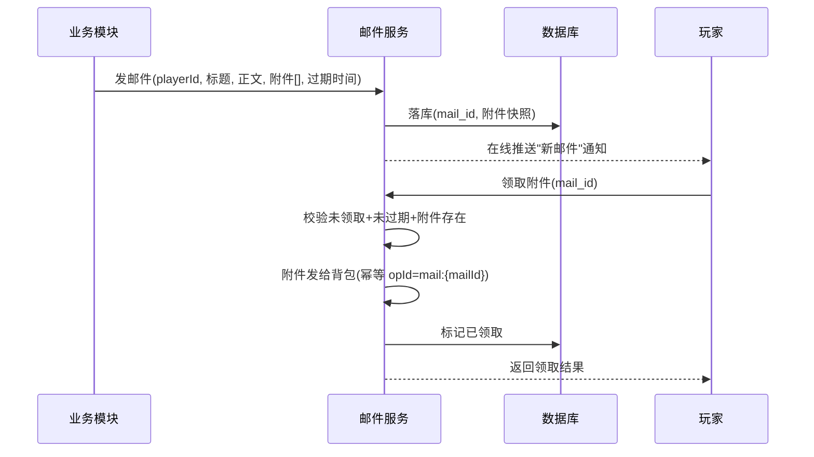

# 05-聊天与社交系统

> 聊天（Chat）与社交（Social）系统承载玩家的沟通与关系：世界频道、私聊、好友、邮件、公会。聊天是**高吞吐、低延迟**的消息系统（每秒数万条消息），社交数据是典型的**关系型玩家数据**（好友、公会、邮件）。两者结合，构成了"玩家与玩家"的服务端基础设施。

## 一、概述

聊天与社交系统要解决的核心问题：

1. **消息怎么传**：频道模型（世界/区域/队伍/公会/私聊）、消息路由与分发、广播架构与水平扩展；
2. **消息怎么管**：敏感词过滤、频率限制、禁言/封禁、历史消息存储与拉取；
3. **关系怎么存**：好友请求/关系状态机、在线状态（Presence）、黑名单；
4. **离线怎么达**：邮件系统（含附件、过期、领取幂等），以及公会的成员/权限/仓库模型。

设计总原则：

- **聊天链路可丢弃、可降级**：聊天的可靠性要求低于资产系统——消息丢失可接受（最多补发历史），但不能拖垮主服务；通常独立部署、限流降级；
- **社交数据服务端权威**：好友关系、邮件附件、公会成员都以服务端为准，客户端只是展示；
- **一切交互留痕**：聊天消息（含私聊）与邮件都保留审计能力，服务合规与客服查询。

## 二、核心概念

| 概念 | 英文 | 说明 | 关键点 |
| --- | --- | --- | --- |
| 频道 | Channel | 消息的收件范围：世界/区域/队伍/公会/私聊 | 订阅-发布模型 |
| 世界频道 | World Channel | 全服广播 | 限流最严、敏感词最严 |
| 私聊 | Whisper / PM | 点对点消息 | 在线直发 + 离线转邮件 |
| 消息路由 | Message Routing | 按频道把消息送达目标 | 扇出（fan-out） |
| 敏感词过滤 | Word Filter | 屏蔽违规词汇 | AC 自动机/哈希集 |
| 频率限制 | Rate Limit | 单位时间消息条数上限 | 令牌桶/滑动窗口 |
| 好友 | Friend | 双向确认的关系 | 状态机：请求→确认 |
| 在线状态 | Presence | 好友是否在线的实时信息 | 上下线事件推送 |
| 邮件 | Mail | 异步消息 + 附件载体 | 附件领取幂等、过期 |
| 公会 | Guild | 玩家组织：成员/职位/仓库 | 权限模型 |

## 三、原理详解

### 3.1 聊天架构：频道、路由与分发



**频道模型**：每个频道是一个"逻辑收件箱"，客户端通过网关订阅。频道分类：

| 频道 | 范围 | 广播方式 | 管控 |
| --- | --- | --- | --- |
| 世界频道 | 全服 | 消息总线扇出 | 冷却 + 强敏感词 + 等级门槛 |
| 区域频道 | 同地图 | 按区域路由 | 地图服务关联 |
| 队伍/房间频道 | 同队 | 小集合直推 | 会话生命周期内有效 |
| 公会频道 | 同公会 | 公会成员集合 | 公会长禁言权限 |
| 私聊 | 1:1 | 点对点 | 黑名单拦截 |
| 系统频道 | 全服 | 服务端广播 | 运营公告，不走玩家过滤 |

**水平扩展**：

- 聊天服务多实例部署，**按频道哈希分片**（世界频道单点分片负责，或 Redis Pub/Sub 广播）；
- 连接在网关层保持（长连接），聊天服务与网关通过内部消息队列通信——客户端感知不到聊天服务实例变化；
- 大型世界频道用"分片广播"：按在线人数切片（频道 A/B/C 分片），或降级为"附近频道"避免全服扇出风暴；
- 消息队列（Kafka/RabbitMQ）做削峰：客户端发消息 → 入队 → 聊天服务消费处理 → 分发，天然支持背压。

### 3.2 消息处理管道：过滤与限频



**敏感词过滤**：

- 词库用 **AC 自动机（Aho-Corasick）** 或 Trie 构建的多模式匹配，单条消息匹配 O(消息长度 + 命中数)，支持千级词库实时过滤；
- 应对"变体规避"（谐音、拆字、插符号）：过滤前做归一化（全半角转换、去分隔符、字母小写、常见替换映射）；
- 词库分层：硬屏蔽（直接拒绝）与软替换（`*` 打码）；命中记录日志供运营调词；
- 词库热更新：配置中心下发版本号，各实例异步加载，不重启服务；
- 私聊同样过滤（合规要求），但可适度宽松，配合举报机制。

**频率限制（Rate Limit）**：

- 世界频道：令牌桶（如 1 条/5 秒，突发 3 条），超出拒绝并返回冷却时间；
- 私聊：滑动窗口（如 10 条/10 秒），防骚扰刷屏；
- 限频维度：玩家、IP、设备；举报高频玩家触发临时降级（只允许私聊/队伍频道）；
- 限频在网关与聊天服务双重执行（网关粗限、服务精限）。

### 3.3 好友系统：关系状态机与在线状态



要点：

- **好友申请**：双向确认（同意/拒绝），申请存 7 天过期；单方删除即解除，无需对方同意；
- **黑名单**：拦截私聊、好友申请、组队邀请；黑名单关系单向（A 拉黑 B，B 仍可见 A，但消息被服务端丢弃）；
- **在线状态（Presence）**：玩家上下线/切场景时发 Presence 事件，好友列表订阅者收到推送（上线提醒、状态徽标）；大规模场景用"拉取 + 推送"结合（进入好友列表时批量拉取，变化时增量推送）；
- **防骚扰**：好友申请频率限制、陌生私聊需"接受陌生人消息"开关（默认关）；
- **关系数据存储**：`friend_relation` 一行一对（uid 小者在前防重复），双向查询走联合索引；百万级好友关系用关系表 + 缓存。

### 3.4 邮件系统：附件、过期与幂等

邮件是"离线可达 + 附件发放"的标准载体（系统补偿、活动奖励、好友礼物）：



设计要点：

- **附件快照**：邮件落库时把附件内容（道具 ID+数量）**快照**进 mail 表，避免"邮件发出后道具模板下线导致附件失效"；
- **过期策略**：邮件带 `expires_at`，过期自动删除（定时任务清理 + 查询时过滤）；附件未领取过期即消失（邮件本身有说明）；
- **领取幂等**：`(playerId, mailId)` 唯一，领取接口幂等（并发双击只发一次），发奖走背包幂等接口；
- **上限保护**：邮箱容量上限（如 100 封）、附件总上限，满了提示清理；系统补偿类邮件可"强制置顶/不可删除"；
- **存储**：邮件是低频写、低频读，可独立分表；全服群发邮件用"模板 + 按需实例化"（读时生成），避免海量行。

### 3.5 公会系统简述

公会（Guild / Clan）是多人组织模型，核心数据：

| 表 | 字段要点 | 说明 |
| --- | --- | --- |
| guild | 公会 ID、名称、徽章、宣言、等级、经验、资金 | 组织本体 |
| guild_member | 玩家 ID、职位（会长/副会长/成员）、入会时间、活跃度 | 成员与权限 |
| guild_log | 成员变动、资金变动流水 | 审计 |
| guild_warehouse | 公会仓库道具（权限领取） | 公共资产 |
| guild_apply | 申请入会列表 | 审核流 |

要点：

- **创建**：消耗资源（如 500 金币）+ 冷却，名称唯一性校验（敏感词/长度）；
- **权限**：会长转让、踢人、公告、仓库存取、职位任免——每个操作校验权限位；
- **资金**：公会资金变动走货币流水（reason=guild），防止挪用纠纷；
- **活跃与解散**：活跃度统计，长期不活跃自动降级/解散（会长离线 X 天自动转让）；
- **跨服公会**：需公会数据全局化 + 跨服成员在线态聚合，复杂度高，一般后期再做。

## 四、设计示例

### 4.1 表结构（SQL）

```sql
-- 聊天消息（按需留存，可入冷存储）
CREATE TABLE chat_message (
  id         BIGINT AUTO_INCREMENT PRIMARY KEY,
  channel    TINYINT      NOT NULL,      -- 1=世界 2=区域 3=队伍 4=公会 5=私聊 6=系统
  channel_key VARCHAR(64) NOT NULL,      -- 频道定位: world / guild:1001 / team:88213 / p2p:uid1:uid2
  sender_id  BIGINT       NOT NULL,
  content    VARCHAR(512) NOT NULL,
  filtered   TINYINT      NOT NULL DEFAULT 0, -- 是否命中敏感词(替换)
  created_at DATETIME     NOT NULL DEFAULT CURRENT_TIMESTAMP,
  KEY idx_channel_time (channel, channel_key, id)
) PARTITION BY RANGE (TO_DAYS(created_at)) PARTITIONS 30; -- 按月滚动

-- 好友关系（双向确认，小 uid 在前）
CREATE TABLE friend_relation (
  uid_a      BIGINT   NOT NULL,
  uid_b      BIGINT   NOT NULL,
  status     TINYINT  NOT NULL,          -- 0=待确认 1=好友 2=黑名单
  apply_by   BIGINT   NOT NULL,          -- 申请方
  created_at DATETIME NOT NULL DEFAULT CURRENT_TIMESTAMP,
  updated_at DATETIME NOT NULL DEFAULT CURRENT_TIMESTAMP ON UPDATE CURRENT_TIMESTAMP,
  PRIMARY KEY (uid_a, uid_b),
  KEY idx_b (uid_b, status)
) PARTITION BY HASH(uid_a) PARTITIONS 64;

-- 邮件
CREATE TABLE player_mail (
  mail_id    BIGINT AUTO_INCREMENT PRIMARY KEY,
  player_id  BIGINT      NOT NULL,
  title      VARCHAR(64) NOT NULL,
  content    VARCHAR(512) NOT NULL DEFAULT '',
  attach_json JSON       NULL,           -- 附件快照 [{itemId, count}]
  is_read    TINYINT     NOT NULL DEFAULT 0,
  is_claimed TINYINT     NOT NULL DEFAULT 0,
  expires_at DATETIME    NOT NULL,       -- 过期时间
  created_at DATETIME    NOT NULL DEFAULT CURRENT_TIMESTAMP,
  KEY idx_player (player_id, created_at),
  UNIQUE KEY uk_mail_claim (player_id, mail_id)
) PARTITION BY HASH(player_id) PARTITIONS 64;

-- 公会
CREATE TABLE guild (
  guild_id   INT PRIMARY KEY AUTO_INCREMENT,
  name       VARCHAR(32) NOT NULL,
  icon       INT         NOT NULL DEFAULT 0,
  notice     VARCHAR(256) NOT NULL DEFAULT '',
  level      INT         NOT NULL DEFAULT 1,
  funds      BIGINT      NOT NULL DEFAULT 0,
  leader_id  BIGINT      NOT NULL,
  member_cnt INT         NOT NULL DEFAULT 1,
  created_at DATETIME    NOT NULL DEFAULT CURRENT_TIMESTAMP,
  UNIQUE KEY uk_name (name)
);

CREATE TABLE guild_member (
  guild_id   INT    NOT NULL,
  player_id  BIGINT NOT NULL,
  position   TINYINT NOT NULL DEFAULT 3, -- 1=会长 2=副会长 3=成员
  activity   INT    NOT NULL DEFAULT 0,
  joined_at  DATETIME NOT NULL DEFAULT CURRENT_TIMESTAMP,
  PRIMARY KEY (guild_id, player_id),
  KEY idx_player (player_id)
);
```

### 4.2 消息处理管道伪代码（Go 风格）

```go
// 聊天消息处理：校验→限频→过滤→路由→分发→存储
func (s *ChatService) HandleMessage(msg *ChatMsg) {
    // 1. 基础校验：长度、频道合法性
    if len(msg.Content) == 0 || len(msg.Content) > 512 { return }
    // 2. 频率限制（令牌桶，按 玩家+频道）
    if !s.limiter.Allow(msg.SenderID, msg.Channel) {
        s.reject(msg.SenderID, "msg_too_fast"); return
    }
    // 3. 禁言/黑名单
    if s.mute.IsMuted(msg.SenderID, msg.Channel) { return }
    if msg.Channel == Whisper && s.blacklist.Blocked(msg.ToID, msg.SenderID) {
        return // 静默丢弃，不暴露被拉黑
    }
    // 4. 敏感词过滤（AC 自动机，归一化后匹配）
    msg.Content, msg.Filtered = s.filter.Sanitize(msg.Content)
    // 5. 路由分发
    switch msg.Channel {
    case World:   s.bus.Publish("world", msg)        // 总线扇出
    case Guild:   s.router.ToGuild(msg.GuildID, msg) // 公会成员集合
    case Team:    s.router.ToSession(msg.SessionID, msg)
    case Whisper:
        if online := s.presence.Get(msg.ToID); online != nil {
            s.presence.Push(online, msg)             // 在线直发
        } else {
            s.mail.Send(msg.ToID, 系统, msg.SenderName+"的私信", 正文, nil) // 离线转邮件
        }
    }
    // 6. 异步存储（聊天消息异步落库，可丢）
    s.store.AsyncAppend(msg)
}
```

### 4.3 邮件发放与领取伪代码

```go
// 发放邮件（系统补偿/活动奖励）
func (s *MailService) Send(playerID int64, title, content string, attach []ItemGrant, expireHours int) (int64, error) {
    mailID := s.idGen.Next()
    // 附件快照落库；内容直接存 JSON
    s.db.Insert(&PlayerMail{
        MailID: mailID, PlayerID: playerID, Title: title, Content: content,
        AttachJSON: marshal(attach), ExpiresAt: now().Add(time.Duration(expireHours)*time.Hour),
    })
    // 在线则推送红点
    if c := s.presence.Get(playerID); c != nil { c.Push("mail.new", mailID) }
    return mailID, nil
}

// 领取附件（幂等：唯一键 + 条件更新）
func (s *MailService) Claim(playerID int64, mailID int64) error {
    // 条件更新：未领取且未过期（影响行数=0 → 已领取/已过期/不存在）
    n := s.db.Exec(
        `UPDATE player_mail SET is_claimed=1
          WHERE player_id=? AND mail_id=? AND is_claimed=0 AND expires_at>NOW()`,
        playerID, mailID)
    if n == 0 { return ErrClaimedOrExpired }
    mail := s.db.Get(playerID, mailID)
    // 发奖走背包幂等接口（opId = mail:{mailID}）
    return s.inventory.Grant(playerID, mail.Attach, "mail:"+strconv.FormatInt(mailID, 10), "mail")
}
```

## 五、最佳实践

1. **聊天与主逻辑隔离**：独立服务/进程部署，聊天服务故障只影响聊天，不影响对局与资产；支持降级（关闭世界频道保对局）；
2. **消息链路允许丢失**：聊天不做强可靠（与资产系统不同），用"在线直发 + 历史拉取"弥补，别把聊天做成事务系统；
3. **过滤限频前置**：在网关层先做粗过滤与限频，避免无效消息进入核心链路；敏感词在服务端统一执行，客户端过滤只是体验优化；
4. **私聊离线转邮件**：统一"离线可达"通道，避免单独维护离线消息队列；
5. **邮件附件快照 + 幂等领取**：模板变更不影响已发邮件；并发领取不重复；
6. **社交数据分片 + 缓存**：好友/邮件按玩家哈希分片，Presence 用 Redis，关系查询走缓存 + 冷数据落库；
7. **审计与合规**：私聊与全服频道消息按政策留存，支持客服查询与举报处理；删除请求（合规）要有流程；
8. **反滥用**：世界频道等级门槛 + 冷却、小号刷屏检测（同 IP/设备聚合）、举报加权自动禁言。

## 六、常见问题（FAQ）

**Q1：世界频道刷屏怎么办？**
令牌桶限频 + 等级门槛 + 同 IP/设备聚合检测 + 举报加权。运营可临时开启"全服禁言/世界频道冷却翻倍"开关。

**Q2：敏感词误杀正常聊天（如地名、ID）？**
词库分层 + 白名单 + 上下文规则（如"武器名"不在硬屏蔽层）；误杀申诉渠道 + 命中记录回放，持续调词。

**Q3：私聊消息丢了？**
聊天允许丢失，但可改进：在线直发失败（目标瞬间断线）→ 转离线邮件；重连后拉取最近 N 条历史补漏。

**Q4：邮件附件过期没领，能补发吗？**
过期即清理是规则；系统补偿类邮件建议设长过期（30 天）+ 全服补发活动兜底。已过期附件原则上不补（除非运营特批，走人工发放留痕）。

**Q5：跨服聊天/跨服好友怎么做？**
聊天：全局路由中心按频道转发（世界频道跨服广播成本高，一般只做跨服好友/私聊）；好友：关系数据全局化，Presence 聚合各服在线状态。复杂度高，建议分阶段。

**Q6：公会会长长期不上线，公会瘫痪？**
活跃度机制：会长离线 N 天自动转让给活跃副会长/成员；解散前有公示期。权限操作全部记录 guild_log 审计。

**Q7：有人用小号给大号送邮件/礼物刷资源？**
礼物类邮件限频 + 价值上限 + 绑定规则（受赠道具绑定）；异常模式（同设备多号互赠）风控标记，必要时回收。

## 七、关联阅读

- [01-消息系统与事件驱动](../01-架构与网络/04-消息系统与事件驱动.md)：频道订阅发布、消息队列削峰、可靠投递
- [01-网络通信与协议设计](../01-架构与网络/02-网络通信与协议设计.md)：长连接网关、心跳与在线状态
- [01-并发与高性能](../01-架构与网络/05-并发与高性能.md)：高吞吐消息处理的背压与降级
- [02-缓存与排行榜系统](../02-数据与业务/02-缓存与排行榜系统.md)：Presence 与关系数据的 Redis 缓存
- [01-背包与道具系统](01-背包与道具系统.md)：邮件附件发放的幂等接口
- [02-安全与反作弊](../02-数据与业务/04-安全与反作弊.md)：敏感词审计、防滥用风控
