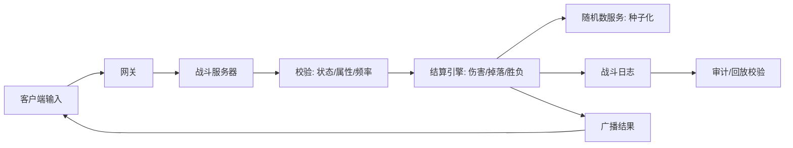
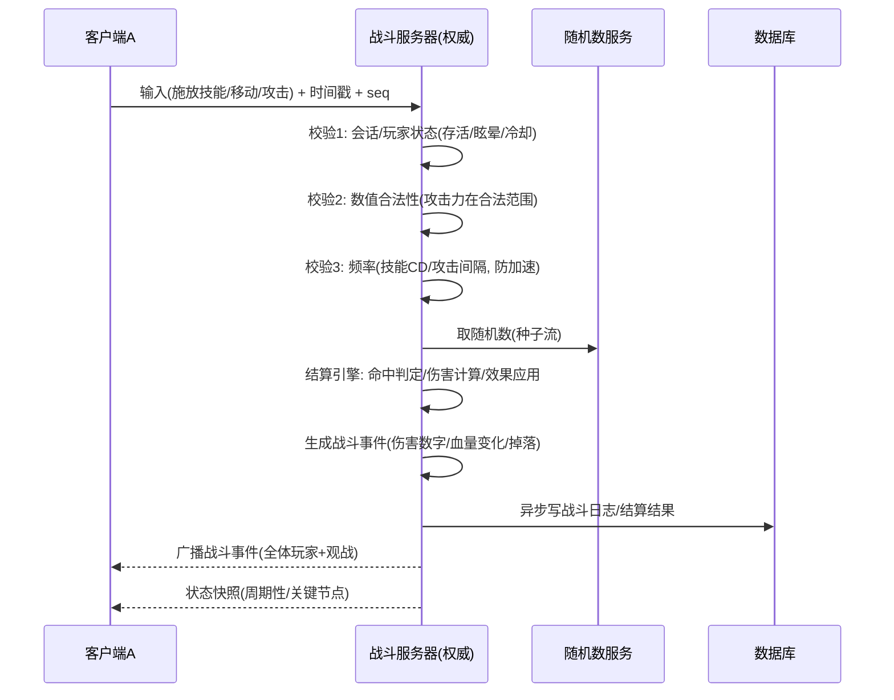
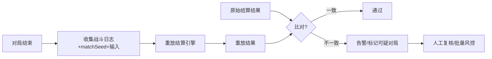

# 06-战斗结算与验证

> 知识基线：实时游戏服务端通用架构；示例中的语言、数据库、缓存、容器和云平台版本必须以项目部署清单为准。
> 适用范围：覆盖网关输入、房间/游戏服战斗权威、结算、掉落/资产流水、回放与运营审计；客户端只在表现边界内。
> 事实边界：协议规范、组件行为和示例方案分开；容量数字只作示意/经验值，必须通过压测验证。
> 最后更新：2026-08-06（补齐规范来源、版本边界与工程验收入口）。
> 版本边界：以 2026-08-06 为核对日，不新增不确定的当前组件版本号；逻辑/物理、协议库、数据库、Redis 和容器版本由项目部署清单锁定。
> 参考来源：[QUIC RFC 9000](https://www.rfc-editor.org/rfc/rfc9000.html)、[Protocol Buffers 官方文档](https://protobuf.dev/)、[PostgreSQL 官方文档](https://www.postgresql.org/docs/)、[OpenTelemetry 官方文档](https://opentelemetry.io/docs/)。

### P0 权威结算与回放验收

| 验收项 | 设计基线 | 证据入口 |
| --- | --- | --- |
| 业务流水 | 输入、命中、伤害、掉落、胜负和资产发放带 matchId/frame/seq、opId、随机/规则版本和前后值 | 战斗日志、背包/货币流水和结算结果可逐局对账 |
| 幂等 | 输入 seq、结算 batch、奖励发放和重连补发按局/帧/业务键去重；重试不重复结算 | 重复包、乱序包、断线重连、服务重启和补偿重放均可验证 |
| 审计 | 保存可脱敏的输入/结果摘要、规则版本、随机种子引用、风控判定、人工复核和 traceId | 举报可回放，异常结果可定位到输入、规则、资源和处置 |
| 服务端权威验证 | 客户端只提交输入/意图，服务端重取属性、校验状态/频率/时间窗并计算命中、伤害、掉落和胜负 | 改属性、加速、改时间戳、伪造掉落和预测结果均不改变权威结算 |
| 版本兼容 | 输入/事件/回放 schema 只增不复用字段号；逻辑与配置版本随对局固化 | 新旧客户端、灰度服务端、回滚、观战和历史回放均有兼容矩阵 |

> 结论边界：确定性回放、延迟补偿窗口、随机源、日志保留和反作弊阈值是方案取舍；必须用跨平台复算、网络故障注入、资产对账和压测结果验收，不能把示例数字当成通用规则。

> 战斗结算（Battle Settlement）是服务端反作弊与公平性的终极战场：谁造成伤害、掉落什么、谁赢谁输，都必须由服务端权威计算。本文讲解战斗服务器权威流程（请求→校验→结算→广播）、伤害/掉落计算的落点、随机种子同步、结算防作弊（数值校验/回放校验）以及与客户端表现的一致性。

## 一、概述

战斗系统的核心矛盾：**客户端追求流畅表现，服务端追求权威正确**。解决思路是明确分工：

- **客户端**：渲染、操作输入、预测表现（插值/缓动），一切"看起来发生了什么"；
- **服务端**：判定与结算——技能是否命中、伤害多少、是否掉落、胜负归属，一切"实际上发生了什么"。

服务端战斗模块要解决四件事：

1. **权威流程**：从请求到广播的完整链路，任何一步都可校验、可审计、可重放；
2. **数值计算**：伤害、暴击、闪避、护甲、掉落——公式与随机在服务端执行；
3. **随机同步**：随机种子（Random Seed）管理，保证同一对局内所有参与方（含观战、回放）看到一致结果；
4. **防作弊验证**：数值校验（属性合法性、频率、异常峰值）、回放校验（确定性重放比对）、事后审计。



## 二、核心概念

| 概念 | 英文 | 说明 | 关键点 |
| --- | --- | --- | --- |
| 权威服务器 | Authoritative Server | 对局内所有判定的唯一权威 | 客户端只上报意图 |
| 结算引擎 | Settlement Engine | 伤害/掉落/胜负的纯计算模块 | 确定性（确定性关键） |
| 伤害公式 | Damage Formula | 攻防/穿透/暴击/减伤的计算规则 | 纯函数、可回放 |
| 掉落表 | Drop Table | 掉落内容与权重的配置 | 权重随机 |
| 随机种子 | Random Seed | 随机序列的起点 | 同种子同序列 |
| 伪随机 | PRNG | 确定性伪随机数生成器 | 服务端唯一随机源 |
| 回放 | Replay | 对局输入与结算的完整记录 | 确定性重放验证 |
| 数值校验 | Validation | 属性/伤害/频率的合法性检查 | 反作弊第一道门 |
| 状态同步 | State Sync | 权威状态定期/事件化同步客户端 | 与帧同步的区别 |
| 插值/预测 | Interpolation / Prediction | 客户端平滑表现手段 | 表现层，不影响判定 |
| 延迟补偿 | Lag Compensation | 服务端按延迟回滚判定（FPS） | 公平性折中 |

## 三、原理详解

### 3.1 战斗服务器权威流程：请求 → 校验 → 结算 → 广播



关键设计：

1. **输入先于一切**：客户端任何操作都是"意图（Intent）"，服务端校验后执行；客户端直接改本地血量只是"表现"，下一次状态同步会被服务端权威值覆盖；
2. **校验三连**：状态校验（是否存活、是否可行动）、数值校验（上报属性是否在合理区间）、频率校验（攻击间隔、技能冷却，防变速齿轮/加速外挂）；
3. **结算在服务端**：伤害公式、暴击判定、掉落在结算引擎内执行，引擎是**纯函数**（输入=状态+输入+随机流，输出=新状态+事件），保证可重放、可单测；
4. **广播**：结算产生的战斗事件广播给对局内所有人（含观战），客户端据此渲染；广播顺序即"事实顺序"，客户端不得自行排序；
5. **持久化**：战斗日志（关键事件序列）与结算结果（胜负、数据统计）异步落库，供战绩、回放、审计。

### 3.2 伤害与掉落计算的服务端执行

**伤害公式**（示例，具体数值由策划配置）：

```
基础伤害 = 攻击力 × 技能倍率
减免后   = 基础伤害 × (1 - 护甲/(护甲+护甲系数))        -- 递减式减伤
暴击判定 = rand() < 暴击率 → 伤害 × 暴击倍率
闪避判定 = rand() < 闪避率 → 伤害 = 0
最终伤害 = max(1, floor(减免后 × 随机浮动(0.95~1.05)))
```

服务端执行要点：

- **公式是配置驱动的纯函数**：所有参数（攻击、防御、倍率、暴击率）来自模板/玩家属性，引擎不写死数值；
- **属性合法性校验**：结算前校验玩家属性（攻击力不可能 10 万，防御不可能为负），异常值直接拒绝并告警——防内存修改器；
- **边界处理**：伤害下限（至少 1 点）、免伤上限（不超过 90%）、溢出保护（INT64 范围）；
- **掉落（Drop Table）**：掉落表 = 条目集合（道具 ID + 权重 + 数量区间 + 条件），权重随机（`rand() * 总权重` 落桶）；稀有掉落带保底（第 N 次必出）；掉落结果先写日志再发背包。

```python
# 权重随机掉落伪代码
def roll_drop(drop_table, rng):
    total = sum(e.weight for e in drop_table.entries)
    r = rng.random() * total
    acc = 0
    for e in drop_table.entries:
        acc += e.weight
        if r < acc:
            return e  # 命中条目
    return drop_table.entries[-1]  # 兜底
```

### 3.3 随机种子同步

对局内所有随机判定（命中、暴击、掉落）必须来自**同一随机源**，否则不同客户端/回放看到的战斗不一致：

1. **对局种子**：对局创建时生成一个 `matchSeed`（如 64 位随机数），随对局信息广播给所有客户端与服务器实例；
2. **种子化随机流**：服务端用 `matchSeed` 初始化 PRNG（如 xorshift128+/PCG），结算引擎按**固定顺序**消费随机数（先判定命中、再判定暴击、再掉落……）；顺序固定是确定性的关键；
3. **独立流**：不同维度用不同种子流（`seed = hash(matchSeed, 维度名)`），避免"掉落随机数影响了暴击判定"的耦合问题；
4. **客户端表现随机**：客户端渲染可用自己的随机（如特效抖动），但**判定数字必须消费服务端广播的值**；
5. **回放**：记录 `matchSeed + 输入序列`，任何时刻重放得到完全一致的结算——这是回放校验的基础。

```go
// 种子化随机流（服务端结算专用）
func NewBattleRNG(matchSeed uint64, stream string) *PRNG {
    seed := fnv64a([]byte(fmt.Sprintf("%d:%s", matchSeed, stream)))
    return NewPCG(seed) // 确定性 PRNG
}
```

### 3.4 结算防作弊：数值校验与回放校验

**第一层：运行时校验（在线）**

- 属性校验：玩家战斗属性由服务端计算（装备+天赋+Buff），客户端上报属性一律以服务端为准；异常修改判作弊；
- 频率校验：攻击/技能间隔低于合法值（加速外挂）→ 拒绝输入 + 标记；心跳异常（变速）→ 断线或观战模式；
- 行为校验：伤害峰值、单帧操作数、移动速度异常（瞬移检测：位移超过合法速度 × 容差）；
- 校验不通过的处理：轻则丢弃输入，重则踢出对局 + 封禁标记（防作弊服务联动，见关联阅读）。

**第二层：回放校验（离线/异步）**



原理：结算引擎是确定性的（同输入同输出），所以"重放一遍"必须得到与线上完全一致的结果。不一致说明：引擎被篡改、日志被伪造、或存在未记录的随机消耗——都是严重信号。

**第三层：事后审计**

- 战斗日志长期留存（关键事件：伤害、击杀、掉落、胜负）；
- 异常画像：伤害异常高、胜率异常（99%+）、对局时间异常短（秒退刷奖励）；
- 与资产系统对账：战斗掉落 → 背包流水，数量必须吻合（掉 100 金、背包 +100 金，流水可查）。

### 3.5 与客户端战斗表现的一致性

两种同步模式下的"一致性"含义不同（详见关联阅读《帧同步与状态同步》）：

| 模式 | 判定权威 | 客户端表现 | 一致性手段 |
| --- | --- | --- | --- |
| 状态同步（MMO/ARPG） | 服务端结算 | 客户端预测 + 服务端广播校正 | 快照同步 + 插值/回滚 |
| 帧同步（RTS/格斗/MOBA） | 服务端校验输入、各端确定性计算 | 各端本地确定性演算 | 同种子 + 同输入序 + 断线重连追赶 |

一致性工程要点：

1. **事件序即事实序**：服务端广播顺序就是客户端表现顺序，客户端展示以事件到达顺序为准（不自行排序、不丢弃"不合理"事件）；
2. **预测与校正**：客户端预测自己的伤害/位移，收到服务端广播后校正（数值不符以服务端为准）；校正不能造成"血条回跳"太频繁——服务端每 N 帧快照一次，客户端插值平滑；
3. **关键状态服务端确认**：死亡、胜负、掉落等关键事件必须以服务端广播为准触发表现（客户端不能自己判定自己死了/赢了）；
4. **延迟补偿（Lag Compensation）**：FPS 类服务端按玩家延迟"回滚到过去"判定命中，补偿高延迟玩家的体验；补偿窗口有上限（如 250ms），避免滥用；
5. **断线重连**：重连后下发权威状态快照/当前帧号 + 输入日志，客户端回放追赶（见 04-匹配与房间系统 的断线重连小节）。

## 四、设计示例

### 4.1 表结构（SQL）

```sql
-- 对局战斗日志（关键事件，异步批量写入）
CREATE TABLE battle_log (
  id         BIGINT AUTO_INCREMENT PRIMARY KEY,
  match_id   VARCHAR(64) NOT NULL,
  seq        INT         NOT NULL,          -- 事件序号(事实顺序)
  ts_ms      BIGINT      NOT NULL,          -- 对局内相对时间(ms)
  event_type TINYINT     NOT NULL,          -- 1=伤害 2=治疗 3=击杀 4=掉落 5=胜负 6=输入校验失败
  attacker   BIGINT      NULL,
  target     BIGINT      NULL,
  skill_id   INT         NULL,
  damage     BIGINT      NULL,
  drop_json  JSON        NULL,              -- 掉落快照
  extra      JSON        NULL,
  UNIQUE KEY uk_match_seq (match_id, seq)
) PARTITION BY HASH(match_id) PARTITIONS 32;

-- 对局结算结果
CREATE TABLE battle_result (
  match_id      VARCHAR(64) PRIMARY KEY,
  mode          TINYINT     NOT NULL,
  match_seed    BIGINT      NOT NULL,       -- 随机种子(回放用)
  winner        BIGINT      NULL,
  players_json  JSON        NOT NULL,       -- 玩家及数据统计
  result_json   JSON        NOT NULL,       -- 结算细节(伤害榜/掉落汇总)
  replay_path   VARCHAR(255) NULL,          -- 回放文件(对象存储)
  verify_state  TINYINT     NOT NULL DEFAULT 0, -- 0=未校验 1=通过 2=不一致告警
  created_at    DATETIME    NOT NULL DEFAULT CURRENT_TIMESTAMP
) PARTITION BY HASH(match_id) PARTITIONS 32;

-- 掉落表（静态配置）
CREATE TABLE drop_table (
  table_id    INT NOT NULL,
  entry_id    INT NOT NULL,
  item_id     INT NOT NULL,
  weight      INT NOT NULL DEFAULT 1,
  count_min   INT NOT NULL DEFAULT 1,
  count_max   INT NOT NULL DEFAULT 1,
  condition_json JSON NULL,                 -- 掉落条件(等级/次数等)
  PRIMARY KEY (table_id, entry_id)
);
```

### 4.2 结算引擎伪代码

```go
// 结算引擎：纯函数，确定性（同输入同输出）
func SettleDamage(attacker *Unit, defender *Unit, skill *Skill, rng *PRNG) *BattleEvent {
    if defender.HP <= 0 || !attacker.Alive() { return nil }
    // 1. 命中判定（先于伤害）
    if rng.Float64() < defender.DodgeRate() { return DodgeEvent(attacker, defender) }
    // 2. 基础伤害 = 攻击 × 技能倍率
    base := float64(attacker.Attack) * skill.Rate
    // 3. 护甲递减减伤
    reduced := base * (1 - defender.Armor/(defender.Armor+armorCoeff))
    // 4. 暴击
    crit := rng.Float64() < attacker.CritRate()
    if crit { reduced *= attacker.CritDamage() }
    // 5. 随机浮动 0.95~1.05 并取下限
    final := max(1, int(math.Floor(reduced*(0.95+rng.Float64()*0.10))))
    defender.HP = max(0, defender.HP-final)
    ev := &BattleEvent{Type: Damage, Seq: nextSeq(), Attacker: attacker.ID,
        Target: defender.ID, SkillID: skill.ID, Damage: final, Crit: crit}
    if defender.HP == 0 { ev.Type = Kill; ev.Extra = map[string]any{"drop": RollDrop(defender.DropTable, rng)} }
    return ev
}

// 战斗主循环：按输入序列消费同一随机流
func BattleLoop(sess *Session) {
    rng := NewBattleRNG(sess.MatchSeed, "battle")
    for input := range sess.InputChan {     // 输入按到达顺序入队
        if !sess.Validate(input) {          // 状态/数值/频率校验
            sess.LogViolation(input); continue
        }
        evs := sess.Apply(input, rng)       // 结算引擎消费 rng
        for _, ev := range evs { sess.Broadcast(ev); sess.Log(ev) }
        if sess.IsOver() { sess.SettleAndPersist(); break }
    }
}
```

### 4.3 回放校验伪代码

```python
def verify_replay(match_id):
    # 1. 取对局记录：种子 + 输入序列 + 原始结算结果
    rec = load_battle_result(match_id)
    inputs = load_input_log(match_id)
    # 2. 用同一引擎重放
    replay = BattleEngine(seed=rec.match_seed)
    events = replay.run(inputs)
    # 3. 与原始日志逐条比对（seq 对齐）
    original = load_battle_log(match_id)
    ok = events == original   # 确定性引擎保证完全一致
    mark_verify(match_id, ok)
    return ok
```

## 五、最佳实践

1. **结算引擎纯函数化**：无 IO、无时钟、无全局状态，随机流显式注入；单测覆盖率拉满（伤害公式、边界、暴击分布）；
2. **随机种子全链路管理**：对局种子创建即定，广播所有参与方；维度独立种子流；随机消耗顺序固定；
3. **输入校验前置 + 分级处理**：非法输入丢弃/标记/踢出分级，别把所有校验堆在结算里；
4. **关键事件必落日志**：伤害、掉落、击杀、胜负、违规记录全量落日志（异步批量），支撑回放与审计；
5. **回放校验常态化**：抽样校验（如 1% 对局）+ 异常对局全量校验；不一致即告警；
6. **客户端一致性优先"事件序"**：广播序 = 表现序；关键状态（死亡/胜负/掉落）只认服务端；
7. **与资产系统对账**：掉落/奖励 → 背包/货币流水闭环，数量可对；
8. **性能**：结算引擎是 CPU 热点（每帧每单位），用对象池、批量日志、避免 GC 抖动；战斗服务器按对局隔离（一局一进程/容器），故障只影响单局；
9. **延迟补偿设上限**：补偿窗口越大越易被利用，FPS 类 250ms 是常见上限，配合服务端回滚判定。

## 六、常见问题（FAQ）

**Q1：玩家用内存修改器把攻击力改成 99999，能生效吗？**
不能。战斗属性由服务端从装备/天赋/Buff 计算，客户端上报数值仅作参考；结算时服务端重新取权威属性并校验合法性，异常值直接拒绝 + 标记。

**Q2：客户端预测的伤害和服务端广播不一致，血条乱跳？**
正常现象，关键是平滑：客户端预测值先展示，服务端广播到达后以权威值校正（插值过渡而非跳变）；死亡/胜负等关键事件只信服务端，可避免"假死/假赢"。

**Q3：回放校验不一致说明什么？**
说明线上结算与重放结果不同：引擎非确定性（用了未注入的随机/时钟）、日志被篡改、或输入序列缺失。触发全量告警 + 该对局标记可疑，人工复核。

**Q4：变速齿轮加速游戏，怎么防？**
频率校验：攻击/技能间隔低于合法值即拒绝；心跳与服务器时间戳比对（客户端上报时间与服务器时间偏差超阈值判异常）；疑似加速进入观战模式。

**Q5：玩家掉线了，战斗怎么算？**
掉线由 AI 托管或原地不动，判定照常进行（服务端权威）；结算结果照常落库，重连后补发结算；挂机标记影响奖励与惩罚（见 04-匹配与房间系统）。

**Q6：高延迟玩家说"我明明打中了"？**
延迟补偿：服务端按玩家延迟回滚到"开枪瞬间"判定命中，让高延迟玩家体验公平；补偿窗口有上限，超过上限的"打中"不成立（防滥用）。

**Q7：刷掉落（反复开本刷稀有道具）怎么管控？**
掉落保底 + 每周掉落上限 + 收益递减（同一副本连续刷收益下降）；掉落全部记日志并与背包流水对账，异常掉落触发风控。

## 七、关联阅读

- [01-帧同步与状态同步](../01-架构与网络/03-帧同步与状态同步.md)：状态同步/帧同步下的判定与表现分工、预测回滚
- [01-网络通信与协议设计](../01-架构与网络/02-网络通信与协议设计.md)：输入序列、时间戳、心跳与延迟补偿
- [01-并发与高性能](../01-架构与网络/05-并发与高性能.md)：结算引擎性能优化、一局一进程隔离
- [02-安全与反作弊](../02-数据与业务/04-安全与反作弊.md)：运行时校验、异常画像、封禁联动
- [02-数据库选型与存储设计](../02-数据与业务/01-数据库选型与存储设计.md)：战斗日志批量写入与分区归档
- [04-匹配与房间系统](04-匹配与房间系统.md)：对局生命周期、断线重连与服务器分配
