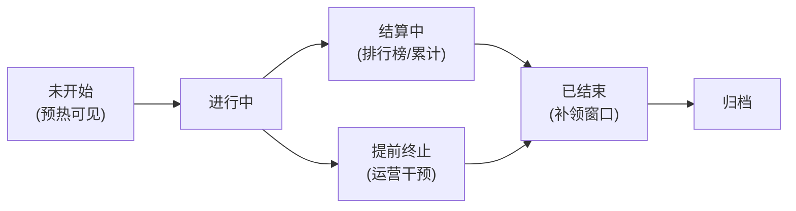

# 活动与运营系统

> 知识基线：引擎无关的游戏服务端业务设计通用原理；活动系统是"限时内容 + 奖励投放 + 运营配置"的线上玩法载体，与任务（02）、商城（03）、邮件（05）联动；涉及客户端表现以[游戏知识/03-游戏玩法编程/README.md](../../游戏知识/03-游戏玩法编程/README.md)为交叉验证边界。
> 适用范围：限时活动（登录/签到/副本/排行/转盘）、运营配置后台、活动热更新与灰度、并发抢购与奖励发放、防刷与风控。
> 事实边界：活动系统无标准实现，本文给出通用数据模型与工程模式；具体表结构/接口/并发方案需按项目技术栈落地；奖励发放必须走事务与幂等（与背包/商城一致）。
> 最后更新：2026-08-07。
> 参考来源：[Wikipedia: Live service game](https://en.wikipedia.org/wiki/Live_service_game)（GaaS 运营模式参考）。

> 活动系统是"游戏即服务"（GaaS）的发动机：把新内容、奖励、排行、福利以**配置化、限时化**的方式投给玩家，驱动留存与付费。它的工程难点不在玩法本身，而在**配置热更、并发发放、防刷风控、与多系统联动**——本文给出完整的数据模型与流程设计。

---

## 一、概述

### 1.1 活动系统的定位


*图释：活动系统的核心链路——配置驱动、服务端权威、发放走既有资产系统。*

### 1.2 活动分类

| 类型 | 形态 | 典型 | 关键点 |
| --- | --- | --- | --- |
| 登录/签到 | 按天领取 | 七日签到 | 补签/跨天结算 |
| 任务型 | 完成条件领奖 | 限时任务 | 与任务系统联动 |
| 排行型 | 按分数排名发奖 | 冲榜赛 | 排名结算/防刷 |
| 概率型 | 抽奖/转盘 | 限时转盘 | 概率公示/保底 |
| 副本/玩法 | 限时玩法入口 | 活动副本 | 独立房间/匹配 |
| 促销型 | 限时折扣/礼包 | 节日礼包 | 与商城联动 |

---

## 二、核心概念

| 概念 | 英文 | 一句话定义 | 说明 |
| --- | --- | --- | --- |
| 活动定义 | Activity Definition | 活动的静态配置（时间/规则/奖励） | 配置表 |
| 活动实例 | Activity Instance | 一次活动的运行状态 | 每服/每区一份 |
| 时间窗 | Time Window | 开始/结束时间（含时区） | 服务器时间权威 |
| 参与资格 | Eligibility | 谁能参与（等级/区服/白名单） | 条件检查 |
| 进度 | Progress | 玩家在活动中的累计状态 | 分片存储 |
| 领取 | Claim | 玩家领取奖励的动作 | 幂等 + 事务 |
| 结算 | Settlement | 排行/累计类活动的终局发奖 | 定时任务 |
| 防刷 | Anti-farming | 检测与拦截异常参与 | 风控联动 |
| 热更新 | Hot Update | 活动配置不重启生效 | 配置版本管理 |
| 灰度 | Canary | 部分区服先上验证 | 运营安全 |

---

## 三、原理详解

### 3.1 数据模型

```text
// 伪代码：活动数据模型（节选/示意）
ActivityDef {
    id, name, type,                 // 定义
    start_time, end_time, timezone,
    eligibility: { min_level, zones, whitelist },
    rewards: [ {cond, items, mail_template} ],
    settlement: { mode: NONE/RANK/TOTAL, at_end }
}

PlayerActivityState {
    player_id, activity_id,
    progress: map[string]int,       // 累计进度
    claimed: set[string],           // 已领取档位（幂等）
    joined_at, last_update,
    version                        // 乐观锁/防并发
}
```

关键设计：

- **定义与状态分离**：配置可热更，玩家状态持久化；
- **活动 ID 全局唯一**：跨服/跨区活动用 `activity_id + zone` 复合主键；
- **状态分片**：进度表按活动分表（大活动独立表），避免热表竞争。

### 3.2 活动状态机



*图释：活动生命周期——预热、进行、结算、补领、归档；运营可提前终止。*

- **预热**：可见但不可参与（预约/倒计时）；
- **结算**：排行/累计类活动进入只读结算，防止"最后一秒刷分"；
- **补领窗口**：结束后的限时补领（如 24h），避免"刚结束没领到"投诉；
- **归档**：数据保留 N 天后清理或转离线分析。

### 3.3 领取流程（幂等与并发）

```text
// 伪代码：活动领取（节选/示意）
function claim_reward(player, activity_id, reward_id):
    def = get_activity(activity_id)
    validate(def, player)                    // 时间窗/资格/条件
    return with_transaction(player.db):
        state = lock_player_activity(player, activity_id)
        if reward_id in state.claimed:       // 幂等：重复领取直接成功返回
            return OK_ALREADY
        if not condition_met(def, state):    // 进度/档位校验
            return CONDITION_FAIL
        grant_items(player, def.rewards[reward_id].items)  // 走背包事务
        state.claimed.add(reward_id)
        save_state(state)
        audit_log(player, activity_id, reward_id, server_time)
```

要点：

- **行锁/乐观锁**：防止并发重复领取（玩家双端同时点领取）；
- **发放走统一资产接口**：与背包/邮件一致的事务与流水（见[01-背包与道具系统.md](01-背包与道具系统.md)）；
- **审计日志**：每次领取记 `player/activity/reward/time/server`，对账与风控都靠它。

### 3.4 排行/结算型活动

- **实时榜**：分数写入 Redis ZSet（见[游戏服务端/02-数据与业务/02-缓存与排行榜系统.md](../02-数据与业务/02-缓存与排行榜系统.md)），展示层读缓存；
- **结算发奖**：定时任务（结束时刻）从排行榜快照取 Top-N，批量发奖——**必须幂等**（任务可重跑）；
- **防刷**：分数校验（服务端权威计分）+ 频率限制 + 异常检测（分数突增/同设备多号）；
- **榜单一致性**：结算瞬间冻结榜单（写快照），避免"结束前后看到不同名次"。

### 3.5 概率型活动（转盘/抽卡）

- 概率表配置 + **服务端权威随机**（种子可回放，见[游戏算法/03-工程与实用技巧/01-随机数与洗牌算法.md](../../游戏算法/03-工程与实用技巧/01-随机数与洗牌算法.md)）；
- 保底机制（N 次未中必出）状态持久化；
- 概率公示与合规（部分地区要求公示概率）；
- 风控：抽奖频率、批量小号检测。

### 3.6 热更新与灰度

| 手段 | 说明 |
| --- | --- |
| 配置热更 | 活动定义存配置中心（DB/JSON/表格），客户端按版本拉取 |
| 版本兼容 | 配置带 `schema_version`，旧客户端跳过未知字段 |
| 灰度 | 先白名单/小服上线，观察指标（参与率/崩溃/风控告警）再全量 |
| 回滚 | 活动可随时"提前终止"，奖励已发部分不回滚（记录在案） |
| 定时生效 | 时间窗基于服务器时钟，避免客户端改时间钻空子 |

### 3.7 与周边系统的联动

- **任务**：限时任务 = 活动条件引用任务系统；
- **商城**：活动礼包 = 商城商品 + 活动限时标记（见[03-商城与经济系统.md](03-商城与经济系统.md)）；
- **邮件**：活动奖励批量发放走邮件（附件过期策略见[05-聊天与社交系统.md](05-聊天与社交系统.md)）；
- **匹配**：活动玩法入口复用房间/匹配服务（见[04-匹配与房间系统.md](04-匹配与房间系统.md)）；
- **数据**：参与/转化/付费埋点回流运营后台（监控与日志体系见[05-部署运维与监控.md](../02-数据与业务/05-部署运维与监控.md)）。

### 3.8 签到系统设计

签到是最高频的运营活动，工程要点值得单列：

```text
// 伪代码：签到判定（节选/示意）
function daily_sign(player):
    today = server_date(player.timezone)
    if player.last_sign_date == today:
        return ALREADY_SIGNED              // 幂等
    day = next_sign_day(player)            // 连续签到天数（或固定第 N 天）
    grant_items(player, sign_table[day].reward)
    player.last_sign_date = today
    player.sign_streak = day
    audit("sign", player, day, server_time)
```

关键设计：

- **服务端日期**：按玩家时区计算"今天"，防跨时区作弊；
- **连续/累计**：连续签到（断签重计）与累计签到（周期循环）两种模式，周期循环用"第 N 天 % 周期"；
- **补签**：补签卡/付费补签——补签不能影响连续性判定（记录补签标记）；
- **月重置**：每月 1 日重置周期，重置前结算上月未领奖励（邮件补发）。

### 3.9 并发与锁的详细设计

活动高频操作（领取/抽奖）的并发控制：

| 方案 | 粒度 | 适用 | 说明 |
| --- | --- | --- | --- |
| 玩家行锁 | 玩家维度 | 领取/抽奖 | `SELECT ... FOR UPDATE` 或 Redis 分布式锁（玩家 ID 为 key） |
| 活动行锁 | 活动维度 | 结算 | 结算任务单实例（分布式锁 + 幂等标记） |
| 乐观锁 | 版本号 | 低频更新 | 更新时比对 version，冲突重试 |
| 队列串行 | 玩家消息队列 | 高并发领取 | 同一玩家请求串行处理 |

注意事项：

- 锁粒度要细（玩家级），避免活动级锁放大阻塞；
- 锁超时与续期（Redis 锁防死锁）；
- 领取入口做**频率限制**（如 1 秒 1 次），防脚本狂点。

---

## 四、伪代码/示例：结算任务

```text
// 伪代码：排行榜活动结算（节选/示意）
function settle_rank_activity(activity_id):
    def = get_activity(activity_id)
    if def.settlement.done: return          // 幂等重跑保护
    snapshot = rank_snapshot(def.rank_key)  // 冻结榜单
    for rank, entry in snapshot.top_n(def.settlement.top_n):
        grant_items(entry.player, def.settlement.rewards[rank])
        send_mail(entry.player, "活动奖励", ...)
    mark_settled(activity_id, len(snapshot))
    audit("settle", activity_id, count=len(snapshot))
```

---

## 五、最佳实践

1. **配置驱动一切**：新活动 = 新配置，不写新代码；活动类型扩展才动代码。
2. **幂等是底线**：领取/结算/发奖全部幂等，重复调用无害。
3. **服务端权威时间**：时间窗、签到日切都看服务器时钟（统一时区）。
4. **并发防护**：领取行锁/乐观锁；结算任务单实例执行（分布式锁）。
5. **防刷前置**：频率限制、资格校验、异常检测在活动服务入口做。
6. **审计日志全量**：领取、结算、终止、异常全记流水，可对账可追责。
7. **热更灰度回滚**：配置版本化 + 白名单灰度 + 一键提前终止。
8. **分表分片**：大活动独立表/独立 Redis key，防热键。
9. **监控告警**：参与率、领取成功率、结算耗时、风控拦截数接入监控（见[游戏服务端/02-数据与业务/05-部署运维与监控.md](../02-数据与业务/05-部署运维与监控.md)）。
10. **活动复盘**：结束后输出参与/转化/收入复盘数据，指导下次活动设计。

---

## 六、常见问题 FAQ

1. **Q：活动配置改完怎么生效？** A：配置中心发布 + 版本号；服务端定时/推送拉取，客户端按版本拉取活动列表。
2. **Q：玩家重复领取怎么办？** A：幂等（claimed 集合 + 事务锁），重复请求返回"已领取"，不重复发货。
3. **Q：排行榜最后时刻被刷？** A：结算前 N 分钟冻结榜单 + 分数校验 + 异常检测；冻结后只读。
4. **Q：活动奖励发到一半服务挂了？** A：结算任务幂等可重跑；已发部分有流水，重跑时跳过。
5. **Q：跨服活动怎么做？** A：活动服务独立部署，跨服共享排行榜（聚合写入），玩家状态仍按服分片。
6. **Q：玩家改客户端时间能提前领吗？** A：不能——所有时间判定走服务端时钟；客户端仅展示。
7. **Q：活动数据量大（千万级参与）？** A：状态分表 + Redis 缓存进度 + 异步落库；排行榜用 ZSet 分片。
8. **Q：怎么防小号刷活动？** A：设备指纹/同设备多号检测、奖励价值阶梯（低价值高频可刷、高价值限次数）+ 风控阈值。
9. **Q：活动与版本兼容？** A：配置带 schema_version，客户端忽略未知字段；旧活动下架不删除定义（可回溯）。
10. **Q：怎么灰度新活动？** A：白名单服先上，盯参与率/错误率/风控告警，稳定后全量；异常一键终止。

---

## 七、关联阅读

- 本分类：[01-背包与道具系统.md](01-背包与道具系统.md) —— 奖励发放的事务与幂等基础；
- 本分类：[02-任务与成就系统.md](02-任务与成就系统.md) —— 限时任务与活动条件联动；
- 本分类：[03-商城与经济系统.md](03-商城与经济系统.md) —— 活动礼包与限购；
- 本分类：[04-匹配与房间系统.md](04-匹配与房间系统.md) —— 活动玩法入口的房间/匹配复用；
- 本分类：[05-聊天与社交系统.md](05-聊天与社交系统.md) —— 邮件批量发奖与过期策略；
- 数据：[02-缓存与排行榜系统.md](../02-数据与业务/02-缓存与排行榜系统.md) —— 排行活动的 ZSet 实现；
- 运维：[05-部署运维与监控.md](../02-数据与业务/05-部署运维与监控.md) —— 活动监控告警；
- 算法：[游戏算法/03-工程与实用技巧/01-随机数与洗牌算法.md](../../游戏算法/03-工程与实用技巧/01-随机数与洗牌算法.md) —— 概率型活动的随机与保底。

---

## 更新日志

- 2026-08-07：初稿。补齐"活动与运营系统"空白（P1）；涵盖活动分类、数据模型、状态机、领取幂等与并发、排行结算、概率型活动、热更灰度与防刷风控；引擎无关服务端业务层。

## 落地检查清单

### 常见反模式

1. **活动逻辑与业务代码耦合**：活动写在战斗/商城代码里，下线困难。
2. **奖励发放不幂等**：网络重试导致重复发奖，经济系统被刷爆。
3. **开服活动无峰值防护**：全服同时领奖，数据库被打满。
4. **概率活动无保底**：玩家体验极端，舆情风险。
5. **排行结算不做快照**：结算期间数据仍在变，结果不可信。
6. **活动下线即删数据**：补发与审计无依据。

- [ ] 活动配置数据驱动：配置表/DSL 与代码解耦，支持热更与灰度。
- [ ] 活动生命周期状态机完整：预告-开启-结束-结算-下架-补发，含异常回滚。
- [ ] 奖励发放幂等：同一领取请求重复提交只发一次（联动 04-01 幂等）。
- [ ] 批量与异步发放有补偿与对账，失败可重放不重复。
- [ ] 并发与峰值防护：开服活动有分流、缓存与限流，防雪崩。
- [ ] 概率型活动（抽奖/翻牌）使用确定性随机与保底，服务端权威。
- [ ] 排行类活动结算快照与异步落库，防刷与最终一致性有验证。
- [ ] 与任务/商城/邮件联动的事件闭环可观测（埋点指路 02-06）。
- [ ] 风控：领奖接口频控、黑名单、异常模式检测。
- [ ] 活动下线有数据保留与补发预案，事故可回滚。

### 术语速查

| 术语 | 英文 | 一句话解释 |
| --- | --- | --- |
| 活动配置化 | Config-driven Campaign | 通过配置而非发版上线活动 |
| 活动状态机 | Campaign State Machine | 预热/开启/结算/下架等状态流转 |
| 幂等发放 | Idempotent Reward | 重复请求不重复发奖 |
| 补偿 | Compensation | 失败发放的补发与对账 |
| 保底 | Pity System | 概率活动中的保底机制 |
| 结算快照 | Settlement Snapshot | 排行结算时的数据固定 |
| 防刷 | Anti-fraud | 对重复/异常领取的风控 |
| 灰度 | Canary | 活动按比例/分区逐步开放 |
