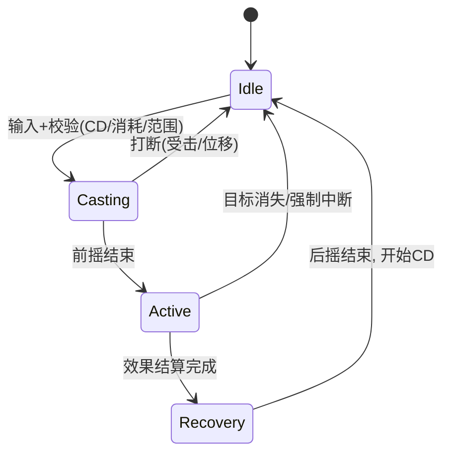

# 技能与战斗框架（服务端）

> 知识基线：引擎无关的游戏服务端业务设计通用原理；本文覆盖数据驱动的技能表、技能状态机、Buff 管理、伤害管线与服务端权威校验，与[06-战斗结算与验证.md](06-战斗结算与验证.md)（结算与反作弊）分工互补；客户端技能表现（GAS 等）见[游戏知识/03-游戏玩法编程/01-GameplayAbilitySystem能力系统.md](../../游戏知识/03-游戏玩法编程/01-GameplayAbilitySystem能力系统.md)与[游戏知识/06-网络同步/README.md](../../游戏知识/06-网络同步/README.md)。
> 适用范围：MMORPG/MOBA/ARPG 的技能系统服务端实现、技能数值策划配置、Buff 叠加与驱散、伤害计算管线、以及联网战斗的技能一致性。
> 事实边界：技能框架无标准实现，本文给出通用模式（技能表/状态机/Buff/伤害管线）；UE 的 GAS 是其客户端/服务器一体化实现，细节以官方文档为准；具体数值公式与性能需按项目实测。
> 最后更新：2026-08-07。
> 参考来源：[Unreal Engine: Gameplay Ability System](https://dev.epicgames.com/documentation/en-us/unreal-engine/gameplay-ability-system-for-unreal-engine)（GAS 官方文档，作为实现对照）。

> 战斗框架是动作/角色扮演游戏的"心脏"：**技能怎么释放、Buff 怎么叠、伤害怎么算、服务器怎么裁决**。本文给出服务端视角的完整骨架——数据驱动技能表 + 技能状态机 + Buff 管理器 + 伤害管线 + 权威校验，并与客户端表现（GAS）划清边界。

---

## 一、概述

### 1.1 服务端战斗框架的职责


*图释：服务端战斗框架主链路——从技能请求到广播结果全程服务端权威。*

### 1.2 与客户端的分工

| 层 | 职责 | 权威 |
| --- | --- | --- |
| 表现层 | 动画、特效、音效、飘字 | 客户端（跟随服务端结果） |
| 预测层 | 技能前摇的本地即时反馈 | 客户端（服务端校验） |
| 规则层 | 技能生效、伤害、Buff | **服务端**（权威） |
| 数据层 | 属性、技能配置 | 服务端（同步下发） |

> 客户端技能框架（GAS）见[游戏知识/03-游戏玩法编程/01-GameplayAbilitySystem能力系统.md](../../游戏知识/03-游戏玩法编程/01-GameplayAbilitySystem能力系统.md)。

---

## 二、核心概念

| 概念 | 英文 | 一句话定义 | 说明 |
| --- | --- | --- | --- |
| 技能定义 | Skill Definition | 技能的静态配置（CD/消耗/效果） | 数据驱动 |
| 技能实例 | Skill Instance | 一次释放的运行状态 | 每玩家每释放一份 |
| 技能状态机 | Skill State Machine | 前摇→生效→后摇→冷却 | 服务端推进 |
| Buff | Buff/Debuff | 附加的持续/即时效果 | 增益/减益 |
| 叠加规则 | Stacking Rule | 同类 Buff 如何叠加/刷新 | 独立/刷新/唯一 |
| 伤害管线 | Damage Pipeline | 伤害计算的固定流程 | 公式/减免/暴击 |
| 命中判定 | Hit Detection | 技能是否命中目标 | 范围/射线/目标列表 |
| 冷却 | Cooldown | 两次释放的最小间隔 | 服务端计时 |
| 消耗 | Cost | 释放所需资源（蓝/能量） | 扣减原子化 |
| 属性系统 | Attribute System | 角色数值（攻击/防御/暴击） | 服务端权威 |

---

## 三、原理详解

### 3.1 数据驱动的技能表

```text
// 伪代码：技能配置（节选/示意）
SkillDef {
    id, name,
    cost: { mana: 30 },
    cooldown_ms: 6000,
    cast_time_ms: 800,               // 前摇
    range, target_rule: SELF/AOE/ENEMY/ALLIES,
    effects: [
        { type: DAMAGE, formula: "atk*1.5 - def*0.8", element: FIRE },
        { type: BUFF, buff_id: 1001, duration_ms: 5000 },
        { type: HEAL, formula: "atk*0.6" },
    ],
    animation, sfx, vfx_ids         // 表现引用
}
```

关键点：

- **公式字符串/表达式求值**：策划可配伤害公式（白名单表达式引擎，防注入）；
- **效果列表化**：一个技能 = N 个效果，效果可复用；
- **表现与规则分离**：技能表只挂表现资源 ID，服务端不关心动画细节。

### 3.2 技能状态机



*图释：技能状态机——校验通过进入前摇，生效结算后进入后摇，可被打断，CD 从释放时开始计时。*

状态推进全部在**服务端**：客户端只发"我要放技能 X"，服务端跑状态机，广播状态变化供表现。

### 3.3 命中判定

```text
// 伪代码：技能命中（节选/示意）
function resolve_hit(caster, skill, targets):
    if skill.target_rule == AOE:
        candidates = world.query_sphere(caster.pos, skill.range)
        targets = filter(candidates, valid_target(caster, skill))
    for t in targets:
        roll = server_rng()                        // 服务端随机
        hit = roll < hit_chance(caster, t)
        if hit:
            dmg = damage_pipeline(caster, t, skill, roll)
            apply_buffs(caster, t, skill.effects)
            broadcast(HIT, caster, t, dmg, roll)
```

- 判定用**服务端随机**（种子可回放，见[06-战斗结算与验证.md](06-战斗结算与验证.md)）；
- 目标过滤：阵营/距离/状态（无敌/隐身）在服务端统一校验；
- 范围查询：空间索引（见[游戏算法/01-寻路与图论/04-空间分区与索引.md](../../游戏算法/01-寻路与图论/04-空间分区与索引.md)）。

### 3.4 伤害管线

```text
伤害 = 基础伤害 × 技能系数 × 属性修正 × 减伤 × 暴击 × 元素修正
```

管线顺序固定（可配置阶段）：

1. 基础值：`atk × 系数`（公式引擎求值）；
2. 属性修正：防御、穿透、抗性；
3. 暴击判定：服务端随机 + 暴击伤害倍率；
4. 减伤：护盾/减伤 Buff/无敌判定；
5. 元素/克制修正；
6. 取整与下限（至少 1 点）。

工程要点：

- **管线可扩展**：伤害修饰器（Modifier）注册表，新系统（如增伤光环）挂修饰器不改主流程；
- **全程日志**：伤害明细（各阶段数值）记日志，用于对账/回放/客服；
- **整数运算确定性**：服务端结算用整数/定点，避免浮点差异（见[游戏算法/04-确定性与基准工程/01-动态寻路确定性与基准测试.md](../../游戏算法/04-确定性与基准工程/01-动态寻路确定性与基准测试.md)）。

### 3.5 Buff 系统

```text
// 伪代码：Buff 叠加规则（节选/示意）
BuffDef { id, type, max_stack, stack_mode: INDEPENDENT/REFRESH/UNIQUE,
          modifiers: [{ attr: ATK, op: ADD_PERCENT, value: 0.1 }],
          duration_ms, tick_ms, remove_rule }

function apply_buff(target, buff, source):
    slot = target.buffs.find(buff.type)
    if slot and slot.stack >= buff.max_stack:
        return                              // 满层拒绝
    if slot and buff.stack_mode == REFRESH:
        slot.duration = buff.duration       // 刷新时长
    elif slot and buff.stack_mode == UNIQUE:
        return                              // 唯一不叠加
    else:
        target.buffs.add(buff)
        target.recalc_attributes()          // 重算属性
```

Buff 设计要点：

- **叠加模式**：独立（可叠多层）/ 刷新（延长时间）/ 唯一（不叠加）；
- **属性重算**：Buff 改属性时统一走"属性重算"而非直接改值（避免顺序依赖）；
- **驱散/清除**：驱散规则（可驱散标记/优先级）、死亡清除、换图清除；
- **Tick 效果**：持续伤害/治疗用固定 tick（服务端定时器）；
- **性能**：Buff 数量上限 + 批量过期检查（时间堆/环形缓冲）。

### 3.6 校验与反作弊

- 客户端只能发"意图"（释放技能/移动/转向），一切数值判定服务端权威；
- 校验项：CD 是否就绪、消耗是否足够、距离是否合法、目标是否合法（防"隔墙打人"）；
- 频率限制：技能释放频率上限，超频请求丢弃/告警；
- 异常检测：伤害数值异常、CD 异常（见[04-安全与反作弊.md](../02-数据与业务/04-安全与反作弊.md)）。

### 3.6.1 属性系统与数值成长

技能与 Buff 都作用于**属性系统**，属性是战斗框架的"数值底座"：

```text
// 伪代码：属性定义（节选/示意）
Attributes {
    base:    { hp, atk, def, crit_rate, crit_dmg, ... },   // 基础值（等级成长）
    bonus:   { atk_pct, def_flat, ... },                    // Buff/装备加成
    final:   { hp, atk, def, ... },                         // 重算结果
}
```

属性重算规则（Order of Operations）：

1. **基础值**：职业/等级/装备基础属性；
2. **百分比加成**：`atk × (1 + Σatk_pct)`——多个百分比加成**相加**（防乘算爆炸）；
3. **固定加成**：`+ flat`；
4. **外部修正**：临时增益（Buff）、场景修正（活动加成）；
5. **上限钳制**：攻速/暴击率等属性设硬上限（如暴击率 ≤100%）。

工程要点：

- **重算缓存**：属性变更打脏标记，帧末批量重算，避免每次查询重算全表；
- **加成类型区分**：`ADD_PERCENT`（百分比）与 `ADD_FLAT`（固定值）必须分开，否则公式顺序错误；
- **属性同步**：最终属性（final）随战斗事件下发客户端展示，中间推导不下发（防作弊暴露公式）；
- **成长曲线**：等级成长表（每级属性增量）配置化，数值策划可调。

### 3.6.2 打断与控制规则

技能/施法被打断是战斗手感关键，规则必须明确：

| 打断类型 | 触发 | 后果 | 说明 |
| --- | --- | --- | --- |
| 受击打断 | 受到伤害 | 前摇中断，进入 CD | 可用"霸体/免控"抵抗 |
| 位移打断 | 强制位移（击退/拉拽） | 中断当前技能 | 需服务端同步位移 |
| 死亡打断 | 血量归零 | 技能终止，结算已生效部分 | 已生效效果不回收 |
| 控制打断 | 眩晕/沉默/冰冻 | 按控制类型部分/全部禁用 | 沉默禁技能不禁移动 |

控制效果分级（服务端校验）：

1. **软控制**：减速/缴械（可移动可放部分技能）；
2. **硬控制**：眩晕/冰冻（完全禁用行动）；
3. **免控**：霸体/韧性属性——控制时长 = 基础时长 × (1 - 韧性)。

所有控制效果必须带**类型与等级**（强控/弱控），驱散规则（见 3.5）按类型判定。

### 3.7 网络一致性与回放

- 服务端广播：`技能开始/生效/命中/伤害/Buff 变化`事件流；
- 客户端表现：按事件流播放动画/特效，回滚不一致（见[游戏知识/06-网络同步/03-客户端预测与延迟补偿.md](../../游戏知识/06-网络同步/03-客户端预测与延迟补偿.md)）；
- 回放：技能事件带时间戳与随机种子，可完整复现战斗（见[06-战斗结算与验证.md](06-战斗结算与验证.md)）。

---

## 四、伪代码/示例：技能执行器

```text
// 伪代码：技能释放主流程（节选/示意）
function cast_skill(player, skill_id, target_info):
    skill = skill_table[skill_id]
    if not can_cast(player, skill):            // CD/消耗/状态
        return reject(player, REASON)
    deduct_cost(player, skill.cost)            // 原子扣蓝
    start_cd(player, skill)                    // 服务端计时
    state = SkillState(player, skill)
    broadcast(CAST_START, state)
    schedule(skill.cast_time_ms, () => {
        hits = resolve_hit(player, skill, target_info)
        for hit in hits:
            dmg = damage_pipeline(player, hit.target, skill, server_rng())
            apply_effects(hit.target, skill.effects)
        broadcast(CAST_RESOLVE, hits)
        state.to_recovery()
    })
```

---

## 五、最佳实践

1. **服务端权威一切数值**：客户端预测只影响表现，结算永远以服务端为准。
2. **数据驱动 + 公式引擎**：技能/效果/Buff 全配置化，公式白名单求值，策划自助。
3. **效果原子化**：一个技能 = 效果列表，效果组件可复用（伤害/治疗/Buff/位移）。
4. **状态机严格**：技能状态转换表 + 非法转换拒绝（防"跳阶段"）。
5. **Buff 属性重算统一入口**：避免多 Buff 相互覆盖的顺序 bug。
6. **CD/消耗原子扣减**：并发释放（双端同按）不能双扣双放。
7. **伤害日志全量**：明细可对账、可回放、可客服。
8. **性能预算**：技能效果/命中/Buff 有每帧上限，大规模战斗降级（见[游戏服务端/01-架构与网络/05-并发与高性能.md](../01-架构与网络/05-并发与高性能.md)）。
9. **回放可复现**：随机种子 + 事件时间戳，战斗全程可重放验证。
10. **与 GAS 对齐**：若用 UE，服务端规则尽量与 GAS 能力/效果语义对齐，避免双套逻辑。

---

## 六、常见问题 FAQ

1. **Q：技能前摇被客户端"跳动画"能加速吗？** A：不能——服务端按自己的 cast_time 计时，客户端表现快慢不影响生效时刻。
2. **Q：Buff 叠加怎么定规则？** A：按效果类型定：数值增益多数"刷新"，持续伤害多数"独立叠加"，强控制（眩晕）多数"唯一"。
3. **Q：伤害公式放服务端还是客户端？** A：服务端计算与校验；客户端用同一公式做预测显示（结果以服务端为准）。
4. **Q：CD 被修改（外挂）？** A：CD 服务端计时与校验；客户端上报的时间戳只用于展示。
5. **Q：技能范围查询性能？** A：空间分区（网格/四叉树）+ 技能效果批处理；大范围技能分块查询。
6. **Q：多段伤害（连击）怎么实现？** A：效果列表支持延迟子效果（时间偏移），服务端定时器触发每段。
7. **Q：技能与移动冲突（释放中位移）？** A：状态机定义"可移动技能"标记；打断规则（受击/位移/死亡）统一处理。
8. **Q：属性重算频繁怎么办？** A：脏标记 + 批量重算（帧末），不每次 Buff 变化全量重算。
9. **Q：回放战斗要存多少数据？** A：输入 + 种子 + 事件流（技能/命中/Buff），不存每帧全量；可完整复现即可。
10. **Q：技能系统用 GAS 还是自研？** A：UE 项目优先评估 GAS（官方支持、成熟）；自研适合强定制/跨引擎项目——规则层架构可参考本文。

---

## 七、关联阅读

- 本分类：[06-战斗结算与验证.md](06-战斗结算与验证.md) —— 结算权威、随机种子与回放验证（本文的配套）；
- 本分类：[01-背包与道具系统.md](01-背包与道具系统.md) —— 消耗品/装备属性的事务基础；
- 本分类：[07-活动与运营系统.md](07-活动与运营系统.md) —— 活动副本/战斗玩法的承接；
- 数据：[04-安全与反作弊.md](../02-数据与业务/04-安全与反作弊.md) —— 技能外挂与异常检测；
- 并发：[01-架构与网络/05-并发与高性能.md](../01-架构与网络/05-并发与高性能.md) —— 大规模战斗的性能预算；
- 算法：[游戏算法/01-寻路与图论/04-空间分区与索引.md](../../游戏算法/01-寻路与图论/04-空间分区与索引.md) —— 命中判定的空间查询；
- 客户端：[游戏知识/03-游戏玩法编程/01-GameplayAbilitySystem能力系统.md](../../游戏知识/03-游戏玩法编程/01-GameplayAbilitySystem能力系统.md) —— GAS 客户端/服务器实现对照；
- 网络：[游戏知识/06-网络同步/03-客户端预测与延迟补偿.md](../../游戏知识/06-网络同步/03-客户端预测与延迟补偿.md) —— 技能表现预测与回滚。

---

## 更新日志

- 2026-08-07：初稿。补齐"技能与战斗框架"空白（P1）；涵盖数据驱动技能表、技能状态机、命中判定、伤害管线、Buff 系统、权威校验与回放一致性；服务端业务层，客户端 GAS 指路。
