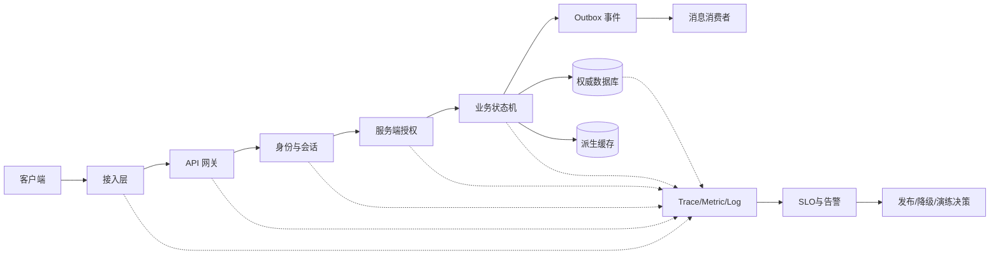

# 鉴权限流幂等灾备与可观测性
> 知识成熟度：L2（本轮审计修订时补标）

> P1 游戏服务端可靠性专题：把一次玩家请求从身份确认、权限判断、流量控制、状态提交、消息投递一路连接到观测、发布和灾备。

## 元数据

- 知识基线：分布式服务端的通用工程原则；具体实现以目标项目的协议、部署、数据库和客户端版本证据为准。
- 适用范围：在线游戏的登录、网关、长连接、HTTP/RPC、订单、背包、抽卡、匹配、数据平台和运维发布链路。
- 事实边界：本文不声称当前项目已经部署某个网关、Kubernetes 集群、OpenTelemetry、Redis、PostgreSQL 或消息队列；所有平台配置均为可落地的方案/示意。
- 事实边界：OAuth 仅作为授权协议参考，不等价于登录产品设计，也不把 access token 当成永久登录凭证。
- 事实边界：exactly-once 是需要明确资源边界和提交点的语义目标，不是网络天然提供的传输属性。
- 最后更新：2026-08-13。
- 知识成熟度：L2。
- 真实来源：[RFC 6749 OAuth 2.0](https://www.rfc-editor.org/rfc/rfc6749.html)。
- 真实来源：[Kubernetes Documentation](https://kubernetes.io/docs/)。
- 真实来源：[OpenTelemetry Documentation](https://opentelemetry.io/docs/)。
- 真实来源：[PostgreSQL Documentation](https://www.postgresql.org/docs/)。
- 真实来源：[Redis Documentation](https://redis.io/docs/latest/)。
- 真实来源：[gRPC Documentation](https://grpc.io/docs/)。

## 概述

可靠性（Reliability）不是“服务永远不报错”，而是系统在故障、重试、流量尖峰、版本并存和数据恢复时，仍能把损失限制在可预期范围内。
游戏服务端的可靠性尤其依赖业务语义，因为一次点击可能同时影响账户、订单、货币、背包、抽卡结果和审计记录。
平台层应提供边界和工具，业务层必须声明权威状态、可重试条件、不可逆动作和补偿方式。
本专题把 P1 目标拆成七条可验收主线。

1. 认证链路能区分用户、设备、会话、令牌和风险信号。
2. 权限检查在服务端完成，并以最小权限和默认拒绝为基线。
3. 网关能按连接、请求、用户和业务资源控制流量，并避免重试风暴。
4. 写操作有幂等键、去重记录、状态机和事务边界，能说明 exactly-once 的有效范围。
5. 数据迁移、备份、跨区恢复和演练有 RPO/RTO 目标及审计证据。
6. 服务治理、密钥证书、连接池、缓存和故障注入有明确的失败行为。
7. traces、metrics、logs、SLO、灰度和复盘形成反馈闭环。

## 一、可靠性先从输入、输出和责任边界开始

### 1.1 输入输出/责任边界表

| 组件或角色 | 可信输入 | 必须输出 | 责任边界 | 不应承担的责任 |
| --- | --- | --- | --- | --- |
| 客户端 | 用户操作、设备环境、版本号 | 请求、重试意图、展示错误 | 提供体验和版本兼容信息 | 不能决定货币、背包、权限的最终值 |
| 接入层 | TLS 连接、来源地址、协议头 | 连接标识、请求上下文 | 做协议解析、基础防护和超时 | 不能替代业务授权 |
| API 网关 | 已解析的请求元数据 | 路由、限流结果、trace_id | 做粗粒度流量治理和熔断 | 不能修改业务状态 |
| 身份服务 | 登录材料、设备证明、风险信号 | 会话、令牌、撤销结果 | 证明“是谁”和“会话是否有效” | 不能直接发放业务道具 |
| 授权中间件 | 身份、资源、动作、租户 | allow/deny 和审计字段 | 证明“能否做这件事” | 不能把客户端字段当成权限事实 |
| 业务服务 | 经过认证授权的命令 | 领域状态变更、业务事件 | 执行状态机和事务 | 不能把网关放行当成业务成功 |
| 数据库 | 事务读写、约束、日志 | 提交/回滚、备份证据 | 保存权威状态和一致性约束 | 不能单独理解客户端体验 |
| 消息系统 | 已提交的事件、消息键 | 投递、确认、重投结果 | 解耦异步处理并暴露语义 | 不能凭空保证端到端 exactly-once |
| 缓存 | 可失效的派生数据 | 命中、未命中、失效 | 降低读延迟，辅助限流 | 不能成为唯一的货币权威 |
| 可观测性管道 | traces、metrics、logs | 查询、告警、审计视图 | 让故障可定位和可度量 | 不能修复业务状态本身 |
| 发布平台 | 版本、配置、指标、回滚命令 | 灰度、暂停、回滚记录 | 控制变更 blast radius | 不能绕过数据迁移兼容门禁 |
| 值班与业务负责人 | 告警、影响面、业务优先级 | 决策、处置、复盘行动项 | 定义 P1 目标和止损策略 | 不能用口头结论代替审计证据 |

### 1.2 可靠性边界图

图中的箭头不是单一产品架构，而是审查每个边界的提问顺序。
请求进入业务状态机前，必须完成身份、权限、限流和输入校验。
状态提交后，事件才允许被认为“可发布”，消费者必须能面对重复、乱序和延迟。
观测数据应在每个边界带上相同的 trace_id、请求名、版本和结果分类。

### 1.3 P1 验收口径

| 验收项 | 最低可接受结果 | 证据 |
| --- | --- | --- |
| 未认证请求 | 进入受保护资源前被拒绝 | 网关日志、集成测试、审计记录 |
| 越权请求 | 返回统一拒绝，不泄露资源存在性 | 授权测试、错误码契约 |
| 重复写请求 | 同一幂等键不产生第二次业务副作用 | 去重表、事务测试、业务对账 |
| 数据迁移 | 新旧版本在兼容窗口内可读写 | 迁移日志、版本矩阵、回滚演练 |
| 主区故障 | 在 RTO 内切换或进入明确只读模式 | 演练记录、恢复时间线 |
| 指标异常 | 告警能定位到服务、版本、资源和影响 | 告警截图、trace、runbook |
| 灰度回归 | 达到阈值自动暂停或回滚 | 发布记录、指标快照 |

## 二、分篇指引（01-08）

原《01-鉴权限流幂等灾备与可观测性》按主题拆分为 01-08 八篇分篇；本文保留元数据、概述、一、最佳实践清单、FAQ 与关联阅读，作为总览与迁移说明，各主题细节以分篇正文为准。

| 分篇文件 | 主题 | 来源章节 |
| --- | --- | --- |
| [01-身份认证与权限模型.md](01-身份认证与权限模型.md) | 身份认证、会话、令牌、设备与风控 | 原"二、身份认证、会话、令牌、设备与风控"（2.1-2.8） |
| [02-限流熔断背压与过载保护.md](02-限流熔断背压与过载保护.md) | API 网关、限流、降级与重试控制 | 原"三、API 网关、限流、降级与重试控制"（3.1-3.7） |
| [03-幂等重试与消息语义.md](03-幂等重试与消息语义.md) | 幂等、去重、状态机与 exactly-once 边界 | 原"四、幂等、去重、状态机、事务与消息语义"（4.1-4.4） |
| [04-分布式事务与最终一致性.md](04-分布式事务与最终一致性.md) | 事务与 Outbox、业务操作、消息重复与乱序、幂等失败路径 | 原"四、幂等、去重、状态机、事务与消息语义"（4.5-4.12） |
| [05-服务发现配置中心与治理.md](05-服务发现配置中心与治理.md) | 服务发现、配置、密钥、证书、连接池与缓存 | 原"六、服务发现、配置、密钥、证书、连接池与缓存"（6.1-6.6） |
| [06-SLI-SLO与可观测性.md](06-SLI-SLO与可观测性.md) | OpenTelemetry、SLO/SLI、RED/USE 与容量模型 | 原"七、OpenTelemetry、SLO/SLI、RED/USE 与容量模型"（7.1-7.7） |
| [07-故障恢复容灾与多活.md](07-故障恢复容灾与多活.md) | 数据迁移、备份、RPO/RTO 与跨区灾备 | 原"五、数据迁移、备份、RPO/RTO 与跨区灾备"（5.1-5.8） |
| [08-灰度发布回滚与事故复盘.md](08-灰度发布回滚与事故复盘.md) | 灰度、金丝雀、协议兼容、自动回滚与事故复盘 | 原"八、灰度、金丝雀、协议兼容与自动回滚"（8.1-8.3）+ 原"九、端到端运行闭环与事故复盘"（9.1-9.3） |

## 三、最佳实践清单

1. 默认拒绝所有未知身份和未知权限，服务端自己解析权威主体。
2. access token 短期有效，refresh token 轮换并支持整条会话撤销。
3. 把设备作为风险信号，不把可伪造设备字段当成账户证明。
4. 对登录、经济写、匹配入队和外部回调使用不同的限流维度。
5. 重试必须绑定 deadline、退避、抖动和幂等条件。
6. 幂等记录保存请求摘要、状态、原始响应和过期策略。
7. 用数据库约束和状态机兜住代码遗漏，不只依赖调用方自觉。
8. 用 Outbox 解决本地状态与事件发布的一致性，用消费者去重面对重复投递。
9. Expand/Contract 前先写版本矩阵和不可逆操作清单。
10. 备份必须做恢复验证，灾备必须做切换和回切演练。
11. 密钥和证书采用双钥窗口，所有轮换都有审计证据。
12. 连接池、缓存和队列都要有上限、超时、积压和降级行为。
13. traces、metrics、logs 共享 trace_id，但避免高基数标签污染指标系统。
14. SLO 同时覆盖可用性、尾延迟、数据正确性和经济安全。
15. 灰度前验证协议和数据库兼容，自动回滚只覆盖可逆变更。
16. 每次故障注入和事故复盘都要形成可复验的测试或 runbook。

## 四、FAQ

### Q1：有 JWT 就不需要服务端会话了吗？

不一定。JWT 可以承载可验证声明，但撤销、设备管理、风险升级、踢下线和高风险动作仍需要服务端状态或可接受的短缓存。
是否采用 JWT 是实现选择，不应改变短期令牌、最小权限和服务端授权的边界。

### Q2：OAuth access token 能不能一直存起来当登录凭证？

不能把它当永久登录凭证。它应有 audience、scope、过期时间和撤销/刷新策略；长期会话应通过受控刷新或重新认证维持。
OAuth 协议参考与产品会话设计是两个层次。

### Q3：限流存储挂了，是否应该全部放行？

不应一刀切。高风险写入和认证入口通常应 fail closed 或进入挑战/排队，低风险只读可使用很短的本地预算和明确降级。
关键是把“限流不确定”作为可观测状态，而不是静默放行。

### Q4：用了消息队列的 exactly-once 模式，还需要消费去重吗？

仍然需要。端到端副作用可能跨数据库、缓存、第三方服务和人工补偿，业务必须用 event_id、业务键或版本控制重复。
传输层语义不能替代资源域内的幂等设计。

### Q5：请求超时了，重新发一个新的幂等键可以吗？

如果原请求的业务状态未知，使用新键可能产生第二个副作用。应先用原幂等键查询；只有确认原操作未创建或由业务规则允许时，才能创建新意图。

### Q6：数据库迁移失败后直接回滚代码是否安全？

不一定。代码可以回滚，数据结构和已写入数据可能不可逆。应先检查迁移阶段、兼容矩阵、备份和前向修复方案，再决定回滚或暂停。

### Q7：缓存命中率很高，为什么还要数据库对账？

缓存可能丢失、过期、乱序回填或被错误写入。订单、货币和背包的权威状态需要独立对账，缓存只能降低读取成本。

### Q8：CPU 不高但接口很慢，先扩容可以吗？

先看连接池等待、锁等待、队列积压、下游延迟、尾延迟和重试放大。CPU 低可能意味着线程在等待依赖，盲目扩容会把连接和下游压得更满。

### Q9：灰度只看 5xx 是否足够？

不够。业务错误可能返回 2xx，必须观测状态迁移成功率、重复发奖、账本差异、匹配时延、旧客户端兼容和用户分层的 p99。

### Q10：灾备切换成功，为什么还不能宣布恢复？

进程和路由健康不代表业务正确。还要核对复制位点、订单/货币/背包不变量、消息积压、证书密钥、审计链和回切计划。

## 五、术语速查

下表汇总本专题反复出现的术语，供阅读分篇时快速对照；每个术语的完整讨论以对应分篇正文为准。

| 术语 | 英文 | 一句话含义 |
| --- | --- | --- |
| 可靠性 | Reliability | 系统在故障、重试、流量尖峰与版本并存时，仍把损失限制在可预期范围内。 |
| 可用性 | Availability | 服务在观测窗口内维持可用状态的时间占比，通常与 SLO 一起度量。 |
| RPO | Recovery Point Objective | 灾难发生后允许丢失的数据时间窗口，决定备份与复制的频率要求。 |
| RTO | Recovery Time Objective | 从故障发生到业务恢复允许的最长时间，决定切换与恢复流程的时限。 |
| SLO | Service Level Objective | 对可用性、延迟或数据正确性设定的可度量目标值。 |
| SLI | Service Level Indicator | 用于度量 SLO 达成情况的指标，如请求成功率、p99 延迟。 |
| 幂等键 | Idempotency Key | 标识一次业务意图的唯一键，重复请求携带同一键时只产生一次有效副作用。 |
| exactly-once | Exactly-Once Effect | 在明确资源域内同一业务意图只产生一次有效结果的语义目标，不是传输层属性。 |
| Outbox | Transactional Outbox | 与业务状态同库提交的待发事件表，由发布器异步投递到消息系统。 |
| 限流 | Rate Limiting | 按连接、请求、用户或业务资源控制流量速率，防止单个来源耗尽容量。 |
| 熔断 | Circuit Breaker | 下游持续失败时快速失败并在冷却窗口后试探恢复，保护依赖链。 |
| 背压 | Backpressure | 消费者把积压压力反向传递给上游或触发降级，避免消息无限堆积。 |
| 灰度 | Canary Release | 先向小比例流量发布新版本，按指标决定扩大范围或回滚的发布方式。 |
| trace_id | Trace ID | 贯穿一次请求所有边界的唯一标识，用于串联日志、指标与链路数据。 |

术语口径以本文元数据中的真实来源为准；实现细节（如限流算法、熔断阈值）以项目方案和压测证据为准。

## 六、平台可靠性落地检查清单

清单用于把七条验收主线拆成可逐项勾选的落地动作。勾选不代表永久达标：每次发布、扩容、迁移和演练后都应重跑相关项。

- [ ] 1. 认证入口默认拒绝未知身份。
    检查动作：审查接入层与网关配置，确认未知身份、失效会话、过期令牌的默认行为均为拒绝。
    通过标准：未认证与伪造身份的集成测试用例通过，拒绝动作有日志与审计记录。
- [ ] 2. 权限判定在服务端完成。
    检查动作：抽查业务接口的鉴权实现，确认不把客户端传入的角色、权限字段当作事实。
    通过标准：越权访问用例返回统一拒绝，且不泄露资源存在性。
- [ ] 3. 高风险维度有独立限流。
    检查动作：核对登录、经济写、匹配入队、外部回调的限流规则与额度配置。
    通过标准：每个维度可独立计数、独立告警，互不拖累（额度为示意值，需项目压测验证）。
- [ ] 4. 自动重试受控。
    检查动作：评审全部自动重试代码，确认带 deadline、最大次数、退避与抖动。
    通过标准：重试超限后停止并告警，不存在无限重发路径。
- [ ] 5. 写接口声明幂等键。
    检查动作：盘点扣款、发奖、订单、匹配、结算等写接口的契约文档。
    通过标准：写接口模板包含幂等键字段、生成方与冲突返回码。
- [ ] 6. 去重与摘要齐备。
    检查动作：检查去重表实现，确认唯一约束、request_hash 与 status 三者齐备。
    通过标准：同键同参返回原结果，同键异参返回幂等键冲突。
- [ ] 7. 状态机有并发控制。
    检查动作：核对业务状态机的迁移表与行锁、版本号等并发手段。
    通过标准：非法迁移被拒绝，处理中记录不会被无约束地重复抢占。
- [ ] 8. 消息消费去重。
    检查动作：抽查消息消费者，确认以 event_id 或业务键去重，而非依赖投递次数。
    通过标准：重复投递测试中业务副作用只出现一次。
- [ ] 9. 备份可恢复。
    检查动作：核对备份任务、保留策略与最近一次恢复演练记录。
    通过标准：恢复演练有通过结论、耗时与负责人记录。
- [ ] 10. 灾备有目标并演练。
    检查动作：核对 RPO/RTO 目标与切换、回切演练记录。
    通过标准：演练时间线达到目标，回切后业务不变量核对通过。
- [ ] 11. 密钥证书双钥轮换。
    检查动作：检查证书与密钥的生效、过期、轮换机制及依赖方更新流程。
    通过标准：轮换窗口内无中断，所有轮换操作有审计证据。
- [ ] 12. 依赖资源有上限与降级。
    检查动作：检查连接池、缓存、队列的容量上限、超时与降级配置。
    通过标准：故障注入下系统进入明确降级或快速失败，而非挂死或无限积压。
- [ ] 13. 观测三支柱贯通。
    检查动作：抽查 traces、metrics、logs 的 trace_id 传播与采样配置。
    通过标准：同一请求可在接入、业务、存储、消息各边界串联查询。
- [ ] 14. SLO 覆盖正确性。
    检查动作：核对 SLO 定义是否覆盖可用性、尾延迟与数据正确性。
    通过标准：告警与 SLO 绑定，超预算时有升级路径与负责人。
- [ ] 15. 灰度有兼容门禁。
    检查动作：检查灰度流程中的协议兼容、数据库迁移兼容与回滚条件。
    通过标准：发布记录包含版本矩阵，回滚条件明确且只覆盖可逆变更。
- [ ] 16. 复盘形成闭环。
    检查动作：核对最近一次事故复盘的行动项、负责人与验证方式。
    通过标准：行动项有可复验的测试或 runbook，且已回填到相关流程。

以上 16 项可按季度或大版本节奏滚动复查；复查结果应留存在发布记录或运维台账中，作为 P1 目标的审计证据。

## 七、常见反模式

反模式清单用于复盘和代码评审时快速对照，识别"看起来在加固、实际在放大风险"的做法。
表中"正确做法"与三、最佳实践清单互补：前者是评审时的对照表，后者是设计时的原则表。

| 反模式 | 现象 | 后果 | 正确做法 |
| --- | --- | --- | --- |
| 无限重试 | 失败后无上限、无退避地持续重发 | 重试风暴放大流量，下游雪崩 | 设置最大次数、指数退避与抖动，超限停止并告警。 |
| 超时即换键 | 客户端超时后立刻用新幂等键重发 | 同一意图产生两次业务副作用 | 复用原幂等键查询状态，确认未生效再重试。 |
| 各层各自重试 | 客户端、网关、服务、消费者各重试一遍 | 请求量按层数放大 | 明确每层重试职责与总预算，由网关统一收敛。 |
| 内存幂等 | 幂等记录只存在进程内 | 重启后旧请求被重复处理 | 幂等记录持久化，保留期覆盖最大重试与补偿窗口。 |
| 缓存当权威 | 货币、背包以缓存读改写 | 缓存丢失或错写造成账目错误 | 数据库为权威状态，缓存仅做派生读取并接受失效。 |
| 只盯 5xx | 监控只看错误码 | 业务失败静默，事故延迟发现 | 同时观测状态迁移成功率、重复发奖与对账差异。 |
| 备份不演练 | 只备份不验证可恢复 | 真故障时才发现备份不可用 | 定期执行恢复演练并保留时间线与通过结论。 |
| 从不故障注入 | 降级、熔断路径从未真实触发 | 关键时刻降级逻辑首次运行即出错 | 用故障注入与演练形成可复验的失败行为证据。 |
| 回滚只看代码 | 迁移失败后直接回滚版本 | 数据结构与数据不可逆 | 先评估迁移阶段与兼容矩阵，再决定回滚或前向修复。 |

反模式往往不是单个错误，而是多个层级的默认行为叠加；发现其一应顺带检查相邻边界。

## 八、落地优先级与阶段门禁

前文清单回答"做什么"，本节回答"先做什么"：把七条验收主线排成五个阶段，每个阶段有关键门禁，门禁通过才进入下一阶段。
阶段划分与顺序仅为建议，可按项目实际风险排序；容量与性能相关数字均为示意值，需项目压测验证。

| 阶段 | 聚焦主线 | 关键门禁 |
| --- | --- | --- |
| P0 基础防线 | 认证拒绝、服务端授权、写接口幂等键 | 未认证与越权用例通过，写接口全部声明幂等键并有去重记录 |
| P0 数据安全 | 备份恢复、RPO/RTO 演练 | 恢复演练有通过结论，演练时间线达到目标 |
| P1 治理与观测 | trace_id 贯通、SLO 定义、告警绑定 | 同一请求可跨边界串联，SLO 有告警与升级路径 |
| P1 发布安全 | 灰度兼容矩阵、回滚条件、复盘行动项 | 发布记录含版本矩阵，复盘行动项可复验 |
| P2 容量与性能 | 限流额度、依赖上限、故障注入 | 压测与故障注入记录达标，容量数字为示意值，需项目压测验证 |

门禁不通过时不应进入下一阶段，但允许在阶段内先做低风险改进。
每个阶段结束后建议把门禁结果作为 P1 专题的审计证据归档。

## 九、关联阅读

- [01-架构与网络/README.md](../01-架构与网络/README.md)：服务端架构、协议、消息、并发是本专题的网络与计算基础。
- [02-数据与业务/README.md](../02-数据与业务/README.md)：存储、缓存、分布式、高可用与部署运维的业务背景。
- [03-业务系统设计/README.md](../03-业务系统设计/README.md)：背包、商城、匹配、战斗结算等业务状态机的落点。
- [游戏AI/03-评测与安全/01-AI评测回放与LLM安全.md](../../游戏AI/03-评测与安全/01-AI评测回放与LLM安全.md)：回放、评测、安全边界和审计思路可迁移到服务端事件验证。
- [游戏算法/03-工程与实用技巧/03-AOI与视野计算.md](../../游戏算法/03-工程与实用技巧/03-AOI与视野计算.md)：AOI 与视野计算涉及热点、分片、广播和容量模型。
- [游戏知识/08-工具链与打包发布/08-全栈质量门禁与灰度回滚.md](../../游戏知识/08-工具链与打包发布/08-全栈质量门禁与灰度回滚.md)：将版本门禁、灰度和自动回滚连接到客户端与全栈发布。
- [RFC 6749 OAuth 2.0](https://www.rfc-editor.org/rfc/rfc6749.html)：OAuth 2.0 授权协议参考。
- 主题分工：限流/幂等/灾备/可观测性等主题的专题细节见 [02-数据与业务](../02-数据与业务/README.md) 系列对应篇目（分布式与高可用、安全与反作弊、部署运维与监控），本文为平台治理视角合辑，节级细节以对应专题为准。
- [Kubernetes Documentation](https://kubernetes.io/docs/)：服务编排、探针、发布和资源治理的官方文档入口。
- [OpenTelemetry Documentation](https://opentelemetry.io/docs/)：traces、metrics、logs 与上下文传播的官方文档入口。
- [PostgreSQL Documentation](https://www.postgresql.org/docs/)：事务、索引、备份与恢复的官方文档入口。
- [Redis Documentation](https://redis.io/docs/latest/)：缓存、原子操作和限流实现参考。
- [gRPC Documentation](https://grpc.io/docs/)：RPC deadline、取消、健康检查和重试参考。

## 十、更新日志

- 2026-08-13：由原《01-鉴权限流幂等灾备与可观测性》改名并拆分：二至九节按主题拆为 01-08 八篇分篇；本文保留元数据、概述、一、最佳实践清单、FAQ 与关联阅读，作为总览与迁移说明；元数据补充知识成熟度 L2 并更新最后更新日期。
- 2026-08-13：扩写术语速查、平台可靠性落地检查清单、常见反模式与落地优先级阶段门禁（P0-P2），正文补充至 300+ 行。
