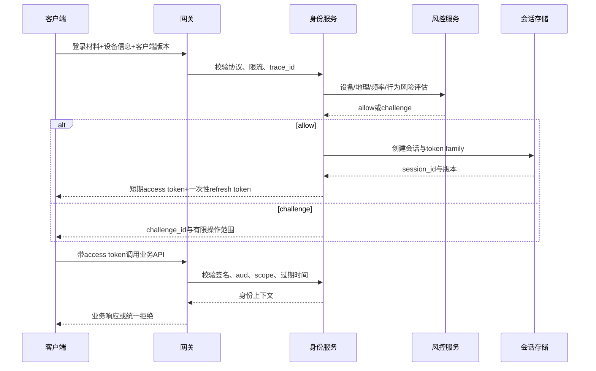

# 01 身份认证与权限模型

> 知识成熟度：L2
> 适用范围：平台可靠性-身份认证与权限模型
> 本文由《01-鉴权限流幂等灾备与可观测性》"二、身份认证、会话、令牌、设备与风控"拆分而来，正文逐字迁移。

## 元数据
- 最后更新：2026-08-13。
- 知识成熟度：L2。
- 适用范围：平台可靠性-身份认证与权限模型。
- 知识基线：平台可靠性工程方案（非 UE 内置能力）；事实边界以原《01-鉴权限流幂等灾备与可观测性》对应章节为准。
- 拆分来源：原《01-鉴权限流幂等灾备与可观测性》"二、身份认证、会话、令牌、设备与风控"。

## 概述
身份认证回答"请求来自哪个主体"，授权回答"主体能否对资源执行动作"，二者必须由服务端完成，并以最小权限和默认拒绝为基线。
本文覆盖账户、设备、会话、令牌与风险五种对象，以及 OAuth 的正确边界、登录与刷新流程、会话设计、设备风控和服务端授权检查。
失败路径、FAQ 与验收清单给出 JWT、OAuth token、撤销与超时场景下的正确口径。

### 1.1 先区分五种对象

身份认证（Authentication）回答“请求来自哪个主体”；授权（Authorization）回答“主体能否对资源执行动作”。
会话（Session）是服务端维护的登录上下文；令牌（Token）是请求携带的可验证凭据；设备标识（Device Identity）是风险和策略输入，不等于用户身份。

| 对象 | 典型字段 | 生命周期 | 泄露后的处理 | 服务端权威性 |
| --- | --- | --- | --- | --- |
| 用户账户 | account_id、区服、状态 | 长期 | 冻结、找回、审计 | 高 |
| 设备记录 | device_id、安装实例、风险标签 | 中长期 | 标记风险、重新验证 | 中，不能单独证明用户 |
| 登录会话 | session_id、account_id、issued_at、expires_at | 短期 | 撤销会话、使刷新链失效 | 高 |
| access token | subject、scope、aud、过期时间 | 分钟级或短期 | 撤销签名/会话、等待过期 | 仅代表有限访问授权 |
| refresh token | session_id、轮换版本、过期时间 | 较长但有限 | 轮换、撤销整条 token family | 只用于刷新，不直接调业务 |
| 风险令牌 | challenge_id、risk_level、expires_at | 很短 | 使挑战失效 | 只表达风控挑战状态 |

### 1.2 OAuth 的正确边界

OAuth 2.0 是授权框架参考，不是“把 access token 当账号密码”的设计许可证。
实现时应先决定自己的账户、会话和撤销模型，再选择适用的授权流程和令牌格式。
如果采用外部身份提供方，服务端仍要把外部 subject 映射到内部 account_id，并执行本地封禁、区服、年龄、设备和最小权限策略。
access token 必须有 audience、scope、过期时间和签发者校验。
access token 不应作为永久登录凭证，也不应被写入客户端长期明文存储后无限复用。
refresh token 不是业务 API 的通行证，使用时应绑定会话、轮换并检测重放。
涉及授权流程的协议细节，以 [RFC 6749 OAuth 2.0](https://www.rfc-editor.org/rfc/rfc6749.html) 为参考，并结合实际安全评审。

### 1.3 登录与刷新流程



登录成功不代表所有服务都信任客户端字段。
业务服务应从验证后的上下文获取 account_id、tenant_id、session_id、authn_level 和 risk_level。
客户端传来的 account_id 只能用于比对或报错，不能用来切换玩家资产。

### 1.4 会话设计要点

会话记录至少包含内部 session_id、account_id、创建时间、绝对过期时间、空闲过期时间、撤销版本和最后风险结论。
绝对过期防止长期在线会话无限延长；空闲过期限制无人操作的暴露时间。
长连接心跳只能证明连接仍在，不等于会话仍有权限。
服务端应在关键动作前检查会话状态，而不是只在连接建立时检查一次。
高风险动作可以要求更高 authn_level、最近一次重新认证或短时 challenge。
踢下线应增加会话版本或写入撤销集合，让旧 token 在可接受的延迟内失效。
撤销检查可以使用缓存，但撤销源和过期策略必须可审计。

### 1.5 设备与风控边界

设备 ID 是风险信号，不是不可伪造的硬件身份证明。
设备字段应分为客户端声明、服务端生成、平台证明和行为推断四类。
客户端声明的型号、时区和网络类型可用于风控特征，但不能单独作为封禁证据。
服务端生成的 device_install_id 应随机、可轮换、不能直接包含 account_id。
平台证明或硬件密钥的可用性依赖发行渠道和平台能力，未知时只能写成可选分支。
风控系统应返回风险等级和处置建议，不应直接修改货币或背包。
风控失败的默认动作可以是二次验证、限速、只读、延迟结算或人工复核。
封禁和解封都需要原因、操作者、时间、证据引用和有效期。

### 1.6 服务端授权与最小权限

每个请求至少由 subject、resource、action、context 四元组决定是否允许。
角色访问控制（RBAC）适合稳定的运维角色；属性访问控制（ABAC）适合区服、赛季、资源所有者和风险等级条件。
默认策略必须是 deny，新增 API 没有显式策略时应失败关闭。
服务间身份应与用户身份分开，服务账号不能因为“内部网络”而拥有全库写权限。
读取玩家资产的服务只申请对应表或接口的读取权限。
发放货币、改写封禁、执行迁移和回放补偿应使用独立高权限角色。
权限缓存必须短过权限变更的可接受传播时间，紧急撤权要有主动失效通道。
管理员操作不能复用普通玩家 token，也不能只依赖请求来源 IP。

### 1.7 授权检查伪代码

```text
function authorize(ctx, resource, action):
    if ctx.session == null:
        return Deny("UNAUTHENTICATED")
    if ctx.session.revoked or ctx.session.expires_at <= now():
        return Deny("SESSION_EXPIRED")
    if ctx.token.audience != service_name:
        return Deny("BAD_AUDIENCE")
    if not ctx.token.scopes.contains(required_scope(resource, action)):
        return Deny("INSUFFICIENT_SCOPE")
    if resource.owner_account_id != null and resource.owner_account_id != ctx.account_id:
        if not policy.allows(ctx.subject, resource, action):
            return Deny("FORBIDDEN")
    if ctx.risk_level >= HIGH and action in HIGH_RISK_ACTIONS:
        return Deny("STEP_UP_REQUIRED")
    return Allow()
```

拒绝结果应区分未认证和已认证但无权限，但对外错误体要避免泄露资源是否存在。
服务端日志可记录 policy_id、decision、subject_type、resource_type 和 reason_code。
不要记录完整 access token、refresh token、密码、设备密钥或支付敏感字段。

### 1.8 认证失败路径

| 失败路径 | 风险 | 默认处置 | 恢复或人工动作 |
| --- | --- | --- | --- |
| 登录密码错误过多 | 撞库、枚举 | 账户/设备/来源多维限速 | 风控挑战、通知用户 |
| token 过期 | 客户端重试风暴 | 返回可识别的过期错误，限制刷新频率 | 单次刷新并更新 token |
| refresh token 重放 | 会话被复制 | 撤销 token family | 重新登录、调查设备 |
| 撤销存储不可用 | 旧会话继续有效 | 高风险动作 fail closed，普通读按短缓存 | 恢复撤销存储并审计窗口 |
| 时钟偏差 | 误判过期 | NTP 监测、窄容忍窗口 | 校时并回放失败请求 |
| 身份服务超时 | 登录阻塞 | 入口排队/降级，不创建半成品会话 | 重试或人工公告 |
| 设备风险服务超时 | 风险未知 | 高风险动作挑战，低风险读有限放行 | 服务恢复后复核 |

## 失败路径

认证失败路径与默认处置的完整表见本文"1.8 认证失败路径"，核心兜底原则如下。

| 失败路径 | 默认处置 | 恢复或人工动作 |
| --- | --- | --- |
| 撤销存储不可用 | 高风险动作 fail closed，普通读按短缓存 | 恢复撤销存储并审计窗口 |
| refresh token 重放 | 撤销 token family | 重新登录、调查设备 |
| 身份服务超时 | 入口排队/降级，不创建半成品会话 | 重试或人工公告 |
| 设备风险服务超时 | 高风险动作挑战，低风险读有限放行 | 服务恢复后复核 |

## FAQ

### Q1：有 JWT 就不需要服务端会话了吗？

不一定。JWT 可以承载可验证声明，但撤销、设备管理、风险升级、踢下线和高风险动作仍需要服务端状态或可接受的短缓存。
是否采用 JWT 是实现选择，不应改变短期令牌、最小权限和服务端授权的边界。

### Q2：OAuth access token 能不能一直存起来当登录凭证？

不能把它当永久登录凭证。它应有 audience、scope、过期时间和撤销/刷新策略；长期会话应通过受控刷新或重新认证维持。
OAuth 协议参考与产品会话设计是两个层次。

## 验收清单

- 未认证请求进入受保护资源前被拒绝，默认策略为 deny。
- access token 校验 audience、scope、过期时间和签发者。
- 客户端传入的 account_id 只能用于比对或报错，不能切换玩家资产。
- 会话记录包含撤销版本、绝对过期时间和空闲过期时间，踢下线使旧 token 在可接受延迟内失效。
- 设备字段分为客户端声明、服务端生成、平台证明和行为推断四类，客户端声明不能单独作为封禁证据。
- 授权检查由 subject、resource、action、context 四元组决定，新增 API 没有显式策略时失败关闭。
- 服务间身份与用户身份分开，服务账号不因"内部网络"拥有全库写权限。
- 日志不记录完整 access token、refresh token、密码、设备密钥或支付敏感字段。

## 关联阅读

- [00-平台可靠性总览与迁移说明.md](00-平台可靠性总览与迁移说明.md)：本目录总览与迁移说明，含责任边界、最佳实践清单与 FAQ。
- [04-平台与可靠性/README.md](README.md)：本目录导航与学习路径。
- [02-数据与业务/04-安全与反作弊.md](../02-数据与业务/04-安全与反作弊.md)：账号安全、风控与反作弊的专题细节。
- [03-业务系统设计/README.md](../03-业务系统设计/README.md)：背包、商城、匹配、战斗结算等业务状态机的落点。
- [RFC 6749 OAuth 2.0](https://www.rfc-editor.org/rfc/rfc6749.html)：OAuth 2.0 授权协议参考。

## 更新日志

- 2026-08-13：从《01-鉴权限流幂等灾备与可观测性》"二、身份认证、会话、令牌、设备与风控"（2.1-2.8）拆出独立成篇；正文逐字迁移，标题按本文重编号。
