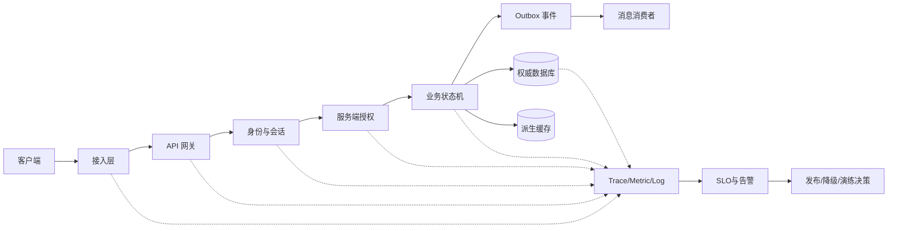
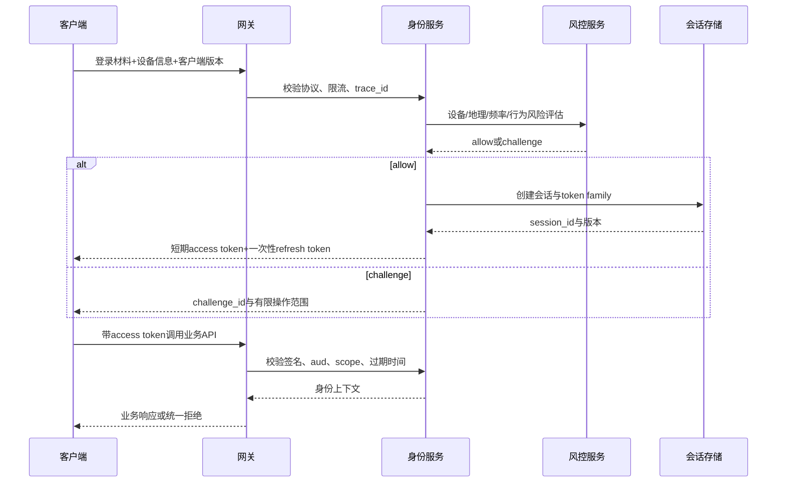
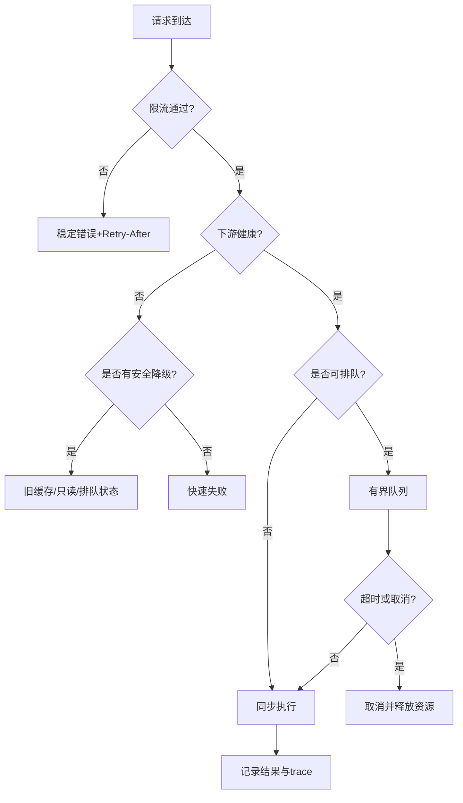
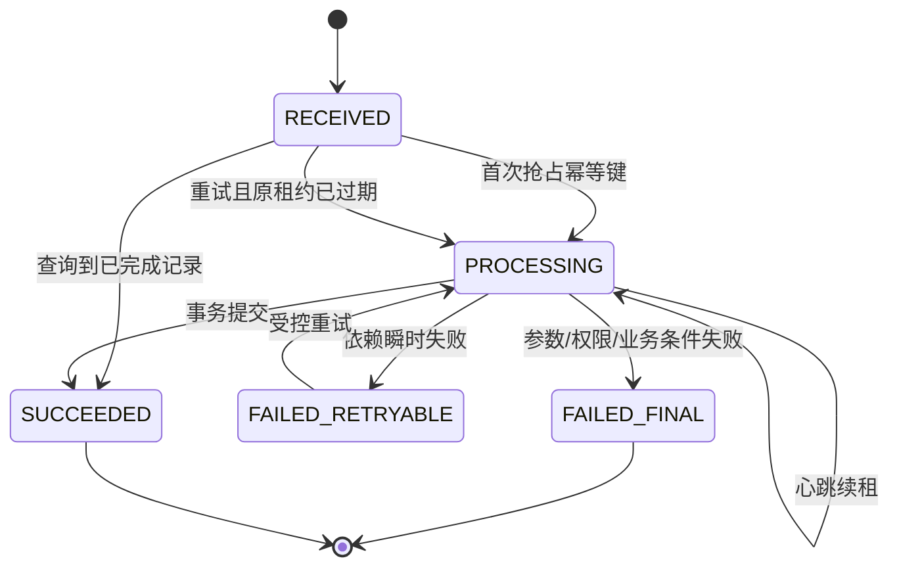
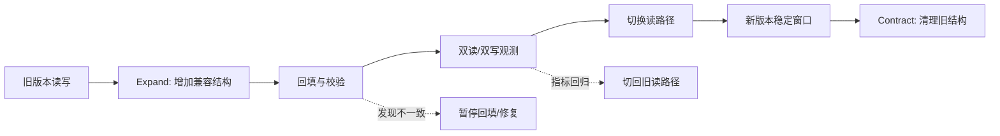
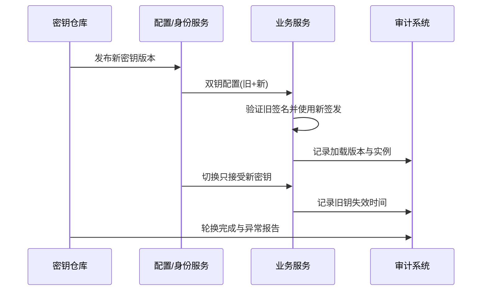
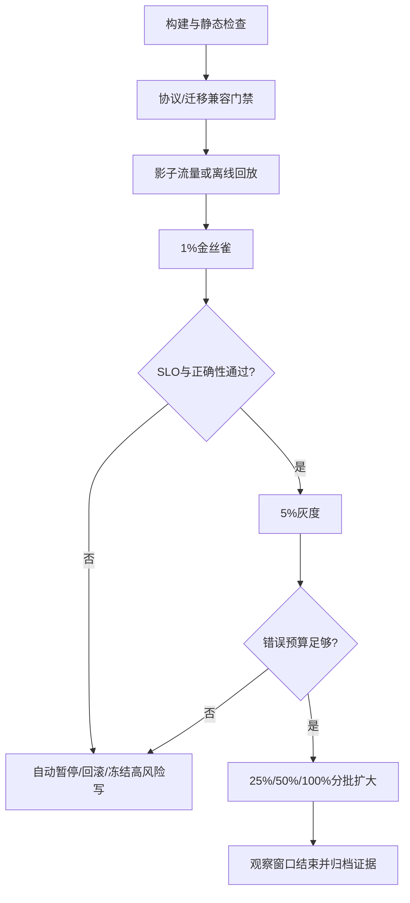

# 鉴权限流幂等灾备与可观测性

> P1 游戏服务端可靠性专题：把一次玩家请求从身份确认、权限判断、流量控制、状态提交、消息投递一路连接到观测、发布和灾备。

## 元数据

- 知识基线：分布式服务端的通用工程原则；具体实现以目标项目的协议、部署、数据库和客户端版本证据为准。
- 适用范围：在线游戏的登录、网关、长连接、HTTP/RPC、订单、背包、抽卡、匹配、数据平台和运维发布链路。
- 事实边界：本文不声称当前项目已经部署某个网关、Kubernetes 集群、OpenTelemetry、Redis、PostgreSQL 或消息队列；所有平台配置均为可落地的方案/示意。
- 事实边界：OAuth 仅作为授权协议参考，不等价于登录产品设计，也不把 access token 当成永久登录凭证。
- 事实边界：exactly-once 是需要明确资源边界和提交点的语义目标，不是网络天然提供的传输属性。
- 最后更新：2026-08-06。
- 真实来源：[RFC 6749 OAuth 2.0](https://www.rfc-editor.org/rfc/rfc6749.html)。
- 真实来源：[Kubernetes Documentation](https://kubernetes.io/docs/)。
- 真实来源：[OpenTelemetry Documentation](https://opentelemetry.io/docs/)。
- 真实来源：[PostgreSQL Documentation](https://www.postgresql.org/docs/)。
- 真实来源：[Redis Documentation](https://redis.io/docs/latest/)。
- 真实来源：[gRPC Documentation](https://grpc.io/docs/)。

## 概述

可靠性（Reliability）不是“服务永远不报错”，而是系统在故障、重试、流量尖峰、版本并存和数据恢复时，仍能把损失限制在可预期范围内。
游戏服务端的可靠性尤其依赖业务语义，因为一次点击可能同时影响账户、订单、货币、背包、抽卡结果和审计记录。
平台层应提供边界和工具，业务层必须声明权威状态、可重试条件、不可逆动作和补偿方式。
本专题把 P1 目标拆成七条可验收主线。

1. 认证链路能区分用户、设备、会话、令牌和风险信号。
2. 权限检查在服务端完成，并以最小权限和默认拒绝为基线。
3. 网关能按连接、请求、用户和业务资源控制流量，并避免重试风暴。
4. 写操作有幂等键、去重记录、状态机和事务边界，能说明 exactly-once 的有效范围。
5. 数据迁移、备份、跨区恢复和演练有 RPO/RTO 目标及审计证据。
6. 服务治理、密钥证书、连接池、缓存和故障注入有明确的失败行为。
7. traces、metrics、logs、SLO、灰度和复盘形成反馈闭环。

## 一、可靠性先从输入、输出和责任边界开始

### 1.1 输入输出/责任边界表

| 组件或角色 | 可信输入 | 必须输出 | 责任边界 | 不应承担的责任 |
| --- | --- | --- | --- | --- |
| 客户端 | 用户操作、设备环境、版本号 | 请求、重试意图、展示错误 | 提供体验和版本兼容信息 | 不能决定货币、背包、权限的最终值 |
| 接入层 | TLS 连接、来源地址、协议头 | 连接标识、请求上下文 | 做协议解析、基础防护和超时 | 不能替代业务授权 |
| API 网关 | 已解析的请求元数据 | 路由、限流结果、trace_id | 做粗粒度流量治理和熔断 | 不能修改业务状态 |
| 身份服务 | 登录材料、设备证明、风险信号 | 会话、令牌、撤销结果 | 证明“是谁”和“会话是否有效” | 不能直接发放业务道具 |
| 授权中间件 | 身份、资源、动作、租户 | allow/deny 和审计字段 | 证明“能否做这件事” | 不能把客户端字段当成权限事实 |
| 业务服务 | 经过认证授权的命令 | 领域状态变更、业务事件 | 执行状态机和事务 | 不能把网关放行当成业务成功 |
| 数据库 | 事务读写、约束、日志 | 提交/回滚、备份证据 | 保存权威状态和一致性约束 | 不能单独理解客户端体验 |
| 消息系统 | 已提交的事件、消息键 | 投递、确认、重投结果 | 解耦异步处理并暴露语义 | 不能凭空保证端到端 exactly-once |
| 缓存 | 可失效的派生数据 | 命中、未命中、失效 | 降低读延迟，辅助限流 | 不能成为唯一的货币权威 |
| 可观测性管道 | traces、metrics、logs | 查询、告警、审计视图 | 让故障可定位和可度量 | 不能修复业务状态本身 |
| 发布平台 | 版本、配置、指标、回滚命令 | 灰度、暂停、回滚记录 | 控制变更 blast radius | 不能绕过数据迁移兼容门禁 |
| 值班与业务负责人 | 告警、影响面、业务优先级 | 决策、处置、复盘行动项 | 定义 P1 目标和止损策略 | 不能用口头结论代替审计证据 |

### 1.2 可靠性边界图



图中的箭头不是单一产品架构，而是审查每个边界的提问顺序。
请求进入业务状态机前，必须完成身份、权限、限流和输入校验。
状态提交后，事件才允许被认为“可发布”，消费者必须能面对重复、乱序和延迟。
观测数据应在每个边界带上相同的 trace_id、请求名、版本和结果分类。

### 1.3 P1 验收口径

| 验收项 | 最低可接受结果 | 证据 |
| --- | --- | --- |
| 未认证请求 | 进入受保护资源前被拒绝 | 网关日志、集成测试、审计记录 |
| 越权请求 | 返回统一拒绝，不泄露资源存在性 | 授权测试、错误码契约 |
| 重复写请求 | 同一幂等键不产生第二次业务副作用 | 去重表、事务测试、业务对账 |
| 数据迁移 | 新旧版本在兼容窗口内可读写 | 迁移日志、版本矩阵、回滚演练 |
| 主区故障 | 在 RTO 内切换或进入明确只读模式 | 演练记录、恢复时间线 |
| 指标异常 | 告警能定位到服务、版本、资源和影响 | 告警截图、trace、runbook |
| 灰度回归 | 达到阈值自动暂停或回滚 | 发布记录、指标快照 |

## 二、身份认证、会话、令牌、设备与风控

### 2.1 先区分五种对象

身份认证（Authentication）回答“请求来自哪个主体”；授权（Authorization）回答“主体能否对资源执行动作”。
会话（Session）是服务端维护的登录上下文；令牌（Token）是请求携带的可验证凭据；设备标识（Device Identity）是风险和策略输入，不等于用户身份。

| 对象 | 典型字段 | 生命周期 | 泄露后的处理 | 服务端权威性 |
| --- | --- | --- | --- | --- |
| 用户账户 | account_id、区服、状态 | 长期 | 冻结、找回、审计 | 高 |
| 设备记录 | device_id、安装实例、风险标签 | 中长期 | 标记风险、重新验证 | 中，不能单独证明用户 |
| 登录会话 | session_id、account_id、issued_at、expires_at | 短期 | 撤销会话、使刷新链失效 | 高 |
| access token | subject、scope、aud、过期时间 | 分钟级或短期 | 撤销签名/会话、等待过期 | 仅代表有限访问授权 |
| refresh token | session_id、轮换版本、过期时间 | 较长但有限 | 轮换、撤销整条 token family | 只用于刷新，不直接调业务 |
| 风险令牌 | challenge_id、risk_level、expires_at | 很短 | 使挑战失效 | 只表达风控挑战状态 |

### 2.2 OAuth 的正确边界

OAuth 2.0 是授权框架参考，不是“把 access token 当账号密码”的设计许可证。
实现时应先决定自己的账户、会话和撤销模型，再选择适用的授权流程和令牌格式。
如果采用外部身份提供方，服务端仍要把外部 subject 映射到内部 account_id，并执行本地封禁、区服、年龄、设备和最小权限策略。
access token 必须有 audience、scope、过期时间和签发者校验。
access token 不应作为永久登录凭证，也不应被写入客户端长期明文存储后无限复用。
refresh token 不是业务 API 的通行证，使用时应绑定会话、轮换并检测重放。
涉及授权流程的协议细节，以 [RFC 6749 OAuth 2.0](https://www.rfc-editor.org/rfc/rfc6749.html) 为参考，并结合实际安全评审。

### 2.3 登录与刷新流程



登录成功不代表所有服务都信任客户端字段。
业务服务应从验证后的上下文获取 account_id、tenant_id、session_id、authn_level 和 risk_level。
客户端传来的 account_id 只能用于比对或报错，不能用来切换玩家资产。

### 2.4 会话设计要点

会话记录至少包含内部 session_id、account_id、创建时间、绝对过期时间、空闲过期时间、撤销版本和最后风险结论。
绝对过期防止长期在线会话无限延长；空闲过期限制无人操作的暴露时间。
长连接心跳只能证明连接仍在，不等于会话仍有权限。
服务端应在关键动作前检查会话状态，而不是只在连接建立时检查一次。
高风险动作可以要求更高 authn_level、最近一次重新认证或短时 challenge。
踢下线应增加会话版本或写入撤销集合，让旧 token 在可接受的延迟内失效。
撤销检查可以使用缓存，但撤销源和过期策略必须可审计。

### 2.5 设备与风控边界

设备 ID 是风险信号，不是不可伪造的硬件身份证明。
设备字段应分为客户端声明、服务端生成、平台证明和行为推断四类。
客户端声明的型号、时区和网络类型可用于风控特征，但不能单独作为封禁证据。
服务端生成的 device_install_id 应随机、可轮换、不能直接包含 account_id。
平台证明或硬件密钥的可用性依赖发行渠道和平台能力，未知时只能写成可选分支。
风控系统应返回风险等级和处置建议，不应直接修改货币或背包。
风控失败的默认动作可以是二次验证、限速、只读、延迟结算或人工复核。
封禁和解封都需要原因、操作者、时间、证据引用和有效期。

### 2.6 服务端授权与最小权限

每个请求至少由 subject、resource、action、context 四元组决定是否允许。
角色访问控制（RBAC）适合稳定的运维角色；属性访问控制（ABAC）适合区服、赛季、资源所有者和风险等级条件。
默认策略必须是 deny，新增 API 没有显式策略时应失败关闭。
服务间身份应与用户身份分开，服务账号不能因为“内部网络”而拥有全库写权限。
读取玩家资产的服务只申请对应表或接口的读取权限。
发放货币、改写封禁、执行迁移和回放补偿应使用独立高权限角色。
权限缓存必须短过权限变更的可接受传播时间，紧急撤权要有主动失效通道。
管理员操作不能复用普通玩家 token，也不能只依赖请求来源 IP。

### 2.7 授权检查伪代码

```text
function authorize(ctx, resource, action):
    if ctx.session == null:
        return Deny("UNAUTHENTICATED")
    if ctx.session.revoked or ctx.session.expires_at <= now():
        return Deny("SESSION_EXPIRED")
    if ctx.token.audience != service_name:
        return Deny("BAD_AUDIENCE")
    if not ctx.token.scopes.contains(required_scope(resource, action)):
        return Deny("INSUFFICIENT_SCOPE")
    if resource.owner_account_id != null and resource.owner_account_id != ctx.account_id:
        if not policy.allows(ctx.subject, resource, action):
            return Deny("FORBIDDEN")
    if ctx.risk_level >= HIGH and action in HIGH_RISK_ACTIONS:
        return Deny("STEP_UP_REQUIRED")
    return Allow()
```

拒绝结果应区分未认证和已认证但无权限，但对外错误体要避免泄露资源是否存在。
服务端日志可记录 policy_id、decision、subject_type、resource_type 和 reason_code。
不要记录完整 access token、refresh token、密码、设备密钥或支付敏感字段。

### 2.8 认证失败路径

| 失败路径 | 风险 | 默认处置 | 恢复或人工动作 |
| --- | --- | --- | --- |
| 登录密码错误过多 | 撞库、枚举 | 账户/设备/来源多维限速 | 风控挑战、通知用户 |
| token 过期 | 客户端重试风暴 | 返回可识别的过期错误，限制刷新频率 | 单次刷新并更新 token |
| refresh token 重放 | 会话被复制 | 撤销 token family | 重新登录、调查设备 |
| 撤销存储不可用 | 旧会话继续有效 | 高风险动作 fail closed，普通读按短缓存 | 恢复撤销存储并审计窗口 |
| 时钟偏差 | 误判过期 | NTP 监测、窄容忍窗口 | 校时并回放失败请求 |
| 身份服务超时 | 登录阻塞 | 入口排队/降级，不创建半成品会话 | 重试或人工公告 |
| 设备风险服务超时 | 风险未知 | 高风险动作挑战，低风险读有限放行 | 服务恢复后复核 |

## 三、API 网关、限流、降级与重试控制

### 3.1 四个限流维度

只按 IP 限流会误伤共享网络，也无法约束单个用户的业务洪峰。
建议至少评估连接、请求、用户、业务资源四个维度，再根据攻击面增加设备、租户、来源和服务账号维度。

| 维度 | 典型键 | 适用目标 | 主要盲点 |
| --- | --- | --- | --- |
| 连接 | listener、IP、device_id、connection_id | 防连接耗尽、握手洪峰 | 多用户共享 NAT 时误伤 |
| 请求 | route、method、来源、服务 | 防 API QPS 洪峰 | 不理解用户资产价值 |
| 用户 | account_id、session_id | 防单用户刷接口 | 未认证请求没有 account_id |
| 业务 | account_id+action、抽卡池、匹配队列、订单 | 防昂贵和敏感操作 | 需要业务定义成本 |
| 租户/区服 | tenant_id、shard_id | 保护大客户或区服隔离 | 配置复杂、易不均衡 |

限流键必须使用经过认证和规范化的值，不能让客户端自由提交一个任意 header 就绕过真实身份。
所有限流规则要有版本、来源、单位、窗口、超限动作和生效范围。

### 3.2 令牌桶、漏桶和滑动窗口

令牌桶（Token Bucket）以速率 r 产生令牌，桶容量 b 允许短时突发；请求消耗 cost 个令牌。
可接受的长期平均速率不超过 r，瞬时突发上限近似为 b/cost。
漏桶（Leaky Bucket）以固定服务速率出队，更适合把下游处理变得平滑，但会增加等待延迟。
滑动窗口（Sliding Window）按时间片统计最近窗口请求数，精度较好但需要更多计数存储。
固定窗口实现简单，但窗口边界可能产生两倍突发，不应直接用于高风险动作的唯一保护。

| 算法 | 优点 | 代价 | 推荐场景 |
| --- | --- | --- | --- |
| 令牌桶 | 支持可控突发、参数直观 | 需要可靠时间和原子更新 | 普通 API、登录、网关 |
| 漏桶 | 输出平滑、便于保护下游 | 排队会引入延迟 | 匹配、批处理、写入队列 |
| 滑动窗口 | 统计更贴近最近行为 | 存储和并发原子性更复杂 | 抽卡、支付、风控 |
| 并发信号量 | 直接限制同时执行数 | 不表达时间速率 | 数据库、外部依赖、房间服务 |
| 配额 | 适合日/月累计预算 | 需要周期结算 | 邮件、奖励、管理操作 |

### 3.3 令牌桶伪代码

```text
function take(bucket, now_ms, cost):
    state = atomic_read(bucket)
    elapsed = max(0, now_ms - state.last_ms)
    refill = elapsed * state.rate_per_ms
    tokens = min(state.capacity, state.tokens + refill)
    if tokens < cost:
        retry_after_ms = ceil((cost - tokens) / state.rate_per_ms)
        return Reject(retry_after_ms)
    next = {tokens: tokens - cost, last_ms: now_ms}
    if not compare_and_swap(bucket, state, next):
        return take(bucket, now_ms, cost)
    return Accept()
```

分布式限流的计数更新必须是原子的，时间基准应说明是单调时钟还是共享服务时间。
Redis、网关插件或自研限流器都只是实现选项；如果使用 Redis，应验证原子脚本、过期时间、主从切换和热点键行为。
可参考 [Redis Documentation](https://redis.io/docs/latest/) 的数据结构和原子操作文档，但不能把示例直接当成当前项目的部署事实。

### 3.4 示意限流配置

```yaml
rate_limits:
  login:
    dimensions:
      - key: source_ip
        algorithm: token_bucket
        rate_per_second: 5
        burst: 10
      - key: device_id
        algorithm: sliding_window
        limit: 30
        window_seconds: 60
    on_exceed: challenge_or_429
  inventory.write:
    dimensions:
      - key: account_id
        algorithm: token_bucket
        rate_per_second: 8
        burst: 12
      - key: route
        algorithm: concurrency
        limit: 200
    on_exceed: reject_with_retry_after
  matchmaking.enqueue:
    dimensions:
      - key: account_id
        algorithm: token_bucket
        rate_per_second: 1
        burst: 2
    on_exceed: return_existing_ticket
```

配置中的数字只是压测起点，不是通用标准。
上线前应通过正常峰值、异常峰值、单用户刷接口和多区服热点四组数据校准。

### 3.5 排队与降级

排队适用于可等待且可取消的任务，不能把所有请求无限放入队列。
队列必须有最大长度、单用户配额、过期时间、取消语义、优先级和拒绝策略。
登录、心跳、踢下线和风控阻断通常不应被低优先级批处理任务饿死。
抽卡、支付确认和货币扣减不能通过“先返回成功、以后慢慢写”来模拟成功。
只读排行榜、推荐和装饰性消息可以在依赖异常时返回带时间戳的旧缓存。
匹配可进入排队状态，但要返回 ticket_id 和状态查询协议。
降级响应必须区分“暂不可用”“排队中”“已接受但未完成”和“已完成”。



### 3.6 重试风暴与熔断

重试放大因子（Retry Amplification）可以近似为各层重试次数的乘积。
客户端、网关、RPC 客户端和消息消费者若分别重试 3 次，最坏可能造成 3×3×3 的下游尝试。
重试只适用于明确的瞬时错误、幂等请求或具备幂等键的请求。
每次重试必须继承总 deadline，不能为每层重新开启一个完整超时。
退避应包含抖动（jitter），否则所有客户端会同时再次冲击下游。
熔断器（Circuit Breaker）通常有 closed、open、half-open 三个状态。
open 状态快速失败并设置冷却时间；half-open 只允许有限探测请求。
熔断统计要按下游、方法、错误分类和版本切分，不能把用户 4xx 误算成依赖 5xx。

```text
function call_with_budget(request, deadline, idempotency_key):
    attempts = 0
    while attempts < MAX_ATTEMPTS:
        remaining = deadline - monotonic_now()
        if remaining <= 0:
            return Timeout()
        if circuit.is_open(request.dependency):
            return DependencyUnavailable()
        result = rpc.call(request, timeout=remaining, idempotency_key=idempotency_key)
        if result.success or result.permanent_error:
            circuit.record(result)
            return result
        attempts += 1
        sleep(min(backoff(attempts), remaining / 2) + jitter())
    return RetryExhausted()
```

RPC deadline、取消和重试的细节可参考 [gRPC Documentation](https://grpc.io/docs/)，但实际服务仍需定义自己的错误分类和业务幂等规则。

### 3.7 网关失败路径

| 失败路径 | 快速判断 | 默认动作 | 禁止动作 |
| --- | --- | --- | --- |
| 限流状态存储超时 | 原子计数无结果 | 高风险写 fail closed；低风险读按短本地预算 | 无限等待存储 |
| 路由发现为空 | 无可用实例 | 返回依赖不可用并告警 | 随机转发到未知版本 |
| 下游持续 5xx | 熔断指标越阈值 | open、采样日志、保护恢复 | 全量同步重试 |
| 队列已满 | 长度达到上限 | 拒绝或按优先级丢弃 | 无界增长 |
| 客户端重试旧请求 | 幂等键已完成 | 返回原结果 | 再执行一次写操作 |
| 代理连接断开 | 响应未知 | 由幂等查询确认状态 | 根据超时直接判定失败并补发 |

## 四、幂等、去重、状态机、事务与消息语义

### 4.1 exactly-once 的真实边界

网络只能提供“可能送达、可能重复、可能乱序、可能超时”的事实。
业务可以在一个明确的资源域内，通过唯一键、事务约束、状态机和消费去重实现“同一业务意图只产生一次有效副作用”。
这不等于客户端只发了一次，也不等于消息代理只投递了一次。
exactly-once 必须回答五个问题：唯一身份是什么、权威提交点在哪里、重复如何识别、失败后如何查询、跨系统副作用如何补偿。

| 语义名称 | 能保证什么 | 不能保证什么 | 典型实现 |
| --- | --- | --- | --- |
| at-most-once | 最多处理一次 | 可能丢失 | 发送后不重试 |
| at-least-once | 最终可能处理成功 | 可能重复 | ACK 后重投 |
| effectively-once | 业务有效副作用只计一次 | 传输仍可能重复 | 幂等键+唯一约束 |
| transactional outbox | 状态与待发事件同库提交 | 外部消费仍可能重复 | 事务表+发布器 |
| exactly-once effect | 定义资源域内一次有效结果 | 跨数据库/外部支付非天然一次 | 事务、去重、对账、补偿 |

### 4.2 幂等键契约

幂等键（Idempotency Key）应由客户端或服务端在业务意图开始时生成，具有足够随机性和明确作用域。
建议键由 tenant、account、operation_type、client_request_id 组成逻辑唯一范围。
服务端应保存请求摘要，防止同一 key 被复用来提交不同参数。
重复请求如果参数摘要相同，应返回第一次的最终结果或当前处理中状态。
重复请求如果摘要不同，应返回幂等键冲突，不覆盖原始记录。
幂等记录的保留时间必须覆盖客户端最大重试窗口、消息延迟和人工补偿窗口。
只读查询可以不需要幂等键；扣货币、发道具、创建订单、加入匹配和提交结算应默认需要。

### 4.3 去重表 SQL 示意

```sql
CREATE TABLE idempotency_record (
    tenant_id       BIGINT NOT NULL,
    account_id      BIGINT NOT NULL,
    operation       VARCHAR(64) NOT NULL,
    idempotency_key VARCHAR(128) NOT NULL,
    request_hash    CHAR(64) NOT NULL,
    status          VARCHAR(16) NOT NULL,
    response_code   INT NULL,
    response_body   JSONB NULL,
    resource_type   VARCHAR(64) NULL,
    resource_id     VARCHAR(128) NULL,
    created_at      TIMESTAMPTZ NOT NULL,
    updated_at      TIMESTAMPTZ NOT NULL,
    expires_at      TIMESTAMPTZ NOT NULL,
    PRIMARY KEY (tenant_id, account_id, operation, idempotency_key),
    CHECK (status IN ('PROCESSING', 'SUCCEEDED', 'FAILED_RETRYABLE', 'FAILED_FINAL'))
);
```

表结构是示意，JSONB 是否可用要以目标数据库为准。
唯一主键解决并发插入，request_hash 解决同键不同请求，status 解决处理中的重入。
PROCESSING 记录超时后不能简单删除；必须有 lease、超时恢复或人工核查规则。

### 4.4 业务状态机



状态迁移必须有合法前置状态和并发控制。
客户端看到 PROCESSING 时应查询状态，而不是盲目重新创建一笔业务。
FAILED_RETRYABLE 是否自动重试，应由错误类型和副作用状态决定。
如果无法确认数据库事务是否提交，优先查询幂等记录和资源状态，再决定补偿。

### 4.5 事务与 Outbox

Outbox 模式把业务状态和待发布事件写进同一个本地事务。
事务提交表示业务事实已成立，发布器可以重复读取未发布事件，消费者必须幂等。
发布器更新 published_at 不是业务事务的一部分时，可能多发事件；这属于可接受的 at-least-once，需要消费者去重。
事件体应包含 event_id、aggregate_id、aggregate_version、occurred_at、producer_version 和 schema_version。
消费者应保存 event_id 或业务聚合版本，并拒绝已应用的旧版本。
跨数据库、外部支付、邮件和第三方平台不能因为有 Outbox 就声称全链路 exactly-once。

```sql
CREATE TABLE game_event_outbox (
    event_id           UUID PRIMARY KEY,
    aggregate_type     VARCHAR(64) NOT NULL,
    aggregate_id       VARCHAR(128) NOT NULL,
    aggregate_version  BIGINT NOT NULL,
    event_type         VARCHAR(128) NOT NULL,
    schema_version     INT NOT NULL,
    payload            JSONB NOT NULL,
    occurred_at        TIMESTAMPTZ NOT NULL,
    published_at       TIMESTAMPTZ NULL,
    attempts           INT NOT NULL DEFAULT 0,
    next_attempt_at    TIMESTAMPTZ NOT NULL
);
CREATE UNIQUE INDEX uq_outbox_aggregate_version
    ON game_event_outbox (aggregate_type, aggregate_id, aggregate_version);
```

### 4.6 事务/Outbox 伪代码

```text
function submit_order(cmd):
    assert valid_idempotency_key(cmd.key)
    begin transaction
    record = select_idempotency_for_update(cmd.key)
    if record exists:
        if record.request_hash != hash(cmd.payload):
            rollback
            return IdempotencyConflict()
        if record.status == SUCCEEDED:
            commit
            return record.response
        if record.status == PROCESSING and lease_alive(record):
            commit
            return Processing(record.key)
        update record set status = PROCESSING, lease_until = now()+lease
    else:
        insert record(status=PROCESSING, request_hash=hash(cmd.payload))
    order = apply_order_state_machine(cmd)
    insert outbox(event_id=uuid(), aggregate_id=order.id, payload=order.event)
    update record set status=SUCCEEDED, response_body=order.response
    commit
    return order.response
```

示意代码省略了库存锁、价格快照、支付授权和错误映射，不能直接复制上线。
关键点是幂等记录、业务状态和 Outbox 必须落在同一个可提交边界内。

### 4.7 订单操作

订单创建应把商品、价格、币种、折扣、活动版本写入订单快照，不能在补发时重新读取可能已变化的商品配置。
订单状态至少区分 CREATED、PAYING、PAID、FULFILLING、FULFILLED、CANCELLED 和 REFUNDING。
支付回调可能重复、乱序或先于客户端响应到达，必须以支付方回调订单号和内部幂等键去重。
发货成功后再收到支付回调，不应再次发货；发货失败要进入可重试履约状态。
订单与库存不在同一数据库时，应通过预留、确认、释放和对账定义补偿，而不是宣称分布式事务天然成功。
人工补单必须生成独立的操作单号、原因和审计，不得复用玩家原始幂等键。

### 4.8 背包和货币操作

背包更新的权威对象通常是玩家资产账本或带版本的资产行，缓存只做加速。
每一笔增减应有 reason_code、source_id、delta、before、after、operator 和业务版本。
扣减必须检查余额和资源版本，避免重试把同一份资产扣两次。
发放必须有 grant_id 或业务幂等键，补偿任务重复执行时只能命中原记录。
货币账本可以采用不可变流水加余额快照；若使用余额原子更新，也要定期与流水对账。
背包容量、堆叠上限、绑定状态和过期时间必须在服务端计算。
客户端展示的数量只作为 UI 参考，不作为扣减输入。

```sql
UPDATE wallet
SET balance = balance - :cost,
    version = version + 1,
    updated_at = CURRENT_TIMESTAMP
WHERE account_id = :account_id
  AND currency = :currency
  AND balance >= :cost
  AND version = :expected_version;
```

受影响行数为零时，要区分余额不足、版本冲突和账户不存在，不能无条件重试扣款。

### 4.9 抽卡操作

抽卡请求必须绑定抽卡池版本、规则版本、随机源策略和幂等键。
结果生成和扣除资源应处于同一权威事务，或有可证明的状态机与补偿记录。
随机种子、结果哈希和审计事件的保存策略应满足复核需求，但不能把客户端随机数当成安全随机源。
保底计数、累计次数和活动状态应在服务端原子更新，不能先读后写无锁覆盖。
同一幂等键重试必须返回同一抽卡结果，而不是重新抽取。
如果外部随机服务超时，不能根据“客户端没有看到结果”直接再次扣费抽卡。
抽卡结果的展示和真正发奖应区分，发奖成功后消息重复只能返回已完成。

### 4.10 匹配和房间操作

加入匹配是创建或复用一个 ticket，不是每次请求都追加一个队列元素。
ticket 应包含 account_id、队列、规则版本、区域、创建时间、过期时间和状态版本。
匹配器重复消费 ticket 时，应通过 ticket_id 和状态版本保证一次有效入队。
取消匹配与成功匹配存在竞态，必须定义谁拥有状态迁移的锁或版本。
房间创建应使用 reservation_id，避免客户端超时后创建两个房间。
房间分配成功后，应向客户端提供可查询的 room_id 和状态，不依赖单次响应到达。
匹配服务故障时，过期 ticket 可以被清理，但清理也应幂等并留有统计。

### 4.11 消息重复投递与乱序

消费者收到消息后，应先判断 event_id 是否已应用，再执行业务副作用。
高吞吐场景可按 aggregate_id 分区保持局部顺序，但仍需处理重投和跨分区事件。
aggregate_version 比单纯时间戳更适合检测旧事件和缺口。
出现版本缺口时可以暂存、重拉快照或进入死信队列，不能静默丢弃。
死信队列必须有原因、首次失败时间、最近错误、重试次数和人工处理人。
消息 ACK 的时机要与业务提交点一致，提前 ACK 会造成丢失，过晚 ACK 会导致重复。
消费者处理“已成功但 ACK 丢失”的消息时，去重记录应让第二次变成无副作用查询。

### 4.12 幂等失败路径

| 故障 | 可能状态 | 处理原则 | 验证手段 |
| --- | --- | --- | --- |
| 客户端超时但事务已提交 | 客户端未知 | 通过幂等键查询原结果 | 注入响应丢失 |
| 两个请求同时抢同一键 | 一个处理、一个等待 | 唯一约束或行锁仲裁 | 并发压测 |
| PROCESSING 租约过期 | 旧执行可能仍在跑 | 用版本/租约防双执行，必要时人工对账 | 杀进程恢复 |
| Outbox 发布成功但标记失败 | 消息重复 | 消费端 event_id 去重 | 模拟标记失败 |
| 消费成功但 ACK 丢失 | 消息重投 | 业务副作用幂等 | 反复投递 |
| 状态版本落后 | 乱序覆盖 | 拒绝旧版本或重拉快照 | 打乱消息顺序 |
| 外部支付结果未知 | 账户与支付不一致 | 查询、对账、补偿，不猜结果 | 模拟第三方超时 |

## 五、数据迁移、备份、RPO/RTO 与跨区灾备

### 5.1 Expand/Contract

Expand/Contract 是在线迁移的基本节奏：先扩展兼容结构，再切换读写，最后收缩旧结构。
Expand 阶段只增加可选列、兼容表、双写或新索引，旧版本必须仍能工作。
迁移脚本应可观测、可暂停、可分批、可限速，并记录批次游标。
回填任务要按主键范围或稳定游标推进，避免 OFFSET 在数据变化时跳过或重复。
切换阶段先确保新字段已回填、双读一致、读写开关可回退。
Contract 阶段只能在所有旧客户端、旧服务和回放工具退出兼容窗口后执行。
删除列、重命名、改变枚举语义和压缩历史数据可能不可逆，必须单独审批和备份。



### 5.2 版本兼容矩阵

| 生产者 | 消费者 | 兼容要求 | 门禁 |
| --- | --- | --- | --- |
| 旧客户端 | 新服务端 | 服务端接受旧字段和旧枚举 | 协议回放 |
| 新客户端 | 旧服务端 | 仅在声明的向后兼容窗口允许 | 版本矩阵 |
| 旧服务 | 新数据库 | 新列可选，旧 SQL 不报错 | 集成测试 |
| 新服务 | 旧数据库 | 不读不存在的列，不发送新枚举 | 迁移前测试 |
| 新生产者 | 旧消费者 | 事件新增字段可忽略 | schema 检查 |
| 旧生产者 | 新消费者 | 默认值和旧事件版本处理 | 回放旧事件 |

协议兼容不只是字段“能解析”，还包括语义、错误码、默认值、时间单位、枚举未知值和状态转换。
兼容窗口应写入服务端版本矩阵，并在发布门禁中自动验证。

### 5.3 回滚不可逆性

代码回滚不等于数据回滚。
新增可选列通常可与旧代码共存；删除列、改写数据、消耗随机序列、发放货币和外部支付通常不可安全反向恢复。
对不可逆操作，应采用前向修复、补偿事务、快照恢复到新表或人工对账，而不是要求数据库“回到昨天”。
每个迁移计划都应列出可逆、部分可逆、不可逆三类动作。
回滚按钮若只能回滚服务二进制，界面应明确禁止把它描述为完整回滚。
生产迁移前必须在同版本快照和代表性数据集上演练恢复与前向修复。

### 5.4 快照与增量备份

快照备份（Full/Snapshot）便于恢复某个时间点，但可能成本高、恢复窗口大。
增量或连续归档（Incremental/WAL Archive）降低备份窗口，并支持更细的恢复点，但依赖完整链条和校验。
备份必须与主数据隔离，至少使用不同故障域和不同访问凭证。
备份成功不等于可恢复，必须定期做自动校验、抽样恢复和完整灾备演练。
加密备份的密钥轮换不能让历史备份失去解密能力，密钥托管和恢复权限要有双人或分权策略。
备份保留期应根据合规、运营回溯、赛季周期和成本确定。
PostgreSQL 的事务、备份与恢复能力可参考 [PostgreSQL Documentation](https://www.postgresql.org/docs/)，目标数据库不同则要替换为对应官方文档和演练证据。

### 5.5 RPO/RTO

恢复点目标（RPO，Recovery Point Objective）表示故障时最多允许丢失多长时间的数据。
恢复时间目标（RTO，Recovery Time Objective）表示从故障确认到服务恢复到目标状态允许经过多长时间。
RPO 是数据损失预算，不是备份频率的同义词；RTO 是业务恢复预算，不是容器启动时间的同义词。
每个业务域应单独写 RPO/RTO，因为登录、货币、聊天和排行榜的容忍度不同。

| 业务域 | 示例目标（需压测确认） | 可接受降级 | 关键证据 |
| --- | --- | --- | --- |
| 登录与会话 | RPO 分钟级，RTO 分钟级 | 已有会话有限续期、禁止新高风险登录 | 会话存储恢复演练 |
| 货币与订单 | RPO 接近零，RTO 分钟级 | 写入暂停、查询和对账优先 | 账本/订单对账 |
| 背包 | RPO 秒到分钟级 | 只读背包、延迟发奖 | 快照与流水恢复 |
| 匹配队列 | RPO 可丢弃，RTO 分钟级 | 清空并重建队列 | ticket 重建脚本 |
| 排行榜 | RPO 小时级可讨论 | 返回旧快照 | 重算任务 |
| 聊天 | RPO 分钟级 | 降级为区域或频道只读 | 消息重放 |

### 5.6 跨区灾备

跨区复制可采用主备、温备、双写或按域拆分，具体模式依赖一致性、成本和运维能力。
主备切换必须有唯一主权或租约，避免双主同时发放货币。
异步复制意味着 RPO 不为零，切换时应记录复制位点并处理未复制事务。
双写不是自动高可用；任何一侧失败都需要重试、对账、冲突策略和降级。
跨区流量切换应验证 DNS、证书、服务发现、密钥、配置、队列和第三方回调地址。
只切网关不切数据权威会制造更难修复的双写分叉。
灾备区要有最小可运行的观测、审计和管理权限，不能等主区故障时临时安装工具。

### 5.7 演练与审计

演练分为桌面推演、组件恢复、单区故障、数据恢复、全链路切换和回切演练。
每次演练都记录开始时间、故障注入、检测时间、决策时间、恢复时间、数据差异和未完成项。
演练脚本必须包含停止条件，避免为了追求恢复而扩大数据破坏范围。
审计日志需要与业务日志分离保存，至少记录谁在何时以什么版本执行了什么恢复或切换动作。
恢复后要核对订单、货币、背包、匹配和登录的业务不变量，而不是只看进程为绿色。
演练结果要转成可追踪的行动项、负责人、截止日期和复验记录。

### 5.8 灾备示意 YAML

```yaml
disaster_recovery:
  primary_region: region-a
  standby_region: region-b
  objectives:
    account_session:
      rpo: 5m
      rto: 10m
    economy:
      rpo: 0m
      rto: 15m
  failover:
    require_fencing: true
    require_operator_confirmation: true
    health_checks:
      - replication_lag
      - ledger_consistency
      - certificate_validity
      - dependency_reachability
  restore:
    require_point_in_time_selection: true
    verify_checksums: true
    run_reconciliation: true
  audit:
    retention_days: 365
```

## 六、服务发现、配置、密钥、证书、连接池与缓存

### 6.1 服务发现

服务发现（Service Discovery）负责把逻辑服务名映射到健康实例，不等于业务授权。
注册信息应包含实例 ID、地址、端口、协议、版本、区域、权重、过期时间和健康状态。
健康检查分为存活（liveness）和就绪（readiness）；进程活着但数据库不可用时，不应继续接收需要数据库的流量。
摘流要有宽限期，让长连接和进行中的请求完成或明确取消。
客户端缓存发现结果时要有 TTL、负缓存上限和版本感知，避免把已下线实例永久缓存。
发现中心不可用时，已有安全缓存可以短时工作，但新实例和故障实例的变化必须可观测。
未知平台实现只记录这些契约，不推断当前项目已经使用哪种注册中心。

### 6.2 配置管理

配置按静态构建参数、环境配置、动态开关、秘密材料和实验参数分层。
每次变更要有版本、操作者、原因、审批、发布时间和回滚/前向修复方案。
默认值必须安全，缺少关键配置时启动失败比使用空密码或无限超时更可控。
配置热更新要定义哪些字段可热更、何时生效、是否影响已有连接以及失败时如何保留旧值。
读取配置失败时不能把半份新配置和半份旧配置拼成未知状态。
动态限流和灰度配置要带 schema_version，服务端拒绝无法识别的字段或版本。

### 6.3 密钥与证书轮换

密钥（Secret）用于认证、签名、数据库连接或加密；证书（Certificate）用于身份和传输信任，两者都应有有效期和轮换责任人。
密钥不能进入 Git、镜像层、日志、异常堆栈或客户端包。
轮换应支持双钥窗口：先发布能验证旧钥并签发新钥的版本，再切换签发，最后撤销旧钥。
证书轮换要提前监测剩余有效期，验证完整链、主机名、信任根和所有区域的时钟。
私钥泄露时要有吊销、替换、缓存失效、审计和影响范围评估，而不是只重新部署一次。
服务账号应按用途拆分，读取密钥的权限与使用密钥访问业务资源的权限分离。



### 6.4 数据库连接池

连接池上限应由数据库可承受连接数、实例数、读写比例和慢请求时间共同计算。
连接池不是越大越好；每个实例都把池开满会让数据库在高峰时排队和上下文切换。
必须设置连接获取超时、空闲超时、最大生命周期、健康检查和事务回滚清理。
请求 deadline 到期时，应取消或释放数据库操作，不能让已超时请求继续占满连接。
长事务会阻塞锁、膨胀日志和连接池，应监测事务年龄和等待事件。
读写池可以分开，但故障切换时要避免读池继续指向已失效主库。
连接池指标至少包括 in_use、idle、waiters、acquire_latency、query_latency 和 timeout_count。

### 6.5 缓存一致性

缓存是派生状态还是临时协调状态，必须在设计上写清楚。
旁路缓存（Cache-Aside）适合读多写少的派生数据：先读缓存，未命中读数据库，再按版本写缓存。
写路径可以先写数据库再删缓存，也可以通过事件失效；每种方式都要处理删缓存失败和并发旧值回填。
缓存击穿需要单飞、短租约或请求合并；缓存雪崩需要过期抖动和分层降级；缓存穿透需要参数校验、空值短缓存或布隆过滤器。
货币、订单和背包的最终权威不能只存在缓存里。
缓存键要包含租户、区服、资源类型和 schema 版本，避免跨环境污染。
缓存失效消息重复是正常情况，失效操作应幂等。

```text
function read_player_inventory(account_id):
    key = "inventory:v3:" + account_id
    cached = cache.get(key)
    if cached != null and cached.version >= required_version:
        return cached.value
    value = database.read_inventory(account_id)
    cache.set(key, {version: value.version, value: value}, ttl=jittered_ttl())
    return value

function write_player_inventory(command):
    begin transaction
    value = database.apply_with_version(command)
    outbox.append(InventoryChanged(value.account_id, value.version))
    commit
    return value
```

缓存读到旧版本时，应优先以权威数据库或快照修复，不能为了命中率接受资产回退。

### 6.6 故障注入

故障注入（Fault Injection）是受控地引入延迟、错误、断连、丢包、磁盘压力、时钟偏差或实例终止。
注入前要定义范围、持续时间、停止条件、负责人、观测指标和回滚动作。
先在隔离环境验证，再在小流量灰度，最后才考虑生产演练。
注入对象要覆盖依赖超时、服务发现过期、配置不可用、密钥轮换、数据库主备切换和消息重复。
注入不应读取或暴露真实用户敏感数据，演练账号与生产玩家要隔离。
实验结束必须核对数据不变量、队列积压、连接泄漏、告警恢复和残留配置。

| 注入场景 | 预期行为 | 关键指标 | 停止条件 |
| --- | --- | --- | --- |
| 身份服务延迟 | 新登录进入排队或挑战 | auth latency、登录失败 | P1 影响扩大 |
| 数据库只读 | 写操作受控失败 | write error、pool wait | 数据损失迹象 |
| Redis 断连 | 限流保护和缓存降级 | fallback、命中率 | 未授权放行 |
| 消息重复 | 消费无二次副作用 | duplicate_count、账本差异 | 账本不平 |
| 证书临期 | 告警且不接受坏证书 | cert_expiry、TLS error | 连接大面积失败 |
| 区域摘流 | 流量迁移且不双主 | traffic、replication lag | 双写分叉 |

## 七、OpenTelemetry、SLO/SLI、RED/USE 与容量模型

### 7.1 三类遥测信号

OpenTelemetry（OTel）提供 traces、metrics、logs 的统一采集与关联模型；实现方式和后端产品仍需按当前项目选择。
Trace（链路）回答一次请求经过哪些服务和依赖；Metric（指标）回答总体趋势和分位数；Log（日志）回答某个事件的详细上下文。
三类信号应共享 trace_id、span_id、service.name、service.version、deployment.environment 和 region 等字段。
日志要避免把 token、密码、支付密文、完整设备密钥和大段请求体写入可检索平台。
高基数字段如完整 account_id 不应无审查地作为指标标签，否则可能耗尽时序数据库。
OTel 的采集和语义约定可参考 [OpenTelemetry Documentation](https://opentelemetry.io/docs/)。

### 7.2 trace_id 传播

入口生成或提取 trace_id 时，必须校验格式和长度，避免用户输入污染日志。
HTTP、RPC、消息头和异步任务都要定义传播方式。
异步消息可以保存 producer_trace_id 和 consumer_span_id，但不能把一条长生命周期 trace 无限延伸。
跨线程、协程和队列切换时要显式传递上下文，不能依赖线程局部变量的偶然行为。
采样策略应保证错误、慢请求和高风险写操作优先保留。
响应给客户端的 request_id 可以由 trace_id 派生或单独生成，但不能泄露内部账号或拓扑信息。

```text
function handle_request(request):
    ctx = telemetry.extract(request.headers)
    span = tracer.start_span("game.request", parent=ctx)
    span.set_attribute("rpc.method", request.method)
    span.set_attribute("service.version", BUILD_VERSION)
    response = dispatch(request.with_context(span.context))
    span.set_attribute("http.status_code", response.code)
    if response.code >= 500:
        span.record_exception(response.error)
        span.set_status(ERROR)
    span.end()
    return response.with_header("x-request-id", span.trace_id)
```

### 7.3 RED 与 USE

RED 适合请求型服务：Rate 是速率，Errors 是错误，Duration 是延迟。
USE 适合资源型组件：Utilization 是利用率，Saturation 是饱和度，Errors 是错误数。
游戏业务还需要补充业务正确性指标，例如扣款成功率、幂等冲突率、订单对账差异和匹配成功时延。

| 对象 | RED 指标 | USE 指标 | 业务补充 |
| --- | --- | --- | --- |
| 网关 | QPS、5xx、p99 | 连接利用率、队列长度 | 限流拒绝率 |
| 业务 API | 请求率、错误、p50/p95/p99 | 工作线程/协程饱和 | 成功状态迁移率 |
| 数据库 | 查询率、错误、查询延迟 | CPU、连接池、锁等待 | 提交回滚、账本差异 |
| Redis | 命令率、错误、响应延迟 | 内存、连接、阻塞 | 缓存命中与失效 |
| 消息系统 | 发布/消费率、错误、端到端延迟 | 分区积压、消费者槽位 | 重复和死信率 |
| 匹配服务 | 入队/出队率、失败、匹配延迟 | 队列占用、线程饱和 | ticket 过期率 |

### 7.4 SLI 与 SLO

服务水平指标（SLI）是可测量的服务表现；服务水平目标（SLO）是时间窗口内的目标阈值。
可用性不能只用进程存活率，应使用“符合业务成功定义的请求数 / 有效请求数”。
延迟 SLO 要写清分位数、请求范围、超时是否计入、排队时间是否计入。
数据正确性 SLO 可以用账本对账差异为零、重复发奖率为零、不可解释订单比例低于阈值表达。
错误预算（Error Budget）让发布、压测和功能开发共享同一风险语言。
SLO 的数值只是方案起点，需结合真实基线、用户体验和成本评审。

```text
availability = good_requests / valid_requests
error_budget = 1 - availability_slo
budget_consumed = bad_requests / valid_requests
remaining_budget = error_budget - budget_consumed
```

例如一个 SLO 是 99.9%，不意味着每个请求都能失败 0.1%，还要明确统计窗口和业务分层。
订单、货币和背包可以比装饰性推荐使用更严格的正确性目标。

### 7.5 告警分级

告警应指向动作，不应只报告“CPU 高”。
P0 表示大范围、持续或数据安全/经济安全风险，需要立即全员响应和止损。
P1 表示核心登录、订单、货币、背包、匹配或大区不可用，需要值班快速介入。
P2 表示局部退化或有明确绕行方案，可在工作时段处理。
P3 表示趋势、容量或维护提醒，不应制造夜间噪声。

| 等级 | 例子 | 首要动作 | 通知范围 |
| --- | --- | --- | --- |
| P0 | 货币账本出现不可解释差异、双主写入 | 立即冻结高风险写入并保护证据 | 事件指挥组、业务负责人 |
| P1 | 核心 API 5xx 超 SLO、登录大面积失败 | 限流/降级/摘流，定位版本和依赖 | 值班、服务 owner |
| P2 | 单区服 p99 上升、队列积压可控 | 扩容、调参、创建工单 | 值班与模块 owner |
| P3 | 证书 30 天内到期、容量趋势 | 排期处理并复核 | 模块 owner |

告警必须包含影响范围、开始时间、当前版本、trace/日志查询链接、runbook、负责人和升级路径。
同一根因的多个告警应聚合，避免告警风暴掩盖 P1。

### 7.6 容量模型

容量估算至少包含流量、并发、资源成本、峰值系数、故障余量和增长率。
Little 定律可以用来校验排队关系：并发数约等于到达率乘以平均停留时间。
数据库写入容量应按业务事件数、重试放大、索引写放大和复制开销计算。
缓存容量应包含热键、过期抖动、峰值装载和故障回源，不只看平均命中率。
跨区灾备要预留单区失效后的容量，不能两区都按 50% 满载运行却没有故障余量。

```text
peak_rps = average_rps * peak_factor
effective_rps = peak_rps * (1 + retry_amplification)
required_instances = ceil(effective_rps / safe_rps_per_instance)
db_write_rps = command_rps * writes_per_command * index_write_factor
headroom = available_capacity - required_capacity
```

容量模型中的 safe_rps 应取压测中满足延迟和错误 SLO 的值，而不是进程刚开始排队时的最大吞吐。
模型应按登录峰值、开服峰值、活动结算峰值、故障转移峰值和回放峰值分别计算。

### 7.7 压测方法

压测数据应区分基准、阶梯、尖峰、耐久、故障恢复和容量边界六类。
基准压测建立单实例安全吞吐；阶梯压测寻找饱和点；尖峰压测观察突发和限流；耐久压测发现泄漏和积压。
故障恢复压测加入数据库、消息、缓存或服务发现故障，验证降级和回切。
测试账号、设备、订单和资产必须可清理，不能让压测污染生产经济。
压测请求要包含真实比例的读、写、重试、超时和消息消费，而不是只发健康检查。
结果至少保留 p50、p95、p99、最大值、错误分类、队列长度、数据库等待和 CPU/内存/网络。

## 八、灰度、金丝雀、协议兼容与自动回滚

### 8.1 灰度策略

灰度（Canary）是把新版本限制在可控比例、区域、设备、账号或流量标签中，观察真实指标后再扩大范围。
金丝雀批次必须有固定的目标集合、最小观察窗口、通过阈值和自动暂停条件。
灰度键应稳定，否则同一玩家在新旧版本之间抖动会制造不可复现问题。
高风险经济操作可以先灰度只读、影子计算或审计模式，再开放写入。
灰度期间要保留旧版本处理新旧协议的能力，直到兼容窗口结束。
不能只看平均错误率；要看核心用户、区服、客户端版本、资源类型和尾延迟。



### 8.2 客户端与服务端版本矩阵

| 客户端 | 服务端 | 处理策略 | 备注 |
| --- | --- | --- | --- |
| N-1 | N | 正常兼容 | 默认发布路径 |
| N | N | 正常兼容 | 新功能可用 |
| N+1 | N | 仅当协议声明兼容 | 未知字段可忽略 |
| 过旧 | N | 强制升级或只读 | 需公告和迁移数据 |
| N | N-canary | 按稳定灰度键路由 | 记录版本标签 |
| N | N-rollback | 旧协议仍能解析 | 不回滚不可逆数据 |

协议应通过 schema diff、旧客户端回放、新客户端回放、未知字段和未知枚举测试。
错误码是协议的一部分，不能把所有服务端异常都改成同一个“网络错误”。
时间戳单位、数值范围、ID 是否可能超过 32 位和空值语义都要进入矩阵。
长连接升级时要说明旧连接如何排空、心跳如何继续、重连如何选择版本。

### 8.3 自动回滚条件

自动回滚适合代码和可逆配置；不可逆数据库变更应触发暂停、前向修复或人工决策。
回滚条件应包含错误率、p99、成功状态迁移率、重复副作用、账本差异、队列积压和资源饱和。
阈值需要最小样本数和连续窗口，避免一个请求就触发回滚。
回滚动作要记录触发指标快照、版本、批次、操作者和命令结果。
回滚后应继续观察旧版本，防止旧版本承载被放大的流量而再次故障。
如果新旧版本共享数据库，回滚前必须检查 schema 和事件版本的兼容性。

## 九、端到端运行闭环与事故复盘

### 9.1 一次订单请求的检查顺序

```text
1. 接入层校验 TLS、协议版本、请求大小和超时。
2. 网关提取 trace_id，执行连接/来源/路由限流。
3. 身份服务校验 access token 的签名、aud、scope、过期时间和会话撤销状态。
4. 授权中间件以 account_id、订单资源和动作执行默认拒绝的策略检查。
5. 业务服务校验幂等键、请求摘要、价格快照和当前状态。
6. 数据库事务锁定订单/资产版本，写入业务状态与 Outbox。
7. 提交后发布器投递事件，消费者按 event_id 去重并执行履约。
8. API 返回已完成、处理中或明确失败，不根据网络超时猜测状态。
9. traces/metrics/logs 记录相同 trace_id、订单号哈希、版本和错误分类。
10. 对账任务检查支付、订单、货币和背包不变量。
```

### 9.2 测试矩阵

| 层级 | 场景 | 断言 | 证据 |
| --- | --- | --- | --- |
| 单元 | token 过期、scope 缺失 | 默认拒绝且错误分类稳定 | 测试报告 |
| 单元 | 令牌桶并发抢令牌 | 不超过预算，Retry-After 合法 | 并发测试 |
| 单元 | 幂等键同参/异参 | 同参复用结果，异参冲突 | 去重表记录 |
| 单元 | 状态机非法迁移 | 无副作用并留原因 | 状态覆盖率 |
| 集成 | DB 提交后响应丢失 | 重试查询原结果 | 注入日志 |
| 集成 | Outbox 发布重复 | 消费端只生效一次 | event_id 对账 |
| 集成 | 消息乱序 | 旧版本不覆盖新状态 | 版本断言 |
| 集成 | 缓存失效失败 | 数据库仍权威，可修复缓存 | 一致性检查 |
| 集成 | 密钥双钥轮换 | 旧验签、新签发均可用 | 轮换报告 |
| 集成 | 证书替换 | 所有区域连接成功 | TLS 探针 |
| 系统 | 数据库只读 | 高风险写阻断，读路径有说明 | SLO/告警 |
| 系统 | 服务发现不可用 | 安全缓存短时工作并告警 | 故障注入 |
| 系统 | Redis 全断 | 限流与缓存降级不越权 | 流量记录 |
| 系统 | 区域摘流 | 无双主，业务进入目标模式 | 切换时间线 |
| 系统 | 客户端旧版本灰度 | 协议兼容，错误码稳定 | 回放报告 |
| 压测 | 开服尖峰 | SLO、限流、队列边界满足 | 压测曲线 |
| 压测 | 重试风暴 | 放大受控，熔断生效 | 依赖 QPS |
| 灾备 | 时间点恢复 | RPO/RTO 与账本校验满足 | 恢复报告 |
| 灾备 | 回切 | 复制位点和主权明确 | 回切记录 |
| 发布 | 1% 金丝雀 | 阈值通过才扩大 | 发布审计 |
| 发布 | 自动回滚 | 触发、暂停、回滚均可追踪 | 事件记录 |

### 9.3 事故复盘模板

事故编号：

发生时间与时区：

影响区域、区服、客户端版本和用户比例：

受影响的 SLO/业务不变量：

检测来源与检测延迟：

第一条可验证证据：

时间线：

止损动作及其副作用：

身份/权限是否涉及越权：

限流、重试、熔断是否按预期工作：

幂等、Outbox、消息重复是否造成业务副作用：

数据迁移、备份、RPO/RTO 是否涉及：

灰度批次、版本和配置变更：

恢复判定和业务对账结果：

根因、促成因素和未触发的防线：

短期修复、长期行动项、负责人和截止日期：

复验方式与关闭条件：

复盘应关注系统和流程如何允许错误发生，避免把责任归结为“某人忘了重试”。
所有行动项要有可测量的完成定义，例如新增一条断链测试、缩短凭证有效期或完成一次恢复演练。

## 十、最佳实践清单

1. 默认拒绝所有未知身份和未知权限，服务端自己解析权威主体。
2. access token 短期有效，refresh token 轮换并支持整条会话撤销。
3. 把设备作为风险信号，不把可伪造设备字段当成账户证明。
4. 对登录、经济写、匹配入队和外部回调使用不同的限流维度。
5. 重试必须绑定 deadline、退避、抖动和幂等条件。
6. 幂等记录保存请求摘要、状态、原始响应和过期策略。
7. 用数据库约束和状态机兜住代码遗漏，不只依赖调用方自觉。
8. 用 Outbox 解决本地状态与事件发布的一致性，用消费者去重面对重复投递。
9. Expand/Contract 前先写版本矩阵和不可逆操作清单。
10. 备份必须做恢复验证，灾备必须做切换和回切演练。
11. 密钥和证书采用双钥窗口，所有轮换都有审计证据。
12. 连接池、缓存和队列都要有上限、超时、积压和降级行为。
13. traces、metrics、logs 共享 trace_id，但避免高基数标签污染指标系统。
14. SLO 同时覆盖可用性、尾延迟、数据正确性和经济安全。
15. 灰度前验证协议和数据库兼容，自动回滚只覆盖可逆变更。
16. 每次故障注入和事故复盘都要形成可复验的测试或 runbook。

## 十一、FAQ

### Q1：有 JWT 就不需要服务端会话了吗？

不一定。JWT 可以承载可验证声明，但撤销、设备管理、风险升级、踢下线和高风险动作仍需要服务端状态或可接受的短缓存。
是否采用 JWT 是实现选择，不应改变短期令牌、最小权限和服务端授权的边界。

### Q2：OAuth access token 能不能一直存起来当登录凭证？

不能把它当永久登录凭证。它应有 audience、scope、过期时间和撤销/刷新策略；长期会话应通过受控刷新或重新认证维持。
OAuth 协议参考与产品会话设计是两个层次。

### Q3：限流存储挂了，是否应该全部放行？

不应一刀切。高风险写入和认证入口通常应 fail closed 或进入挑战/排队，低风险只读可使用很短的本地预算和明确降级。
关键是把“限流不确定”作为可观测状态，而不是静默放行。

### Q4：用了消息队列的 exactly-once 模式，还需要消费去重吗？

仍然需要。端到端副作用可能跨数据库、缓存、第三方服务和人工补偿，业务必须用 event_id、业务键或版本控制重复。
传输层语义不能替代资源域内的幂等设计。

### Q5：请求超时了，重新发一个新的幂等键可以吗？

如果原请求的业务状态未知，使用新键可能产生第二个副作用。应先用原幂等键查询；只有确认原操作未创建或由业务规则允许时，才能创建新意图。

### Q6：数据库迁移失败后直接回滚代码是否安全？

不一定。代码可以回滚，数据结构和已写入数据可能不可逆。应先检查迁移阶段、兼容矩阵、备份和前向修复方案，再决定回滚或暂停。

### Q7：缓存命中率很高，为什么还要数据库对账？

缓存可能丢失、过期、乱序回填或被错误写入。订单、货币和背包的权威状态需要独立对账，缓存只能降低读取成本。

### Q8：CPU 不高但接口很慢，先扩容可以吗？

先看连接池等待、锁等待、队列积压、下游延迟、尾延迟和重试放大。CPU 低可能意味着线程在等待依赖，盲目扩容会把连接和下游压得更满。

### Q9：灰度只看 5xx 是否足够？

不够。业务错误可能返回 2xx，必须观测状态迁移成功率、重复发奖、账本差异、匹配时延、旧客户端兼容和用户分层的 p99。

### Q10：灾备切换成功，为什么还不能宣布恢复？

进程和路由健康不代表业务正确。还要核对复制位点、订单/货币/背包不变量、消息积压、证书密钥、审计链和回切计划。

## 十二、关联阅读

- [01-架构与网络/README.md](../01-架构与网络/README.md)：服务端架构、协议、消息、并发是本专题的网络与计算基础。
- [02-数据与业务/README.md](../02-数据与业务/README.md)：存储、缓存、分布式、高可用与部署运维的业务背景。
- [03-业务系统设计/README.md](../03-业务系统设计/README.md)：背包、商城、匹配、战斗结算等业务状态机的落点。
- [游戏AI/03-评测与安全/01-AI评测回放与LLM安全.md](../../游戏AI/03-评测与安全/01-AI评测回放与LLM安全.md)：回放、评测、安全边界和审计思路可迁移到服务端事件验证。
- [游戏算法/03-工程与实用技巧/03-AOI与视野计算.md](../../游戏算法/03-工程与实用技巧/03-AOI与视野计算.md)：AOI 与视野计算涉及热点、分片、广播和容量模型。
- [游戏知识/08-工具链与打包发布/08-全栈质量门禁与灰度回滚.md](../../游戏知识/08-工具链与打包发布/08-全栈质量门禁与灰度回滚.md)：将版本门禁、灰度和自动回滚连接到客户端与全栈发布。
- [RFC 6749 OAuth 2.0](https://www.rfc-editor.org/rfc/rfc6749.html)：OAuth 2.0 授权协议参考。
- [Kubernetes Documentation](https://kubernetes.io/docs/)：服务编排、探针、发布和资源治理的官方文档入口。
- [OpenTelemetry Documentation](https://opentelemetry.io/docs/)：traces、metrics、logs 与上下文传播的官方文档入口。
- [PostgreSQL Documentation](https://www.postgresql.org/docs/)：事务、索引、备份与恢复的官方文档入口。
- [Redis Documentation](https://redis.io/docs/latest/)：缓存、原子操作和限流实现参考。
- [gRPC Documentation](https://grpc.io/docs/)：RPC deadline、取消、健康检查和重试参考。
